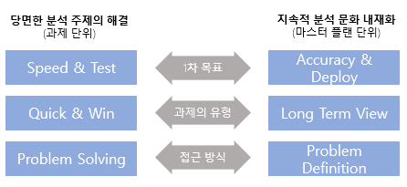

### 1. 분석 주제 유형

① Optimization(최적화)
- 분석대상이 명확하고, 분석 방법도 명확한 경우
- 개선을 통한 최적화
② Solution(솔루션)
- 분석대상은 명확하지만 분석방법은 명확하지 않은 경우
- 솔수션을 찾아내는 방식으로 수행
③ Insight(통찰)
- 분석대상은 명확하지 않지만, 분석방법이 명확한 경우
- 기존 분석 방법을 활용하여 새로운 지식 통찰
④ Discovery(발견)
- 분석대상이 명확하지 않고, 분석방법도 명확하지 않은 경우
- 발견 접근법으로 분석 대상 자체를 새롭게 도출

💡 분석 대상이 명확하게 무엇인지 모르는 경우에는 기존분석 방법을 활용해 **통찰**을 토출해냄으로써 문제의 도출 및 해결에 기여하거나 **발견** 접근법으로 분석 대상 자체를 새롭게 도출

### 2. 분석 기획시 고려사항
- 가용 데이터(Available Data)에 대한 고려
- 가치 창출을 위한 적절한 활용방안과 유즈케이스(Proper Business Use Case) 탐색 필요
- 분석 수행 시 발생하는 장애요소들에 대한 사전계획 수립 필요(Low Barrior Of Execution)

### 3. 정형 데이터 / 반정형 데이터 / 비정형 데이터
#### 정형 데이터 (Structued Data)
- 데이터 자체로 분석 가능
- RDB 구조의 데이터
- 데이터베이스로 관리
- DB로 정제된 데이터
- ERP, CRM, SCM 등 정보 시스템
- ex) Demand Forecasts

#### 반정형 데이터 (Semi-structured Data)
- 데이터로 분석이 가능하지만 해석이 불가능
- 메타정보를 활용해야 해석 가능
- 센서 중심으로 스트리밍되는 머신 데이터
- 로그 데이터, 모바일 데이터, 센싱 데이터
- ex) Competitor pricing

### 비정형 데이터 (Unstructured Data)
- 데이터 자체로 분석이 불가능
- 특정한 처리 프로세스를 거쳐 분석데이터로 변경 후 분석
- 영상, 음성, 문자
- email, 보고서, 소셜미디어 데이터
- ex) Email records

### 4. CRISP-DM
- 업무 이해(Business Understanding)
    - 프로젝트 목적과 요구사항 이해하는 단계
    - 도메인 지식을 데이터 분석을 위한 문제 정의
    - 업무 목적 파악, 상황 파악, 데이터 마이닝 목표 설정, 프로젝트 계획 수립
- 데이터 이해(Data Understanding)
    - 데이터 수집, 데이터 속성 이해
    - 인사이트 발견
    - 초기 데이터 수집, 데이터 기술 분석, 데이터 탐색, 데이터 품질 확인
- 데이터 준비(Data Preparation)
    - 분석 기법에 적합한 데이터를 편성
    - 분석용 데이터 셋 선택, 데이터 정제, 분석용 데이터 셋 편성, 데이터 통합, 데이터 포맷팅
- 모델링(Modeling)
    - 모델링 기법과 알고리즘 선택
    - 파라미터 최적화 단계
    - 과적합(Overfitting) 문제 확인
    - 모델링 기법 선택, 모델 테스트 계획 설계, 모델 작성, 모델 평가
- 평가(Evaluation)
    - 프로젝트 목적에 부합하는지 평가
    - 분석결과 평가, 모델링과정 평가, 모델 적용성 평가
- 전개(Deployment)
    - 실 업무에 적용
    - 유지보수 계획
    - 전개 계획 수립, 모니터링과 유지보수 계획 수립, 프로젝트 종료 보고서 작성, 프로젝트 리뷰

### 5. 빅데이터 분석 방법론 5단계
1\) 분석기획(Planning)
- 비즈니즈 도메인과 문제점을 인식, 분석 계획 및 프로젝트 수행계획을 수립하는 단계
- 프로젝트 범위 설정 → 데이터 분석 프로젝트 정의 → 프로젝트 수행계획 수립 → 데이터 분석 위험 식별

2\) 데이터 준비(Preparing)
- 비즈니스 요구사항과 데이터 분석에 필요한 원천 데이터 정의하고 준비하는 단계
- 필요 데이터 정의 → 데이터 스토어 설계 → 데이터 수집 및 정합성 점검

3\) 데이터 분석(Analyzing)
- 원천 데이터를 분석용 데이터 셋으로 편성하고 다양한 분석 기법과 알고리즘으로 데이터 분석하는 단계
- 주가적인 데이터 확보가 필요한 경우 데이터 준비 단계 피드백(Feedback)하여 두 단계 반복 진행
- 분석용 데이터 준비 → 텍스트 분석 → 탐색적 분석 → 모델링 → 모델 평가 및 검증 → 모델 적용 및 운영방안 수립

4\) 시스템 구현(Developing)
- 분석 기획에 맞는 모델 도출
- 운영 중인 가동 시스템에 적용하거나 시스템 개발을 위한 사전 검증으로 프로토타입 시스템 구현
- 설계 및 구현 → 시스템 테스트 및 운영

5\) 평가 및 전개
- 프로젝트 성과를 평가하고 정리하거나 모델의 발전 계획을 수립하여 분석 기획으로 전달하고 프로젝트 종료하는 단계
- 모델 발전 계획 수립 → 프로젝트 평가 및 보고

### 6. 기업의 합리적 의사결정을 가로막는 장애요소
- 고정 관념(Stereotype)
- 편향된 생각(Bias)
- 프레이밍 효과(Framing Effect)

### 7. 비즈니스 모델 캔버스 채널(Channel) 특징
- 기업이 제공하는 상품이나 서비스에 대한 고객의 이해를 높임
- 기업이 전달하는 밸류 프로포지션을 고객들이 평가할 수 있도록 함
- 고객이 특정한 상품이나 서비스를 구매하게 도와줌
- 고객에게 밸류 프로포지션을 전달
- 구매 고객에 대한 애프터 서비스 제공

### 8. 분석 과제 발굴 - 하향식 접근 방식 (Top Down Approach)
- 분석 과제가 주어지고 이에 대한 해법을 찾기 위해 각 과정이 체계적으로 단계화되어 수행하는 방식

1\) 문제 탐색(Problem Discovery)
- 문제를 해결함으로써 발생하는 가치에 중점
- 빠짐없이 문제를 도출하고 식별하는 것이 중요
- 문제를 해결함으로써 발생하는 가치에 중점을 두는 것이 중요
- 비즈니스 모델 캔버스는 문제 탐색 도구로 활용

2\) 문제 정의(Problem Definition)
- 비즈니스 문제를 데이터의 문제로 변환하여 정의하는 단계

3\) 해결방안 탐색(Solution Search)
- 분석역량(Who), 분석기법 및 시스템(How)으로 해결 방안 탐색

4\) 타당성 검토(Feasibility Study)
- 경제적 타당성, 데이터 및 기술적 타당성 검토 : 분석역량
- 도출된 분석 문제에 대한 대안을 과제화하기 위해 다각정 타당성 검토 필요
- 경제적 타당성은 비용대비 효익의 관점에서 평가
- 기술적 타당성 분석 시 적용 가능한 요소기술 확보 방안에 대한 사전 고려 필요

### 9. 문제 탐색 - 비즈니스 모델 캔버스

① 업무(Operation)
- 내부 프로세스 및 주요 자원(Resource)
- 생산 공정 최적화
- 재고량 최소화

② 제품(Product)
- 제품 · 서비스 개선
- 제품의 주요기능 개선
- 서비스 모니터링 지표도출

③ 고객(Customer)
- 제공하는 채널의 관점
- 고객 Call대기 시간 최소화
- 영업점 위치 최적화

④ 규제와 감사(Regulation $ Audit)
- 규제 및 보안의 관점에서 주제 도출
- 제공 서비스 품질의 이상 징후 관리
- 새로운 환경 규제 시 예상되는 제품 추출

⑤ 지원 인프라(IT & Human Resource)
- 인력의 관점
- EDW 최적화
- 적정 운영 인력 도출

### 10. 상향식 접근 방식 (Bottom Up Approach)
- 문제 정의 자체가 어려운 경우 데이터를 기반으로 문제의 지속적으로 개성하는 방식
- 기업이 보유하고 있는 다양한 원천 데이터로부터 분석을 통해 통찰력과 지식을 얻는 접근방법
- 다양한 원천 데이터를 대상으로 분석을 수행하여 가치있는 모든 문제를 도출하는 일련의 과정

### 11. 분석과제 정의
- 분석과제 정의서를 통해 분석별 필요 소스 데이터, 분석 방법, 데이터 입수 및 분석의 난이도, 분석 수행주기, 검증 오너십, 상세분석 과정 등의 정의

### 12. 분석 프로젝트 관리 방안
- 범위, 일정, 품질, 리스크, 의사소통 등 영역별 관리가 수행되어야 할 뿐 아니라 데이터에 기반한 분석 기법을 적용하는 특성으로 5가지 주요 속성을 고려한 추가적인 관리 필요

1\) Data Size
- 분석하고자 하는 데이터 양 고려

2\) Data Complexity
- 데이터에 잘 적용될 수 있는 분석 모델의 선정

3\) Speed
- 시나리오 측면에서의 속도 고려
- 분석 모델의 성능 및 속도를 고려한 개발 및 테스트 수행

4\) Analytic Complexity
- 해석이 가능하면서도 정확도를 올릴 수 있는 최적 모델을 찾는 방안을 사전에 모색

5\) Accuracy & Precision
- Accuracy : 모델과 실제 값 사이의 차이가 적다는 정확도
- Precision : 모델을 지속적으로 반복했을 때의 편차의 수준으로써 일관적으로 동일한 결과를 제시

💡 분석 프로젝트 관리
- 데이터 분석 모델의 품질을 평가하기 위해 SPICE를 활용
- 분석 프로젝트 관리는 KSA ISO 21500:2013을 가이드로 활용
- 분석 프로젝트의 최종 산출물이 보고서인지 또는 시스템인지에 따라 프로젝트 관리에 차이가 있음

💡 데이터 분석 과제에서 프로젝트 관리
- 분석 과제에는 많은 위험이 있어 사전에 위험을 식별하고 대응방안을 수립
- 분석과제는 적용되는 알고리즘에 따라 범위가 변할 수 있어 범위관리가 중요
- 분석과제에서 다양한 데이터를 확보하는 경우가 있어 조달관리 또한 중료

### 13. 마스터 플랜 수립 프레임워크
#### 이행계획 수립
- 반복적인 정련과정을 통해 프로젝트의 완성도를 높이는 방식을 주로 사용
- 순차적 : 데이터 수집 및 확보, 분석데이터 준비하는 단계
- 반복적 : 모델링 단계
- 프로젝스의 세부 일정 계획도 데이터 분석체계를 고려하여 작성

### 과제 우선순위 평가 기준
- 전략적 중요도, ROI, 실행 용이성은 분석과제 우선순위 결정에 고려할 사항
- 시급성과 전략적 필요성은 전략적 중요도의 평가 요소
- 적용 기술의 안전성 검증은 기술 용이성의 평가 요소

### 포트폴리오 사분면 분석

### 14. 목표시점별 분석 기획 방안

### 15. 데이터 거버넌스 체계
1\) 데이터 표준화
- 데이터 표준 용어 설정, 명명 규칙 수립, 메타 데이터 구축, 데이터 사전 구축
- 데이터 표준 용어는 표준 단어사전, 표준 도메인 사전, 표준 코드 등으로 구성
    - 상호 검증이 가능하도록 점검

2\) 데이터 관리 체계
- 데이터 정합성 및 활용의 효율성을 위하여 표준 데이터를 포함한 메타 데이터와 데이터 사전의 관리 원칙을 수립
- 메타데이터 관리, 데이터 사전관리, 데이터 생명주기 관리

3\) 데이터 저장소 관리(Repository)
- 메타데이터 및 표준 데이터를 관리하기 위한 전사 차원의 저장소를 구성
- 워크플로우 및 관리 응용 소프트웨어를 지원

4\) 표준화 활동
- 데이터 거버넌스 체계를 구축 후, 표준 준수 여부를 주기적으로 점검하고 모니터링 실기
- 거버넌스의 조직 내 안정적 정착을 위한 계속적인 변화 관리 및 주기적인 교육 진행

### 데이터 분석을 위한 조직구조
- 집중 구조
    - 전사 분석업무를 별도의 분석 전담 조직에서 담당
    - 전략적 중요도에 따라 분석 조직이 우선순위를 정해서 진행 가능
    - 현업 업무 부서의 분석 업무와 이중화/이원화 가능성 높음
- 기능 구조
    - 일반적인 분석 수행 구조
    - 별도 분석조직이 없고 해당 업무 부서에서 분석 수행
    - 전사적 핵심분석이 어려우며, 부서 현황 및 실적 통계 등 과거 실적에 국한된 분석 수행 가능성 높음
- 분산 구조
    - 분석조직 인력들을 현업부서로 직접 배치하여 분석업무 수행
    - 전사차원의 우선순위 수행
    - 분석결과에 따른 신속한 Action 가능
    - 베스트 프래틱스 공유 가능
    - 부서 분석 업무와 역할 분담 명확히 해야함(→ 업무과다 이원화 가능성)
