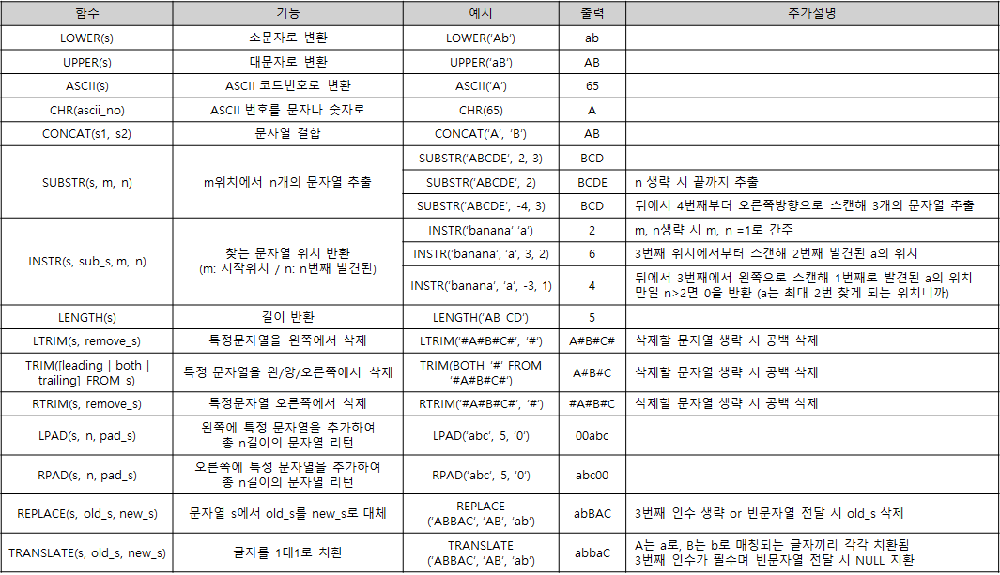
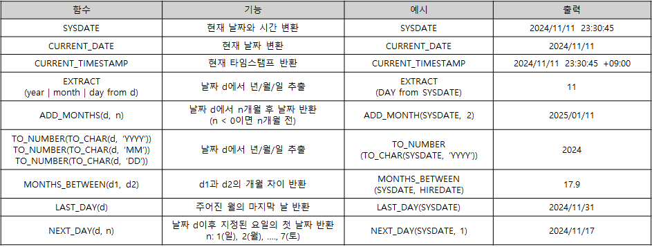
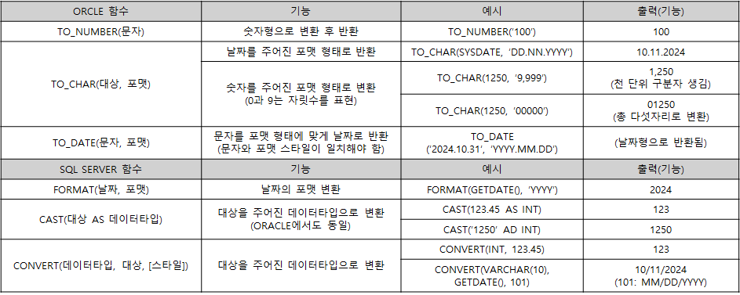
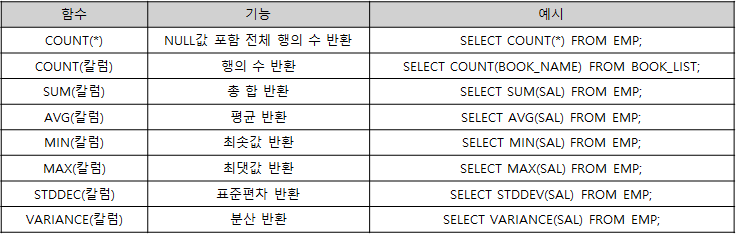
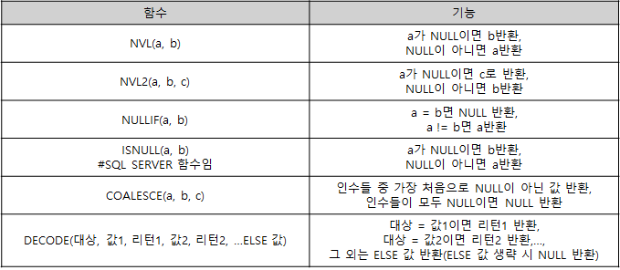
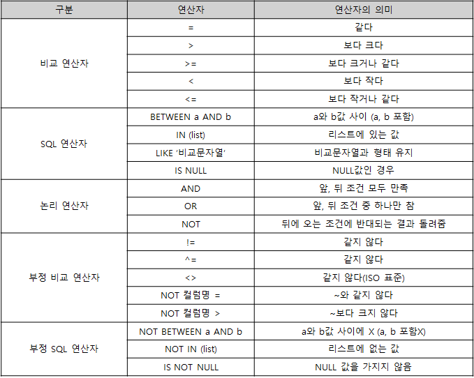

## 관계형 데이터베이스 개요
### 데이터베이스
- 넓은 의미 : 일상적인 정보들을 모아놓은 것 자체
- 일반적인 의미 : 특정 기업이나 조직 또는 개인이 필요에 의해 데이터를 일정한 형태로 저장해 놓은 것

### DBMS (Database Management System)
- 데이터를 효율적으로 관리하기 위한 시스템
- 데이터의 손상을 피하며 필요한 데이터를 복구해주는 시스템
    - ex) MySQL, ORACLE

### 데이터베이스 발전
- 1960년대
    - Flowchart 중심의 개발 방법 사용
    - 파일 구조를 통해 데이터를 저장과 관리(파일시스템)
- 1970년대
    - DB관리 기법이 처음 출현(태동)
    - 계층형(Hierarchical), 망형(Network) 데이터베이스 제품 상용화
- 1980년대
    - 관계형(Relational) 데이터베이스 상요화
    - Oracle, Sybase, DB2 등의 제품 사용
- 1990년대
    - Oracle, Sybase, Informix, DB2, Teradate, SQL Server외 많은 제품 출현
    - 객체 관계형 데이터베이스로 발전

### 관계형 데이터베이스(Relational Database, RDB)
- 1970년 영국 수학자 E.F.Codd 박사 논문에서 처음 소개
- 기업의 핵심 데이터는 대부분 관계형 데이터베이스로 저장되어 있음
- 관계형 데이터베이스는 SQL 문장에 의해 관리됨

```sql
SELECT a.학번, a.학생이름, b.과목명
FROM 학생 a
INNER JOIN 수강 b
ON a.학번 = b.학번
```

### 관계형 데이터베이스의 구성요소
- 계정
    - 데이터의 접근 제한을 위해 업무별/시스템별로 존대
    - 모든 테이블이 모든 유저들에게 조회되게 할 수는 없으니까)
- 테이블
    - DBMS의 데이터베이스 안에 데이터가 저장되는 형식
- 스키마
    - 테이블이 어떠한 구성으로 이루어져 있는지
    - 테이블의 기본적인 구조 정의

### 테이블
- 테이블
    - 행과 열의 2차원 구조를 가진 데이터 저장 객체(Object)
    - 관계형 데이터베이스의 기본 단위
    - 릴레이션이 곧 테이블
- 컬럼/열 (Field)
    - 더 이상 나눌 수 없는 특성
- 로우/행
    - 레코드(Record)
    - 튜플(Tuple)

### ⭐ 테이블의 특징
- 하나의 테이블은 반드시 하나의 유저(계정)가 소유해야 한다.
- 테이블 간 관계 1:1, 1:N, N:N
- 테이블명은 중복될 수 없으나, 소유자가 다르면 같은 이름으로 생성 가능
    - 같은 계정으로 동일한 이름을 가진 객체 생성 불가능
- 테이블은 행 단위로 데이터가 입력, 삭제되며 수정은 값의 단위

### SQL (Structured Query Language)
- 관계형 데이터베이스에서 데이터 정의, 조작, 제어를 위해 사용하는 언어
- SQL문법은 대,소문자 구분하지 않음
- 종류 : 데이터 조작어(DML), 데이터 정의어(DDL), 데이터 제어어(DCL), 트랜잭션 제어어(TCL)

#### 💡 SQL 실행단계

1\) 파싱(Parsing)
- 문법 확인 및 구문 분석을 통해 올바른 SQL문인지 확인
- 파싱이 끝나면, 분서된 SQL이 라이브러리 캐시(Library Cache)에 저장
- Library Cache: 이전에 실행된 SQL문에 대한 정보를 저장하는 곳

2\) 실행(Execution)
- 옵티마이저(Optimizer)가 생성한 최적의 실행 계획에 따라 SQL문 실행

3\) 인출(Fetch)
- 실행 결과를 데이터베이스에서 사용자에게 전송하는 과정

### 관계형 데이터베이스 특징
- 데이터의 분류, 정렬, 탐색 속도가 빠르다.
- 신뢰성이 높고, 데이터의 무결성 보장한다.
- 기존의 작성된 스키마를 수정하기 어렵다.
- 데이터베이스의 부하를 분석하는 것이 어렵다.

### 데이터 무결성 (Integrity)
- 데이터의 정확성과 일관성을 유지하고, 데이터에 결손과 부정함이 없음을 보증하는 것
- 데이터베이스에 저장된 값과 그것이 표현하는 현실의 비즈니스 모델의 값이 일치하는 정확성을 의미
- 데이터 무결성을 유지하는 것이 DBMS에 중요한 기능
- **다양한 제약조건(기본키, 외래키, NOT NULL 제약, UNIQUE 제약 등)을 통해 데이터의 무결성이 유지됨**

### 데이터 무결정 종류
① 개체 무결성 : 테이블의 기본키를 구성하는 컬럼(속성)은 NULL 값X, 중복값X

② 참조 무결성 : 외래키

③ 도메인 무결성 : 주어진 속성 값이 정의된 도메인에 속한 값이어야 함

④ NULL 무결성 : 특정 속성에 대해 NULL을 허용하지 않음

⑤ 고유 무결성 : 특정 속성에 대해 값이 중복되지 않음

⑥ 키 무결성 : 하나의 관계에는 적어도 하나의 키가 존재해야 함 (테이블이 서로 관계를 가진다면, 반드시 하나 이상의 조인키를 가짐)

### ⭐ Relational Model Constraints (제약조건)
<4대 제약 조건> <br/>
💡 3대는 키와 개체 무결성 제약을 합침

① 도메인 제약 (Domain Constraints)
- 속성(Attribute)에 대한 제약 

② 키 제약 (Key Constraints)
- 릴레이션(Relation)에 대한 제약(테이블)
- 테이블은 키(PK)를 가져야 한다.

③ 개체 무결성 제약 (Entity Integrity Constraints)
- 기본키(Primary Key)에 대한 제약
- 테이블이 가진 키는 자고로 이래야 한다는 제약
- PK는 UNIQUE하면서 NOT NULL이어야 한다.

④ 참조 무결성 제약 (Referential Integrity Constraints)
- 외래키(Foreign Key)에 대한 제약

### 도메인 제약
- 속성 값은 원자성(Atomicity)을 가지며 도메인에서 정의된 값이어야 함
- Composite Attribute와 Multivalued Attribute는 허용 X
    - 주소 = 시군구 + 상세주소
- NULL값은 허용됨 (NOT NULL이 아닌 속성이라면)

|학번|이름|나이|차량번호|취미|
|---|---|---|---|---|
|1234|홍길동|21|01가1234|체조|
|5678|강감찬|①고려|②|③축구,농구,배구|

① 도메인에서 정의된 값 위배<br/>
② NULL값 허용이라 괜찮음<br/>
③ Multivalued Attribute, 원자성 위배

### 키 제약
- 릴레이션의 모든 튜플은 서로 식별 가능해야 함

①
|이름|나이|혈액형|전공|
|---|---|---|---|
|홍길동|21|A|경영정보|
|강감찬|22|O|정보시스템|

- 잘목된 테이블
- 각 속성으로도 튜플 식별불가
- 4개의 속성을 복합식별자로 두어도 식별 불가
- PK가 없는 테이블 => 인조식별자 만들면 됨

②
|이름|나이|학번|주민번호|
|---|---|---|---|
|홍길동|21|1234|111-2222|
|강감찬|22|5678|333-4444|

- 문제 없는 릴레이션
- 후보키: 학번, 주민번호

### 개체 무결성 제약
- 기본키(PK)는 NOT NULL & UNIQUE

### 참조 무결성 제약
- 외래키(FK)
    - 릴레이션 R1이 릴레이션 R2를 참조하는 경우, R2의 기본키는 R1에서 외래키로 사용됨
    - 가져온 키의 필드명은 바꿀 수 있음
    - FK는 자기 자신이 속한 릴레이션을 참고할 수 있다.

[학생 R1]
|학번|이름|나이|소속|멘토|
|---|---|---|---|---|
|1234|홍길동|21|MIS||
|2345|강감찬|22|MIS|1234|
|3456|김유신|23|경영||
|4567|유관순|22|컴공|2345|

[학과 R2]
|학과|정원|위치|
|---|---|---|
|MIS|100|경상관|
|경영|200|경상관|
|컴공|100|공학관|
|수학|50|자연관|

💡 소속은 학과명을 참고, 멘토는 학번을 참고하고 있음

### ERD (Entity Relationship Diagram)
- 테이블 간 서로의 상관관계를 그림으로 도식화(표현)한 것
- 관계의 의미를 직관적으로 표현할 수 있는 수단
- 구성요소: 엔터티(Entity), 관계(Relationship), 속성(Attribute)
- 현실 세계의 데이터는 구성요소 3가지로 모두 표현이 가능

## SELECT문
### SQL 문장들의 종류
<table>
    <thead>
        <tr style="text-align: center;">
            <td>명령어 종류</td>
            <td>명령어</td>
            <td>설명</td>
        </tr>
    </thead>
    <tbody>
        <tr>
            <td rowspan="2" style="text-align: center;">데이터 조작어<br/>(DML; Data Manipulation Language)</td>
            <td style="text-align: center;">SELECT</td>
            <td>
                - 데이터를 조회, 검색하기 위한 명령어 <br/>
                - RETRIEVE 라고도 함
            </td>
        </tr>
        <tr>
            <td style="text-align: center;">INSERT<br/>UPDATE<br/>DELETE<br/>MERGE</td>
            <td>
                - 데이터에 변형을 가하는 명령어<br/>
                - ex) 데이터를 테이블의 새로운 행에 집어넣기<br/>
                - ex) 원하지 않는 데이터 삭제<br/>
                - ex) 데이터 수정
            </td>
        </tr>
        <tr>
            <td style="text-align: center;">데이터 정의어<br/>(DDL; Data Definition Language)</td>
            <td style="text-align: center;">CREATE<br/>ALTER<br/>DROP<br/>RENAME<br/>TRUNCATE</td>
            <td>
                - 테이블과 같은 데이터 구조를 정의하는 데 사용되는 명령어<br/>
                - 테이블의 구조를 생성, 변경, 삭제<br/>
                - 이름 바꾸기 등 데이터 구조와 관련된 명령어
            </td>
        </tr>
        <tr>
            <td style="text-align: center;">데이터 제어어<br/>(DCL; Data Control Language)</td>
            <td style="text-align: center;">GRANT<br/>REVOKE</td>
            <td>
                - 데이터베이스에 접근하고 객체들을 사용하도록 권한을 주고 회수하는 명령어
            </td>
        </tr>
        <tr>
            <td style="text-align: center;">트랜잭션 제어어<br/>(TCL; Transaction Control Language)</td>
            <td style="text-align: center;">COMMIT<br/>ROLLBACK<br/>SAVEPOINT</td>
            <td>
                - 논리적인 작업의 단위를 묶어서 DML에 의해 조작된 결과를 작업단위(트랜잭션) 별로 제어하는 명령어
            </td>
        </tr>
    </tbody>
</table>

⭐ DML : 사용자가 COMMIT 해야함 → ROLLBACK 가능<br/>
⭐ DDL : AUTO COMMIT → ROLLBACK 불가능

### SELECT 문의 구조
```SQL
SELECT * | 컬럼명 | 표현식
FROM 테이블명/뷰명
WHERE 조회조건
GROUP BY 그룹화 기준 컬럼명
HAVING 그룹핑 필터링 조건
ORDER BY 정렬 기준 컬럼명
```

> 💡 MySQL 쿼리 작성 순서<br/>
> SELECT → FROM → WHERE → GROUP BY → HAVING → ORDER BY<br/>
> 💡 MySQL 쿼리 처리 순서 / 논리적 실행 순서<br/>
> FROM → WHERE → GROUP BY → HAVING → SELECT → ORDER BY

### SELECT 절
- SELECT 문장을 사용해 불러올 컬럼명, 연산 결과를 작성하는 절
- \* : 테이블 내 모든 컬럼 조회
- 표현식 : 기존 컬럼명을 그래도 적는 것이 아닌 연삭식, 기존 컬럼의 함수 변형식

### AS
- SQL에서 별칭(Alias)을 만들 때 사용하는 키워드 (생략 가능)
- 별칭을 통해 출력할 컬럼이나 테이블에 임시로 이름을 부여할 수 있다.
- 별칭은 결과에만 적용되며, 실제 데이터베이스 테이블에는 영향X

### AS의 특징 / 주요사항
- **SELECT문보다 늦게 사용되는 ORDER BY정에서만 컬럼 별칭 사용 가능**
    - HAVING이나 WHERE절에서 사용 시 에러 발생
- ⭐ 오라클에서 테이블 별칭을 명시할 때 AS를 사용할 수 없다.
- 이미 존재하는 예약어로는 당연히 사용 불가
    - ex) SELECT, AVG 등
- 경우에 따라 큰따옴표("")를 사용 (역따옴표도 가능)
    - 공백포함
    - 특부문자 포함(_, $, #는 제외)
    - 별칭 그대로 전달하고자 할 때

### SELECT [ALL/DISTINCT]
- ALL
    - 디폴트 옵션 → 별도 포시하지 않아도 됨
    - 중복된 데이터가 있어도 모두 출력
- ⭐DISTINCT
    - 중복된 데이터의 경우, 1건으로 처리해서 출력

### FROM절
- 데이터를 불러올 테이블명이나 뷰명 전달
- 여러 테이블 전달 가능(컴마로 구분)
- 여러 테이블 사이에 JOIN 조건이 존재하지 않다면, SQL은 두 테이블의 모든 가능한 조합을 생성(Cartesian Product)
- 테이블도 별칭 선언 가능
    - ORACLE은 AS 사용 불가
    - SQL Server는 사용/생략 가능
- **테이블에 별칭 사용시, 해당 테이블을 참조할 때 반드시 별칭을 사용해야 한다.**
- **ORACLE에서는 FROM절 생략 불가** (Oracle 23c 부터는 가능)
    - 의미상 테이블이 필요 없다면 DUAL 테이블 선언
- SQL Server에서는 FROM 정리 필요 없다면 생략 가능

### SQL문 작성 시 주의사항
- 문자 상수나 날짜 상수 표현 시 홀따옴표 사용
- ORACLE은 문자 상수의 경우 대소문자를 구분
- MSSQL은 기본적으로 문자 상수의 대소문자를 구분X
- MySQL은 비교나 검색을 수행할 때 기본적으로 대소분자 구분없이 비교 및 검색이 가능

## 함수
### 함수
- 입력값을 받아 처리하고 결과(출력값)를 반환

① 단일행 함수 (Single-Row Functions)
- 하나의 입력 값에 대해 하나의 결과를 반환하는 함수 (1:1관계)
    - **각 행들에 대해 개별적으로 작용하여 데이터 값들을 조작하고, 각 행에 대한 조작 결과를 반환한다**는 뜻
- 주로 데이터 변환이나 조작에 사용
- 보통 SELECT, WHERE, ORDER BY절에서 사용
- 함수 중첩 가능
    - ex) UPPER(CONCAT(first_name, '', last_name))

```SQL
SELECT UPPER(name), SUBSTRING(name, 1, 3)
FROM EMPLOYEE
WHERE LENGTH(name) > 5
ORDER BY LOWER(name);
```

② 복수행 (다중행) 함수 (Multi-Row Functions)
- **여러 행의 데이터를 하나의 결과값으로 반환**하는 함수
- 주로 합계, 평균, 개수, 최대/최소 값 등을 계산하는 데 사용
- 이런 집계를 목적으로 하는 함수들이 GROUP BY와 잘 어울려져 사용됨
- 보통 SELECT, HAVING 정에서 사용 (ORDER BY 절에서도 사용 가능)

```SQL
SELECT department, AVG(salary) AS average_salary
FROM EMPLOYEE
GROUP BY department
HAVING AVG(salary) > 3000
ORDER BY average_salart DESC;
```

💡 합성 연산
```SQL
-- (1) || (Oracle)
SELECT FIRST_NAME || ' ' || LAST_NAME AS FULL_NAME
FROM EMPLOYEES;
-- (2) + (SQL Server)
SELECT FIRST_NAME + ' ' + LAST_NAME AS FULL_NAME
FROM EMPLOYEES;
-- (3) CONCAT
SELECT CONCAT('Hello, ', 'World!') AS greeting;
```

💡 숫자형 함수 모음: 단일행 함수


💡 문자열 함수 모음 (ORACLE): 문자열 결합, 추출, 삭제, 단일행 함수


- SQL SERVER
    - SUBSTR → SUBSTRING
    - LENGTH → LEN
    - INSTR → CHARINDEX

💡 날짜형 함수 모음 (ORACLE): 단일행 함수


- DBMS마다 날짜 출력 형식은 다르다.
- SQL SERVER
    - SYSDATE → GETDATE()
    - EXTRACT(year|month|day from d) → DATEPART(year|month|day, d)
    - ADD_MONTHS(d, n) → DATEADD(year|month|dat, d, n)월 뿐만이 아니라 모든 날짜 단위 연산이 가능하다.
    - TO_NUMBER(TO_CHAR(d, 'YYYY' | 'MM' | 'DD')) → YEAR(d), MONTH(d), DAY(d)
    - MONTHS_BETWEEN(d1, d2) → DATEDIFF(year|month|day, d1, d2)

💡 변환 함수 모음: 단일행 함수


- 일반적인 데이터 형식 변환에는 CAST를 사용할 수 있지만, 날짜 및 시간 변환 시 특정 형식을 요구하는 경우에는 CONVERT를 사용하는 것이 좋다.

💡 집계 함수 모음: 복수행(다중행) 함수, NULL값은 으로 계산되는 것이 아니라 무시


- MAX(), MIN()은 날짜형 데이터에도 사용이 가능
    - ex) MAX(ORDER_DATE) : 가장 최근 주문 날짜 반환
- SQL SERVER
    - STDDEV → STDEV
    - VERIANCE() → VAR()

💡⭐ NULL 관련 함수 및 기타 함수 모음 (ORACLE)


### CASE 표현
- 일반 프로그램의 IF-THEN-ELSE-END 로직과 같음
- ORACLE의 DECODE() 함수와 같은 기능을 가짐

① SIMPLE_CASE_EXPRESSION : 특정 값과의 일치 평가
```SQL
CASE expression
    WHEN value1 THEN result1
    WHEN value2 THEN result2
    ELSE default_result
END
```

```SQL
-- ex) 직원 직업에 따른 부서 할당
SELECT
    CASE JOB
        WHEN 'Manager' THEN 'Management'
        WHEN 'Developer' THEN 'Engineering'
        WHEN 'Sales' THEN 'Saled Departmant'
        ELSE 'General'
    END AS DEPARTMENT
FROM EMPLOYEES;
```

② SEARCHED_CASE_EXPRESSION : 개별 조건 평가
```SQL
CASE
    WHEN condition1 THEN result1
    WHEN condition2 THEN result2
    ELSE default_result
END
```

```SQL
-- ex) 상품 가격에 따른 퀄리티 구분
SELECT
    CASE
        WHEN PRICE > 50000 THEN 'High'
        WHEN PRICE > 30000 THEN 'Medium'
        ELSE 'Low'
    END AS Quality
FROM PRODUCTS;
```

```SQL
-- ex) 총 주문 상품량에 따른 고객별 등급 구분
SELECT
    CUSTOMER_ID,
    TOTAL_ORDER,
    CASE
        WHEN TOTAL_ORDER >= 100000 THEN 'VIP'
        WHEN TOTAL_ORDER >= 50000 THEN 'S'
        WHEN TOTAL_ORDER >= 20000 THEN 'A'
        ELSE 'B'
    END AS CUSTOMER_GRADE
FROM CUSTOMERS;
```

## WHERE문
### 특징
- 테이블의 데이터 중 원하는 조건에 맞는 데이터만 조회하고 싶을 때 사용 (엑셀의 필터기능 같은 것)
- 조건을 설정하여 원하는 데이터만 검색하기 위해 사용하는 절
- 여러 조건 동시 전달도 가능(AND나 OR로 조건 연결)
- **NULL은 '='로 조회가 불가능**
- **IS NULL/IS NOT NULL을 사용**
- 조건 전달 시 비교 대상끼리 데이터 타입이 일치하는 것이 좋음
    - 숫자 데이터 타입을 문자 상수로 비교 시 성능 문제 발생 가능
- **집계 함수 사용 불가**

### WHERE절 구문
```SQL
SELECT [DISTINCT|ALL] 칼럼명 [ALIAS명]
FROM 테이블명
WHERE 조건식;
```

### 주의
- **집계함수는 WHERE 절에서의 사용이 불가능**
- WHERE 절은 각 행을 개별적으로 필터링하기 때문에 여러 행의 데이터를 요약하여 하나의 결과를 생성하는 집계함수의 사용이 불가능한 것.
- GROUP BY를 통해 그룹화된 결과에 대한 조건을 적용할 때, 집계합수를 조건절에 사용할 수 있게 된다.
- 해당 조건은 HAVING 절에 넣어주면 된다.
```SQL
GROUP BY department
HAVING AVG(salary) > 3000
```



💡 연산자의 우선순위
① 괄호

② 부정 연산자(NOT 연산자)

③ 비교 연산자, SQL 연산자

④ AND

⑤ OR

### WHERE과 논리 연산자
```SQL
-- 마케팅부이며 급여를 300만원 이상으로 받는 사원
SELECT 사원번호, 이름, 연락처
FROM EMPLOYEES
WHERE 부서 = '마케팅부' AND 급여 >= 3000000;
```

```SQL
-- 출판사가 민음사이거나 가격이 15000원 미만인 책 조회
SELECT * FROM BOOKSHELF
WHERE PUBLISHER = '민음사' OR PRICE < 15000;
```

### WHERE과 IN
- 특정 컴럼의 값이 지정된 목록 중에서 일치하는 값이 있는지 확인
- OR 사용해 표현이 가능하지만 IN을 사용하면 쿼리가 훨씬 간결해짐
- **IN은 NULL 값을 무시**
- NOT IN은 IN 반대 연산자로, 목록에 없는 값을 필터링

```SQL
-- 개발부이거나 영업부이거나 마케팅부인 사원 조회
SELECT * FROM EMPLOYEES
WHERE 부서 IN ('개발부', '영업부', '마케팅부');

SELECT * FROM EMPLOYEES
WHERE 부서 = '개발부' OR 부서 = '영업부' OR 부서 = '마케팅부';
```

```SQL
-- 개발부나 영어부, 마케팅부가 아닌 사원 조회
SELECT * FROM EMPLOYEES
WHERE 부서 NOT IN ('개발부', '영업부', '마케팅부');
```

```SQL
-- 직업이 MANAGER이면서 20번 부서에 속하거나
-- 직업이 CLERK이면서 30번 부서에 속하는 사원 조회
SELECT ENAME, JOB, DEPTNO
FROM EMP
WHERE (JOB, DEPTNO) IN (('MANAGER', 20), ('CLERK', 30));
```

```SQL
-- 직업이 MANAGER이거나 CLERK이면서
-- 20번이나 30번 부서에 속하는 사원 조회
SELECT ENAME, JOB, DEPTNO
FROM EMP
WHERE JOB IN ('MANAGER', 'CLERK') AND DEPTNO IN (20, 30);
```

### WHERE과 BETWEEN A AND B
- A보다 크거나 같고 B보다 작거나 같은 조건을 만족 (반드시 A < B)
- A와 B에는 범위로 묶을 상수값 전달(숫자, 문자, 날짜 모두 가능)

```SQL
-- 가격이 15000원 이상이며 20000원 이하인 책 정보 조회
SELECT * FROM BOOKSHELT
WHERE PRICE BETWEEN 15000 AND 20000;

SELECT * FROM BOOKSHELT
WHERE PRICE NOT BETWEEN 15000 AND 20000;
```

```SQL
-- 가격이 15000원 이상이며 20000원 이하가 아닌 책 정보 조회
SELECT * FROM BOOKSHELT
WHERE PRICE NOT BETWEEN 15000 AND 20000;
```

### WHERE과 LIKE (LIKE 연산자는 대소문자 구분함)
- LIKE는 특정 패턴과 일치하는 데이터를 조회할 때 사용
- 주도 와일드카드와 함께 사용되어 부분적으로 일치하는 문자열을 찾음

💡 와일드카드
- % : **0개 이상의 문자**를 대체 = 해당 위치에 몇 글자던 올 수 있음
- _ : **딱 1개의 문자**만을 대체 = 해당 위치에 반드시 한 글자만 올 수 있음

### WHERE과 IS NULL
- **NULL값과의 수치연산은 NULL값 리턴**
- **NULL값과의 비교연산은 거짓을 리턴**
- 비교연산자 '=', '<', '>', 사용 시 WHERE 절의 조건이 FALSE가 되어 WHERE 절의 조건을 만족하는 데이터를 한 건도 얻지 못하게 됨
- 어떤 값과 비교할 수 없으며, 특정 값보다 크다, 적다라고 표현 불가

```SQL
-- 포지션이 없는 선수 조회
SELECT PLAYER_NAME, TEAM_NAME
FROM PLAYER
WHERE POSITION IS NULL;
```

## GROUP BY와 HAVING 절
### GROUP BY 절
- 데이터들을 작은 그룹으로 분류하여 소그룹에 대한 항목별 통계 정보를 얻을 때 사용
    - ex) 각 팀별 선수들의 평균 신장, 카테고리별 총 매출, 부서별 사원 수 등
- 각 행을 특정 조건에 따라 그룹으로 분리하여 계산하도록 함
- **그룹 관련 조건은 WHERE 절에서 사용 불가, HAVING 절에서 사용**
- SELECT 절에 집계함수를 사용해서 그룹별 연산 결과를 표현하도록 함
- **별칭(ALIAS) 사용 불가능**
    - 컬럼 별칭은 SELECT 절에서 정의되어 SELECT 구문이 실행될 때 만들어지는 이름이라 SELECT 이전에 실행되는 단계인 GROUP BY나 WHERE 절에서는 사용이 불가능
- 성능 저하를 막기 위해 그룹 연산에서 필요가 없는 데이터는 미리 WHERE 절을 통해 제외
- 여러 컬럼을 기준으로 그룹화하는 것도 가능

### GROUP BY 주의
- **GROUP BY로 그룹화를 한 이후에는 그룹화 기준이 아닌 컬럼을 SELECT 절에 사용할 수 없다.**

```SQL
SELECT POSITION, COUNT(*) 인원수, HEIGHT -- 오류
FROM PLAYER
GROUP BY POSITION;
```

- 포지션별로 묶어 각 포지션별 인원수와 키를 출력하라
    - 각 포지션별 키는 단 하나의 값이 아니라 여러 값이 존재
- 그룹으로 묶인 상태라 그룹별 하나의 행을 반환해야 하는데 키 값은 여러 개니 에러 발생
    - SQL 엔진 입장에서 많은 키 값 중 하나만 콕 집어서 반환할 수 없음

```SQL
SELECT POSITION, COUNT(*) 인원수, ROUND(AVG(HEIGHT), 2) 평균키
FROM PLAYER
GROUP BY POSITION;
```

- **그룹화되지 않은 컬럼을 사용하고 싶다면 집계함수를 통해 각 그룹에서 해당 컬럼을 요약해야 한다.**

### HAVING 절
- 그룹화된 결과에 대한 조건을 적용할 때 사용하는 절
- HAVING 절이 GROUP BY 절 앞에 위치해도 되나, 논리적 실행 순서에 맞게 GROUP BY 뒤에 쓰는 것을 권장
- HAVING 절이 SELECT 절보다 먼저 수행되니 SELECT 절에서 선언된 ALIAS 사용 불가

```SQL
-- 특정 팀('K03', 'K09')에 속한 선수들의 팀별 총 인원 수를 조회
-- 단, 각 팀의 평균 연봉(SALARY)이 25000을 초과하는 경우만
SELECT TEAM_ID ID, COUNT(*)
FROM PLAYER
WHERE TEAM_ID IN ('K03', 'K09')
GROUP BY TEAM_ID
HAVING AVG(SALARY) > 25000;
```

### GROUP BY 절과 HAVING 절의 특성 정리
- GROUP BY 절을 통해 소그룹별 기분을 정한 후, SELECT 절에 집계 함수를 사용한다.
- 집계 함수의 통계 정보는 NULL 값을 가진 행을 제외하고 수행한다.
- ALIAS 명을 사용할 수 없다.
- 집계 함수는 WHERE 절에는 올 수 없다.
- WHERE 절은 전체 데이터를 GROUP으로 나누기 전에 행동을 미리 제거한다.
- HAVING 절은 GROUP BY 절의 기준 항목이나 소그룹의 집계 함수를 이용한 조건을 표시할 수 있다.
- GROUP BY 절에 의해 소그룹별로 만들어진 집계 데이터 중, HAVING 절에서 제한조건을 두어 조건을 만족하는 내용만 출력한다.
- HAVING 절은 일반적으로 GROUP BY 절 뒤에 위치한다.

### DUAL 테이블의 특성
- 23c이전 버전의 오라클에서는 SELECT 문 작성시 FROM 절 필수
- 데이터를 가져올 테이블이 필요 없는 경우 DUAL 테이블을 사용
    - Sybase나 SQL Server의 경우 SELECT 절만으로도 수행 가능
- 사용자 SYS가 소유하며 모든 사용자가 액세스 가능한 테이블
    - SYS: DB 관리자 계정
- SELECT ~ FROM ~ 의 형식을 갖추기 위한 일종의 DUMMY 테이블
- DUMMY라는 문자열 유형의 칼럼에 'X'라는 값 1건 포함

## ORDER BY 절
### ORDER BY 절
- 원칙적으로 관계형 데이터베이스 환경에서는 ORDER BY 절을 명시해야 데이터 정렬이 수행된다.
- ORDER BY 뒤에 정렬의 기준이 되는 컬럼을 명시하면 된다.
    - 여러 컬럼이 기준 시, 가장 왼쪽 컬럼부터 우선순위 결정
- 정렬 순서: ASC(오름차순), DESC(내림차순) / 기본 값: ASC
- **유일하게 SELECT 절에 정의한 컬럼 별칭 사용 가능**
- 숫자 뿐만이 아니라 문자, 날짜 타입도 절렬 가능
- 날짜의 가장 작은 값은 가장 과거인 날짜
- 문자 데이터의 경우 첫 번재 문자가 같은 값이면, 두 번째 값을 기준으로 정렬한다.
- **ORACLE에서 NULL은 최대값, SQL Server에서는 최소값**
- ORACLE은 ORDER BY 절에 NULL LAST | NULL FIRST 을 명시해 NULL의 정렬 순서 변경 가능
- **GROUP BY로 그룹화를 했을 시 ORDER BY에 올 수 있는 컬럼은 SELECT 절에 있는 컬럼만 가능**

## 조인 (JOIN)
- 여러 테이블의 데이터를 동시에 출력하거나 참조할 때 사용한다.
- 여러 테이블을 연결하거나 결합하여 하나의 결과 집합으로 만드는 방법
- 여러 테이블에 나뉘어 있는 관련 데이터를 하나의 조합 결과로 모음
- **일반적인 경우 행들은 PK나 FK 값의 연관에 의해 조인이 성립**된다.
    - 어떤 경우에는 PK, FK 관계가 없어도 논리적인 값들의 연관만으로 조인이 성립된다.
- FROM 절0에 여러 테이블이 나열되더라도 SQL에서 데이터를 처리할 때는 **단 2개의 집합 간에만 조인**이 일어난다.
    - FROM A, B, C라면 A JOIN B가 먼저 실행되고 A JOIN B 결과 집합과 C와의 조인이 일어나는 것
- **여러 테이블을 조인 시, SELECT 절에 적는 컬럼은 해당 컬럼이 어느 테이블에 존재하는 컬럼인지 명시**
    - 같은 이름의 컬럼이 다른 테이블에도 존재할 수 있기 때문
    - 가독성이나 유지보수성 높이기 위해서도 명시
- ORACLE 표준과 ANSI/ISO SQL 표준이 다르다.
- 가독성을 높이기 위해 테이블에 별칭을 붙이는 경우가 많다.
    - **N개의 테이블 조인 시 최소 N-1개의 조인 조건 필요**

### 조인의 종류
① 조건의 형태에 따른 구분
- EQUI JOIN : 조인 조건이 동등(=) 조건일 경우
- NON EQUI JOIN : 조인 조건이 동등 조건이 아닌 경우

② 조인 결과에 따른 구분
- INNER JOIN : 두 테이블 간 조인 조건이 일치하는 데이터만 출력
- OUTER JOIN : 두 테이블 간 조인 조건이 일치하지 않는 데이터도 출력(LEFT / RIGHT / FULL OUTER JOIN)

③ NATURAL JOIN
- 두 테이블에서 같은 이름을 가진 컬럼을 자동으로 찾아 조인

④ CROSS JOIN
- **두 테이블의 모든 조합을 생성하는 조인**(Cartesian Producr 반환)
- ORACLE: FROM t1, t2 + WHERE 절에 조건 명시하지 않을 시 발생
- ANSI: t1 CROSS JOIN t2 + on으로 조인 조건 명시 X

⑤ SELF JOIN
- 같은 테이블을 두 번 이상 참조하는 조인

### EQUI JOIN
- 등가(EQUI) JOIN은 2개의 테이블 간에 컬럼 값들이 서로 정확하게 일치하는 경우에 사용되는 방법
- PK ↔ FK 관계를 기반
    - 반드시 PK ↔ FK의 관계로만 EQUI JOIN이 성립한다는 것이 아님
- ORACLE: 조인 조건을 **WHERE절**
- ANSI/ISO SQL: 조인 조건을 **ON절**

```SQL
-- ORACLE
SELECT 테이블1.칼럼, 테이블2.칼럼, ...
FROM 테이블1, 테이블2
WHERE 테이블1.칼럼 = 테이블2.칼럼;

-- ANSI/ISO SQL
SELECT 테이블1.칼럼, 테이블2.칼럼, ...
FROM 테이블1
INNER JOIN 테이블2
ON 테이블1.칼럼 = 테이블2.칼럼;
```

```SQL
-- ORACLE
SELECT P.PLAYER_NAME 선수명, P.BACK_NO 등번호, P.TEAM_ID 팀코드, T.TEAM_NAME 팀명, T.REGION_NAME 연고지
FROM PLAYER P, TEAM T
WHERE P.TEAM_ID = T.TEAM_ID;

-- ANSI/ISO SQL
SELECT P.PLAYER_NAME 선수명, P.BACK_NO 등번호, P.TEAM_ID 팀코드, T.TEAM_NAME 팀명, T.REGION_NAME 연고지
FROM PLAYER P
INNER JOIN TEAM T
ON P.TEAM_ID = T.TEAM_ID;
```

#### 💡 데이터 필터링 조건도 WHERE절에 명시
```SQL
-- ORACLE
SELECT P.PLAYER_NAME 선수명, P.BACK_NO 등번호, T.TEAM_NAME 팀명
FROM PLAYER P, TEAM T
WHERE P.TEAM_ID = T.TEAM_ID
AND P.POSITION = 'GK'
ORDER BY P.BACK_NO;

-- ANSI/ISO SQL
SELECT P.PLAYER_NAME 선수명, P.BACK_NO 등번호, T.TEAM_NAME 팀명
FROM PLAYER P
INNER JOIN TEAM T
ON P.TEAM_ID = T.TEAM_ID
WHERE P.POSITION = 'GK'
ORDER BY P.BACK_NO;
```

- 만약 테이블에 ALIAS를 적용했을 경우, 다른 SELECT, WHERE 등의 절에서도 본래 테이블명이 아닌 ALIAS를 사용해야만 함
```SQL
-- ORACLE
SELECT PLAYER.PLAYER_NAME 선수명, T.TEAM_NAME 팀명 -- 오류
FROM PLAYER P, TEAM T
WHERE P.TEAM_ID = T.TEAM_ID;
```

### NON EQUI JOIN
- 비등가(NON EQUI) 조인은 2개의 테이블 간에 컬럼 값들이 서로 정확하게 일치하지 않는 경우에 사용
    - "=" 연산자가 아닌 다른(BETWEEN, <, <=, >, >= 등) 연산자들을 사용하여 조인을 수행하는 것
- 대부분 비등가 조인을 수행할 수 있으나, 때로는 설계상의 이유로 수행이 불가능함

```SQL
-- ORACLE
SELECT 테이블1.칼럼, 테이블2.칼럼, ...
FROM 테이블1, 테이블2
WHERE 테이블1.칼럼 BETWEEN 테이블2.칼럼 AND 테이블2.칼럼;

SELECT 테이블1.칼럼, 테이블2.칼럼, ...
FROM 테이블1, 테이블2
WHERE 테이블1.칼럼 >= 테이블2.칼럼
AND 테이블1.칼럼 <= 테이블2.칼럼;
```
#### EX) 사원에 따른 급여 등급 출력
① 사원(EMP)테이블
|ENAME|SAL|
|---|---|
|SMITH|800|
|ALLEN|1600|
|WARD|1250|
|JOINES|2975|
|MARTIN|1280|
|KING|8000|

② 급여등급(SALGRADE) 테이블
|GRADE|LOSQL|HISAL|
|---|---|---|
|1|800|1200|
|2|1201|1400|
|3|1401|2000|
|4|2001|3000|
|5|3001|9999|

```SQL
-- ORACLE
SELECT E.ENAME 사원명, E.SAL 급여, S.GRADE 급여등급
FROM EMP E, SALGRADE S
WHERE E.SQL BETWEEN S.LOSAL AND S.HISAL;
```
|사원명|급여|급여등급|
|---|---|---|
|SMITH|800|1|
|ALLEN|1600|3|
|WARD|1250|2|
|JOINES|2975|4|
|MARTIN|1280|2|
|KING|8000|8|

### 3개 이상의 테이블 조인
- 관계를 잘 파악해서 모든 테이블이 연결되도록 조인 조건 명시
- 3개의 테이블 조인이면 최소 2개의 조인 조건 필요
```SQL
-- ORACLE
SELECT P.PLAYER_NAME, P.POSITION, T.REGION_NAME, T.TEAM_NAME, S.STADIUM_NAME
FROM PLATER P, TEAM T, STADIUM S
WHERE P.TEAM_ID = T.TEAM_ID
AND T.STADIUM_ID = S.STADIUM_ID;

-- ANSI/ISO SQL
SELECT P.PLAYER_NAME, P.POSITION, T.REGION_NAME, T.TEAM_NAME, S.STADIUM_NAME
FROM PLATER P
INNER JOIN TEAM T ON P.TEAM_ID = T.TEAM_ID
INNER JOIN STADIUM S ON T.STADIUM_ID = S.STADIUM_ID;
```

### SELF JOIN
- 동일 테이블 사이의 조인
- FROM 절에 동일 테이블이 2번 이상 나타나게 되니 식별을 위해 **반드시 테이블 ALIAS 사용**

#### EX)
|EMP_ID|NAME|MGR_ID|
|---|---|---|
|100|KING||
|101|ALLEN|100|
|102|WARD|100|
|103|JONES|102|
|104|MARTIN|101|
|105|SMITH|103|

```SQL
-- ORACLE
SELECT E1.EMP_ID, E1.NAME, E1.MGR_ID, E2.EMP_ID  E2.NAME
FROM EMPLOYEES E1, EMPLOYEES E2
WHERE E1.EMP_ID = E2.EMP_ID
```
|EMP_ID|NAME|MGR_ID|EMP_ID|NAME|
|---|---|---|---|---|
|101|ALLEN|100|100|KING|
|102|WARD|100|100|KING|
|103|JONES|102|102|WARD|
|104|MARTIN|101|101|ALLEN|
|105|SMITH|103|103|JONED|

- INNER JOIN(EQUI JOIN)이라 MANAGER_ID가 NULL인 사장 KING은 조건에 맞지 않으니 제외됨
- 조인 조건이 일치하지 않는 데이터들도 출력하고 싶을 때는 OUTER JOIN을 사용해야 한다.

## 표준 조인
### 표준 조인 (STANDARD JOIN)
- ANSI 표준으로 작성되는 INNER/CROSS/NATURAL/OUTER JOIN

### 순수 관계 연산자
- SELECT 연산 → WHERE 절로 표현
- PROJECT 연산 → SELECT 절로 구현
- (NATURAL) JOIN 연산 → 다양한 JOIN 기능으로 구현
- DIVIDE 연산 → 현재 사용 X

### INNER JOIN (교집합)
- 내부 JOIN이라고 하며, JOIN 조건이 일치하는 행만 반환
- ORABLE 조인의 기본
- ANSI 표준에서는 USING 조건절이나 ON 조건절이 필수

```SQL
-- 겹치는 컬럼명에만 테이블 출처 명시한 상태
-- ORACLE
SELECT EMP.DEPTNO, EMPNO, ENAME, DNAME
FROM EMP, DEPT
WHERE EMP.DEPTNO = DEPT.DEPTNO;

-- ANSI
SELECT EMP.DEPTNO, EMPNO, ENAME, DNAME
FROM EMP
INNER JOIN DEPT -- JOIN으로 생략 가능
ON EMP.DEPTNO = DEPT.DEPTNO;
```

### USING 조건절 (괄호 필수)
- 조인할 **양 컬럼의 컬럼명이 같을 경우** 사용
- **ALIAS 사용불가, 출처 테이블 명시 불가**
- USING 절의 기준 컬럼은 식별자르 가질 수 X
- SQL Server에서는 지원X
- SELECT * FROM을 하면, USING 조건절의 기준 컬럼이 1번째 출력 컬럼이 된다.

### NATURAL JOIN
- 두 테이블 간의 동일한 이름을 갖는 모든 컬럼들에 대해 EQUI JOIN 수행
- JOIN에 사용되는 컬럼들이 **동일한 이름, 같은 데이터형, 같은 데이터 성격(도메인)**이어야 한다.
- NATURAL JOIN이 명시되면, 추가로 USING절, ON절, WHERE절에서 JOIN 조건을 정의할 수 없다.
- SQL Server에서는 지원X
- **JOIN에 사용된 컬럼들은 ALIAS나 테이블명(접두사) 사용 불가**
- **여러 개의 컬럼명이 동일한 경우, 동일한 이름을 가진 모든 컬럼의 값이 같아야 JOIN된다.**
- **NATURAL JOIN은 JOIN에 사용된 같은 이름의 컬럼을 하나로 처리**
    - 중복된 컬럼 중 하나만 결과에 포함
- JOIN되는 컬럼이 NULL값을 가지면 일치한다고 볼 수 없다.

#### EX) JOIN되는 컬럼이 NULL값을 가지면 일치한다고 볼 수 없다.
① TABLE1
|NO|NAME|
|---|---|
|1|A|
|2|B|
|NULL|C|

② TABLE2
|NO|POS|
|---|---|
|1|탑|
|2|미드|
|1|정글|
|NULL|서포터|

③ NATURAL JOIN
|NO|NAME|POS|
|---|---|---|
|1|A|탑|
|1|A|정글|
|2|B|미드|

- SELECT * FROM을 하면, NATURAL JOIN의 기준 컬럼이 1번째 출력 컬럼이 된다.

```SQL
-- OK
SELECT DEPTNO, EMP.EMPNO, EMP.ENAME, DEPT.DNAME
FROM EMP
NATURAL JOIN DEPT;

-- OK
SELECT DEPTNO, EMPNO, ENAME, DNAME
FROM EMP
NATURAL JOIN DEPT;

-- 오류 : NATURAL JOIN에 사용된 열은 식별자를 가질 수 X (DEPT.DEPTNO)
SELECT DEPT.DEPTNO, EMPNO, ENAME, DNAME
FROM EMP
NATURAL JOIN DEPT;
```

### CROSS JOIN
- E.F.CODD 박사가 언급한 일반 집합 연산자의 PRODUCT 개념
- **테이블 간 JOIN 조건이 없는 경우 생길 수 있는 모든 데이터의 조합**
    - CARTESIAN PRODUCT, 카티시안 곱 출력
- 양쪽 테이블의 데이터 수끼리 곱한 만큼의 데이터 조합 발생(**M*N**)
    - TABLE1(3건) * TABLE2(3건) => 총 9건의 데이터 조합 발생

#### EX1
① TABLE1
|X1|X2|
|---|---|
|a|12|
|b|3|
|NULL|8|

② TABLE2
|X1|X2|
|---|---|
|a|4.8|
|b|1.2|
|c|3.6|

③ SELECT * FROM TABLE1 CROSS JOIN TABLE2;
|X1(TABLE1)|X2|X1(TABLE2)|X2|
|---|---|---|---|
|a|12|a|4.8|
|a|12|b|1.2|
|a|12|c|3.6|
|b|3|a|4.8|
|b|3|b|1.2|
|b|3|c|3.6|
|NULL|8|a|4.8|
|NULL|8|b|1.2|
|NULL|8|c|3.6|

#### EX2
① TABLE1
|X1|X2|
|---|---|
|a|12|
|b|3|
|NULL|8|

② TABLE2
|X1|X2|
|---|---|
|a|4.8|
|b|1.2|
|c|3.6|

③ SELECT * FROM TABLE1 CROSS JOIN TABLE2 WHERE TABLE1.X1 = TABLE2.X1;
|X1(TABLE1)|X2|X1(TABLE2)|X2|
|---|---|---|---|
|a|12|a|4.8|
|b|3|b|1.2|

- NATURAL JOIN의 경우 WHERE절에서 JOIN조건을 추가할 수 없지만, CROSS JOIN은 추가할 수 있다.
- 하지만, 이 경우 CROSS JOIN이 아니라 INNER JOIN과 같은 결과를 얻으니 CROSS JOIN 사용의 의미가 없어지므로 권고하지 않는다.

```SQL
SELECT ENAME, DNAME
FROM EMP
CROSS JOIN DEPT
WHERE EMP.DEPTNO = DEPT.DEPTNO;
-- 위 SQL과 아래 SQL은 같은 결과를 얻을 수 있다.
SELECT ENAME, DNAME
FROM EMP
INNER JOIN DEPT
WHERE EMP.DEPTNO = DEPT.DEPTNO;
```

### OUTER JOIN
- INNER JOIN과 대비되는 조인 방식
- JOIN 조건에서 동일한 값이 없는 행도 반환할 때 사용
- 기준이 되는 테이블의 방향에 따라 LEFT, RIGHT, FULL OUTER 조인
- OUTER는 생략 가는 (LEFT OUTER JOIN → LEFT JOIN)

### OUTER JOIN 종류
#### BOOK_LIST TABLE
|Book_id|Book_name|Writer|Publisher_id|
|---|---|---|---|
|b01|데이안|헤르만 헤세|1|
|b02|어린왕자|앙투안 드 생택쥐페리|2|
|b03|1984|조지 오웰|8|
|b04|나미야 잡화점의 기적|히가시노 게이고|3|

#### PUBLISHER TABLE
|Publisher_id|Publisher_name|
|---|---|
|1|열린책들|
|2|민음사|
|3|현대문학|
|4|한빛미디어|

<br/>

① LEFT OUTER JOIN
- **왼쪽 테이블을 기준으로 오른쪽 테이블이 더해지는 형태**
    - 왼쪽 테이블의 모든 행 데이터가 반환되며, 오른쪽 테이블은 왼쪽 테이블과 결합 기준 컬럼값과 일치하는 행만 반환
- 오른쪽 테이블에서 일치하는 값이 없으면, 해당 부분이 NULL로 채워짐

```SQL
-- ANSI(표준 조인)
SELECT b.Book_id, b.Book_name, b.Writer, b.Publisher_id, p.Publisher_name
FROM BOOK_LIST b
LEFT JOIN PUBLISHER p
ON b.Publisher_id = p.Publisher_id;

-- ORACLE 표준
SELECT b.Book_id, b.Book_name, b.Writer, b.Publisher_id, p.Publisher_name
FROM BOOK_LIST b, PUBLISHER p
WHERE b.Publisher_id = p.Publisher_id(+);
```

|Book_id|Book_name|Writer|Publisher_id|Publisher_name|
|---|---|---|---|---|
|b01|데미안|헤르만 헤세|1|열린책들|
|b02|어린왕자|앙추안 드 생택쥐페리|2|민음사|
|**b03**|**1984**|**조지 오웰**|**8**|**NULL**|
|b04|나미야 잡화점의 기적|히가시노 게이고|3|현대문학|

② RIGHT OUTER JOIN
- **오른쪽 테이블을 기준으로 왼쪽 테이블이 더해지는 형태**
    - 오른쪽 테이블의 모든 행 데이터가 반환되며, 왼쪽 테이블은 오른쪽 테이블과 결합 기준 컬럼 값과 일치하는 행만 반환
- 왼쪽 테이블에서 일치하는 값이 없으면, 해당 부분이 NULL로 채워짐

```SQL
-- ANSI(표준 조인) 
SELECT b.Book_id, b.Book_name, b.Writer, b.Publisher_id, p.Publisher_name
FROM BOOK_LIST b
RIGHT JOIN PUBLISHER p
ON b.Publisher_id = p.Publisher_id;

-- ORACLE 표준
SELECT b.Book_id, b.Book_name, b.Writer, b.Publisher_id, p.Publisher_name
FROM BOOK_LIST b, PUBLISHER p
WHERE (+)b.Publisher_id = p.Publisher_id;
```

|Book_id|Book_name|Writer|Publisher_id|Publisher_name|
|---|---|---|---|---|
|b01|데미안|헤르만 헤세|1|열린책들|
|b02|어린왕자|앙투안 드 생택쥐페리|2|민음사|
|b04|나미야 잡화점의 기적|히가시노 게이고|3|현대문학|
|**NULL**|**NULL**|**NULL**|**4**|**한빛미디어**|

③ FULL OUTER JOIN
- **두 테이블의 모든 데이터가 결합**
    - 두 테이블이 가지고 있는 모든 행 반환
- 기준 컬럼의 값이 일치하지 않는 경우 해당 부분은 NULL로 채워진다.
- 오라클 표준에서는 직접적으로 지원하지 않으나, UNION을 통해 구현 가능
- = LEFT OUTER JOIN의 결과 **UNION** RIGHT OUTER JOIN의 결과
    - **UNION: 중복 데이터는 하나만 반환**

```SQL
-- ANSI(표준 조인) 
SELECT b.Book_id, b.Book_name, b.Writer, b.Publisher_id, p.Publisher_name
FROM BOOK_LIST b
FULL JOIN PUBLISHER p
ON b.Publisher_id = p.Publisher_id;

-- ORACLE 표준
SELECT b.Book_id, b.Book_name, b.Writer, b.Publisher_id, p.Publisher_name
FROM BOOK_LIST b, PUBLISHER p
WHERE b.Publisher_id = p.Publisher_id(+)
UNION
SELECT b.Book_id, b.Book_name, b.Writer, b.Publisher_id, p.Publisher_name
FROM BOOL_LIST b, PUBLISHER p
WHERE b.Publisher_id(+) = p.Publisher_id;
```

|Book_id|Book_name|Writer|Publisher_id|Publisher_name|
|---|---|---|---|---|
|b01|데미안|헤르만 헤세|1|열린책들|
|b02|어린왕자|앙투안 드 생택쥐페리|2|민음사|
|**b03**|**1984**|**조지 오웰**|**8**|**NULL**|
|b04|나미야 잡화점의 기적|히가시노 게이고|3|현대문학|
|**NULL**|**NULL**|**NULL**|**4**|**한빛미디어**|


<br/>

📖 Reference
- [2024 개념정리](https://bruders.tistory.com/)


