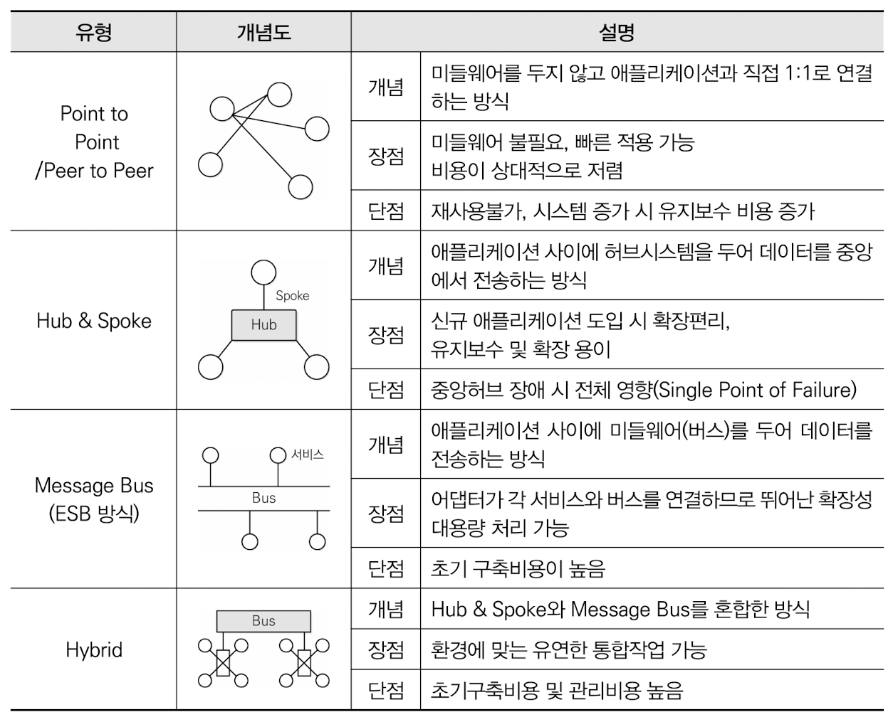

75/100
# 1. 소프트웨어 설계
### 1. 워크스루(Walk Through)
- 동료검토(Peer Review) : 설명을 직접하고 동료들이 검토
- 인스펙션(Inspection) : 다른 전문가에게 검토
- 워크스루(Walk Through)
    - 미리 배포하여 짧은 검토회의
    - 사용사례를 호가장하여 명세하거나 설계 다이어그램, 원시코드, 테스트 케이스 등에 적용 가능
    - 복잡한 알고리즘 또는 반속, 실시간 동작, 병행 처리와 같은 기능이나 동작을 이해하려고 할 때 유용
    - 단순한 테스트 케이스를 이용하여 프로덕트를 수작업으로 수행해 보는 것

### 2. 코드 종류
- 순차 코드 (Sequence Code) = 일련번호 코드
    - 자료 발생 순서, 크기 순서 등 일정 기준에 따라 최초 자료부터 차례로 일련번호를 부여하는 방법
    - 1,2,3,4 ...
- 블록 코드 (Block Code) = 구분 코드
    - 공통성이 있는 것끼리 블록으로 구분, 각 블록 내에서 일련번호를 부여하는 방법
    - 1001~1100 : 총부무, 1101~1200 : 영업부
- 10진 코드 (Decimal Code) = 도서 분류식 코드
    - 0~9까지 10진 분할하고 다시 10진 분할하는 방법
    - 1000 : 공학, 1100 : 소프트웨어 공학, 1110 : 소프트웨어 설계
- 그룹 분류 코드 (Group Classification Code)
    - 대분류, 중분류, 소분류 구분하고 각 그룹 안에서 일련번호를 부여하는 방법
    - 1-01-001 : 본사-총무부-인사계, 2-01-001 : 지사-총무부-인사계
- 연상 코드 (Mnemonic Code)
    - 명칭이나 약호와 관계있는 숫자나 문자, 기호를 이용해 코드를 부여하는 방법
    - TV-40 : 40인치 TV, L-15-220 : 15W 200V의 램프
- 표의 숫자 코드 (Sifnificant Digit Code) = 유효 숫자 코드
    - 성질(길이, 넓이, 부피, 지름, 높이 등)의 물리적 수치를 그대로 코드에 적용시키는 방법
    - 120-720-1500 : 두께 X 폭 X 길이가 120 X 720 X 1500인 강판
- 합성 코드 (Combined Code)
    - 필요한 기능을 하나의 코드로 수행하기 어려운 경우 2개 이상의 코드를 조합하여 만드는 방법
    - 연상코드 + 숫자코드
        - KE-711 : 대한항공 811기, AC-253 : 에어캐나다 253기

### 3. ⭐ 미들웨어 솔루션 유형
#### RPC (Remote Procedure Call)
- 원격 프로시저를 로컬 유스케이스 호출하는 방식
- 이큐브시스템스의 Entera, OSF의 ONC/RPC

#### MOM (Message Oriented Middleware)
- 메시지 기반의 비동기형 메시지를 전달하는 방식
- 분산 데이터 시스템의 데이터 동기를 위해 많이 사용
- 서로 다른 플랫폼에서 독립적으로 실행되는 소프트웨어 간의 상호작용을 통해 하나의 통합된 시스템처럼 동작되도록 함
- IBM의 MQ, 오라클의 Message Q, JCP의 JMS

#### TP-Monitor (Transaction Processing Monitor)
- 항공기나 철도 예약 업무 등과 같은 온라인 트랜잭션 업무에서 트랜잭션을 처리 및 감시하는 미들웨어
- 사용자 수가 증가해도 빠른 응답 속도를 유지해야 하는 업무에서 주로 사용
- 오라클의 tuxedo, 티맥스소프트의 tmax

#### ORB (Object Request Broker)
- 객체지향 미들웨어로 코바(CORBA) 표준 스펙을 구현한 미들웨어
- TP-Monitor의 장점인 트랜잭션 처리와 모니터링 등을 추가로 구현
- Micro Focus의 Orbix, OMG의 CORBA

#### WAS (Web Application Server)
- 정적인 콘텐츠를 처리하는 웹 서버와 달리 사용자의 요구에 따라 변하는 동적인 콘텐츠를 처리하기 위해 사용되는 미들웨어
- 클라이언트/서버 환경보다는 웹 환경을 구현하기 위한 미들웨어
- HTTP 세션 처리를 위한 웹서버 기능뿐 아니라 미션-크리티컬한 기업 업무까지 JAVA, EJB 컴포넌트 기반으로 구현 가능
- 오라클의 WebLogic, IBM의 WebSphere

### 4. 요구사항 분석 (Requirement Analysis) - 분석 및 중재
- 요구사항 정의 문서화
- 타당성을 조사
- 비용과 일정에 대한 제약 설정
- 중복되거나 하나로 통합되어야 하는 등 서로 상충되는 요구사항 중재
- 자료 흐름도(DFD), 자료사전(DD) 등 도구가 사용

### 5. 럼바우(Rumbaugh) 객체지향 분석 기법
> **객체 모델링 → 동적 모델링 → 기능 모델링**

# 2. 소프트웨어 개발
### 6. 소프트웨어 품질 측정 (개발자 관점)
- 정확성
- 무결성
- 사용성

### 7. 인터페이스 구현 검증 도구
- 인터페이스의 입 · 츨력 값이 예상과 일치하는지 확인
- xUnit
    - 같은 코드를 여러 번 작성하지 않게 도와줌
    - 테스트마다 예상 결과를 기억할 필요가 없게 하는 자동화된 해법을 제공하는 단위 테스트 프레임워크
- STAF
    - 서비스 호출 및 컴포넌트 재사용 등 다양한 환경을 지원하는 테스트 프레임워크
    - 크로스 플랫폼, 분산 소프트웨어 테스트 환경을 조성할 수 있도록 지원
    - 분산 환경에 설치된 데몬이 프로그램 테스트에 대한 응답을 대신하며, 테스트 완료 후 통합하고 자동화하여 프로그램을 완성
- FitNesse
    - 웹 기반 테스트케이스 설계, 실행, 결과 확인 등을 지원하는 테스트 프레임워크
- NTAF
    - FitNesse의 장점인 협업 기능과 STAF의 장점인 재사용 및 확장성을 통합한 NHN(Naver)의 테스트 자동화 프레임워크
- Selenium
    - 다양한 브라우저 및 개발 언어를 지원하는 웹 애플리케이션 테스트 프레임워크
- watir
    - Ruby를 사용하는 애플리케이션 테스트 프레임워크
        - 인터프리터 방식의 객체 지향 스크립트 언어

### 8. ⭐ EAI 구축 유형

### 9. ⭐ 반정규화(Denormalization)
#### ⭐ 중복 테이블 추가
- 여러 테이블에서 데이터를 추출해서 사용해야 하거나 다른 서버에 저장된 테이블을 이용해야 하는 경우 중복 테이블을 추가하여 작업의 효율성 향상
- 중복 테이블 추가하는 경우
    - 정규화로 인해 수행 속도가 느려지는 경우
    - 많은 범위의 데이터를 자주 처리해야 하는 경우
    - 특정 범위의 데이터만 자주 처리해야 하는 경우
    - 처리 범위를 줄이지 않고는 수행 속도를 개선할 수 없는 경우
- 집계 테이블의 추가
    - 집계 데이터를 위한 테이블을 생성하고, 각 원본 테이블에 트리거를 설정하여 사용하는 것
    - 트리거의 오버헤드에 유의
- 진행 테이블의 추가
    - 이력관리 등 목적으로 추가하는 테이블
    - 적절한 데이터 양의 유지와 활용도를 높이기 위해 기본키를 적절히 설정
- 특정 부분만 포함하는 테이블 추가
    - 데이터가 많은 테이블의 특정 부분만을 사용하는 경우 해당 부분만으로 새로운 테이블 생성

### 10. ISO/IEC 9126
#### 기능성 (Functionality)
요구사항을 정확하게 만족하는 기능을 제공하는지 여부

|상세 품질 요구사항|설명|
|---|---|
|적절성/적합성 (Suitability)|지정된 작업과 사용자의 목적 당성을 위해 적절한 기능 제공|
|정밀성/정확성 (Accuracy)|요구하는 결과를 정확하게 산출|
|상호운용성 (Interoperability)|다른 시스템들과 서로 어울려 작업|
|보안성 (Security)|정보에 대한 접근을 권한에 따라 허용, 차단|
|준수성 (Compliance)|기능과 관련된 표준, 관례 및 규정을 준수|

### 11. 디지털 저작권 관리의 기술 요소
1\) 암호화(Encryption) : 콘텐츠 및 라이선스를 암호화하고 전자서명을 할 수 있는 기술
2\) 키 관리(Key Management) : 콘텐츠를 암호화한 키에 대한 저장 및 분배 기술
3\) 암호화 파일 생성(Packager) : 콘텐츠를 암호화된 콘텐츠로 생성하기 위한 기술
4\) 식별 기술(Identification) : 콘텐츠에 대한 식별 체계 표현 기술
5\) 저작권 표현(Right Expression) : 라이선스의 내용 표현 기술
6\) 정책 관리(Policy Management) : 라이선스 발급 및 사용에 대한 정책 표현 및 관리 기술
7\) 크랙 방지(Tamper Resistance) : 크랙에 의한 콘텐츠 사용 방지 기술
8\) 인증(Authentication) : 라이선스 발급 및 사용의 기준이 되는 사용자 인증 기술

# 3. 데이터베이스 구축
### 12. 논리적 설계(데이터 모델링) : 논리 스키마 설계, 트랜잭션 인터페이스 설계
- 논리적 자료 구조로 변환(mapping)하는 과정
- 데이터 타입 간의 관계로 표현되는 논리적 구조의 데이터로 모델화
- 개념 스키마를 평가 및 정제하고
- 트랜잭션의 인터페이스 설계
- 관계형 데이터베이스라면 테이블을 설계하는 단계

### 13. ⭐ 분산 데이터베이스의 목표
1\) 위치 투명성 (Location Transparency)
- 액세스하려는 데이터베이스의 실제 위치를 알 필요없이 단지 데이터베이스의 논리적인 명칭만으로 액세스 할 수 있음

2\) 중복 투명성 (Replication Transparency)
- 동일 데이터가 여러 곳에 중복되어 있더라도 사용자는 마치 하나의 데이터만 존재하는 것처럼 사용
- 시스템은 자동으로 여러 자료에 대한 작업을 수행

3\) 병행 투명성 (Concurrency Transparency)
- 분산 데이터베이스와 관련된 다수의 트랜잭션들이 동시에 실현되더라도 그 트랜잭션의 결과는 영향을 받지 않음

4\) 장애 투명성 (Failure Transparency)
- 트랜잭션, DBMS, 네트워크, 컴퓨터 장애에도 불구하고 트랜잭션을 정확하게 처리

### 14. 병행제어 기법 로킹(Locking)
- 트랜잭션(transaction)이 접근하고자 하는 데이터를 잠가(lock) 다른 트랜잭션이 접근하지 못하도록 하는 병행 제어 기법
- 트랜잭션이 어떤 데이터에 접근하고자 할 때 로킹을 수행
- 로킹이 되어 있는 데이터에는 다른 트랜잭션이 접근할 수 없음
- 트랜잭션은 로킹이 된 데이터에 대해서만 연산을 수행
- 로킹 단위: 필드, 레코드, 테이블, 파일, 데이터베이스 모두 로킹 단위
- 한 번에 로킹 할 수 있는 객체의 크기를 로킹 단위

|로킹 단위|로크의 수|병행 제어|로킹 오버헤드|병행성 수준|데이터베이스 공유도|
|---|---|---|---|---|---|
|커짐|적어짐|단순해짐|감소|낮아짐|감소|
|작아짐|커짐|복잡해짐|증가|높아짐|증가|

### 15. ⭐ 정규화 과정 정리 ⭐
> **도**메인이 원자값 
> **부**분적 함수 종속 제거 
> **이**행적 함수 종속 제거 
> **결**정자이면서 후보키가 아닌 것 제거 
> **다**치 종속 제거 
> **조**인 종속성 이용

# 4. 프로그래밍 언어 활용
### 16. ⭐ IPv6 (Internet Protocol version 6)
- IPv4의 주소 부족 문제를 해결하기 위해 개발
- 128비트의 긴 주소를 사용
- IPv4에 비해 자료 전송 속도 빠름
- 인증성, 기밀성, 데이터 무경성의 지원으로 보안 문제 해결
- IPv4 호환성 뛰어남
- 주소의 확장성, 융통성, 연동성 뛰어남
- 실시간 흐름 제어로 향상된 멀티미디어 기능 지원
- Traffic Class, Flow Label을 이용해 등급별, 서비스별 패킷을 구분할 수 있어 품질 보장이 용이
    - Traffic Class : IPv6 패킷의 클래스나 우선순위를 나타내는 필드
    - Flow Label : 네트워크 상에서 패킷들의 흐름에 대한 특성을 나타내는 필드
- 패킷 크기를 확장할 수 있으므로 패킷 크기 제한 없음
- 기본 헤더 뒤에 확장 헤더를 더함으로써 더욱 다양한 정보 저장 가능 → 네트워크 기능 확장 용이
- 미리 예약된 알고리즘을 통해 고유성이 보장된 주소를 자동으로 구성 → 자동으로 네트워크 환경 구성 가능

#### ⭐ IPv6 구성
- 16비트씩 8부분, 총 128비트로 구성
- 각 부분 16진수로 표현, 콜론으로 구분
- 주소체계
    - 유니캐스트(Unicast) : 단일 송신자와 단일 수신자 간의 통신(1 대 1 통신에 사용)
    - 멀티캐스트(Multicast) : 단일 송신자와 다중 수신자 간의 통신(1 대 다 통신에 사용)
    - 애니캐스트(Anycast) : 단일 송신자와 가장 가까이 있는 단일 수신자 간의 통신(1 대 1 통신에 사용)

### 17. 교착상태 발생의 필요 충분 조건
- 4가지 조건 중 하나라도 충족되지 않으면 교착상태가 발생하지 않음
#### 1) 상호 배제 (Mutual Exclustion)
- 한 번에 한 개의 프로세스만이 공유 자원으로 사용할 수 있어야 함
#### 2) 점유와 대기 (Hold and Wait)
- 최소한 하나의 자원을 점유하고 있으면서 다른 프로세스에 할당되어 사용되고 있는 자원을 추가로 점유하기 위해 대기하는 프로세스가 있어야 함
#### 3) 비선점 (Non-preemption)
- 다른 프로세스에 할당된 자원은 사용이 끝날 때까지 강제로 빼앗을 수 없어야 함
#### 4) 환형 대기 (Circular Wait)
- 공유 자원과 공유 자원을 사용하기 위해 대기하는 프로세스들이 원형으로 구성되어 있어 자신에게 할당된 자원을 점유하면서 앞이나 뒤에 있는 프로세스의 자원을 요구해야 함

### 18. ⭐ 인터넷 계층의 주요 프로토콜
- IP(Internet Protocol)
    - 전송할 데이터에 주소를 지정하고, 경로를 설정하는 기능
    - 비연결형인 데이터그램 방식을 사용하는 것으로 신뢰성 보장 안됨
- ICMP(Internet Control Message Protocol, 인터넷 제어 메시지 프로토콜)
    - IP와 조합하여 통신 중에 발생하는 오류의 처리와 전송 경로 변경 등을 위한 제어 메시지를 관리하는 역할
    - 헤더는 8Byte로 구성
- IGMP(Internet Group Management Protocol, 인터넷 그룹 관리 프로토콜)
    - 멀티 캐스트를 지원하는 호스트나 라우터 사이에서 멀티 캐스트 그룹 유지를 위해 사용
- **ARP(Address Resolution Protocol, 주소 분석 프로토콜)**
    - 호스트의 IP 주소를 호스트와 연결된 네트워크 접속 장치의 물리적 주소(MAX Address)로 바꿈
- RARP(Reverse Address Resoultion Protocol)
    - ARP와 반대로 물리적 주소를 IP주소로 변환하는 기능

# 5. 정보시스템 구축관리
### 19. Putnam 모형 = 생명 주기 예측 모형
- 소프트웨어 생명 주기의 전 과정 동안 사용될 노력의 분포를 가정해 주는 모형
- 시간에 따른 함수로 표현되는 **Rayleigh-Norden** 곡선의 노력 분포도를 기초로 함
- 대형 프로젝트의 노력 분포 산정에 이용되는 기법
- 개발 기간이 늘어날수록 프로제긑 적용 인원의 노력이 감소

### 20. 백도어 (Back Door, Trap Door)
- 시스템 설계자가 서비스 기술자나 유지 보수 프로그램 작성자(Programmer)의 액세스 편의를 위해 시스템 보안을 제거하여 만들어 놓은 비밀 통로
- 컴퓨터 범죄에 악용됨
- 백도어 탐지 방법
    - 무결성 검사
    - 열린 포트 확인
    - 로그 분석
    - SetUID 파일 검사

### 21. IoT
- PICONET
    - 여러 개의 독립된 통신장치가 블루투스 기술이나 UWB 통신 기술을 사용해 통신망을 형성하는 무선 네트워크
    - 주로 수십 미터 이내의 좁은 공간에서 네트워크를 형성
    - 정지 또는 이동 중에 있는 장치 모두를 포함

### 22. 테일러링 (Tailoring)
- 내부적 기준
    - 목표 환경 : 시스템의 개발환경과 유형이 서로 다른 경우 테일러링 필요
    - 요구사항 : 프로젝트의 생명주기 활동에서 개발, 운영, 유지보수 등 프로젝트에서 우선적으로 고려할 요구사항이 서로 다른 경우 테일러링 필요
    - 프로젝트 규모 : 비용, 인력, 기간 등 프로젝트 규모가 서로 다른 경우 테일러링 필요
    - 보유 기술 : 프로세스, 개발 방법론, 산출물, 구성원의 능력 등이 서로 다른 경우 테일러링 필요
- 외부적 기준
    - 법적 제약사항 : 프로젝트별로 적용될 IT Compliance가 서로 다른 경우 테일러링 필요
    - 표준 품질 기준 : 금융, 제도 등 분야별 표준 품질 기준이 서로 다른 경우 테일러링 필요