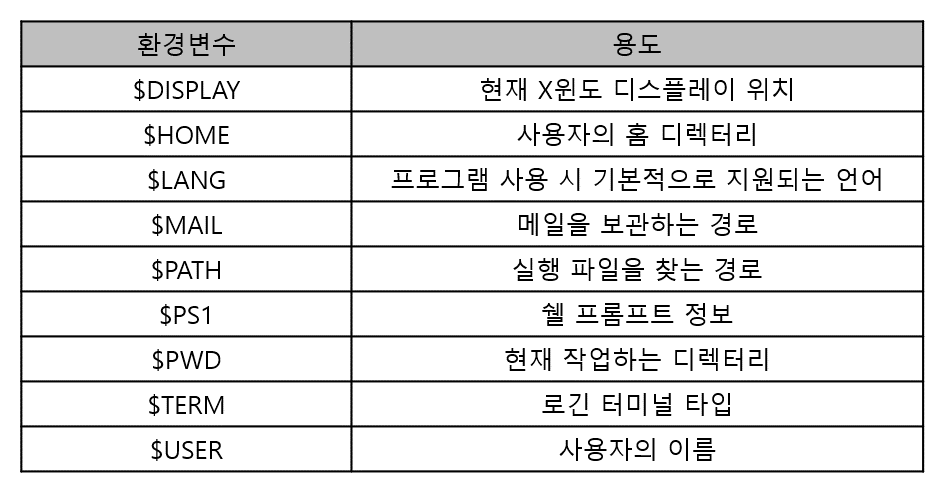
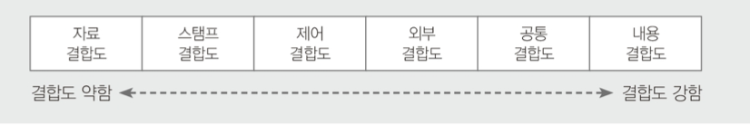

77/100
# 1. 소프트웨어 설계
### 1. 객체지향 설계 원칙 (SOLID)
1. 단일 책임 원칙 (SRP; Single Responsibility Principle)
- 객체는 단 하나의 책임만 가져야 한다는 원칙
- 응집도는 높고, 결합도는 낮게 설계
2. 개방-폐쇄 원칙 (OCP; Open-Closed Principle)
- 기존 코드를 변경하지 않고 기능을 추가할 수 있도록 설계
- 공통 인터페이스를 하나의 인터페이스로 묶어 캡슐화하는 방법
3. 리스코프 치원 원칙 (LSP; Liskov Substitution Principle)
- 자식 클래스는 최소한 자신의 부모 클래스에서 가능한 행위는 수행할 수 있어야 한다는 설계
- 자식 클래스는 재정의하지 않고 확장만 수행
4. 인터페이스 분리 원칙 (ISP; Interface Segregation Principle)
- 사용하지 않는 인터페이스와 의존관계를 맺거나 영향을 받지 않아야 한다는 원칙
- 인터페이스가 갖는 하나의 책임
- 클라이언트는 자신이 사용하지 않는 메서드와 의존관계를 맺으면 안됨
- 클라이언트가 사용하지 않는 인터페이스 때문에 영향을 받아서는 안됨
5. 의존 역전 원칙 (DIP; Dependency Inversion Principle)
- 각 객체들 간의 의존관계가 성립될 때, 추상성이 낮은 클래스보다 추상성이 높은 클래스와 의존관계를 맺어야 한다는 원칙
- 일반적으로 인터페이스를 활용하면 이 원칙은 준수 됨

### 2. 코드 종류
- 순차 코드 (Sequence Code) = 일련번호 코드
    - 자료 발생 순서, 크기 순서 등 일정 기준에 따라 최초 자료부터 차례로 일련번호를 부여하는 방법
    - 1,2,3,4 ...
- 블록 코드 (Block Code) = 구분 코드
    - 공통성이 있는 것끼리 블록으로 구분, 각 블록 내에서 일련번호를 부여하는 방법
    - 1001~1100 : 총부무, 1101~1200 : 영업부
- 10진 코드 (Decimal Code) = 도서 분류식 코드
    - 0~9까지 10진 분할하고 다시 10진 분할하는 방법
    - 1000 : 공학, 1100 : 소프트웨어 공학, 1110 : 소프트웨어 설계
- 그룹 분류 코드 (Group Classification Code)
    - 대분류, 중분류, 소분류 구분하고 각 그룹 안에서 일련번호를 부여하는 방법
    - 1-01-001 : 본사-총무부-인사계, 2-01-001 : 지사-총무부-인사계
- 연상 코드 (Mnemonic Code)
    - 명칭이나 약호와 관계있는 숫자나 문자, 기호를 이용해 코드를 부여하는 방법
    - TV-40 : 40인치 TV, L-15-220 : 15W 200V의 램프
- 표의 숫자 코드 (Sifnificant Digit Code) = 유효 숫자 코드
    - 성질(길이, 넓이, 부피, 지름, 높이 등)의 물리적 수치를 그대로 코드에 적용시키는 방법
    - 120-720-1500 : 두께 X 폭 X 길이가 120 X 720 X 1500인 강판
- 합성 코드 (Combined Code)
    - 필요한 기능을 하나의 코드로 수행하기 어려운 경우 2개 이상의 코드를 조합하여 만드는 방법
    - 연상코드 + 숫자코드
        - KE-711 : 대한항공 811기, AC-253 : 에어캐나다 253기

# 2. 소프트웨어 개발
### 3. 인터페이스 구현 검증 도구
- 인터페이스의 입 · 츨력 값이 예상과 일치하는지 확인
- xUnit
    - 같은 코드를 여러 번 작성하지 않게 도와줌
    - 테스트마다 예상 결과를 기억할 필요가 없게 하는 자동화된 해법을 제공하는 단위 테스트 프레임워크
- STAF
    - 서비스 호출 및 컴포넌트 재사용 등 다양한 환경을 지원하는 테스트 프레임워크
    - 크로스 플랫폼, 분산 소프트웨어 테스트 환경을 조성할 수 있도록 지원
    - 분산 환경에 설치된 데몬이 프로그램 테스트에 대한 응답을 대신하며, 테스트 완료 후 통합하고 자동화하여 프로그램을 완성
- FitNesse
    - 웹 기반 테스트케이스 설계, 실행, 결과 확인 등을 지원하는 테스트 프레임워크
- NTAF
    - FitNesse의 장점인 협업 기능과 STAF의 장점인 재사용 및 확장성을 통합한 NHN(Naver)의 테스트 자동화 프레임워크
- Selenium
    - 다양한 브라우저 및 개발 언어를 지원하는 웹 애플리케이션 테스트 프레임워크
- watir
    - Ruby를 사용하는 애플리케이션 테스트 프레임워크
        - 인터프리터 방식의 객체 지향 스크립트 언어

### 4. 소프트웨어 형상관리 (SCM; Software Configuration Management)
- 소프트웨어 개발과정에서 소프트웨어의 변경 사항을 관리하기 위해 개발된 일련의 활동
- 변경원인 제어
- 개발 전 단계에 적용 / 유지보수 단계에서도 수행
- 개발 비용 감소, 방해요인 최소화되도록 보증하는 것이 목적
- 프로젝트 계획, 분석서, 설계서, 프로그램, 소스코드, 테스트 케이스 등 포함
- 가시성과 추적성 보장함으로써 소프트웨어의 생산성과 품직을 높일 수 있음
- Git, CVS, Subversion

### 5. 테스트 케이스 / 테스트 시나리오 / 테스트 오라클
#### ⭐ 테스트 케이스 (Test Case)
- 사용자 요구사항을 정확하게 준수했는지 확인하기 위해 설계된 입력 값, 실행 조건, 기대 결과 등으로 구성된 테스트 항목에 대한 명세서
- 명세 기반 테스트의 설계 산출물에 해당
- 테스트 오류 방지, 인력, 시간 낭비 감소
- 테스트 목표와 방법을 설정한 후 작성
- 시스템 설계 단계에서 작성하는 것이 가장 이상적

#### 테스트 케이스 작성 순서
##### 1) 테스트 계획 검토 및 자료 확보
- 테스트 계획서를 재검토하여 테스트 대상 범위 및 접근 방법을 이해
- 시스템 요구사항과 기능 명세서를 검토하고 테스트 대상 시스템의 정보 확보
##### 2) 위험 평가 및 우선순위 결정
- 결함의 위험 정도에 따른 운선순위 결정
- 어느 부분에 초점을 맞춰 테스트할지 결정

##### 3) 테스트 요구사항 정의
- 사용자 요구사항이나 테스트 대상 재검토
- 테스트 특정, 조건, 기능을 분석

##### 4) 테스트 구조 설계 및 테스트 방법 결정
- 테스트 케이스의 형식과 분류 방법을 결정
- 테스트 절차, 장비, 도구, 테스트 문서화 방법을 결정

##### 5) 테스트 케이스 정의
- 요구사항에 따라 테스트 케이스 작성
- 입력 값, 실행 조건, 예상 결과 기술

##### 6) 테스트 케이스 타당성 확인 및 유지 보수
- 소프트웨어 기능 또는 환경 변화에 따라 테스트 케이스 갱신
- 테스트 케이스 유용성 검토

#### 테스트 시나리오 (Test Scenario)
- 테스트 케이스를 적용하는 순서에 따라 여러 개의 테스트 케이스들을 묶은 집합
- 테스트 순서에 대한 구체적인 절차, 사전 조건, 입력 데이터 등 설정
- 순서를 미리 정함으로써 테스트 항목을 빠짐없이 수행

#### 테스트 시나리오 작성 시 유의사항
- 시스템별, 모듈별, 항목별 여러 개의 시나리오로 분리하여 작성
- 요구사항과 설계 문서를 토대로 작성
- 식별자 번호, 순서 번호, 테스트 데이터, 테스트 케이스, 예상 결과, 확인 등을 포함
- 유스케이스 간 업무 흐름이 정상적인지 테스트 할 수 있도록 작성
- 개발된 모듈 간의 연계가 정상적으로 동작하는지 테스트 할 수 있도록 작성

#### ⭐ 테스트 오라클 (Test Orcle)
- 테스트 결과가 올바른지 판단하기 위해 사전에 정의된 참 값을 대입하여 비교하는 기법 및 활동
- 테스트 오라클 특징
    - 제한된 검증 : 모든 테스트 케이스에 적용 불가
    - 수학적 기법 : 값을 수학적 기법을 이용하여 구함
    - 지동화 기능 : 프로그램의 실행, 결과 비교, 커버리지 측정 등을 자동화

#### 테스트 오라클 종류
##### 1) 참 (True) 오라클
- 모든 테스트 케이스의 입력 값에 대해 기대하는 결과를 제공
- 발생된 모든 오류 검출 가능
- 항공기, 은행, 발전소 소프트웨어 등 미션 크리티컬한 업무에서 사용

##### 2) 샘플링 (Sampling) 오라클
- 특정 몇몇 테스트 케이스의 입력 값들에 대해서만 기대하는 결과를 제공
- 일반적인 업무, 게임, 오락 에서 사용

##### 3) 추정(Heuristic) 오라클
- 샘플링 오라클 개선
- 특정 테스트 케이스의 입력 값에 대해 기대하는 결과 제공
- 나머지 입력 값들에 대해서 추정으로 처리하는 오라클
- 일반적인 업무, 게임, 오락 에서 사용

##### 4) 일관성(Consistent) 검사 오라클
- 애플리케이션의 변경이 있을 때, 테스트 케이스의 수행 전과 후의 결과 값이 동일한지 확인하는 오라클

### 6. 화이트박스 테스트 / 블랙박스 테스트
#### 화이트박스 테스트의 종류
##### 1) 기초 경로 검사 (Base Path Testing)
- 대표적인 화이트박스 테스트 기법
- 절차적 설계의 논리적 복잡성을 측정할 수 있게 함
- 측정 결과는 실행 경로의 기초를 정의하는데 지침으로 사용됨

##### 2) 제어 구조 검사 (Control Structure Testing)
- 조건 검사(Condition Testing) : 모듈 내에 있는 논리적 조건을 테스트
- 루프 검사(Loop Testing) : 반복(Loop)구조에 초점을 맞춰 실시
- 데이터 흐름 검사(Data Flow Testing) : 변수 정의와 변수 사용 위치에 초점을 맞춰 실시

#### 블랙박스 테스트의 종류
##### 1) 동치 분할 검사 (Equivalence Partitioning Testing, 동치 클래스 분해)
- 입력 자료에 초점을 맞춰 테스트 케이스(동치 클래스)를 만들고 검사하는 방법 = 동등 분할 기법
- 입력 조건에 타당한 입력 자료와 타당하지 않은 입력 자료의 개수를 균등하게 설정하고 해당 입력 자료에 맞는 결과가 출력되는지 확인

##### 2) 경계값 분석 (Boundary Value Analysis)
- 입력 자료에만 치중한 동치 분할 기법을 보완
- 입력 조건의 중간값보다 경계값에서 오류가 발생될 확률이 높다는 점을 이용해 입력 조건의 경계값을 테스트 케이스로 선정하여 검사

##### 3) 원인-효과 그래프 검사 (Cause-Effect Graphing Testing)
- 입력 데이터 간의관계와 출력에 영향을 미치는 상황을 체계적으로 분석 후, 효용성이 높은 테스트 케이스를 선정하여 검사

##### 4) 오류 예측 검사 (Error Guseeing)
- 과거 경험이나 확인자의 감각으로 테스트
- 다른 블랙박스 테스트 기법으로 찾아낼 수 없는 오류를 찾아내는 일련의 보충적 검사 기법 = 데이터 확인 검사

##### 5) 비교 검사 (Comparision Testing)
- 여러 버전의 프로그램에 동일한 테스트 자료를 제공해 동일한 결과가 출력되는지 테스트

# 3. 데이터베이스 구축
### 7. ⭐ 트랜잭션의 특성
데이터 무결성(Integrity)를 보장하기 위해 트랜잭셩이 가져야할 특성
- Atomicity(원자성)
    - 데이터베이스에 모두 반영되도록 완료(Commit)되든지 아니면 전혀 반영되지 않도록 복구(Rollback)되어야 함
    - 트랜잭션 내의 모든 명령은 반드시 완벽히 수행되어야 함
    - 모두 완벽히 수행되지 않고 어느 하나라도 오류가 발생하면 트랜잭션 전부가 취소되어야 함
- Consistency(일관성)
    - 트랜잭션이 그 실행을 성공적으로 완료하면 언제나 일관성 있는 데이터베이스 상태로 변환
    - 트랜잭션 수행 전과 수행 완료 유의 상태가 동일해야 함
- Isolation(독립성, 격리성, 순차성)
    - 하나의 트랜잭션 실행 중에 다른 트랜잭션의 연산이 끼어들 수 없음
    - 수행 중인 트랜잭션은 완전히 완료될 때까지 다른 트랜잭션에서 수행결과 참조 불가
- Durability(영속성, 지속성)
    - 성공적으로 완료된 트랜잭션의 결과는 시스템이 고장나더라도 영구적으로 반영

### 8. 데이터 모델에 표시해야 할 요소
- 논리적 데이터 구조
- 연산
- 제약조건

# 4. 프로그래밍 언어 활용
### 9. UNIX / LINUX의 주요 환경변수
- set, env, printenv, setenv로 값 출력

### 10. ⭐ 커널(Kernel)
- UNIX의 가장 핵심적인 부분
- 컴퓨터가 부팅될 때 주기억장치에 적재된 후 상주하면서 실행됨
- 하드웨어를 보호하고, 프로그램과 하드웨어 간의 인터페이스 역할 담당
- 프로세스(CPU 스케줄링)관리, 기억장치 관리, 파일 관리, 입 · 출력 관리, 프로세스 간 통신, 데이터 전송 및 변환 등 기능 수행

### 11. TCP 흐름제어 기법
- 수신 측의 처리 능력에 따라 송신 측에서 손신하는 데이터 전송량이나 전송 속도를 조절하는 기능
- 정지-대기(Stop-and-Wait), 슬라이딩 윈도우(Sliding Window) 방식 이용

### 12. 결합도 (Coupling)
- 모듈 간에 상호 의존하는 정도 / 모듈 간의 연관관계
- 결합도가 약할수록 품질이 높고, 강할수록 품직이 낮음
- 결합도가 강하면 시스템 구현 및 유지보수 작업이 어려움

#### 1) 자료 결합도 (Data Coupling)
- 모듈 간 인터페이스가 자료 요소로만 구성될 때
- 모듈이 다른 모듈을 호출하면서 매개변수로 데이터를 넘겨주고, 결과를 다시 돌려주는 방식
- 모듈의 내용을 변경하더라도 다른 모듈에 전혀 영향을 미치지 않는 가장 바람직한 결합도
#### 2) 스탬프(검인) 결합도 (Stamp Coupling)
- 모듈 간 인터페이스로 배열이나 레코드 등의 자료 구조가 전달될 때
- 두 모듈이 동일한 자료 구조를 조회하는 경우
- 자료 구조의 변화(포맷이나 구조 변화) 조회하는 모든 모듈 및 변화되는 필드를 실제로 조회하지 않는 모듈에까지도 영향을 미침
#### 3) 제어 결합도 (Control Coupling)
- 모듈이 다른 모듈 내부의 논리적인 흐름을 제어하기 위해 제어 신호를 이용하여 통신하거나 제어요소(Function Code, Switch, Tag, Flag)를 전달
- 모듈이 다른 모듈의 상세한 처리 절차를 알고 있어 이를 통제하는 경우
- 처리 기능이 두 모듈에 분리되어 설계된 경우
#### 4) 외부 결합도 (External Coupling)
- 모듈에 선언된 데이터(변수)를 외부의 다른 모듈에서 참조할 때
- 참조되는 데이터의 범위를 각 모듈에서 제한
#### 5) 공통(공유) 결합도 (Common Coupling)
- 공통 데이터 영역을 여러 모듈이 사용할 때
- 내용을 조금만 변경하더라도 이를 사용하는 모든 모듈에 영향을 미치므로 모듈의 독립성을 약하게 만든다.
#### 6) 내용 결합도 (Content Coupling)
- 모듈이 다른 모듈의 내부 기능 및 내부 자료를 직접 참조하거나 수정할 때
- 모듈에서 다른 모듈의 내부로 제어가 이동하는 경우에도 내용 결합도에 해당

### 13. 응집도 (Cohesion)
- 정보은닉 개념을 확장한 것
- 명령어나 호출문 등 모듈의 내부요소들의 서로 관련되어 있는 정도
- 모듈이 족립적인 기능으로 정의되어 있는 정도
- 응집도가 강할수록 품질이 높고, 약할수록 품질이 낮다.

#### 1) 우연적 응집도 (Coincidental Cohesion)
- 모듈 내부의 각 구성요소들이 서로 관련 없는 요소로만 구성된 경우
#### 2) 논리적 응집도 (Logical Cohesion)
- 유사한 성격을 갖거나 특정 형태로 분류되는 처리 요소들로 하나의 모듈이 형성되는 경우
#### 3) 시간적 응집도 (Temporal Cohesion)
- 특정 시간에 처리되는 몇 개의 기능을 모아 하나의 모듈로 작성할 경우
#### 4) 절차적 응집도 (Procedural Cohesion)
- 모듈이 다수의 관련 기능을 가질 때, 모듈 안의 구성 요소들이 그 기능을 순차적으로 수행할 경우
#### 5) 교환(통신)적 응집도 (Communication Cohesion)
- 동일한 입력과 출력을 사용해 서로 다른 기능을 수행하는 구성 요소들이 모였을 경우
#### 6) 순차적 응집도 (Sequential Cohesion)
- 모듈 내 하나의 활동으로부터 나온 출력 데이터를 그 다음 활동의 입력 데이터로 사용할 경우
#### 7) 기능적 응집도 (Functional Cohesion)
- 모듈 내부의 모든 기능 요소들이 단일 문제와 연관되어 수행될 경우

### 14. ⭐ 인터넷 계층의 주요 프로토콜
- IP(Internet Protocol)
    - 전송할 데이터에 주소를 지정하고, 경로를 설정하는 기능
    - 비연결형인 데이터그램 방식을 사용하는 것으로 신뢰성 보장 안됨
- ICMP(Internet Control Message Protocol, 인터넷 제어 메시지 프로토콜)
    - IP와 조합하여 통신 중에 발생하는 오류의 처리와 전송 경로 변경 등을 위한 제어 메시지를 관리하는 역할
    - 헤더는 8Byte로 구성
- IGMP(Internet Group Management Protocol, 인터넷 그룹 관리 프로토콜)
    - 멀티 캐스트를 지원하는 호스트나 라우터 사이에서 멀티 캐스트 그룹 유지를 위해 사용
- ARP(Address Resolution Protocol, 주소 분석 프로토콜)  
    - 호스트의 IP 주소를 호스트와 연결된 네트워크 접속 장치의 물리적 주소(MAX Address)로 바꿈
- RARP(Reverse Address Resoultion Protocol)
    - ARP와 반대로 물리적 주소를 IP주소로 변환하는 기능

# 5. 정보시스템 구축관리
### 15. CMM (Capability Maturity Model) 레벨
- 최적 단계
- 관리 단계
- 정의 단계

### 16. SADT (Structure Analysis and Design Technique)
- SoftTech 사에서 개발
- 시스템 정의, 소프트웨어 요구사항 분석, 시스템/소프트웨어 설계
- 블록 다이어그램

### 17. 컴포넌트 기반 (CBD; Component Based Development) 방법론
- 기존의 시스템이나 소프트웨어를 구성하는 컴포넌트를 조합하여 하나의 새로운 애플리케이션을 만드는 방법론
- 컴포넌트의 재사용(Reusability)이 가능하여 시간과 노력을 절감
- 새로운 기능을 추가하는 것이 간단해 확장성 보장
- 유지보수 비용을 최소화하고 생산성 및 품질 향상
> 개발 준비 단계 → 분석 단계 → 설계 단계 → 구현 단계 → 테스트 단계 → 전개 단계 → 인도 단계

### 18. 소프트웨어 정의 데이터센터 (SDDC; Software Defined Data Center)
- 컴퓨팅, 네트워킹, 스토리지, 관리 등을 모두 소프트웨어로 정의
- 인력 개입 없이 소프트웨어 조작만으로 자동 제어 관리
- 데이터센터 내 모든 자원을 가상화하여 서비스

### 19. N-S차트 (Nassi-Schneiderman Chart)
- 연속, 선택, 다중 선택, 반복 등 제어 논리 구조 표현
- GOTO나 화살표 사용 X
- 조건이 복합되어 있는 곳의 처리를 시각적으로 명확히 식별하는데 적합
- 선택과 반복 구조를 시각적으로 표현
- 이해하기 쉽고, 코드 변환 용이
- 읽기는 쉽지만 작성하기 어려우며, 임의로 제어를 전이하는 것이 불가능
- 총체적인 구조표현과 인터페이스를 나타내기 어려움
- 단일 입구와 단일 출구로 표현
- 논리의 기술에 중점을 두고 도형을 이용한 표현 방법