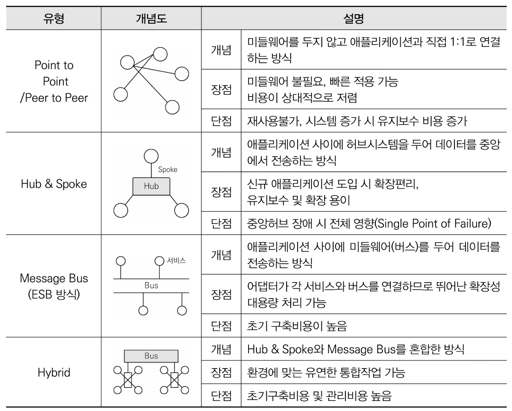
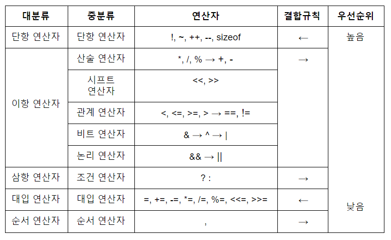

62/100
# 1. 소프트웨어 설계
### 1. 시스템 구성요소
- Process
- Feedback
- Control

### 2. ⭐ 요구사항 개발 프로세스
> 도출(Elicitation) → 분석(Analysis) → 명세(Specification) → 확인(Validation)

### 3. ⭐ 디자인 패턴
#### 생성 패턴 (Creational Pattern)
객체의 생성과 참조과정을 캡슐화하여 객체가 생성되거나 변경되어도 프로그램 구조에 영향을 크게 받지 않도록 하여 프로그램에 유연성을 더해줌

1. 추상 팩토리 (Abstract Factory)
    - 구체적인 클래스에 의존하지 않음
    - 인터페이스를 통해 서로 연관 · 의존하는 객체들의 그룹으로 생성하여 추상적으로 표현
    - 연관된 서브 클래스를 묶어 한 번에 교체하는 것이 가능
2. 빌더 (Builder)
    - 작게 분리된 인스턴스를 조합하여 객체생성
    - 객체의 생성과정과 표현방법을 분리해 동일한 객체 생성에서도 서로 다른 결과를 만듦
3. 팩토리 메소드 (Factory Method) = 가상 생성자 패턴 (Virtual Constructor Pattern)
    - 객체 생성을 서브 클래스에서 처리하도록 분리하여 캡슐화한 패턴
    - 상위 클래스에서 인터페이스만 정의, 실제 생성을 서브 클래스가 담당
4. 프로토타입 (Prototype)
    - 원본 객체를 복제하는 방법으로 객체를 생성하는 패턴
    - 일반적인 방법
    - 비용이 큰 경우 이용
5. 싱글톤 (Singleton)
    - 하나의 객체를 생성하면 생성된 객체를 어디서든 참조할 수 있지만, 여러 프로세스가 동시에 참조할 수 없다.
    - 클래스 내에서 인스턴스가 하나뿐임을 보장
    - 불필요한 메모리 낭비 최소화

#### 구조 패턴 (Structural Pattern)
클래스나 객체들을 조합해 더 큰 구조로 만들 수 있게 해주는 패턴으로 
구조가 복잡한 시스템을 개발하기 쉽게 도와줌

1. 어댑터 (Adapter)
    - 호환성이 없는 클래스들의 인터페이스를 다른 클래스가 이용할 수 있도록 변화해주는 패턴
    - 기존 클래스를 이용하고 싶지만 인터페이스가 일치하지 않을 때 이용
2. 브리지 (Bridge)
    - 구현부에서 추상층을 분리해 서로가 독립적으로 확장할 수 있도록 구성한 패턴
    - 기능과 구현을 두 개의 별도 클래스로 구현
3. 컴포지트 (Composite)
    - 여러 객체를 가진 복합 객체와 단일 객체를 구분없이 다루고자 할 때 사용하는 패턴
    - 객체들을 트리구조로 구성하여 복합객체 안에 복합객체가 포함되는 구조를 구현
4. 데코레이터 (Decorator)
    - 객체 간의 결합을 통해 능동적으로 기능들을 확장할 수 있는 패턴
    - 임의의 객체에 부가적인 기능을 추가하기 위해 다른 객체들을 덧붙이는 방식
5. 퍼싸드 (Facade)
    - 복잡한 서브 클래스들을 피해 더 상위에 인터페이스를 구성함으로써 서브 클래스들의 기능을 간편하게 사용할 수 있도록 하는 패턴
    - 서브 클래스 사이의 통합 인터페이스를 제공하는 Wrapper 객체가 필요
6. 플라이웨이트 (Flyweight)
    - 인스턴스가 필요할 때마다 매번 생성하는 것이 아니고 가능한 공유해서 사용함으로써 메모리를 절약하는 패턴
    - 다수 유사 객체를 생성하거자 조작할 때 유용
7. 프록시 (Proxy)
    - 접근이 어려운 객체와 연결하려는 객체 사이에서 인터페이스 역할을 수행하는 패턴
    - 네트워크 연결, 메모리의 대용량 객체로의 접근 등 주로 이용

#### 행위 패턴 (Behavioral Pattern)
클래스나 객체들이 서로 상호작용하는 방법이나 책임 분배 방법을 정의하는 패턴으로 하나의 객체로 수행할 수 없는 작업을 여러 객체로 분배하면서 결합도를 최소화 할 수 있도록 도와줌

1. 책임 연쇄 (Chain of Responsibility)
    - 요청을 처리할 수 있는 객체가 둘 이상 존재해 객체가 처리하지 못하면 다음 객체로 넘어가는 형태의 패턴
    - 요청을 처리할 수 있는 객체들이 고리로 묶여있어 요청이 해결될 때까지 고리를 따라 책임이 넘어감
2. 커맨드 (Command)
    - 요청을 객체의 형태로 캡슐화하여 재이용하거나 취소할 수 있도록 요청에 필요한 정보를 저장하거나 로그에 남기는 패턴
    - 요청에 사용되는 각종 명령어들을 추상 클래스와 구체 클래스로 분리하여 단순화 함
3. 인터프리터 (Interpreter)
    - 언어에 문법 표현을 정의하는 패턴
    - SQL이나 통신 프로토콜과 같은 것을 개발할 때 사용
4. 반복자 (Iterator)
    - 자료 구조와 같이 접근이 잦은 객체에 대해 동일한 인터페이스를 사용하도록 하는 패턴
    - 내부 표현 방법의 노출없이 순차적인 접근 가능
5. 중재자 (Mediator)
    - 구많은 객체들 간의 복잡한 상호작용(Interface)을 캡슐화하여 객체로 정의하는 패턴
    - 객체 사이의 의존성을 줄여 결합도를 감소시킴
    - 쟂체 간의 통제와 지시의 역할을 수행
6. 메멘토 (Memento)
    - 특정 시점에서의 객체 내부 상태를 객체화함으로써 이후 요청에 따라 객체를 해당 시점의 상태로 돌릴 수 있는 기능을 제공하는 패턴
    - Ctrl + z와 가은 되돌리기 기능을 개발할 떄 주로 이용
7. 옵서버 (Observer)
    - 한 객체의 상태가 변화하면 객체의 상속되어 있는 다른 객체들에게 변화된 상태를 전달하는 패턴
    - 분산된 시스템 간에 이벤트를 생성 · 발행하고, 이를 수신해야할 때 이용
8. 상태 (State)
    - 객체의 상태에 따라 동일한 동작을 다르게 처리해야 할 때 사용하는 패턴
    - 객체 상채를 캡슐화하고 이를 참조하는 방식
9. 전략 (Strategy)
    - 동일한 계열의 알고리즘들을 개별적으로 캡슐화하여 상호교황할 수 있게 정의하는 패턴
    - 클라이언트는 독립적으로 원하는 알고리즘을 선택하여 사용할 수 있으며, 클라이언트에 영향없이 알고리즘의 변경 가능
10. 탬플릿 메소드 (Template Method)
    - 상위 클래스에서 골격을 정의하고, 하위 클래스에서 세부 처리를 구체화하는 구조의 패턴
    - 유사한 서브 클래스를 묶어 공통된 내용을 상위 클래스에서 정의함으로써 코드의 양을 줄이고 유지보수를 용이하게 해줌
11. 방문자 (Visitor)
    - 각 클래스들의 데이터 구조에서 처리 기능을 분리하여 별도의 클래스로 구성하는 패턴
    - 불리된 처리기능은 각 클래스를 반문하여 수행

### 4. 소프트웨어 아키텍처의 품질 속성
#### 1) 시스템 측면
- 성능 : 적절하고 빠르게 처리
- 보안 : 허용된 접근에 적절한 서비스 제공
- 가용성 : 장애없이 정상적으로 서비스 제공
- 기능성 : 요구한 기능 만족스럽게 구현
- 사용성 : 명확하고 편리하게 구현
- 변경 용이성 : 다른 플랫폼에서도 동작할 수 있도록 구현
- 확장성
- 기타 속성 : 테스트 용이성, 배치성, 안정성

### 5. 인터페이스 방법 명세화
#### 오류 식별 및 처리 방안 명세화
- 발생할 수 있는 오류를 식별하고 오류 처리 방안에 대한 명세
- 오류코드, 오류 메시지, 오류 설명, 해결방법 등 명세화
- 송신 시스템
    - 연계 프로그램으로부터 생성된 데이터를 전송 형식에 맞게 인터페이스 테이블이나 파일(xml, csv, txt)로 변환 후 송신하는 시스템
- 수신 시스템
    - 수신한 인터페이스 테이블이나 파일을 연계 프로그램에서 처리할 수 있는 형식으로 변환 후 연계 프로그램에 반영하는 시스템
- 연계 서버
    - 송 · 수신 시스템 사이에 위치하여 데이터의 송 · 수신 현황을 모니터링하는 역할을 수행함

### 6. ⭐ CASE (Computer Aided Software Engineering) 원천 기술
- 구조적 기법
- 프로토타이핑 기술
- 정보 저장소 기술

### 7. ⭐ 아키텍처 패턴
#### 파이프-필터 패턴 (Pipe-Filter Pattern)
- 데이터 스트림 절차의 각 단계를 필터 컴포넌트로 캡슐화하여 파이프를 통해 데이터를 전송
- 재사용성, 확장 용이
- 필터 컴포넌트를 재배치해 다양한 파이프라인 구축 가능
- 데이터 변환, 버퍼링, 동기화에 주로 사용
- 필터 간 데이터 이솓 시 데이터 변환으로 인해 오버헤드 발생
- UNIX의 쉘(Shell)
- 서브 시스템이 입력 데이터를 받아 처리하고 결과를 다른 시스템에 보내는 작업 반속

### 8. UML 다이어그램
💡 구조적(Structure) 다이어그램 종류
- 클래스 다이어그램 (Class Diagram)
- 객체 다이어그램 (Object Diagram)
- 컴포넌트 다이어그램 (Component Diagram)
- 배치 다이어그램 (Deployment Diagram)
- 복합체 구조 다이어그램 (Composite Structure Diagram)
- 패키지 다이어그램 (Package Diagram)

💡 행위(Behavioral) 다이어그램 종류
- 유스케이스 다이어그램 (Use Case Diagram)
- 순차 다이어그램 (Sequence Diagram)
- 커뮤니케이션 다이어그램 (Communication Diagram)
- 상태 다이어그램 (State Diagram)
- 활동 다이어그램 (Activity Diagram)
- 상호작용 개요 다이어그램 (Interaction Overview Diagram)
- 타이밍 다이어그램 (Timing Diagram)

### 9. UML 모델
- Realication : 한 객체가 다른 객체에게 오퍼레이션을 수행하도록 지정하는 의미적 관계

# 2. 소프트웨어 개발
### 10. ⭐ 애플리케이션 테스트의 기본원리
- 소프트웨어의 잠재적인 결함은 줄일 수 있지만 결함이 없다고 증명 X => 완벽한 테스팅 불가능
- 결함은 개발자의 특성, 애플리케이션의 기능적 특징때문에 특정 모듈에 집중되어 있음
- 파레토 법칙(Pareto Principle) : 테스트로 발견되 80%의 오류는 20%의 모듈에서 발견됨
    - 20%의 모듈을 집중적으로 테스트하여 효율적으로 오류를 찾자
    - 결함 집중
- 살충제 패러독스(Pesticide Paradox) : 통일한 테스트 케이스로 동일한 테스트를 반복하면 더 이상 결함이 발견되지 않는 현상
    - 테스트 케이스를 지속적으로 보완 및 개선
- 소프트웨어 특징, 테스트 환경, 테스트 역량 등 정확(Context)에 따라 테스트 결과가 달라짐
    - 정황에 따라 테스트를 다르게 수행
- 오류-부재의 궤변(Absence of Errors Fallacy) : 결함을 모두 제거해도 사용자 요구사항을 만족시키지 못하면 해당 소프트웨어는 품질이 높다고 할 수 없음
- 테스트와 위험은 반비례
- 작은부분에서 시작하여 점점 확대하며 진행
- 개발자와 관계없는 별도의 팀에서 수행

### 11. 소프트웨어 버전 등록 관련 주요기능
- 저장소(Repository) : 최신 버전 파일들과 변경 내역에 대한 정보들이 저장되어 있는 곳
- 기져오기(Import) : 버전관리가 되고 있지 않은 아무것도 없는 저장소에 처음으로 파일을 복사
- 체크아웃(Check-Out) : 프로그램을 수정하기 위해 저장소에서 파일을 받아오기 / 소스파일과 함께 버전관리를 위한 파일들도 받아오기
- 체크인(Check-In) : 체크아웃 한 파일의 수정을 환료한 후 저장소의 파일을 새로운 버전으로 갱신
- 커밋(Commit) : 체크인을 수행할 때 이전에 갱신된 내용이 있는 경우에는 충돌(Conflict)을 알리고 diff 도구를 이용해 수정한 후 개신을 완료
- 동기화(Update) : 저장소에 있는 최신 버전으로 자신의 작업 공간 동기화

### 12. 형상관리 (SCM; Software Configuration Management)
- 소프트웨어 개발과정에서 소프트웨어의 변경 사항을 관리하기 위해 개발된 일련의 활동
- 변경원인 제어
- 개발 전 단계에 적용 / 유지보수 단계에서도 수행
- 개발 비용 감소, 방해요인 최소화되도록 보증하는 것이 목적
- 프로젝트 계획, 분석서, 설계서, 프로그램, 테스트 케이스 등 포함
- 가시성과 추적성 보장함으로써 소프트웨어의 생산성과 품직을 높일 수 있음
- Git, CVS, Subversion

### 13. 디지털 저작권 관리의 흐름 및 구성요소

- 클리어링 하우스(Clearing house) : 저작권에 대한 사용권한, 라이선스 발급, 암호화된 키 관리, 사용량에 따른 결제 관리 등 수행하는 곳
- 콘텐츠 제공자(Contents Provider) : 콘텐츠를 제공하는 저작권자
- 패키저(Packager) : 콘텐츠를 메타 데이터와 함께 배포 가능한 형태로 묶어 암호화하는 프로그램
- 콘텐츠 분배자(Contents Distributor) : 암호화된 콘텐츠를 유통하는 곳이나 사람
- 콘텐츠 소비자(Customer) : 콘텐츠를 구매해서 사용하는 주체
- DRM 컨트롤러(DRM Controller) : 배포된 콘텐츠의 이용권한을 통제하는 프로그램
- 보안 컨테이너(Security Container) : 콘텐츠 원본을 안전하게 유통하기 위한 전자적 보안 장치

### 14. ⭐ EAI 구축 유형

### 15. 인터페이스 구현 검증 도구
- 인터페이스의 입 · 츨력 값이 예상과 일치하는지 확인
- xUnit
    - 같은 코드를 여러 번 작성하지 않게 도와줌
    - 테스트마다 예상 결과를 기억할 필요가 없게 하는 자동화된 해법을 제공하는 단위 테스트 프레임워크
- STAF
    - 서비스 호출 및 컴포넌트 재사용 등 다양한 환경을 지원하는 테스트 프레임워크
    - 크로스 플랫폼, 분산 소프트웨어 테스트 환경을 조성할 수 있도록 지원
    - 분산 환경에 설치된 데몬이 프로그램 테스트에 대한 응답을 대신하며, 테스트 완료 후 통합하고 자동화하여 프로그램을 완성
- FitNesse
    - 웹 기반 테스트케이스 설계, 실행, 결과 확인 등을 지원하는 테스트 프레임워크
- NTAF
    - FitNesse의 장점인 협업 기능과 STAF의 장점인 재사용 및 확장성을 통합한 NHN(Naver)의 테스트 자동화 프레임워크
- Selenium
    - 다양한 브라우저 및 개발 언어를 지원하는 웹 애플리케이션 테스트 프레임워크
- watir
    - Ruby를 사용하는 애플리케이션 테스트 프레임워크
        - 인터프리터 방식의 객체 지향 스크립트 언어

### 16. 스택 응용분야
- 함수 호출 순서 제어
- 인터럽트 처리
- 수식 계산 및 수식 표기법
- 컴파일러를 이용한 언어 번역
- 부 프로그램 호출 시 복귀주소 저장
- 서브루틴 호출 및 복귀 주소 저장
- 재귀함수
- DFS(Depth First Search) : 깊이 우선 탐색

# 3. 데이터베이스 구축
### 17. ⭐ 파티션의 종류 (수평)
#### 1) 범위 분할 (Range Partitioning)
- 지정한 열의 값을 기준으로 범위를 지정하여 분할
- ex) 일별, 월별, 분기별

#### 2) 해시 분할 (Hash Partitioning)
- 해시 함수를 적용한 결과 값에 따라 데이터 분할
- 특정 파티션에 데이터가 집중되는 범위 분할의 단점을 보완
- 데이터를 고르게 분산할 때 유용
- 특정 데이터가 어디에 있는지 판단 불가
- 고객번호, 주민번호 등과 같은 데이터가 고른 컬럼에 효과적

#### 3) 조합 분할 (Composite Partitioning)
- 범위 분할로 분할한 다음 해시 함수를 적용하여 다시 분할하는 방식
- 범위 분할한 파티션이 너무 커서 관리가 어려울 때 유용

#### 4) 목록 분할 (List Partitioning)
- 지정한 열 값에 대한 목록을 만들어 이를 기준으로 분할
- ex) '국가'라는 열에 '한국', '미국', '일본'이 있는 경우 '미국'을 제외할 목적으로 '아시아'라는 목록을 만들어 분할함

#### 5) 라운드 로빈 분할 (Round Robin Partitioning)
- 레코드를 균일하게 분배하는 방식
- 각 레코드가 순차적으로 분배되며, 기본키가 불필요

- 범위 분할: '판매일자' 필드를 기준으로 연도별로 파티션을 나눔
- 해시분할: 해시 함수(FX)에 판매일자 필드를 인수로 입력하여 그 결과값에 따라 파티션을 나눔
- 조합 분할: '판매일자' 필드를 기준으로 연도별로 파티션을 나눈 다음 하나의 파티션 안에서 다시 해시 함수를 적용하여 다시 파티션을 나눔.

### 18. 병행제어 기법 종류
- 로킹 기법
- 타입 스탬프 기법
- 다중 버전 기법

### 19. 릴레이션의 특징
- 한 릴레이션에 똑같은 튜플이 포함될 수 없음
    - 릴레이션에 포함된 튜플들은 모두 상이
- 한 릴레이션에 포함된 튜플 사이에는 순서가 없음
- 튜플들의 삽입, 삭제 등의 작업으로 인해 릴레이션은 시간에 따라 변함
- 릴레이션 스키마를 구성하는 속성들 간의 순서는 중요하지 않음
- 속성의 유일한 식별을 위해 속성의 명칭은 유일해야 하지만, 속성을 구성하는 값은 동일한 값이 있을 수 있음
    - 학년은 유일하지만 동일한 값이 올 수 있음
- 튜플을 유일하게 식별하기 위해 속성들의 부분집합을 키(Key)로 설정
- 속성의 값은 논리적으로 더 이상 쪼갤 수 없는 원자값만 지정

# 4. 프로그래밍 언어 활용
### 20. 교착상태 해결방법
- 예방 기법 (Prevention)
    - 사전에 시스템을 제어하는 방법
    - 교착상채 방생의 4가지 조건 중 어느 하나를 제거(부정)함으로써 수행 됨
    - 자원의 낭비가 가장 심한 기법
- 회피 기법 (Avoidance)
    - 교착상태 발생 가능성을 배제하지 않고 교착상태가 발생하면 적절히 피해나가는 방법
    - 은행원 알고리즘 (Banker's Algorithm)
        - E. J. Dijkstra가 제안한 것
        - 은행에서 모든 고객의 요구가 충족되도록 현금을 할당하는 데서 유래한 기법
- 발견 기법 (Detection)
    - 시스템을 점검하여 교착상태에 있는 프로세스와 자원을 발견하는 것
    - 교착상태 발견 알고리즘과 자원 할당 그래프 등을 사용
- 회복 기법 (Recovery)
    - 교착상태를 일으킨 프로세스를 종료하거나 교착상태의 프로세스에 할당된 자원을 선점하여 프로세스나 자원을 회복하는 것

### 21. ⭐ 페이지 크기
#### 1) 페이지 크기가 작을 경우
- 페이지 단편화 감소
- 한 개의 페이지를 주기억장치로 이동하는 시간이 줄어듦
- 불필요한 내용이 주기억장치에 적재될 확률이 적으므로 효율적인 워킹 셋을 유지
- Locality에 더 일치할 수 있기 때문에 기억장치 효율이 높아짐
- 페이지 정보를 갖는 페이지 맵 테이블의 크기가 커지고, 매핑 속도가 늦어짐
- 디스크 접근 횟수가 많아져서 전체적인 입 · 출력 시간이 늘어남

#### 2) 페이지 크기가 클 경우
- 페이지 정보를 갖는 페이지 맵 테이블의 크기가 작아지고, 매핑 속도가 빨라짐
- 디스크 접근 횟수가 줄어들고 전체적인 입 · 출력 효율성이 증가
- 페이지 단편화 증가
- 한 개의 페이지를 주기억장치로 이동하는 시간이 늘어남
- 프로세스(프로그램) 수행에 불필요한 내용까지도 주기억장치에 적재될 수 있음

### 22. TCP 프로토콜 (Transmission Control Protocol)
- 양방향 연결(Full Duplex Connextion)형 서비스 제공
- 가상 회선 연결(Virtual Circuit Connection) 현태의 서비스 제공
- 스트림 위주의 전달(패킷 단위)
- 신뢰성 있는 경로를 확립하고 메시지 전송을 감동
- 순서 제어, 오류 제어, 흐름 제어 기능
- 패킷 분실, 손상, 지연이나 순서가 틀린 것 등이 발생할 때 투명성이 보장되는 통신 제공
- TCP 프로토콜의 헤더는 기본적을 20Byte ~ 60Byte까지 사용
- 선택적으로 40Byte를 더 추가할 수 있으므로 최대 100Byte까지 크기 확장 가능

### 23. ⭐ 연산자 우선순위

# 5. 정보시스템 구축관리
### 24. CBD (Component Based Development); 컴포넌트 기반 방법론
- 기존의 시스템이나 소프트웨어를 구성하는 컴포넌트를 조합하여 하나의 새로운 애플리케이션을 만드는 방법론
- 컴포넌트의 재사용(Reusability)이 가능하여 시간과 노력을 절감
- 새로운 기능을 추가하는 것이 간단해 확장성 보장
- 유지보수 비용을 최소화하고 생산성 및 품질 향상
> 개발 준비 단계 → 분석 단계 → 설계 단계 → 구현 단계 → 테스트 단계 → 전개 단계 → 인도 단계

💡 분석 단계의 표준 산출물
- 사용자 요구사항 정의서

### 25. Routing Protocol (경로 제어 프로토콜)
효율적인 경로 제어를 위해 네트워크 정보를 생성, 교환, 제어하는 프로토콜
#### 1) IGP (Interior Gateway Protocol)
- 하나의 자율 시스템(AS) 내의 라우팅에 사용되는 프로토콜
- RIP(Routing Information Protocol)
    - 현재 가장 널리 사용되는 라우팅 프로토콜
    - 거리 벡터 라우팅 프로토콜
    - 최단 경로 탐색에 Bellman-Ford 알고리즘 사용
    - 소규모 동종의 네트워크(자율 시스템, AS) 내에서 효율적
    - 최대 홉(Hop) 수를 15로 제한하므로 15를 초과하는 경우 도달할 수 없는 네트워크를 의미 
        → 대규모 네트워크에서는 RIP 사용 불가
    - 라우팅 정보를 30초마다 네트워크 내의 모든 라우터에 알리며, 180초 이내에 새로운 라우팅 정보가 수신되지 않으면 해당 경로를 이상 상태로 간주
- OSPF(Open Shortest Path First protocol)
    - RIP 단점을 해결하여 새로운 기능을 지원하는 인터넷 프로토콜
    - 대규모 네트워크에서 사용
    - 인터넷 망에서 이용자가 최단 경로를 선정할 수 있도록 라우팅 정보에 노드 간의 거리 정보, 링크 상태 정보를 실시간으로 반영하여 최단 경로로 라우팅 지원
    - 최단 경로 탐색에 다익스트라(Dijkstra) 알고리즘 사용
    - 라우팅 정보에 변화가 생길 경우 변화된 정보만 네트워크 내의 모든 라우터에 알림
    - 하나의 자율 시스템(AS)에서 동장하면서 내부 라우팅 프로토콜의 그룹에 도달

### 26. 소프트웨어 비용 추정 모형 (Estimation Model)
- COCOMO
- Putnam
- Function-Point

### 27. ISO 12207
- 기본 생명 주기 프로세스
    - 획득
    - 공급
    - 개발
    - 운영
    - 유지보수
- 지원 생명 주기 프로세스
    - 품질 보증
    - 검증
    - 확인
    - 활동 검토
    - 감사
    - 문서화
    - 형상 관리
    - 문제 해결
- 조직 생명 주기 프로세스
    - 관리
    - 기반 구조
    - 훈련
    - 개선

### 28. 해시 (Hash)
- 임의의 길이의 입력 데이터나 메시지를 고정된 길이의 값이나 키로 변환하는 것
- 해시 함수 : 해시 알고리즘
- 해시 값 / 해시 키 : 해시 함수로 변환된 값이나 키
- 무결성 검증을 위해 사용될 뿐만 아니라 정보보호의 다양한 분야에서 활용
- 복호화가 거의 불가능한 일방향 함수
- 해시 함수 종류
    - SHA 시리즈
    - MD5
    - N-NASH
    - SNEFRU

### 29. IPSec (IP Security)
- 네트워크 계층에서 IP 패킷 당위의 데이터 변조 방지 및 은닉 기능 제공하는 프로토콜
- ESP는 발신지 인증, 데이터 무결성, 기밀성 모두를 보장
- 운영 모드는 Tunnel 모드와 Transport 모드로 분류
- AH는 발신지 호스트를 인증, IP 패킷의 무결성을 보장

### 30. Stack Guard
- 메모리상에서 프로그램의 복귀 주소와 변수 사이에 특정 값을 저장해 두었다가 그 값이 변경되었을 경우 오버플로우 상태로 가장하여 프로그램 실행을 중단하는 기술