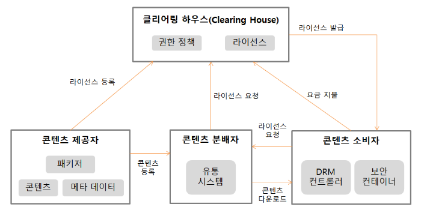

75/100
# 1. 소프트웨어 설계
### 1. 요구 분석 (Requirement Analysis)
- 요구 분석은 소프트웨어 개발의 실제적인 첫 단계로 사용자의 요구에 대해 이해하는 단계
- 요구 추출(Requirement Elicitation) : 프로젝트 계획단계에 정의한 문제의 범위 안에 있는 사용자의 요구를 찾는 단계
- 도메인 분석(Domain Analysis) : 요구에 대한 정보를 수집하고 배경을 분석하여 이를 토대로 모델링
- 기능적(Functional) 요구사항 : 서브 시스템의 특정 기능의 구현을 위해 해당 각 구성요소에 포함된 구축단위가 기능적으로 갖추어야 하는 사항

### 2. 다이어그램(Diagram)
- 요구 사항 정의 및 분석 · 설계의 결과물을 표현하기 위한 모델링 과정에서 사용되는 다이어그램
    - Data Flow Diagram
    - UML Diagram
    - E-R Diagram

    💡 AVL Diagram은 이진트리에서 활용

### 3. 럼바우(Rumbaugh) 객체지향 분석 기법
#### Rumbaugh 기법 = 객체모델링 기법(OMT; Object-Modeling Technique)
- 모든 소프트웨어 구성 요소를 그래픽 표기법을 이용해 모델링
> **객체 모델링 → 동적 모델링 → 기능 모델링**
##### 1. 객체 모델링 (Object Modeling) = 정보 모델링
- 요구되는 객체를 찾아내 속성과 연산 식별 및 객체들 간의 관계를 규정하여 객체 다이어그램으로 표시
##### 2. 동적 모델링 (Dynamic Modeling)
- 상태 다이어그램을 이용해 시간의 흐름에 따른 객체들 간의 제어흐름, 상호작용, 동작순서 등의 동적인 행위를 표현
##### 3. 기능 모델링 (Functional Modeling)
- 자료 흐름도(DFD)를 이용해 다수의 프로세스들 간의 자료 흐름을 중심으로 처리과정을 표현

### 4. 객체지향 분석 기법
- 동적 모델링 기법이 사용
- 데이터와 행위를 하나로 묶어 객체를 정의내리고 추상화 시키는 작업
- 코드 재사용에 의한 프로그램 생산성 향상 및 요구에 따른 시스템의 쉬운 변경 가능

### 5. 소프트웨어 아키텍처
- **소프트웨어의 골격이 되는 기본 구조**
- 구성하는 요소들 간의 관계를 표현하는 시스템의 구조
- **이해관계자들의 의사소통 도구**
- **좋은 품질 유지**
- 데이터 중심 아키텍처는 공유 데이터 저장소를 통해 접근자 간의 통신ㄴ이 이루어지므로 각 **접근자의 수정과 확장이 용이**
- 비기능적 요구사항 : 나타난 제약 반영
- 기능적 요구사항 : 구현하는 방법을 찾는 해결과정
- 애플리케이션 분할 방법과 분할된 모듈에 할당될 기능, 모듈 간의 인터페이스 결정
- 모듈화, 추상화, 단계적 분해, 정보은닉

# 2. 소프트웨어 개발
### 6. 테스트 드라이버
> 💡 테스트 드라이버와 테스트 스텁 차이점
> 
> 

### 7. 검증(Verification) vs 확인(Validation)
- 개발한 애플리케이션이 고객의 요구를 만족시키는지 확인(Validation), 기능이 정상적으로 수행하는지 검증(Verification)
- Validation(확인) = 사용자 입장 = 고객의 요구에 맞게 구현되었는지 확인
- Verification(검증) = 개발자 입장 = 명세서에 맞게 만들어졌는지 점검

#### 검증(Verification) 테스트
- 개발자 시각에서 제품의 생산 과정을 테스트
- 제품이 명세서대로 완성되었는지 테스트

#### 확인(Validation) 테스트
- 사용자 시각에서 생산된 제품의 결과를 테스트
- 사용자가 요구한대로 제품이 완성되었는지, 제품이 정상적으로 동작하는지 테스트

### 8. 품질 요구사항
- 기능성 (Functionality) : 요구사항을 정확하게 만족하는 기능을 제공하는지 여부
- 신뢰성 (Reliability) : 요구된 기능을 정확하고 일관되게 오류없이 수행할 수 있는 정도
- 사용성 (Usability) : 사용자가 쉽게 배우고 사용할 수 있으며, 향후 다시 사용하고 싶은 정도
- 효율성 (Efficiency) : 할당된 시간동안 한정된 사원으로 얼마나 빨리 처리할 수 있는지 정도
- 유지보수성(Maintainability) : 환경의 변화, 새로운 요구사항 시 개선하거나 확장할 수 있는 정도
- 이식성 (Portability) : 다른 환경에서도 쉽게 적용될 수 있는 정도

### 9. 테스트 케이스 생성 도구 (Test Case Generation Tools)
- 자료 흐름도 : 자료 원시 프로그램을 입력받아 파싱 후 자료 흐름도 작성
- 기능 테스트 : 주어진 기능을 구동시키는 모든 가능한 상태의 입력을 작성
- 입력 도메인 분석 : 원시 코드의 내부를 참조하지 않고, 입력 변수의 도메인을 분석하여 작성
- 랜덤 테스트 : 입력 값을 무작위로 추출하여 테스트

### 10. 디지털 저작권 관리의 흐름 및 구성요소

- 클리어링 하우스(Clearing house) : 저작권에 대한 사용권한, 라이선스 발급, 암호화된 키 관리, 사용량에 따른 결제 관리 등 수행하는 곳
- 콘텐츠 제공자(Contents Provider) : 콘텐츠를 제공하는 저작권자
- 패키저(Packager) : 콘텐츠를 메타 데이터와 함께 배포 가능한 형태로 묶어 암호화하는 프로그램
- 콘텐츠 분배자(Contents Distributor) : 암호화된 콘텐츠를 유통하는 곳이나 사람
- 콘텐츠 소비자(Customer) : 콘텐츠를 구매해서 사용하는 주체
- DRM 컨트롤러(DRM Controller) : 배포된 콘텐츠의 이용권한을 통제하는 프로그램
- 보안 컨테이너(Security Container) : 콘텐츠 원본을 안전하게 유통하기 위한 전자적 보안 장치

# 3. 데이터베이스 구축
### 11. 무결성 제약조건
#### 개체 무결정 (Entity Integrity, 실체 무결성)
- 기본 테이블의 기본키를 구성하는 어떤 속성도 NULL 값이나 중복값을 가질 수 없다는 규정

#### 도메인 무결성 (Domain Integrity, 영역 무결성)
- 주어진 속성 값이 정의된 도메인에 속한 값이어야 한다는 규정

#### 참조 무결성 (Referential Integrity)
- 외래키 값은 NULL이거나 참조 릴레이션의 기본키 값과 동일해야 함
- 릴레이션은 참조할 수 없는 외래키 값을 가질 수 없다는 규정
- 외래키와 참조하려는 테이블의 기본키는 도메인과 속성 개수가 같아야 함

#### 사용자 정의 무결성 (User-Defined Integrity)
- 속성 값들이 사용자가 정의한 제약 조건에 만족해야 한다는 규정

### 12. 키(Key) 제약조건
#### 후보키 (Candidate Key)
- 튜플을 유일하게 식별하기 위해 사용하는 속성들의 부분집합, 즉 기본키로 사용할 수 있는 속성들
- 중복된 튜플은 없으므로 모든 릴레이션에는 반드시 하나 이상의 후보키가 존재
- 모든 튜플에 대해서 유일성과 최소성을 만족시켜야 함
    - 유일성(Unique) : 하나의 키 값으로 하나의 튜플만을 유일하게 식별
    - 최소성(Minimally) : 모든 레코드들을 유일하게 식별하는데 꼭 필요한 속성으로만 구성

#### 기본키 (Primary Key)
- 후보키 중에서 특별히 선정된 주키(Main Key)
- 중복된 값 X
- 특정 튜플을 유일하게 구별할 수 있는 속성
- 후보키의 성질을 갖음 → 유일성, 최소성
- NULL 값 X

#### 대체키 (Alternate Key) = 보조키
- 후보키가 둘 이상일 때 기본키를 제외한 나머지 후보키

#### 슈퍼키 (Super Key)
- 속성들의 집합으로 구성된 키
- 릴레이션을 구성하는 모든 튜플 중 슈퍼키로 구성된 속성의 집합과 동일한 값을 나타내지 않음
- 유일성은 만족시키지만, 최소성은 만족시키지 못함

#### 외래키 (Foreign Key)
- 다른 릴레이션의 기본키를 참조하는 속성 또는 속성들의 집합
- 참조되는 릴레이션의 기본키와 대응되어 릴레이션 간에 참조 관계를 표현하는데 중요한 도구
- 속성 A와 참조 릴레이션의 기본키인 B가 동일한 도메인 상에서 정의 되었을 때의 속성 A를 외래키라고 함
- 외래키로 지정되면 참조 릴레이션의 기본키에 없는 값은 입력 불가

### 13. 인덱스
- 인덱스의 기본 목적은 검색 성능을 최적화하는 것
- B-트리 인덱스는 분기를 목적으로 하는 Branch Block을 가지고 있음
- BETWEEN 등 범위(Range) 검색에 활용
- 시스템이 자동으로 생성
- 사용자가 변경 가능

### 14. 병행제어 기법 로킹(Locking)
- 트랜잭션(transaction)이 접근하고자 하는 데이터를 잠가(lock) 다른 트랜잭션이 접근하지 못하도록 하는 병행 제어 기법
- 트랜잭션이 어떤 데이터에 접근하고자 할 때 로킹을 수행
- 로킹이 되어 있는 데이터에는 다른 트랜잭션이 접근할 수 없음
- 트랜잭션은 로킹이 된 데이터에 대해서만 연산을 수행
- 로킹 단위: 필드, 레코드, 테이블, 파일, 데이터베이스 모두 로킹 단위
- 한 번에 로킹 할 수 있는 객체의 크기를 로킹 단위

|로킹 단위|로크의 수|병행 제어|로킹 오버헤드|병행성 수준|데이터베이스 공유도|
|---|---|---|---|---|---|
|커짐|적어짐|단순해짐|감소|낮아짐|감소|
|작아짐|커짐|복잡해짐|증가|높아짐|증가|

### 15. 관계대수
- 관계형 데이터베이스에서 원하는 정보와 검색하기 위해서 어떻게 유도하는가를 기술하는 절차적인 언어
- 릴레이션을 처리하기 위해 연산자와 연산규칙을 제공하는 언어
    - 피연산자가 릴레이션 → 결과도 릴레이션
- 질의에 대한 해를 구하기 위해 수행해야 할 연산의 순서 명시
- 순수 관계 연산자 : Select, Project, Join, Division
- 일반 집합 연산자 : UNION(합집합), INTERSECTION(교집합), DIFFERENCE(차집합), CARTESIAN PRODUCT(교차곱)

### 16. 트랜잭션
- 데이터 무결성(Integrity)를 보장하기 위해 트랜잭셩이 가져야할 특성
- Atomicity(원자성)
    - 데이터베이스에 모두 반영되도록 완료(Commit)되든지 아니면 전혀 반영되지 않도록 복구(Rollback)되어야 함
    - 트랜잭션 내의 모든 명령은 반드시 완벽히 수행되어야 함
    - 모두 완벽히 수행되지 않고 어느 하나라도 오류가 발생하면 트랜잭션 전부가 취소되어야 함
- Consistency(일관성)
    - 트랜잭션이 그 실행을 성공적으로 완료하면 언제나 일관성 있는 데이터베이스 상태로 변환
    - 트랜잭션 수행 전과 수행 완료 유의 상태가 동일해야 함
- Isolation(독립성, 격리성, 순차성)
    - 하나의 트랜잭션 실행 중에 다른 트랜잭션의 연산이 끼어들 수 없음
    - 수행 중인 트랜잭션은 완전히 완료될 때까지 다른 트랜잭션에서 수행결과 참조 불가
- Durability(영속성, 지속성)
    - 성공적으로 완료된 트랜잭션의 결과는 시스템이 고장나더라도 영구적으로 반영

### 17. 함수적 종속(Functional Dependency)
- 데이터들이 어떤 기준값에 의해 종속되는 것
> ex)  
> - 수강 릴레이션이 (학번, 이름, 과목명)으로 되어 있을 때, 학번이 결정되면 과목명에 상관없이 학번에는 항상 같은 이름이 대응됨 
> - 학번에 따라 이름이 결정될 때 이름은 학번에 함수 종속적 
> - 학번 → 이름
- 완전 함수적 종속
    - 속성 A가 다른 속성 집합 B 전체에 대해 함수적 종속이지만 속성 집합 B의 어떠한 진부분집합 C(즉, C ⊂ B)에는 함수적 종속이 아닐 때, 속성 A는 속성 집합 B에 완전 함수적 종속
- 부분 함수적 종속
    - 속성 A가 다른 속성 집합 B 전체에 대해 함수적 종속이면서 속성 집합 B의 어떠한 진부분 집합에도 함수적 종속일 때, 속성 A는 속성 집합 B에 부분 함수적 종속

# 4. 프로그래밍 언어 활용
### 18. 페이지 교체 알고리즘

#### 1) OPT (OPTimal replacement, 최적 교체)
- 앞으로 가장 오랫동안 사용하지 않을 페이지를 교체하는 기법
- 벨레이디(Belady) 제안
- 페이지 부재 획수가 가장 적게 발생하는 가장 효율적인 알고리즘

#### 2) FIFO (First In First Out)
- 각 페이지에가 주기억장치에 정재될 때마다 그때의 시간을 기억시켜 가장 먼저 들어와서 가장 오래 있었던 페이지를 교체하는 기법
- 이해하기 쉽고, 프로그래밍 및 설계가 간단

#### 3) LRU (Least Recently Used)
- 가장 최근에 가장 오랫동안 사용하지 않은 페이지를 교체하는 기법
- 각 페이지마다 계수기(Counter)나 스택(Stack)을 두어 현 시점에서 가장 오랫동안 사용하지 않은, 즉 가장 오래 전에 사용된 페이지 교체

#### 4) LFU (Least Frequently Used)
- 사용 빈도가 가장 적은 페이지를 교체하는 기법
- 활발하게 사용되는 페이지는 사용 횟수가 많아 교체되지 않고 사용됨

#### 5) NUR (Not Used Recently)
- LRU와 비슷한 알고리즘
- 최근에 사용하지 않은 페이지를 교체하는 기법
- 최근에 사용되지 않은 페이지는 향후에도 사용되지 않을 가능성이 높다는 것을 전체로 LRU에서 나타나는 시간적인 오버헤트를 줄임
- 최근의 사용 여부를 확인하기 위해 각 페이지마다 참조비트(Reference Bit)와 변형비트(Modified Bit, Dirty Bit)가 사용됨

#### 6) SCR (Second Change Replacement, 2차 기회 교체)
- 가장 오랫동안 주기억장치에 있던 페이지 중 자주 사용되는 페이지의 교체를 방지하기 위한 것
- FIFO 기법의 단점 보완

# 5. 정보시스템 구축관리
### 19. 침입 탐지 시스템(IDS; Intrusion Detection System)
- 컴퓨터 시스템의 비정상적인 사용, 오용, 남용 등을 실시간으로 탐지하는 시스템
- 방화벽과 같은 침입 차단 시스템만으로는 내부 사용자의 불법적인 행동과 외부 해킹에 100% 완벽하게 대처할 수 없음
- 오용 탐지 : 미리 입력해 둔 공격 패턴이 감지되면 이를 알려줌
- 이상 탐지 : 평균적인 시스템의 상태를 기준으로 비정상적인 행위나 자원의 사용이 감지되면 이를 알려줌
- 침입 탐지 시스템의 위치
    - 패킷이 라우터로 들어오기 전 : 네트워크에 시도되는 모든 공격을 탐지
    - 라우터 뒤 : 라우터에 의해 패킷 필터링을 통과한 공격을 탐지
    - 방화벽 뒤 : 내부에서 외부로 향하는 공격을 탐지
    - 내부 네트워크 : 내부에서 내부 네트워크의 해킹 공격을 탐지
    - DMZ : 외부 인터넷에 서비스를 제공하는 서버가 위치하는 네트워크로, 강력한 외부 공격이나 내부 공격으로부터 중요 데이터를 보호하거나 서버의 서비스 중단을 방지

### 20.접근 통제 방법
- MAC(Mandatory Access Control) : 강제적 접근제어
    - 권한 할당을 정책과 규칙에 따라 강제하는 접근제어 모델
    - 주체(사용자)와 객체(자원)에 대한 레이블(label)이 할당
    - 보안 정책에 따라 레이블 간의 비교를 통해 접근 권한을 결정
- DAC(Discretionary Access Control) : 임의적 접근제어
    - 주체(사용자)가 객체(자원)에 대한 접근 권한을 결정하는 접근 제어 모델
    - 객체에 대한 소유자가 해당 객체에 대한 접근 권한을 설정
    - 소유자는 권한을 다른 사용자에게 부여하거나 취소할 수 있음
- RBAC(Rule-based Access Control) : 규칙기반 접근제어
    - 사용자의 역할을 기반으로 접근 권한을 제어하는 접근 제어 모델
    - 역할(role)을 정의하고, 각 역할에 대해 해당 역할이 수행할 수 있는 작업에 대한 권한을 할당
    - 사용자는 하나 이상의 역할을 가짐
    - 사용자가 속한 열할에 따라 접근 권한이 결정됨

### 21. VLAN (Virtual Local Area Network)
- 물리적인 네트워크와 상관없이 논리적으로 네트워크를 분리하는 기술
- 소속이 다르면 서로 통신 불가
- Switch의 모든 Port는 기본적으로 VLAN 1로 할당되어 있음
- Broadcast Domain을 구분할 수 있게 해주는 기술
- 접속된 장비들의 성능향상 및 보안성 증대 효과

### 22. 스토리지 기술
- Software Defined Storage
    - 소프트웨어를 이용하여 스토리지를 관리하고 제어하는 기술
    - 하드웨어와는 독립적으로 동작하며 가상화 기술을 활용하여 스토리지 자원을 효율적으로 관리
    - 유연성과 확장성이 뛰어나며, 비용 효율적인 스토리지 관리가 가능

### 23. COCOMO Model
- 보헴(Bohem)이 제안
- 원시 프로그램 규모인 LOC(원시 코드라인 수)에 의한 비용산정 기법
- 개발할 소프트웨어의 규모(LOC)를 예측한 후 이를 소프트웨어 종류에 따라 다르게 책정되는 비용 산정 방정식에 대입해 비용을 산정
- 비용 견적의 강도 분석 및 비용 견적의 유연성이 높아 소프트웨어 개발비 견적에 널리 통용됨
- 같은 규모의 프로그램이라도 그 성격에 따라 비용이 다르게 산정됨
- 비용 산정 결과는 Man-Month(노력)
#### COCOMO 소프트웨어 개발 유형
- 조직형(Organic Mode)
    - 기관 내부에서 개발된 중소규모의 소프트웨어로 일괄 자료 처리나 과학 기술 계산용
    - 비즈니스 자료 처리용으로 5만 라인(50KDSI) 이하의 소프트웨어을 개발하는 유형
    - 사무 처리용, 업무용, 과학용 응용 소프트웨어 개발에 적합
- 반분리형(Semi-Detached Mode)
    - 조직형과 내장형의 중간형으로 트랜잭션 처리 시스템이나 운영체제, 데이터베이스 관리시스템 등의 30만(300KDSI) 라인 이하의 소프트웨어를 개발하는 유형
    - 컴파일러, 인터프리터와 같은 유틸리티 개발에 적합
- 내장형(Embedded Mode)
    - 최대형 규모의 트랜잭션 처리 시스템이나 운영체제 등의 30만(300KDSI) 라인 이상의 소프트웨어를 개발하는 유형
    - 신호기 제어 시스템, 미사일 유도 시스템, 실시간 처리 시스템 등의 시스템 프로그램 개발에 적합
