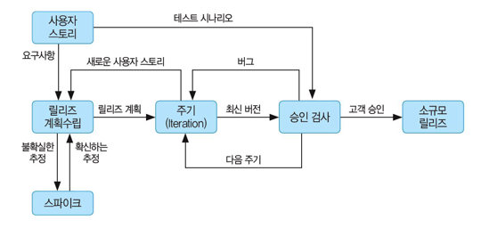
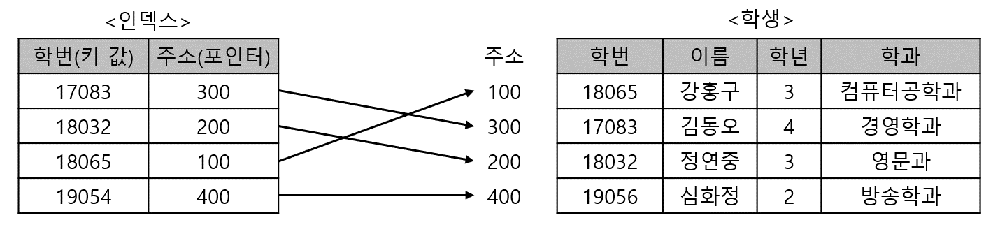
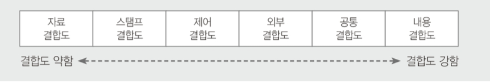

76/100
# 1. 소프트웨어 설계
### 1. UML 다이어그램 - 순차 다이어그램
- 행위(Behavioral) 다이어그램
- 객체 간의 동적 상호작용을 시간 개념을 중심으로 모델링
- 일반적으로 다이어그램의 수직 방향이 시간의 흐름을 나타냄
- 회귀 메시지(Self-Message), 제어블록(Statement block)등으로 구성
- 시스템이나 객체들이 메시지를 주고받으며 시간의 흐름에 따라 상호작용하는 과정을 액터, 객체, 메시지 등의 요소를 사용해 그림으로 표현한 것.
 

> **💡 순차 다이어그램의 구성요소**
> |구성요소|내용|
> |---|---|
> |액터 (Actor)|- 시스템으로부터 서비스를 요청하는 외부요소 = 사람|
> |객체 (Object)|- 메시지를 주고받는 주체|
> |생명선 (Lifeline)|- 객체가 메모리에 존재하는 기간, 객체 아래쪽에 점선을 그어 표현|
> |실행상자 (Active Box)|- 객체가 메시지를 주고받으며 구동되고 있음을 표현|
> |메시지 (Message)|- 객체가 상호작용을 위해 주고받는 메시지|

### 2. 메시지 지향 미들웨어(Message-Oriented Middileware)
- 메시지 기반의 비동기형 메시지를 전달하는 방식
- 분산 데이터 시스템의 데이터 동기를 위해 많이 사용
- 서로 다른 플랫폼에서 독립적으로 실행되는 소프트웨어 간의 상호작용을 통해 하나의 통합된 시스템처럼 동작되도록 함
- IBM의 MQ, 오라클의 Message Q, JCP의 JMS
- 송신측과 수신측의 연결 시 메시지 큐를 활용
- 상이한 애플리케이션 간 통신을 비동기 방식으로 지원

### 3. ⭐ XP (eXtreme Programming)
- 수시로 발생하는 고객의 요구사항에 유연하게 대응하기 위해 고객의 참여와 개발 과정의 반복을 극대화하여 개발 생산성을 향상시키는 방법
- 요구사항이 적용된 일부 기능이 완성될 때마다 이를 고객에게 보여주고 이에 대한 반응을 확인하는 과정을 최종 제품이 완성될 때까지 지속적으로 반복
- 짧고 반복적인 개발 주기, 단순한 설계, 고객의 적극적인 참여를 통해 빠르게 개발하는 것에 목적
- 릴리즈 기간을 짧게 반복, 요구사항 반영에 대한 가시성 높임
- 소규모 인원의 개발 프로젝트에 효과적
- 상식적인 원리와 경험을 최대한 끌어 올리는 것

> **💡 XP의 핵심가치**
> 1. 의사소통 (Communication)
> 2. 단순성 (Simplicity)
> 3. 용기 (Courage)
> 4. 존중 (Respct)
> 5. 피드백 (Reedback)

### XP 개발 프로세스

#### 사용자 스토리 (Use Story)
- 고객의 요구사항을 간단한 시나리오로 표현
- 기능 단위로 구성

#### 릴리즈 계획 수립 (Release Planning)
- 몇 개의 스토리가 적용되어 부분적으로 기능이 완료된 제품을 제공하는 것
- 부분 혹은 전체 개발 완료 시점에 대한 일정 수립

#### 스파이크 (Spike)
- 요구사항 신뢰성 높이고 기술 문제에 대한 위험 감소시키기 위해 별도로 만든 간단한 프로그램
- 처리할 문제 외의 다른 조건은 모두 무시하고 작성

#### 이터레이션 (Iteration)
- 하나의 릴리즈를 더 세분화 한 단위
- 일반적으로 1-3주 기간으로 진행
- 새로운 스토리 작성될 수 있으며, 진행 중인 이터레이션 혹은 다음 이터레이션에 포함될 수 있다.

#### 승인 검사 (Acceptance Test, 인수 테스트)
- 하나의 이터레이션 안에서 계획된 릴리즈 단위의 부분 완료 제품 수행 테스트
- 고객이 직접 수행
- 테스트 과정에서 발견한 오류 사항은 다음 이터레이션에 포함
- 테스트 이후 새로운 요구사항이 작성되거나 우선순위 변경될 수 있다.
- 테스트 완료되면 다음 이터레이션 진행

#### 소규모 릴리스 (Small Release)
- 고객의 반응을 기능별로 확인할 수 있어 고객의 요구사항에 좀 더 유연하게 대응
- 최종 테스트 완료 후 릴리즈(최종 결과물)를 고객에게 전달
- 릴리즈가 최종 완제품이 아닌 경우 다음 릴리즈 일정에 맞게 개발을 계속 진행

 

> **💡 XP 주요 실천 방법 (한글 & 영문)**
>
> |실천방법|내용|
> |---|---|
> |Pair Programming  (짝 프로그래밍)|개발에 대한 책임을 공동으로 나눠 같는 환경 조성|
> |Collective Ownership  (공동 코드 소유)|개발 코드에 대한 권한과 책임을 공동으로 소유|
> |Test-Driven Development  (테스트 주도 개발)|- 실제코드 작성 전, 테스트 케이스를 먼저 작성해 무엇을 할지 정확히 파악  - 자동화된 테스팅 도구(프레임워크 등)를 사용해 지속적으로 진행될 수 있도록 한다.|
> |Whole Team  (전체 팀)|참여하는 모든 구성원(고객 포함)들은 자신의 역할에 대하 책임을 가져야 한다.|
> |Continuos Integration  (계속적인 통합)|모듈 단위로 개발된 코드를 하나의 작업이 마무리될 때마다 지속적으로 통합|
> |Design Improvement / Refactoring  (디자인 개선 / 리팩토링)|프로그램의 기능 변경 없이 단순화, 유연성 강화 등을 통해 시스템을 재구성|
> |Small Releases  (소규모 릴리즈)|릴리즈 기간을 짧게 반복함으로써 고객의 요구 변화에 신속히 대응|

 

### 4. 유스케이스 (Use Case) 다이어그램
- 외부요소와 시스템 간의 상호작용을 확인
- 사용자 요구사항을 분석하기 위한 도구로 사용
- 시스템 범위 파악
 
> **💡 유스케이스 다이어그램의 구성요소**
> |구성요소|내용|
> |---|---|
> |시스템 / 시스템 범위  (System / System Scope)|- 시스템 내부에서 수행되는 기능들을 외부 시스템과 구분하기 위해 시스템 내부의 유스케이스들을 사각형으로 묶어 시스템 범위를 표현|
> |액터  (Actor)|- 시스템과 상호작용하는 모든 외부요소 (사람 등)  - 주액터 : 시스템을 사용함으로써 이득을 얻는 대상   - 부액터 : 주액터의 목적 달성을 위해 시스템에 서비스를 제공하는 외부 시스템 (조직, 기관 등)|
> |유스케이스  (Use Case)|- 사용자 관점에서 시스템이 액터에게 제공하는 서비스 또는 기능을 표현한 것|
> |관계  (Relationship)|- 액터 & 유스케이스, 유스케이스 & 유스케이스 사이에서 연관관계, 포함관계, 확장관계, 일반화관계를 표현|

### 5. 기능 요구사항 & 비기능 요구사항
#### 기능 요구사항 (Functional requirements)
- 시스템이 무엇을 하는지, 어떤 기능을 하는지
- 시스템의 입·출력 정보 / 데이터 정보
- ex) 금융 시스템은 조회, 인출, 입금, 송금 기능이 있어야 한다.
#### 비기능 요구사항 (Non-functional requirements)
- 시스템 장비 구성 요구사항
- 성능 요구사항
- 인터페이스 요구사항
- 데이터 요구사항
- 테스트 요구사항
- 보안 요구사항
- 품질 요구사항
- 제약사항
- 프로젝트 관리 요구사항
- 프로젝트 지원 요구사항
- ex) 차량 대여 시스템이 제공하는 모든 화면이 3초 이내에 사용자에게 보여야 한다.
- ex) 시스템의 초리량(Throughput), 반응시간 등의 성능 요구나 품질 요구
- ex) 시스템 구축과 관련된 안전, 보안에 대한 요구사항들

### 6. ⭐ 디자인 패턴
- GoF(Gang of Four) : 생성패턴 5개, 구조패턴 7개, 행위패턴 11개

> 💡 아키텍처 패턴 VS 디자인 패턴
> - 아키텍처 패턴은 디자인 패턴보다 상위 수준 설계
> - 아키텍처 패턴 : 전체 시스템 구조를 설계
> - 다자인 패턴 : 서브 시스템에 속하는 컴포넌트들과 관계를 설계
> - 디자인 패턴은 아키텍처 패턴을 구현하는데 유용

#### 디자인 패턴 장 · 단점
- 구조파악 용이
- 객체지향 설계 및 구현 생산성 높이는데 적합
- 재사용을 통해 개발 시간과 비용 절약
- 초기 투자 비용 부담
- 개발자 간 원활한 의사소통 가능
- 설계 변경 요청에 대한 유연한 대처 가능
- 객체지향을 기반으로 한 설계와 구현을 다루므로 다른 기반의 애플리케이션 개발에 적합하지 않음 (ex. 절차형 언어)

#### 생성 패턴 (Creational Pattern)
객체의 생성과 참조과정을 캡슐화하여 객체가 생성되거나 변경되어도 프로그램 구조에 영향을 크게 받지 않도록 하여 프로그램에 유연성을 더해줌

1. 추상 팩토리 (Abstract Factory)
2. 빌더 (Builder)
3. 팩토리 메소드 (Factory Method) = 가상 생성자 패턴 (Virtual Constructor Pattern)
4. 프로토타입 (Prototype)
5. 싱글톤 (Singleton)

#### 구조 패턴 (Structural Pattern)
클래스나 객체들을 조합해 더 큰 구조로 만들 수 있게 해주는 패턴으로 
구조가 복잡한 시스템을 개발하기 쉽게 도와줌

1. 어댑터 (Adapter)
2. 브리지 (Bridge)
3. 컴포지트 (Composite)
4. 데코레이터 (Decorator)
5. 퍼싸드 (Facade)
6. 플라이웨이트 (Flyweight)
7. 프록시 (Proxy)

#### 행위 패턴 (Behavioral Pattern)
클래스나 객체들이 서로 상호작용하는 방법이나 책임 분배 방법을 정의하는 패턴으로 하나의 객체로 수행할 수 없는 작업을 여러 객체로 분배하면서 결합도를 최소화 할 수 있도록 도와줌

1. 책임 연쇄 (Chain of Responsibility)
2. 커맨드 (Command)
3. 인터프리터 (Interpreter)
4. 반복자 (Iterator)
5. 중재자 (Mediator)
6. 메멘토 (Memento)
7. 옵서버 (Observer)
8. 상태 (State)
9. 전략 (Strategy)
10. 탬플릿 메소드 (Template Method)
11. 방문자 (Visitor)

# 2. 소프트웨어 개발

### 7. 워크스루(Walk Through)
- 동료검토(Peer Review) : 설명을 직접하고 동료들이 검토
- 인스펙션(Inspection) : 다른 전문가에게 검토
- 워크스루(Walk Through)
    - 미리 배포하여 짧은 검토회의
    - 사용사례를 호가장하여 명세하거나 설계 다이어그램, 원시코드, 테스트 케이스 등에 적용 가능
    - 복잡한 알고리즘 또는 반속, 실시간 동작, 병행 처리와 같은 기능이나 동작을 이해하려고 할 때 유용
    - 단순한 테스트 케이스를 이용하여 프로덕트를 수작업으로 수행해 보는 것

### 8. RCS (Revision Control System)
- 소스 파일 동시 수정 방지, 다른 방향으로 진행된 개발 결과를 합치거나 변경 내용 추적 가능

### 9. 알고리즘
- 주어진 작업을 수행하는 컴퓨터 명령어를 순서대로 나열한 것
- 검색(Searching)을 정렬되지 않은 데이터 혹은 정렬이 된 데이터 중에서 키값에 해당되는 데이터를 찾는 알고리즘
- 정렬(Sorting)은 흩어져 있는 데이터를 키값을 이용하여 순서대로 열거하는 알고리즘

### 10. 단위 테스트(Unit Test)
- 코딩 직후 소프트웨어 설계의 최소 단위인 모듈이나 컴포넌트에 초점을 맞춰 테스트
- 인터페이스, 외부적 I/O, 자료 구조, 독립적 기초 경로, 오류 처리 경로, 경계 조건
- 사용자 요구사항을 기반으로 기능성 테스트를 최우선으로 수행
- 구현 단계에서 각 모듈의 개발을 완료한 후 개발자가 명세서의 내용대로 정확히 구현되었는지 테스트
- 모듈 내부의 구조를 구체적으로 볼 수 있는 구조적 테스트를 주로 시행
- 테스트할 모듈을 호출하는 모듈, 테스트할 모듈이 호출하는 모듈

> 💡 단위 테스트로 발견 가능한 오류
> - 알고리즘 오류에 따른 원치 않는 결과
> - 탈출구가 없는 반복문
> - 틀린 계산 수식에 의한 잘못된 결과

# 3. 데이터베이스 구축

### 11. 인덱스
#### 인덱스 개념
- 데이터 레코드를 빠르게 접근하기 위해 <키 값, 포인터> 쌍으로 구성되는 데이터 구조

- 데이터가 저장된 물리적 구조와 밀접한 관계 존재
- 레코드가 저장된 물리적 구조에 접근하는 방법을 제공
- 파일의 레코드에 대한 액세스를 빠르게 수행
- 레코드 삽입, 삭제가 수시로 일어나는 경우, 인덱스의 개수를 최소로 하는 것이 효율적
- **DDL 이용하여 사용자가 생성, 변경, 제거**
- 인덱스가 없으면 특정한 값을 찾기 위해 모든 데이터 페이지를 확인하는 TABLE SCAN이 발생
- 기본 인덱스 : 기본키를 위한 인덱스
- 보조 인덱스 : 기본 인덱스가 아닌 인덱스
- 대부분 관계형 데이터베이스 관리 시스템에서는 모든 기본키에 대해 자동적으로 기본 인덱스 생성
- 클러스터드(Clustered)인데스 : 레코드의 물리적 순서가 인덱스의 엔트리 순서와 일치하게 유지되도록 구성되는 인덱스
- 인덱스를 구성하는 구조나 특징에 따라 트리 기반 인덱스, 비트맵 인덱스, 함수 기반 인덱스, 비트맵 조인 인덱스, 도메인 인덱스 로 분류

> 💡 클러스터드 인덱스 / 넌클러스터드 인덱스
> - 클러스터드 인덱스(Clustered Index)
>   - 인덱스 키의 순서에 따라 데이터가 정렬되어 저장되는 방식
>   - 실제 데이터가 순서대로 저장되어 있어 인덱스를 검색하지 않아도 원하는 데이터를 빠르게 찾음
>   - 데이터 삽입, 삭제 발생 시 순서를 유지하기 위해 데이터 재정렬
>   - 한 개의 릴레이션에 하나의 인덱스만 생성
> - 넌클러스터드 인덱스(Non-Clustered Index)
>   - 인덱스의 키 값만 정렬되어 있을 뿐 실제 데이터는 정렬되지 않는 방식
>   - 데이터를 검색하기 위해 먼저 인덱스를 검색하여 실제 데이터의 위치를 확인해야 하므로 클러스터드 인덱스에 비해 검색 속도 저하
>   - 한 개의 릴레이션에 여러 개의 인덱스 생성 가능

### 12. 레코드 설계 시 고려사항
- 데이터 타입
- 데이터 값의 분포
- 접근 빈도

### 13. 키(Key)의 종류
#### 후보키 (Candidate Key)
- 튜플을 유일하게 식별하기 위해 사용하는 속성들의 부분집합, 즉 기본키로 사용할 수 있는 속성들
- 중복된 튜플은 없으므로 모든 릴레이션에는 반드시 하나 이상의 후보키가 존재
- 모든 튜플에 대해서 **유일성과 최소성**을 만족시켜야 함
    - 유일성(Unique) : 하나의 키 값으로 하나의 튜플만을 유일하게 식별
    - 최소성(Minimally) : 모든 레코드들을 유일하게 식별하는데 꼭 필요한 속성으로만 구성

#### 기본키 (Primary Key)
- 후보키 중에서 특별히 선정된 주키(Main Key)
- 중복된 값 X
- 특정 튜플을 유일하게 구별할 수 있는 속성
- 후보키의 성질을 갖음 → 유일성, 최소성
- NULL 값 X

#### 대체키 (Alternate Key) = 보조키
- 후보키가 둘 이상일 때 기본키를 제외한 나머지 후보키

#### 슈퍼키 (Super Key)
- 속성들의 집합으로 구성된 키
- 릴레이션을 구성하는 모든 튜플 중 슈퍼키로 구성된 속성의 집합과 동일한 값을 나타내지 않음
- **유일성은 만족시키지만, 최소성은 만족시키지 못함**

#### 외래키 (Foreign Key)
- 다른 릴레이션의 기본키를 참조하는 속성 또는 속성들의 집합
- 참조되는 릴레이션의 기본키와 대응되어 릴레이션 간에 참조 관계를 표현하는데 중요한 도구
- 속성 A와 참조 릴레이션의 기본키인 B가 동일한 도메인 상에서 정의 되었을 때의 속성 A를 외래키라고 함
- 외래키로 지정되면 참조 릴레이션의 기본키에 없는 값은 입력 불가

### 14. 연산 (Operation)
- 데이터베이스에 저장된 실제 데이터를 처리하는 작업에 대한 명세로서 데이터베이스를 조작하는 기본 도구
- 데이터 구조에 따라 개념 세계나 컴퓨터 세계에서 실제로 표현된 값들을 처리하는 작업

### 15. 무결성 제약조건
#### 개체 무결정 (Entity Integrity, 실체 무결성)
- 기본 테이블의 기본키를 구성하는 어떤 속성도 NULL 값이나 중복값을 가질 수 없다는 규정

#### 도메인 무결성 (Domain Integrity, 영역 무결성)
- 주어진 속성 값이 정의된 도메인에 속한 값이어야 한다는 규정

#### 참조 무결성 (Referential Integrity)
- 외래키 값은 NULL이거나 참조 릴레이션의 기본키 값과 동일해야 함
- 릴레이션은 참조할 수 없는 외래키 값을 가질 수 없다는 규정
- 외래키와 참조하려는 테이블의 기본키는 도메인과 속성 개수가 같아야 함

#### 사용자 정의 무결성 (User-Defined Integrity)
- 속성 값들이 사용자가 정의한 제약 조건에 만족해야 한다는 규정

# 4. 프로그래밍 언어 활용
### 16. IP 프로토콜에서 사용하는 필드
- Header Length : IP 프로토콜의 헤더 길이를 32비트 워드 단위로 표시
- Packet Length : 패킷의 최대 크기는 216-1
- Time To Live : 송신 호스트가 패킷을 전송하기 전 네트워크에서 생존할 수 있는 시간을 지정한 것
- Version Number : IP 프로토콜의 버전번호

### 17. RIP 라우팅 프로토콜
- 거리벡터 알고리즘에 기초하여 개발된 라우팅 프로토콜
- 경로 선택 메트릭은 홉 카운트(hop count)
- IGP(Interior Gateway Protocol)용
- 소규모 또는 교육용 등 비교적 간단한 네트워크에 주로 사용됨
- 최단 경로 탐색에 Bellman-Ford 알고리즘 사용
- 각 라우터는 이웃 라우터들로부터 수신한 정보를 이용하여 라우팅 표를 갱신

### 18. UNIX 운영체제 특징
- 1960년대 AT&T 벨(Bell)연구소, MIT, General Eletric이 공동 개발
- 시분할 시스템(Time Sharing System)을 위해 설계된 대화식 운영체제
- 소스가 공개된 개방형 시스템(Open System)
- 대부분 C언어로 작성되어 있어 이식성이 높으며 장치, 프로세스 간의 호환성이 높음
- 크기가 작고 이해하기 쉬움
- 다중 사용자(Multi-User), 다중 작업(Multi-Tasking) 지원
    - 여러 사용자가 동시에 시스템을 사용하고, 여러개의 작업이나 프로그램을 동시에 수행하는 것
    - 하나 이상의 작업을 백그라운드에서 수행하므로 여러 작업을 동시에 처리할 수 있음
- 통신망(Network) 관리용 운영체제로 적합
- 트리 구조의 파일 시스템을 갖음
- 전문적인 프로그램 개발에 용이
- 다양한 유틸리티 프로그램이 존재

### 19. IP 프로토콜 주요특징
- 패킷을 분할, 병합하는 기능을 수행하기도 한다.
- 비연결형 서비스를 제공한다.
- Best Effort 원칙에 따른 전송 기능을 제공한다.

### 20. 스레드(Thread)
#### 사용자 수준에서 지원되는 스레드가 커널에서 지원되는 스레드에 비해 가지는 장점
- 커널 모드로의 전환없이 스레드 교환이 가능하므로 오버헤드가 줄어듦

### 21. 결합도(Coupling)
- 모듈 간에 상호 의존하는 정도 / 모듈 간의 연관관계
- 결합도가 약할수록 품질이 높고, 강할수록 품직이 낮음
- 결합도가 강하면 시스템 구현 및 유지보수 작업이 어려움

#### 1) 자료 결합도 (Data Coupling)
- 모듈 간 인터페이스가 자료 요소로만 구성될 때
- 모듈이 다른 모듈을 호출하면서 매개변수로 데이터를 넘겨주고, 결과를 다시 돌려주는 방식
- 모듈의 내용을 변경하더라도 다른 모듈에 전혀 영향을 미치지 않는 가장 바람직한 결합도
#### 2) 스탬프(검인) 결합도 (Stamp Coupling)
- 모듈 간 인터페이스로 배열이나 레코드 등의 자료 구조가 전달될 때
- 두 모듈이 동일한 자료 구조를 조회하는 경우
- 자료 구조의 변화(포맷이나 구조 변화) 조회하는 모든 모듈 및 변화되는 필드를 실제로 조회하지 않는 모듈에까지도 영향을 미침
#### 3) 제어 결합도 (Control Coupling)
- 모듈이 다른 모듈 내부의 논리적인 흐름을 제어하기 위해 제어 신호를 이용하여 통신하거나 제어요소(Function Code, Switch, Tag, Flag)를 전달
- 모듈이 다른 모듈의 상세한 처리 절차를 알고 있어 이를 통제하는 경우
- 처리 기능이 두 모듈에 분리되어 설계된 경우
#### 4) 외부 결합도 (External Coupling)
- 모듈에 선언된 데이터(변수)를 외부의 다른 모듈에서 참조할 때
- 참조되는 데이터의 범위를 각 모듈에서 제한
#### 5) 공통(공유) 결합도 (Common Coupling)
- 공통 데이터 영역을 여러 모듈이 사용할 때
- 내용을 조금만 변경하더라도 이를 사용하는 모든 모듈에 영향을 미치므로 모듈의 독립성을 약하게 만든다.
#### 6) 내용 결합도 (Content Coupling)
- 모듈이 다른 모듈의 내부 기능 및 내부 자료를 직접 참조하거나 수정할 때
- 모듈에서 다른 모듈의 내부로 제어가 이동하는 경우에도 내용 결합도에 해당

### 응집도 (Cohesion)
- 정보은닉 개념을 확장한 것
- 명령어나 호출문 등 모듈의 내부요소들의 서로 관련되어 있는 정도
- 모듈이 족립적인 기능으로 정의되어 있는 정도
- 응집도가 강할수록 품질이 높고, 약할수록 품질이 낮다.

#### 1) 우연적 응집도 (Coincidental Cohesion)
- 모듈 내부의 각 구성요소들이 서로 관련 없는 요소로만 구성된 경우
#### 2) 논리적 응집도 (Logical Cohesion)
- 유사한 성격을 갖거나 특정 형태로 분류되는 처리 요소들로 하나의 모듈이 형성되는 경우
#### 3) 시간적 응집도 (Temporal Cohesion)
- 특정 시간에 처리되는 몇 개의 기능을 모아 하나의 모듈로 작성할 경우
#### 4) 절차적 응집도 (Procedural Cohesion)
- 모듈이 다수의 관련 기능을 가질 때, 모듈 안의 구성 요소들이 그 기능을 순차적으로 수행할 경우
#### 5) 교환(통신)적 응집도 (Communication Cohesion)
- 동일한 입력과 출력을 사용해 서로 다른 기능을 수행하는 구성 요소들이 모였을 경우
#### 6) 순차적 응집도 (Sequential Cohesion)
- 모듈 내 하나의 활동으로부터 나온 출력 데이터를 그 다음 활동의 입력 데이터로 사용할 경우
#### 7) 기능적 응집도 (Functional Cohesion)
- 모듈 내부의 모든 기능 요소들이 단일 문제와 연관되어 수행될 경우

# 5. 정보시스템 구축관리

### 22. TCP Wrapper
- 외부 컴퓨터가 접속되면 접속 인가 여부를 점검해서 인가된 경우에는 접속이 허용되고, 그 반대의 경우 거부할 수 있는 접근제어

### 23. 대칭 암호 알고리즘 & 비대칭 암호 알고리즘
#### 대칭 암호 알고리즘
- 실행 속도가 빠름
- 다양한 암호의 핵심 함수로 사용
- AES, IDEA

#### 비대칭 암호 알고리즘
- 자신만이 보관하는 비밀키를 이용해 인증, 전자서명 등 적용 가능

### 24. 접근 통제 방법
- RBAC : 조직 내에서 직무, 직책 등 개인의 역할에 따라 결정

### 25. COCOMO(Constructive Cost Model)
- 프로젝트를 완성하는데 필요한 man-month로 산정 결과를 나타냄
- 보헴(Boehm)이 제안한 것으로 원시코드 라인 수에 의한 비용 산정 기법
- 비교적 작은 규모의 프로젝트 기록을 통계 분석하여 얻은 결과를 반영한 모델
- 중소 규모 소프트웨어 프로젝트 비용 추정에 적합