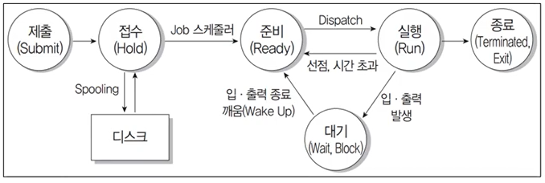

65/100
### 1. 용어 - 네트워크 (O)
- IPv4(Internet Protocol version 4)
    - 8비트씩 4부분, 총 32비트로 구성
    - A클래스 ~ E클래스 총 5단계로 구성
- IPv6(Internet Protocol version 6)
    - 16비트씩 8부분, 128비트로 구성
    - IPv4의 주소 부족 문제를 해결하기 위해 개발
    - 각 부분을 16진수로 표현하고 콜론(:)으로 구분
    - 인증성, 기밀성, 데이터 무결성의 지원으로 모안문제 해결

### 2. 용어 - 디자인 패턴
- 1995년 GoF(Gang of Four)라고 불리는 에릭 감마(Erich Gamma), 리차드 헬름(Richard Helm), 랄프 존슨(Ralph Johnson), 존 블리시디스(John Vissides)가 처음으로 구체화 및 체계화
- 일반적인 사례에 적용할 수 있는 패턴들을 분류하여 정리함으로써, 지금까지도 소프트웨어 공학이나 현업에서 가장 많이 사용되는 디자인 패턴
- 총 23가지 이며, 생성, 구조, 행위 3가지로 분류
- 모듈 간의 관계 및 인터페이스를 설계할 때 참조할 수 있는 전형적인 행결방식 또는 예제

### 3. 용어 - UML 다이어그램 (O)

### 4. 용어 - 회복기법 (X)
- 로그 기반 회복 기법
    - 즉시 갱신 회복 기법
        - 트랜잭션 수행 중에 데이터를 변경한 연산의 결과를 데이터베이스에 즉시 반영하는 기법
        - 장애가 발생하여 회복 작업할 경우를 대비해 갱신된 내용들은 로그에 보관
        - REDO, UNDO 모두 수행 가능
    - 지연 갱신 회복 기법
        - 트랜잭션 수행하는 동안에는 데이터 변경 연산의 결과를 데이터베이스에 즉시 반영하지 않고 로그파일에 기록해두었다가 트랜잭션이 부분완료된 후에 로그레 기록된 내용을 이용해 데이터베이스에 한 번에 반영
        - REDO만 수행
- 검사점 회복 기법
    - 로그 회복 기법과 같이 로그 기록을 이용하되, 일정 시간 간격으로 검사시점(Checkpoint)을 만들어 둠
    - 장애가 발생하면 가장 최근 검사 시점 이전의 트랜잭션에는 회복 작업을 수행하지 않고, 이후의 트랜잭션에만 회복작업 수행
- 그림자 페이징 회복 기법
    - 로그를 사용하지 않고, 데이터베이스를 동일한 크기의 단위인 페이지로 나누어 각 페이지마다 복사하여 그림자 페이지를 보관
    - 데이터베이스의 변경되는 내용을 원본 페이지에만 적용하고, 장애가 발생되는 경우 그림자 페이지를 이용해 회복
- 미디어 회복 기법
    - 전체 데이터베이스의 내용을 일정 주기마다 다른 안전한 저장장치에 복사해두는 덤프를 이용
    - REDO 연산
    - 비용이 많이 들고 복사하는 동안 트랜잭션 수행을 중단해야 하므로 CPU가 낭비되는 단점 존재
- ARIES 회복 기법(분석, REDO, UNDO)
    - REDO(재실행) : 장애가 발생하기 직전의 데이터베이스 상태로 복구
    - UNDO(취소) : 모든 변경 연산을 취소해 데이터베이스를 원래의 상태로 복구

### 5. 프로그램밍 언어 - 출력값 (O)

### 6. 용어 - 네트워크 보안 (X)
- Session Hijacking
    - 세션을 가로채다
    - 정상적인 연결을 RST 패킷을 통해 종료시킨 후 재연결 시 희생자가 아닌 공격자에게 연결하는 공격 기법
    - 공격자가 TCP 3-Way-Handshake 과정에 끼어듦으로써 서버와 상호 간의 동기화된 시퀀스 번호를 갖고 인가되지 않은 시스템의 기능을 이용하거나 중요한 정보에 접근할 수 있게 됨
- ARP 스푸핑(ARP Spoofing)
    - ARP 취약점을 이용한 공격 기법
    - 자신의 물리적 주소(MAC)를 공격 대상의 것으로 변조해 공격대상에게 도달해야 하는 데이터 패킷을 가로채거나 방해하는 기법
- 스니핑(Sniffing)
    - 코를 킁킁 거리나, 냄새를 맡다
    - 네트워크의 중간에서 남의 패킷 정보를 도청하는 해킹 유형
    - 수동적 공격
- 워터링 홀(Watering Hole)
    - 대상자의 정보를 미리 수집하여 대상자가 주로 방문하는 웹 사이트를 미리 감염시킨 뒤 잠복하면서 피해자의 컴퓨터에 악성코드를 추가로 설치하는 공격
- 키로서 공격(Key Logger Attack)
    - 컴퓨터 사용자의 움직임을 탐지해 ID, 패스워드, 계좌번호, 카드번호 등과 같은 개인의 중요한 정보를 몰래 빼가는 해킹 공격
- 랜섬웨어(Ransomware)
    - 내부 문서나 파일 등을 암호화해 사용자가 열지 못하게 하는 프로그램
    - 암호 해동용 프로그램의 전달을 조건으로 사용자게에 돈을 요구하기도 함
- 백도어(Back Door, Trap Door)
    - 시스템 설계자가 서비스 기술자나 유지보수 프로그램 작성자의 액서스 편의를 위해 시스템 보안을 제거하여 만들어 놓은 비밀 통로로 컴퓨터 범죄에 악용되기도 함
    - 백도어 탐지 방법
        - 무결성 검사
        - 열린 포트 확인
        - 로그 분석
        - SetUID 파일 검사

### 7. 프로그래밍 언어 - 괄호 (X)
- 코드 익히기

### 8. 프로그래밍 언어 - 출력값 (O)

### 9. DB - SQL (O)

### 10. 프로그래밍 언어 - 출력값 (O)

### 11. 용어 - 네트워크 (O)
- NAT
    - 네트워크 주소 변환(Network Address Translation)
    - 1개의 정식 IP주소에 다량의 가상 사설 IP주소를 할당 및 연결하는 방식
    - 1개의 IP주소를 사용해 외부에 접속할 수 있는 노드는 어느 시점에서 1개만으로 제한되는 문제가 있으나, 이 때에는 IP 마스커레이드(Masquerade)를 이용하면 됨

### 12. 용어 - 분산 컴퓨팅 (O)
- 하둡(Hadoop)
    - 오픈 소스 기반 분산 컴퓨팅 플랫폼
    - 더그 커팅과 마이크 캐퍼렐라가 개발
    - 구글의 맵리듀스(MapReduce) 엔진을 사용
    - 일반 PC급 컴퓨터들로 가상화된 대형 스토리지를 형성하고 그 안에 보관된 거대한 데이터 세트를 병렬로 처리할 수 있도록 개발
    - 분산 저장된 데이터들은 클러스터 환경에서 병렬 처리됨
- 맵리듀스(MapReduce)
    - 대용량 데이터를 분산 처리하기 위한 목적으로 개발된 프로그래밍 모델
    - Map : 흩어져 있는 데이터를 연관성 있는 데이터 분류로 묶는 작업
    - Reduce : 중복 데이터를 제거하고 원하는 데이터를 추출하는 작업
- 데이터 마이닝(Data Mining)
    - 대량의 데이터를 분석해 데이터에 내재된 변수 사이의 상호관계를 규명하여 일정한 패턴을 찾아내는 기법
- 타조(Tajo)
    - 하둡 기반의 분산 데이터 웨어하우스 프로젝트
- OLAP(Online Analytical Processing)
    - 다차원으로 이루어진 데이터들로부터 통계적인 요약 정보를 분석해 의사결정에 확용하는 방식
    - Roll-up, Drill-doen, Drill-through, Drillacross, Pivoting, Slicing, Dicing
- 브로드 데이터(Broad Data)
    - 다양한 채널에서 소비자와 상호작용을 통해 생성된 것
    - 기업 마케팅에 효율적이고 다양한 데이터
    - 이전에 사용하지 않거나 알지 못했던 새로운 데이터나 기존 데이터에 새로운 가치가 더해진 데이터

### 13. 용어 - 테스트 오라클 (X)
- 테스트 결과가 올바른지 판단하기 위해 사전에 정의된 참 값을 대입하여 비교하는 기법
- 예상 결과를 계산하거나 확인
- 제한된 검증, 수학적 기법, 자동화 기법
- 참(Treu) 오라클
    - 모든 테스트 케이스의 입력 값에 대해 기대하는 결과를 제공하는 오라클
    - 발생된 모든 오류 검출 가능
- 샘플링(Sampling) 오라클
    - 특정 몇몇 테스트 케이스의 입력 값들에 대해서만 기대하는 결과를 제공하는 오라클
    - 전수 테스트가 불가능한 경우 사용
- 일관성 검사(Consistent) 오라클
    - 테스트 케이스 수행 전과 후의 결과 값이 동일한지 확인하는 오라클

### 14. DB - 이상(Anomaly) (O)
- 삽입, 삭제, 갱신

### 15. 용어 - 테스트 (X)
- Equivalence Partition (동치 분할 검사) - 블랙박스 테스트
    - 입력 조건에 타당한 입력 자료와 타당하지 않은 입력 자료 개수를 균등하게 하여 테스트 케이스 정함
    - 해당 입력 자료에 맞는 결과가 출력되는지 확인
    - 동등 분할 기법, 동치 클래스 분해
- Boundary Value Analysis (경계값 분석) - 블랙박스 테스트
    - 입력 조건의 중간 값보다 경계값에서 오류 발생 확률이 높다는 점
    - 입력 조건의 경계값을 테스트 케이스로 선정
- Cause-Effect Graph (원인-효과 그래프) - 블랙박스 테스트
    - 입력 데이터 간의 관계와 출력에 영향을 미치는 상황을 분석 수, 효용성이 높은 테스트 케이스를 선정하여 검사
- Error Guess (오류 예측 검사) - 블랙박스 테스트
    - 과거 경험이나 확인자의 감각으로 테스트하는 기법
- Comparision Test(비교 검사) - 블랙박스 테스트
    - 여러 버전의 프로그램에 동일한 테스트 자료를 제공하여 동일한 결과가 출력되는지 확인
- Base Path Test (기초 경로 검사) - 화이트박스 테스트
    - 절차적 설계의 논리적 복잡성 측정
- Loop Test (루프 검사) - 화이트박스 테스트
    - 반복 구조에 초점을 맞춰 실시
- Data Flow Test (데이터 흐름 검사) - 화이트박스 테스트
    - 변수의 정의와 사용 위치에 초점을 맞춰 실시

### 16. 용어 - 운영체제 (O)
- UNIX
    - 1960년대 AT&T 벨(Bell) 연구소가 MIT, General Electric 사와 함께 공동 개발한 운영체제
    - 시분할 시스템을 위해 설계된 대화식 운영체제
    - 대부분 C언어로 작성되어 있어 이식성이 높으며 장치, 프로세스 간의 호환성이 높음
    - 트리 구조의 파일 시스템

### 17. 용어 - SW기술 (X)
- 블록체인(Blockchain)
    - P2P(Peer-to-Peer) 네트워크를 이용해 온라인 금융 거래 정보를 온라인 네트워크 참여자(Peer)의 디지털 장비에 분산 저장하는 기술

### 18. 용어 - 프로세스 상태 전이도 (O)

### 19. 프로그래밍 언어 - 출력값 (O)

### 20. 용어 - 데이터베이스 보안
- 가용성(Availability)
    - 인가받은 사용자는 시스템 내의 정보와 자원을 언제라도 사용할 수 있음
- 기밀성(Confidentiality)
    - 시스템 내의 정보와 자원은 인가된 사용자에게만 접근 허용
    - 정보가 전송 중에 노출되더라도 데이터를 읽을 수 없음
- 무결성(Integrity)
    - 시스템 내의 정보는 오직 인가된 사용자만 수정할 수 있음