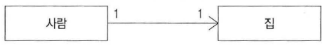
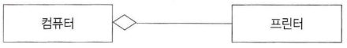
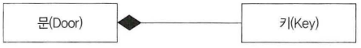
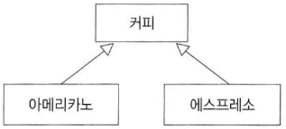
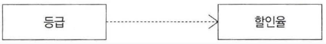
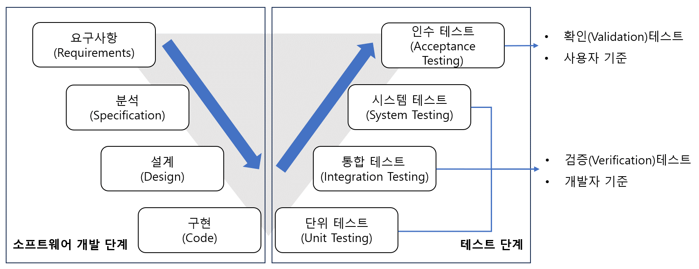

60/100
### 1. 용어 - OSI 계층 (O)
- 물리 계층(Physical Layer)
    - 전송에 필요한 두 장치 간의 실제 접속과 절단 등 기계적, 전기적, 기능적, 절차적 특성에 대한 규칙 정의
- 데이터 링크 계층(Data Link Layer)
    - 두 개의 인접한 개발 시스템들 간에 신뢰성 있고 효율적인 정보 전송을 할 수 있도록 시스템 간의 연결 설정과 유지 및 종료를 담당
    - 연결 설정, 데이터 전송, 오류제어
- 네트워크 계층(Network Layer)
    - 개발 시스템들 간의 네트워크 연결과 관리하는 기능과 데이터의 교환 및 중계 기능
    - 경로 제어, 패킷 교환, 트래픽 제어
    - telnet, FRP, HTTP, POP, SMTP, TCP
- 전송 계층(Transport Layer)
    - 논리적 안정과 균일한 데이터 전송 서비스를 제공함으로써 종단 시스템 간에 투명한 데이터 전송을 가능하게 함
- 세션 계층(Session Layer)
    - 송 · 수신 간의 관련성을 유지하고 대화 제어를 담당
- 표현 계층(Presentation LAyer)
    - 서로 다른 데이터 표현 형태를 갖는 시스템 간의 상호 접속을 위해 필요한 계층
    - 코드 변환, 데이터 암호화, 데이터 압축, 구문 검색, 정보 형식(포맷) 변환, 문맥관리
- 응용 계층(Application Layer)
    - 사용자가 OSI 환경에 접근할 수 있도록 서비스 제공

### 2. 용어 - 객체지향 (O)
- 다형성(Polymorphism)
    - 여러 가지 형태를 가지고 있다는 의미
    - 하나의 메시지에 대해 각각의 객체가 가지고 있는 고유한 방법으로 응답할 수 있는 능력
    - 하나의 메시지에 대해 여러 가지 형태로 응답
    - 다른 형태의 특성을 갖는 객체로 이용될 수 있는 성질
    - 동일한 메소드명을 사용해 같은 의미의 응답을 함
- 캡슐화(Encapsulation)
    - 외부에서 접근을 제한하기 위해 인터페이스를 제외한 세부 내용을 은닉
    - 외부 모듈의 변경으로 인한 파급효과가 적음
    - 객체 간 메시지를 주고받을 때 상대 객체의 세부 내용을 알 필요가 없으므로 인터페이스가 단순해지고, 객체 간의 결합도가 낮아짐
- 상속(Inheritance)
    - 상위 클래스의 모든 속성과 연산을 하위 클래스가 물려받는 것
    - 하위 클래스는 물려받은 속성과 연산을 다시 정의하지 않아도 즉시 자신의 속성으로 사용 가능
    - 하위 클래스는 상속받은 속성과 연산 외의 새로운 속성과 연산을 첨가하여 사용 가능

### 3. 용어 - UML 관계 (O)
- 연관관계(Association)
    - 실선, 화살표
    - 2개 이상의 사물이 서로 관련된 관계
    - 사람이 집을 소유하는 관계(사람은 집을 알지만 집은 소유되고 있는 사람을 모름)
    
- 집합관계(Aggregation)
    - 빈마름모
    - 하나의 사물이 다른 사물에 포함되어 있는 관계
    - 포함하는 쪽, 포함되는 쪽은 서로 독립적
    - 프린터는 컴퓨터에 연결해서 사용, 다른 컴퓨터에도 연결해서 사용 가능
    
- 포함관계(Composition)
    - 꽉찬 마름모
    - 집합관계의 특수한 형태
    - 포함하는 사물의 변화가 포함되는 사물에게 영향을 미치는 관계
    - 포함하는 쪽, 포함되는 쪽은 서로 독립될 수 없고 생명주기를 함께함
    - 문을 여는 키는 하나, 해당 키로 다른 문을 열 수 없다. 문이 없어지면 키도 필요하지 않음
    
- 일반화관계(Generalization)
    - 실선, 빈화살표
    - 하나의 사물이 다른 사물에 비해 더 일반적이거나 더 구체적인 관계
    - 아메리카노와 에스프레소틑 커피
    
- 의존관계(Dependency)
    - 점선, 화살표
    - 연관관계와 같이 사물 사이에 서로 연관은 있으나 필요에 의해 서로에게 영향을 주는 짧은 시간동안만 연관을 유지하는 관계
    - 소유 관계는 아니지만 사물의 변화가 다른 사물에 영향을 미치는 관계
    - 등급이 높으면 할인율 적용, 등급이 낮으면 할인율 적용하지 않음
    
- 실체화관계(Realization)
    - 점섬, 빈화살표
    - 사물이 할 수 있거나 해야 하는 기능, 서로를 그룹화 할 수 있는 관계
    - 한 객체가 다른 객체에게 오퍼레이션을 수행하도록 지절하는 의미적 관계
    - 비행기는 날 수 있고 새도 날 수 있다.
    

### 4. 용어 - 병행제어 (O)
- 동시에 실행되는 트랜잭션들이 DB의 일관성을 파괴하지 않도록 트랜잭션들 간의 상호작용을 제어하는 것
- 로킹(Locking)
    - 트랜잭션들이 데이터에 접근하기 전에 잠금을 요청해 잠금이 되어야만 접근할 수 있도록 하는 기법
    - 데이터의 엑세스를 상호 베타적으로 운용하여 병행제어로 발생할 수 있는 갱신 분식, 비완료 의존성, 연쇄 복귀 등의 문제점을 예방
    - 로킹 단위 : DB, 파일, 레코드, 필드
    - 로킹 단위 ↑, 로크 수 ↓, 관리 쉬움, 병행성 수준 낮아짐
    - 로킹 단위 ↓, 로크 수 ↑, 관리 복잡, 오버헤드 증가, 병행성 수준 높아짐
- 타임스템프
    - 직렬성 순서를 결정하기 위해 트랜잭션 간의 처리 순서를 미리 선택하는 기법들 중에서 가장 보편적인 방법
#### 회복기법
- 로그 기반 회복 기법
    - 즉시 갱신 회복 기법
        - 트랜잭선 수행 중에 데이터를 변경한 연산의 결과를 데이터베이스에 즉시 반영하는 기법
        - 장애가 발생하여 회복 작업할 경우를 대비해 갱신된 내용들은 로그에 보관
        - REDO, UNDO 모두 수행 가능
    - 지연 갱신 회복 기법
        - 트랜잭션 수행하는 동안에는 데이터 변경 연산의 결과를 데이터베이스에 즉시 반영하지 않고 로그 파일에 기록해두었다가 트랜잭션이 부분완료된 후에 로그에 기록된 내용을 이용해 데이터베이스에 한 번에 반영
        - REDO만 수행
- 검사점 회복 기법
    - 로그 회복 기법과 같이 로그 기록을 이용하되, 일정 시간 간격으로 검사시점(Checkpoint)을 만들어 둠
    - 장애가 발생하면 가장 최근 검사 시점 이전의 트랜잭션에는 회복 작업을 수행하지 않고, 이후의 트랜잭션에만 회복작업 수행
- 그림자 페이징 회복 기법
- 미디어 회복 기법
    - 전체 데이터베이스의 내용을 일정 주기마다 다른 안전한 저장 장치에 복사해두는 덤프를 이용
    - REDO 연산
    - 비용이 많이 들고 복사하는 동안 트랜잭션 수행을 중단해야 하므로 CPU가 낭비되는 단점
- ARIES 회복 기법(분석, REDO, UNDO)
    - REDO(재실행) : 장애가 발생하기 직전의 데이터베이스 상태로 복구
    - UNDO(취소) : 모든 변경 연산을 취소해 데이터베이스를 원래의 상태로 복구

### 5. 프로그래밍 언어 - 출력값 (O)

### 6. 개념 (O)
- 랜섬웨어(Ransomware)
    - 내부 문서나 파일 등을 암호화해 사용자가 열지 못하게 하는 프로그램
    - 암호 해독용 프로그램의 전달을 조건으로 사용자게에 돈을 요구하기도 함

### 7. 프로그래밍 언어 - 괄호 (X)
- 코드 익히기

### 8. 프로그래밍 언어 - 괄호 (X)
- 코드 익히기

### 9. DB - SQL (O)

### 10. 프로그래임 언어 - 출력값 (O)

### 11. 용어 - 네트워크 신기술 (X)
- 애드 혹 네트워크(Ad-hoc Network)
    - 재난 및 군사 현장과 같이 별도의 고정된 유선망을 구축할 수 없는 장소에서 모바일 호스트만을 이용해 구성한 네트워크
    - 망을 구성한 후 단기간 사용되는 경우나 유선망을 구성하기 어려운 경우 적합
- 메시 네트워크(Mesh Network)
    - 차세대 이동 통신, 홈네트워킹, 공공 안전 등 특수 목적을 위한 새로운 방식의 네트워크 기술
    - 대규모 디바이스의 네트워크 생성에 최적화되어 있음
- 피코넷(PICONET)
    - 독립된 통신장치가 블루투스 기술이나 UWB 통신 기술을 사용해 통신망을 형성하는 무선 네트워크
- 파장 분할 다중화(WDM; Wavelength Division Multiplexing)
    - 광섬유를 이용한 통신 기술
    - 파장이 서로 다른 복수의 신호를 보냄으로써 여러 대의 단말기가 동시에 통신회선을 사용할 수 있도록 하는 기술
- 소프트웨어 정의 데이터센터(SDDC; Software Defined Data Center)
    - 데이터 센터의 모든 자원을 가상화하여 인력의 개입없이 소프트웨어 조작만으로 관리 및 제어되는 데이터 센터
    - 컴퓨팅, 네트워킹, 스토리지, 관리 등
- 개방형 링크드 데이터(LOD; Linked Open Data)
    - 누구나 사용할 수 있도록 웹상에 공개된 연계 데이터
    - 웹상에 존재하는 데이터는 개발 URI로 식별
    - 각 URI에 링크 정보를 부여함으로써 상호 연결된 웹을 지향하는 모형
- IoT(Internet of Things)
    - 실세계와 가상 세계의 다양한 사물들을 인터넷으로 서로 연결하여 진보된 서비스를 제공
- 클라우드 컴퓨팅(Cloud Computing)
    - 각종 컴퓨터 자원을 중앙 컴퓨터에 두고 인터넷 기능을 갖는 단말기로 언제 어디서나 인터넷을 통해 컴퓨터 작업을 수행할 수 있는 가상화된 환경
- USN(Ubiquitous Sensor Network)
    - 가종 센서로 수집한 정보를 무선으로 수집할 수 있도록 구성한 네트워크
    - RFID 태그를 부착해 사물의 인식정보, 주변의 환경정보 등을 탐지하여 네트워크에 연결해 정보를 관리

### 12. 용어 - 분산 데이터베이스 (X)
- 위치 투명성(Location Transparency)
    - 엑세스하려는 데이터베이스의 실제 위치를 알 필요없이 단지 데이터베이스의 논리적인 명칭만으로 엑세스
- 중복 투명성(Replication Transparency)
    - 동일 데이터가 여러 곳에 중복되어 있더라도 사용자는 마치 하나의 데이터만 존재하는 것처럼 사용하고, 시스템은 자동으로 여러 자료에 대한 작업을 수행
- 병행 투명성(Concurrency Transparency)
    - 분산 데이터베이스와 관련된 다수의 트랜잭션들이 동시에 실현되더라도 그 트랜잭션의 결과는 영향을 받지 않음
- 장애 투명성(Failure Transparency)
    - 트랜잭션, DBMS, 네트워크, 컴퓨터 장애에도 불구하고 트랜잭션을 정확하게 처리

### 13. 용어 - 테스트 (O)
- 테스트 케이스
    - 사용자가 요구사항을 정확하게 준수했는지 확인하기 위해 설계된 입력값, 실행조건, 기대결과 등으로 구성된 테스트 항목에 대한 명세서
    - 테스트 오류 방지, 테스트 수행에 필요한 인력, 시간 등의 자원낭비를 줄일 수 있음
- 테스트 시나리오
    - 테스트 케이스를 적용하는 순서에 따라 여러 개의 테스트 케이스를 묶은 집합
    - 구체적인 절차, 사전 조건, 입력 데이터 등 명세
- 테스트 오라클
    - 테스트 결과가 올바른지 판단하기 위해 사전에 정의된 참 값을 대입하여 비교하는 기법
    - 예상 결과를 계산하거나 확인
    - 제한된 검증, 수학적 기법, 자동화 기법
    - 참(Treu) 오라클
        - 모든 테스트 케이스의 입력 값에 대해 기대하는 결과를 제공하는 오라클
        - 발생된 모든 오류 검출 가능
    - 샘플링(Sampling) 오라클
        - 특정 몇몇 테스트 케이스의 입력 값들에 대해서만 기대하는 결과를 제공하는 오라클
        - 전수 테스트가 불가능한 경우 사용
    - 일관성 검사(Consistent) 오라클
        - 테스트 케이스 수행 전과 후의 결과 값이 동일한지 확인하는 오라클
    
### 14. 용어 - DB (O)
- 후보키(Candidate Key)
    - 속성등 중 튜플을 유일하게 식별하기 위해 사용되는 속성들의 부분집합
    - 기본키로 사용할 수 있는 속성
    - 유일성, 최소성을 모두 만족
- 기본키(Primary Key)
    - 후보키 중에서 특별이 선정된 주키
    - 중복값 가질 수 없음
    - 튜플을 유일하게 구분할 수 있는 속성
    - NULL 값 가질 수 없음
- 슈퍼키(Super Key)
    - 속성들의 집합으로 구성된 키
    - 유일성은 만족하지만, 최소성을 만족하지 못하는 키
- 대체키(Alternate Key)
    - 후보키가 둘 이상일 때 기본키를 제외한 나머지 후보키
    - 보조키
- 외래키(Foreign Key)
    - 다른 릴레이션의 기본키를 참조하는 속성, 속성들의 집합
    - 참조 릴레이션의 기본키에 없는 값을 입력할 수 없음

### 15. 용어 - 소프트웨어 생명주기 V모델 (O)

### 16. 용어 - 가상기억장치 구현 기법 (X)
- 세그먼테이션 기법(Segmentation)
    - 가상기억장치에 보관된 프로그램을 다양한 크기의 논리적인 단위로 나눈 후 주기억장치에 적재시켜 실행시키는 기법
    - 프로그램을 배열이나 함수 등과 같은 논리적인 크기로 나눈 단위를 사용
    - 각 단위는 고유한 이름과 크기를 갖음
    - 기억공간의 절약, 주소 별환을 위해 위치 정보를 저장한 별도의 맵 테이블이 필요
- 페이징 기법(Paging)
    - 가상기억장치에 보관된 프로그램과 주기억장치의 영역을 동일한 크기로 나눈 후, 나눠진 프로그램을 동일하게 나눠진 주기억장치의 영역에 적재시켜 실행시키는 기법
    - 일정한 크기로 나눈 단위

### 17. 용어 - 소프트웨어 아키텍처 (X)
- 레이어 패턴(Layer Pattern)
    - 고전적인 패턴
    - 상위 계층은 하위 계층에 대한 서비스 제공자가 되고, 하위 계층은 상위 계층의 클라이언트
    - 서로 마주보는 두 개의 계층 사이에서만 상호작용
    - OSI 참조모델
- 클라이언트-서버 패턴(Client-Server Pattern)
    - 하나의 서버 컴포넌트와 다수의 클라이언트 컴포넌트로 구성
    - 사용자가 클라이언트를 통해 서버에 요청하면 클라이언트가 응답 받아 사용자게에 제공
- 파이프-필터 패턴(Pipe-Filter Pattern)
    - 데이터 스트림 절차의 각 단계를 필터로 캡슐화하여 파이프를 통해 전송하는 패턴
    - 앞 시스템의 처리 결과물을 전달받아 처리한 후 그 결과물을 다시 다음 시스템으로 넘겨주는 패턴을 반복
    - 데이터 변환, 버퍼링, 동기화, Shell
- 모델-뷰-컨트롤러 패턴(Model-View-Controller Pattern)
    - 컨트롤러가 사용자 요청을 받으면 핵심 기능과 데이터를 보관하는 모델을 이용해 뷰에 정보를 출력
- 마스터-슬레이브 패턴(Master-Slave Pattern)
    - 슬레이브 컴포넌트에서 처리된 결과물을 다시 돌려받는 방식
    - 장애 허용 시스템, 병렬 컴퓨팅 시스템
- 브로커 패턴(Broker Pattern)
    - 사용자가 원하는 서비스와 특성을 브로커 컴포넌트에 요청하면 브로커 컴포넌트가 요청에 맞는 컴포넌트와 사용자를 연결
    - 분산 환경 시스템
- 피어-투-피어 패턴(Peer-To-Peer Pattern)
    - 피어 컴포넌트가 클라이언트가 될 수도, 서버가 될 수도 있는 패턴
    - 파일 공유 네트워크
- 이벤트-버스 패턴(Event-Bus Pattern)
    - 소스가 특정 채널에 이벤트 메시지를 발행(Publish)하면, 해당 채널을 구독(Subscribe)한 리스터(Listener)들이 메시지를 받아 이벤트를 처리하는 패턴
    - 알림 서비스
- 블랙보드 패턴(Blackboard Pattern)
    - 모든 컴포넌트들이 공유 데이터 저장소와 블랙보드 컴포넌트에 접근 가능한 패턴
- 인터프리터 패턴(Interpreter Pattern)
    - 프로그램 코드의 각 라인을 수행하는 방법을 지정하고, 기호마다 클래스를 갖도록 구성된 패턴
    - 번역기, 컴파일러, 인터프리터

### 18. DB - 트리 (O)

### 19. 용어 - SPICE (X)
- Software Peocess Improvement and Capability dEtermination
- SW 품질 관리에 사용되는 대표적인 국제 표준
- 정보 시스템 분야에서 SW의 품질 및 생산성 향상을 위해 SW 프로세스 평가 및 개선하는 국제 표준 명칭

### 20. 프로그래밍 언어 - 출력값 (X)
- 코드 자세히 볼 것