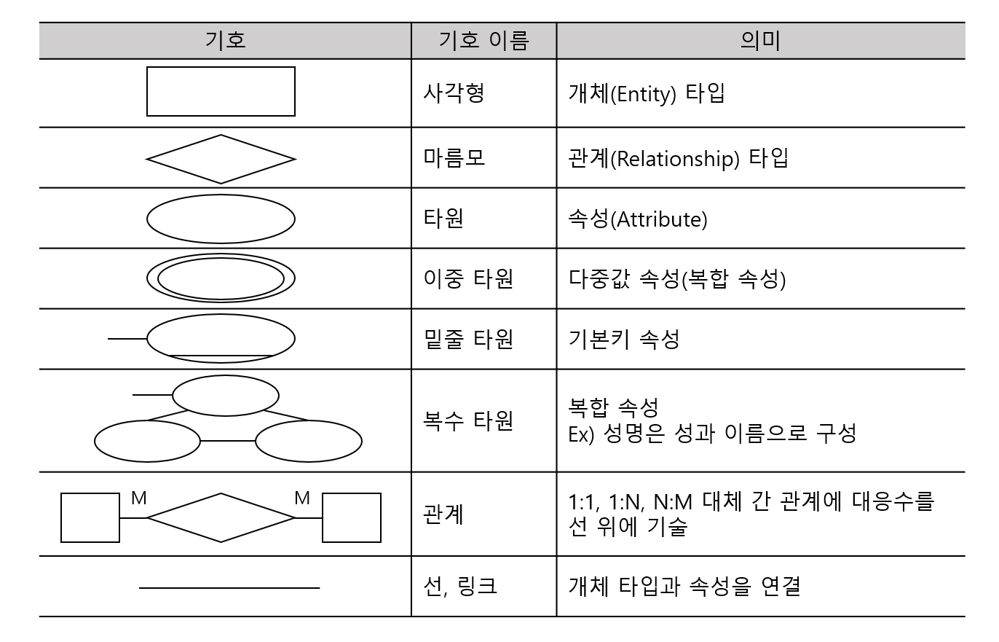

30/100
### 1. 용어 - 네트워크 (X)
- 네트워크 슬라이싱(Network Slicing)
    - 5G의 핵심기술 중 하나
    - 네트워크에서 하나의 물리적인 코어 네트워크 인프라를 독립된 다수의 가상네트워크로 분리
    - 각각의 네트워크를 통해 다양한 고객 맞춤형 서비스를 제공하는 것을 목적으로 하는 네트워크 기술

### 2. 용어 - ISO/IEC 9126 (X)
- 신뢰성 : 주어진 시간동안 주어진 기능을 오류없이 수행할 수 있는 정도(성숙성, 고장 허용성, 회복성)
- 효율성 : 사용자가 요구하는 기능을 얼마나 빠르에 처리할수 있는 정도(시간 효율성, 자원 효율성)

### 3. DB - 용어 (X)
- 클러스터드 인덱스 테이블
    - 기본키나 인덱스 키의 순서에 따라 데이터가 저장되어 일반적인 인덱스를 사용하는 테이블에 비해 접근 경로가 단축되는 테이블
- 넌클러스터드 인덱스
    - 인덱스의 키 값만 정렬되어 있을 뿐, 실제 데이터는 정렬되지 않는 방식
    - 데이터를 검색하기 위해 먼저 인덱스를 검색해 실제 데이터의 위치를 확인해야 하므로 클러스터드 인덱스에 비해 검색 속도 저하
    - 한 개의 릴레이션에 여러 개의 인덱스 생성 가능

### 4. DB - 용어 (X)
- 무결성 : 데이터베이스에 저장된 데이터 값과 그것이 표현하는 현실세계이 실제값이 일치하는 정확성

### 5. DB - SQL (O)

### 6. 프로그래밍 언어 - 출력값 (O)

### 7. DB - 출력값 (O)

### 8. 용어 - 웹 서비스 (X)
- SOAP : HTTP, HTTPS, SMTP 등을 활용해 XML 기반의 메세지를 네트워크 상에서 교환하는 프로토콜
- WSDL : 웹 서비스명, 서비스 제공 위치, 프로토콜 등 웹 서비스에 대한 상세정보를 XML 형식으로 구현하는 언어
- UDDI : WSDL을 등록해 서비스와 서비스 제공자를 검색하고 접근하는데 사용

### 9. 프로그래밍 언어 - 출렵값 (O)

### 10. 프로그래밍 언어 - 출렵값 (X)
- 코드 자세히 볼 것

### 11. 용어 - 보안위협(X)
- Pharming
    - 피싱(Phishing)과 조작(Farming)의 합성어
    - 악성 프로그램에 감염된 PC를 조작하여 정상 사이트에 접속하더라도 가짜 사이트로 접속을 유도하여 금융거래 정보를 빼낸 후 금전적인 피해를 입히는 사기 수법
- Tvishing
    - TV와 피싱(Phising)의 합성어
    - 해커가 인터넷이 연결된 스마트 TV에 악성코드를 심어 사용자 몰래 TV의 기능을 악용하는 행위
- Trustzone
    - 칩 설계회사인 ARM에서 개발한 기술
    - 하나의 프로세서 내에 일반 애플리케이션을 처리하는 일반 구역과 보안이 필요한 애플리케이션을 처리하는 보안 구역을 분할하여 관리하는 하드웨어 기반의 보안 기술
- APT (Advanced Persistent Threat)
    - 고도로 정교하고 지속적인 공격
    - 타켓 조직의 보안을 저해하거나 중요 정보를 유출하는 것을 목적
    - 특정 타켓을 정해 조직적이고 전문적으로 계획된 공격
- Typosquatting
    - 네티즌들이 사이트에 접속할 때 주소를 잘못 입력하거나 철자를 빠뜨리는 실수를 이용하기 위해 이와 유사한 유명 도메인을 미리 등록하는 것으로 URL 하이재킹이라고도 함
    - 유명 사이트들의 도메인을 입력할 때 발생할 수 있는 온갖 도메인 이름을 미리 선점해 놓고 이용자가 모르는 사이에 광고 사이트로 이동하게 만듦
- Hacktivism
    - 해킹(Hack)과 액티비즘(Activisim)의 합성어
    - 정치적, 사회적으로 동기를 부여받은 목적으로 컴퓨터 시스템을 해킹하거나 침입하는 행위
    - 전산망을 마비시켜 해당 기관의 기능을 상실케 하거나, 웹사이트를 해킹한 뒤 자신들의 메시지를 게시해 기관을 조롱하기도 하며, 그들의 주장에 대한 사회적인 관심을 끌고자 해킹을 이용
- Watering Hole
    - 대상자의 정보를 미리 수집해 대상자가 주로 방문하는 웹 사이트를 미리 감염시킨 뒤 잠복하면서 피해자의 컴퓨터에 악성코드를 추가로 설치하는 공격
- Smurfing
    - IP, ICMP 특성을 악용하여 엄청난 양의 데이터를 한 사이트에 집중적으로 보냄으로써 네트워크를 불능 상태로 만드는 공격 방법
    - 네트워크 라우터에게 브로드캐스트 주소를 사용할 수 없게 미리 성정해 피해를 방지
- Ransomware
    - 내부 문서나 파일 등을 암호화해 사용자가 열지 못하게 하는 프로그램
    - 암호 해독용 프로그램의 전달을 조건으로 사용자에게 돈을 요구하기도 함
- CSRF(Cross Site Request Forgery)
    - 사이트간 요청 위조
    - 사용자가 자신의 의지와는 무관하게 공격자가 의도한 행ㄱ위(데이터 수정, 삭제, 등록 등)을 특정 웹 사이트에 요청하게 하는 공격

### 12. 용어 - 보안 솔루션 (X)
- 방화벽(Firewall)
    - 네트워크 간에 전송되는 정보를 선별하는 기능을 가진 침입차단 시스템
- 웹방화벽(Web Firewall)
    - 웹기반 공격을 방어할 목적으로 만들어진 웹서버 특화 방화벽
- 침입탐지 시스템(IDS; Intrusion Detection System)
    - 컴퓨터 시스템의 비정상적인 사용, 오용, 남용 등을 실시간으로 탐지하는 시스템(이상탐지, 오용탐지)
- 침임방지 시스템(IPS; Intrusion Prevertion System)
    - 방화벽과 침입탐지 시스템을 결합한 것
- Network Access Control
    - 네트워크에 접속하는 내부 PC의 MAC 주소를 IP 관리 시스템에 등록한 후 일관된 보안 관리 기능을 제공하는 보안 솔루션

### 13. 출렵값 - E-R다이어그램 기호 (X)

### 14. 용어 - 소프트웨어 아키텍처 (X)
- 레이어 패턴(Layer Pattern)
    - 고전적인 패턴
    - 하위계층 = 상위계층에 대한 서비스 제공자 / 상위계층 = 하위계층의 클라이언트
    - 마주보는 두 개의 계층 사이에만 상호작용
    - OSI 참조모델
- 클라이언트-서버 패턴(Client-Server Pattern)
    - 하나의 서버 컴포넌트와 다수의 클라이언트 컴포넌트로 구성
    - 사용자가 클라이언트를 통해 서버에 요청하면 클라이언트가 응답을 받아 사용자에게 제공
- 파이프-필터 패턴(Pipe-Filter Pattern)
    - 데이터 스트림 절차의 각 단계를 필터로 캡슐화하여 파이프를 통해 전송하는 패턴
    - 앞 시스템의 처리 결과물을 전달받아 처리한 후 그 결과물을 다시 다음 시스템으로 넘겨주는 패턴을 반복
    - 데이터 변환, 버퍼링, 동기화, Shell
- 모델-뷰-컨트롤러 패턴(Model-View-Controller Pattern)
    - 컨트롤러가 사용자 요청을 받으면 핵심 기능과 데이터를 보관하는 모델을 이용해 뷰에 정보를 출력
- 마스터-슬레이브 패턴(Master-Slave Pattern)
    - 슬레이브 컴포넌트에서 처리된 결과물을 다시 돌려받는 방식
    - 장애 허용 시스템, 병렬 컴퓨팅 시스템
- 브로커 패턴(Broker Pattern)
    - 사용자가 원하는 서비스와 특성을 브로커 컴포넌트에 요청하면 브로커 컴포넌트가 요청에 맞는 컴포넌트와 사용자를 연결
    - 분산 환경 시스템
- 피어-투-피어 패턴(Peer-To-Peer Pattern)
    - 피어 컴포넌트가 클라이언트가 될 수도, 서버가 될 수도 있는 패턴
    - 파일 공유 네트워크
- 이벤트-버스 패턴(Event-Bus Pattern)
    - 소스가 특정 채널에 이벤트 메시지를 발행(Publish)하면, 해당 채널을 구독(Subscribe)한 리스너(Listener)들이 메시지를 받아 이벤트를 처리하는 패턴
    - 알림 서비스
- 블랙보드 패턴(Blackboard Pattern)
    - 모든 컴포넌트들이 공유 데이터 저장소와 블랙보드 컴포넌트에 접근 가능한 패턴
- 인터프리터 패턴(Interpreter Pattern)
    - 프로그램 코드의 각 라인을 수행하는 방법을 지정하고, 기호마다 클래스를 갖도록 구성된 패턴
    - 번역기, 컴파일러, 인터프리터

### 15. 용어 - 인터페이스 (X)
- IPC (Inter-Process Communication)
    - 모듈 간 통신 방식을 구현하기 위해 사용되는 대표적인 프로그래밍 인터페이스 집합
    - 복수의 프로세스를 수행하며 이뤄지는 프로세스 간 통신까지 구현이 가능
    - 메소드 5가지
        - 공유 메모리(Shared Memory)
        - 소켓(Socket)
        - 세마포어(Semaphores)
        - 파이프와 네임드 파이프(Pipes & named Pipes)
        - 메시지 큐잉(Message Queueing)

### 16. 용어 - 보안위협 (X)
- 11번 참조

### 17. 용어 - 라우팅 프로토콜 (O)
- 정적 라우팅
- 동적 라우팅
    - IGP
        - Distance Vector : RIP
        - Link-State Vector : OSPF
    - EGP
        - BGP
---
- RIP
    - 최단 경로 탐색에 Bellman-Ford 알고리즘이 사용됨
    - 최대 홉(Hop) 수 15 이하의 소규모 동종 네트워크에서 주로 이용
    - 거리 벡터 라우팅 프로토콜
- OSPF
    - RIP의 단점을 해결하여 새로운 기능을 지원하는 인터넷 프로토콜
    - 다익스트라(Dijkstra) 알고리즘 사용
    - 대규모 네트워크에서 주로 사용
- BGP
    - EGP 단점 보완
    - 자율 시스템 간의 라우팅 프로토콜
    - 초기에 라우터들이 연결될 때에는 전체 경로 제어표(라우팅 테이블)를 교환한 후 변환된 정보만 교환하는 방식

### 18. 프로그래밍 언어 - 출력값 (X)
- 코드 자세히 볼 것

### 19. 프로그래밍 언어 - 출력값 (X)
- 코드 자세히 볼 것

### 20. 용어 - 테스트 (X)
- 테스트 케이스
    - 사용자가 요구사항을 정확하게 준수했는지 확인하게 위해 설계된 입력 값, 실행 조건, 기대 결과 등으로 구성된 테스트 항목에 대한 명세서
    - 테스트 오류 방지, 테스트 수행에 필요한 인력, 시간 등의 자원낭비를 줄일 수 있음
- 테스트 시나리오
    - 테스트 케이스를 적용하는 순서에 따라 여러 개의 테스트 케이스를 묶은 집합
    - 구체적인 절차, 사전 조건, 입력 데이터 등 명세
- 테스트 오라클
    - 테스트 결과가 올바른지 판단하기 위해 사전에 정의된 참 값을 대입하여 비교하는 기법
    - 예상 결과를 계산하거나 확인
    - 제한된 검증, 수학적 기법, 자동화 기법
    - 참(True) 오라클
        - 모든 테스트 케이스의 입력 값에 대해 기대하는 결과를 제공하는 오라클
        - 발생된 모든 오류 검출 가능
    - 샘플링(Sampling) 오라클
        - 특정 몇몇 테스트 케이스의 입력 값들에 대해서만 기대하는 결과를 제공하는 오라클
        - 전수 테스트가 불가능한 경우 사용
    - 추정(Heuistic) 오라클
        - 특정 테스트 케이스의 입력 값에 대해 기대하는 결과를 제공
        - 나머지 입력 값들에 대해 추정으로 처리하는 오라클
    - 일관성 검사(Consistent) 오라클
        - 테스트 케이스 수행 전과 후의 결과 값이 동일한지를 확인하는 오라클