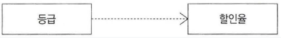
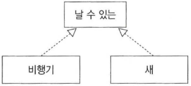

## 001. 소프트웨어 생명주기
- Software Life Cycle
- 소프트웨어를 개발하기 위한 설계, 운용, 유지보수 등의 과정을 단계별로 나눈 것
- 각 단계별 주요활동, 활동의 결과에 대한 산출물로 표현

## 002. ⭐ 나선형 모형
- Spiral Model, 점진적 모형
- 여러 번의 소프트웨어 개발 과정을 거쳐 점진적으로 최종 소프트웨어를 개발하는 모형
- Boehm
- 계획 수립 → 위험 분석 → 개발 및 검증 → 고객 평가

## 003. ⭐ 폭포수 모형
- Waterfall Model
- 각 단계를 확실히 매듭짓고 결과를 철저하게 검초하여 승인 과정을 거친 후에 다음 단계를 진행하는 개발방법론
- 가장 오래되고 폭넓게 사용되는 전통적인 SW 생명주기 모형
- 고전적 생명주기 모형

## 004. ⭐ 프로토타입 모형
- Prototype Model, 원형 모형
- 사용자 요구사항 파악을 위해 실제 개발될 SW에 대한 견본품을 만들어 최종 결과물을 예측하는 모형
- 사용자와 시스템 사이의 인터페이스에 중점

## 005. ⭐ 애자일 모형
- Agile
- 고객 요규사항 변화에 유연하게 대응할 수 있도록 일정한 주기를 반복하면서 개발하는 모형
- 좋은 것을 빠르고 낭비 없게 만들기 위해 고객과의 소통에 초점을 밪춘 방법론
- 스크럽, XP, 칸반, Lean, 기능중심개발(FDD)

## 006. ⭐ 애자일 개발 4가지 핵심 가치
- 개인과 상호작용
- 실행되는 SW
- 고객과 협업
- 변화에 반응하는 것

## 007. 소프트웨어공학
- Software Engineering
- SW 위기를 극복하기 위한 방안으로 연구된 학문
- 여러 방법론, 도구, 관리 기법을 통해 SW 품질 및 생산성 향상에 목적
- 소프트웨어 공학의 기본 원칙
    - 현대적인 프로그래밍 기술 지속적 적용
    - SW 품질이 유지되도록 지속적으로 검증
    - 개발 관련 사항 및 결과에 대한 명확한 기록 유지

## 08. ⭐ 스크럼
- Scrum
- 팀이 중심이 되어 개발 효율성을 높이는 기법
- 팀원 스스로가 모든 것을 해결할 수 있어야 함
- 제품 책임자
    - 요구사항 백로그 작성
    - 요구사항 책임지고 의사를 결정하는 사람
- 스크럼 마스터
    - 스크럼을 잘 수행할 수 있도록 가이드
- 개발팀
    - 제품 책임자, 스크럼 마스터 외 모든 팀원
    - 제품 개발 수행

## 009. 스크럼 개발 프로세스
1\) 스프린트 계획 회의
- Sprint Planning Meeting
- 제품 백로그 중 수행할 작업을 대상으로 단기 일정 수힙 회의

2\) 스프린트
- Sprint
- 실제 개발 과정
- 2~4주 기간 내

3\) 일일 스크럼 회의
- Daily Scrum Meeting
- 약 15분 동안의 진행 사활 정검 회의
- 남은 작업 시간은 소멸 차트에 표시

4\) 스프린터 검토 회의
- Sprint Review
- 부분, 전체 완성 제품이 요구사항에 주합하는지 테스팅 회의

5\) 스프린트 회고
- Sprint Retrospective
- 정해놓은 규칙 준수 여부 및 개선할 점 확인하고 기록

## 010. XP
- eXtreme Programming
- 요구사항에 유연하게 대응하기 위해 고객의 참여와 개발 과정의 반복을 극대화하여 개발 생산성을 향상시키는 방법
- 짧고 반복적인 개발주기
- 단순한 설계
- 고객 적극적 참여
- SW 빠르게 개발하는 것 목적
- XP 5가지 핵심가치
    - 의사소통(Communication)
    - 단순성(Simplicity)
    - 용기(Courage)
    - 존중(Respect)
    - 피드백(Feedback)

## 011. ⭐ XP 주요 실천 방법
1\) Pair Programming
- 짝 프로그래밍
- 개발에 대한 책임 공동

2\) Collective Ownership
- 공통 코드 소유
- 개발 코드에 대한 권한과 책임을 공동 소유

3\) Test-Driven Development
- 테스트 주도 개발
- 실제 코드 작성 전 테스트 케이스를 작성해 무엇을 해야할지 정확히 파악
- 테스트가 지속적으로 진행될 수 있도록 자동화된 테스팅 도구(구조, 프레임워크)를 사용

4\) Whole Team
- 전체 팀
- 개발에 참여하는 모든 구성원(고객 포함)은 각자 자신의 역할이 있고 역할에 대한 책임을 가져야 함

5\) Continuous Integration
- 계속적인 통합
- 모듈 단위로 나눠서 개발된 코드들은 하나의 작업이 마무리될 때마다 지속적으로 통합

6\) Refactoring
- 리팩토링
- 프로그램 기능 변경 없이 시스템 재구성
- 프로그램을 쉽게 이해하고 쉽게 수정하여 빠르게 개발할 수 있도록 하기 위함

7\) Small Releases
- 소규모 릴리즈
- 릴리즈 기간은 짧게 반복함으로써 고객의 요구 변화에 신속히 대응

## 012. 데이터베이스 관리 시스템
- Database Management System
- 사용자와 DB 사이에서 사용자 요구에 따라 정보 생성 및 DB 관리해주는 SW
- 가용성, 성능, 기술 지원, 상호 호환성, 구축 비용

## 013. 웹 애플리케이션 서버
- WAS, Web Application Server
- 사용자 요구에 따라 변하는 동적인 콘텐츠를 처리하기 위해 사용되는 미들웨어
- 가용성, 성능, 기술 지원, 구축 비용

## 014. 오픈 소스
- Open Source
- 제한없이 누구나 사용할 수 있도록 소스 코드를 공개한 소프트웨어
- 라이선스 종유, 사용자 수, 기술의 지속 가능성

## 015. 요구사항
- SW의 문제를 해결하기 위해 제공하는 서비스에 대한 설명과 정상적으로 운영되는데 필요한 제약조건
- 개발, 유지보수 과정에서 필요한 기순과 근거 제공
- 의사소통을 원활하게 하는 데 도움

## 016. 기능 요구사항
- Functional Requirements
- 시스템이 무엇을 하는지, 어떤 기능을 하는지 등 기능이나 수행과 관련된 요구사항
- 시스템의 입력, 축력으로 무엇이 포함되어야 하는지
- 시스템이 어떤 데이터를 저장하거나 연산을 수행해야 하는지
- 시스템이 반드시 수행해야 하는 기능
- 사용자가 시스템을 통해 제공받기를 원하는 기능

## 017. 비기능 요구사항
- Non-Functional Requirements
- 품질이나 제약사항과 관련된 요구사항
- 시스템 장비 구성
- 성능
- 인터페이스
- 데이터 구축을 위한 필요사항
- 테스트, 보안
- 품질
    - 가용성, 정합성, 상호 호환성, 대응성, 이식성, 확장성, 보안성
- 제약사항
 - 프로젝트 자원, 프로젝트 관리

## 018. 요구사항 개발 프로세스
- 개발 대상에 대한 요구사항을 체계적으로 도출, 분석해 명세서로 정리 후 확인 및 검증하는 일련의 구조화된 활동
- 사전에 타당성 조사(Feasivility Study) 필수
- 도출(Elicitation) → 분석(Analysis) → 명세(Specifiation) → 확인(Vaildation)

## 019. 요구사항 명세
- Requirements Specification
- 분석된 요구사항을 바탕으로 모델을 작성하고 문서화 하는 것
- 기능 요구사항 필수, 비기능 요구사항 필요한 것만 기술
- 구체적인 명세는 소단위 명세서 사용

## 020. ⭐ 요구사항 명세 기법
1\) 정형 명세 기법
- 수학적 원리 기반, 모델 기반
- 수학적 기호, 정형화된 표기법
- 정확하고 간결하게 표현
- 결과가 작성자에 관계없이 일관성 있고 완전성 검증 가능
- 표기법이 어려워 이해하기 어려움
- VDM, Z, Petri-net, CSP

2\) 비정형 명세 기법
- 상태/기능/객체 중심
- 일반 명사, 동사 등 자연어를 기반으로 서술, 다이어그램 작성
- 결과가 작성자에 따라 다를 수 있어 일관성 떨어지고 해석이 달라질 수 있음
- 내용의 이해가 쉬워 의사소통 용이
- FSM, Decision Table, ER모델링, State Chart(SADT)

## 021. 요구사항 분석
- Requirements Analysis
- 개발 첫 단계
- 개발 대상에 대한 사용자 요구사항을 이해하고 문서화 하는 활동
- 요구사항 타당성 조사하고 비용과 일정에 대한 제약 설정
- 요구를 정확하게 추출하여 목표 정함

## 022. ⭐ 자료 흐름도
- DFD, Data Flow Diagram
- 자료의 흐름 및 변환 과정과 기능을 도형 중심으로 기술
- 버블차트
- 자료 흐름과 처리를 중심으로 하는 구조적 분석 기법

## 023. ⭐ 자료 흐름도 구성요소
- 프로세스(Process) : 자료를 변환시키는 시스템의 한 부분을 나타내며 처리, 기능, 변환, 버블이라 함
- 자료 흐름(Data Flow) : 자료의 흐름이나 연관관계
- 자료 저장소(Data Store) : 자료 저장소(파일, DB)
- 단말(Terminator) : 시스템과 교신하는 외부 개체, 입력데이터가 만들어지고 출력데이터를 받음

## 024. ⭐ 자료 사전
- DD, Data Dictionary
- 자료 흐름도에 있는 자료를 더 자세히 정의하고 기록한 것
- 메타 데이터 : 데이터를 설명하는 데이터
- 기호
    - = : 자료 정의
    - \+ : 자료 연결
    - ( ) : 자료 생략
    - [ ] : 자료 선택
    - { } : 자료 반복
    - \* \* : 자료 설명(주석)

## 025. 요구사항 분석용 CASE
- 자동화 도구
- 요구사항을 자동으로 분석, 요구사항 분석 명세서를 기술하도록 개발된 도구
- SADT, SREM(=RSL/REVS), PSL/PSA, TAGS

## 026. SADT
- 시스템 정의, SW 요구사항 분석, 시스템/SW 설계를 위한 도구
- 구조적 요구 분석을 위해 블록 다이어그램을 채택

## 027. ⭐ HIPO
- hierarchy Input Process Output
- 시스템 분석 및 설계, 문서화에 사용되는 기법
- 시스템 입력, 처리, 출력 기능 표현
- 하향식 소프트웨어 개발 문서화 도구
- HIPO Chart : 여러 개의 모듈로 분할하여 모듈 간 인터페이스를 계층 구조로 표현한 것

## 028. UML
- Unified Modeling Language
- 시스템 분석, 설계, 구형 등 시스템 개발 과정에서 개발자와 고객, 개발자 간 상호 의사소통이 원활하게 이루어지도록 표준화한 대표적인 객체지향 모델링 언어
- Rumbaugh(OMT), Booch, Jacobson 객체지향 방법론 장점 통합
- 사물(Things), 관계(Relationships), 다이어그램(Diagram)

## 029. 관계
- Relationships
- 사물과 사물 사이의 연관성 표현
- 연관관계, 집합관계, 포함관계, 일반화관계, 의존관계, 실체화관계

## 030. ⭐ 연관 관계
- Association
- 2개 이상의 사물이 서로 관련되어 있는 관계
- 양방향 경우 화살표 생략하고 실선으로만 연결
- 사람이 집을 소유하는 관계(사람은 집을 알지만 집은 소유되고 있는 사람을 모름)

## 031. ⭐ 집합 관계
- Aggregation
- 하나의 사물이 다른 사물에 포함되어 있는 관계
- 포함하는 쪽, 포함되는 쪽은 서로 독립적
- 프린터는 컴퓨터에 연결해서 사용, 다른 컴퓨터에도 연결해서 사용 사능

## 032. ⭐ 포함 관계
- Composition
- 집합 관계의 특수한 형태
- 포함하는 사물의 변화가 포함되는 사물에게 영향을 미치는 관계
- 포함하는 쪽, 포함되는쪽은 서로 독립될 수 없고 생명주기를 함께함
- 문을 여는 키는 하나, 해당 키로 다른 문은 열 수 없다. 문이 없어지면 키도 필요하지 않음

## 033. ⭐ 일반화 관계
- Generalization
- 하나의 사물이 다른 사물에 비해 더 일반적이거나 구체적인 관계
- 아메리카노와 에스프레소는 커피

## 034. ⭐ 의존 관계
- Dependency
- 연관관계와 같이 사물 사이에 서로 연관은 있으나 필요에 의해 서로에게 영향을 주는 짧은 시간동안만 연관을 유지하는 관계
- 소유 관계는 아니지만 사물의 변화가 다른 사물에 영향을 미치는 관계
- 일반적으로 한 클래스가 다른 클래스를 오퍼레이션의 매개변수로 사용하는 경우 나타나는 관계
- 등급이 높으면 할인율 적용, 등급이 낮으면 할인율 적용하지 않음

## 035. ⭐ 실체화 관계
- Realization
- 사물이 할 수 있거나 해야 하는 기능, 서로를 그룹화 할 수 있는 관계
- 한 객체가 다른 객체에게 오퍼레이션을 수행하도록 지정하는 의미적 관계
- 비행기는 날수 있고 새도 날 수 있다.

## 036. 다이어그램
- Diagram
- 사물과 관계를 도형으로 표현
- 의사소통에 도움
- 정적 모델링 : 구조적 다이어그램
- 동적 모델링 : 행위 다이어그램

## 037. ⭐ 구조적 다이어그램 종류
1\) 클래스 다이어그램
- Class Diagram
- 클래스와 클래스가 가지는 속성, 클래스 사이의 관계 표현

2\) 객체 대이어그램
- Object Diagram
- 인스턴스를 특정 시점의 객체와 객체 사이의 관계로 표현
- 럼바우 객체지향 분석기법에서 객체 모델링

3\) 컴포넌트 다이어그램
- Component Diagram
- 실체 구현 모듈인 컴퓨넌트 간의 관계나 컴포넌트 간의 인터페이스 표현
- 구현 단계에서 사용

4\) 배치 다이어그램
- Deployment Diagram
- 결과물, 프로세스, 컴포넌트 등 물리적 요소들의 위치 표현
- 구현 단계에서 사용

5\) 복합체 구조다이어그램
- Composite Structure Diagram
- 클래스나 컴포넌트가 복합 구조를 같는 경우 그 내부 구조를 표현

6\) 패키지 다이어그램
- Package Diagram
- 유스케이스나 클래스 등의 모델 요소들을 그룹화한 패키지들의 관계 표현

## 038. ⭐ 행위 다이어그램 종류
1\) 유스케이스 다이어그램
- Usecase Diagram
- 사용자 요구사항 분석
- 기능 모델링 작업에 사용
- 사용자(Actor)와 사용사례(UseCase)로 구성

2\) 시퀀스 다이어그램
- Sequence Diagram
- 상호작용하는 시스템이나 객체들이 주고받는 메시지를 표현

3\) 커뮤니케이션 다이어그램
- Communication Diagram
- 동작에 참여하는 객체들이 주고받는 메시지와 객체들 간의 연관관계 표현

4\) 상태 다이어그램
- State diagram
- 하나의 객체가 자신이 속한 클래스의 상태 변화 혹은 다른 객체와의 상호작용에 따라 상태가 어떻게 변화하는지 표현
- 럼바우 객체지향 분석 기법에서 동적 모델링

5\) 활동 다이어그램
- Activity Diagram
- 시스템이 어떤 기능을 수행하는지 객체의 처리 로직이나 조건에 따른 처리의 흐름을 순서에 따라 표현

6\) 상호작용 개요 다이어그램
- Interaction Overview Diagram
- 상호작용 다이어그램 간의 제어 흐름을 표현

7\) 타이밍 다이어그램
- Timing Diagram
- 객체 상태 변화와 시간 제약을 명시적으로 표현

## 039. ⭐ 스테레오 타입
- Stereotype
- UML에서 표현하는 기본 기능 외의 추가적인 기능을 표현
- 겹화살괄호 ( << >> ) 

# Reference
- 정보처리기사 실기 (시나공)