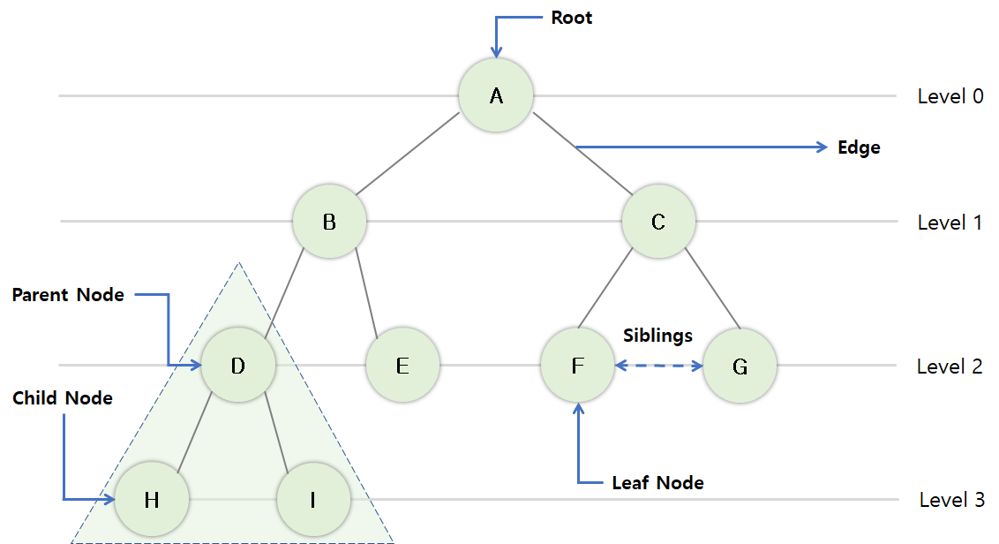
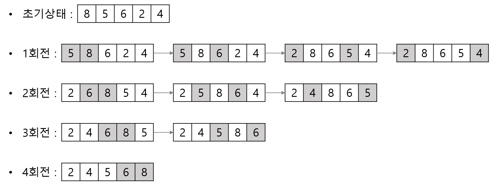

## 117. 뷰
- View
- 사용자에게 접근이 허용된 자료만 제한적으로 보여주기 위함
- 하나 이상의 기본 테이블로부터 유도된 가상 테이블
- 뷰가 정의된 기본 테이블이나 뷰가 삭제하면 그 테이블이나 뷰를 기초로 정의된 다른 뷰도 자동으로 삭제됨
- CREATE, DROP

## 118. 파티션
- Partition
- 대용량의 테이블이나 인덱스를 작은 논리적 단위인 파티션으로 나누는 것
- 중요 테이블에만 집중되어 데이터가 증가하므로, 테이블을 작은 단위로 나눠 분산시키면 성능 저하 방지 뿐 아니라 데이터 관리도 쉬워짐
- 데이터 처리는 테이블단위, 데이터 저장은 파티션별로 수행

## 119. 파티션의 종류
- 범위 분할(Range Partitioning)
    - 지정한 열의 값을 기준으로 분할
    - 일별, 월별, 분기별 등
- 해시 분할(Hash Partitioning)
    - 해시 함수를 적용한 결과 값에 따라 데이터를 분할
    - 특정 파티션에 데이터가 집중되는 범위 분할의 단점 보완
    - 데이터를 고르게 분산할 때 유용
    - 특정 데이터가 어디에 있는지 판단할 수 없음
    - 고객번호, 주민번호
- 조합 분할(Composite Partitioning)
    -  적용하여 다시 분할
    - 범위 분할한 파티션이 너무 커서 관리가 어려울 때 유용

## 120. 분산 데이터페이스의 목표
- 위치 투명성(Location Transparency)
    - 액세스 하려는 DB 실제 위치를 알 필요 없이 단지 DB의 논리적인 명칭만으로 액세스
- 중복 투명성(Replication Transparency)
    - 동일 데이터가 여러 곳에 중복되어 있더라도 사용자는 마치 하나의 데이터만 존재하는 것처럼 사용
    - 시스템은 자동으로 여러 자료에 대한 작업 수행
- 병행 투명성(Concurrency Transparency)
    - 분산 데이터베이스와 관련된 다수의 트랜잭션들이 동시에 실현되어라도 그 츠랜잭션의 결과는 영향을 받지 않음
- 장애 투명성(Failure Transparency)
    - 트랜잭션, DBMS, 네트워크, 컴퓨터 장애에도 불구하고 트랜잭션을 정확하게 처리

## 121. ⭐ RTO / RPO
- RTO(Recovery Time Objective, 목표 복구 시간)
    - 비상사태 또는 업무 중단 시점으로부터 복구되어 가동될 때까지의 소요시간을 의미
    - 예\) 장애 발생 후 6시간 내 복구 가능
- RPO(Recovery Point Objective, 목표 복구 시점)
    - 비상사태 또는 업무 중단 시점으로부터 데이터를 복구할 수 있는 기준점을 의미
    - 예\) 장애 발생 전인 지난 주 금요일에 백업시켜 둔 복원 시점으로 복구 가능

## 122. 암호화
- Encryption
- 데이터 전송 시 송신자가 지정한 수신자 이외에 내용을 알 수 없도록 평문을 암호문으로 변환하는 것
- 암호화 과정 : 평문 → 암호문
- 복호화 과정 : 암호문 → 평문
- 암호화 기법
    - 개인키 암호 방식(Private Key Encryption)
    - 공개키 암호 방식(Public Key Encryption)

## 123. ⭐ 임의 접근 통제
- DAC (Discretionary Access Control)
- 데이터에 접근하는 사용자의 신원에 따라 접근 권한을 부여하는 방식
- 데이터 소유자가 접근통제 권한을 지정하고 제어
- 객체를 생성한 사용자가 생성된 객체에 대한 모든 권한을 부여받고, 부여된 권한을 다른 사용자에게 허가할 수 있음

## 124. ⭐ 강제 접근 통제
- MAC(Mandatory Access Control)
- 주체와 객체의 등급을 비교하여 접근 권한을 부여하는 방식
- 시스템이 접근통제 권한을 지정
- DB 객체별로 보안 등급을 부여
- 사용자별로 인가 등급을 부여할 수 있음

## 125. ⭐ 역할 기반 접근 통제
- RBAC(Role Based Access Control)
- 사용자의 역할에 따라 접근 권한을 부여하는 방식
- 중앙관리자가 접근 통제 권한을 지정
- 임의 접근통제와 강제 접근통제의 단점 보완
- 다중 프로그래밍 환경에 최적화된 방식

## 126. 스토리지
- Storage
- 대용량 데이터를 저장하기 위해 서버와 저장장치를 연결하는 기술
- DAS, NAS, SAN

## 127. ⭐ DAS
- Direct Attached Storage
- 서버와 저장장치를 전용 케이블로 직접 연결하는 방식
- 일반 가정에서 컴퓨터에 외장하드를 연결하는 것
- 직접 연결방식이므로 다른 서버에서 접근 불가, 파일 공유 불가

## 128. ⭐ NAS
- Network Attached Storage
- 서버와 저장장치를 네트워크를 통해 연결하는 방식
- 별도의 파일관리 기능이 있는 NAS Storage가 내장된 저장장치를 직접 관리
- Ethernet 스위치를 통해 다른 서버에서도 스토리지에 접근 가능, 파일 공유 가능

## 129. ⭐ SAN
- Storage Area Network
- DAS의 빠른 처리와 NAS의 파일 공유 장점을 혼합한 방식
- 서버와 저장장치를 연결하는 전용 네트워크를 별도로 구성하는 방식
- 파이버 채널(Fibre Channel, 광 채널) 스위치를 이용해 네트워크 구성
- 파이버 채널 스위치는 광케이블로 연결하므로 처리 속도 빠름
- 서버들이 저장장치 및 파일을 공유

## 130. 자료구조
- 자룔르 기억장치의 공간 내에 저장하는 방법과 자료 간의 관계, 처리방법 등을 연구 분석하는 것
- 선형 구조 : 배열, 선형 리스트(연속 리스트, 연결 리스트), 스택, 큐, 데큐
- 비선형 구조 : 트리, 그래프

## 131. 배열
- Array
- 크기와 형(Type)이 동일한 자료들이 순서대로 나열된 자료의 집합
- 반복적인 데이터 처리 작업에 적합한 구조
- 정적인 자료 구조
- 기억장소의 추가 어려움

## 132. 스택
- Stack
- 리스트의 한쪽 끝으로만 자료의 삽입, 삭제 작업이 이루어지는 자료구조
- 후입선출(LIFO; Last In First Out)
- 저장할 기억 공간이 없는 상태에서 데이터가 삽입되면 Overflow
- 삭제할 데이터가 없는 상태에서 데이터를 삭제하면 Underflow

## 133. 큐
- Queue
- 리스트의 한쪽에서는 삽입작업, 다른 한쪽에서는 삭제 작업
- 선입선출(FIFO; First In First Out)
- 시작을 표시하는 Front 포인트와 끝은 표시하는 Rear 포인트

## 134. 그래프
- Graph
- 정점(Vertex)과 간성(Edge)의 두 집합으로 이루어지는 자료구조
- 사이클이 없는 그래프 = 트리
- 간선의 방향성 유무에 따라 방향 그래프와 무방향 그래프로 구분

## 135. 방향/무방향 그래프의 최대 간선 수
- 방향 그래프의 최대 간선 수 : n(n-1)
- 무방향 그래프의 최대 간선 수 : n(n-1)/2

## 136. 트리
- Tree
- 정점(Node)과 선분(Branch)을 이용해 사이클을 이루지 않도록 구성한 그래프의 특수항 형태
- 노트(Node) : 트리는 하나의 기억공간
- 링크(Link) : 노드와 노드를 연결하는 선

## 137. 트리 관련 용어

- 노드(Node) : 자료 항목과 다른 항목에 대한 가지를 합친 것 (A, B, C, D, E, F, G, H, I, J)
- 근 노드(Root Node) : 트리의 맨 위에 있는 노드 (A)
- 디그리(Degree) : 각 노드에서 뻗어 나온 가지의 수 (A=2, B=2, E=1)
- 단말 노드(Terminal Node) = 잎 노드(Leaf Node) : 자식이 하나도 없는 노드 = 디그리가 0인 노드 (F, G)
- 자식 노드(Son Node) : 다음 레벨의 노드 (H, I의 부모 노드=D)
- 부모 노드(Parent Node) : 이전 레벨의 노드 (D의 자식 노드=H, I)
- 형제 노드(Brother Node, Sibling) : 동일한 부모를 갖는 노드 (H의 형제 노드=I)
- 트리의 디그리 : 디그리 중 가장 많은 수 (2)
- Level : 근 노드의 Level을 0으로 가정한 수 Lebel이 L이면 L+1 (H의 레벨은 3)
- 깊이(Depth, Height) : Tree에서 노드가 가질 수 있는 최대의 레벨(4)
- 숲(Forest) : 여러 개의 트리가 모여 있는 곳(근 노드 A를 제러하면 B, C를 근노드로 하는 2개의 트리가 있는 숲이 생김)

## 138-140. Preorder 운행법 / Inorder 운행법 / Postorder 운행법

1\) Preorder 운행 : Root → Left → Right

2\) Inorder 운행 : Left → Root → Right

3\) Postorder 운행 : Left → Right → Root

## 141-143. Prefix / Infix / Postfix 

1\) 전위 표기법(PreFix) : 연산자 → Left → Right (X + / * + A B - C D E * F G)

2\) 중위 표기법(InFix) : Left → 연산자 → Right (X = A + B * C - D / E + F * G)

3\) 후위 표기법(PostFix) : Left → Right → 연산자 (X A B + C D - * E / F G * + =)

## 144. ⭐ 삽입정렬
- Insertion Sort
- 이미 순서화된 파일에 새로운 하나의 레코드를 순서에 맞게 삽입시켜 정렬
- 평균, 최악 수행시간 복잡도 : O(n2)

## 145. ⭐ 선택정렬
- Selection Sort
- n개 레코드 중 최소값을 찾아 첫 번째 레코드 위치에 놓고, 나머지 (n-1)개 중 다시 최소값을 찾아 두 번째 레코드 위치에 놓는 방식을 반복
- 평균, 최악 수행시간 복잡도 : O(n2)

## 146. ⭐ 버블정렬
- Bubble Sort
- 인접한 두 개의 레코드 키 값을 비교해 그 크기에 따라 레코드 위치를 서로 교환하는 정렬방식
- 정렬 여부를 플래그 비트(f)로 결정
- 평균, 최악 수행시간 복잡도 : O(n2)

## 147. ⭐ 퀵정렬
- Quick Sort
- 레코드의 많은 자료 이동을 없애고 하나의 파일을 부분적으로 나누어 가면서 정렬하는 방법
- 키를 기준으로 작은 값을 왼쪽, 큰 값을 오른쪽으로 분해시키는 방식으로 정렬
- 정렬 방식 중 가장 빠른 방식
- 평균 수행 사간 복잡도 : O(nlog2n)
- 최악의 수행 시간 복잡도 : O(n2)

## 148. ⭐ 힙 정렬
- Heap Sort
- 전이진 트리(Complete Binary Tree)를 이용한 정렬방식
- 평균, 최악 수행시간 복잡도 : O(nlog2n)

## 149. ⭐ 2-way 합병 정렬
- 2-way Merge Sort
- 이미 정렬되어 있는 두 개의 파일을 한 개의 파일로 합병하는 정렬 방식
- 평균, 최악 수행시간 복잡도 : O(nlog2n)

# Reference
- 정보처리기사 실기 (시나공)