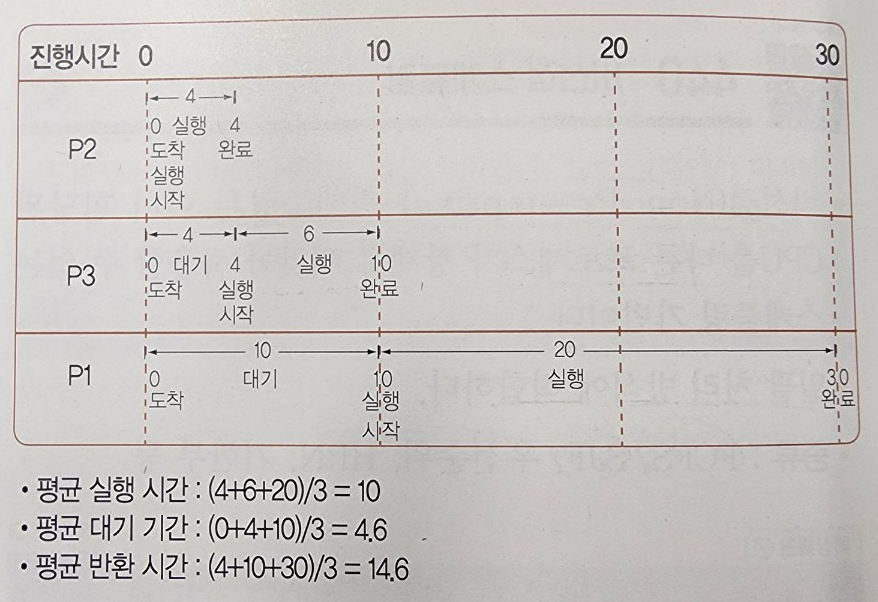

## 411. 운영체제
- Operating System
- 컴퓨터 시스템의 자원들을 효율적으로 관리
- 평리하고 효과적으로 사용할 수 있도록 환경을 제공하는 여러 프로그램 모임
- 컴퓨터 하드웨어와 사용자 간의 인터페이스로 시스템 소프트웨어의 일종
- 프로세서, 기억장치, 입 · 출력 장치, 파일 및 정보 등의 자원을 관리

## 412. ⭐ 운영체제 목적
- 처리 능력(Throughput) : 일정 시간 내에 시스템이 처리하는 일의 양
- 반환 시간(Turn Around Time) : 시스템에 작업을 의뢰한 시간부터 처리가 완료될 때까지 걸린 시간
- 사용 가능도(Acailavility) : 시스템을 사용할 필요가 있을 때 즉시 사용 가능한 정도
- 신뢰도(Reliability) : 시스템이 주어진 문제를 정확하게 해결하는 정도

## 413. ⭐ UNIX
- AT&T 벨 연구소, MIT, General Electric 이 공동 개발한 운영체제
- 시분할 시스템(Time Sharing System)을 위해 설계된 대화식 운영체제
- C언어로 작성되어 이식성이 높으며 장치, 프로세스 간의 호환성이 높음
- 트리(Tree) 구조의 파일 시스템

## 414. ⭐ UNIX 시스템 구성
- 커널(Kernel)
    - UNIX의 가장 핵심적인 부분
    - 하드웨어 보호
    - 프로그램과 하드웨어 간의 인터페이스 역할 담담
    - 프로세스(CPU 스케줄링) 관리, 기억장치 관리, 파일 관리, 입 · 출력 관리, 프로세스 간 통신, 데이터 전송 및 변환 등 여러가지 기능 수행
- 쉘(Shell)
    - 사용자 명령어를 인식해 프로그램을 호출하고 명령을 수행하는 명령어 해석기
    - 시스템과 사용자 간의 인터페이스 담당

## 415. LINUX
- 1991년 리누스 토발즈가 UNIX를 기반으로 개발한 운영체제
- 코드가 무료로 공개되어 있어 프로그래머가 원하는 기능 추가 가능
- UNIX와 특징이 동일

## 416. Android
- 구글 사에서 개발한 리눅스 커널 기반의 개방형 모바일 운영체제
- 코드가 공개된 개방형 소프트웨어
- 자바, 코틀린으로 애플리케이션 작성

## 417. 기억장치 관리 - 반입 전략 (Fetch)
- 보조기억장치에 보관 중인 프로그램이나 데이터를 언제 주기억장치로 적제할 것인지를 결정하는 전략
- 요구 반입(Demand Fetch) : 실행 중인 프로그램이 특정 프로그램이나 데이터 등의 참조를 요구할 때 적재하는 방법
- 예상 반입(Anticipatory Fetch) : 실행 중인 프로그램에 의해 참조될 프로그램이나 데이터를 미리 예상하여 적재하는 방법

## 418. 기억장치 관리 - 배치 전략 (Placement)
- 새로 반입되는 프로그램이나 데이터를 주기억장치의 어디에 위치시킬 것인지를 결정하는 전략
- 최초 적합(First Fit) : 빈 영역 중에서 첫 번째 분할 영역에 배치
- 최적 적합(Best Fit) : 빈 영역 중에서 단편화를 가장 작게 남기는 분할 영역에 배치
- 최악 적합(Worst Fit) : 빈 영역 중에서 단편화를 가장 많이 남기는 분할 영역에 배치

## 419. 주기억장치 할당 기법
- 프로그램이나 데이터를 실행시키기 위해 주기억장치에 어떻게 할당할 것인지를 결정하는 기법
- 연속 할당 기법
    - 프로그램을 주기억장치에 연속으로 할당하는 기법
    - 단일 분할 할당 기법, 다중 분할 할당 기법
- 분산 할당 기법
    - 프로그램을 특정 단위의 조각으로 나누어 주기억장치 내에 분산하여 할당하는 기법
    - 페이징 기법, 세그먼테이션 기법

## 420. 단일 분할 할당 기법
- 주기억장치를 운영체제 영역과 사용자 영역으로 나누어 한순간에는 오직 한 명의 사용자만이 주기억장치의 사용자 영역을 사용하는 기법
- 오버레이 기법(Overlay) : 주기억장치보다 큰 사용자 프로그램을 실행하기 위한 기법
- 스와핑 기법(Swapping) : 하나의 프로그램 전체를 주기억장치에 할당하여 사용하다 필요에 따라 다른 프로그램과 교체하는 기법

## 421. 다중 분할 할당 기법
- 고정 분할 할당 기법 = 정적 할당 기법
    - 프로그램을 할당하기 전 운영체제가 주기억장치의 사용자 영역을 여러 개의 고정된 크기로 분할하고, 준비상태 큐에서 준비 중인 프로그램을 각 영역에 할당하여 수행하는 기법
- 가변 분할 할당 기법 = 동적 할당 기법
    - 주기억장치를 미리 분할해 놓지 않고 프로그램을 주기억장치에 적재하면서 필요한 만큼의 크기로 영역을 분할하는 기법
    - 고정 분할 할당 기법의 단편화를 줄이기 위해 사용

## 422. 가상기억장치
- Virtual Memory
- 보조기억장치의 일부를 주기억장치처럼 사용하는 것
- 용량이 작은 주기억장치를 마치 큰 용량을 가진 것처럼 사용하는 기법
- 프로그램을 여러 개의 작은 블록 단위로 나누어서 가상기억장치에 보관해놓고, 프로그램 실행 시 요구되는 블록만 주기억장치에 불연속적으로 할당하여 처리
- 페이징 기법, 세그먼테이션 기법

## 423. ⭐ 가상기억장치 구현 기법
- 페이징 기법(Paging)
    - 가상기억장치에 보관되어 있는 프로그램과 주기억장치의 영역을 동일한 크기로 나눈 후, 나눠진 프로그램을 동일하게 나눠진 주기억장치의 영역에 적재시켜 실행하는 기법
    - 페이지 : 일정한 크기로 나눈 단위
    - 페이지 프레임 : 페이지 크기로 일정하게 나누어진 주기억장치의 단위
- 세그먼체이션 기법(Segmentation)
    - 가상기억장치에 보관되어 있는 프로그램을 다양한 크기의 논리적인 단위로 나눈 후 주기억장치에 적재시켜 실행하는 방법
    - 세그먼트 : 프로그램을 배열이나 함수 등과 같은 논리적인 크기로 나눈 단위
    - 각 세그먼트는 고유한 이름과 크기를 갖음

## 424. ⭐ 페이지 교체 알고리즘
- 페이지 부재(Page Fault)가 발생하면 어떤 페이지 프레임을 선택하여 교체할 것인지 결정하는 기법
- OPT, FIFO, LRU, LFU, NUR, SCR

## 425. ⭐ OPT (OPTimal replacement)
- 최적 교체
- 앞으로 가장 오랫동안 사용하지 않을 페이지를 교체하는 기법
- Belady가 제안
- 페이지 부재 횟수가 가장 적게 발생하는 가장 효율적인 알고리즘

## 426. ⭐ FIFO (First In First Out)
- 가장 먼저 들어와서 가장 오래 있었던 페이지를 교체하는 기법

## 427. ⭐ LRU (Least Recently Used)
- 최근에 가장 오랫동안 사용하지 않은 페이지를 교체하는 기법

## 428. ⭐ LFU (Least Frequently Used)
- 사용 빈도가 가장 적은 페이지를 교체하는 기법
- 활발하게 사용되는 페이지는 사용 횟수가 많아 교체되지 않고 사용됨

## 429. ⭐ NUR (Not Used Recently)
- LRU와 비슷한 알고리즘
- 최근 사용하지 않은 페이지를 교체하는 기법
- 최근의 사용 여부를 확인하기 위해 각 페이지마다 두개의 참조비트와 변형비트가 사용됨

## 430. ⭐ SCR (Second Chance Replacement)
- 2차 기회 교체
- 가장 오랫동안 주기억장치에 있던 페이지 중 자주 사용되는 페이지의 교체를 방지하기 위한 기법
- FIFO 기법의 단점을 보완

## 431. ⭐ Locality
- 프로세스가 실행되는 동안 주기억장치를 참조할 때 일부 페이지만 집중적으로 참조하는 성질
- 스래싱을 방지하기 위한 워킹 셋 이론의 기반
- 시간 구역성(Temporal Locality) : 프로세스가 실행되면서 하나의 페이지를 일정 시간 동안 집중적으로 액세스하는 현상
- 공간 구역성(Spatial Locality) : 프로세스 실행 시 일정 위치의 페이지를 집중적으로 액세스하는 현장

## 432. ⭐ 워킹 셋 (Working Set)
- 프로세스가 일정 시간동안 자주 참조하는 페이지들의 집합
- 자주 참조되는 워킹 셋을 주기억장치에 상주시킴으로써 페이지 부재 및 페이지 교체 현상이 줄어들어 프로세스의 기억장치 사용이 안정됨

## 433. ⭐ 스래싱 (Thrashing)
- 프로세스의 처리 시간보다 페이지 교체에 소요되는 시간이 더 많아지는 현상
- 다중 프로그래밍 시스템이나 가상기억장치를 사용하는 시스템에서의 하나의 프로세스 수행 과정 중 자주 페이지 부재가 발생함으로써 나타남
- 전체 시스템 성능 저하

## 434. 프로세스
- 실행중인 프로그램
- PCB를 가진 프로그램
- 실기억장치에 저장된 프로그램
- 프로세서가 할당되는 실체로서, 디스패치가 가능한 단위
- 프로시저가 활동 중인 것
- 비동기적 행위를 일으키는 주체
- 운영체제가 관리하는 실행단위

## 435. ⭐ PCB (Process Control Block)
- 운영체제가 프로세스에 대한 중요한 정보를 저장해 놓는 곳
- PCB에 저장되어 있는 정보
    - 프로세스의 현재 상태
    - 포인터
    - 프로세스 고유 식별자
    - CPU 레지스터 정보
    - 주기억장치 관리 정보
    - 입 · 출력 상태 정보
    - 계정 정보

## 436. ⭐ 프로세스 상태 전이
- 프로세스가 시스템 내에 존재하는 동안 프로세스의 상태가 변하는 것

## 437. ⭐ 프로세스 상태 전이 관련 용어
- Dispatch(디스패치) = 준비 → 실행
    - 준비 상태에서 대기하고 있는 프로세스 중 하나가 프로세서를 할당받아 실행 상태로 전이되는 과정
- Wake Up = 대기 → 준비
    - 입 · 출력 작업이 완료되어 프로세스가 대기 상태에 준비 상태로 전이되는 과정
- Spooling(스폴링)
    - 입 · 출력 장치의 공유 및 느린 입 · 출력 장치의 처리 속도를 보완하고 다중 프로그래밍 시스템의 성능을 향상시키기 위해 입 · 출력할 데이터를 직접 입 · 출력 장치에 보내지 않고 나중에 한꺼번에 입 · 출력하기 위해 디스크에 저장하는 과정

## 438. 스레드 (Thread)
- 시스템의 여러 자원을 할당받아 실행하는 프로그램 단위
- 프로세스의 일부 특성을 갖고 있기에 경량 프로세스라고도 함

## 439. ⭐ 스케줄링 (Scheduling)
- 시스템의 여러 자원을 해당 프로세스에게 할당하는 작업
- 프로세스가 생성되어 완료될 때까지 프로세스는 여러 종류의 스케줄링 과정을 거치게 됨

## 440. ⭐ 비선점 스케줄링 (Non-Preemptive Scheduling)
- 이미 할당된 CPU를 다른 프로세스가 강제로 빼앗아 사용할 수 없는 스케줄링 기법
- 일괄 처리 방식에 적합
- FCFS, SJF, 우선순위, HRN, 기한부

## 441. ⭐ 선점 스케줄링 (Preemptive Scheduling)
- 하나의 프로세스가 CPU를 할당받아 실행하고 있을 때 우선순위가 높은 다른 프로세스가 CPU를 강제로 빼앗아 사용할 수 있는 스케줄링 기법
- 빠른 응답 시간을 요구하는 대화식 시분할 시스템에 사용됨
- Round Robin, SRT, 선점 우선순위, 다단계 큐, 다단계 피드백 큐

## 442. ⭐ FCFS (First Come First Service)
- 준비상태 큐에 도착한 순서에 따라 차례로 CPU를 할당하는 기법

## 443. ⭐ SJF (Shortest Job First)
- 준비상태 큐에서 실행 시간이 가장 짧은 프로세스에게 먼저 CPU를 할당하는 기법
- 가장 적은 평균 대기 시간을 제공하는 최적 알고리즘

## 444. ⭐ HRN (Highest Response-ratio Next)
- 대기 시간과 서비스(실행) 시간을 이용하는 기법
- 우선순위를 계산하여 그 숫자가 가장 높은 것부터 낮은 순으로 우선순위가 부여됨

## 445. 환경 변수 (Environment Variable)
- 시스템 소프트웨어의 동작에 영향을 미치는 동적인 값들의 모임
- 변수명과 값으로 구성
- Windows :  set으로 모든 환경 변수와 값을 출력
- UNIX, LINUX : set, env, printenv, setenv로 모든 환경 변수와 값 표시

## 446. Windows 기본 명령어

## 447. UNIX/LINUX 기본 명령어

## 448. chmod
- 파일의 보호 모드를 설정해 파일의 사용허가를 지정하는 UNIX 명령어
- 8진법 숫자를 이용한 방법으로도 파일의 보호 모드를 설정
- \- rwx rwx r-x (파일구분 소유자 그룹 기타사용자)

# Reference
- 정보처리기사 실기 (시나공)