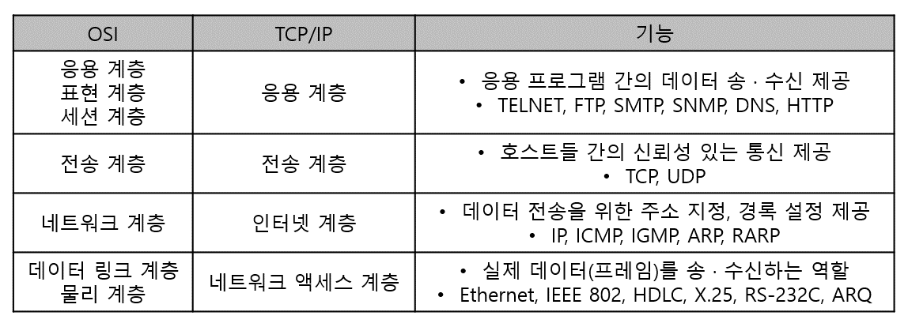
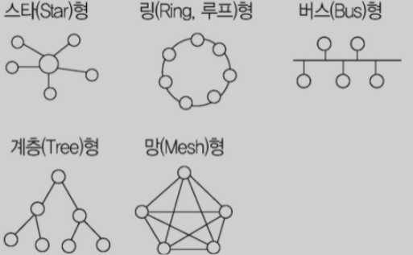

## 449. ⭐ IP 주소 (Internet Protocol Address)
- 인터넷에 연결된 모든 컴퓨터 자원을 구분하기 위한 고유한 주소
- IPv4(Internet Protocol version 4)
    - 8비트씩 4부분, 총 32비트로 구성
    - A 클래스 ~ E 클래스 총 5단계로 구성
- IPv6(Internet Protocol version 6)
    - 16비트씩 8부분, 128비트로 구성
    - IPv4의 주소 부족 문제를 해결하기 위해 개발
    - 각 부분을 16진수로 표현하고, 콜론(:)으로 구분
    - 인증성, 기밀성, 데이터 무결성의 지원으로 보안문제 해결

## 450. ⭐ IPv6의 주소체계
- 유니캐스트(Unicast) : 단일 송신자와 단일 수신자 간의 통신 (1대 1통신)
- 멀티캐스트(Multicast) : 단일 송신자와 다중 수신자 간의 통신 (1대 다 통신)
- 애니캐스트(Anycast) : 단일 송신자와 가장 가까이 있는 단일 수신자 간의 통신 (1대 1 통신에 사용)

## 451. ⭐ 서브네팅 (Subnetting)
- 할당된 네트워크 주소를 다시 여러 개의 작은 네트워크로 나누어 사용하는 것
- 서브넷 마스크 : 4바이트의 IP주소 중 네트워크 주소와 호스트 주소를 구분하기 위한 비트
- 서브넷 마스크를 변경하여 네트워크 주소를 여러 개로 분할하여 사용

## 452. 도메인 네임
- 숫자로 된 IP주소를 사람이 이해하기 쉬운 문자 형태로 표현한 것
- 호스트 컴퓨터 이름, 소속 기관 이름, 소속 기관의 종류, 소속 국가명 순으로 구성
- 왼쪽에서 오른쪽으로 갈수록 상위 도메인
- DNS(Domain Name System) : 문자로 된 도메인 네임을 컴퓨터가 이해할 수 있는 IP주소로 변환하는 역할

## 453. ⭐ OSI 참조 모델
- ISO(국제표준화기구)에서 제안한 통신 규약(Protocol)
- 물리 계층(Physical Layer)
    - 전송에 필요한 두 장치 간의 실제 접속과 절단 등 기계적, 전기적, 기능적, 절차적 특성에 대한 규칙을 정의
- 데이터 링크 계층(Data Link Layer)
    - 두 개의 인접한 개발 시스템들 간에 신뢰성 있고 효율적인 정보 전송을 할 수 있도록 시스템 간 연결 설정과 유지 및 종료를 담당
- 네트워크 계층(Network Layer)
    - 개방 시스템들 간의 네트워크 연결을 관리하는 기능과 데이터의 교환 및 중계 기능
- 전송 계층(Transport Layer)
    - 논리적 안정과 균일한 데이터 전송 서비스를 제공함으로써 종단 시스템(End-to-End) 간에 투명한 데이터 전송을 가능하게 함
- 세션 계층(Session Layer)
    - 송 · 수신 간의 관련성을 유지하고 대화 제어를 담당
- 표현 계층(Presentation Layer)
    - 서로 다른 데이터 표현 형태를 갖는 시스템 간의 상호 접속을 위해 필요한 계층
    - 코드변환, 데이터 암호화, 데이터 압축, 구문 검색 등의 기능 수행
- 응용 계층(Application Layer)
    - 사용자가 OSI 환경에 접근할 수 있도록 서비스 제공

## 454. ⭐ 네트워크 관련 장비
- 라우터(Router)
    - 브리지와 같이 LAN과 LAN의 연결 기능에 데이터 전송의 최적 경로를 선택하는 기능이 추가된 장치
    - 서로 다른 LAN 또는 LAN과 WAN을 연결하는 기능도 함
- 리피터(Repeater)
    - 장거리 전송을 위해 수신한 신호를 재생시키거나 출력 전압을 높여 전송하는 장치
- 허브(Hub)
    - 사무실이나 가까운 거리의 컴퓨터들을 연결하는 장치
    - 각 회선을 통합하여 관리
    - 신호 증폭 기능을 하는 리피터의 역할을 포함
- 브리지(Bridge)
    - LAN과 LAN을 연결하거나 LAN 안에서의 컴퓨터 그룹을 연결하는 장치
    - 브리지를 이용한 서브넷 구성 시 전송 가능한 회선 수는 브리지 n일때, n(n-1)/2
- 게이트웨이(Gateway)
    - OSI 전 계층의 프로토콜 구조가 다른 네트워크를 연결하는 장치
    - LAN에서 다른 네트워크에 데이터를 보내거나 다른 네트워크로부터 데이터를 받아들이는 출입구 역할

## 455. 프로토콜(Protocol)
- 데이터 교환을 원활하게 수행할 수 있도록 표준화시켜 놓은 통신 규약
- 1965년 톰 마릴이 정의

## 456. ⭐ 프로토콜의 기본 요소
- 구문(Syntax) : 전송하고자 하는 데이터의 형식, 부호화, 신호 레벨 등을 규정
- 의미(Semantics) : 두 기기 간의 효율적이고 정확한 정보 전송을 위한 협조 사항과 오류 관리를 위한 제어 정보를 규정
- 시간(Timing) : 두 기기 간의 통신 속도, 메시지의 순서 제어 등을 규정

## 457. ⭐ 패킷 교환 방식 (Packet Switching)
- 메시지를 일정한 길이의 패킷으로 잘라서 전송하는 방식
- 가상 회선 방식
    - 단말기 간에 논리적인 가상 통신 회선을 미리 설정
    - 송신지와 수신지 사이의 연결을 확립한 후 설정된 경로를 따라 패킷들을 순서적으로 운반하는 방식
    - 정보 전송 전에 제어 패킷에 의해 경로가 설정됨
    - 모든 패킷은 같은 경로로 발생 순서대로 전송됨
    - 패킷의 송 · 수신 순서가 동일
- 데이터그램 방식
    - 연결 경로를 설정하기 않고 인접한 노드들의 트래픽(전송량) 상황을 감안하여 각 패킷들을 순서에 상관없이 독립적으로 운반하는 방식
    - 패킷마다 전송 경로 다름
    - 패킷은 목적지의 완전한 주소를 가져야 함
    - 순서에 상관없이 여러 경로를 통해 도착한 패킷들은 수신 측에서 순서를 재정리

## 458. ⭐ TCP/IP (Transmission Control Protocol / Internet Protocol)
- 서로 다른 기종의 컴퓨터들이 데이터를 주고받을 수 있도록 하는 표준 프로토콜
- TCP
    - OSI 7 계층의 전송 계층
    - 가상 회선 방식을 기반으로 양방향 연결 서비스
    - 패킷의 다중화, 순서 제어, 오류 제어, 흐름 제어 기능 제공
- IP
    - OSI 7 계층의 네트워크 계층
    - 데이터그램 방식을 기반으로 비연결형 서비스
    - 패킷의 분해/조립, 주소 지정, 경로 선택 기능 제공

## 459. TCP/IP 구조

## 460. ⭐ UDP (User Datagram Protocol)
- 데이터 전송 전에 연결을 설정하지 않는 비연결형 서비스를 제공하는 프로토콜
- TCP에 비해 상대적으로 단순한 헤더
- 오버헤드 적음
- 흐름제어나 순서 제어가 없어 전송 속도 빠름
- 실시간 전송에 유리
- 신뢰성보다는 속도가 중요시되는 네트워크에서 사용

## 461. ⭐ RTCP (Real-Time Control Protocol)
- RTP(Real-time Transport Protocol) 패킷의 전송 품질을 제어하기 위한 제어 프로토콜
- 세션에 참여한 각 참여자들에게 주기적으로 제어정보를 전송
- 하위 프로토콜은 데이터 패킷과 제어패킷의 다중화(Multiplexing) 제공

## 462. ⭐ ICMP (Internet Control Message Protocol)
- IP와 조합하여 통신 중에 발생하는 오류처리와 전송경로 변경 등을 위한 제어 메시지를 관리하는 역할
- 헤더는 8byte로 구성

## 463. ⭐ ARP/RARP
- ARP(Address Resolution Protocol, 주소 분석 프로토콜)
    - IP → MAC
    - IP주소를 호스트와 연결된 네트워크 접속장치의 물리적 주소(MAC Address)로 변환하는 기능을 수행하는 프로토콜
- RARP(Reverse Address Resolution Protocol)
    - MAC → IP
    - ARP와 반대로 물리적 주소를 IP 주소로 변환하는 기능을 수행하는 프로토콜
    - 역순 주소 결정 프로토콜

## 464. ⭐ 네트워크 관련 신기술
- 메시 네트워크(Mesh Network)
    - 차세대 이동통신, 홈네트워킹, 공공 안전 등 특수 목적을 위한 새로운 방식의 네트워크 기술
    - 대규모 디바이스의 네트워크 생성에 최적화되어 있음
- 피코넷(PICONET)
    - 독립된 통신장치가 블루투스 기술이나 UWB통신 기술을 사용해 통신망을 형성하는 무선 네트워크
- 애드 혹 네트워크(Ad-hoc Network)
    - 재난 현장과 같이 별도의 고정된 유선망을 구축할 수 없는 장소에서 모바일 호스트만을 이용해 구성한 네트워크
    - 망을 구성한 후 단기간 사용되는 경우나 유선망을 구성하기 어려운 경우 적합
- 파장 분할 다중화(WDM; Wavelength Division Multiplexing)
    - 광섬유를 이용한 통신기술
    - 파장이 서로 다른 복수의 신호를 보냄으로써 여러 대의 단말기가 동시에 통신 회선을 사용할 수 있도록 하는 기술
- 소프트웨어 정의 데이터센터(SDDC; Software Defined Data Center)
    - 데이터 센터의 모든 자원을 가상화하여 인력의 개입없이 소프트웨어 조작만으로 관리 및 제어되는 데이터 센터
    - 컴퓨팅, 네트워킹, 스토리지, 관리 등
- 개방형 링크드 데이터(LOD; Linked Open Data)
    - 누구나 사용할 수 있도록 웹상에 공개된 연계 데이터
    - 웹상에 존재하는 데이터는 개발 URI로 식별
    - 각 URI에 링크 정보를 부여함으로써 상호 연결된 웹을 지향하는 모형
- IoT(Internet of Things)
    - 실세계와 가상 세계의 다양한 사물들을 인터넷으로 서로 연결하여 진보된 서비스를 제공
- 클라우드 컴퓨팅(Cloud Computing)
    - 각종 컴퓨터 자원을 중앙 컴퓨터에 두고 인터넷 기능을 갖는 단말기로 언제 어디서나 인터넷을 통해 컴퓨터 작업을 수행할 수 있는 가상화된 환경
- USN(Ubiquitous Sensor Network)
    - 각종 센서로 수집한 정보를 무선으로 수집할 수 있도록 구성한 네트워크
    - RFID 태그를 부착하여 사물의 인식정보, 주변의 환경정보 등을 탐지하여 네트워크에 연결해 정보를 관리

## 465. ⭐ 네트워크 구축
- 두 대 이상의 컴퓨터를 연결하여 자원을 공유하는 것
- 성형(Star, 중앙집중형)
    - 중앙에 중앙컴퓨터가 있고 이를 중심으로 단말장치들이 연결되는 중앙 집중식의 네트워크 구성 형태
- 링형(Ring, 루프형)
    - 컴퓨터와 단말장치들을 서로 이웃하는 것끼리 연결시킨 포인트 투 포인트 방식의 구성 형태
- 버스형(Bus)
    - 한 개의 통신 회선에 여러 대의 단말장치가 연결되어 있는 형태
- 계층형(Tree, 분산형)
    - 중앙 컴퓨터와 일정 지역의 단말장치까지는 하나의 통신 회선으로 연결시키고, 이웃하는 단말장치는 일정 지역 내에 설치된 중간 단말장치로부터 다시 연결시킨 형태
- 망형(Mesh)
    - 모든 지점의 컴퓨터와 단말장치를 서로 연결한 형태
    - 노드의 연결성이 높음
    - 노드의 수 n, 회선 수 n(n-1)/2, 포트 수 n-1

## 466. 네트워크 분류
- 근거리 통신망(LAN; Local Area Network)
    - 회사, 학교, 연구소 등에서 비교적 가까운 거리에 있는 컴퓨터, 프린터, 저장장치 등과 같은 자원을 연결하여 구성
    - 사이트 간 거리가 짧음
    - 데이터의 전송속도가 빠름
    - 에러 발생율이 낮음
    - 버스형, 링형
- 광대역 통신망(WAN; Wide Area Network)
    - 국가 & 국가, 대륙 & 대륙 같이 멀리 떨어진 사이트들을 연결하여 구성
    - 사이트 간 거리가 멀음
    - 통신 속도가 느림
    - 에러 발생률이 높음

## 467. IEEE 802의 주요 표준 규격
- 802.1 : 전체의 구성, OSI 참조 모델과의 관계, 통신망 관리 등에 관한 규약
- 802.2 : 논리 링크 제어(LLC) 계층에 관한 규약
- 802.3 : CSMA/CD 방식의 매체 접근 제어 계층에 관한 규약
- 802.4 : 토큰 버스 방식의 매체 접근 제어 계층에 관한 규약
- 802.5 : 토큰 링 방식의 매체 접근 제어 계층에 관한 규약
- 802.6 : 도시형 통신망(MAN)에 관한 규약
- 802.9 : 종합 음성/데이터 네트워크에 관한 규약
- 802.11 : 무선 LAN에 관한 규약

## 468. IEEE 802.11의 버전
- 802.11 : 2.4GHz 대역 전파와 CSMA/CA 기술을 사용해 최고 2Mbps까지 전송 속도 지원
- 802.11a : 5GHz 대역의 전파를 사용해 OFDM 기술을 사용해 최고 54Mbps까지 전송속도 지원
- 802.11b : 802.11 초기 버전의 개선안, 초기 버전의 대역 전파와 기술을 사용해 최고 11Mbps의 전송속도로 기존에 비해 5배 이상 빠르게 개선
- 802.11e : 802.11의 부가 기능 표준, QoS 기능이 지원되도록 하기위해 매체 접근 제어(MAC) 계층에 해당하는 부분 수정
- 802.11g : 2.4GHz 대역 전파를 사용하지만 5GHz 대역 전파를 사용하는 802,11와 동일한 최고 53Mbps까지의 전송속도 지원
- 802.11n : 2.5GHz 대역과 5GHz 대역을 사용하는 규격, 최고 600Mbps까지 전송속도 지원

## 469. ⭐ NAT (Network Address Translation)
- 한 개의 정식 IP 주소에 대량의 가상 사설 IP 주소를 할당 및 연결하는 기능
- 한 개의 IP 주소를 사용해 외부에 접속할 수 있는 노드는 어느 시점에서 한 개로 제한되는 문제가 있지만 IP 마스커레이드를 이용하여 해결 가능

## 470. ⭐ 스위치
- LAN과 LAN을 연결하여 훨씬 더 큰 LAN을 만드는 장치
- L2 스위치
    - 일반적으로 부르는 스위치
    - MAC 주소를 기반으로 프레임 전송
    - OSI 2계층에 속하는 장비 = 데이터링크
- L3 스위치
    - L2 스위치에 라우터 기능 추가된 것
    - IP 주소를 기반으로 패킷 전송
    - OSI 3계층에 속하는 장비 = 네트워크
- L4 스위치
    - 로드밸런서가 달린 L3 스위치
    - IP 주소 및 TCP/UDP를 기반으로 사용자들의 요구를 서버의 부하가 적은 곳에 배분하는 로드밸런싱 기능 제공
    - OSI 4계층에 속하는 장비 = 전송
- L7 스위치
    - IP주소, TCP/UDP 포트 정보에 패킷 내용까지 참조하여 세밀하게 로드밸런싱
    - OSI 7계층에 속하는 장비 = 응용

## 471. 경로 제어 (Routing)
- 송 · 수신 측 간의 전송 경로 중에서 최적 패킷 교환 경로를 결정하는 기능
- 경로 제어표를 참조해서 이루어지며 라우터에 의해 수행됨
- IGP(RIP, OSPF), EGP, BGP

## 472. ⭐ IGP (Interior Gateway Protocol)
- 내부 게이트웨이 프로토콜
- 하나의 자율 시스템(AS) 내의 라우팅에 사용되는 프로토콜
- RIP(Routing Information Protocol)
    - 현재 가장 널리 사용되는 라우팅 프로토콜
    - 거리 벡터 라우팅 프로토콜
    - 최단 경로 탐색에 Bellman-Ford 알고리즘 사용
    - 소규모 동종의 네트워크(자율시스템, AS) 내에서 효율적인 방법
- OSPF(Open Shortest Path First protocol)
    - RIP 단점을 해결해 새로운 기능을 지원하는 인터넷 프로토콜
    - 대규모 네트워크에서 많이 사용
    - 최단 경로 담색에 다익스트라(Dijkstra) 알고리즘 사용

## 473. EGP / SGP
- EGP(Exterior Gateway Protocol)
    - 자율 시스템(AS) 간의 라우팅
    - 게이트웨이 간의 라우팅에 사용되는 프로토콜
- BGP(Border Gateway Protocol)
    - 자율 시스템(AS) 간의 라우팅 프로토콜
    - EGP의 단점을 보완
    - 초기 BGP 라웉터들이 연결될 때 전체 경로 제어표(라우팅 테이블)를 교환
    - 이후 변화된 정보만을 교환

## 474. 흐름 제어 (Flow Control)
- 송 · 수신 측 사이에 전송되는 패킷의 양이나 속도를 규제하는 기능
- 정지-대기(Stop-and-Wait)
    - 수신 측의 확인 신호(ACK)를 받은 후에 다음 패킷을 전송하는 방식
    - 한 번에 하나의 패킷만을 전송
- 슬라이딩 윈도우(Sliding Window)
    - 수신 통지(확인 신호)를 이용해 송신 데이터의 양을 조절하는 방식
    - 수신 측의 확인 신호를 받지 않더라도 미리 정해진 패킷의 수만큼 연속적으로 전송하는 방식
    - 한 번에 여러개의 패킷을 전송할 수 있어 전송 효율이 좋음
    - 송신 측은 수신 측으로부터 확인 신호(ACK)없이도 보낼 수 있는 패킷의 최대치를 미리 약속 받음
    - 패킷의 최대치가 윈도우 크기(Window Size)를 의미

## 475. SW 관련 신기술
- 블록체인(Blockchain)
    - P2P(Peer-to-Peer) 네트워크를 이용해 온라인 금융 거래 정보를 온라인 네트워크 참여자(Peer)의 디지털 장비에 분산 저장하는 기술
- 매시업(Mash up)
    - 웹에서 제공하는 정보 및 서비스를 이용해 새로운 SW, 서비스, DB 등을 만드는 기술
    - 다수의 정보원이 제공하는 콘텐츠를 조합하여 하나의 서비스로 제공하는 웹 사이트 or 애플리케이션
- 서비스 지양 아키텍처(SOA; Service Oriented Architecture)
    - 기업 정보시스템을 공유와 재사용이 가능한 서비스 단위나 컴포넌트 중심으로 구축하는 정보기술 아키텍처
    - 표현(Presentation), 업무 프로세스(Biz-Process), 서비스 중간(Service Intermediary), 애플리케이션(Application), 데이터 저장(Persistency)
- 디지털 트윈(Digital Twin)
    - 현실 속의 사물을 SW로 가상화한 모델
    - 실제 물리적인 자산을 SW로 가상화함으로써 실제 자산의 특성에 대한 정확한 정보를 얻을 수 있음
- 그레이웨어(Grayware)
    - 소프트웨어 입장 : 악의적이지 않은 유용한 소프트웨어
    - 사용자 입장 : 유용할 수도 있고 악의적일 수도 있는 애드웨어, 트랙웨어, 기타 악성코드나 악성 공유웨어
- 양자 암호키 분배(QKD; Quantum Key Distribution)
    - 양자 통신을 위해 비밀키를 분배하여 관리하는 기술
    - 두 시스템이 암호 알고리즘 동작을 위한 비밀키를 안전하게 공유하기 위해 양자 암호키 분배 시스템을 설치하여 운용하는 방식으로 활용
- 서비스형 소프트웨어(SaaS; Sofrware as a Service)
    - SW의 여러 기능 중 사용자가 필요로 하는 서비스만 이용할 수 있도록 한 소프트웨어
- 시맨틱 웹(Semantic Web)
    - 컴퓨터가 사람을 대신해 정보를 읽고 이해하고 가공하여 새로운 정보를 만들어 낼 수 있도록 이해하기 쉬운 의미를 가진 차세대 지능형 웹
- 리치 인터넷 애플리케이션(RIA; Rich Internet Application)
    - 플래시 애니메이션 기술과 웹 서버 애플리케이션 기술을 통합
    - 기존 HTML보다 역동적이고 인터랙티브한 웹 페이지를 제공하는 신개념의 플래시 웹 페이지 제작 기술

## 476. HW 관련 신기술
- 앤 스크린(N-Screen)
    - N개의 서로 다른 단말기에서 동일한 콘텐츠를 자유롭게 이용할 수 있는 서비스
- 신 클라이언트 PC(Thin Client PC)
    - 하드디스크나 주변장치 없이 기본적인 메모리만 갖추고 서버와 네트워크로 운용되는 개인용 컴퓨터
    - 서버 기반 컴퓨팅과 관계가 깊음
- 엠디스크(M-DISC; Millennial DISC)
    - 한 번의 기록만으로 자료를 영구 보관할 수 있는 광 저장장치
    - 디스크 표면의 무기물층에 레이저를 이용해 자료를 조각해서 기록
- 멤스(MEMS; Miccro-Electro Mechanical Systems)
    - 초정밀 반도체 제조 기술을 바탕으로 센서, 액추에이터 등 기계 구조를 다양한 기술로 미세 가공하여 전기기계적 동작을 할 수 있도록 한 초미세 장치
- 멤리스터(Memristor)
    - 메모리와 레지스터 합성어
    - 전류의 방향과 양 등 기존의 경험을 모두 기억하는 특별한 소자
- 트러스트존 기술(TrustZone Technology)
    - 하나의 프로세서 내에 일반 애플리케이션을 처리하는 일반 구역(Normal World)과 보안이 필요한 애플리케이션을 처리하는 보안 구역(Secure World)으로 분할하여 관리하는 하드웨어 기반의 보안기술

## 477. ⭐ RAID (Redundant Array of Independent Disk)
- 2개 이상의 하드디스크로 디스크 배열을 구성
- 파일을 구성하는 데이터 블록들을 서로 다른 디스크에 분산 저장하거나 다중화하는 저장 기술
- RAID 0
    - 스트라이핑(Striping)
    - 디스크를 병렬로 연결해 디스크의 개수만큼 용량과 속도가 배로 증가
    - 하나의 디스크만 손상되어도 전체 데이터가 파손
- RAID 1
    - 미러링(Mirroring)
    - 같은 데이터를 다른 디스크에 동일하게 복사하는 방식
- RAID 2 ~ 4
    - 하나의 디스크에 오류 정정 부호를 비트(RAID 2)/바이트(RAID 3)/워드(RAID 4) 단위로 저장
    - 나머지 디스크는 RAID 0과 같이 활용해 안정성을 높인 모드
    - 하나의 디스크가 손상되어도 정상 가동이 가능하며 최소 3개의 디스크가 필요
- RAID 5
    - 오류 정정 부호를 블록 단위로 여러 디스크에 분산 저장한 방식
    - 하나의 디스크가 손상되어도 정상 가동이 가능하며 최소 3개의 디스크가 필요
- RAID 6
    - RAID 5와 원리는 같으나 오류 정정 부호 2개를 저장하는 방식
    - 두 개의 디스크가 손상되어도 정상 가동이 가능하며 최소 4개의 디스크가 필요

## 478. Secure OS
- 보안 기능을 갖춘 커널(Kernel)을 이식하여 외부의 침입으로부터 시스템 자원을 보호하는 운영체제
- TCB(Trusted Computing Base)를 기반으로 참조 모니터의 개념을 구현하고 집행
- 식별 및 인증, 임의적/강제적 접근통제, 객체 재사용 보호, 완전한 조정, 신뢰 경로, 감사 및 감사기록 축소

## 479. ⭐ DB 관련 신기술
- 하둡(Hadoop)
    - 오픈 소스 기반 분산 컴퓨팅 플랫폼
    - 더그 커팅과 마이크 캐퍼렐라가 개발
    - 구글의 맵리듀스(MapReduce) 엔진을 사용
    - 일반 PC급 컴퓨터들로 가상화된 대형 스토리지를 형성하고 그 안에 보관된 거대한 데이터 세트를 병렬로 처리할 수 있도록 개발된 자바 소프트웨어 프레임워크
- 맵리듀스(MapReduce)
    - 대용량 데이터를 분산 처리하기 위한 목적으로 개발된 프로그래밍 모델
    - Map : 흩어져 있는 데이터를 연관성 있는 데이터 분류로 묶는 작업
    - Reduce : 중복 데이터를 제거하고 원하는 데이터를 추출하는 작업
- 데이터 마이닝(Data Mining)
    - 대량의 데이터를 분석하여 데이터에 내재된 변수 사이의 상호관계를 규명하여 일정한 패턴을 찾아내는 기법
- 타조(Tajo)
    - 하둡 기반의 분산 데이터 웨어하우스 프로젝트
- OLAP(Online Analytical Processing)
    - 다차원으로 이루어진 데이터로부터 통계적인 요약 정보를 분석해 의사결정에 활용하는 방식
    - Roll-up, Drill-down, Drill-through, Drillacross, Pivoting, Slicing, Dicing
- 브로드 데이터(Broad Data)
    - 다양한 채널에서 소비자와 상호작용을 통해 생성된 것
    - 기업 마케팅에 효율적이고 다양한 데이터
    - 이전에 사용하지 않거나 알지 못했던 새로운 데이터나 기존 데이터에 새로운 가치가 더해진 데이터

## 480. 회복 (Recovery)
- DB가 손상되었을 때 손상되지 이전의 정상 상태로 복구하는 작업
- 연기 갱신 기법, 즉각 갱신 기법, 그림자 페이지 대체 기법, 검사점 기법

## 481. ⭐ REDO / UNDO
- REDO
    - DB가 비정상적으로 종료되었을 때, 디스크에 저장된 로그를 분석해 트랜잭션의 시작(starr)과 완료(commit)에 대한 기록이 있는 트랜잭션들의 작업을 재작업
    - 로그를 이용해 해당 데이터 항목에 대해 이전 값을 이후 값으로 변경하는 연산
- UNDO
    - 트랜잭션의 시작(start)에 대한 기록은 있지만 완료(commit)기록은 없는 트랜잭션들이 작업한 변경 내용들을 모두 취소
    - 로그를 이용해 해당 데이터 항목에 대해 이후 값을 이전 값으로 변경하는 연산

## 482. ⭐ 연기 갱신 기법 (Deferred Update)
- 트랜잭션이 성공적으로 완료될 때까지 DB에 대한 실질적인 갱신을 연기하는 방법
- 트랜잭션이 수행되는 동안 갱신된 내용은 일단 Log에 보관됨
- 트랜잭션의 부분 완료 시점에 Log에 보관한 갱신 내용을 실제 DB에 기록
- Redo(재시도) 작업만 가능

## 483. ⭐ 즉각 갱신 기법 (Immediate Update)
- 트랜잭션이 부분 완료되기 전이라도 즉시 실제 DB에 반영하는 방법
- 장애가 발생하여 회복 작업할 경우를 대비해 갱신된 내용들은 Log에 보관
- Redo(재시도)와 Undo(취소) 모두 사용 가능

## 484. ⭐ 병행 제어 (Concurrency Control)
- 동시에 실행되는 트랜잭션들이 DB의 일관성을 파괴하지 않도록 트랜잭션들 간의 상호작용을 제어하는 것
- 로킹(Locking), 타임 스탬프 순서, 최적 병행 수행, 다중 버전 기법

## 485. ⭐ 로킹 (Locking)
- 트랜잭션들이 어떤 로킹 단위를 액세스 하기 전에 Lock(잠금)을 요청해 Lock이 허락되어야만 로킹 단위를 액세스할 수 있도록 하는 기법
- 상호베타적

## 486. 타임 스탬프 순서
- 시간표(Time Stamp)를 부여해 부여된 시간에 따라 트랜잭션 작업을 수행하는 기법
- 직렬성 순서를 결정하기 위해 트랜잭션 간의 처리 순서를 미리 선택하는 기법들 중에서 가장 보편적인 방법

## 487. ⭐ 로킹 단위 (Locking Granularity)
- 병행제어에서 한꺼번에 로킹할 수 있는 객체의 크기
- 로킹 단위 : DB, 파일, 레코드, 필드
- 로킹 단위 ↑, 로크 수 ↓, 관리 쉬움, 병행성 수준 낮아짐
- 로킹 단위 ↓, 로크 수 ↑, 관리 복잡, 오버헤드 증가, 병행성 수준 높아짐

## 488. ⭐ 교착 상태 (Dead Lock)
- 상호 배제에 의해 나타나는 문제점
- 둘 이상의 프로세스들이 자원을 점유한 상태에서 서로 다른 프로세스가 점유하고 있는 자원을 요구하며 무한정 기다리는 현상
- 상호배제(Mutual Exclusion)
    - 한 번에 한 개의 프로세스만이 공유 자원을 사용할 수 있어야함
- 점유와 대기(Hold and Wait)
    - 최소한 하나의 자원을 점유하고 있으면서 다른 프로세스에 할당되어 사용되고 있는 자원을 추가로 점유하기 위해 대기하는 프로세스가 있어야함
- 비선점(Non-preemption)
    - 다른 프로세스에 할당된 자원은 사용이 끝날 때까지 강제로 뺴앗을 수 없어야함
- 환형 대기(Circular Wait)
    - 공유 자원과 공유자원을 사용하기 위해 대기하는 프로세스들이 원형으로 구성되어 있어 자신에게 할당된 자원을 점유하면서 앞이나 뒤에 있는 프로세스의 자원을 요구해야 함

## 489. ⭐ 교착상태의 해결방법
- 예방 기법(Prevention)
    - 사전에 시스템을 제어하는 방법
    - 교착상태 발생 조건 중 어느하나를 제거함으로써 수행됨
- 회피 기법(Avoidance)
    - 교착상태가 발생하면 적절히 피해나가는 방법
    - 은행원 알고리즘이 사용됨
- 발견 기법(Detection)
    - 점검하여 교착상태에 있는 프로세스와 자원을 발견하는 것
- 회복 기법(Recovery)
    - 교착상태를 일으킨 프로세스를 종료
    - 교착상태의 프로세스에 할당된 자원을 선점하여 프로세스나 자원을 회복하는 것

# Reference
- 정보처리기사 실기 (시나공)
- https://starrykss.tistory.com/1331