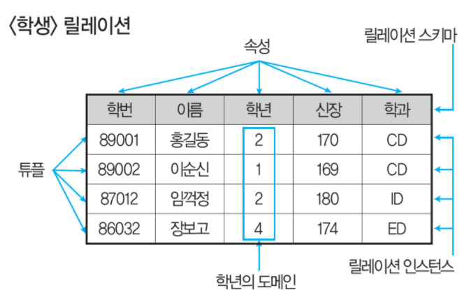
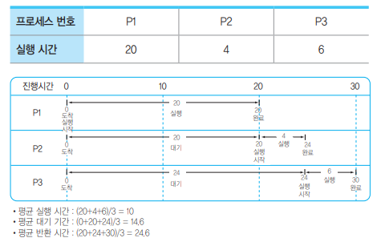
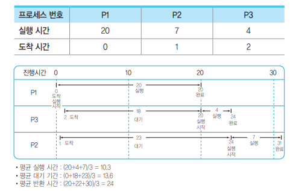

## 프로그래밍 언어

## 데이터베이스 / 트랜잭션 / 관계대수
#### 데이터베이스 정의
- 공유 데이터(Shared Data) : 여러 사용자가 공동으로 사용하는 데이터
- 저장 데이터(Stored Data) : 저장 매체에 저장된 데이터
- 통합 데이터(Integrated Data) : 중복이 최소화된 데이터 모임
- 운영 데이터(Operational Data) : 조직의 목적을 위한 필수 데이터

#### 데이터베이스 설계
> 요구조건 분석 → 개념적 설계 → 논리적 설계 → 물리적 설계 → 구형

#### 데이터 모델
- 복잡한 데이터 구조를 단순화, 추상화하여 체계적으로 표현한 개념적 모형
- 구조(Structure) : 데이터 구조 및 개체 간 관계
- 연산(Operation) : 데이터 처리 방법
- 제약조건(Constraint) : 데이터의 논리적 제약조건

#### 이상현상
데이터 중복으로 인해 릴레이션 조작 시 발생하는 예기지 않은 문제점
- 삽입 이상 : 불필요한 데이터가 함께 삽입되는 현산
- 삭제 이상 : 연쇄 삭제 현상으로 인해 정보 손실
- 갱신 이상 : 일부 정보만 갱신되어 정보에 모순이 생김

#### 함수적 종속
- 완전 함수적 종속(Full Functional Dependency)
    - 종속자가 기본키에만 종속
- 부분 함수적 종속(Partial Functional Dependency)
    - 기본키를 구성하는 속성 중 일부만 종속되는 경우
- 이행적 함수 종속(Transitive Functional Dependency)
    - X → Y, Y → Z일때 X → Z가 성립되는 경우

#### 데이터베이스 백업
- 전체백업(Full Backup) : 모든 데이터를 백엄
- 증분 백업(Incremental Backup) : 변경/추가된 데이터만 백업
- 차등 백업(Differential Backup) : 모든 변경/추간된 데이터를 백엄
- 합성 백업 : 전체 백업본과 여러 개의 **증분** 백업을 합하여 새로운 전체 백업을 만드는 과정

#### RTO / RPO
- 복구 시간 목표(RPT) : 서비스를 사용할 수 없는 상태로 허용되는 시간
- 복구 시점 목표(RPO) : 마지막 백업 이후 허용되는 최대 데이터 손실 시간

#### 관계 데이터 릴레이션 구조

- 릴레이션 스키마 : 릴레이션의 논리적 구조
- 릴레이션 인스턴스 : 스키마에 실제로 저장된 데이터의 집합
- 속성(Attribute) : 릴레이션의 열, 개체의 특성
- 튜플(Tuple) : 릴레이션의 행, 속성들의 모임
- 도메인(Domain) : 속성이 가질 수 있는 값의 범위
- 차수(Degree) : 속성의 총 개수
- 카디널리티(Cardinality) : 튜플의 총 개수

#### 관계대수
원하는 데이터를 찾기 위한 절차적 언어
- 순수 관계 연산자
    - SELECT : ∂
    - PROJECT : π
    - JOIN : ▷◁
    - DIVISION : ÷
- 일반 집합 연산자
    - 합집합 : ∪
    - 교집합 : ∩
    - 차집합 : ㅡ
    - 교차곱 : X

#### 관계해석
원하는 정보가 무엇이라는 것만 정의하는 비절차적 특성
- 연산자
    - ∨ : OR 연산
    - ∧ : AND 연산
    - ￢ : NOT 연산
- 정량자
    - ∀ : 모든 가능한 튜플 "For All"
    - ∃ : 어떤 튜플 하나라도 존재

#### 키
- 후보키(Candidate Key)
    - 유일성, 최소성 모두 만족
    - 속성들 중 튜플을 유일하게 식벽하기 위해 사용되는 속성들의 부분집합
    - 기본키로 사용할 수 있는 속성
- 기본키(Primary Key)
    - 유일성, 최소성 모두 만족
    - 후보키 중에서 특별히 선정된 주키
    - 중복값 가질 수 없음
    - NULL 값 가질 수 없음
- 슈퍼키(Super Key)
    - 유일성만 만족
    - 속성들의 집합으로 구성된 키
- 대체키(Alternate KEy)
    - 후보키가 둘 이상일 때 기본키를 제외한 나머지 후보키
    - 보조키
- 외래키(Foreign Key)
    - 다른 릴레이션의 기본키를 참조하는 속성, 속성들의 집합
    - 참조 릴레이션의 기본키에 없는 값을 입력할 수 없음

#### 무결성 제약조건
- 개체 무결성(Entity Integrity)
    - NULL 불가, 중복 불가
- 참조 무결성(Referential Integrity)
    - 외래키는 NULL이거나 참조 릴레이션의 기본키와 일치해야 함
    - Restrict : 다른 객체가 제거할 요소를 참조중일 때는 제거를 취소함
    - Cascade : 제거할 요소를 참조하는 다른 모든 객체를 함께 제거함
- 도메인 무결성(Domain Integrity)
    - 속성 값은 정의된 도메인에 속해야 함

#### 분산 데이터베이스
- 구성요소 : 분산 처리기, 분산 데이터베이스, 통신 네트워크
- 투명성
    - 위치 투명성(Location Transparency) : 데이터베이스의 실제 위치를 알 필요없이 논리적인 명칭만으로 엑세스
    - 중복 투명성(Replication Transparency) : 동일 데이터가 여러 곳에 중복되어 있더라도 사용자는 마치 하나의 데이터만 존재하는 것처럼 하용하고, 시스템은 자동으로 여러 자료에 대한 작업 수행
    - 병행 투명성(Concurrency Transparency) : 트랜잭션들이 동시에 실현되더라도 그 트랜잭션의 결과는 영향을 받지 않음
    - 장애 투명성(Failure Transparency) : 트랜잭션, DBMS, 네트워크, 컴퓨터 장애에도 불구하고 트랜잭션을 정확하게 처리

#### 트랜잭션 (ACID)
하나의 논리적 기능을 수행하는 작업단위
- 원자성(Atomicity) : 모두 반영되거나 전혀 반영되지 않아야 함
- 일관성(Consistency) : 트랜잭션 완료 후, 데이터베이스가 일관된 상태를 유지해야 함
- 독립성, 격리성(Isolation) : 동시에 실행되는 여러 트랜잭션들은 서로 간섭 불가
- 영속성(Durability) : 결과는 시스템에 고장이 발생해도 영구적으로 반영되어야 함

#### 트랜잭션 상태
- 활동(Active) : 트랜잭션이 실행 중인 상태
- 실패(Failed) : 트랜잭션 싱행에 오류가 발생하여 중단된 상태
- 철회(Aborted) : 비정상적으로 종료되어 Rollback 연산을 수행한 상태
- 부분 완료(Paritially Committed) : Commit 연산이 실행되지 직전의 상태
- 완료(Committed) : 트랜잭션이 성공적으로 종료된 상태

## 보안 / 해킹 / 위협 / 네트워크 / 암호화 / 접근통제
#### 개발 보안
- 네트워크 보안
    - IPSec
        - 네트워크 트래필에 대해 IP 계층에서 IP 패킷 단위의 데이터 변조 방지 및 은닉 기능을 제공하는 네트워크 계층에서의 보안통신규약
    - SSL
        - TCP/IP 계층과 애플리케이션 계층 사이에 위치
        - 인증, 암호화, 무결성을 보장하는 업계 표준 프로토콜
    - S-HTTP
        - 웹 상에서 네트워크 트래픽을 암호화
        - 응용 계층에서 보안 기능 제공
        - HTTP를 사용하는 애플리케이션에 한해서만 기밀성, 무경성, 전자서명 등의 보안 기능 제공
        - HTTP와 같은 포트를 사용하면서 Message 단위로 암호화
    - HTTPS
        - SSL을 통해 암복호화
        - TCP/IP에서 HTTP 포트 80 대신에 포트 443을 사용
        - RC4 스트림 안호 알고리즘
- DBMS 보안 : API, Plug-In, TDE

## 테스트
#### 테스트 레벨

1\) 단위 테스트
- 코딩 직후 SW 설계의 최소 단위인 모듈이나 컴포넌트에 초점을 맞춰 수행하는 테스트
- 사용자의 요구사항을 기반으로 한 기능성 테스트를 최우선으로 인터페이스, 외부적 I/O, 자료구조, 독립적 기초 경로, 오류 처리 경로, 경계 조건 등을 검사
- 정적 테스트
    - 워크스루, 인스펙션, 코드검사
- 동적 테스트
    - 블랙박스 테스트, 화이트박스 테스트

2\) 통합 테스트
- 모듈들을 결함하여 하나의 시스템으로 완성시키는 과정에서의 테스트
- 모듈 간 또는 컴포넌트 간의 인터페이스가 정상적으로 실행되는지 검사
- 상향식 통합 테스트 (점진적)
    - 하위 모듈에서 상위 모듈 방향으로 통합하면서 테스트하는 기법
    - 하나의 주요 제어 모듈과 관련된 종속 모듈의 그룹인 클러스터가 필요
    - 데이터의 입출력을 확인하기 위해 더미 모듈인 드라이버(Driver)를 생성
- 하향식 통합 테스트 (점진적)
    - 상위 모듈에서 하위 모듈 방향으로 통합하면서 테스트하는 기법
    - 제어 모듈이 호출하는 타 모듈의 기능을 단순히 수행하는 도구인 스텁(Stub) 사용
    - 깊이 우선, 넓이 우선 등 통합방식에 따라 스텁들이 한 번에 하나씩 실제 모듈로 교체
- 통합식 통합 테스트 (점진적)
    - 하위수준에서는 상향식 통합, 상위 수준에서는 하향식 통합
- 빅뱅 통합 테스트 (비점진적)
    - 단계적으로 통합하는 절차없이 모든 모듈이 미리 결합되어 있는 프로그램 전체를 테스트하는 비점진적 통합 방식
    - 모듈 간의 상호 인터페이스를 고려하지 않고 단위 테스트가 끝난 모듈들을 한꺼번에 테스트하는 방법
    - 소규모 시스템에 댄시간 테스트 가능
    - 장애 위치 찾기 어려움
    - 모든 모듈이 개발 준비가 되어 있어야 함

3\) 시스템 테스트
- 기능 테스트
    - 요구사항 명세서, 비즈니스 절차, 유스케이스 등 명세서의 기반
- 비기능 테스트
    - 성능 테스트, 회복 테스트, 보안 테스트, 내부 시스템의 메뉴 구조, 웹 페이지의 네비게이션 등 구조적 요소에 대한 테스트

4\) 인수 테스트
- 알파 테스트
    - 개발자의 장소에서 사용자가 개발자 앞에서 행하는 테스트 기법
    - 통제된 환경에서 행해지며 오류와 사용상의 문제점을 사용자의 개발자가 함께 확인하면서 기혹
- 베타 테스트
    - 선정된 최종 사용자가 여러 명의 사용자 앞에서 해해지는 테스트 기법
    - 실제 업무 가지고 사용자가 직접 테스트

#### 테스트 기법
1\) 동치 분할 검사 / 동등 분할 검사(Equicalence Partition) - 블랙박스 테스트
- 입력 조건에 타당한 입력 자료와 타당하지 않은 입력 자료 개수를 균등하게 하여 테스트 케이스 정함
- 해당 입력 자료에 맞는 결과가 출력되는지 확인

2\) Boundary Value Analysis(경계값 분석) - 블랙발스 테스트
- 입력 조건의 중간 값보다 경계값에서 오류 발생 확률이 높다는 점
- 입력 조건의 경계값을 테스트 케이스로 선정

3\) Cause-Effect Graph(원인-효과 그래프) - 블랙박스 테스트
- 입력 데이터 간의 관계와 출력에 영향을 미치는 상황을 분석 후, 효용성이 높은 테스트 케이스를 선정하여 검사

4\) Error Guess(오류 예측 검사) - 블랙박스 테스트
- 과거 경험이나 확인자의 감각으로 테스트하는 기법

5\) Coparision Test(비교검사) - 블랙박스 테스트
- 여러 버전의 프로그램에 동일한 테스트 자료를 제공하여 동일한 결과가 출력되는지 확인

6\) Base Path Test(기초 경로 검사) - 화이트박스 테스트
- 절차적 설계의 논리적 복잡성 측정

7\) Loop Test(루프 검사) - 화이트박스 테스트
- 반복 구조에 초점을 맞춰 실시

8\) Data Flow Test(데이터 흐름 검사) - 화이트박스 테스트
- 변수의 정의와 사용 위치에 초점을 맞춰 실시

#### 테스트 목적
- 회복(Recovery) : 고의로 실패를 유도
- 안전(Security) : 보안적인 결함을 점검
- 강도(Stress) : 과부하 테스트
- 성능(Performance) : 응답하는 시간, 처리량, 반응 속도 등
- 구조(Structure) : 소스코드의 복잡도를 평가
- 회귀(Regression) : 변경 코드에 대해 새로운 결함 여부 평가
- 병행(Parallel) : 변경된 시스템과 기존 시스템에 동일한 데이터를 입력 후 비교
- A/B 테스트 : 기존 서비스 대비 효과 테스트
- 스모크 테스트(Smoke) : 테스트 환경을 테스트

#### 테스트 오라클
테스트의 결과가 참인지 거짓인지를 판단하기 위해 미리 정의된 참값을 입렵하여 비교하는 기법의 활동
- 참 오라클
    - 모든 테스트 케이스의 입력 값에 대해 기대하는 결과를 제공하는 오라클
    - 발생된 모든 오류 검출 가능
- 샘플링 오라클
    - 특정 몇몇 테스트 케이스의 입력 값들에 대해서만 기대하는 결과를 제공하는 오라클
    - 전수 테스트가 불가능하 경우 사용
- 일관성 검사 오라클
    - 테스트 케이스 수행 전과 후의 결과 값이 동일한지 확인하는 오라클

#### 테스트 장치
- 테스트 드라이버 : 상향식 테스트에 필요
- 테스트 스텁 : 하향식 테스트에 필요
- 테스트 슈트 : 테스트 케이스의 집합
- 테스트 케이스 : 입력값, 실행조건, 기대결과 등의 집합
- 테스트 스크립트 : 자동황된 테스트 실행 절차
- 목 오브젝트 : 조건부로 상황에 예정된 행위를 수정하는 개체 방생한 결함을 추적하고 관리할 수 있게 해주는 도구

## 프로토콜 / OSI / 인터넷

## 병행제어 / 회복기법 / 스케줄링 / 프로세스
#### 병행제어 기법
여러 트랜잭션이 동시에 실행되면서도 데이터베이스의 일관성을 유지하는 기법
- 로킹(Locking)
    - 트랜잭션들이 데이터에 접근하기 전에 잠금을 요청해 잠금이 되어야만 접근할 수 있도록 하는 기법
    - 데이터의 엑세스를 상호베타적으로 운용하여 병행제어로 발생할 수 있는 갱신 분실, 비완료 의존성, 연쇄 복귀 등의 문제점을 예방
    - 로킹 단위 : DB, 파일, 레코드, 필드
    - 로킹 단위 ↑, 로크 수 ↓, 관리 쉬움, 병행성 수준 낮아짐
    - 로킹 단위 ↓, 로크 수 ↑, 관리 복잡, 오버헤드 증가, 병행성 수준 높아짐
- 타임 스템프
    - 직렬성 순서를 결정하기 위해 트랜잭션 간의 처리 순서를 미리 선택하는 기법들 중에서 가장 보편적인 방법
    - 교착상태가 발생하지 않음

#### 병행제어 하지 않았을 경우 문제점
- 갱신 분실(Lost Update)
    - 두 개 이상의 트랜잭션이 같은 자료를 공유해 갱신할 때 갱신 결과의 일부가 없어지는 현상
- 비완료 의존성(Uncommitted Dependency)/임시갱신
    - 하나의 트랜잭션 수행이 실패한 후 회복되지 전에 다른 트랜잭션이 실패한 갱신 결과를 참조하는 현상
- 모순성(Inconsistency)/불일치 분석
    - 두 개의 트랜잭션이 병행수행될 때 원치 않는 자료를 이용함으로써 발생하는 문제
- 연쇄 복귀(Cascading Rollback)
    - 병행수행되던 트랜잭션들 중 어느 하나에 문제가 생겨 Rollback 하는 경우 다른 트랜잭션도 함께 Rollback 되는 현상

#### 회복기법
1\) 로그 기반 회복 기법
- 즉시 갱신 회복 기법
    - 트랜잭션 수행 중에 데이터를 변경한 연산의 결과를 데이터베이승에 즉시 반영하는 기법
    - 장애가 발생하여 회복 작업할 경우를 대비해 갱신된 내용들은 로그에 보관
    - REDO, UNDO 모두 수행 가능
- 지연 갱신 회복 기법
    - 트랜잭션 수행하는 동안에는 데이터 변경 연산의 결과를 데이터베이스에 즉시 반영하지 않고 로그 파일에 기록해두었다가 트랜잭션이 부분완료된 후에 로그에 기록된 내용을 이용해 데이터베이스에 한 번에 반영
    - REDO만 수행

2\) 검사적 회복 기법
- 로그 회복 기법과 같이 로그 기록을 이용하되, 일정 시간 간격으로 검사시점(Checkpoint)을 만들어 둠
- 장애가 발생하면 가장 최근 검사 시점 이전의 트랜잭션에는 회복 작업을 수행하지 않고, 이후의 트랜잭션에만 회복작업 수행

3\) 그림자 페이징 회복 기법
- 로그를 사용하지 않고, 데이터베이스를 동일한 크기의 단위인 페이지로 나누어 각 페이지마다 복사하여 그림자 페이지를 보관
- 데이터베이스의 변경되는 내용을 원본 페이지에만 적용하고, 장애가 발생하는 경우 그림자 페이지를 이용해 회복

4\) 미디어 회복 기법
- 전체 데이터베이스의 내용을 일정 주기마다 다른 안전한 저장장치에 복사해두는 덤프를 이용
- REDO 연산
- 비용이 많이 들고 복사하는 동안 트랜잭션 수행을 중단해야 하므로 CPU가 낭비되는 단점 존재

5\) ARIES 회복기법(분석, REDO, UNDO)
- REDO(재실행) : 장애가 발생하기 직전의 데이터베이스 상태로 복구
- UNDO(취소) : 모든 변경 연산을 취소해 데이터베이스를 원래의 상태로 복구

#### 가상기억장치
보조기억장치(하드디스크)의 일부를 주기억장치처럼 사용하는 기법
- 블록 분할 방법
    - 페이징 기법 : 같은 크기의 블록, 내부 단편화 발생
    - 세그먼테이션 기법 : 가변 크기의 블록, 외부 단편화 발생

#### 기억장치 관리 전략
1\) 반입전략(Fetch)
- 요구반입(Demand Fetch) : 실행 중인 프로그램이 특정 프로그램이나 데이터 등의 참조를 요구할 때 적재
- 예상반입(Anticipatory) : 실행 중인 프로그램에 의해 참조될 프로그램이나 데이터를 미리 예상하여 적재

2\) 배치전략(Placement)
- 최초 적합(First Fit) : 첫 번째 분할 영역에 배치
- 최적 적합(Best Fit) : 단편화를 가장 작게 남기는 분할 영역에 배치
- 최악 적합(Worst Fit) : 단편화를 가장 많이 남기는 분할 영역에 배치

3\) 교체전략(Replacement)
- OPT(OPTimal replacement)
    - 최적 교체, Belady
    - 앞으로 가장 오랫동안 사용하지 않을 페이지를 교체하는 기법
    - 페이지 부재 횟수가 가장 적게 발생하는 가장 효율적일 알고리즘
- FIFO(First In First Out)
    - 가장 먼저 들어와서 가장 오래 있던 페이지 교체
- LRU(Least Recently Used)
    - 최근에 가장 오랫동안 사용하지 않은 페이지 교체
- LFU(Least Frequently Used)
    - 사용 빈도가 가장 적은 페이지를 교체
    - 활발하게 사용되는 페이지는 사용횟수가 많아 교체되지 않고 사용됨
- NUR(Not Used Recently)
    - LRU와 비슷
    - 최근 사용하지 않은 페이지를 교체
    - 최근의 사용여부를 확인하기 위해 각 페이지마다 두개의 참조비트와 변형비트가 사용됨
- SCR(Second Chance Replacement)
    - 2회 기회 교체
    - 가장 오랫동안 주기억장치에 있던 페이지 중 자주 사용되는 페이지의 교체를 방지하기 위한 기법
    - FIFO 단점 보완

#### 단편화
- 내부 단편화
    - 분할된 영역이 할당될 프로그램 크기보다 커서 할당된 후 사용하지 않고 남아있는 빈 공간
- 외부 단편화
    - 분할된 영역이 할당될 프로그램 크기보다 작아서 할당될 수 없어 사용되지 않고 빈 공간으로 남아있는 분할된 전체 영역
- 단편화 해결방법
    - 통합기법(Coalescing) : 인접한 분할 공간
    - 압축기법(Compaction) : 분산된 여러 단편화 공간
    - 재배치 기법(Relocation) : 프로그램의 주소를 새롭게 지정해주는 기법

#### 가상기억장치 기타 용어
- 페이지 부재 : 필요한 페이지가 주기억장치에 없는 상황
- 지역성 : 프로세스가 실행되는 동안 일부 페이지만 집중 참조
- 워킹셋 : 일정시간 동안 자주 참조되는 페이지들의 집합
- 스래싱 : 프로세스 처리 시간보다 페이지 교체에 소요되는 시간이 더 많아지는 현상

#### 프로세스
컴퓨터에서 실행중일 프로그램
- 프로세스 영역
    - 코드 영역 : 실행할 프로그램의 코드가 저장
    - 데이터 영역 : 전역 변수와 정적 변수
    - 스택 영역 : 지역 변수와 함수의 매개변수
    - 힙 영역 : 동적 할당
- 스레드
    - 프로세스 내에서 실행되는 흐름의 단위
- IPC(Inter-Process Communication, 프로세스 간 통신)
    - 모듈 간 통신 방식을 구현하기 위해 사용되는 대표적인 프로그래밍 인터페이스 집합
    - 프로세스들이 서로 데이터를 주고받거나 상태를 조정하기 위해 사용하는 기술
    - 메소드 5가지
        - 공유 메모시(Shared Memory)
        - 소켓(Socket)
        - 세마포어(Semaphores)
        - 파이프와 네임드 파이프(Pipes & named Pipes)
        - 메시지 큐잉(Message Queueing)

#### 프로세스 스케줄링
1\) 선점형 스케줄링(Preemptive)
- 운영체제가 실행 중인 프로세스로부터 CPU를 장제로 빼앗을 수 있는 방식
- Round Robin
    - 시분할 시스템을 위해 고안된 방식
    - 준비상태 큐에 먼저 들어온 프로세스가 먼저 CPU를 할당받지만, 각 프로세스는 시간 할당량 동안만 실행한 후 실행이 완료되지 않으면 다음 프로세스에게 CPU를 넘겨주고 준비상태 큐의 가장 뒤로 배치됨
    - 할당되는 시간이 작을 경우, 문맥교환 및 오버헤드가 자주 발생되어 요청된 작업을 신속히 처리할 수 없음
- SRT(Shortest Remaining Time)
    - 시분할 시스템에 유용
    - 현재 실행 중인 프로세스의 남은 시간과 준비상태 큐에 새로 도착한 프로세스의 실행 시간을 비교해 가장 짧은 실행 시간을 요구하는 프로세스에게 CPU를 할당하는 기법
    - 준비상태 큐에 있는 각 프로세스의 실행시간을 추적하여 보유하고 있여야하므로 오버헤드가 증가함
- 다단계 큐(MLQ)
- 다단계 피드백 큐(MFQ)

2\) 비선점형 스케중링(Non-Preemptive)
- 프로세스가 CPU를 점유하고 있다면 이를 빼앗을 수 없는 방식
- FCFS(First Come First Service)
    - 준비상태 큐에 도착한 순서에 따라 차례로 CPU를 할당하는 기법
    
- SJF(Shortest Job First)
    - 준비상태 큐에서 실행 시간이 가장 짧은 프로세스에게 먼저 CPU를 할당하는 기법
    - 가장 적은 평균 대기 시간을 제공하는 최적 알고리즘
    
    
- HRN(Highest Response-ratio Next)
    - 대기 시간과 서비스(실행) 시간을 이용하는 기법
    - 우선순위를 계산하여 그 숫자가 가장 높은 것부터 낮은 순으로 우선순위가 부여됨
    
- 우선순위
- 기한부

3\) 기아현상(Starvation) : 우선순위가 낮은 프로세스가 무한정 기다리는 현상

4\) 에이징 기법(Aging) :  기아현상을 해결하기 위한 기법

#### FCFS

#### PCB(Process Control Block)
운영체제가 프로세스의 정보를 저장하는 공간
- 문맥교환(Context Switching)
    - 하나의 프로세스가 CPU 사용을 마치고 다른 프로세스가 CPU를 사용하도록 전환하는 과정

#### 프로세스 상태전이

- 준비(Ready) → 실행(Run) : 디스패치(Dispatch)
- 실행(Run) → 준비(Ready) : 시간초과(Time Run Out)
- 대기(Wait) → 준비(Ready) : Wake Up

## 디자인 패턴
모듈 간의 관계 및 인터페이스를 설계할 때 참조할 수 있는 전형적인 해결방식 또는 예제

#### 생성패턴(Creational Pattern) - 클래스나 객체의 생성과 참조과정 정의
- 추상 팩토리(Abstract Factory)
    - 구체적인 클래스에 의존하지 않음
    - 인터페이스를 통해 서로 연관 · 의존하는 객체들의 그룹으로 생성해 추상적으로 표현
    - 연관된 서브 클래스를 묶어 한 번에 교체하는 것이 가능
- 빌더(Builder)
    - 작게 분리된 인스턴스를 조합하여 객체 생성
    - 객체의 생성과정과 표현방법을 분리해 동일한 객체 생성에서도 서로 다른 결과를 만듦
- 팩토리 메소드(Factory Method)
    - 가상 생성자 패턴(Virtual Constructor Pattern)
    - 객체 생성을 서브 클래스에서 처리하도록 분리하여 캡슐화한 패턴
    - 상위 클래스에서 인터페이스만 정의, 실제 생성을 서브 클래스가 담당
- 프로토타입(Prototype)
    - 원본 객체를 복제하는 방법으로 객체를 생성하는 패턴
    - 일반적인 방법이며, 비용이 큰 경우 이용
- 싱글톤(Singleton)
    - 하나의 객체를 생성하면 생섯된 객체를 어디서든 참조할 수 있지만, 여러 프로세스가 동시 참조 불가
    - 클래스 내에서 인스턴스가 하나뿐임을 보장
    - 불필요한 메모리 낭비 최소화

#### 구조패턴(Structural Pattern) - 구조가 복잡한 시스템 개발을 쉽도록 클래스나 객체들을 조합하여 더 큰 구조로 만드는 패턴
- 어댑터(Adapter)
    - 호환성이 없는 클래스들의 인터페이스를 다른 클래스가 이용할 수 있도록 변화해주는 패턴
    - 기존 클래스를 이용하고 싶지만, 인터페이스가 일치하지 않을 경우 이용
- 브리지(Bridge)
    - 구현부에서 추상층을 분리해 서로가 독립적으로 확장할 수 있도록 구성한 패턴
    - 기능과 구현을 두 개의 별도 클래스로 구현
- 컴포지트(Composite)
    - 여러 객체를 가진 복합 객체와 단일 객체를 구분없이 다루고자 할 때 사용하는 패턴
    - 객체들을 트리구조로 구성해 복합객체 안에 복합객체가 포함되는 구조를 표현
- 데코레이터(Decorator)
    - 객체 간의 결합을 통해 능동적으로 기능들을 확장할 수 있는 패턴
    - 임의의 객체를 부가적인 기능을 추가하기 위해 다른 객체들을 덧붙이는 방식
- 퍼싸드(Facade)
    - 복잡한 서브 클래스들을 피해 더 상위에 인터페이스를 구성함으로써 서브 클래스들의 기능을 간편하게 사용할 수 있도록 하는 패턴
    - 서브 클래스 사이의 통합 인터페이스를 제공하는 Wrapper 객체 필요
- 플라이웨이트(Flyweight)
    - 인스턴스가 필요할 때마다 매번 생성하는 것이 아니고 가능한 공유해서 사용함으로써 메모리를 절약하는 패턴
    - 다수 유사 객체를 생성하고자 조작할 때 유용
- 프록시(Proxy)
    - 대리자
    - 복잡한 시스템을 개발하기 쉽도록 클래스나 객체들을 조합하는 패턴
    - 내부에서는 객체 간의 복잡한 관계를 단순하게 정리
    - 외부에서는 객체의 세부적인 내용을 숨기는 역할

#### 행위패턴(Behavioral Pattern) - 클래스, 객체들이 서로 상호작용하는 방법이나 책임 분배 방법을 정의하는 패턴
- 책임 연쇄(Chain of Responsivility)
    - 요청을 처리할 수 있는 객체가 둘 이상 존재해 객체가 처리하지 못하면 다음 객체로 넘어가는 형태
    - 요청을 처리할 수 있는 객체들이 고리로 묶여있어 요청이 해결될 때까지 고리를 따라 책임이 넘어감
- 커맨드(Command)
    - 요청을 객체의 형태로 캡슐화해 재이용하거나 취소할 수 있도록 요청에 필요한 정보를 저장하거나 로그에 남기는 패턴
    - 요청에 사용되는 각종 명령어들을 추상 클래스와 구체 클래스로 분리하여 단순화
- 인터프리터(Interpreter)
    - 언어에 문법 표현을 정의하는 패턴
    - SQL이나 통신 프로토콜과 같은 것을 개발할 때 사용
- 반복자(Iterator)
    - 자료 구조와 같이 접근이 같은 객체에 대한 동일한 인터페이스를 사용하도록 하는 패턴
    - 내부 표현 방법의 노출없이 순차적인 접근 가능
- 중재자(Mediator)
    - 수많은 객체들 간의 복잡한 상호작용을 캡슐화하여 객체로 정의하는 패턴
    - 객체 간의 의존성을 줄여 결합도를 감소
    - 객체 간의 통제와 지시의 역할 수행
- 메멘토(Memento)
    - 특정 시점의 객체 내부 상태를 객체화함으로써 이후 요청에 따라 객체를 해당 시점의 상태로 돌릴 수 있는 기능을 제공하는 패턴
    - Ctrl + Z 같은 되돌리기 기능을 개발할 때 주로 사용
- 옵서버(Observer)
    - 한 객체의 상태가 변화하면 객체의 상속되어 있는 다른 객체들에게 변화된 상태를 전달하는 패턴
    - 분산된 시스템 간의 이벤트 생성, 발생하고 이를 수신해야 할 때 이용
- 전략(Straregy)
    - 동일한 계열을 알고리즘들을 개별적으로 캡슐화하여 상호교환할 수 있게 정의하는 패턴
    - 클라이언트는 독립적으로 원하는 알고리즘을 선택해 사용할 수 있으며, 클라이언트에 영향없이 알고리즘의 변경 가능
- 템플릿 메소드(Template Method)
    - 상위 클래스에서 골격을 정의하고, 하위 클래스에서 세부 처리를 구체화하는 구조의 패턴
    - 유사한 서브 클래스를 묶어 공통된 내용을 상위 클래스에서 정의함으로써 코드의 양을 줄이고자 유지보수를 용이하게 해줌
- 방문자(Visitor)
    - 각 클래스의 데이터 구조에서 처리 가능을 분리하여 별도의 클래스로 구성하는 패턴
    - 분리된 처리기능은 각 클래스를 방문하여 수행

## 모듈연계 / 결합도 / 응집도
#### 결합도(Coupling)
- 자료 결합도 : 모듈 간의 자료(값)를 통해서만 모듈 상호작용 발생
- 스탬프 결합도 : 모듈 간의 배열이나 오브젝트, 스트럭처 등이 전달되는 경우
- 제어 결합도 : 값만 전달되는 것이 아니라, 제어 요소가 전달되는 경우
- 외부 결합도 : 모듈에서 외부로 선언한 변수를 다른 모듈에서 참조
- 공통 결합도 : 전역변수 참조
- 내용 결합도 : 다른 모듈 내부에 있는 변수나 기능을 또 다른 모듈에서 사용

#### 응집도(Cohesion)
- 우연적 응집도 : 모듈 내부의 각 구성 요소들이 연관이 없는 경우
- 논리적 응집도 : 유사한 성격을 갖거나 특정 형태로 분류되는 처리요소들이 한 모듈에서 처리
- 시간적 응집도 : 특정 시간에 처리되어야 하는 활동을 한 모듈에서 처리
- 절차적 응집도 : 모듈 안의 구성요소들이 기능을 순차적으로 수행하는 경우
- 통신적(교환적) 응집도 : 동일한 입 · 출력을 사용하여 다른 기능을 수행
- 순차적 응집도 : 모듈 내에게 한 활동으로부터 나온 출력값을 다른 활동이 사용
- 기능적 응집도 : 모듈 내부의 모든 기능이 단일한 목적을 위해 수행

#### EAI & ESB
1\) EAI
- 기업 내 다양한 애플리케이션 및 플랫폼 간의 정보전달, 연계, 통합 등 상호 연동이 가능하게 해주는 솔루션
- Point-to-Point (1:1)
    - 가장 기본적인 애플리케이션 통합 방식
    - 미들웨어 불필요, 빠른 적용 가능, 비용이 상대적으로 저렴
    - 변경 및 재사용 어려움
- Hub&Spoke
    - 단일 접점인 허브 시스템을 통해 데이터를 전송하는 중앙 집중형 방식
    - 확장 및 유지보수 용이
    - 허브 장애 발생 시 시스템 전체에 영향
- Message Bus(ESB 방식)
    - 애플리케이션 사이에 미들웨어를 두어 처리하는 방식
    - 확장성이 뛰어나며 대용량 처리가 가능
    - 초기 구축 비용이 높음
- Bus Hybrid
    - 그룹 내에서는 Hub&Spoke 방식
    - 그룹 간에는 Message Bus 방식
    - 필요한 경우 한 가지 방식으로 EAI 구현 가능
    - 데이터 병목 현상을 최소화
    - 초기 구축 비용 및 관리 비용 높음

2\) ESB
- 서비스 지향 아키텍처(SOA) 기반
- 다양한 서비스를 하나의 버스를 통해 연결하여 통합

## 웹 서비스 / 서버
#### 전송 데이터
- JSON : 이름과 값의 쌍
- XML : 구조화된 문서 표현
- YAML : 데이터 직렬화 언어
- AJAX : 비동기 방식으로 데이터 교환

#### SOAP / REST
- SOAP
    - HTTP, HTTPS, SMTP 등을 활용해 XML 기반의 메시지를 네트워크 상에서 교환하는 프로토콜
    - 복잡하고 무거운 구조로 구성되어 있어 RESTful 프로토콜을 이용하기도 함
- WSDL
    - 웹 서비스명, 서비스 제공 위치, 프로토콜 등 웹 서비스에 대한 상세정보를 XML 형식으로 구현하는 언어
    - UDDI의 기초
    - SOAP, XML 스키마와 결합해 인터넷에서 웹 서비스를 제공하기 위해 사용
    - 클라이언트는 서버에서 어떠한 조작이 가능한지 파악 가능
- UDDI
    - WSDL을 등록해 서비스와 서비스 제공자를 검색하고 접근하는데 사용
- REST
    - HTTP URI와 HTTP Method 이용
    - 자원, 행위(GET, POST, PUT, DELETE), 표현

## UML(Unified Modeling Language)
시스템의 구조와 동작을 명세하는 표준화된 모델링 언어
#### UML 특징
- 가시화 언어
- 명세화 언어
- 구축 언어
- 문서화 언어

#### UI 설계 도구
- 와이어 프레임
- 스토리보드
- 프로토타입
- 목업
- 유스케이스

## 기타
### 1. 소프트웨어
#### 소프트웨어 공학의 3R
- 역공학(Reverse Engineering)
- 재공학(Re-Engineering) : 분석 → 재구성 → 역공학 → 이관
- 재사용(Reuse)

#### 소프트웨어 개발 방법론
- 폭포수 모델(Waterfall Modell)
- 프로토타이핑 모델(Prototyping Model)
- 나선형 모델(Spiral Model)
- RAD 모델(Rapid Application Development Model)
- V모형
- 4세대 기법(4th Generation Techniques)

#### 애자일 방법론
- XP : 의사소통, 용기, 피드백, 존중, 단순성
- 스크럼 : 스프린트, 백로그

#### 비용산정
- 하향식 : 전문가 판단 기법, 델파이 기법
- 상향식 : 원시코드 라인수, 단계별 노력
- 수학적
    - COCOMO : 조직형, 반분리형, 내장형
    - Putnam : Rayleigh-Norden, SLIM
    - FP : 내부 논리 파일(ILF), 외부 연계 파일(EIF), 외부 입력(EI), 외부 출력(EO), 외부 조회(EQ)

#### 요구사항 개발 프로세스
> 도출(Elication) → 분석(Analysis) → 명세(Specification) → 확인 및 검증(Validation & Verification)

#### HIPO
- 가시적 도표
- 총체적 도표
- 세부적 도표

#### 객체지향 분석 방법론
- Rumbaugh(럼바우) 방법
    - 객체 모델링(Object/Information) : 객체 다이어그램
    - 동적 모델링(Dynamic) : 상태 다이어그램
    - 기능 모델링(Functional) : DFD
- Booch(부치) 방법 : 미시적 및 거시적 개발 프로세스
- Jacobson 방법 : Use case를 중심으로 한 분석 방법
- Coad와 Yourdon 방법 : E-R 다이어그램 사용
- Wirfs-Brock 방법 : 분석과 설계의 구분 없음

#### 형상관리 도구
소프트웨어 개발과정에서 발생하는 모든 변경을 통제하고 관리하는 방법
- 형상 식별 : 관리 항목 구분
- 형상 통제 : 변경 요청을 검토, CCB 승인을 거쳐 베이스라인에 반영
- 형상 감사 : 검토
- 형상 기록 : 기록
- 형상 관리 도구 : CVS, SVN, GIT

#### 빌드 도구
실행 가능한 소프트웨어로 변환해주는 도구
- Make : Unix 계열 운영체제에서 주로 사용
- Ant : Java 기반의 빌드도구, XML 기반의 빌드 스크립트 사용
- Maven : 의존성 관리, 프로젝트 라이프 사이클 관리에 강점
- Jenkins : Java 기반의 오픈소스 지속적 통합 서비스 도구
- Gradle : Groovy 기반의 오픈소스 빌드 자동화 도구(안드로이드 많이 사용)

#### 객체지향 설계
- 구성요소
    - 클래스, 속성, 메소드
    - 객체, 메시지
- 특징
    - 정보은닉(Information Hiding)
    - 캡슐화(Encapsulation)
    - 상속(Enheritance)
    - 다형성(Polymophism)
    - 추상화(Abstraction)

#### 객체지향 설계 원칙(SOLID)
- 단일 책임 원칙(SRP) : 한 클래스는 하나의 책임만 가져야 함
- 개방 폐쇄 원칙(OCP) : 확장에 열려있고, 수정에 닫혀 있어야 함
- 리스코프 치원 원칙(LSP) : 자식 클래스는 언제나 부모 클래스를 대체
- 인터페이스 분리 원칙(ISP) : 사용하지 않는 인터페이스는 구현하지 말아야 함
- 의존성 역전 원칙(DIP) : 변화가 거의 없는 것에 의존

#### 리펙토링
기능의 변경없이 내부 구조를 개선하는 방법
- 동료검토(Peer Review) : 설명을 직접하고 동료들이 검도
- 워크스루(Walkthrough) : 미리 배포하여 짧은 검토 회의
- 인스펙션(Inspection) : 다른 전문가에게 검토

#### 유지보수
- 수정보수(Corrective Maintenance) : 오류 수정
- 적응보수(Adaptive Maintenance) : 환경 변화
- 향상보수(Perfective Maintenance) : 기능 추가
- 예방보수(Preventive Maintenance) : 잠재적 오류 대비

#### DRM
디지털 콘텐츠의 불법 사용을 제한하고, 승인된 사용자에게만 콘텐츠 사용을 허용하는 기술
- 콘텐츠 제공자 : 콘텐츠를 제공하는 저작권자
- 콘텐츠 분배자 : 암호화된 콘텐츠 제공
- 패키저 : 콘텐츠를 메타 데이터와 묶는 기능
- 보안 컨테이너 : 안전한 유통을 위한 전자적 보안 장치
- DRM 컨트롤러 : 콘텐츠의 이용 권한을 통제
- 클리어링 하우스 : 키 관리 및 라이선스 발급 관리

#### 운영체제 운용 기법
- 일괄처리 시스템(Batch Processing System)
- 실시간 처리 시스템(Real-Time Processing System)
- 다중 프로그래밍 시스템(Multi-Programming System)
- 시분할 시스템(Time Sharing System)
- 다중 처리 시스템(Multi Processing System)
- 다중 모드 시스템(Multi-Mode System)
- 분산 처리 시스템(Distribute Processing System)

