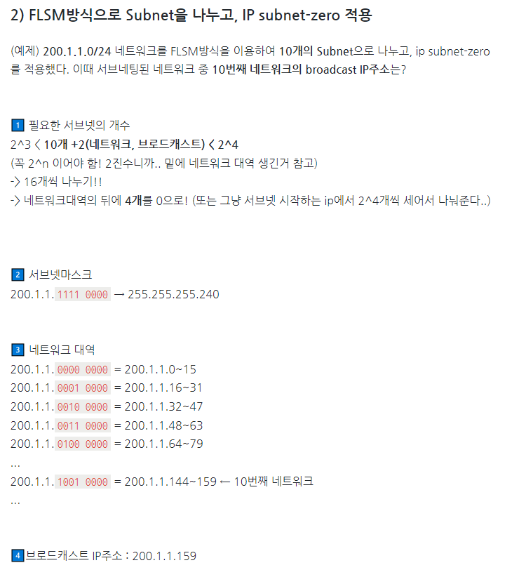

77/100
# 1. 소프트웨어 설계
### 1. ⭐ 미들웨어 솔루션 유형
#### DB (Database)
- 클라이언트에서 원격에 DB와 연결하기 위한 미들웨어
- 2-Tier 아키텍처
- MS의 ODBC, 볼랜드의 IDAPI, 오라클의 Glue

#### RPC (Remote Procedure Call)
- 원격 프로시저를 로컬 유스케이스 호출하는 방식
- 이큐브시스템스의 Entera, OSF의 ONC/RPC

#### MOM (Message Oriented Middleware)
- 메시지 기반의 비동기형 메시지를 전달하는 방식
- 분산 데이터 시스템의 데이터 동기를 위해 많이 사용
- 서로 다른 플랫폼에서 독립적으로 실행되는 소프트웨어 간의 상호작용을 통해 하나의 통합된 시스템처럼 동작되도록 함
- IBM의 MQ, 오라클의 Message Q, JCP의 JMS

#### TP-Monitor (Transaction Processing Monitor)
- 항공기나 철도 예약 업무 등과 같은 온라인 트랜잭션 업무에서 트랜잭션을 처리 및 감시하는 미들웨어
- 사용자 수가 증가해도 빠른 응답 속도를 유지해야 하는 업무에서 주로 사용
- 오라클의 tuxedo, 티맥스소프트의 tmax

#### ORB (Object Request Broker)
- 객체지향 미들웨어로 코바(CORBA) 표준 스펙을 구현한 미들웨어
- TP-Monitor의 장점인 트랜잭션 처리와 모니터링 등을 추가로 구현
- Micro Focus의 Orbix, OMG의 CORBA

#### WAS (Web Application Server)
- 정적인 콘텐츠를 처리하는 웹 서버와 달리 사용자의 요구에 따라 변하는 동적인 콘텐츠를 처리하기 위해 사용되는 미들웨어
- 클라이언트/서버 환경보다는 웹 환경을 구현하기 위한 미들웨어
- HTTP 세션 처리를 위한 웹서버 기능뿐 아니라 미션-크리티컬한 기업 업무까지 JAVA, EJB 컴포넌트 기반으로 구현 가능
- 오라클의 WebLogic, IBM의 WebSphere

### 2. 협약 (Contract)에 의한 설계
- 선행조건 (Precondition) : 오퍼레이션이 호출되기 전에 참이 되어야할 조건
- 결과조건 (Postcondition) : 오퍼레이션이 수행된 후 만족되어야 할 조건
- 불변조건 (Invariant) : 오퍼레이션이 실행되는 동안 항상 만족되어야할 조건

### 3. 일반화(Generalization) 관계
- 하나의 사물이 다른 사물에 비해 더 일반적인지 구체적인지 표현
- 구체적(하위)사물에서 일반적(상위) 사물쪽으로 속이 빈 화살표 연결

 

**💡 예제** 

- 아메리카노와 에스프레소는 커피이다.
- 커피에는 아메리카노와 에스프레소가 있다.

### 실체화(Realization) 관계
- 사물이 할 수 있거나 해야 하는 기능(오퍼레이션, 인터페이스)으로 서로를 그룹화 할 수 있는 관계를 표현
- 사물에서 기능 쪽으로 속이 빈 점선 화살표 연결

 

**💡 예제** 

- 비행기는 날 수 있고 새도 날 수 있다.
- 비행기와 새는 날 수 있다는 행위로 그룹화할 수 있다.

### 4. 요구사항 분석을 위한 CASE (자동화 도구)
- 요구사항을 자동으로 분석, 요구사항 명세서를 기술하도록 개발된 도구
- 소프트웨어 개발 과정의 일부 또는 전체를 자동화하기 위한 도구
- 표준화된 개발 환경 구축 및 문서 자동화 기능을 제공
- 작업 과정 및 데이터 공유를 통해 작업자간 커뮤니케이션을 증대
- 도구사용 이점
    - 문서화 품질 개선
    - 분석자들 간의 적절한 조절
    - 보고서의 결함, 생략, 불일치 등의 발견 용이성
    - 추적의 용이성
    - 유지보수 비용의 축소

### 5. 인터페이스 요구사항 검토 방법
- 리팩토링 : 작성자 이외의 전문 검토 그룹이 요구사항 명세서를 상세히 조사하여 결함, 표준 위배, 문제점 들을 파악
- 인스펙션 : 자동화된 요구 사항 관리 도구를 이용하여 요구 사항 추적성과 일관성 검토
- CASE 도구 : 검토 자료를 회의 전에 배포해서 사전 검토한 후 짧은 시간 동안 검토 회의를 진행하면서 결함을 발견

# 2. 소프트웨어 개발
### 6. 순환 복잡도 (Cyclomatic Complexity) = 맥케이브 순환도(McCabe's Cyclomatic) = 맥케이브 복잡도 매트릭(McCabe's Complexity Metrics)
- 제어 흐름도(G)에서 순환 복잡도 V(G) = E - N + 2 (E: 화살표 수, N: 노드 수)

### 7. 알고리즘 설계 기법
- Divide and Conquer
- Greedy
- Backtracking

### 8. 형상관리 역할
- 형상관리를 통해 이전 리버전이나 버전에 대한 정보에 접근 가능하여 배포본 관리에 유용
- 불필요한 사용자의 소스 수정 제한
- 동일한 프로젝트에 대해 여러 개발자 동시 개발 가능

### 9. ⭐ 파티션의 종류
#### 1) 범위 분할 (Range Partitioning)
- 지정한 열의 값을 기준으로 범위를 지정하여 분할
- ex) 일별, 월별, 분기별

#### 2) 해시 분할 (Hash Partitioning)
- 해시 함수를 적용한 결과 값에 따라 데이터 분할
- 특정 파티션에 데이터가 집중되는 범위 분할의 단점을 보완
- 데이터를 고르게 분산할 때 유용
- 특정 데이터가 어디에 있는지 판단 불가
- 고객번호, 주민번호 등과 같은 데이터가 고른 컬럼에 효과적

#### 3) 조합 분할 (Composite Partitioning)
- 범위 분할로 분할한 다음 해시 함수를 적용하여 다시 분할하는 방식
- 범위 분할한 파티션이 너무 커서 관리가 어려울 때 유용

#### 4) 목록 분할 (List Partitioning)
- 지정한 열 값에 대한 목록을 만들어 이를 기준으로 분할
- ex) '국가'라는 열에 '한국', '미국', '일본'이 있는 경우 '미국'을 제외할 목적으로 '아시아'라는 목록을 만들어 분할함

#### 5) 라운드 로빈 분할 (Round Robin Partitioning)
- 레코드를 균일하게 분배하는 방식
- 각 레코드가 순차적으로 분배되며, 기본키가 불필요

### 10. 인수 테스트 (Accrptance Test)
- 사용자 인수 테스트
- 운영상의 인수 테스트
- 계약 인수 테스트
- 규정 인수 테스트
- 알파 테스트
- 베타 테스트 = 필드 테스팅(Field Testing)

# 3. 데이터베이스 구축
### 11. 즉각 갱신 기법
- 로그(log)를 필요로하는 회복 기법

### 12. 관계대수
- 순수 관계 연산자 : Select, Project, Join, Division
- 일반 집합 연산자 : UNION(합집합), INTERSECTION(교집합), DIFFERENCE(차집합), CARTESIAN PRODUCT(교차곱)

# 4. 프로그래밍 언어 활용
### 13. FLSM

# 5. 정보시스템 구축관리
### 14. 기능 점수(FP; Function Point) 모형
💡 기능별 가중치

### 15. 개인키 암호화 기법
- 블록 암호화 방식
    - DES
    - SEED
    - AED
    - ARIA
    - IDEA
- 스트림 암호화 방식
    - LFSR
    - RC4

### 16. Mesh Network
- 기존 무선 랜의 한계 극복을 위해 등장
- 대규모 디바이스의 네트워크 생성에 최적화되어 차세대 이동통신, 홈 네트워킹, 공공 안전 등의 특수목적을 위한 새로운 방식의 네트워크 기술

### 17. DDoS
- 공격방법 : Tribe Flood Network

### 18. 소프트웨어 재사용 방법
- 합성 중심 : 전자 칩과 같은 소프트웨어 부품, 즉 블록(모듈)을 만들어서 끼워 맞추는 방법

### 19. SPICE (Software Process Improvement and Capability dEtermination, 소프트웨어 처리 개선 및 능력 평가 기준) = ISO/IEC 155504
- 정보 시스템 분야에서 소프트웨어의 품질 및 생산성 향상을 위해 소프트웨어 프로세스를 편가 및 개선하는 국제 표준
- SPICE의 목적
    - 프로세스 개선을 위해 개발 기관이 스스로 평가하는 것
    - 기관에서 지정한 요구조건의 만족여부를 개발 조직이 스스로 평가하는 것
    - 계약 체결을 위해 수탁 기관의 프로세스를 평가하는 것
- 5개의 프로세스 범주와 40개의 세부 프로세스로 구성

### 20. Secure SDLC (Secure Software Development Life Cycle)
- 보안상 안전한 소프트웨어를 개발하기 위해 SDLC에 보안 강화를 위함 프로세스를 포함하는 것
    - SDLC : 소프트웨어 개발 생명주기
- 소프트웨어의 유지보수 단계에서 보안 이슈를 해결하기 위해 소모되는 많은 비용을 최소화하기 위해 등장
- 요구사항 분석, 설계, 구현, 테스트, 유지 보수 등 SDLC 전체 단계에 걸쳐 수행되어야 할 보안 활동 제기

💡 Secure SDLC의 대표적인 방법론
#### 1) SLASP
- Secure Software 사에서 개발
- SDLC의 초기 단계에서 보안을 강화하기 위해 개발된 방법론
- 활동 중심, 역할 기반의 프로세스로 구성
- 현재 운용 중인 시스템에 적용하기에 적합

#### 2) SDL
- 마이크로소프트 사에서 안전한 소프트웨어 개발을 위해 기존의 SDLC를 개선한 방법론
- 전통적인 나선현 모델을 기반

### 3) Seven Touchpoints
- 소프트웨어 보안의 모범사례를 SDLC에 통합한 방법론
- 설계 및 개발 과정의 모든 산출물에 대해 위험 분석 및 테스트 수행
- SDLC의 각 단계에 관련된 7개의 보안 강화 활동을 수행