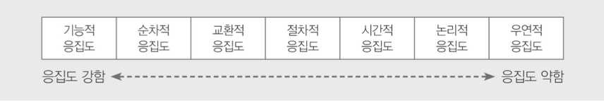

# 3. 애플리케이션 설계
## 021. ⭐ 소프트웨어 아키텍처
- 소프트웨어의 골격이 되는 기본 구조
- 구성하는 요소들 간의 관계를 표현하는 시스템의 구조
- 이해관계자들의 의사소통 도구
- 좋은 품질 유지
- 비기능적 요구사항 : 나타난 제약 반영
- 기능적 요구사항 : 구현하는 방법을 찾는 해결과정
- 애플리케이션 분할 방법과 분할된 모듈에 할당될 기능, 모듈 간의 인터페이스 결정
- 모듈화, 추상화, 단계적 분해, 정보은닉

> 💡 상위설계 & 하위설계
> |-|상위설계|하위설계|
> |---|---|---|
> |별칭|아키텍처 설계, 예비 설계|모듈 설계, 상세 설계|
> |설계 대상|시스템의 전체적인 구조|시스템의 내부 구조 및 행위|
> |세부 목록|구조, DB, 인터페이스|컴포넌트, 자료구조, 알고리즘|

### 모듈화 (Modularity)
- 프로젝트 재사용성 향상
- 너무 작게 나누면 개수가 많아져 모듈 간 통합 비용 多
- 너무 크게 나누면 개수가 적어 통합 비용은 적게 들지만 노듈 하나의 개발 비용 多
- 기능의 분리 가능, 인터페이스 단순
- 프로그램의 효율적인 관리 가능, 오류 파급효과 최소화

### 추상화 (Abstraction)
- 전체적이고 포괄적인 개념 설계 후 차례로 세분화해 구체화시켜 나가는 것
- 최소 비용으로 실제 상황 대처, 시스템 구조 및 구성 파악

> 💡 추상화 유형
> - 과정 추상화 : 전반적인 흐름만 파악할 수 있게 설계
> - 데이터 추상화 : 데이터 구조를 대표할 수 있는 표현으로 대체하는 방법
> - 제어 추상화 : 대표할 수 있는 표현으로 대체하는 방법

### 단계적 분해 (Stepwise Refinement)
- 하향식 설계 전략
    - 상위의 중요 개념으로부터 하위의 개념으로 구체화 시키는 분할 기법
- 추상화의 반복에 의해 세분화
- 점차적으로 구체화, 알고리즘, 자료 구조 등 상세 내역은 가능한 뒤로 미루어 진행

### 정보 은닉 (Information Hiding)
- 절차와 자료들의 정보가 감추어져 다른 모듈이 접근하거나 변경하지 못하도록 하는 기법
- 정보 은닉된 모듈과 커뮤니케이션할 필요가 있을 때는 반드시 필요한 정보만 인터페이스를 통해 교환
- 모듈을 독립적으로 수행
    - 하나의 모듈이 변경되더라도 다른 모듈에 영향을 주지 않으므로 수정, 시험, 유지보수 용이

### 소프트웨어 아키텍처의 품질 속성
- 품질 평가 요소 구체화

#### 1) 시스템 측면
- 성능 : 적절하고 빠르게 처리
- 보안 : 허용된 접근에 적절한 서비스 제공
- 가용성 : 장애없이 정상적으로 서비스 제공
- 기능성 : 요구한 기능 만족스럽게 구현
- 사용성 : 명확하고 편리하게 구현
- 변경 용이성 : 다른 플랫폼에서도 동작할 수 있도록 구현
- 확장성
- 기타 속성 : 테스트 용이성, 배치성, 안정성

#### 2) 비즈니스 측면
- 시장 적시성 : 정해진 시간에 프로그램 출시
- 비용과 혜택 : 유연성이 떨어지는 경우 유비조수에 많은 비용 소모
- 예상 시스템 수명 : 수명이 길어야 한다면 '변경용이성', '확장성' 중요
- 기타 속성 : 목표 시장, 공개 일정, 기존 시스템과 통합

#### 3) 아키텍처 측면
- 개념적 무결성 : 구성요소들 간의 일관성 유지
- 정확성, 완결성 : 요구사항들의 제약사항들을 모두 충족시키는 것
- 구축 가능성 : 모듈 단위로 구분된 시스템을 적정하게 분배해 유연하게 일정 변경
- 기타 속성 : 변경성, 시험성, 적응성, 일치성, 대체성

### 소프트웨어 아키텍처 설계과정
> 설계 목표 설정 → 시스템 타입 결정 → 아키텍처 패턴 적용 → 서브시스템 구체화 → 검토

#### 시스템 타입
- 대화형 시스템 : 사용자 요구를 처리하고 반응하는 시스템
    - 온라인 쇼핑몰과 같은 대부분 웹 애플리케이션
- 이벤트 중심 시스템 : 외부 상태 변화에 동작하는 시스템
    - 전화, 비상벨 등의 내장 소프트웨어
- 변환형 시스템 : 데이터 입력되면 정해진 작업을 수행해 결과를 출력하는 시스템
    - 컴파일러, 네트워크 프로토콜
- 객체 연속형 시스템 : Database를 통해 파일을 효과적으로 저장, 검색, 갱신할 수 있는 시스템
    - 서버 관리 소프트웨어

#### 협약 (Contract)에 의한 설계
- 선행조건 (Precondition) : 오퍼레이션이 호출되기 전에 참이 되어야할 조건
- 결과조건 (Postcondition) : 오퍼레이션이 수행된 후 만족되어야 할 조건
- 불변조건 (Invariant) : 오퍼레이션이 실행되는 동안 항상 만족되어야할 조건

## 022. ⭐ 아키텍처 패턴
### 아키텍처 패턴 장점
- 시행착오 줄여 개발 시간 단축, 고품질의 소프트웨어 생산
- 안정적인 개발 가능
- 의사소통 간편
- 개발에 참여하지 않은 사람도 손쉽게 유지보수 수행 가능
- 개발 전 예측 가능

### 레이어 패턴 (Layers pattern)
- 계층으로 구분하여 구성, 고정적인 방법
- 각 서브 시스템들이 계층 구조를 이룸
    - 하위 계층은 상위 계층에 대한 서비스 제공자
    - 상위 계층은 하위 계측의 클라이언트
- 서로 마주보는 두 개 계층 사이에서만 상호작용
    - 변경 작업 용이
- 특정 계층만 교체해 시스템 개성 가능
- OSI 참조 모델

### 클라이언트-서버 패턴 (Client-Server pattern)
- 하나의 서버 컴포넌트와 다수의 클라이언트 컴포넌트로 구성
- 사용자는 클라이언트와만 의사소통
- 서버는 클라이언트 요청에 대비해 항상 대기 상태 유지
- 요청과 응답을 받기 위해 동기화되는 경우 제외하고 서로 독립적

### 파이프-필터 패턴 (Pipe-Filter Pattern)
- 데이터 스트림 절차의 각 단계를 필터 컴포넌트로 캡슐화하여 파이프를 통해 데이터를 전송
- 재사용성, 확장 용이
- 필터 컴포넌트를 재배치해 다양한 파이프라인 구축 가능
- 데이터 변환, 버퍼링, 동기화에 주로 사용
- 필터 간 데이터 이솓 시 데이터 변환으로 인해 오버헤드 발생
- UNIX의 쉘(Shell)

### 모델-뷰-컨트롤러 패턴 (Model-View-Controller pattern)
- 모델 : 데이터 보관
- 뷰 : 사용자에게 정보 표시
- 컨트롤러 : 변경 요청을 처리하기 위해 모델에게 명령을 보냄
- 각 부분은 별도의 컴포넌트로 분리되어 있으므로 서로 영향을 받지 않고 개별 작업 수행
- 한 개의 모델에 대해 여러 개의 뷰를 필요로 하는 대화형 애플리케이션에 적합

### 기타 패턴
- 마스터-슬레이브 패턴 (Master-Slave pattern)
    - 마스터 컴포넌트는 동일한 구조의 슬레이브 컴포넌트로 작업 분할 후, 슬레이브 컴포넌트에서 처리된 결과물을 다시 돌려받는 방식으로 작업을 수행하는 패턴
    - 장애 허용 시스템, 병렬 컴퓨팅 시스템
- 브로커 패턴 (Broker pattern)
    - 사용자가 원하는 서비스와 특정을 브로커 컴포넌트에 요청하면 브로커 컴포넌트가 요청에 맞는 컴포넌트와 사용자를 연결
    - 원격 서비스, 분산 환경 시스템
- 피어-투-피어 패턴 (Peer-To-Peer pattern)
    - 피어를 하나의 컴포넌트로 간주하며, 각 피어는 서비스를 호출하는 클라이언트가 될 수도, 서비스를 제고하는 서버가 될 수도 있는 패턴
    - 멀티 스레딩 방식 사용
- 이벤트-버스 패턴 (Event-Bus pattern)
    - 소스가 특정 채널에 이벤트 메시지를 발행하면, 해당 채널을 구독한 리스너들이 메시지를 받아 이벤트를 처리하는 방식
    - 이벤트를 생서하는 소스(Source)
    - 이벤트를 수행하는 리스너(Listener)
    - 이벤트 통로인 채널(Channel)
    - 채널을 관리하는 버스(Bus)
- 블랙보드 패턴 (Blackboard pattern)
    - 모든 컴포넌트들이 공유 데이터 저장소와 블랙보드 컴포넌트에 접근이 가능한 형태
    - 컴포넌트들은 검색을 통해 블랙보드에서 원하는 데이터를 찾을 수 있음
    - 해결책이 명확하지 않은 문제를 처리하는데 유용한 패턴
    - 음성 인식, 차량 식별, 신호 해석
- 인터프리터 패턴 (Interpreter pattern)
    - 프로그램 코드의 각 라인을 수행하는 방법을 지정하고, 기호마다 클래스를 갖도록 구성
    - 특정 언어로 작성된 프로그램 코드를 해석하는 컴포넌트를 설계할 때 사용

## 023. ⭐ 객체지향 (Object-Oriented)
- 개체(Entity)를 하나의 객체(Object)로 만들어 작성
- 구조적 기법의 문제점의 해결책으로 채택
    - 유지보수 고려하지 않고 개발공정에만 집중
    - 개발 이후, 추가 요구사항 대응 어려움
    - 재사용 불가해 유사 소프트웨어 개발 시 시간과 인력 소모
- 복잡한 구조를 단계적 · 계층적으로 표현
- 멀티미디어 데이터 및 병렬처리 지원
- 사용자와 개발자가 쉽게 이해
- 객체, 클래스, 캡슐화, 상속, 다형성, 연관성

### 객체 (Object)
- 데이터와 데이터를 처리하는 함수를 묶어 놓은 하나의 모듈
- 데이터 : 속성(Attribute), 상태, 변수, 상수, 자료 구조
- 함수 : 메소드(Method), 서비스(Service), 동작(Operation), 연산
- 객체의 메소드는 다른 객체로부터 메시지를 받았을 때 정해진 기능을 수행

#### 객체 특성
- 독립적으로 식별 가능한 이름을 가지고 있다.
- 객체가 가질 수 있는 조건 = 상태(State) → 시간에 따라 변함
- 객체 간 상호 연관성에 의한 관계가 형성됨
- 객체가 반응할 수 있는 메시지의 집합을 행위 → 객체는 행위의 특징
- 일정한 기억장소

### 클래스 (Class)
- 공통된 속성과 연산(행위)를 갖는 객체의 집합 → 일반적인 타입(Type)을 의미
- 객체들이 갖는 속성과 연상을 종의하고 있는 틀
- 데이터를 추상화하는 단위
- 각 객체를 인스턴스(Instance)
- 클래스로부터 새로운 객체를 생성하는 것을 인스턴스화(Instantiation)
- 동일 클래스에 속한 객체들은 공통된 속성과 행위를 가지고 있으며, 속성에 대한 정보가 달라서 동일 기능을 하는 여러가지 객체를 나타냄

### 캡슐화 (Encapsulation)
- 데이터(속성)와 데이터를 처리하는 함수를 하나로 묶는 것
- 인터페이스를 제외한 세부 내용이 은폐(정보 은닉)되어 외부에서 접근이 제한적 → 외부 모듈 변경으로 인한 파급효과가 적음
- 재사용이 용이
- 인터페이스가 단순해지고, 객체 간의 결합도가 낮아짐

### 상속 (Inheritance)
- 이미 정의된 상위 클래스의 모든 속성과 연산을 하위 클래스가 물려받는 것
- 하위 클래스는 다시 정의하지 않고 즉시 자신의 속성으로 사용 가능
- 상속받은 속성과 연산 외에 새로운 속성과 연산을 첨가해 사용 가능
- 재사용을 높이는 중요한 개념
> 💡다중 상속(Multiple Inheritance) : 두 개 이상의 상위 클래스를 상속받는 것

### 다형성 (Polymorphism)
- 하나의 메시지에 대해 여러가지 형태의 응답이 존재
- 하나의 함수나 연산자가 두 개 이상의 서로 다른 클래스의 인스턴스들을 같은 클래스에 속한 인스턴스처럼 수행할 수 있도록 하는 것
- 오버로딩(Overloading) : 동일 메소드명, 다른 매개변수
- 오버라이딩(Overriding) : 메소드 재정의

### 연관성 (Relationship)
- 두 개 이상 객체(클래스)들이 상호 참조하는 관계

|종류|의미|특징|
|---|---|---|
|is member of|연관화(Association)|2개 이상의 객체가 상호 관련되어있음을 의미|
|is instance of|분류화(Classification)|동일한 형의 특성을 갖틑 객체들을 모아 구성하는 것|
|is part of|집단화(Aggregation)|관련 있는 객체들을 묶어 하나의 상위 객체를 구성하는 것|
|is a|일반화(Generalization)|공통적인 성질들로 추상화한 상위 객체를 구성하는 것|
|is a|특수화/상세화(Specialization)|상위 객체를 구체화하여 하위 객체를 구성하는 것|

## 024. ⭐ 객체지향 분석 및 설계
### 객체지향 분석 (OOA; Object Oriented Analysis)
- 사용자 요구사항 분석해 요구된 문제와 관련된 모든 클래스(객체), 이와 연관된 속성과 연산, 그들 간ㄴ의 관계 등을 정의하여 모델링하는 작업
- 객체와 속성, 클래스와 멤버, 전체와 부분 등으로 나누어서 분석
- 객체는 클래스로부터 인스턴스화되고, 클래스를 식별하는 것이 객체지향 분석의 주요한 목적

### 객체지향 분석 방법론
#### 1) Rumbaugh(럼바우) 방법
- 가장 일반적인 방법
- 객체모델, 동적모델, 기능모델로 나누어 수행
#### 2) Booch(부치) 방법
- 미시적(Micro) 개발 프로세스와 거시적(Macro) 개발 프로세스를 모두 사용
- 클래스와 객체들을 분석 및 식별하고 클래스의 속성과 연산을 정의
#### 3) Jacobson 방법
- Use Case를 강조
#### 4) Coad와 Yourdon 방법
- E-R다이어그램을 가용해 객체의 행위를 모델링하며, 객체식별, 구조식별, 주제정의, 속성과 인스턴스연결정의, 연산과 메시지 연결정의 과정으로 구성
#### 5) Wirfs-Brock 방법
- 분석과 설계간의 구분 X
- 고객 명세서를 평가해 설계작업까지 연속적으로 수행하는 기법

### Rumbaugh 기법 = 객체모델링 기법(OMT; Object-Modeling Technique)
- 모든 소프트웨어 구성 요소를 그래픽 표기법을 이용해 모델링
> **객체 모델링 → 동적 모델링 → 기능 모델링**
#### 1. 객체 모델링 (Object Modeling) = 정보 모델링
- 요구되는 객체를 찾아내 속성과 연산 식별 및 객체들 간의 관계를 규정하여 객체 다이어그램으로 표시
#### 2. 동적 모델링 (Dynamic Modeling)
- 상태 다이어그램을 이용해 시간의 흐름에 따른 객체들 간의 제어흐름, 상호작용, 동작순서 등의 동적인 행위를 표현
#### 3. 기능 모델링 (Functional Modeling)
- 자료 흐름도(DFD)를 이용해 다수의 프로세스들 간의 자료 흐름을 중심으로 처리과정을 표현

### 객체지향 설계 원칙 (SOLID)
1. 단일 책임 원칙 (SRP; Single Responsibility Principle)
- 객체는 단 하나의 책임만 가져야 한다는 원칙
- 응집도는 높고, 결합도는 낮게 설계
2. 개방-폐쇄 원칙 (OCP; Open-Closed Principle)
- 기존 코드를 변경하지 않고 기능을 추가할 수 있도록 설계
- 공통 인터페이스를 하나의 인터페이스로 묶어 캡슐화하는 방법
3. 리스코프 치원 원칙 (LSP; Liskov Substitution Principle)
- 자식 클래스는 최소한 자신의 부모 클래스에서 가능한 행위는 수행할 수 있어야 한다는 설계
- 자식 클래스는 재정의하지 않고 확장만 수행
4. 인터페이스 분리 원칙 (ISP; Interface Segregation Principle)
- 사용하지 않는 인터페이스와 의존관계를 맺거나 영향을 받지 않아야 한다는 원칙
- 인터페이스가 갖는 하나의 책임
- 클라이언트는 자신이 사용하지 않는 메서드와 의존관계를 맺으면 안됨
- 클라이언트가 사용하지 않는 인터페이스 때문에 영향을 받아서는 안됨
5. 의존 역전 원칙 (DIP; Dependency Inversion Principle)
- 각 객체들 간의 의존관계가 성립될 때, 추상성이 낮은 클래스보다 추상성이 높은 클래스와 의존관계를 맺어야 한다는 원칙
- 일반적으로 인터페이스를 활용하면 이 원칙은 준수 됨

## 025. ⭐ 모듈 (Module)
- 분리됨 시스텝의 기능들
- 서브루틴, 서브시스템, 작업 단위 등 같은 의미로 사용
- 단독으로 컴파일 가능, 재사용 가능
- 각 모듈은 서로 독립됨
    - 하나의 기능만을 수행하고 다른 모듈과의 과도한 상호작용 배체
- 독립성이 높을수록 수정 시, 다른 모듈에게 거의 영향이 미치지 않으며, 오류가 발생해도 쉽게 발견하고 해결 가능
- 독립성 = 결합도↓ + 응집도↑ + 모듈의 크기 작게

### 결합도 (Coupling)
- 모듈 간에 상호 의존하는 정도 / 모듈 간의 연관관계
- 결합도가 약할수록 품질이 높고, 강할수록 품직이 낮음
- 결합도가 강하면 시스템 구현 및 유지보수 작업이 어려움

#### 1) 자료 결합도 (Data Coupling)
- 모듈 간 인터페이스가 자료 요소로만 구성될 때
- 모듈이 다른 모듈을 호출하면서 매개변수로 데이터를 넘겨주고, 결과를 다시 돌려주는 방식
- 모듈의 내용을 변경하더라도 다른 모듈에 전혀 영향을 미치지 않는 가장 바람직한 결합도
#### 2) 스탬프(검인) 결합도 (Stamp Coupling)
- 모듈 간 인터페이스로 배열이나 레코드 등의 자료 구조가 전달될 때
- 두 모듈이 동일한 자료 구조를 조회하는 경우
- 자료 구조의 변화(포맷이나 구조 변화) 조회하는 모든 모듈 및 변화되는 필드를 실제로 조회하지 않는 모듈에까지도 영향을 미침
#### 3) 제어 결합도 (Control Coupling)
- 모듈이 다른 모듈 내부의 논리적인 흐름을 제어하기 위해 제어 신호를 이용하여 통신하거나 제어요소(Function Code, Switch, Tag, Flag)를 전달
- 모듈이 다른 모듈의 상세한 처리 절차를 알고 있어 이를 통제하는 경우
- 처리 기능이 두 모듈에 분리되어 설계된 경우
#### 4) 외부 결합도 (External Coupling)
- 모듈에 선언된 데이터(변수)를 외부의 다른 모듈에서 참조할 때
- 참조되는 데이터의 범위를 각 모듈에서 제한
#### 5) 공통(공유) 결합도 (Common Coupling)
- 공통 데이터 영역을 여러 모듈이 사용할 때
- 내용을 조금만 변경하더라도 이를 사용하는 모든 모듈에 영향을 미치므로 모듈의 독립성을 약하게 만든다.
#### 6) 내용 결합도 (Content Coupling)
- 모듈이 다른 모듈의 내부 기능 및 내부 자료를 직접 참조하거나 수정할 때
- 모듈에서 다른 모듈의 내부로 제어가 이동하는 경우에도 내용 결합도에 해당

### 응집도 (Cohesion)
- 정보은닉 개념을 확장한 것
- 명령어나 호출문 등 모듈의 내부요소들의 서로 관련되어 있는 정도
- 모듈이 족립적인 기능으로 정의되어 있는 정도
- 응집도가 강할수록 품질이 높고, 약할수록 품질이 낮다.

#### 1) 우연적 응집도 (Coincidental Cohesion)
- 모듈 내부의 각 구성요소들이 서로 관련 없는 요소로만 구성된 경우
#### 2) 논리적 응집도 (Logical Cohesion)
- 유사한 성격을 갖거나 특정 형태로 분류되는 처리 요소들로 하나의 모듈이 형성되는 경우
#### 3) 시간적 응집도 (Temporal Cohesion)
- 특정 시간에 처리되는 몇 개의 기능을 모아 하나의 모듈로 작성할 경우
#### 4) 절차적 응집도 (Procedural Cohesion)
- 모듈이 다수의 관련 기능을 가질 때, 모듈 안의 구성 요소들이 그 기능을 순차적으로 수행할 경우
#### 5) 교환(통신)적 응집도 (Communication Cohesion)
- 동일한 입력과 출력을 사용해 서로 다른 기능을 수행하는 구성 요소들이 모였을 경우
#### 6) 순차적 응집도 (Sequential Cohesion)
- 모듈 내 하나의 활동으로부터 나온 출력 데이터를 그 다음 활동의 입력 데이터로 사용할 경우
#### 7) 기능적 응집도 (Functional Cohesion)
- 모듈 내부의 모든 기능 요소들이 단일 문제와 연관되어 수행될 경우

### 팬인(Fan-In) / 팬아웃(Fan-Out)
- 팬인 : 모듈을 제어(호출)하는 모듈의 수
- 팬아웃 : 모듈에 의해 제어(호출)되는 모듈의 수
- 시스템의 복잡도 파악 가능
- 팬인이 높음
    - 재사용 측면에서 설계가 잘되었음
    - 단일 장애점이 발생할 수 있으므로 중점적인 관리 및 테스트 필요
        
        > 💡 단일장애점  
        > &emsp;&nbsp;시스템 구성요소 중 동작하지 않으면 전체 시스템이 중단되어 버리는 요소
- 팬아웃이 높음
    - 불필요하게 다른 모듈을 호출하고 있는지 검토
    - 단순화시킬 수 있는지 여부에 대한 검토
- 시스템 복잡도 최적화 = 팬인 ↑ + 팬아웃↓

### N-S차트 (Nassi-Schneiderman Chart)
- 연속, 선택, 다중 선택, 반복 등 제어 논리 구조 표현
- GOTO나 화살표 사용 X
- 조건이 복합되어 있는 곳의 처리를 시각적으로 명확히 식별하는데 적합
- 선택과 반복 구조를 시각적으로 표현
- 이해하기 쉽고, 코드 변환 용이
- 읽기는 쉽지만 작성하기 어려우며, 임의로 제어를 전이하는 것이 불가능
- 총체적인 구조표현과 인터페이스를 나타내기 어려움
- 단일 입구와 단일 출구로 표현
- 논리의 기술에 중점을 두고 도형을 이용한 표현 방법

## 026. ⭐ 공통 모듈
- 여러 프로그램에서 공통적으로 사용할 수 있는 모듈
- 자주 사용되는 계산식, 사용자 인증과 같은 기능들
- 재사용성 확보, 중복 개발 회피를 위해 설계과정에서 공통부분을 식별하고 명세를 작성할 필요가 있음

> 💡 공통 모듈 명세기법
> - 정확성(Correctness) : 해당 기능이 필요하다는 것을 알 수 있도록 정확히 작성
> - 명확성(Clarity) : 중의적으로 해적되지 않도록 명확하게 작성
> - 완전성(Completeness) : 모든 것을 기술
> - 일관성(Consistency) : 공통 기능들 간 상호 충돌이 발생하지 않도록 작성
> - 추적성(Traceability) : 요구사항 출처, 관련 시스템 들의 관계를 파악할 수 있도록 작성

### 재사용 (Reuse)
- 비용과 개발 시간을 절약하기 위해 이미 개발된 기능 파악, 재구성 하여 새로운 시스템 또는 기능 개발에 사용하기 적합하도록 최적화 시키는 작업
- 누구나 이해할 수 있고 사용이 가능하도록 사용법 공개
- 외부 모듈과 결합도↓, 응집도↑

> 💡 재사용 규모에 따른 분류
> - 함수와 객체 : 클래스나 메소드 단위의 소스 코드를 재사용
> - 컴포넌트 : 독립적인 업무, 기능을 수행하는 실행 코드 기반으로 작성된 모듈을 수정 없이 인터페이스를 통해 통신하는 방식으로 재사용
> - 애플리케이션 : 공통된 기능을 제공하는 애플리케이션을 공유하는 방식으로 재사용

### 효과적인 모듈 설계 방안
- 결합도는 줄이고 응집도는 높여 모듈의 독립성과 재상용성을 높임
- 모듈의 제어영역 안에서 영향영역을 유지
- 복잡도와 중복성을 줄이고 일관성을 유지
- 예측 가능해야하며 지나치게 제한적이어서는 안됨
- 유지보수 용이
- 시스템 전반적인 기능과 구조를 이해하기 쉬운 크기로 분해
- 하나의 입구와 하나의 출구
- 효과적인 제어를 위해 설계에서 계층적 자료 조직이 제시되어야 함
- 논리구조에 예기치 못한 영향을 끼치지 않도록 모듈 인터페이스 설계

## 027. ⭐ 코드
- 컴퓨터를 이용해 자료를 처리하는 과정에서 분류, 조합 및 집계를 용이하게 하고, 특정자료의 추출을 쉽게하기 위해 사용하는 기호
- 정보를 신속, 정확, 명료하게 전달
- 일정한 규칙에 따라 작성
- 정보 처리의 효율과 처리된 정보의 가치에 많은 영향

> 💡 코드의 주요기능
> - 식별 기능 : 데이터 간의 성격에 따라 구분 가능
> - 분류 기능 : 특정 기준이나 동일한 유형에 해당하는 데이터를 그룹화
> - 배열 기능 : 의미를 부여하여 나열
> - 표준화 기능 : 다양한 데이터를 기준에 맞추어 표현
> - 간소화 기능 : 복잡한 데이터를 간소화

### 코드 종류
- 순차 코드 (Sequence Code) = 일련번호 코드
    - 자료 발생 순서, 크기 순서 등 일정 기준에 따라 최초 자료부터 차례로 일련번호를 부여하는 방법
    - 1,2,3,4 ...
- 블록 코드 (Block Code) = 구분 코드
    - 공통성이 있는 것끼리 블록으로 구분, 각 블록 내에서 일련번호를 부여하는 방법
    - 1001~1100 : 총부무, 1101~1200 : 영업부
- 10진 코드 (Decimal Code) = 도서 분류식 코드
    - 0~9까지 10진 분할하고 다시 10진 분할하는 방법
    - 1000 : 공학, 1100 : 소프트웨어 공학, 1110 : 소프트웨어 설계
- 그룹 분류 코드 (Group Classification Code)
    - 대분류, 중분류, 소분류 구분하고 각 그룹 안에서 일련번호를 부여하는 방법
    - 1-01-001 : 본사-총무부-인사계, 2-01-001 : 지사-총무부-인사계
- 연상 코드 (Mnemonic Code)
    - 명칭이나 약호와 관계있는 숫자나 문자, 기호를 이용해 코드를 부여하는 방법
    - TV-40 : 40인치 TV, L-15-220 : 15W 200V의 램프
- 표의 숫자 코드 (Sifnificant Digit Code) = 유효 숫자 코드
    - 성질(길이, 넓이, 부피, 지름, 높이 등)의 물리적 수치를 그대로 코드에 적용시키는 방법
    - 120-720-1500 : 두께 X 폭 X 길이가 120 X 720 X 1500인 강판
- 합성 코드 (Combined Code)
    - 필요한 기능을 하나의 코드로 수행하기 어려운 경우 2개 이상의 코드를 조합하여 만드는 방법
    - 연상코드 + 숫자코드
        - KE-711 : 대한항공 811기, AC-253 : 에어캐나다 253기

### 코드 부여 체계
- 이름만으로 개체의 용도와 적용범위를 알 수 있도록 코드를 부여하는 방식
- 모듈이나 컴포넌트에 유일한 코드를 부여해 식별 및 추출에 용이하게 함
- 하나 이상의 코드를 조합하여 사용
- 코드 규칙을 상세하게 명시해야 함

## 028. ⭐ 디자인 패턴
- 모듈의 세분화된 역할이나 모듈 간의 인터페이스와 같은 코드를 작성하는 수준의 세부적인 구현 방안을 설계할 때 참조할 수 있는 전형적인 해결방법 또는 예제
- 문제 및 배경, 실제 적용된 사례, 재사용이 가능한 샘플코드 등으로 구성
- 개발 과정 중에 문제가 발생하면 새로 해결책을 구상하는 것보다 문제에 해당하는 디자인 패턴을 참고해 적용하는 것이 더 효율적
- 한 패턴을 변형하거나 특정 요구사항을 반영하면 유사한 형태의 다른 패턴으로 변화되는 특징 존재
- GoF(Gang of Four) : 생성패턴 5개, 구조패턴 7개, 행위패턴 11개

> 💡 아키텍처 패턴 VS 디자인 패턴
> - 아키텍처 패턴은 디자인 패턴보다 상위 수준 설계
> - 아키텍처 패턴 : 전체 시스템 구조를 설계
> - 다자인 패턴 : 서브 시스템에 속하는 컴포넌트들과 관계를 설계
> - 디자인 패턴은 아키텍처 패턴을 구현하는데 유용

### 디자인 패턴 장 · 단점
- 구조파악 용이
- 객체지향 설계 및 구현 생산성 높이는데 적합
- 재사용을 통해 개발 시간과 비용 절약
- 초기 투자 비용 부담
- 개발자 간 원활한 의사소통 가능
- 설계 변경 요청에 대한 유연한 대처 가능
- 객체지향을 기반으로 한 설계와 구현을 다루므로 다른 기반의 애플리케이션 개발에 적합하지 않음 (ex. 절차형 언어)

### 생성 패턴 (Creational Pattern)
객체의 생성과 참조과정을 캡슐화하여 객체가 생성되거나 변경되어도 프로그램 구조에 영향을 크게 받지 않도록 하여 프로그램에 유연성을 더해줌

1. 추상 팩토리 (Abstract Factory)
    - 구체적인 클래스에 의존하지 않음
    - 인터페이스를 통해 서로 연관 · 의존하는 객체들의 그룹으로 생성하여 추상적으로 표현
    - 연관된 서브 클래스를 묶어 한 번에 교체하는 것이 가능
2. 빌더 (Builder)
    - 작게 분리된 인스턴스를 조합하여 객체생성
    - 객체의 생성과정과 표현방법을 분리해 동일한 객체 생성에서도 서로 다른 결과를 만듦
3. 팩토리 메소드 (Factory Method) = 가상 생성자 패턴 (Virtual Constructor Pattern)
    - 객체 생성을 서브 클래스에서 처리하도록 분리하여 캡슐화한 패턴
    - 상위 클래스에서 인터페이스만 정의, 실제 생성을 서브 클래스가 담당
4. 프로토타입 (Prototype)
    - 원본 객체를 복제하는 방법으로 객체를 생성하는 패턴
    - 일반적인 방법
    - 비용이 큰 경우 이용
5. 싱글톤 (Singleton)
    - 하나의 객체를 생성하면 생성된 객체를 어디서든 참조할 수 있지만, 여러 프로세스가 동시에 참조할 수 없다.
    - 클래스 내에서 인스턴스가 하나뿐임을 보장
    - 불필요한 메모리 낭비 최소화

### 구조 패턴 (Structural Pattern)
클래스나 객체들을 조합해 더 큰 구조로 만들 수 있게 해주는 패턴으로 
구조가 복잡한 시스템을 개발하기 쉽게 도와줌

1. 어댑터 (Adapter)
    - 호환성이 없는 클래스들의 인터페이스를 다른 클래스가 이용할 수 있도록 변화해주는 패턴
    - 기존 클래스를 이용하고 싶지만 인터페이스가 일치하지 않을 때 이용
2. 브리지 (Bridge)
    - 구현부에서 추상층을 분리해 서로가 독립적으로 확장할 수 있도록 구성한 패턴
    - 기능과 구현을 두 개의 별도 클래스로 구현
3. 컴포지트 (Composite)
    - 여러 객체를 가진 복합 객체와 단일 객체를 구분없이 다루고자 할 때 사용하는 패턴
    - 객체들을 트리구조로 구성하여 복합객체 안에 복합객체가 포함되는 구조를 구현
4. 데코레이터 (Decorator)
    - 객체 간의 결합을 통해 능동적으로 기능들을 확장할 수 있는 패턴
    - 임의의 객체에 부가적인 기능을 추가하기 위해 다른 객체들을 덧붙이는 방식
5. 퍼싸드 (Facade)
    - 복잡한 서브 클래스들을 피해 더 상위에 인터페이스를 구성함으로써 서브 클래스들의 기능을 간편하게 사용할 수 있도록 하는 패턴
    - 서브 클래스 사이의 통합 인터페이스를 제공하는 Wrapper 객체가 필요
6. 플라이웨이트 (Flyweight)
    - 인스턴스가 필요할 때마다 매번 생성하는 것이 아니고 가능한 공유해서 사용함으로써 메모리를 절약하는 패턴
    - 다수 유사 객체를 생성하거자 조작할 때 유용
7. 프록시 (Proxy)
    - 접근이 어려운 객체와 연결하려는 객체 사이에서 인터페이스 역할을 수행하는 패턴
    - 네트워크 연결, 메모리의 대용량 객체로의 접근 등 주로 이용

### 행위 패턴 (Behavioral Pattern)
클래스나 객체들이 서로 상호작용하는 방법이나 책임 분배 방법을 정의하는 패턴으로 하나의 객체로 수행할 수 없는 작업을 여러 객체로 분배하면서 결합도를 최소화 할 수 있도록 도와줌

1. 책임 연쇄 (Chain of Responsibility)
    - 요청을 처리할 수 있는 객체가 둘 이상 존재해 객체가 처리하지 못하면 다음 객체로 넘어가는 형태의 패턴
    - 요청을 처리할 수 있는 객체들이 고리로 묶여있어 요청이 해결될 때까지 고리를 따라 책임이 넘어감
2. 커맨드 (Command)
    - 요청을 객체의 형태로 캡슐화하여 재이용하거나 취소할 수 있도록 요청에 필요한 정보를 저장하거나 로그에 남기는 패턴
    - 요청에 사용되는 각종 명령어들을 추상 클래스와 구체 클래스로 분리하여 단순화 함
3. 인터프리터 (Interpreter)
    - 언어에 문법 표현을 정의하는 패턴
    - SQL이나 통신 프로토콜과 같은 것을 개발할 때 사용
4. 반복자 (Iterator)
    - 자료 구조와 같이 접근이 잦은 객체에 대해 동일한 인터페이스를 사용하도록 하는 패턴
    - 내부 표현 방법의 노출없이 순차적인 접근 가능
5. 중재자 (Mediator)
    - 수많은 객체들 간의 복잡한 상호작용(Interface)을 캡슐화하여 객체로 정의하는 패턴
    - 객체 사이의 의존성을 줄여 결합도를 감소시킴
    - 객체 간의 통제와 지시의 역할을 수행
6. 메멘토 (Memento)
    - 특정 시점에서의 객체 내부 상태를 객체화함으로써 이후 요청에 따라 객체를 해당 시점의 상태로 돌릴 수 있는 기능을 제공하는 패턴
    - Ctrl + z와 가은 되돌리기 기능을 개발할 떄 주로 이용
7. 옵서버 (Observer)
    - 한 객체의 상태가 변화하면 객체의 상속되어 있는 다른 객체들에게 변화된 상태를 전달하는 패턴
    - 분산된 시스템 간에 이벤트를 생성 · 발행하고, 이를 수신해야할 때 이용
8. 상태 (State)
    - 객체의 상태에 따라 동일한 동작을 다르게 처리해야 할 때 사용하는 패턴
    - 객체 상채를 캡슐화하고 이를 참조하는 방식
9. 전략 (Strategy)
    - 동일한 계열의 알고리즘들을 개별적으로 캡슐화하여 상호교환할 수 있게 정의하는 패턴
    - 클라이언트는 독립적으로 원하는 알고리즘을 선택하여 사용할 수 있으며, 클라이언트에 영향없이 알고리즘의 변경 가능
10. 탬플릿 메소드 (Template Method)
    - 상위 클래스에서 골격을 정의하고, 하위 클래스에서 세부 처리를 구체화하는 구조의 패턴
    - 유사한 서브 클래스를 묶어 공통된 내용을 상위 클래스에서 정의함으로써 코드의 양을 줄이고 유지보수를 용이하게 해줌
11. 방문자 (Visitor)
    - 각 클래스들의 데이터 구조에서 처리 기능을 분리하여 별도의 클래스로 구성하는 패턴
    - 불리된 처리기능은 각 클래스를 방문하여 수행

 

# Reference
- 정보처리기사 필기 (시나공)