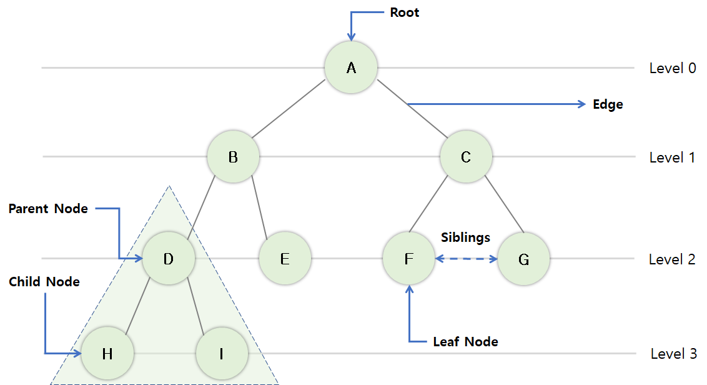
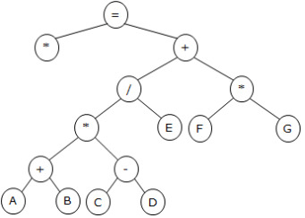
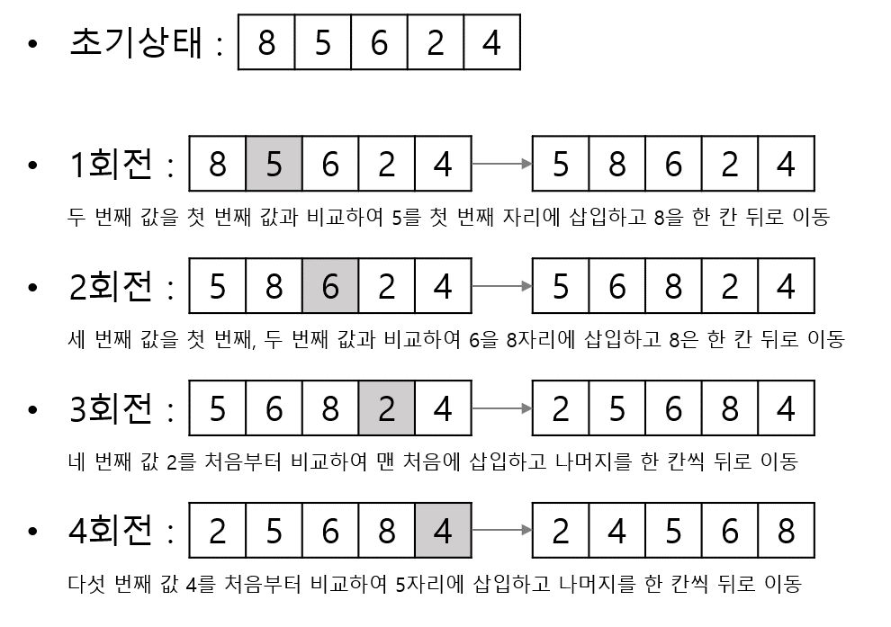
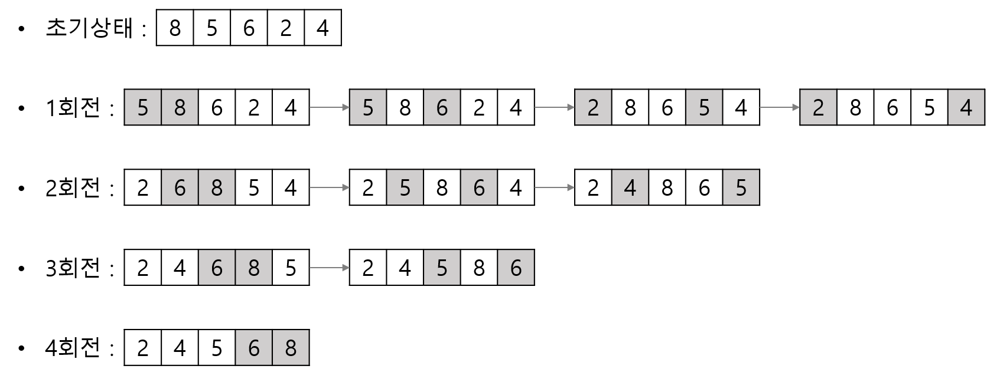
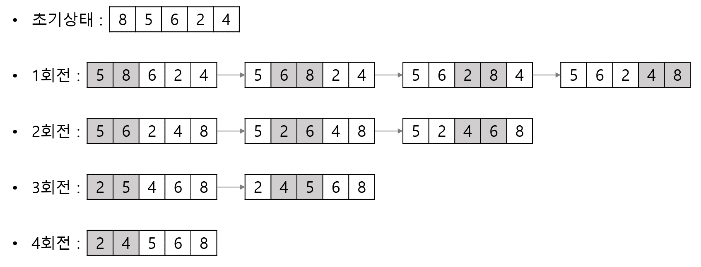
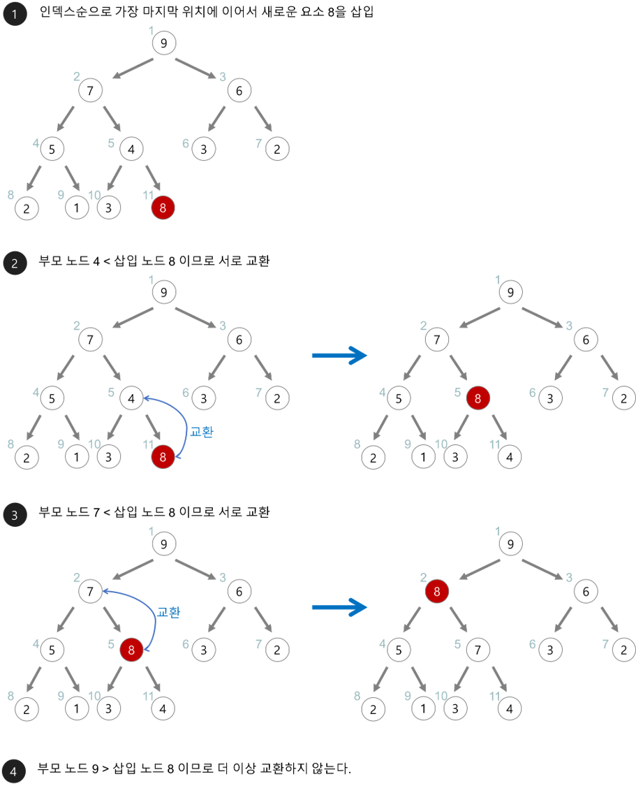
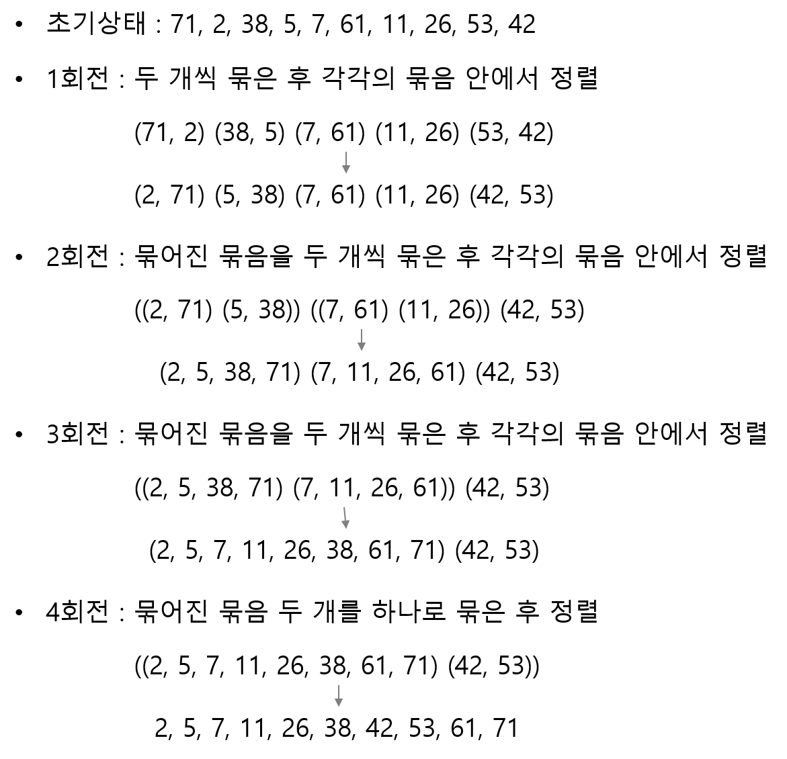
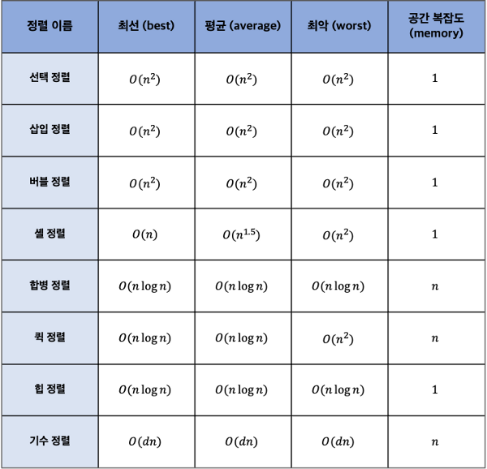

# 1. 데이터 입·출력 구현
## 036. ⭐ 자료구조
- 자료의 표현과 관련된 연산
- 자료들을 조직하고 구조화 하는 것
- 모든 연산 처리 가능
- 자료구조에 따라 프로그램 실행시간이 달라짐

### 자료구조의 분류
1. 선형 구조(Linear Structure)
- 배열(Array)
- 선형 리스트(Linear List)
    - 연속 리스트(Contiguous List)
    - 연결 리스트(Linked List)
- 스택(Stack)
- 큐(Queue)
- 데크(Deque)
2. 비선형 구조(Non-Linear Structure)
- 트리(Tree)
- 그래프(Graph)

###  배열 (Array)
- 동일한 자료형 데이터들이 같은 크기로 나열되어 순서를 갖는 집합
- 정적 자료구조
- 기억장소 추가 어려움. 데이터 삭제 시 빈공간으로 남아있어 메모리 낭비 발생
- 첨자를 이용해 데이터 접근
- 반복적인 데이터 처리 작업에 적합한 구조
- 첨자 개수에 따라 n차원 배열이라 칭함

### 선형 리스트 (Linear List)
- 일정한 순서에 의해 나열된 자료구조
- 배열을 이용한 연속 리스트 / 포인터를 이용한 연결 리스트

#### 1) 연속 리스트 (Contiguour List)
- 배열과 같이 연속되는 기억장소에 저장되는 자료구조
- 저장장소 이용 효율은 밀도가 1
- 중간에 데이터 삽입 시, 연속된 빈공간이 존재해야함
- 삽입 · 삭제 시 자료 이동 필요

#### 2) 연결 리스트 (Linked List)
- 연속적으로 배열시키지 않고 임의의 기억공간에 기억시키되, 자료 항목 순서에 따라 노드의 포인터 부분을 이용해 서로 연결시킨 자료구조
- 삽입 · 삭제 작업에 용이
- 연속적으로 놓여있지 않아도 저장 가능
- 연결을 위한 링크(포인터) 부분이 필요하기 때문에 이용 효율이 좋지 않음
- 포인터를 찾는시간이 필요하기 때문에 접근 속도가 느림
- 중간 노드 연결이 끊어지면 다음 노드 찾기 힘듦

### 스택 (Stack)
- 한쪽으로만 삽입 · 삭제 작업이 이루어지는 자료구조
- 후입선출(LIFO; Last In First Out)
- 스택 응용분야
    - 함수 호출 순서 제어
    - 인터럽트 처리
    - 수식 계산 및 수식 표기법
    - 컴파일러를 이용한 언어 번역
    - 부 프로그램 호출 시 복귀주소 저장
    - 서브루틴 호출 및 복귀 주소 저장
    - 재귀함수
    - DFS(Depth First Search) : 깊이 우선 탐색
- 오버플로(Overflow) : 공간이 꽉 채워져 있는 상태에서 데이터가 삽입
- 언더플로(Underflow) : 더 이상 삭제할 데이터가 없는 상태에서 데이터를 삭제
- Top : 가장 마지막으로 삽입된 자료가 기억된 위치 가리킴
- Bottom : 스택의 가장 밑바닥
- Push : 자료 삽입 (Overflow 체크)
- Pop : 자료 삭제 (Underflow 체크)

### 큐 (Queue)
- 한쪽에서는 삽입, 다른 한쪽에서는 삭제 작업이 이루어지는 자료구조
- 선입선출(FIFO; First In First Out)
- 시작과 끝을 표시하는 두개 포인터 존재
- Front 포인터 : 가장 먼저 삽입된 자료의 기억공간을 가리키는 포인터 (삭제 작업 시 사용)
- Rear 포인터 : 가장 마지막에 삽입된 자료가 위치한 기억 공간을 가리키는 포인터 (삽입 작업 시 사용)
- 큐 응용분야
    - 운영체제 작업 스케줄링
    - BFS(Breadth First Search) : 너비 우선 탐색

### 그래프 (Graph)
- 그래프(G)는 Vertex(V)와 Edge(E:간선)의 두 집합
- 간선의 방양성 유무에 따라 방향 그래프 / 무방향 그래프 구분
- 그래프 응용분야
    - 통신망(Network)
    - 교통망
    - 이항관계
    - 연립방정식
    - 유기화학 구조식
    - 무향선분 해법
- 트리(Tree)는 사이클이 없는 그래프(Graph)

> 💡 방향/무방향 그래프 최대 간선 수
> - 무방향 그래프 최대 간선 수 : n(n-1)/2
> - 방향 그래프 최대 간선 수 : n(n-1)

## 037. ⭐ 트리 (Tree)
- 정점(Node, 노드)과 선분(Branch, 가지)을 이용해 사이클을 이루지 않도록 구성한 그래프(Graph)의 특수한 형태
- 트리 응용분야
    - 가족의 계보(족보)
    - 조직도
- 트리 관련 용어
    
    - 노드(Node) : 자료 항목과 다른 항목에 대한 가지를 합친 것 (A, B, C, D, E, F, G, H, I, J)
    - 근 노드(Root Node) : 트리의 맨 위에 있는 노드 (A)
    - 디그리(Degree) : 각 노드에서 뻗어 나온 가지의 수 (A=2, B=2, E=1)
    - 단말 노드(Terminal Node) = 잎 노드(Leaf Node) : 자식이 하나도 없는 노드 = 디그리가 0인 노드 (F, G)
    - 자식 노드(Son Node) : 다음 레벨의 노드 (H, I의 부모 노드=D)
    - 부모 노드(Parent Node) : 이전 레벨의 노드 (D의 자식 노드=H, I)
    - 형제 노드(Brother Node, Sibling) : 동일한 부모를 갖는 노드 (H의 형제 노드=I)
    - 트리의 디그리 : 디그리 중 가장 많은 수 (2)

### 트리 운행법

1. Preorder 운행 : Root → Left → Right
2. Inorder 운행 : Left → Root → Right
3. Postorder 운행 : Left → Right → Root

### 수식 표기법

1. 전위 표기법(PreFix) : 연산자 → Left → Right (X + / * + A B - C D E * F G)
2. 중위 표기법(InFix) : Left → 연산자 → Right (X = A + B * C - D / E + F * G)
3. 후위 표기법(PostFix) : Left → Right → 연산자 (X A B + C D - * E / F G * + =)

## 038. ⭐ 정렬 (Sort)
### 삽입 정렬 (Insertion Sort)
이미 순서화된 파일에 새로운 하나의 레코드를 순서에 맞게 삽입시켜 정렬

### 쉘 정렬 (Shell Sort)
- Insertion Sort 확장
- **매개변수 값**으로 서브파일을 구성 → 각 서브파일을 Insertion 정렬방식으로 순서 배열하는 과정을 반복하는 정렬방식

### 선택 정렬 (Selection Sort)
n개 레코드 중 최소값을 찾아 첫 번째 레코드 위치에 놓고, 나머지 (n-1)개 중 다시 최소값을 찾아 두 번째 레코드 위치에 놓는 방식을 반복

### 버블 정렬 (Bubble Sort)
- 인접한 두 개의 레코드 키 값을 비교해 그 크기에 따라 레코드 위치를 서로 교환하는 정렬방식
- 정렬 여부를 플래그 비트(f)로 결정

### 퀵 정렬 (Quick Sort)
- 레코드의 많은 자료 이동을 없애고 하나의 파일을 부분적으로 나누어 가면서 정렬하는 방법
- 키를 기준으로 작은 값을 왼쪽, 큰 값을 오른쪽으로 분해시키는 방식으로 정렬
- 정렬 방식 중 가장 빠른 방식
- 위치에 관계없이 임의의 키를 분할 원소로 사용
- 프로그램에서 되부름을 이용하기 때문에 스택(Stack)이 필요
- 분할(Divide) : 기준값인 피봇(Pivot)을 중심으로 정렬한 자료들을 2개의 부분집합으로 나눔
- 정복(Conquer) : 부분집합의 원소들 중 피봇(Pivot)보다 작은 원소들은 왼쪽, 큰 원소들은 오른쪽 부분직합으로 정렬
- 부분집합의 크기가 더 이상 나누어질 수 없을 때까지 분할과 정복을 반복 수행

### 힙 정렬 (Heap Sort)
- 전이진 트리(Complete Binary Tree)를 이용한 정렬방식

### 2-Way 합병 정렬 (Merge Sort)
- 이미 정렬되어 있는 두 개의 파일을 한 개의 파일로 합병하는 정렬 방식
1. 두 개의 키들을 한 쌍으로 하여 각 쌍에 대하여 순서를 정함
2. 순서대로 정렬된 각 쌍의 키들을 합병하여 하나의 정렬된 서브리스트로 만듬
3. 위 과정에서 정렬된 서브리스트들을 하나의 정렬된 파일이 될 때까지 반복

### 기수 정렬 (Radix Sort) = Bucket Sort
- Queue를 이용해 자릿수(Digit)별로 정렬하는 방식
- 레코드의 키 값을 분석하여 같은 수 또는 같은 문자끼리 그 순서에 맞는 버킷에 분배하였다가 버킷의 순서대로 레코드를 꺼내어 정렬

### ⭐ 시간복잡도

## 039. ⭐ 검색 - 이분검색 / 해싱
### 이분검색 (Binary Search)
- 전체 파일을 두 개의 서브파일로 분리해가면서 Key 레코드를 검색
- 파일의 중간값과 비교하면서 검색을 반복
- 중간 레코드 번호 M = (F + L) / 2 (F:첫 번째, L:마지막)

### 해싱 (Hashing)
- 해시 테이블(Hash Table) 기억공간을 할당하고 해시 함수(Hash Function)을 이용해 레코드 키에 대한 해시 테이블 내의 홈 주소(Home Address)를 계산한 후 주어진 레코드를 해당 기억장소에 저장하고나 검색 작업을 수행하는 방식

#### 해시 테이블 (Hash Table)
- 레보드를 한 개 이상 보관할 수 있는 버킷들로 구성된 기억공간
- 버킷(Bucket)
    - 하나의 주소를 갖는 파일 구역
    - 버킷 크기는 같은 주소에 포함될 수 있는 레코드 수
- 슬롯(Slot)
    - 한 개의 레코드를 저장할 수 있는 공간
    - n개의 슬롯이 모여 하나의 버킷 형성
- Collision (충돌 현상)
    - 서로 다른 두 개 이상의 레코드가 같은 주소를 갖는 현상
- Synonym
    - 충돌로 인해 같은 Home Address를 갖는 레코드의 집합
- Overflow
    - 계산된 Home Address의 Bucket 내에 저장할 기억공간이 없는 상태
    - Bucket을 구성하는 Slot이 여러 개일 때 Collision은 발생해도 Overflow는 발생하지 않을 수 있음

#### 해싱 함수(Hashing Function)
- 제산법(Division)
    - 레코드 키(Key)를 해시 테이블(Hash Table)의 크기보다 큰 수 중에서 가장 작은 소수(Prime, Q)로 나눈 나머지를 홈 주소로 삼는 방식
    - h(K) = K mod Q
- 제곱법(Mid-Square)
    - 레코드 키 값(K)을 제곱한 후 그 중간 부분의 값을 홈 주소로 삼는 방식
- 폴딩법(Folding)
    - 레코드 키 값(K)을 여러 부분으로 나눈 후 각 부분의 값을 더하거나 XOR(베타적 논리합)한 값을 홈 주소로 삼는 방식
- 기수 변환법(Radix)
    - 키 숫자의 진수를 다른 진수로 변환시켜 주소 크기를 초과한 높은 자릿수는 절단하고, 이를 다시 주소 범위에 맞게 조장하는 방법
- 대수적 코딩법(Algebraic Coding)
    - 키 값을 이루고 있는 각 자리의 비트 수를 한 다항식의 계수로 간주
    - 다항식을 해시 테이블의 크기에 의해 정의된 다항식으로 나누어 얻은 나머지 다항식의 걔수를 홈 주소로 삼는 방식
- 숫자 분석법(Digit Analysis, 계수 분석법)
    - 키 값을 이루는 숫자의 분포를 분석하여 비교적 고른 자리를 필요한 만큼 택해서 홈 주소로 삼는 방식
- 무작위법(Random)
    - 난수(Random Number)를 발생시켜 나온 값을 홈 주소로 삼는 방식

## 040.데이터베이스 개요
- 데이터들을 논리적인 구조로 조직화하거나 물리적인 공간에 구축하는 것
- 논리 데이터 저장소 : 데이터 간의 연관성, 제약조건을 식별해 논리적인 구조로 조직화한 것
- 물리 데이터 저장소 : 논리 데이터 저장소에 저장된 데이터와 구조들을 하드웨어적인 저장장치에 저장한 것
- 논리 데이터 저장소를 거쳐 물리 데이터 저장소를 구축하는 과정 = 데이터베이스 구축과정

### 데이터베이스
- 여러 사람에 의해 **공동**으로 사용될 데이터를 중복을 배제하여 **통합**하고, 쉽게 접근하여 처리할 수 있도록 저장장치에 **저장**하여 항상 사용할 수 있도록 운영하는 **운영** 데이터
- 통합된 데이터(Integrated Data) : 자료 중복 베제
- 저장된 데이터(Stored Data) : 컴퓨터가 접근할 수 있는 저장매체에 저장된 자료
- 운영 데이터(Operational Data) : 조직의 고유한 업무를 수행하는 데 존재 가치가 확실하고 없어서는 안 될 반드시 필요한 자료
- 공용 데이터(Shared Data) : 여러 응용 시스템들이 공동으로 소유하고 유지하는 자료

### DBMS (DataBase Management System; 데이터베이스 관리 시스템)
- 사용자 요구에 따라 정보를 생성, 관리해주는 소프트웨어
- 데이터의 종속성, 중복성 문제 해결하기 위해 제안된 시스템
- 모든 응용 프로그램들이 DB를 공용할 수 있도록 관리
- DB 구성, 접근방법, 유지관리에 대한 모든 책임을 짐
- 정의 기능(Definition) : 데이터 타입, 구조 정의, 이용방식, 제약조건 명시
- 조작 기능(Manipulation) : CRUD
- 제어 기능(Control) : 데이터 무결성 유지, 보안을 유지하고 권한을 검사, 정확성을 유지하도록 병행제어

### DBMS 장 · 단점
- 장점
    - 논리적 · 물리적 독립성 보장
    - 중복을 피할 수 있어 기억공간 절약
    - 저장된 자료 공동 이용
    - 일관성 유지
    - 무결성 유지
    - 보안 유지
    - 데이터 표준화
    - 데이터 통합 관리
    - 최신 데이터 유지
    - 데이터 실시간 처리 가능
- 단점
    - DB 전문가 부족
    - 전산화 비용 증가
    - 대용량 디스크로 집중적인 Access로 과부하(Overhead) 발생
    - Backup과 Recovery 어려움
    - 시스템 복잡

### ⭐ 스키마
- DB 구조, 제약조건에 관한 전반적인 명세(Specification)를 기술(Description)한 메타데이터(Meta-Data)의 집합
- Entity, Attribute, Relationship 및 데이터 조작 시 데이터 값들이 갖는 제약조건 등에 관해 전반적으로 정의
- 외부 스키마
    - 사용자나 응용 프로그래머가 개인의 입장에서 필요로 하는 DB의 논리적 구조를 정의한 것
- 개념 스키마
    - DB 전체적인 논리적 구조
    - 필요로 하는 데이터를 종합한 조직 전체의 DB로 하나만 존재
    - 개체 간의 관계와 제약조건을 나타내고, DB 접근 권한, 보안 및 무결성 규칙에 관한 명세를저의
- 내부 스키마
    - 물리적 저장장치의 입장에서 본 DB구조
    - 실제 DB에 저장될 레코드의 형식을 정의, 저장 데이터 항목의 표현방법, 내부 레코드의 물리적 순서 등을 나타냄

## 041. 데이터 입 · 출력
- SQL를 사용해 데이터 조작의 모든 행위를 함
- 데이터 접속(Data Mapping) : 객체와 데이터를 연결하는 것
- 트랜잭션 : 하나의 논리적 기능을 수행하기 위한 작업의 단위 또는 한꺼번에 모두 수행되어야 할 일련의 연산들

### SQL (Structured Query Language)
- IBM SEQUEL에서 윻\래
- 관계대수와 관계해석을 기초로 한 혼합 데이터 언어
- 데이터 정의어(DDL), 데이터 조작어(DML), 데이터 제어어(DCL)로 구분

### 데이터 접속 (Data Mapping)
- SQL Mapping
    - 프로그래밍 코드 내 SQL을 직접 입력하여 DBMS의 데이터에 접속하는 기술
    - JDBC, ODBC, MyBatis
- ORM (Object-Relational Mapping)
    - 객체지향 프로그래밍의 객체(Object)와 관계형(Relational) DB의 데이터를 연결(Mapping)
    - JPA, Hibernate, Django

### 트랜잭션 (Transaction)
- DB 상태를 변화시키는 하나의 논리적 기능을 수행하기 위한 작업의 단위 또는 한꺼번에 모두 수행되어야 할 일련의 연산들
- TCL : COMMIT, ROLLBACK, SAVEPOINT

## 042. 절차형 SQL
- 프로그래밍 언어와 같이 연속적인 실행이나 분기, 반복 등의 제어가 가능한 SQL
- 일반적인 프로그래밍 언어에 비해 비효율적이지만 단일 SQL문장으로 처리하기 어려운 연속적인 작업을 처리하는데 적합
- 다양한 기능을 수행하는 저장 모듈 생성 가능
- DBMS 엔진에서 직접 실행되기 때문에 입 · 출력 패킷이 적은 편
- BEGIN ~ END 형식의 블록구조
- 프로시저(Procedure)   
    - 특정 기능을 수행하는 트랜잭션 언어
    - 호출을통해 실행되어 미리 저장해 놓은 SQL작업 수행
- 트리거(Trigger)
    - CRUD 등의 이벤트(Event)가 발생할 때마다 관련 작업이 자동으로 수행
- 사용자 정의 함수
    - 프로시저와 유사 = 일련의 작업을 연속적으로 처리
    - 종료 시 예약어 Return을 사용해 처리 결과를 **단일값**으로 반환

### 테스트와 디버깅
- 테스트를 통해 오류를 발견한 후 디버깅을 통해 오류가 발생한 소스 코드를 추적하며 수정
- 디버깅 : 적합성 여부를 검증
- 테스트 : 실행을 통해 결과를 확인
- 테스트 전에 구문오류(Syntax Error)나 참조 오류 존재 여부 확인
- SHOW 명령어로 메시지 상세히 확인하고 문제를 수정
- 디버깅을 통해 로직을 검증하고 결과를 통해 최종적으로 확인
- 실제 변화를 줄 수 있는 삽입, 변경 관련 SQL문은 주석으로 처리
- 출력문을 이용해 화면에 출력하여 확인

### 쿼리 성능 최적화
- 성능향상을 위해 SQL 최적화
- 최적화 하기 전 성능 측정 도구 APM을 사용해 최적화할 쿼리를 선정
- 최적화 할 쿼리에 대해 옵티마이저가 수립한 실행 계획을 검토하고 SQL코드와 인덱스를 재구성
    - 옵티마이저 : DBMS에 내장되어 작성된 SQL이 효율적으로 수행되도록 최적의 경로를 찾아주는 모듈

 

# Reference
- 정보처리기사 필기 (시나공)
- https://choidev-1.tistory.com/137
- https://ssangq.netlify.app/posts/data-structure-tree
- https://velog.io/@brian_kim/JavaScript-%ED%8A%B8%EB%A6%AC-%EC%88%9C%ED%9A%8C
- https://m.cafe.daum.net/charmgosi/RZtU/14?svc=cafeapi
- https://gmlwjd9405.github.io/2018/05/10/algorithm-heap-sort.html