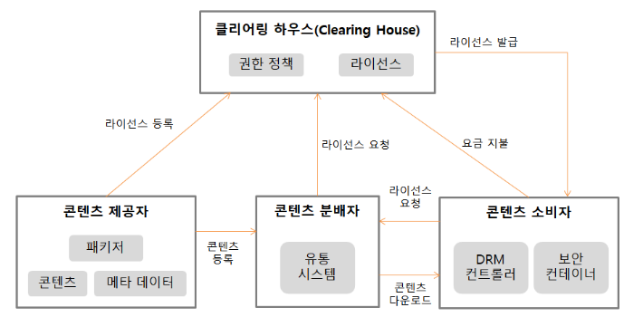

# 3. 제품 소프트웨어 패키징
## 046. ⭐ 소프트웨어 패키징
- 모듈별로 생성한 실행 파일들을 묶어 배포용 설치 파일을 만드는 것
- 개발자가 아닌 사용자 중심으로 진행
- 모듈화하여 패키징
- 다양한 환경에서 손쉽게 사용할 수 있도록 일반적인 배포 형태로 패키징

### 패키징 시 고려사항
- 운영체제(OS), CPU, 메모리 등 필요한 최소 환경 정의
- UI는 시작적인 자료와 함께 제공하고 매뉴얼과 일치시켜 패키징
- 하드웨어와 함게 관리될 수 있도록 Managed Service형태로 제공
- 내부 콘텐츠에 대한 암호화 및 보안을 고려
- 다른 여러 콘텐츠 및 단말기 간 DRM(디지털 저작권 관리) 연동을 고려
- 편의성을 위한 복잡성 및 비효율성 문제 고려
- 제품 소프트웨어 종류에 적합한 암호화 알고리즘 적용

### 패키징 작업 순서
- 개발 기법에 따라 달라짐
- 애자일 경우 2-4주 내 지정
- 각 주기가 끝날 때마다 패키징 수행
- 주기별 패키징한 결과물은 테스트 서버에 배포
- 최종 결과물은 고객이 사용할 수 있도록 온라인 or 오프라인으로 배포
    - 온라인 배포 : 별도로 마련한 운영서버에 설치 및 사용 매뉴얼과 함께 배포 파일을 등록하여 고객이 직접 다운받아 사용할 수 있도록 함
    - 오프라인 배포 : CD-ROM이나 DVD, USB 등 설치 및 사용 매뉴얼과 함께 배포 파일을 담음

1. 기능 식별 : 작성 고트 기능 확인
2. 모듈화 : 기능 단위로 코드 분류
3. 빌드 진행 : 모듈 단위 별로 실행파일 만듦
4. 사용자 환경 분석 : 환경, 운영체제, CPU, RAM등 최소 운영환경 정의
5. 패키징 및 적용 시험 : 환경에 맞게 배포용 파일 형식으로 패키징 / 패키징 결과 테스팅 후 불편사항을 사용자 입장에서 확인
6. 패키징 변경 개선 : 불편사항 반영하기 위한 패키징 변경 및 개선 진행
7. 배포 : 오류 발생하면 개발자에게 전달하여 수정 요청

## 047. 릴리즈 노트 작성
- 고객과 공유하기 위한 문서
- 테스트 결과 및 개발 준수 여부 확인 가능
- 전체 기능, 서비스 내용, 개선 사항 공유
- 체계적인 버전관리
- 개선 사항을 적용한 추가 배포시 제공
- 최종 승인을 받은 문서

### 릴리즈 노트 초기 버전 작성 시 고려사항
- 정확하고 완전한 정보기반으로 개발팀에서 직접 현재 시제로 작성
- 이력이 정확하게 관리되어 변경, 개선된 항목에 대한 이력 정보 작성

### 릴리즈 노트 추가 버전 작성 시 고려사항
- 베타 버전 출시, 긴급한 버그 수정, 업그레이드 등 기능 향상, 사용자 요청 등 특수한 상황이 발생한 경우 작성
- 버그 번호를 포함한 모든 수정내용을 작성
- 업그레이드 경우, 릴리즈 버전 출시 후 릴리즈 노트 작성
- 요구사항 추가 및 수정된 경우, 기능 향상과는 다른 별도의 릴리즈 버전 출시 후 릴리즈 노트 작성

### 릴리즈 노트 작성 순서
> 모듈 식별 → 릴리즈 정보 확인 → 릴리즈 노트 개요 작성 → 영향도 체크 → 정식 릴리즈 노트 작성 → 추가 개선 항목 식별

## 048. ⭐ 디지털 저작권 관리 (DRM; Disital Right Management)
- 불법 복제 및 배포 등을 막기위한 기술적인 방법
- 저작권자가 의도한 용도로만 사용되도록 디지털 콘텐츠의 생성, 유통, 이용까지의 전 과정에 걸쳐 사용되는 디지털 콘텐츠 관리 및 보호 기술
- 원본 콘텐츠가 아날로그인 경우 디지털로 변환 후 패키저에 의해 DRM 패키징을 수행
- 크기가 작은 경우, 사용자가 콘텐츠를 요청하는 시점에서 실시간 패키징 수행
- 크기가 큰 경우, 미리 패키징을 수행한 후 배포
- 암호화된 저작권자의 전자서명이 포함되고 저작권자가 설정한 라이선스 정보가 클리어링 하우스(Clearing House)에 등록됨
- 사용자는 클리어링 하우스에 등록된 라이선스 정보를 통해 사용자 인증과 콘텐츠 사용권한 소유 여부를 확인받아야 함
- 종량제 방식의 경우, 클리어링 하우스를 통해 서비스의 사용량을 측정하여 이용한 만큼의 요금 부과

### 디지털 저작권 관리의 흐름 및 구성요소

- 클리어링 하우스(Clearing house) : 저작권에 대한 사용권한, 라이선스 발급, 암호화된 키 관리, 사용량에 따른 결제 관리 등 수행하는 곳
- 콘텐츠 제공자(Contents Provider) : 콘텐츠를 제공하는 저작권자
- 패키저(Packager) : 콘텐츠를 메타 데이터와 함께 배포 가능한 형태로 묶어 암호화하는 프로그램
- 콘텐츠 분배자(Contents Distributor) : 암호화된 콘텐츠를 유통하는 곳이나 사람
- 콘텐츠 소비자(Customer) : 콘텐츠를 구매해서 사용하는 주체
- DRM 컨트롤러(DRM Controller) : 배포된 콘텐츠의 이용권한을 통제하는 프로그램
- 보안 컨테이너(Security Container) : 콘텐츠 원본을 안전하게 유통하기 위한 전자적 보안 장치

### 디지털 저작권 관리의 기술 요소
1. 암호화(Encryption) : 콘텐츠 및 라이선스를 암호화하고 전자서명을 할 수 있는 기술
2. 키 관리(Key Management) : 콘텐츠를 암호화한 키에 대한 저장 및 분배 기술
3. 암호화 파일 생성(Packager) : 콘텐츠를 암호화된 콘텐츠로 생성하기 위한 기술
4. 식별 기술(Identification) : 콘텐츠에 대한 식별 체계 표현 기술
5. 저작권 표현(Right Expression) : 라이선스의 내용 표현 기술
6. 정책 관리(Policy Management) : 라이선스 발급 및 사용에 대한 정책 표현 및 관리 기술
7. 크랙 방지(Tamper Resistance) : 크랙에 의한 콘텐츠 사용 방지 기술
8. 인증(Authentication) : 라이선스 발급 및 사용의 기준이 되는 사용자 인증 기술

## 049. 소프트웨어 설치 매뉴얼 작성
- 사용자를 기준으로 설치과정에 대한 모든 내용이 순서대로 빠짐없이 수록되어야 함
- 설치과정에서 표시될 수 있는 오류메시지 및 예외 상황에 관한 내용을 별도로 분류하여 설명

### 서문
- 문서이력, 설치 매뉴얼의 주석, 설치 도구의 구성, 설치 환경 체크항목

### 기본사항
- 소프트웨어 개요, 설치 관련 파일, 설치 아이콘, 프로그램 삭제, 관련 추가 정보

### 설치 매뉴얼 작성 방법
- 설치과정을 이해하기 쉽도록 설치 화면을 누락없이 캡처하고 순서대로 상세히 설명
- 설치화면, 설치 이상 메시지, 설치 완료 및 결과, FAQ, 설치 시 점검사항, Network 환경 및 보안, 고객지원방법, 준수 정보 및 제한 보증

### 설치 매뉴얼 작성 순서
> 기능 식별 → UI분류 → 설치파일 / 백업파일 확인 → Uninstall 절차 확인 → 이상 Case 확인 → 최종 매뉴얼 적용

## 050. 소프트웨어 사용자 매뉴얼 작성
- 사용자가 소프트웨어를 사용하면서 필요한 제반 사항이 모두 포함되도록 작성되어야 함
- 배포 후 발생될 수 있는 오류에 대한 패치나 기능에 대한 업그레이드를 위해 매뉴얼 버전 관리
- 개별적으로 동작이 가능한 컴포넌트 단위로 매뉴얼 작성
- 컴포넌트 명세서, 컴포넌트 구현 설계서 기준으로 작성

### 서문
- 문서 이력, 사용자 매뉴얼의 주석, 기록 보관을 위해 필요한 내용 기술

### 기본사항
- 소프트웨어 개요, 소프트웨어 사용환경, 소프트웨어 관리, 모델/버전별 특징, 기능/인터페이스 특징, 소프트웨어 구동환경

### 사용자 매뉴얼 작성 방법
- 사용자가 사용방법을 이해하기 쉽도록 상황별로 누락없이 캠처하여 순서대로 상세히 설명
- 사용자 화면, 주요 기능 분류, 응용 프로그램 및 설정, 장치 연동, Network 환경, Profile 안내, 고객 지원 방법, 준수 정보 및 제한 보증

### 사용자 매뉴얼 작성 순서
> 작성 지침 정의 → 사용자 매뉴얼 구성요소 정의 → 구성요소별 내용 작성 → 사용자 매뉴얼 검토

## 051. 소프트웨어 버전 등록
### 소프트웨어 패키징의 형상관리
- 형상관리 (SCM; Software Configuration Management)
    - 소프트웨어 개발과정에서 소프트웨어의 변경 사항을 관리하기 위해 개발된 일련의 활동
- 변경원인 제어
- 개발 전 단계에 적용 / 유지보수 단계에서도 수행
- 개발 비용 감소, 방해요인 최소화되도록 보증하는 것이 목적
- 프로젝트 계획, 분석서, 설계서, 프로그램, 소스코드, 테스트 케이스 등 포함
- 가시성과 추적성 보장함으로써 소프트웨어의 생산성과 품직을 높일 수 있음
- Git, CVS, Subversion

### 형상관리의 중요성
- 지속적인 변경 사항을 체계적으로 추적하고 통제
- 무절제한 변경 방지
- 버그나 수정사항 추적
- 진행 정도 확인하기 위한 기준
- 배포본 효율적으로 관리
- 여러 명의 개발자가 동시 개발 가능

### 형상관리 기능
- 형상 식별 : 형상 관리 대상에 이름과 관리번호 부여, 계층(Tree)구조로 구분하여 수정 및 추적이 용이하도록 하는 작업
- 버전 제어 : 업그레이드나 유지보수 과정에서 생성된 다른 버전의 형상 황목 관리, 특정 절차와 도구(Tool)를 결함시키는 작업
- 형상 통제(변경 관리) : 식별된 항목에 대한 변경 요구를 검토하여 현재 기준선(Base Line)이 잘 반영될 수 있도록 조정하는 작업
- 형상 검사 : 기준선의 무결성을 평가하기 위해 확인, 검증, 검열과정을 통해 공식적으로 승인하는 작업
- 형상 기록(상태보고) : 형상의 식별, 통제, 감사 작업의 결과를 기록 · 관리하고 보고서를 작성하는 작업

### 소프트웨어 버전 등록 관련 주요기능
- 저장소(Repository) : 최신 버전 파일들과 변경 내역에 대한 정보들이 저장되어 있는 곳
- 기져오기(Import) : 버전관리가 되고 있지 않은 아무것도 없는 저장소에 처음으로 파일을 복사
- 체크아웃(Check-Out) : 프로그램을 수정하기 위해 저장소에서 파일을 받아오기 / 소스파일과 함께 버전관리를 위한 파일들도 받아오기
- 체크인(Check-In) : 체크아웃 한 파일의 수정을 환료한 후 저장소의 파일을 새로운 버전으로 갱신
- 커밋(Commit) : 체크인을 수행할 때 이전에 갱신된 내용이 있는 경우에는 충돌(Conflict)을 알리고 diff 도구를 이용해 수정한 후 개신을 완료
- 동기화(Update) : 저장소에 있는 최신 버전으로 자신의 작업 공간 동기화

### 소프트웨어 버전 등록 과정
> 가져오기(Import) → 인출(Check-Out) → 예치(Commit) → 동기화(Update) → 차이(Diff)

## 052. 소프트웨어 버전관리 도구
### 공유 폴더 방식
- 버전 관리 자료가 로컬 컴퓨터의 공유 폴더에 저장되어 관리되는 방식
- 약속된 공유 폴더에 매일 복사
- 로컬로 복사 후 컴파일하여 이상유무 확인
- 파일 오류 확인되면, 등록한 개발자에게 수정 의뢰
- 파일의 변경 사항을 DB에 기록하여 관리
- SCCS, RCS, PVCS, QVCS
    - RCS (Revision Control System) : 소스 파일 동시 수정 방지, 다른 방향으로 진행된 개발 결과를 합치거나 변경 내용 추적 가능

### 클라이언트/서버 방식
- 서버에 저장되어 관리되는 방식
- 로컬로 복사하여 작업한 후 변경된 내용을 서버에 반영
- 모든 버전관리는 서버에서 수행
- 하나의 파일을 서로 다른 개발자가 작업할 경우 경고 메시지 출력
- 서버 문제시, 복수되지 전까지 협업 및 버전관리 작업은 중단
- CVS, SVN, CVSNT, Clear Case, CMVS, Perforce

### 분산 저장소 방식
- 하나의 원격 저장소와 분산된 개발자 PC로 로컬 저장소에 함께 저장되어 관리되는 방식
- 원격 저장소의 자료를 로컬로 복사하여 작업한 후 변경된 내용을 로컬 저장소에서 우선 반영(버전관리)한 다음 이를 원격 저장소에 반영
- 원격 저장소에 문제가 생겨도 로컬 저장소의 자료를 이용하여 작업 가능
- Git, GNU arch, DCVS, Bazaar, Mercurial, TeamWare, Bitkeeper, Plastic SCM

### Subversion(SVN)
- CVS를 개선한 것 / 아파치에서 발표
- 모든 개발 작업은 trunk디렉토리에서 수행되며 추가작업은 branches 디렉토리 안에 별도의 디렉토리를 만들어 작업 후 trunk 디렉토리와 병합(merge)
- 커밋(Commit)할 때마자 리비전(Revision)이 1씩 증가
- 클라이언트 : 운영체제 / 서버 : UNIX
- 무료 사용 가능
- CVS 단점이었던 파일, 디렉토리 이름변경, 이동 등 가능
- add, commit, update, checkout, lock/unlock, import, export, info, diff, merge
> import로 서버에 등록(최초 1회) → checkout → 작업 → add → update → commit

### Git(깃)
- 로컬 저장소, 원격 저장소가 존재
- 로컬 저장소 : 개발자들이 실제 개발을 진행하는 장소 / 버전관리 수행
- 원격 저장소 : 여러 사람들이 협업을 위해 버전을 공동 관리하는 곳 / 버전관리 내역을 반영하거나 다른 개발자의 변경 내용을 가져올 때 사용
- 버전관리가 신속하게 처리됨
- 원격 저장소나 네트워크에 문제 있어도 작업 가능
- 브랜치이용해 다양한 형태의 기능 테스팅 가능
- 파일의 변화를 스냅샷으로 저장
    - 이전 스냅샷의 포인터를 가지고 있으므로 버전의 흐름 파악 가능
- add, commit, branch, checkout, merge, init, remote add, push, fetch
> - init으로 지역 저장소 만듦 → remote add 원격 저장소 연결 → add → all → commit → push
> - 버전관리 : fetch → 작업 → add → commit → push

## 053. 빌드 자동화 도구
- 소스 코드 파일들을 컴파일한 후 여러 개의 모듈을 묶어 실행 파일로 만드는 과정을 포함해 테스트 및 배포를 자동화하는 도구
- 애자일 환경에서는 하나의 작업이 마무리될 때마다 모듈단위로 나눠서 코드들이 지속적으로 통합됨 = 지속적인 통합(Continuous Integration)
- Ant, Make, Maven, Gradle, Jenkins

### Jenkins
- Java 기반 오플소스 형태
- 서블릿 컨테이너에서 실행되는 서버 기반 도구
- SVN, Git 등 대부분 형상관리 도구와 연동 가능
- 친숙한 Web GUI 제공
- 여러 대의 컴퓨터를 이용한 분산 빈도나 테스트 가능

### Gradle
- Groovy 기반 오픈소스 형태
- 안드로이드 앱 개발 환경에서 사용
- Java, C/C++, Python
- DSL(Domain Specific Language) 스크립트 언어로 사용
- 실행할 처리 명령들을 모아 태스크(Task)로 만든 후 태스크 단위로 실행
- 이전 사용했던 태스크를 재사용하거나 다른 시스템의 태스크를 공유할 수 있는 빌드 캐시 기능 지원 → 빌드 속도 향상

 

# Reference
- 정보처리기사 필기 (시나공)
- https://lipcoder.tistory.com/297