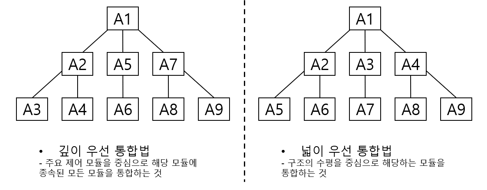
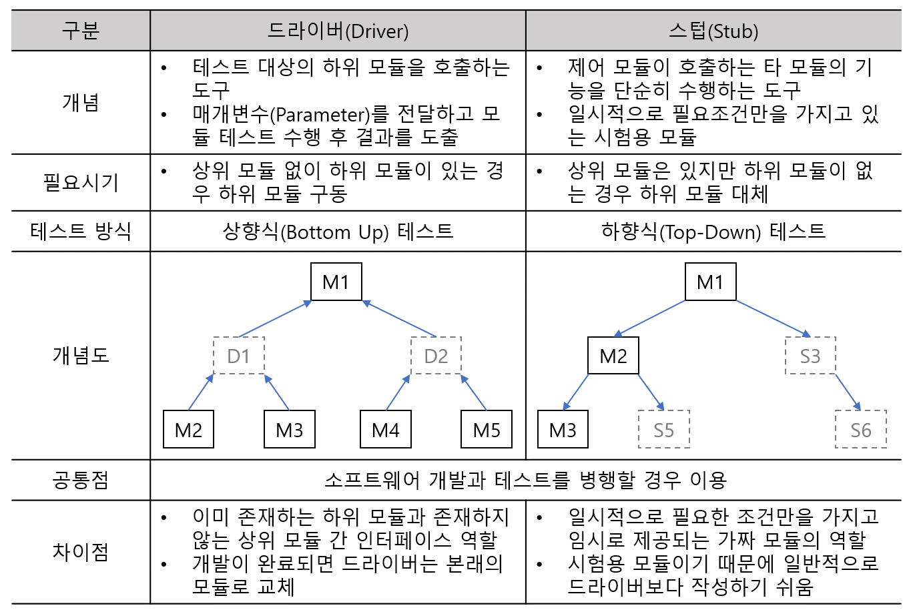

# 4. 애플리케이션 테스트 관리
## 054. ⭐ 애플리케이션 테스트
- 개발한 애플리케이션이 고객의 요구를 만족시키는지 확인(Validation), 기능이 정상적으로 수행하는지 검증(Verification)
- Validation(확인) = 사용자 입장 = 고객의 요구에 맞게 구현되었는지 확인
- Verification(검증) = 개발자 입장 = 명세서에 맞게 만들어졌는지 점검

### ⭐ 애플리케이션 테스트의 필요성
- 프로그램 실행 전 코드리뷰, 인스펙션 등을 통해 오류를 발견하여 예방
- 반복적인 테스트를 통해 제품의 신뢰도 향상
- 개발초기부터 테스트를 계획하고 시작하면 단순한 오류 발견뿐만 아니라 새로운 오류의 유입도 예방
- 테스트를 효과적으로 수행하면 최소한의 시간과 노력으로 많은 결함을 찾음

### ⭐ 애플리케이션 테스트의 기본원리
- 소프트웨어의 잠재적인 결함은 줄일 수 있지만 결함이 없다고 증명 X => 완벽한 테스팅 불가능
- 결함은 개발자의 특성, 애플리케이션의 기능적 특징때문에 특정 모듈에 집중되어 있음
- 파레토 법칙(Pareto Principle) : 테스트로 발견되 80%의 오류는 20%의 모듈에서 발견됨
    - 20%의 모듈을 집중적으로 테스트하여 효율적으로 오류를 찾자
- 살충제 패러독스(Pesticide Paradox) : 통일한 테스트 케이스로 동일한 테스트를 반복하면 더 이상 결함이 발견되지 않는 현상
    - 테스트 케이스를 지속적으로 보완 및 개선
- 소프트웨어 특징, 테스트 환경, 테스트 역량 등 정확(Context)에 따라 테스트 결과가 달라짐
    - 정황에 따라 테스트를 다르게 수행
- 오류-부재의 궤변(Absence of Errors Fallacy) : 결함을 모두 제거해도 사용자 요구사항을 만족시키지 못하면 해당 소프트웨어는 품질이 높다고 할 수 없음
- 테스트와 위험은 반비례
- 작은부분에서 시작하여 점점 확대하며 진행
- 개발자와 관계없는 별도의 팀에서 수행

## 055. 애플리케이션 테스트의 분류
### 프로그램 실행 여부에 따른 테스트 (프로그램 실행 여부)
#### 1) 정적 테스트
- 프로그램을 실행하지 않고 명세서나 소스 코드를 대상으로 분석하는 테스트
- 개발 초기에 결함을 발견할 수 있어 개발 비용을 낮춤
- **워크스루, 인스펙션, 코드 검사**

#### 2) 동적 테스트
- 프로그램을 실행하여 오류를 찾는 테스트
- 개발의 모든 단계에서 테스트 수행
- **블랙박스 테스트, 화이트박스 테스트**

### 테스트 기반 (Test Bases)에 따른 테스트 (무엇을 기반)
#### 1) 명세 기반 테스트
- 사용자 요구사항에 대한 명세를 빠짐없이 테스트 케이스로 만들어 구현하고 있는지 확인하는 테스트
- **동등 분할, 경계 값 분석**

#### 2) 구조 기반 테스트
- 소프트웨어 내부의 논리 흐름에 따라 테스트 케이스 작성하고 확인하는 테스트
- **구문 기반, 결정 기반, 조건 기반**

#### 3) 경험 기반 테스트
- 유사 소프트웨어나 기술 등에 대한 테스터의 경험을 기반으로 수행하는 테스트
- 사용자 요구사항에 대한 명세가 불충분하거나 테스트 시간에 제약이 있는 경우 효과적
- **에러 추정, 체크 리스트, 탐색적 테스팅**

### 시각에 따른 테스트 (누구를 기준으로)
#### 1) 검증(Verification) 테스트
- 개발자 시각에서 제품의 생산 과정을 테스트
- 제품이 명세서대로 완성되었는지 테스트

#### 2) 확인(Validation) 테스트
- 사용자 시각에서 생산된 제품의 결과를 테스트
- 사용자가 요구한대로 제품이 완성되었는지, 제품이 정상적으로 동작하는지 테스트

### 목적에 따른 테스트 (무엇을 목적으로)
#### 1) 회복(Recovery) 테스트
- 시스템에 여러 결함을 주어 실패하도록 한 후 올바르게 복구되는지 확인

#### 2) 안전(Security) 테스트
- 설치된 시스템 보호도구가 불법적인 침입으로부터 시스템을 보호할 수 있는지 확인

#### 3) 강도(Stress) 테스트
- 과도한 정보량이나 빈도 등을 부과하여 과부하 시에도 소프트웨어가 정상적으로 실행되는지 확인

#### 4) 성능(Performance) 테스트
- 실시간 성능이나 전체적인 효율성을 진단하는 테스트
- 응답시간, 처리량 등 테스트

#### 5) 구조(Structure) 테스트
- 내부의 논리적인 경로, 소스 코드의 복잡도 등 평가

#### 6) 회귀(Regression) 테스트
- 변경 또는 수정된 코드에 새로운 결함이 없음을 확인

#### 7) 병행(Parallel) 테스트
- 변경된 소프트웨어와 기존 소프트웨어에 동일한 데이터를 입력하여 결과를 비교하는 테스트

## 056. ⭐ 테스트 기법에 따른 애플리케이션 테스트
### 화이트박스 테스트 (White Box Test)
- 모듈의 원시 코드를 오픈시킨 상태에서 원시 코드의 **논리**적인 모든 경로를 테스트
- 설계된 절차에 초점
- 프로시터 설계의 제어 구조를 사용하여 테스트 케이스 설계
- 테스트 과정의 초기에 적용
- 모듈 안의 작동을 직접 관찰
- 원시 코드(모듈)의 모든 문장을 한 번 이상 실행함으로써 수행됨
- 제어 구조에 따라 선택, 반복 등 분기점 부분들을 수행함으로써 논리적 경로를 제어

### ⭐ 화이트박스 테스트의 종류
#### 1) 기초 경로 검사 (Base Path Testing)
- 대표적인 화이트박스 테스트 기법
- 절차적 설계의 논리적 복잡성을 측정할 수 있게 함
- 측정 결과는 실행 경로의 기초를 정의하는데 지침으로 사용됨

#### 2) 제어 구조 검사 (Control Structure Testing)
- 조건 검사(Condition Testing) : 모듈 내에 있는 논리적 조건을 테스트
- 루프 검사(Loop Testing) : 반복(Loop)구조에 초점을 맞춰 실시
- 데이터 흐름 검사(Data Flow Testing) : 변수 정의와 변수 사용 위치에 초점을 맞춰 실시

### 화이트박스 테스트의 검증 기준
#### 1) 문장 검증 기준 (Statement Coverage)
- 모든 구문이 한 번 이상 수행되도록 테스트 케이스 설계

#### 2) 분기 검증 기준 (Branch Converage) = 결정 검증 기준 (Decision Coverage)
- 모든 조건문에 대해 조건이 True인 경우, False인 경우가 한 번 이상 수행되도록 테스트 케이스 설계

#### 3) 조검 검증 기준 (Condition Coverage)
- 조건문에 포함된 개별 조건식의 결과가 True인 경우, False인 경우가 한 번 이상 수행되도록 테스트 케이스 설계

#### 4) 분기/조건 기준 (Branch/Condition Coverage)
- 분기 검증 기준과 조건 검증 기준 모두 만족하는 설계
- 조건문이 True인 경우, False인 경우에 따라 조건 검증 기준의 입력 데이터를 구분하는 테스트 케이스 설계

> 💡 검증 기준(Coverage) 종류
> - 기능 기반 커버리지 : 실제 테스트가 수행된 기능 수 / 전체 기능 수
> - 라인 커버리지(Line Coverage) : 테스트 시나리오가 수행한 코드 라인 수 / 전체 코드 라인 수
> - 코드 커버리지(Code Coverage) : 코드의 구문, 분기, 조건 등의 구조 코드 자체가 얼마나 테스트 되었는지 측정하는 방법 => 화이트박스 검증 모두 해당

### 블랙박스 테스트 (Black Box Test) = 기능 테스트
- 특정 기능을 알기 위해서 각 기능이 완전히 작동되는 것을 입증하는 테스트
- 프로그램 구조를 고려하지 않음
- 프로그램 또는 모듈의 요구나 명세를 기초로 결정
- 인터페이스에서 실시되는 테스트
- 부정확하거나 누락된 기능, 인터페이스 오류, 자료 구조나 외부 DB 접근에 따른 오류, 행위나 성능 오류, 초기화와 종료 오류 등 발견하기 위해 사용
- 테스트 과정의 후반부에 적용

### ⭐ 블랙박스 테스트의 종류
#### 1) 동치 분할 검사 (Equivalence Partitioning Testing, 동치 클래스 분해)
- 입력 자료에 초점을 맞춰 테스트 케이스(동치 클래스)를 만들고 검사하는 방법 = 동등 분할 기법
- 입력 조건에 타당한 입력 자료와 타당하지 않은 입력 자료의 개수를 균등하게 설정하고 해당 입력 자료에 맞는 결과가 출력되는지 확인

#### 2) 경계값 분석 (Boundary Value Analysis)
- 입력 자료에만 치중한 동치 분할 기법을 보완
- 입력 조건의 중간값보다 경계값에서 오류가 발생될 확률이 높다는 점을 이용해 입력 조건의 경계값을 테스트 케이스로 선정하여 검사

#### 3) 원인-효과 그래프 검사 (Cause-Effect Graphing Testing)
- 입력 데이터 간의관계와 출력에 영향을 미치는 상황을 체계적으로 분석 후, 효용성이 높은 테스트 케이스를 선정하여 검사

#### 4) 오류 예측 검사 (Error Guseeing)
- 과거 경험이나 확인자의 감각으로 테스트
- 다른 블랙박스 테스트 기법으로 찾아낼 수 없는 오류를 찾아내는 일련의 보충적 검사 기법 = 데이터 확인 검사

#### 5) 비교 검사 (Comparision Testing)
- 여러 버전의 프로그램에 동일한 테스트 자료를 제공해 동일한 결과가 출력되는지 테스트

## 057. ⭐ 개발 단계에 따른 애플리케이션 테스트
- 개발 단계에서부터 테스트 수행하므로 단순히 코드 상의 오류뿐만 아니라 요구 분석의 오류, 설계 인터페이스 오류 등도 발견 가능
- 단위 테스트 : 모듈 개발 시 모듈
- 통합 테스트 : 여러 개 모듈 결합하여 시스템으로 완성시키는 과정
- 시스템 테스트 : 설계된 소프트웨어가 시스템에서 정상적으로 수행되는지 확인
- 인수 테스트 : 최종 소프트웨어를 사용자에게 인도하기 전

[소프트웨어 생명주기의 V-모델]

### 단위 테스트 (Unit Test)
- 코딩 직후 소프트웨어 설계의 최소 단위인 모듈이나 컴포넌트에 초점을 맞춰 테스트
- 인터페이스, 외부적 I/O, 자료 구조, 독립적 기초 경로, 오류 처리 경로, 경계 조건
- 사용자 요구사항을 기반으로 기능성 테스트를 최우선으로 수행

> 💡 단위 테스트로 발견 가능한 오류
> - 알고리즘 오류에 따른 원치 않는 결과
> - 탈출구가 없는 반복문
> - 틀린 계산 수식에 의한 잘못된 결과

#### 1) 구조 기반 테스트
- 프로그램 내부 구조 및 복자보를 검증하는 **화이트박스 테스트**
- 제어 흐름, 조건 결정

#### 2) 명세 기반 테스트
- 목적 및 실행 코드 기반의 **블랙박스 테스트**
- 동등 분할, 경계 값 분석

### 통합 테스트 (Integration Test)
- 단위 테스트가 완료된 모듈들을 결합해 하나의 시스템으로 완성 시키는 과정에서의 테스트
- 모듈 간, 통합된 컴포넌트 간 상호작용 오류 검사

### 시스템 테스트 (System Test)
- 시스템에서 완벽하게 수행되는가 점검하는 테스트
- 환경적인 장애 리스크를 최소화하기 위해 실제 사용환경과 유사하게 만든 테스트 환경에서 테스트 수행

#### 1) 기능적 요구사항
- 요구사항 명세서, 비즈니스 절차, 유스케이스 등 명세서 기반의 **블랙박스 테스트** 시행

#### 2) 비기능적 요구사항
- 성능 테스트, 회복 테스트, 보안테스트, 내부 시스템의 메뉴구조, 웹 페이지의 네비게이션 등 구조적 요소에 대한 **화이트박스 테스트** 시행

### 인수 테스트 (Accrptance Test)
- 사용자 요구사항을 충족하는지에 중점을 주고 테스트
- 사용자가 직접 테스트
- 문제가 없으면 사용자는 소프트웨어를 인수하고 프로젝트는 종료

#### 1) 사용자 인수 테스트
- 사용자가 시스템 사용의 적절성 여부 확인
#### 2) 운영상의 인수 테스트
- 백업/복원 시스템, 재난 복구, 사용자 관리, 정기 점검 등 확인
#### 3) 계약 인수 테스트
- 계약상의 인수/검수 조건을 준수하는지 여부 확인
#### 4) 규정 인수 테스트
- 정부 지침, 법규, 규정 등 규정에 맞게 개발되었는지 확인
#### 5) 알파 테스트
- 사용자가 개발자 앞에서 행하는 테스트
- 통제된 환경에서 진행
- 오류와 사용상의 문제점을 사용자와 개발자가 함께 확인하면서 기록
#### 6) 베타 테스트 = 필드 테스팅(Field Testing)
- 사용자가 여러 명의 사용자 앞에서 행하는 테스트
- 실업무를 가지고 사용자가 직접 테스트
- 제어되지 않은 상태에서 테스트 진행
- 발견되 오류와 사용상의 문제점을 기록하고 개발자에게 주기적으로 보고

## 058. ⭐ 통합 테스트
- 단위 테스트가 끝난 모듈을 통합하는 과정에서 발생하는 오류 및 결함을 찾는 테스트 기법

#### 1) 비점진적 통합 방식
- 단계적으로 통합하는 절차 없이 모든 모듈이 미리 결합되어 있는 프로그램 전체를 테스트
- 빅뱅 통합 테스트
- 규모가 작은 소프트웨어에 유리 / 단시간 내에 테스트 가능
- 전체 프로그램 대상으로 하기에 오류 발견 및 장애 위치 파악 및 수정 어려움

#### 2) 점진적 통합 방식
- 모듈 단위로 단계적으로 통합하면서 테스트
- 오류 수정이 용이, 인터페이스와 연관된 오류를 완전히 테스트할 가능성 높음
- 하향식, 상향식, 혼합식

### 하향식 통합 테스트 (Top Down Integration Test)
- 상위 모듈에서 하위 모듈 방향으로 통합하면서 테스트
- 깊이 우선 통합법, 넓이 우선 통합법
- 테스트 초기부터 사용자에게 시스템 구조를 보여줌
- 상위 모듈에서는 테스트 케이스 사용 어려움
- 통합 검사 시 인터페이스가 이미 정의되어 있어 통합이 간단
- 레벨이 낮은 데이터 구조의 세부 사항은 설계 초기 단계에서 필요
- 하향식 통합 방법 순서
    - 주요 제어 모듈은 작성된 프로그램을 사용하며, 주요 제어 모듈의 종속 모듈들은 스텁(Stub)으로 대체
    - 깊이 우선 또는 넓이 우선 등 통합 방식에 따라 하위 모듈인 스텁들이 한 번에 하나씩 실제 모듈로 교체됨
    - 모듈이 통합될 때마다 테스트 실시
    - 새로운 오류가 발생하지 않음을 보증하기 위해 회귀 테스트 실행

### 상향식 통합 테스트 (Bottom Up Integration Test)
- 하위 모듈에서 상위 모듈 방향으로 통합하면서 테스트
- 가장 하위 단계 모듈부터 통합 및 테스트가 수행되므로 스텁(Stub)은 필요하지 않지만, 하나의 주요 제어 모듈과 관련된 종속 모듈의 그룹인 클러스터(Cluster)가 필요
- 인터페이스가 이미 성립되어 있지 않더라도 기능 추가 어려움
- 상향식 통합 방법 순서
    - 하위 모듈들을 클러스터(Cluster)로 결합
    - 상위 모듈에서 데이터의 입 · 출력을 확인하기 위해 더미 모듈인 드라이버(Driver)를 작성
    - 통합된 클러스터 단위로 테스트
    - 테스트가 완료되면 클러스터는 프로그램 구조의 상위로 이동하여 결합하고 드라이버는 실제 모듈로 대체됨

> 💡 테스트 드라이버와 테스트 스텁 차이점
> 
> 

### 혼합식 통합 테스트 = 샌드위치식 통합 테스트
- 하위수준에서는 상향식 통합, 상위 수준에서는 하향식 통합

### 회귀 테스트 (Regression Testing)
- 이미 테스트된 프로그램의 테스팅을 반복하는 것
- 통합 테스트로 인해 변경된 모듈이나 컴포넌트에 새로운 오류가 있는지 확인하는 테스트
- 수정한 모듈이나 컴포넌트가 다른 부분에 영향을 미치는지, 오류가 생기지 않았는지 테스트하여 새로운 오류가 발생하지 않음을 보증하기 위해 반복 테스트 시행
- 시간과 비용이 많이 필요하기에 변경된 부분을 테스트할 수 있는 테스트 케이스만 선정하여 수행

## 059. 애플리케이션 테스트 프로세스
> 테스트 계획 → 테스트 분석 및 디자인 → 테스트 케이스 및 시나리오 작성 → 테스트 수행 → 테스트 결과 평가 및 리포팅 → 결함 추적 및 관리

- 테스트 완료 후 산출 문서
    - 테스트 계획서
    - 테스트 케이스
    - 테스트 시나리오
    - 테스트 결과서

### 테스트 계획
- 프로젝트 계획서, 요구 명세서 등을 기반으로 테스트 목표를 정의하고 테스트 대상 및 범위 결정
- 시스템 구조 파악, 투입 조직 및 비용 산정, 테스트 시작 및 종료 조건 정의
- 테스트 계획서 작성

### 테스트 분석 및 디자인
- 테스트 목적과 원칙을 검토하고 사용자 요구사항을 분석
- 리스크 분석 및 우선순위 결정
- 테스트 데이터, 테스트 환경, 테스트 도구 등 준비

### 테스트 케이스 및 시나리오 작성
- 테스트 케이스의 설계 기법에 따라 테스트 케이스 작성하고 검토 및 확인 후 테스트 시나리오 작성
- 테스트용 스크립트 작성

### 테스트 수행
- 테스트 환경 구축 후 테스트 수행
- 실행 결과를 측정하여 기록

### 테스트 결과 평가 및 리포팅
- 테스트 결과를 비교 분석하여 테스트 결과서 작성
- 결함 내용 및 결함 재현 순서 등 결함을 중점적으로 기록
- 테스트 실행 절차 리뷰 및 결과에 대한 평가 수행, 최적화하여 다음 테스트에 적용

### 결함 추적 및 관리
- 결함이 어디에서 발생했는지, 어떤 종류의 결함인지 등 결함을 추적하고 관리
- 동일한 결함 발견 시 처리 시간 단축 및 결함의 재발 등을 방지
> 💡 결함 관리 프로세스
> 에러 발견 → 에러 등록 → 에러 분석 → 결함 확정 → 결함 할당 → 결함 조치 → 결함 조치 검토 및 승인

## 060. 테스트 케이스 / 테스트 시나리오 / 테스트 오라클
### ⭐ 테스트 케이스 (Test Case)
- 사용자 요구사항을 정확하게 준수했는지 확인하기 위해 설계된 입력 값, 실행 조건, 기대 결과 등으로 구성된 테스트 항목에 대한 명세서
- 명세 기반 테스트의 설계 산출물에 해당
- 테스트 오류 방지, 인력, 시간 낭비 감소
- 테스트 목표와 방법을 설정한 후 작성
- 시스템 설계 단계에서 작성하는 것이 가장 이상적

### 테스트 케이스 작성 순서
#### 1) 테스트 계획 검토 및 자료 확보
- 테스트 계획서를 재검토하여 테스트 대상 범위 및 접근 방법을 이해
- 시스템 요구사항과 기능 명세서를 검토하고 테스트 대상 시스템의 정보 확보
#### 2) 위험 평가 및 우선순위 결정
- 결함의 위험 정도에 따른 운선순위 결정
- 어느 부분에 초점을 맞춰 테스트할지 결정

#### 3) 테스트 요구사항 정의
- 사용자 요구사항이나 테스트 대상 재검토
- 테스트 특정, 조건, 기능을 분석

#### 4) 테스트 구조 설계 및 테스트 방법 결정
- 테스트 케이스의 형식과 분류 방법을 결정
- 테스트 절차, 장비, 도구, 테스트 문서화 방법을 결정

#### 5) 테스트 케이스 정의
- 요구사항에 따라 테스트 케이스 작성
- 입력 값, 실행 조건, 예상 결과 기술

#### 6) 테스트 케이스 타당성 확인 및 유지 보수
- 소프트웨어 기능 또는 환경 변화에 따라 테스트 케이스 갱신
- 테스트 케이스 유용성 검토

### 테스트 시나리오 (Test Scenario)
- 테스트 케이스를 적용하는 순서에 따라 여러 개의 테스트 케이스들을 묶은 집합
- 테스트 순서에 대한 구체적인 절차, 사전 조건, 입력 데이터 등 설정
- 순서를 미리 정함으로써 테스트 항목을 빠짐없이 수행

### 테스트 시나리오 작성 시 유의사항
- 시스템별, 모듈별, 항목별 여러 개의 시나리오로 분리하여 작성
- 요구사항과 설계 문서를 토대로 작성
- 식별자 번호, 순서 번호, 테스트 데이터, 테스트 케이스, 예상 결과, 확인 등을 포함
- 유스케이스 간 업무 흐름이 정상적인지 테스트 할 수 있도록 작성
- 개발된 모듈 간의 연계가 정상적으로 동작하는지 테스트 할 수 있도록 작성

### ⭐ 테스트 오라클 (Test Orcle)
- 테스트 결과가 올바른지 판단하기 위해 사전에 정의된 참 값을 대입하여 비교하는 기법 및 활동
- 테스트 오라클 특징
    - 제한된 검증 : 모든 테스트 케이스에 적용 불가
    - 수학적 기법 : 값을 수학적 기법을 이용하여 구함
    - 지동화 기능 : 프로그램의 실행, 결과 비교, 커버리지 측정 등을 자동화

### 테스트 오라클 종류
#### 1) 참 (True) 오라클
- 모든 테스트 케이스의 입력 값에 대해 기대하는 결과를 제공
- 발생된 모든 오류 검출 가능
- 항공기, 은행, 발전소 소프트웨어 등 미션 크리티컬한 업무에서 사용

#### 2) 샘플링 (Sampling) 오라클
- 특정 몇몇 테스트 케이스의 입력 값들에 대해서만 기대하는 결과를 제공
- 일반적인 업무, 게임, 오락 에서 사용

#### 3) 추정(Heuristic) 오라클
- 샘플링 오라클 개선
- 특정 테스트 케이스의 입력 값에 대해 기대하는 결과 제공
- 나머지 입력 값들에 대해서 추정으로 처리하는 오라클
- 일반적인 업무, 게임, 오락 에서 사용

#### 4) 일관성(Consistent) 검사 오라클
- 애플리케이션의 변경이 있을 때, 테스트 케이스의 수행 전과 후의 결과 값이 동일한지 확인하는 오라클

## 061. 테스트 자동화 도구
- 쉽고 효율적으로 테스트를 수행할 수 있도록 한 것
- 휴먼 에러(Human Error)를 감소, 테스트의 정확성 유지, 테스트 품질 향상

### ⭐ 테스트 자동화 도구의 장점 / 단점
#### 장점
- 테스트 데이터 재입력, 재구성 같은 반복적인 작업을 자동화함으로써 인력 및 시간 단축
- 다중 플랫폼 호환성, 소프트웨어 구성, 기본 테스트 등 향상된 테스트 품질 보장
- 사용자 요구사항을 일관성 있게 검증
- 테스트 결과에 대한 객관적인 평가 기준 제공
- 테스트 결과를 그래프 등 다양한 표시 현태로 제공
- UI없는 서비스도 정밀 테스트 가능

#### 단점
- 도구의 사용 방법에 대한 교육 및 학습 필요
- 프로세스 단계별로 적용하기 위한 시간, 비용, 노력이 필요
- 비공개 상용 도구의 경우 고가의 추가 비용 필요

### 테스트 자동화 수행 시 고려사항
- 재사용 및 측정이 불가능한 테스트 프로그램은 제외
- 모든 테스트 과정을 자동화 할 수 있는 도구는 없으므로 용도에 맞는 적절한 도구 선택
- 환경 설정 및 습득 기간을 고려해 프로젝트 일정을 계획
- 테스트 엔지니어 투입시기가 늦어지면 프로젝트 이해 부족으로 인해 불완전한 테스트를 초래할 수 있으므로 반드시 프로젝트 초기에 테스트 엔지니어의 투입 시기를 계획

### 테스트 자동화 도구의 유형
#### 1) 정적 분석 도구 (Static Analysis Tools)
- 프로그램을 실행하지 않고 분석하는 도구
- 코드에 대한 코딩 표준, 코딩 스타일, 코드 복잡도 및 남은 결함 등을 발견하기 위해 사용
- 테스트 수행하는 사람이 작성된 코드를 이해하고 있어야만 분석 가능

#### 2) 테스트 케이스 생성 도구 (Test Case Generation Tools)
- 자료 흐름도 : 자료 원시 프로그램을 입력받아 파싱 후 자료 흐름도 작성
- 기능 테스트 : 주어진 기능을 구동시키는 모든 가능한 상태의 입력을 작성
- 입력 도메인 분석 : 원시 코드의 내부를 참조하지 않고, 입력 변수의 도메인을 분석하여 작성
- 랜덤 테스트 : 입력 값을 무작위로 추출하여 테스트

#### 3) 테스트 실행 도구 (Test Execution Tools)
- 스트립트 언어를 사용해 테스트 실행
- 데이터 주도 접근 방식
    - 익숙하지 않은 사용자도 사용 가능
- 키워드 주도 접근 방식
    - 키워드를 이용하여 테스트 정의

#### 4) 성능 테스트 도구 (Performance Test Tools)
- 애플리케이션의 처리량, 응답 시간, 경과 시간, 자원 사용률 등 인위적으로 적용한 가상의 사용자를 만들어 테스트를 수행함으로써 성능의 목표 달성 여부 확인

#### 5) 테스트 통제 도구 (Test Control Tools)
- 테스트 계획 및 관리, 테스트 수행, 결함관리 수행하는 도구
- 형상관리 도구, 결합 추적/관리 도구

#### 6) 테스트 하네스 도구 (Test Harness Tools)
- 애플리케이션의 컴포넌트 및 모듈을 테스트하는 환경의 일부분
- 테스트를 지원하기 위해 생성된 코드와 데이터를 의미
- 테스트가 실행될 환경을 시뮬레이션하여 컴퓨넌트 및 모듈이 정상적으로 테스트 되도록 함

> 💡 테스트 하네스의 구성요소
> - 테스트 드라이버(Test Driver)
>   - 테스트 대상 하위모듈 호출
>   - 매개변수 전달하고 모듈 테스트 수행 후 결과를 도출하는 도구
> - 테스트 스텁(Test Stub)
>   - 제어모듈이 호출하는 타 모듈의 기능을 단순히 수행하는 도구
>   - 일시적으로 필요한 조건만들 가지고 있는 테스트용 모듈
> - 테스트 슈트(Test Suites)
>   - 테스트 대상 컴포넌트나 모듈, 시스템에 사용되는 테스트 케이스 집합
> - 테스트 케이스(Test Case)
>   - 사용자 요구사항을 정확하게 준수했는지 확인하기 위한 입력 값, 실행 조건, 기대 결과 등으로 만들어진 테스트 항목의 명세서
> - 테스트 스크립트(Test Script)
>   - 자동화된 테스트 실행 절차에 대한 명세서
> - 목 오브젝트(Mock Object)
>   - 사전에 사용자의 행위를 조건부로 입력해두면, 그 상황에 맞는 예정된 행위를 수행하는 객체

### 테스트 수행 단계별 테스트 자동화 도구
- 테스트 계획 : 요구사항 관리
- 테스트 분석/설계 : 테스트 케이스 생성
- 테스트 수행 : 테스트 자동화, 정적 분석, 동적 분석, 성능 테스트, 모니터링
- 테스트 관리 : 커버리지 분석, 형상관리, 결함 추적/관리

## 062. 결함 (Fault) 관리
- 오류 발생, 작동 실패 등과 같이 개발자가 설계한 것과 다르게 동작하거나 다른 결과가 발생되는 것
- 사용자가 예상한 결과와 실행 결과 간의 차이나 업무 내용과의 불일치 등으로 인해 변경이 필요한 부분도 모두 결함에 해당

### 결함 관리 프로세스
> 결함 관리 계획 → 결함 기록 → 결함 검토 → 결함 수정 → 결함 재확인 → 결함 상태 추적 및 모니터링 활동 → 최종 결함 분석 및 보고서 작성

### 결함 상태 추적
- 테스트에서 발견된 결함은 지속적으로 상태 변화를 추적하고 관리해야 함
- 향후 결함이 발견될 모듈 또는 컴포넌트를 추정

### 결함 추적 순서
> 결함 등록(Open) → 결함 검토(Reviewed) → 결함 할당(Assigned) → 결함 수정(Resolved) → 결함 조치 보류(Deferred) → 결함 종료(Closed) → 결함 해제(Clarified)

### 결함 분류
#### 1) 시스템 결함
- 애플리케이션 환경이나 DB 처리에서 발생된 결함
- 시스템 다운, 애플리케이션의 작동 정지, 종료, 응답 시간 지연, DB 에러

#### 2) 기능 결함
- 애플리케이션 기획, 설계, 업무 시나리오 등의 단계에서 유입된 결함
- 사용자 요구사항 미반영/불일치, 부정확한 비즈니스 프로세스, 스크립트 오류, 타 시스템 연동 시 오류

#### 3) GUI 결함
- 사용자 화면 설계에서 발생된 결함
- UI 비일관성, 데이터 타입의 표시 오류, 부정확한 커서/메시지 오류

#### 4) 문서 결함
- 기획자, 사용자, 개발자 간의 의사소통 및 기록이 원할하지 않아 발생된 결함
- 사용자 요구사항과 기능 요구사항의 불일치로 불완전한 상태의 문서, 사용자의 온라인/오프라인 메뉴얼의 불일치

> 💡 테스트 단계별 유입 결함
> - 기획 시 유입되는 결함
>   - 사용자 요구사항의 표준 미준수로 인한 테스트 불가능
>   - 요구사항 불명확/불완전/불일치 결함
> - 설계 시 유입되는 결함
>   - 설계 표준 미준수로 인한 테스트 불가능
>   - 기능 설계 불명확/불완전/불일치 결함
> - 코딩 시 유입되는 결함
>   - 코딩 표준 미준수로 인한 기능 불일치/불완전
>   - 데이터 결함
>   - 인터페이스 결함
> - 테스트 부족으로 유입되는 결함
>   - 테스트 수행 시 테스트 완료 기준의 미준수
>   - 테스트 팀과 개발팀의 의사소통 부족
>   - 개발자의 코딩 실수로 인한 결함

### 결함 심각도
- High, Medium, Low

### 결함 우선순위
- 결함 처리에 대한 신속성을 타나내는 척도
- 결함의 중요도와 심각도에 따라 설정되고 수정 여부가 결정됨
- 애플리케이션의 특성에 따라 심각도가 높다고 반드시 우선순위가 높은 것은 아님
- 결정적(Critical), 높음(High), 보통(Medium), 낮음(Low)
- 즉시 해결, 주의 요망, 대기, 개선 권고

### 결함 관리 도구
- Mantis : 결함 및 이슈 관리 도구
- Trac : 결함 추적, 결함 통합, 결함 관리 도구
- Redmine : 프로젝트 관리 및 결함 추적
- Bugzilla : 결함 신고, 확인, 처리 등 결함을 지속적으로 관리 / 결합의 심각도와 순선순위 지정

## 063. 애플리케이션 성능 분석
- 사용자가 요구한 기능을 최소한의 자원을 사용하여 최대한 많은 기능을 신속하게 처리하는 정도

> 💡 애플리케이션 성능 측정 지표
> - 처리량(Throughput) : 일정 시간 내에 애플리케이션이 처리하는 일의 양
> - 응답 시간(Response Time) : 애플리케이션에 요청을 전달한 시간부터 응답이 도착할 때까지 걸린 시간
> - 결과 시간(Turn Around time) : 애플리케이션에 작업을 의뢰한 시간부터 처리가 완료될 때까지 걸린 시간
> - 자원 사용률(Resource Usage) : 애플리케이션이 의뢰한 작업을 처리하는 동한 CPU 사용량, 메모리 사용량, 네트워크 사용량 등 자원 사용률

### 성능 테스트 도구
- 애플리케이션에 부하나 스트레스를 가하면서 애플리케이션의 성능 측정 지료를 점검하는 도구

|도구명|도구 설명|지원 환경|
|---|---|---|
|JMeter|HTTP, FTP 등 다양한 프로토콜을 지원하는 부하 테스트 도구| Cross-Platform|
|LoadUI|- 서버 모니터링, Drag&Drop 등 사용자 편리성이 강화된 부하 테스트 도구  - HTTP, JDBC 등 다양한 프로토콜 지원|Cross-Platform|
|OpenSTA|HTTP, HTTPS 프로토콜에 대한 부하 테스트 및 생산품 모니터링 도구|Windows|

### 시스템 모니터링 (Monitoring) 도구
- 애플리케이션이 실행되었을 때 시스템 자원의 사용량을 확인하고 분석하는 도구
- 성능 저하의 원인 분석, 시스템 부하량 분석, 사용자 분석 등 시스템을 안정적으로 운영할 수 있는 기능 제공

|도구명|도구 설명|지원 환경|
|---|---|---|
|Scouter|- 단일 뷰 통합/실시간 모니터링, 튜닝에 최적화된 인프라 통합 모니터링 도구  - 애플리케이션 성능을 모니터링/통제하는 도구|Cross-Platform|
|Zabbix|웹 기반 서버, 서비스, 애플리케이션 등의 모니터링 도구|Cross-Platform|

### 애플리케이션 성능 저하 원인 분석
- Connection 객체를 생성하거나 쿼리를 실행하는 애플리케이션 로직에서 많이 발생
- DB에 필요 이상의 많은 데이터를 요청한 경우
- DB Lock이 해제되기를 기다리면서 애플리케이션이 대기하거나 타임아웃된 경우
- Connection Pool의 크기가 너무 작거나 크게 설정한 경우
- JDBC, ODBC 같은 미들웨어를 상 후 종료하지 않아 연결 누수(Connection Leak)가 발생한 경우
- 트랜잭션이 확정(Commit)되지 않고 커넥션 풀에 반환되거나, 잘못 작성된 코드로 인해 불필요한 Commit이 자주 발생한 경우
- 인터넷 접속 불량으로 인해 서버 소켓(Server Socket)에 쓰기는 지속되나, 클라이언트에서 정상적인 읽기가 수행되지 않는 경우
- 대량의 파일을 업로드하거나 다운로드하여 처리 시간이 길어진 경우
- 트랜잭션 처리 중 외부 호출이 장시간 수행되거나 타임아웃된 경우
- 네트워크 관련 장비 간 데이터 전송이 실패하거나 전송 지연으로 인해 데이터 손실이 발생한 경우

## 064. 복잡도 (Complexity)
- 시스템, 시스템 구성요소, 소프트웨어의 복잡한 정도를 나타내는 말
- 시스템, 소프트웨어를 어느 정도의 수준까지 테스트해야 하는지, 개발하는데 어느 정도의 자원이 소요되는지 예측하는데 사용됨
- 복잡도가 높으면 장애가 발생할 수 있으므로 정밀한 테스트를 통해 미리 오류를 제거
- LOC(Line Of Code), 순환 복잡도(Cyclomatic Complexity)

### 시간 복잡도
- 알고리즘을 수행하기 위해 프로세스가 수행하는 연산 횟수를 수치화한 것
- 시간 복잡도가 낮을수록 알고리즘 실행시간이 짧고, 높을수록 실행시간이 길어짐

> - 빅오 표기법(Big-O Notation)
>   - 알고리즘 실행시간이 최악일 때 표기
>   - 명령어 실행 횟수는 표기 수치보다 많을 수 없음
> - 세타 표기법(Big-θ Notation)
>   - 알고리즘 실행시간이 평균일 때 표기
>   - 명령어 실행 횟수는 평균적인 수치를 표기
> - 오메가 표기법(Big-Ω Notation)
>   - 알고리즘 실행시간이 최상일 때 표기
>   - 명령어 실행 횟수는 표기 수치보다 적을 수 없음

### 빅오 표기법(Big-O Notation)
- 알고리즘 실행시간이 최악일 때 표기하는 방법
- 신뢰성이 떨어지는 오메가 표기법이나 평가하기 까다로운 세타 표기법에 비해 성능을 예측하기 용이하여 주로 사용

|||
|---|---|
|O(1)|- 입력값(n)에 관계 없이 **일정하게** 문제해결에 하나의 단계만 거침  - 스택 삽입(Push), 삭제(Pop)|
|O(log2n)|- 문제 해결에 필요한 단계가 입력값(n) 또는 조건에 의해 감소  - 이진트리(Binary Tree), 이진 검색(Binary Search)|
|O(n)|- 문제 해결에 필요한 단계가 입력값(n)과 1:1의 관계를 가짐  - for문|
|O(nlog2n)|- 문제 해결에 필요한 단계가 n(lon2n)번 만큼 수행됨  - 힙 정렬(Heap Sort), 2-Way 합병 정렬(Merge Sort)|
|O(n2)|- 문제 해결에 필요한 단계가 입력값(n)의 제곱만큼 수행됨  - 삽입 정렬(Insrtion Sort), 쉘 정렬(Shell Sort), 선택 정렬(Selection Sort), 버블 정렬(Bubble Sort), 퀵 정렬(Quick Sort)|
|O(2n)|- 문제 해결에 필요한 단계가 2의 입력값(n) 제곱만큼 수행됨  - 피보나치 수열(Fibonacci Sequence)|

### 순환 복잡도 (Cyclomatic Complexity) = 맥케이브 순환도(McCabe's Cyclomatic) = 맥케이브 복잡도 매트릭(McCabe's Complexity Metrics)
- 프로그램의 논리적인 복잡도를 측정하기 위한 소프트웨어의 척도
- 제어 흐름도 이론에 기초를 둠
- 순환 복잡도를 이용해 계산된 값은 프로그램의 독립적인 경로의 수를 정의하고, 모든 경로가 한 번 이상 수행되었음을 보장하기 위해 행해지는 테스트 횟수의 상한선을 제공
- 제어 흐름도(G)에서 순환 복잡도 V(G) = E - N + 2 (E: 화살표 수, N: 노드 수)

## 065. 애플리케이션 성능 개선
### 소스 코드 최적화
나쁜 코드(Bad Code)를 배제하고, 클린 코드(Clean Code)로 작성하는 것

- 클린 코드(Clean Code) : 누구나 쉽게 이해하고 수정 및 추가할 수 있는 단순, 명료한 코드
- 나쁜 코드(Bad Code) : 로직이 복잡하고 이해하기 어려운 코드
    - 스파게티 코드(Spaghetti Code) : 로드의 로직이 서로 복잡하게 얽혀 있는 코드
    - 외계인 코드(Alien Code) : 아주 오래되거나 참고문서 또는 개발자가 없어 유지보수 작업이 어려운 코드

#### ⭐ 클린 코드 작성 원칙
- 가독성
    - 누구든지 코드를 쉽게 읽을 수 있도록 자성
    - 코드 작성 시 이해하기 쉬운 용어를 사용하거나 들여쓰기 기능 등을 사용
- 단순성
    - 코드를 간단하게 작성
    - 한 번에 한 가지를 처리하도록 코드를 작성
    - 클래스/메소드/함수 등을 최소 단위로 분리
- 의존성 배제
    - 코드가 다른 모듈에 미치는 영향을 최소화
    - 코드 변경 시 다른 부분에 영향이 없도록 작성
- 중복성 최소화
    - 코드의 중복을 최소화
    - 준복된 코드는 삭제하고 공통된 코드를 사용
- 추상화
    - 산위 클래스/메소드/함수에서는 간략하게 애플리케이션의 특성을 나타내고, 상세 내용을 하위 클래스/메소드/함수에서 구현

### 소스 코드 최적화 유형
- 클래스 분할 배치 : 하나의 클래스는 하나의 역할만 수행하도록 응집도 높이기
- 느슨한 결함(Loosely Coupled) : 인터페이스를 이용해 의존성 최소화
- 코딩 형식 준수 : 줄바꿈, 지역변수 맨처음, 호출 - 선배치, 호출됨 - 후배치
- 좋은 이름 사용
- 적절한 주석문 사용

### 소스 코드 품질 분석 도구
#### 1) 정적 도구 분석
- 코드를 실행하지 않고 코딩 표준, 코딩 스타일, 결함 등 확인하는 코드 분석 도구
- 개발 초기의 결함을 찾는데 사용
- 개발 완료 시점에서는 개발된 소스 코드의 품질 검증하는 차원에서 사용
- 자료 흐름, 논리 흐름 분석을 통해 비정상적인 패턴 찾음
- 발견하기 어려운 결함을 찾아냄
- 코딩의 복잡도, 모델 의존성, 불일치성 등을 분석
- pmd, dppcheck, SonarQube, checkstyle, ccm, cobertura

#### 2) 동적 분석 도구
- 코드를 실행하여 코드에 존재하는 메모리 누수, 스레드 결합 등을 분석하는 도구
- Avalanche, Valgrind

### 소스 코드 품질 분석 도구의 종류
|종류|도구|설명|지원 환경|
|---|---|---|---|
|정적|pmd|미사용 변수, 최적화되지 않은 코드 등 결함을 유발할 수 있는 코드 검사|Linux, Windows
|정적|cppcheck|C/C++ 코드에 대한 메모리 누수, 오버플로우 등 분석|Windows|
|정적|SonarQube|중복 코드, 복잡도, 코딩 설계 등 소스 분석 통합 플랫폼|Cross-Platform|
|정적|checkstyle|자바 소스 코드 표준 검사, 다양한 개발도구 통합 사용 가능|Cross-Platform|
|정적|ccm|다양한 언어의 코드 복잡도 분석|Cross-Platform|
|정적|cobertura|자바 코드 복잡도 분석 및 테스트 커버리지 측정|Cross-Platform|
|동적|Avalanche|Valgrind 프레임 워크 및 STP 기반으로 구현됨, 프로그램 결함 및 취약점 분석|Linux, Android|
|동적|Valgrind|프로그램 내 메모리 및 스레드 결함 분석|Cross-Platform|

 

# Reference
- 정보처리기사 필기 (시나공)