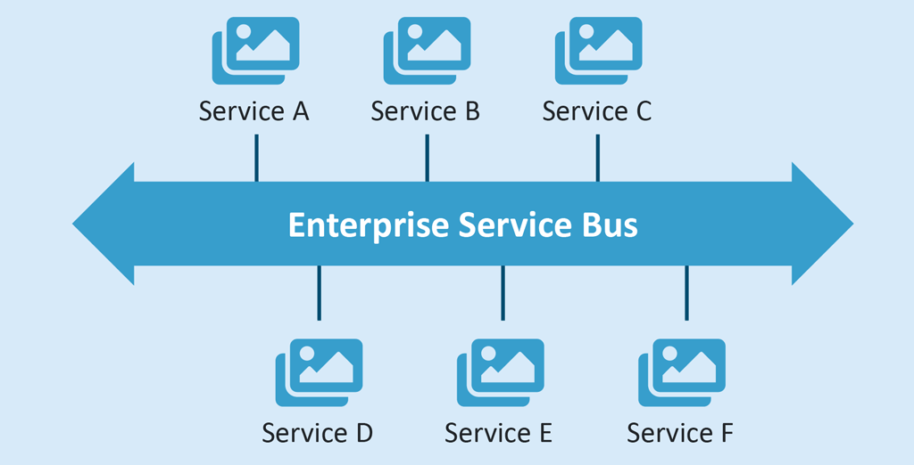

# 5. 인터페이스 구현
## 066. 모듈 간 공통 기능 및 데이터 인터페이스 확인
### 인터페이스 설계서
- 시스템 사이의 데이터 교환 및 처리를 위해 교환 데이터 및 관련 업무, 송 · 수신 시스템 등에 대한 내용을 정의한 문서
#### 1) 일반적인 인터페이스 설계서
- 시스템 인터페이스 설계서
    - 시스템 인터페이스 목록 → 목록에 대한 상세 데이터 명세
- 상세 기능별 인터페이스 명세서
    - 기능의 세부 인터페이스 정보 정의
    - 세부 기능 개요, 세부 기능이 동작하기 전 필요한 사전/사후 조건, 인터페이스 데이터, 호출 이후 결과를 확인하기 위한 반환값 등으로 구성
#### 2) 정적 · 동적 모형을 통한 인터페이스 설계서
- 다이어그램을 이용하여 만든 문서
- 요소 간의 트랜잭션을 통해 해당 인터페이스가 시스템의 어느 부분에 속하고, 해당 인터페이스를 통해 상호 교환되는 트랜잭션 종류 확인 가능

### 인터페이스 설계서별 모듈 기능 확인
- 시스템 인터페이스 목록
    - 외부 모듈 : 속신 및 전달
    - 내부 모듈 : 수신부분
- 시스템 인터페이스 설계서
    - 외부모듈 : 데이터 송신 시스템
    - 내부모듈 : 데이터 수신 시스템
- 상세 기능 인터페이스 명세서
    - 외부모듈 : 오퍼레이션과 사전 조건
    - 내부모듈 : 사후 조건
- 정적 · 동적 모형을 통한 인터페이스 설계
    - 내부모듈 : 인터페이스 영역을 기순으로 상위모듈, 하위모듈

## 067. 모듈 연계를 위한 인터페이스 식별
내부 모듈과 외부 모듈, 내부 모듈 간 데이터 교환을 위해 관계를 설정

### 모듈 연계 개요
#### 1) ⭐ EAI (Enterprise Application Integration)
- 기업 내 애플리케이션 및 플랫폼 간의 정보 전달, 연계, 통합 등 상호 연동이 가능하게 해주는 솔루션
- 비즈니스 간 통합 및 연계성을 증대시켜 효율성 및 각 시스템 간의 확정성(Determinacy)를 높여줌

**💡 EAI 구축 유형**

#### 2) ⭐ ESB (Enterprise Service Bus)
- 애플리케이션 간 연계, 데이터 변환, 웹 서비스 지원 등 표준 기반의 인터페이스를 제공하는 솔루션
- 애플리케이션 통합 측면에서 EAI와 유사하지만 애플리케이션 보다는 서비스 중심의 통합을 지향
- 특정 서비스에 국한되지 않고 범용적으로 사용하기 위해 애플리케이션과의 결합도(Coupling)를 약하게(Loosely) 유지
- 관리 및 보안 유지가 쉽고, 높은 수준의 품질 지원 가능

### 모듈 간 연계 기능 식별
- 모듈 간 공통 기능 및 데이터 인터페이스를 기반으로 모듈과 연계된 기능을 시나리오 형태로 구체화하여 식별

### 모듈 간 인터페이스 기능 식별
- 식별된 모듈 간 관련 기능을 검토하여 인터페이스 동작에 필요한 기능 식별
- 인터페이스 동작은 대부분 외부 모듈의 결과 또는 요청에 의해 수행되므로 외부 및 인터페이스 모듈 간 동작하는 기능을 통해 인터페이스 기능을 식별
- 내부 모듈 동작은 외부 모듈에서 호출된 인터페이스에 의해 수행되고 결과를 나타내는 것이므로 해당 업무에 대한 시나리오를 통해 내부 모듈관 관련된 인터페이스 기능을 식별
- 식별된 인터페이스 기능 중에서 실제적으로 필요한 인터페이스 기능을 최종적으로 선별
- 식별된 인터페이스 기능은 인터페이스 기능 구현을 정의하는데 사용

## 068. 모듈 간 인터페이스 데이터 표준 확인
- 모듈 간 원활한 데이터 교환을 위해 인터페이스에 사용되는 데이터 요소의 명칭, 정의, 규칙 등에 대한 원칙을 만드는 것

**💡 모듈 간 인터페이스 데이터 표준 확인 순서**
- 데이터 인터페이스를 통해 인터페이스 데이터 표준을 확인
- 인터페이스 기능을 통해 인터페이스 표쥰 확인
- 데이터 인터페이스와 인터페이스 기능을 통해 확인된 인터페이스 표준을 검토해 최종적인 인터페이스 데이터 표준을 확인 

### 데이터 인터페이스 확인
- 식별된 데이터 인터페이스에서 입 · 출력 값의 의미와 데이터의 특성 등을 구체적으로 확인

### 인터페이스 기능 확인
- 식별된 인터페이스 기능을 기반으로 인터페이스 기능 구형을 위해 필요한 데이터 항목 확인

### 인터페이스 데이터 표준 확인
- 데이터 인터페이스에서 확인된 데이터 표준과 인터페이스 기능을 통해 확인된 항목들을 검토하여 최종적으로 데이터 표준을 확인

## 069. 인터페이스 기능 구현 정의
인터페이스 실제 구현을 위해 이넡페이스 기능에 대한 구현 방법을 기능별로 기술한 것

**💡 인터페이스 기능 구현 정의 순서**
- 컴포넌트 명세서 확인
- 인터페이스 명세서 확인
- 일관된 인터페이스 기능 구현 정의
- 정의된 인터페이스 기능 구현을 정형화

### 모듈 세부 설계서
모듈 구성 요소와 세부적인 동작 등을 정의한 설계서

#### 1) 컴포넌트 명세서
- 컴포넌트 개요 및 내부 클래스 동작, 인터페이스를 통해 외부와 통신하는 명세 등을 정의
- 컴포넌트 ID, 컴포넌트명 컴포넌트 개요, 내부 클래스, 인터페이스 클래스

#### 2) 인터페이스 명세서
- 컴포넌트 명세서의 항목 중 인터페이스 클래스의 세부 조건 및 기능 등을 정의
- 인터페이스 ID, 인터페이스명, 오퍼레이션명, 오퍼레이션 개요, 사전조건, 사후조건, 파라미터, 반환값

### 모듈 세부 설계서 확인
- 컴포넌트 명세서와 인터페이스 명세서를 기반으로 인터페이스에 필요한 기능 확인
- 컴포넌트 개요, 내부 클래스의 클래스명과 설명 → 컴포넌트 주요 기능 확인
- 인터페이스의 세부 조건 및 기능 확인

### 인터페이스 기능 구현 정의
- 인터페이스의 기능, 인터페이스 데이터 표준, 모듈 세부 설계서를 기반으로 일관성 있고 정형화된 인터페이스 기능 구현에 대해 정의
- 일관성 있는 인터페이스 기능 구현 정의
    - 정의한 인터페이스 기능 구현에 대해 송 · 수신 측에서 진행해야 할 절차까지 세부적으로 정의
- 정의된 인터페이스 기능 구현 정형화
    - 하드웨어나 소프트웨어에 의존적이지 않게 사람들기 보기 쉽고 표준화되도록 정형화
    - 유스케이스 다이어그램 형태로 정형화

## 070. 인터페이스 구현
송 · 수신 시스템 간의 데이터 교환 및 처리를 실행해주는 작업

### 데이터 통신을 이용한 인터페이스 구현
- 애플리케이션 영역에서 인터페이스 형식에 맞춘 데이터 포맥을 인터페이스 대상으로 전송하고 이를 수신 측에서 파싱(Parsing)하여 해적하는 방식
- JSON, XML 형식의 데이터 포맷 사용

> **💡 JSON / XML / AJAX**
> - JSON (JavaScript Object Notation)
>   - 속성-값 쌍(Attribute-Value Pairs)으로 이루어진 데이터 객체를 전달하기 위해 사람이 읽을 수 있는 텍스트를 사용하는 개방형 표준 포맷
>   - 비동기 처리에 사용되는 AJAX에서 XML 대체로 사용
> - XML (eXtensible Markup Language)
>   - 특수한 목적을 갖는 마크업 언어를 만드는 데 사용되는 다목적 마크업 언어
>   - HTML 상호 호환적이지 못한 문제와 SGML 복잡함을 해결하기 위해 개발됨
> - AJAX (Asynchronous JavaScript and XML)
>   - JS 등을 이용하여 클라이언트와 서버 간에 XML 데이터 교환 및 제어함으로써 이용자가 웹 페이지와 자유롭게 상호 작용할 수 있도록 하는 비동기 통신 기술

### 인터페이스 엔티티를 이용한 인터페이스 구현
- 인터페이스 간 별도의 인터페이스 엔티티를 두어 상호 연계하는 방식
- 인터페이스 테이블을 엔티티로 활용
- 테이블은 한 개 또는 송신 및 수신 인터페이스 테이블을 각각 두어 활용
- 송신 및 수신 인터페이스 테이블의 구조는 대부분 같지만 상황에 따라 서로 다르게 설계할 수 있음

## 071. 인터페이스 예외 처리
인터페이스가 동작하는 과정에서 기능상 예외 상황이 발생했을 때 처리하는 절차

### 데이터 통신을 이용한 인터페이스 예외처리
- 인터페이스 객체의 송 · 수신 시 발생할 수 있는 예외 케이스 정의하고 예외 케이스별 예외 처리 방법 기술
- 시스템 환경, 송 · 수신 데이터, 프로그램 자체 원인

#### 1) 송신 실패시 예외처리 방안
- 시스템 환경
    - POST 이후 오류 메시지 확인
    - 서버를 찾지 못하는 404 오류일 경우, 네트워크 또는 서버 상태 확인
- 송신 데이터
    - 송신 데이터의 원활한 전송을 위해 사전에 데이터를 정제
    - 데이터 송신 시 데이터 크기 및 정합성을 체크하는 기능을 추가하여 미리 예방
- 프로그램 자체 원인
    - 논리적 결함을 수정
    - 충분한 테스트를 사전 예방
    - 프로세스에 따라 예상되는 예외를 사용자에게 알림을 통해 알려줌

#### 2) 수신 실패시 예외처리 방안
- 시스템 환경
    - 입력 대기 큐에 요청을 적재한 후 순차적으로 처리하여 버서가 정상적으로 가동될 때 동작할 수 있도록 함
- 수신 데이터
    - 특수문자 입력 케이스를 미리 파악한 다음 파싱 시 오류가 발생하지 않는 문자로 우선 대치하고 이후 다시 처리
- 프로그램 자체 원인
    - 논리적 결함을 수정
    - 충분한 테스트를 사전 예방
    - 프로세스에 따라 예상되는 예외를 사용자에게 알림을 통해 알려줌
    - 예외사항이 수신되지 않도록 송신 측 프로그램 수정

### 인터페이스 엔티티를 이용한 인터페이스 예외처리
- 인터페이스 동작이 실패할 경우를 대비하여 실패 상황과 원인 들을 기록하고 조취할 수 있도록 사용자 및 관리자에게 알려주는 방식으로 예외처리

#### 1) 송신 인터페이스 기능 실패시 예외처리 방안
- 인터페이스 데이터 생성
    - 오류 발생시 사용자에게 알람
    - 예외 케이스의 재발 방지를 위해 프로그램 개선
- 인터페이스 테이블에 입력
    - 입력 실패 결과, 원인을 인터페이스 테이블에 기록
    - 입력 실패 결과를 사용자에게 알람
    - 예외 케이스의 재발 방지를 위해 프로그램 개선
- 인터페이스 데이터 전송
    - 통신 경과를 통해 인터페이스 실패 결과와 원인을 인터페이스 테이블에 기록
    - 실패 결과, 원인을 사용자와 관리자에게 이메일 등으로 전송
    - 예외 케이스의 재발 방지를 위해 프로그램 개선

#### 2) 수신 인터페이스 기능 실패시 예외처리 방안
- 인터페이스 데이터 읽기
    - 수신 측 사용자에게 알람
- 데이터 트랜잭션
    - 사용자에게 알람
    - 인터페이스 테이블에 예외사항을 기록
    - 재발되지 않도록 프로그램 개선
- 처리 결과 응답
    - 인터페이스 테이블에 예외사항을 기록
    - 송 · 수신자에게 이메일 등으로 예외사항 알림

## 072. ⭐ 인터페이스 보안
인터페이스는 시스템 모듈 간 통신 및 정보 교환을 위한 통로로 사용되므로 충분한 보안 기능을 갖추지 않으면 시스템 모듈 전체에 악영향을 주는 보안 취약점이 될 수 있음

### 인터페이스 보안 취약점 분석
- 인터페이스 기능이 수행되는 각 구간들의 구현 현황을 확인 → 각 구간에 어떤 보안 취약점이 있는지 분석
- 송 · 수신 영역의 구현 기술 및 특징 등을 구체적으로 확인
- 송신 데이터 선택, 송신 객체 생성, 인터페이스 송 · 수신, 데이터 처리 결과 전송 등 영역별로 발생할 수 있는 보안 취약점을 시나리오 형태로 작성

### ⭐ 인터페이스 보안 기능 적용
#### 1) 네트워크 영역
- 인터페이스 송 · 수신 간 스니핑(Sniffing)등을 이용한 데이터 탈취 및 변조 위협을 방지하기 위해 네트워크 트래픽에 대한 암호화 설정
- IPSec(IP Security) : 네트워크 계층에서 IP 패킷 당위의 데이터 변조 방지 및 은닉 기능 제공하는 프로토콜
- SSL(Secure Sockets Layers) : TCP/IP 계층과 애플리케이션 계층 사이에서 인증, 암호화, 무결성을 보장하는 프로토콜
- S-HTTP(Secure Hypertext Transfer Protocol) : 클라이언트와 서버 간에 전송되는 모든 메시지를 암호화하는 프로토콜

#### 2) 애플리케이션 영역
- 소프트웨어 개발 보안 가이드를 참조하여 코드 상의 보안 취약점을 보안하는 방향으로 애플리케이션 보안 기능을 적용

#### 3) 데이터베이스 영역
- DB, 스키마, 엔티티의 접근 권한과 프로시저(Procedure), 트리거(Trigger) 등 DB 동작 객체의 보안 취약점에 보안 기능을 적용
- 개인정보나 업무상 민감한 데이터의 경우 암호화나 익명화 등 데이터 자체의 모안 방안 고려

> 💡 1. 스니핑(Sniffing)
> - 네트워크 중간에서 남의 패킷 정보를 도청하는 해킹 유형의 하나로 수동적 공격에 해당
> - 네트워크 내의 패킷들은 대부분 암호화되어 있지 않아 스니핑 같은 해킹 기법에 이용당하기 쉬움
> 2. 소프트웨어 개발 보안
> - 소크 소드에 존재할 수 있는 보안 취약점의 발견, 제거, 보안을 고려한 기능 설계 및 구현 등 소프트웨어 개발 과정에서 지켜야 할 일련의 보안활동 → 시큐어 코딩(Secure Coding)

### 데이터 무결성 검사 도구
- 시스템 파일의 변경 유무 확인하고, 파일이 변경되었을 경우 관리자에게 알려주는 도구
- 크래커나 허가받지 않은 내부 사용자들이 시스템에 침입하면 백도어를 만들어 놓거나 시스템 파일을 변경하여 자신의 흔적을 감추는데, 무결성 검사도구로 감지 가능
- 해시(Hash) 함수를 이용해 현재 파일 및 디렉토리의 상태를 DB에 저장 후 감시하다가 현재 상태와 DB의 상태가 달라지면 관리자에게 변경 사실을 알림
- Tripwrite, AIDE, Samhain Claymore,Slipwire, Fcheck

## 073. 연계 테스트
- 연계된 시스템과 연계 시스템의 구성 요소가 정상적으로 동작하는지 확인
- 송 · 수신 시스템이 이상없이 데이터를 주고받는지 확인
> 연계 테스트 케이스 작성 → 연계 테스트 환경 구축 → 연계 테스트 수행 → 연계 테스트 수행 결과 검증

### 연계 테스트 케이스 작성
- 연계 시스템 간의 데이터 및 프로세스의 흐름을 분석하여 필요한 테스트 항목 도출

### 연계 테스트 환경 구축
- 테스트 일정, 방법, 절차, 소요 시간 등 송 · 수신 기관과의 협의를 통해 결정하는 것
- 연계 서버 or 송 · 수신용 어댑터 설치, IP 및 포트 허용 신청, DB계정 및 테이블과 데이터 생성

### 연계 테스트 수행
- 연계 테스트 케이스의 시험 항목 및 처리 절차 등을 실제로 진행하는 것
- 송 · 수신용 연계 응용 프로그램의 단위 테스트를 먼저 수행
- 단위 테스트 완료 후 연계 테스트 케이스에 따라 데이터 추출, 데이터 송 · 수신, 데이터 반영 과정 등 수행

### 연계 테스트 수행 결과 검증
- 연계 테스트 케이스의 시험항목 및 처리 절차를 수행한 결과가 예상 결과와 동일한지 확인
    - 운영 DB 데이블의 건수 확인
    - 테이블 또는 파일을 열어 데이터 확인
    - 파일 생성 위치에서 파일 생성 여부 및 파일 크기 확인
    - 연계 서버에서 제공하는 모니터링 현황 확인
    - 시스템에서 기록하는 로그 확인

## 074. ⭐ 인터페이스 구현 검증
인터페이스가 정상적으로 문제없이 작동하는지 확인

### 인터페이스 구현 검증 도구
- 인터페이스의 입 · 츨력 값이 예상과 일치하는지 확인
- xUnit
    - 같은 코드를 여러 번 작성하지 않게 도와줌
    - 테스트마다 예상 결과를 기억할 필요가 없게 하는 자동화된 해법을 제공하는 단위 테스트 프레임워크
- STAF
    - 서비스 호출 및 컴포넌트 재사용 등 다양한 환경을 지원하는 테스트 프레임워크
    - 크로스 플랫폼, 분산 소프트웨어 테스트 환경을 조성할 수 있도록 지원
    - 분산 환경에 설치된 데몬이 프로그램 테스트에 대한 응답을 대신하며, 테스트 완료 후 통합하고 자동화하여 프로그램을 완성
- FitNesse
    - 웹 기반 테스트케이스 설계, 실행, 결과 확인 등을 지원하는 테스트 프레임워크
- NTAF
    - FitNesse의 장점인 협업 기능과 STAF의 장점인 재사용 및 확장성을 통합한 NHN(Naver)의 테스트 자동화 프레임워크
- Selenium
    - 다양한 브라우저 및 개발 언어를 지원하는 웹 애플리케이션 테스트 프레임워크
- watir
    - Ruby를 사용하는 애플리케이션 테스트 프레임워크
        - 인터프리터 방식의 객체 지향 스크립트 언어

### 인터페이스 구현 감시 도구
- 구현된 인터페이스가 외부 시스템과 연결 모듈 사이에서 정상적으로 동작하는지 확인
- 인터페이스 동작 상태는 APM을 사용해 감시(Moniroting) 할 수 있음
- 데이터베이스와 웹 애플리케이션의 드랜잭션, 변수값, 호출 함수, 로그 및 시스템 부하 등 종합적인 정보를 조회하고 분석
- 스카우터(Scouter)
    - 애플리케이션 및 OS 자원에 대한 모니터링 기능을 제공하는 오픈소스 APM소프트웨어
- 제니퍼(Jennifer)
    - 애플리케이션의 개발부터 테스트, 오픈, 운영, 안정화까지, 전 단계에 걸쳐 성능을 모니터링하고 분석해주는 APM소프트웨어

> 💡 APM (Application Perormance Management/Monitoring)
>  - 애플이케이션의 성능관리를 위해 접속자, 자원 현환, 트랜잭션 수행 내역, 장애 진단 등 다양한 모니터링 기능 제공하는 도구
> - 리소스 방식 : Nagios, Zabbix, Cacti
> - End-to-End 방식 : VisualVM, 제니퍼, 스카우터

### 인터페이스 구현 검증 도구 및 감시 도구 선택
- 인터페이스 명세서의 세부 기능을 참조하여 점긍 도구와 감시 도구의 요건을 분석
- 시장 및 솔루션 조사를 통해 적절한 인터페이스 구현을 검증하고 감시하는데 필요한 인터페이스 구현 검증 도구와 감시 도구 선택

### 인터페이스 구현 검증 확인
- 외부 시스템과 연계 모듈의 동작 상태를 확인
- 최초 입력값과 입력값에 의해 선택되는 데이터, 생성되는 객체의 데이터 등 전반적인 인터페이스 동작 프로세스상에서 예상되는 결과값과 실제 검증값이 동일한지 비교
- 각 단계 별 오류 처리도 적절하게 구현되어 있는지 확인

### 인터페이스 구현 감시 확인
- 외부 시스템과 연결 모듈이 서비스를 제공하는 동안 정상적으로 동작하는지 확인
- 인터페이스 동작 여부, 에러 발생 여부 등 감시도구에서 제공해주는 리포트를 활용

## 075. 인터페이스 오류 확인 및 처리 보고서 작성
- 사용자 또는 관리자는 오류사항을 확인하고 오류 처리 보고서 작성

### 인터페이스 오류 발생 즉시 확인
- 화면에 오류 메시지 표시
- SMS, 이메일 방송
- 가장 직관적인 방법이기 때문에 가장 많이 사용

### 주기적인 인터페이스 오류 방생 확인
- 시스템 로그나 인터페이스 오류 관련 테이블 등을 통해 주기적으로 오류 발생 여부 확인
- 오류에 대한 정보가 주기적으로 축정되면 오류의 원인 파악이 용이하기에 오류의 재발을 방지할 수 있는 계획 세울 수 있음

### 인터페이스 오류 처리 보고서 작성
- 오류의 발생 및 종료 시점, 원인 및 증상, 처리사항 등을 정리한 문서
- 오류 발생 즉시 신속하게 작성하여 조직의 보고 체꼐에 따라 보고
- 오류 발생 시 상황에 맞춰 작성
- 오류 관련 사항을 시간 경과에 따라 기록

 

# Reference
- 정보처리기사 필기 (시나공)
- https://velog.io/@jincrates/%EC%A0%95%EC%B2%98%EA%B8%B0-%ED%82%A4%EC%9B%8C%EB%93%9C-%EC%A0%95%EB%A6%AC3
- https://blog.seeburger.com/ipaas-vs-esb-which-integration-approach-is-best-for-your-organisation/