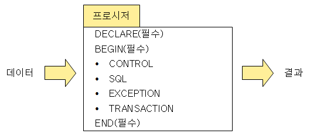
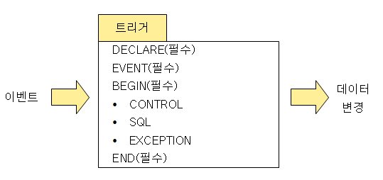

# 4. SQL 활용
## 114. 프로시저 (Procedure)
- 절차형 SQL을 활용해 특정 기능을 수행하는 일종의 트랜잭션 언어
- 호출을 통해 실행되어 미리 저장해 놓은 SQL 작업을 수행
- 여러 프로그램에서 호출하여 사용 가능
- 데이터베이스에 저장되어 수행되기 때문에 스토어드(Stored) 프로시저라고도 불림
- 시스템의 일일 마감 작업, 일괄(Batch) 작업 등 주로 사용

### 프로시저 구성

- DECLARE : 프로시저의 명칭, 변수, 인수, 데이터 타입을 정의하는 선언부
- DEGIN / END : 프로시저의 시작과 종료를 의미
- CONTROL : 조건문 또는 반복문이 삽입되어 순차적으로 처리
- SQL : DML, DCL이 삽입되어 데이터 관리를 위한 조회, 추가, 수정, 삭제 작업을 수행
- EXCEPTION : BEGIN ~ END 안의 구문 실행 시 예외가 발생하면 이를 처리하는 방법 정의
- TRANSACTION : 수행된 데이터 작업들을 DB에 적용할지 취소할지를 결정하는 처리부

### 프로시저 생성
> CREATE [OR REPLACE] PROCEDURE 프로시저명(파라미터)  
> [지역변수 선언]  
> BEGIN  
> &emsp;&nbsp;프로시저 BODY;  
> END;  
    
- CREATE PROCEDURE 명령어 사용
- 파라미터
    - IN : 호출 프로그램이 프로시저에게 값을 전달할 때 지정
    - OUT : 프로시저가 호출 프로그램에게 값을 전달할 때 지정
    - INOUT : 호출 프로그램이 프로시저에게 값을 전달, 프로시저 실행 후 호출 프로그램에 값을 반환할 때 지절
    - 매개변수명 : 호출 프로그램으로부터 전달받은 값을 저장할 변수의 이름 지정
    - 자료형 : 변수의 자료형 지정
- 프로시저 BODY
    - 프로시저 본문 코드를 기록하는 부분
    - BEGIN과 END 사이에 적어도 하나의 SQL 문이 있어야 함

### 프로시저 실행
- EXECUTE 프로시저명;
- EXEC 프로시저명;
- CALL 프로시저명;

### 프로시저 제거
- DROP PROCEDURE 프로시저명;

## 115. ⭐ 트리거 (Trigger)
- 데이터베이스 시스템에서 데이터의 삽입, 갱신, 삭제 등의 이벤트가 발생할 때마다 관련 작업이 자동으로 수행되는 절차형 SQL
- 데이터베이스에 저장되며, 데이터 변경 및 무결성 뮤지, 로그 메시지 출력 등을 목적으로 사용됨
- DCL 사용불가
    - DCL이 포함된 프로시저나 함수를 호출하는 경우에도 오류 발생
- 오류가 있을 경우 트리거가 처리하는 데이터에도 영향을 미치므로 트리거 생성시 세심한 주의 필요

### 트리거 구성

- DECLARE : 트리거 명칭, 변수 및 상수, 데이터 타입을 정의하는 선언부
- EVENT : 트리거가 실행되는 조건 명시
- BEGIN / END : 트리거의 시작과 종료
- CONTROL : 조건문 또는 반복문이 삽입되어 순차적으로 처리됨
- SQL : DML문이 삽입되어 데이터 관리를 위한 조회, 추가, 수정, 삭제 작업을 수행
- EXCEPTION : BEGIN ~ END 안의 구문 실행 시 예외가 발생하면 이를 처리하는 방법 정의

### 트리거 생성
> CREATE [OR REPLACE] TRIGGER 트리거명 동작시기 동작 ON 테이블명  
> [REFERENCING NEW | OLD AS 테이블명]  
> [FOR EACH ROW [WHEN 조건식]]  
> BEGIN  
> &emsp;&nbsp;트리거 BODY;  
> END;  

- CREATE TRIGGER 명령어 사용
- 동작시기 : 트리거가 실행될 때 지정
    - AFTER : 테이블이 변경된 후에 트리거 실행
    - BEFORE : 테이블이 변경되지 건에 트리거 실행
- 동작 : 트리거가 실행되게 할 작업의 종류 지적
    - INSERT : 테이블에 새로운 튜플을 삽입할 때 트리거 실행
    - DELETE : 테이블의 튜플을 삭제할 때 트리거 실행
    - UPDATE : 테이블의 튜플을 수정할 때 트리거 실행
- NEW / OLD : 트리거가 적용될 테이블의 별칭 지정
    - NEW : 추가되거나 수정에 참여할 튜플들의 집합(테이블)을 의미
    - OLD : 수정되거나 삭제 전 대상이 되는 튜플들의 집합(테이블)을 의미
- WHEN 조건식 : Optional / 트리거를 적용할 튜플의 조건 지정
- 트리거 BODY
    - 트리거 본문 코드를 기록하는 부분
    - BEGIN과 END 사이에 적어도 하나의 SQL 문이 있어야 함

### 트리거 제거
- DROP TRIGGER 트리거명;

## 116. 사용자 정의 함수
- 프로시저와 유사하게 SQL을 사용하여 일련의 작업을 연속적으로 처리
- 종료 시 처리 결과를 단일값으로 반환하는 절차형 SQL
- 데이터베이스에 저장되며, SELECT, INSERT, DELETE, UPDATE등 DML 호출에 의해 실행됨
- 예약어 RETURN을 통해 값을 반환하기 때문에 출력 파라미터가 없음
- INSERT, DELETE, UPDATE를 통한 테이블 조작 불가
- SELECT를 통한 조회만 가능
- 프로시저를 호출하여 사용 불가
- SUM(), AVG() 등의 내장함수처럼 DML문에서 반환값을 활용하기 위한 용도로 사용

> 💡 프로시저 vs 사용자 정의 함수
> |구분|프로시저|사용자 정의 함수|
> |---|---|---|
> |반환값|없거나 1개 이상 가능|1개|
> |파라미터|입 · 출력 가능|입력만 가능|
> |사용 가능 명력문|DML, DCL|SELECT|
> |호출|프로시저, 사용자 정의 함수|사용자 정의 함수|
> |사용 방법|실행문|DML에 포함|

### 사용자 정의 함수 구성

- 프로시저 구성과 비슷
- 프로시저 구성에서 RETURN만 추가
- RETURN : 호출 프로그램에 반환할 값이나 변수를 정의

### 사용자 정의 함수 생성
> CREATE [OR REPLACE] FUNCTION 사용자 정의 함수명(파라미터)  
> [지역변수 선언]  
> BEGIN  
> &emsp;&nbsp;사용자 정의 함수 BODY;  
> &emsp;&nbsp;RETURN 반환값;  
> END;

### 사용자 정의 함수 실행
- SELECT 사용자 정의 함수명 FROM 테이블명;
- INSERT INTO 테이블명(속성명) VALUES (사용자 정의 함수명);
- DELETE FROM 테이블명 WHERE 속성명 = 사용자 정의 함수명;
- UPDATE 테이블명 SET 속성명 = 사용자 정의 함수명;

### 사용자 정의 함수 제거
- DROP FUNCTION 사용자 정의 함수명;

## 117. DBMS 접속 기술
- 사용자가 데이터를 사용하기 위해 응용 시스템을 이용하여 DBMS에 접근하는 것
- 응용 시스템은 사용자로부터 매개 변수를 전달받아 SQL을 실행하고 DBMS로부터 전달받은 결과를 사용자에게 전달하는 매개체 역할 수행
- 웹 응용 시스템은 웹 서버와 웹 애플리케이션 서버(WAS)로 구성
- 서비스 규모가 작은 경우 웹 서버와 웹 애플리케이션 서버를 통합하여 하나의 서버만으로 운용
- 웹 서버 : 웹 페이지, 저용량 자료 등의 처리 담당
- WAS : DBMS와 통신하며 대용량 파일이나 복잡한 로직 등의 처리 담당

### DBMS 접속 기술
- API, 프레임워크

#### 1) JDBC (Java DataBase Connectivity)
-  Java 언어로 다양한 종류의 데이터 베이스에 접속하고 SQL문을 수행할 때 사용되는 표준 API
- 1997년 2월 썬 마이크로시스템에서 출시
- Java SE(Standart Edition) 포함
- 접속하려는 DBMS에 대한 드라이버 필요

#### 2) ODBC (Open DataBase Connectivity)
- 표준 개방형 API
- 개발 언어와 무관하여 사용 가능
- 1992년 9월 마이크로소프트에서 출시
- MS-Access, DBase, DB2, Excel, Text 등 다양한 데이터베이스에 접근 가능
- 접속하여는 DBMS의 인터페이스를 알지 못하더라도 ODBC 문장을 사용해 SQL을 작성하면 ODBC에 포함된 드라이버 관리자가 해당 DBMS의 인터페이스에 맞게 연결해주므로 DBMS의 종류는 몰라도 됨

#### 3) MyBatis
- JDBC 코드를 단순화하여 사용할 수 있는 SQL Mapping기반 오플 소스 접속 프레임워크
- 데이터베이스에 접속 기능 강화
- SQL문장을 분리하여 XML 파일을 만들고 Mapping을 통해 SQL을 실행
- SQL을 거의 그대로 사용할 수 있어 SQL 친화적인 국내 환경에 적합하여 많이 사용

### 동적 SQL (Dynamic SQL)
- 개발 언어에 삽입되는 SQL 코드를 문자열 변수에 넣어 처리하는 것
- 조건에 따라 SQL 구문을 동적으로 변경하려 처리 가능
- 사용자로부터 SQL문의 일부 또는 전부를 입력받아 실행
- NVL함수를 사용할 필요 없음
- 프리컴파일할 때 구문 분석, 접근 권한 확인 불가
- 정적 SQL에 비해 속도가 느리지만, 상황에 따라 다양한 조건을 첨가하는 등 유연한 개발 가능

> 💡 정적 SQL vs 동적 SQL
> ||정적 SQL(Static SQL)|동적 SQL(Dynamic SQL)|
> |---|---|---|
> |SQL 구성|커서(Cursor)를 통한 정적 처리|문자열 변수에 담아 동적 처리|
> |개발 패턴|커서 범위 안에서 반복문을 활용하여 SQL 작성|NVL 함수 없이 로직을 통해 SQL 작성|
> |실행 속도|빠름|느림|
> |사전 검사|가능|불가능|

## 118. SQL 테스트
작성 의도에 맞게 원하는 기능을 수행하는지 검증하는 과정

### 단문 SQL 테스트
- DDL, DML, DCL이 포함되어 있는 SQL과 TCL을 테스트하는 것
- 직접 실행하여 결과물을 확인
- 실행 시 오류나 경고가 발생할 경우 메시지를 참조하여 문제를 해결
- DESCRIBE 명령어로 DDL로 작성된 테이블이나 뷰의 속성, 자료형, 옵션들을 바로 확인가능
    - DESC [개체명];
- DML로 변경한 데이터는 SELECT문으로 정상적인 변경 여부 확인 가능
- DCL로 설정된 사용자 권한은 사용자 권한 정보가 저장된 테이블을 SELECT로 조회하거나, SHOW명령어로 확인 가능
    - Oracle : SELECT * FROM DBA_ROLE_PRIVES WHERE GRANTEE=사용자;
    - MySQL : SHOW GRANTS FOR 사용자@호스트;

### 절차형 SQL 테스트
- 프로시저, 사용자 정의 함수, 트리거 등의 절차형 SQL은 디버길을 통해 기능의 적합성 여부를 검증하고, 실행을 통해 결과를 확인하는 테스트를 수행
- 오류 및 경고 메시지가 상세히 출력되ㅣ 않으므로 SHOW 명령어를 통해 오류 내용을 확인하고 문제를 수정
    - SHOW ERRORS;
- 변화를 줄 수 있는 SQL문은 주석으로 처리하고, 출력문을 이용해 화면에 출력하여 확인
    - Oracle
        - DBMS_OUTPUT.ENABLE : 화면에 출력
        - DBMS_OUTPUT.PUT_LIME(데이터) : '데이터'에 넣은 변수나 값을 화면에 출력
    - MySQL
        - SELECT 데이터 : '데이터'에 넣은 변수나 값을 화면에 출력

## 119. ⭐ ORM (Object-Relational Mapping)
- 객체지향 프로그래밍의 객체(Object)와 관계형 데이터베이스(Relational Database)의 데이터를 연결(Mapping)해주는 기술
- 객체지향 프로그래밍에서 사용할 수 있는 가상의 객체지향 데이터베이스를 만들어 프로그래밍 코드와 데이터를 연결
- 가상의 객체지향 데이터베이스는 프로그래밍 코드 또는 데이터베이스와 독립적이므로 재사용 및 유지보수 용이
- SQL 코드를 직접 입력하지 않고 선언문이나 할당 같은 부수적인 코드가 생략되지 때문에 직관적이고 간단하게 데이터 조작 가능

### ORM 프레임워크

|||
|---|---|
|Java|JPA, Hibernate, EclipseLink, DataNucleus, Ebean|
|C++|ODB, QxQrm|
|Python|Django, SQLAlchemy, Srotm|
|iOS|DatabaseObjects, Core Data|
|.NET|NHibernate, DatabaseObject, Dapper|
|PHP|Doctrine, Propel, RedBean|

### ORM 한계
- 프레임워크가 자동으로 SQL을 작성하기 때문에 의도대로 SQL이 작성되었는지 확인이 필요
- 객체지향적인 사용을 고려하고 설계된 데이터베이스가 아닌 경우, 프로젝트가 크로 복잡해질수록 ORM 기술 적용하기 어려움
- ORM에 적합하게 변환하려면 많은 시간과 노력 필요

## 120. 쿼리 성능 최적화
- 데이터 입 · 출력 애플리케이션의 성능 향상을 위해 SQL 코드를 최적화하는 것
- 쿼리 성능 최적화 전에 성능 측정 도구인 APM을 사용하여 최적화 할 쿼리를 선정해야 함
> 💡 APM (Application Perfomance Management/Monitoring)
> - 애플리케이션의 성능관리를 위해 접속자, 자원 혀황, 트랜잭션 수행 내역, 장애 진단 등 다양한 모니터링기능을 제공하는 도구
> - 리소스 방식 : Nagios, Zabbix, Cacti
> - 에느투엔드 방식 : VisualVM, 제니퍼, 스카우터

- 최적화 할 쿼리에 대해 옵티마이저가 수립한 실행 계획을 검토하고 SQL코드와 인덱스를 재구성
> 💡 옵티마이저
> - 작성된 SQL이 가장 효율적으로 수행되도록 최적의 경로를 찾아주는 모듈
> - 실무에서는 주로 CBO 사용
>   - 입 · 출력 속도, CPU 사용량, 쿼리의 블록 개수, 쿼리에 사용되는 개체의 속성, 튜플의 개수 등 종합하여 DBMS마다 고유의 알고리즘에 따라 산출되는 '비용'을 계산하기 때문에 변경되면 실행 계획을 다시 확인해야함
>
> ||RBO(Rule Based Optimizer)|CBO(Cost Based OPtimizer)|
> |---|---|---|
> |최적화 기준|규칙에 정의된 우선순위|액세스 비용|
> |성능 기준|개발자의 SQL 숙력도|옵티마이저의 예측 성능|
> |특징|실행 계획 예측이 쉬움|성능 통계치 정보 활용, 예측이 복잡함|
> |고려사항|개바자의 규칙 이해도, 규칙의 효율성|비용 산출 공식의 정확성|

### 실행 계획(Execution Plan)
- DBMS의 옵티마이저가 수립한 SQL 코드의 실행 정차와 방법을 의미
- 실행 계획은 EXPLAIN 명령어를 통해 확인 가능
- 그래픽이나 텍스트로 표현
- 요구사항들을 처리하기 위한 연산 순서가 적혀있으며, 연산에는 조인, 테이블 검색, 필터, 정렬 등이 존재

### 쿼리 성능 최적화
- 실행 계획에 표시된 연산 순서, 조인 방식, 테이블 조회 방법 등을 참고하여 SQL문이 더 빠르고 효율적으로 작동하도록 SQL 코드와 인덱스를 재구성하는 것

#### 1) SQL 코드 재구성
- WHERE절을 추가해 일부 레코드만 조회하게 함으로써 조회 비용을 줄임
- WHERE정에 연산자가 포함되면 INDEX를 활용하지 못하므로 가능한 한 연산자 사용을 자제
- 서브 쿼리에 특정 데이터가 존재하는지 확인할 때는 IN보다 EXISTS 활용
- 옵티마이저의 실행 계획이 잘못되었다고 판단되는 경우 힌트를 활용해 실행 계획의 액세스 경로 및 조인 순서를 변경
    - 힌트(Hint) : SQL문에 추가되어 테이블 접근 순서를 변경하거나, 인덱스 사용을 강제하는 등의 실행 계획에 영햘을 줄 수 있는 문장

#### 2) 인덱스 재구성
- 조회되는 속성과 조건들을 고려하여 인덱스를 구성
- 실행 계획을 참고하여 인덱스를 추가하거나 기존 인덱스의 열 순서를 변경
- 인덱스의 추가 및 변경은 해당 테이블을 참조하는 다은 SQL문에도 영향을 줄 수 있으므로 신중히 결정
- 단일 인덱스로 쓰기나 수정없이 읽기로만 사용되는 테이블의 경우 IOT(Index-Organized Table)로 구성하는 것을 고려
    - IOT : 인덱스 안에 테이블 데이터를 직접 삽입하여 저장함으로써 주소를 얻는 과정이 생략되어 빠른 조회 가능
- 불필요한 인덱스 제거

 

# Reference
- 정보처리기사 필기 (시나공)
