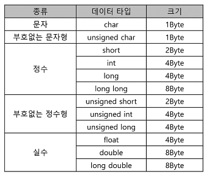
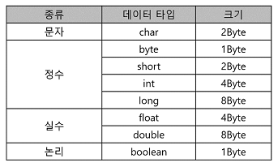
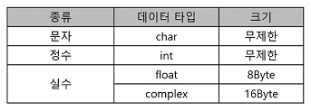
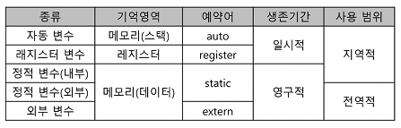
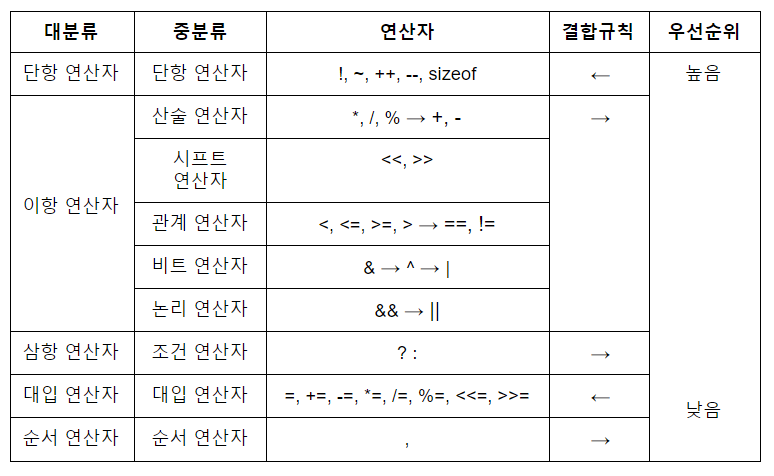

# 2. 프로그래밍 언어 활용
## 132. 데이터 타입
### C/C++의 데이터 타입 크기 및 기억 범위


### Java의 데이터 타입 크기 및 기억 범위


### Python의 데이터 타입 크기 및 기억 범위


## 133. 변수
### ⭐ 변수명 작성 규칙
- 영문자, 숫자, _(under bar)를 사용
- 첫 글자는 영문자나 _(under bar)로 시작해야하며, 숫자는 올 수 없음
- 글자 수 제안 없음
- 공백이나 *, +, -, / 등 특수문자 사용 불가
- 대 · 소문자 구분
- 예약어 사용 불가
- 문장 끝에 반드시 세미콜런을 붙임
- 헝가리안 표기법 : 변수명에 데이터 타입을 명시하는 것

> 💡 예약어 </br>
> do, for, while, case, default, else, if, switch, break, continue, goto, return, char, double, enum,, float, int, long, short, signed, struct, typedef, union, unsigned, void, auto, extern, register, static, const, sizeof, volatile

### ⭐ 기억 클래스
- 변수가 할당되는 기억영역에 따라 사용 범위 제한



#### 1) 자동 변수 (Autoamtic Variable)
- 함수나 코드 범위를 한정하는 블록 내에서 선언되는 변수
- 함수나 블록이 실행되는 동안에만 존재하며 벗어나면 자동 소멸
- 초기화하지 않으면 쓰레기값(Garbage Value)이 저장됨

#### 2) 외부 변수 (External Variable)
- 현재 파일이나 다른 파일에서 선언된 변수나 함수를 참고(reference)하기 위한 변수
- 함수 밖에서 선언
- 함수가 종료된 뒤에도 값이 소멸되지 않음
- 초기화하지 않으면 자동으로 0으로 초기화
- 다른 파일에서 선언된 변수를 참조할 경우 초기화 할 수 없음

#### 3) 정적 변수 (Static Variable)
- 함수나 블록 내에서 선언하는 내부 정적 변수와 함수 외부에서 선언하는 외부 정적 변수 존재
- 내부 정적 변수
    - 선언한 함수나 블록 내에서만 사용
- 외부 정적 변수
    - 모든 함수에서 사용 가능
- 두 변수 모두 함수나 블록이 종료된 뒤에도 값이 소멸되지 않음
- 초기화는 변수 선언 시 한 번만 가능
- 초기화 생략하면 자동으로 0으로 초기화

#### 4) 레지스터 변수 (Register Variable)
- 메모리가 아닌 CPU 내부의 레지스터에 기억영역을 할당받는 변수
- 자주 사용되는 변수를 레지스터에 저장하여 처리 속도를 높이기 위해 사용
- 함수나 블록이 실행되는 동안에만 존재하며 벗어나면 자동으로 소멸
- 레지스터 사용 개수는 한정되어 있어 데이터를 저장할 레지스터가 없는 경우 자동 변수로 취급되어 메모리에 할당됨
- CPU에 저장되어 메모리 주소를 가질 수 없기 때문에 변수의 주소를 구하는 주소 연산자(&)를 사용할 수 없음

> 💡⭐ 가비지 콜렉터(Garbage Collector)
> - 변수를 선언만 하고 사용하지 않으면 변수들이 점유한 메모리 공간은 다른 프로그램이 사용할 수 없게 됨
> - 선언만 하고 사용하지 않는 변수들이 점유한 메모리 공간을 강제로 해제하여 다른 프로그램이 사용할 수 있도록 하는 것

## 134. 연산자
### ⭐ 연산자 우선순위


## 135. 데이터 입 · 출력
### printf() 함수
printf("%-8.2f", 200.2); ==> 200.20vv(v는 빈 칸)
① % : 서식 문자임을 지정
② - : 왼쪽부터 출력
③ 8 : 출력 자릿수를 8자리
④ 2 : 소수점 이하를 2자리로 지정
⑤ f : 실수로 출력

### 기타 표준 입 · 출력 함수
- 입력
    - getchar() : 키보드로 한 문자를 입력받아 변수에 저장
    - gets() : 키보드로 문자열을 입력받아 변수에 저장하는 함수, enter누르기 전까지 하나의 문자열로 인식하여 저장
- 출력
    - putchar() : 인수로 주어진 한 문자를 화면에 출력
    - puts() : 인수로 주어진 문자열을 화면에 출력한 후 커서를 자동으로 다움 줄 앞으로 이동

## 136. 제어문
### if 문
### 다중 if 문
### switch 문
### goto 문
- 원하는 문장으로 쉽게 이동할 수 있지만 많이 사용하면 프로그램의 이해와 유지보수가 어려워져 거의 사용 안함

## 137. 반복문
### for 문
### while 문
### do ~ while 문
### brak, continue

## 138. 배열과 문자열
- 동일한 데이터 유형을 여러 개 사용해야 할 경우 사용
- 하나의 이름으로 여러 기억장소를 가리키기 때문에 배열에서 개별적인 요소들의 위치는 첨자를 이용하여 지정
- 행 우선으로 데이터가 기억장소에 할당됨

### 배열의 초기화
- 배열의 크기보다 적은 수로 배열을 초기화할 경우 나머지 요소에는 0이 입력됨

### 배열 형태의 문자열
- C언어는 문자열을 저장하는 자료형이 없기에 배열 또는 포인터를 이용하여 처리함
- 배열에 문자열을 저장하면 문자열의 끝을 알리기 위핸 널 문자('\0')가 문자열 끝에 자동으로 삽입됨
- 문자열을 저장할 때는 배열 선언 시 초기값으로 지정해야하며, 이미 선언된 배열에는 문자열 저장 불가
- 문자열 끝에 자동으로 널 문자('\0')가 삽입되므로, 널 문자까지 고려하여 배열 크기 지정
    - ex) char a[5] = "love"; => l, o, v, e, \0

## 139. ⭐ 포인터
### 포인터와 포인터 주소
- 포인터 : 변수의 주소
- 포인터 변수 : 변수의 주소를 저장할 때 사용하는 변수
- 자료형을 먼저 쓰고 변수명 앞에 간접 연산자 *를 붙임
    - ex) int *a;
- 변수의 주소를 알아낼 때는 변수 앞에 번지 연산자 &를 붙임
    - ex) b = &a;
- 실행문에서 포인터 변수에 간접 연산자 *를 붙이면 해당 포인터 변수가 가리키는 곳의 값을 말함
    - ex) c = *a;
- 포인터 변수를 필요에 의해 동적으로 할당되는 메모리 영역인 힙 영역에 접근하는 동적 변수
- 포인터 변수 용도
    - 연결된 자료 구조를 구성하기 위해 사용
    - 동적으로 할당된 자료 구조를 지정하기 위해 사용
    - 배열을 인수로 전달하기 위해 사용
    - 문자열을 표현하기 위해 사용
    - 커다란 배열에서 요소를 효율적으로 저장하기 위해 사용
    - 메모리에 직접 접근하기 위해 사용

```C
main()
{
    int a = 50; // 정수형 변수 a를 선언하고 50으로 초기화
    int *b; // 정수형 변수가 저장된 곳의 주소를 기억할 포인터 변수 b를 선언
    b = &a; // 정수형 변수 a의 주소를 포인터 변수 b에게 기억시킨다. b에는 a의 주소가 저장됨
    *b = *b + 20;   // b가 가리키는 곳의 값에 20을 더한다. b가 가리키는 곳이 a이므로 결국 a의 값도 바뀐다.
    printf("%d, %d", a, *b);    // 70, 70
}
```

## 140. Python의 기초
- 변수의 자료형에 대한 선언 없음
- 세미콜론 사용할 필요 없음
- 변수에 연속하여 값을 저장하는 것이 가능
    - ex) x, y, z = 10, 20, 30
- 탭으로 동일 수준 구분

### Python의 데이터 입 · 출력 함수
#### 1) input()
- 변수 = input(출력문자)
- 변수1, 변수2, ... = input(출력문자).split(분리문자)

#### 2) print()
- print(출력값1, 출력값2, ..., sep = 분리문자, end = 종료문자)
- print(서식문자열* % (출력값1, 출력값2, ...))

### 리스트 (List)
- C와 Java의 배열은 Python에서 리스트
- 리스트 선언시 크기를 적징 ㅏㄶ음
- 다양한 자료형을 섞어서 저장 가능
- 리스트명 = [값1, 값2, ...]
- 리스트명 = list([값1, 값2, ...])

### 딕셔너리
- 딕셔너리명 = {키1:값1, 키2:값2, ...}
- 딕셔너리명 = dict({키1:값2, 키2:값2, ...})
- 접근할 때는 딕셔너리명 뒤에 대괄호를 사용

### Range
- 최종값은 미포함
- range(최종값)
- range(초기값, 최종값)
- range(초기값, 최종값, 증가값)

### 슬라이스(slice)
- 최종위치 미포함
- 객체명[초기위치:최종위치]
- 객체명[초기위치:최종위치:증가값]

## 141. Python의 활용
### if 문
### for 문
### while 문
### 클래스

## 142. 절차적 프로그래밍 언어
### 절차적 프로그래밍 언어의 개요
- 일련의 처리 절차를 정해진 문법에 따라 순서대로 기술해나가는 언어
- 프로그램이 실행되는 절차를 중요시함
- 데이터를 중심으로 프로시저를 구현하며, 프로그램 전체가 유기적으로 연결되어 있음
- 자연어에 가까운 단어와 문장으로 구성됨
- 과학 계산이나 하드웨어 제어에 주로 사용됨

### ⭐ 절차적 프로그래밍 언어의 장 · 단점
- 장점
    - 컴퓨터의 처리 구조와 유사하여 실행속도가 빠름
    - 같은 코드를 복사하지 않고 다른 위치에서 호출하여 사용 가능
    - 모듈 구성이 용이하며, 구조적인 프로그래밍이 가능
- 단점
    - 프로그램을 분석 어려움
    - 유지보수나 코드 수정이 어려움

### ⭐ 절차적 프로그래밍 언어 종류
- C
    - 1972년 미국 벨 연구소의 데니스 리치에 의해 개발됨
    - 시스템 소프트웨어를 개발하기 편리하여 시스템 프로그래밍 언어로 널리 사용됨
    - 자료의 주소를 조작할 수 있는 포인터를 제공
    - 고급 프로그래밍 언어(인간친화적)이면서 저급 프로그램 언어(기계친화적)의 특징을 모두 갖춤
    - UNIX의 일부가 C언어로 구현됨
    - 컴파일러 방식의 언어
    - 이식성이 좋아 컴퓨터 기종에 관계없이 프로그램 작성 가능
- ALGOL
    - 수치 계상이나 논리 연산을 위한 과학 기술 계산용 언어
    - PASCAL과 C언어의 모체
- COBOL
    - 사무 처리용 언어
    - 영어 문장 형식으로 구성되어 있어 이해와 사용이 쉬움
    - 4개의 DIVISION으로 구성
- FORTRAN
    - 과학 기술 계산용 언어
    - 수학과 공학 분야의 공식이나 수식과 같은 형태로 프로그래밍 가능

## 143. 객체지향 프로그래밍 언어
### 객체지향 프로그래밍 언어의 개요
- 객체들을 조립해서 프로그램을 작성할 수 있도록 한 프로그래밍 기법
- 프로시저보다는 명령과 데이터로 구성된 객체를 중심으로 하는 프로그래밍 기법
- 한 프로그램을 다른 프로그램에서 이용할 수 있도록 함

### ⭐ 객체지향 프로그래밍 언어의 장 · 단점
- 장점
    - 상속을 통한 재사용과 시스템의 확장이 용이
    - 코드의 재활용성 높음
    - 자연적인 모델링에 의해 분석과 설계를 쉽고 효율적으로 할 수 있음
    - 사용자와 개발자 사이의 이해를 쉽게 해움
    - 대형 프로그램 작성이 용이
    - 소프트웨어 개발 및 유지보수가 용이
- 단점
    - 프로그래밍 구현을 지원해주는 정형화된 분석 및 설계 방법이 없음
    - 구현 시 처리시간이 지연됨

### 객체지향 프로그래밍 언어의 종류
- JAVA
    - 분산 네트워크 환경에 적용이 가능
    - 멀티 스레드 기능을 제공
    - 여러 작업을 동시에 처리 가능
    - 운영체제 및 하드웨어에 독립적이며, 이식성이 강함
    - 캡슐화가 가능하고 재사용성이 높음
- C++
    - C언어에 객체지향 개념을 적용한 언어
    - 모든 문제를 객체로 모델링하여 표현
- Smalltalk
    - 1세대 객체지향 프로그래밍 언어 중 하나
    - 순수한 객체지향 프로그래밍 언어
    - 최촉로 GUI를 제공한 언어

### 객체지향 프로그래밍 언어의 구성 요소
- 객체(Object)
    - 데이터(속성)와 이를 처리하기 위한 연산(메소드)을 결합시킨 실체
    - 데이터 구조와 그 위에서 수행되는 연산들을 가지고 있는 소프트웨어 모듈
    - 속성(Attrubute) : 한 클래스 내에 속한 객체들이 가지고 있는 데이터 값들을 단위별로 정의한 것. 성질, 분류, 식별, 수량 또는 현재 상태 표현
    - 메소드(Method) : 객체가 메시지를 받아 실행해야 할 때 구체적인 연산을 정의하는 것. 객체의 상태를 참조하거나 변경하는 수단
- 클래스(Class)
    - 공통된 특성과 행위를 갖는 객체의 집합
    - 객체의 유형 또는 타입(Object Type)을 의미
- 메시지(Message)
    - 객체들 간에 상호작용을 하는데 사용되는 수단으로 객체의 메소드(동작, 연산)를 일으키는 외부의 요구사항
    - 메시지를 받은 객체는 대응하는 연산을 수행하여 예상된 결과를 반환하게 됨

### ⭐ 객체지향 프로그래밍 언어의 특징
- 캡슐화(Encapsulation)
    - 데이터(속성)와 데이터를 처리하는 함수를 하나로 묶는 것
    - 캡슐화된 객체의 세부 내용이 외부에 은폐(정보은닉)되어, 변경이 발생할 때 오류의 파급효과가 적음
    - 캡슐화된 객체들은 재사용이 용이
- 정보은닉(Information Hiding)
    - 캡슐화에서 가장 중요한 개념
    - 다른 객체에게 자신의 정보를 숨기고 자신의 연산만을 통하여 접근을 허용하는 것
- 추상화(Abstraction)
    - 불필요한 부분을 생략하고 객체의 속성 중 가장 중요한 것에만 중점을 두어 개략화하는 것 -> 모델화하는 것
    - 데이터의 공통된 성질을 추출하여 슈퍼 클래스를 선정하는 개념
- 상속성(Inferitance)
    - 이미 정의된 상위 클래스(부모클래스)의 모든 속성과 연산을 하위 클래스가 물려받는 것
    - 하위 클래스는 상위 클래스의 모든 속성과 연산을 자신의 클래스 내에서 다시 정의하지 않고서도 즉시 자신의 속성을 사용할 수 있음
- 다형성(Polymorphism)
    - 메시지에 의해 객체(클래스)가 연산을 수행하게 될 때 하나의 메시지에 대해 각 객체(클래스)가 가지고 있는 고유한 방법(특성)으로 응답할 수 있는 능력을 의미
    - 객체(클래스)들은 동일한 메소드명을 사용하며 같은 의미의 응답을 함

## 144. ⭐ 스크립트 언어 (Script Language)
### 스크립트 언어의 개요
- HTML 문서 안에 직접 프로그래밍 언어를 삽입하여 사용하는 것
- 기계어로 컴파일 되지 않고 별도의 번역기가 소스를 분석하여 동작하게 하는 언어
- 게시판 입력, 상품 검색, 회원 가입 등과 같은 데이터베이스 처리 작업을 수행하기 위해 주로 사용
- 클라이언트용 스크립트 언어
    - 클라이언트의 웹 브라우저에서 해석되어 실행
    - ASP, JSP, PHP, 파이썬
- 서버용 스크립트 언어
    - 서버에서 해석되어 실행된 후 결과만 클라이언트로 보냄
    - JS, VB 스크립트(Visual Basic Script)

### ⭐ 스크립트 언어의 장 · 단점
- 장점
    - 컴파일 없이 파로 실행하므로 결과를 바로 확인 가능
    - 배우고 코딩하기 쉬움
    - 개발시간이 짧음
    - 소스 코드를 쉽고 빠르게 수정 가능
- 단점
    - 코드를 읽고 해석해야 하므로 실행속도가 느림
    - 런타임 오류가 많이 발생

### ⭐ 스크립트 언어의 종류
- 자바스크립트(JavaScript)
    - 웹 페이지의 동작을 제어하는 데 사용되는 클라이언트용 스크립트 언어
    - 클래스 기반의 객체 상속을 지원
    - 객체지향 프로그래밍 언어의 성격도 갖음
    - Prototype Link와 Prototype Object를 통해 프로토타입 개념을 활용할 수 있음
- VB 스크림트(Visual Basic Script)
    - 마이크로소프트 사에서 자바스크립트에 대응하기 위해 제작한 언어
    - Active X를 사용해 마이크로소프트 사의 애플리케이션들을 컨트롤
- ASP(Active Server Page)
    - 서버 측에서 동적으로 수행되는 페이지를 만들이 위한 언어
    - 마이크로소프트사에서 제작
    - windows 계열에서만 수행 가능한 프로그래밍 언어
- JSP(Java Server Page)
    - JAVA로 만들어진 서버용 스크립트
    - 다양한 운영체제에서 사용 가능
- PHP(Professional Hypertext Preprocessor)
    - 서버용 스크립트 언어
    - Linux, Unix, Windows 운영체제에서 사용 가능
    - C, Java와 문법이 유사하므로 배우기 쉬워 웹 페이지 제작에 많이 사용됨
- 파이썬(Python)
    - 귀도 반 로섬(Guido van Rossum)이 발표한 대화형 인터프리터 언어
    - 객체지향 기능을 지원하고 플랫폼에 독립적이며 문법이 간단하여 배우기 쉬움
- 쉘 스크립트
    - 유닉스/리눅스 계열의 쉘(Shell)에서 사용되는 명령어들의 조합으로 구성된 스크립트 언어
    - 컴파일 단계가 없어 실행 속도 빠름
    - 저장 시 확장자로 .sh가 붙음
    - 쉘의 종류 : Bash Shell, Bourne Shell, C Shell, Korn Shell
    - 쉘 스크립트에서 사용되는 제어문 : if, case, for, while, until
- Basic
    - 절차지향 기능을 지원하는 대화형 인터프리터 언어
    - 초보자도 쉽게 사용할 수 있는 문법 구조

## 145. 선언형 언어
- 명령형 언어와 반대되는 개념의 언어
- 명령형 언어 : 문제를 해결하기 위한 방법 기술
- 선언형 언어 : 프로그램이 수행해야 하는 문제를 기술
- 선언형 언어는 목표를 명시하고 알고리즘은 명시하지 않는다.
- 함수형 언어
    - 수학적 함수를 조합하여 문제를 해결하는 언어
    - 알려진 값을 함수에 적용하는 것을 기반으로 함
    - 적용형 언어
    - 재귀호출이 자주 이용
    - 병렬 처리에 유리
    - 종류 : LISP
- 논리형 언어
    - 기호 논리학에 기반을 둔 언어
    - 논리 문장을 이용하여 프로그램을 표현하고 계산을 수행
    - 선언적 언어
    - 반복문이나 선택문을 사용하지 않음
    - 비절차적 언어
    - 종류 : PROLOG

> 💡 명령형 언어
> - 순차적인 명령 수행을 기본으로 하는 언어
> - 문제를 처리하기 위한 방법에 초점을 두고 코드 작성
> - 폰노이만 구조에 개념적인 기초
> - 알고리즘을 명시하고 목표는 명시하지 않음
> - FORTRAN, COBOL, C, JAVA

### 선언형 언어의 장 · 단점
- 장점
    - 가독성이나 재사용성이 좋음
    - 작동 순서를 구체적으로 작성하기 않기에 오류가 적음
    - 프로그램 동작을 변경하지 않고도 관련 값을 대체할 수 있음

### 선언형 프로그래밍 언어 종류
- HTML
    - 인터넷의 표준 문서인 하이퍼텍스트 문서를 만들기 위해 사용하는 언어
    - 특별한 데이터 타입이 없는 단순한 텍스트이므로 호환성이 좋고 사용이 편리
- LISP
    - 인공지능 분야에 사용되는 언어
    - 기본 자료 구조가 연결 리스트 구조
    - 재귀호출을 많이 사용
- PROLOG
    - 논리학을 기초로 한 고급 언어
    - 인공지능 분야에서의 논리적인 추론이나 리스트 처리 등에 주로 사용됨
- XML
    - 기존 HTML의 단점을 보완하여 웹에서 구조화된 폭넓고 다양한 문서들을 상호 교환할 수 있도록 설계된 언어
    - HTML에 사용자가 새로운 태그(Tag)를 정의할 수 있으며, 문서 내용과 표현하는 방식이 독립적
- Haskell
    - 함수형 프로그래밍 언어로 부작용(Side Effect)이 없음
    - 코드가 간결하고 에러 발생 가능성 낮음

## 146. ⭐ 라이브러리
- 프로그램을 효율적으로 개발할 수 있도록 자주 사용하는 함수나 데이터들을 미리 만들어 모아 놓은 집합체
- 반복적인 코드 작성을 피하기 위해 미리 만들어 놓은 것
- 필요할 때 언제든지 호출하여 사용
- 도움말, 설치 파일 샘플 코드 등을 제공
- 모듈과 패키지 모두를 의미
    - 모듈 : 하나의 기능이 한 개의 파일로 구현된 형태
    - 패키지 : 하나의 패키지 폴더 안에 여러 개의 모듈을 모아 놓은 형태
- 표준 라이브러리
    - 프로그래밍 언어에 기본적으로 포함되어 있는 라이브러리
    - 여러 종류의 모듈이나 패키지 형태
- 외부 라이브러리
    - 개발자들이 필요한 기능들을 만들어 인터넷 등에 공유해 놓은 것
    - 외부 라이브러리를 다운받아 설치한 후 사용

### C언어의 대표적인 표준 라이브러리
- stdio.h
    - 데이터 입 · 출력에 사용되는 기능 제공
    - printf, scanf, fprintf, fscanf, fclose, fopen
- math.h
    - 수학 함수 제공
    - sqrt, pow, abs
- string.h
    - 문자열 처리에 사용되는 기능 제공
    - strlen, strcpy, strcmp
- stdlib.h
    - 자료형 변환, 난수 발생, 메모리 할당에 사용되는 기능들을 제공
    - atoi, atof, srand, rand, malloc, free
- time.h
    - 시간 처리에 사용되는 기능 제공
    - time, clock

## 147. ⭐ 예외처리 (Exception Handling)
- 프로그램의 정상적인 실행을 방해하는 조건이나 상태
- 예외가 발생했을 때 프로그래머가 해당 문제에 대비해 작성해 놓은 처리 루틴을 수행하도록 하는 것
- 프로그램을 종료시키거나 로그를 남기도록 하는 것
- C++, Ada, JAVA, JS는 예외처리 기능이 내장되어 있으며, 그 외의 언어에서는 필요한 경우 조건문을 이용해 예외처리 루팅을 작성
- 예외 원인은 컴퓨터 하드웨어 문제, 운영체제의 설정 실수, 라이브러리 손상, 사용자의 입력 실수, 받아들일 수 없는 연산, 할당하지 못하는 기억장치 접근

### JAVA 예외처리
- 잘못된 동작이나 결과에 영향을 줄 수 있는 예외를 객체로 취급
- java.lang 패키지에서 제공
- try ~ catch문 이용
- catch 블록에서 선언한 변수는 해당 catch 블록에서만 유효
- try ~ catch 안에 또 다른 try ~ catch 문 포함 가능

### JAVA 주요 예외 객체
|예외 객체|발생 원인|
|---|---|
|ClassNotFoundException|클래스를 찾지 못한 경우|
|NoSuchMethodException|메소드를 찾지 못한 경우|
|FileNotFoundException|파일을 찾지 못한 경우|
|InterruptedIOException|입 · 출력 처리가 중단된 경우|
|ArithmeticException|0으로 나누는 등의 산술 연산에 대한 예외가 발생한 경우|
|IllegalArgumentException|잘못된 인자를 전달한 경우|
|NumberFormatException|숫자 형식으로 변환할 수 없는 문자열을 숫자형식으로 변환한 경우|
|ArrayIndexOutOfBoundsException|배열의 범위를 벗어난 접근을 시도한 경우|
|NegativeArraySizeException|0보다 작은 값으로 배열의 크기를 지정한 경우|
|NullPointerException|존재하지 않는 객체를 참조한 경우|

## 148. 프로토타입
- 함수 원형(Function Prototype)이라는 의미
- 컴파일러에게 사용될 함수에 대한 정보를 미리 알리는 것
- 함수가 호출되지 전에 함수가 미리 정의되는 경우 프로토타입을 정의하지 않아도 됨
- 본문이 없다는 점을 제외하고 함수 정의와 형태가 동일
- 정의된 반환 형식은 함수 정의에 지정된 반환 형식과 반드시 일치해야함

### C언어에서의 프로토타입 선언
- main() 함수 바깥쪽에 선언

💡 main() 함수 시작되기 전에 함수를 정의한 경우 프로토타입을 선언하지 않아도 됨 
```C
int func(int i, int j)
{
    func 함수코드;
}

main()
{
    메인 함수 코드;
}
```

💡 main() 함수 시작된 후에 함수를 정의한 경우에는 main() 함수 전에 사용될 함수에 대해 프로토타입 선업
```C
int func(int i, int j)  // func() 함수의 프로토 타입 선언

main()
{
    메인 함수 코드;
}

int func(int i, int j)
{
    func 함수코드;
}
```

</br>

# Reference
- 정보처리기사 필기 (시나공)
