# 3. 응용 SW 기초 기술 활용
## 149. 운영체제 (OS; Operating System)의 개념
### 운영체제의 정의
- 컴퓨터 시스템의 자원(CPU, 주기억장치, 보조기억장치, 프린터, 파일 및 정보 등)들을 효율적으로 관리
- 사용자가 컴퓨터를 편리하고 효과적으로 사용할 수 있도록 환경을 제공하는 여러 프로그램의 모임
- 사용자와 컨퓨터 하드웨어 간의 인터페이스로서 동작하는 시스템 소프트웨어의 일정
- 다른 응용 프로그램이 유용한 작업을 할 수 있도록 환경 제공

 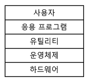

### 운영체제 목적
|||
|---|---|
|처리 능력(throughput)|일정 시간 내에 시스템이 처리하는 일의 양|
|반환 시간(Turn Around Time)|시스템에 작업을 의뢰한 시간부터 처리가 완료될 때까지 걸린 시간|
|사용 가능도(Acailability)|시스템을 사용할 필요가 있을 때 즉시 사용 가능한 정도|
|신뢰도(Reliability)|시스템이 주어진 문제를 정확하게 해결하는 정도|

### 운영체제 구성
#### 1) 제어 프로그램 (Control Program)
- 감시 프로그램(Supervisor Program)
    - 제어프로그램 중 가장 핵심적인 역할
    - 자원의 할당 및 시스템 전체의 작동 상태를 감시하는 프로그램
- 작업 관리 프로그램(Job Management Program)
    - 작업이 정상적으로 처리될 수 있도록 작업의 순서와 방법을 관리하는 프로그램
- 데이터 관리 프로그램(Data Management Program)
    - 작업에 사용되는 데이터와 파일의 표준적인 처리 및 전송을 관리하는 프로그램

#### 2) 처리 프로그램 (Processing Program)
- 언어 번역 프로그램
    - 사용자가 고급언어로 작성한 원시 프로그램을 기계어 형태의 목적 프로그램으로 변환시키는 것
    - 컴파일러, 어셈블러, 인터프리터
- 서비스 프로그램
    - 사용자가 컴퓨터를 더욱 효율적으로 사용할 수 있도록 제작된 프로그램
    - 분류/병합(Sort/Merge), 유틸리티 프로그램

### ⭐ 운영체제 기능
- 프로세서(처리기, Processor), 기억장치(주기억장치, 보조기억장치), 입 · 출력장치, 파일 및 정보 등의 자원을 관리
- 자원을 효율적으로 관리하기 위해 자원의 스케줄링 기능 제공
- 사용자와 시스템 간의 편리한 인터페이스 제공
- 시스템의 각종 하드웨어와 네트워크를 관리 · 제어
- 데이터를 관리, 데이터 및 자원의 공유 기능을 제공
- 시스템의 오류를 검사하고 복구
- 자원 보호 기능 제공
- 입 · 출력에 대한 보조 기능을 제공
- 가상 계산기 기능 제공

## 150. Windows
- 1990년대 마이크로소프트사가 개발한 운영체제

### ⭐ Windows 주요 특징
- 그래픽 사용자 인터페이스(GUI; Graphic User Interface)
    - 키보드로 명령어를 직업 입력하지 않고, 마우스로 아이콘이나 메뉴를 선택하여 모든 작업을 수행하는 방식
    - 초보자도 쉽게 사용
- 선점형 멀티태스킹(Preemptive Multi-Tasking)
    - 멀티태스킹을 하면서 운영체제가 각 작업의 CPU 이용 시간을 제어하여 응용 프로그램 실행 중 문제가 발생하면 해당 프로그램을 강제 종료시키고 모든 시스템 자원을 반환하는 방식
    - 하나의 응용 프로그램이 CPU를 독점하는 것을 방지할 수 있어 시스템 다운 현상없이 더욱 안정적인 작업 가능
- PnP(Plug and Play, 자동 감지 기능)
    - 컴퓨터 시스템에 프린터나 사운드 카드 등의 하드웨어를 설치했을 때, 해당 하드웨어를 사용하는 데 필요한 시스템 환경을 운영체제가 자동으로 구성해 주는 기능
    - 운영체제가 하드웨어의 규격을 자동으로 인식하여 동작하게 해주므로 PC 주변 장치를 연결할 때 사용자가 직접 환경을 설정하지 않아도 됨
    - 하드웨어와 소프트웨어 모두 PnP를 지원하여야 함
- OLE(Object Linking and Embedding)
    - 다른 여러 응용 프로그램에서 작성된 문자나 그림 등의 개체(Object)를 현재 작성 중인 문서에 자유롭게 연결(Linking)하거나 삽입(Embedding)하여 편집할 수 있게 하는 기능
- 255자의 긴 파일명
- Single-User 시스템

## 151. ⭐ UNIX / LINUX / MacOS
### UNIX의 개요 및 특징
- 1960년대 AT&T 벨(Bell)연구소, MIT, General Eletric이 공동 개발
- 시분할 시스템(Time Sharing System)을 위해 설계된 대화식 운영체제
- 소스가 공개된 개방형 시스템(Open System)
- 대부분 C언어로 작성되어 있어 이식성이 높으며 장치, 프로세스 간의 호환성이 높음
- 크기가 작고 이해하기 쉬움
- 다중 사용자(Multi-User), 다중 작업(Multi-Tasking) 지원
    - 여러 사용자가 동시에 시스템을 사용하고, 여러개의 작업이나 프로그램을 동시에 수행하는 것
    - 하나 이상의 작업을 백그라운드에서 수행하므로 여러 작업을 동시에 처리할 수 있음
- 통신망(Network) 관리용 운영체제로 적합
- 트리 구조의 파일 시스템을 갖음
- 전문적인 프로그램 개발에 용이
- 다양한 유틸리티 프로그램이 존재

### ⭐ UNIX 시스템 구성
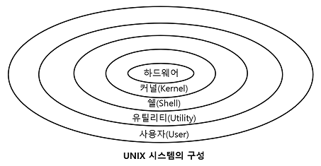

#### 1) 커널(Kernel)
- UNIX의 가장 핵심적인 부분
- 컴퓨터가 부팅될 때 주기억장치에 적재된 후 상주하면서 실행됨
- 하드웨어를 보호하고, 프로그램과 하드웨어 간의 인터페이스 역할 담당
- 프로세스(CPU 스케줄링)관리, 기억장치 관리, 파일 관리, 입 · 출력 관리, 프로세스 간 통신, 데이터 전송 및 변환 등 기능 수행

#### 2) 쉘(Shell)
- 사용자의 명령어를 인식하여 프로그램을 호출하고 명령을 수행하는 명령어 해석기
- 시스템과 사용자 간의 인터페이스 담당
- DOS의 COMMAND.COM과 같은 기능 수행
- 주기억장치에 상주하지 않고, 명령어가 포함된 파이 형태로 존재하며 보조 기억장치에서 교체 처리가 가능
- 파이프라인 기능을 지원하고 입 · 출력 재지정을 통해 출력과 입력의 방향을 변경할 수 있음
- 공용 Shell(Courne Shell, C Shell, Korn Shell)이나 사용자 자신이 만든 Shell을 사용할 수 있음

#### 3) Utility Program
- 일반 사용자가 작성한 응용 프로그램을 처리하는데 사용
- DOS에서의 외부 명령어에 해당
- 에디터, 컴파일러, 인터프리터, 디버거

> 💡 UNIX에서 프로세스 간 통신
> - 각 프로세스는 시스템 호출을 통해 커널의 기능을 사용
> - 시그널(Signal) : 간단한 메시지를 이용해 통신하는 것. 초기 UNIX 시스템에서 사용됨
> - 파이프(Pipe) : 한 프로세스의 출력이 다른 프로세스의 입력으로 사용되는 단방향 통신 방법
> - 소켓(Socket) : 프로세스 사이의 대화를 가능하게 하는 쌍방향 통신 방법

### LINUX의 개요 및 특징
- 1991년 리누스 토발즈(Linus Torvalds)가 UNIX를 기반으로 개발
- 무료 공개되어 있기에 프로그래머가 원하는 기능을 추가 가능
- 다양한 플랫폼에 설치하여 사용 가능
- 재배포가 가능
- UNIX와 완벽하게 호환
- 대부분의 특징이 UNIX와 동일

### MacOS의 개요 및 특징
- 1980년대 애플 사가 UNIX를 기반으로 개발
- 아이맥과 맥북 등 애플 사에서 생산하는 제품에서만 사용 가능
- 드라이버 설치 및 install과 uninstall 과정이 단순

> 💡 파일 디스크립터(File Descriptor, 파일 서술자)
> - 파일을 관리하기 위한 시스템이 필요로 하는 파일에 대한 정보를 가진 제어 블록
> - 파일 제어 블록(FCB; File Control Block)
> - 파일마다 독립적으로 존재
> - 시스템에 따라 다른 구조
> - 보조기억장치 내에 저장되어 있다가 해당 파일이 Open될 때 주기억장치로 옮겨짐
> - 파일 시스템이 관리하므로 사용자가 직접 참조 불가

## 152. ⭐ 기억장치 관리의 개요
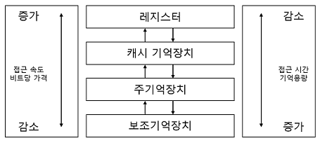
- 계층 구조에서 상위의 기억장치일수록 접근 속도와 접근 시간이 빠르지만, 기억 용량이 적고 고가
- 주기억장치는 각기 자신의 주소를 갖는 워드 또는 바이트들로 구성되어 있으며, 주소를 이용해 액세스 함
- 레지스터, 캐시 기억장치, 주기억장치의 프로그램과 데이터는 CPU가 직접 액세스 가능하나, 보조기억장치에 있는 프로그램이나 데이터는 직접 엑세스 불가
- 보조기억장치에 있는 데이터는 주기억장치에 적재된 후 CPU에 의해 액세스 됨

### ⭐ 기억장치 관리 전략의 개요
#### 1) 반입 (Fetch) 전략
- 보조기억장치에 보관중인 프로그램이나 데이터를 언제 주기억장치로 적재할 것인지 결정하는 전략
- 요구 반입(Demand Fetch) : 실행 중인 프로그램이 특정 프로그램이나 데이터 등의 참조를 요구할 때 적재
- 예상 반입(Anticipatory Fetch) : 실행 중인 프로그램에 의해 참조될 프로그램이나 데이터를 미리 예상하여 적재

#### 2) 배치 (Placement) 전략
- 새로 반입되는 프로그램이나 데이터를 주기억장치의 어디에 위치시킬 것인지 결정하는 전략
- 최초 적합(First Fit) : 빈 영역 중에서 첫 번째 분할 영역에 배치시키는 방법
- 최적 적합(Best Fit) : 빈 영역 중에서 단편화를 가장 작게 남기는 분할 영역에 배치시키는 방법
- 최악 적합(Worst Fit) : 빈 영역 중에서 단편화를 가장 많이 남기는 분할 영역에 배치시키는 방법

#### 3) 교체 (Replacement) 전략
- 주기억장치의 모든 영역이 이미 사용중인 상태에서 새로운 프로그램이나 데이터를 주기억장치에 배치하려고 할 때, 이미 사용되고 있는 영역 중에서 어느 영역을 교체하여 사용할 것인지 결정하는 전략
- FIFO, OPT, LRU, LFU, NUR, SCR 등

## 153. 주기억장치 할당 기법
- 프로그램이나 데이터를 실행시키기 위해 주기억장치에 어떻게 할당할 것인지
- ⭐ 연속 할당 기법
    - 프로그램을 주기억장치에 연속으로 할당하는 기법
    - 단일 분할 할당 기법 : 오버레이, 스와핑
    - 다중 분할 할당 기법 : 고정 분할 할당 기법, 동적 분할 할당 기법
- ⭐ 분산 할당 기법
    - 프로그램을 특정 단위의 조각으로 나누어 주기억장치 내에 분산하여 할당하는 기법
    - 페이징 기법, 세그멘테이션 기법

### ⭐ 단일 분할 할당 기법
- 주기억장치를 운영체제 영역과 사용자 영역으로 나누어 한 순간에는 오직 한 명의 사용자만이 주기억장치의 사용자 영역을 사용하는 기법
- 가장 단순한 기법
- 초기 운영체제에서 많이 사용하던 기법
- 운영체제를 보호하고, 프로그램이 사용자 영역만을 사용하기 위해 운영체제 영역과 사용자 영역을 구분하는 경계 레지스터(Boundary Register)가 사용
- 프로그램의 크기가 작은 경우 사용자 영역이 낭비
- 초기에는 주기억장치보다 큰 사용자 프로그램은 실행할 수 없었으나 오버레이 기법을 사용하면서 문제 해결됨
#### 1) 오버레이 (Overlay) 기법
- 주기억장치보다 큰 사용자 프로그램을 실행하기 위한 기법
- 보조기억장치에 저장된 하나의 프로그램을 여러 개의 조각으로 분할한 후 필요한 조각을 차례로 주기억장치에 적재하여 프로그램을 실행
- 프로그램이 실행되면서 주기억장치의 공간이 부족하면 주기억장치에 적재된 프로그램의 조각 중 불필요한 조각이 위치한 장소에 새로운 프로그램의 조각을 중첩(Overlay)하여 적재
- 프로그램을 여러 조각으로 분할하는 작업은 프로그래머가 수행해야 하므로 시스템 구조나 프로그램 구조를 알아야 함

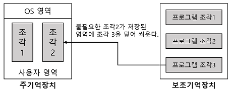

#### 2) 스와핑 (Swapping) 기법
- 하나의 프로그램 전체를 주기억장치에 할당하여 사용하다 필요에 따라 다른 프로그램과 교체하는 기법
- 주기억장치 → 보조기억장치 : Swap Out
- 보고기억장치 → 주기억장치 : Swap In
- 하나의 사용자 프로그램이 완료될 때까지 교체 과정을 여러번 수행할 수 있음
- 가상기억장치의 페이징 기법으로 발전됨

### 다중 분할 할당 기법
#### 1) 고정 분할 할당 (Multiple contiguous Fixed parTition allocation, MFT) 기법 = 정적 할당 (Static Allocation) 기법
- 프로그램을 할당하기 전에 운영체제가 주기억장치의 사용자 영역을 여러 개의 고정된 크기로 분할하고 준비상태 큐에서 준비중인 프로그램을 각 영역에 할당하여 수행하는 기법
- 프로그램을 실행하려면 프로그램 전체가 주기억장치에 위치해야함
- 프로그램이 분할된 영역보다 커서 영역 안에 들어갈 수 없는 경우가 발생할 수 있음
- 일정한 크기의 분할 영역에 다양한 크리의 프로그램이 하당되므로 내부 단편화 및 외부 단편화가 발생하여 주기억장치의 낭비가 많음
    - 내부 단편화 : 분할된 영역이 할당될 프로그램 크기보다 커서 할당된 후 사용되지 않고 남아 있는 빈 공간
    - 외부 단편화 : 분할됭 영역이 할당될 프로그램 크기보다 작아서 할당될 수 없어 사용되지 않고 빈 공간으로 남아있는 분할된 전체 영역
- 실행할 프로그램의 크기를 미리 알고 있어야 함
- 다중 프로그래밍을 위해 사용되었으나 현재는 사용하지 않음

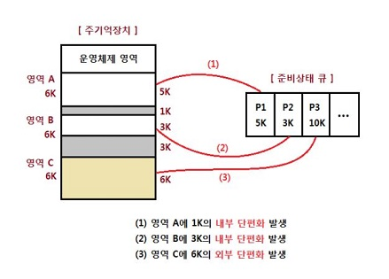

#### 2) 가변 분할 할당 (Multiple contifuous Variable parTition allocation, MVT) 기법 = 동적 할당 (Dynamic Allocation) 기법
- 단편화를 줄이기 위한것
- 미리 주기억장치를 분할해 높는 것이 아니라 프로그램을 주기억장치에 적재하면서 필요한 만큼의 크기로 영역을 분할하는 기법
- 주기억장치를 효율적으로 사용 가능
- 다중 프로그래밍의 정도를 높일 수 있음
- 고정 분할 할당 기법에 비해 실행될 프로세스 크기에 대한 제약이 적음
- 단편화를 상당 부분 해결할 수 있으나 영역과 영역 사이에 단편화가 발생될 수 있음

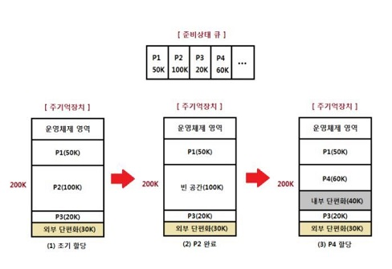

## 154. ⭐ 가상기억장치 구현 기법 / 페이지 교체 알고리즘
### 가상기억장치의 개요
- 보조기억장치(하드디스크)의 일부를 주기억장치처럼 사용하는 것
- 용량이 작은 주기억장치를 마치 큰 용량을 가진 것처럼 사용하는 기법
- 프로그램을 여러 개의 작은 블록 단위로 나누어서 가상기억장치에 보관해 놓고, 프로그램 실행 시 요구되는 블록만 주기억장치에 불연속적으로 할당
- 주기억장치의 용량보다 큰 프로그램을 실행하기 위해 사용
- 주기억장치의 이용률과 다중 프로그래밍 효율을 높일 수 있음
- 가상기억장치의 주소를 주기억장치의 주소로 바꾸는 주소 변환 작업 필요
    - 논리적인 가상주소를 물리적인 실기억주소로 변환하는 것
    - 주소 사상, 주소매핑
- 불록단위로 나누어 사용하므로 연속 할당 방식에서 발생할 수 있는 단편화를 해결

### ⭐ 페이징(Paging) 기법
- 가장기억장치에 보관되어 있는 프로그램과 주기억장치의 영역을 동일한 크기로 나눈 후 나눠진 프로그램(페이지)을 동일하게 나눠진 주기억장치의 영역(페이지 프레임)에 적재시켜 실행하는 기법
- 페이지(Page) : 프로그램을 일정한 크기로 나눈 단위
- 페이지 프레임(Page Frame) : 페이지 크기로 일정하게 나누어진 주기억장치의 단위
- 주소 변환을 위해 페이지의 위치 정보를 가지고 있는 페이지 맵 테이블(Page Map Table)이 필요
- 페이지 맵 테이블 사용으로 비용이 증가, 처리 속도 감소
- 외부 단편화 X, 내부 단편화 O

### ⭐ 세크먼테이션(Segmentation) 기법
- 가상기억장치에 보관되어 있는 프로그램을 다양한 크기의 논리적인 단위로 나눈 후, 주기억장치에 정재시켜 실행시키는 기법
- 세그먼트(Segment) : 프로그램을 배열이나 함수 들과 같은 논리적인 크기로 나눈 단위
- 각 세그먼트는 고유한 이름과 크기를 갖음
- 기억장치의 사용자 관점을 보존하는 기억장치 관리 기법
- 기억공간을 절약하기 위해서 사용
- 주소 변환을 위해 세그먼트가 존재하는 위치 정보를 가지고 있는세그먼트 맵 테이블(Segment Map Table)이 필요
- 주기억장치에 적재될 때 다른 세그먼트에게 할당된 영역을 침범할 수 없음 → 기억장치 보호키(Storage Protection Key) 필요
- 내부 단편화 X, 외부 단편화 O

 

💡 세그먼테이션 기법의 일반적인 주소 변환

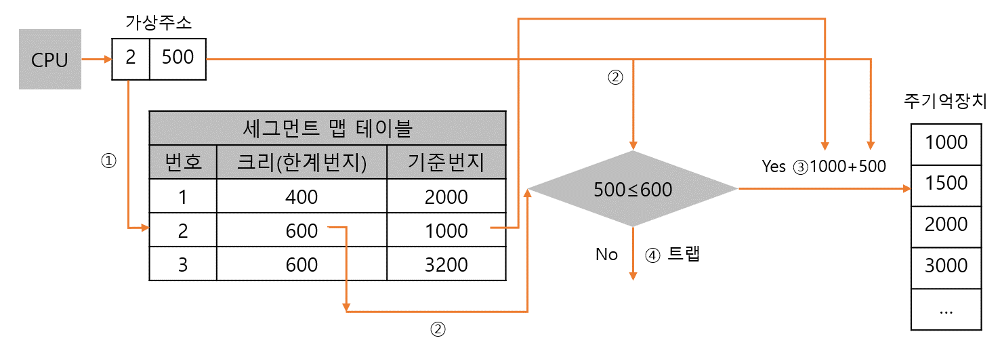
① 가상주소의 세그먼트 번호를 세그먼트 맺 테이블에서 해당 세그먼트의 기준번지와 세그먼트 크기 구하기. 세그먼트 번호는 세그먼트 맵 테이블에 대한 색인으로 사용됨 
② 가상 주소의 변위값과 세그먼트의 크기를 비교 
③ 변위값이 작거나 같으면 기준번지와 변위값을 더하여 실기억주소를 만들어 주기억장치를 액세스 
④ 변위값이 크면 다른 영역을 침범하게 되므로 실행 권한을 운영체제에게 넘기고 트랩을 발생시킴(현재 찾는 세그먼트의 위치가 해당 세그먼트의 크기(한계번지)를 초과하였다는 의미)

### ⭐ 페이지 교체 알고리즘
- 페이지 부재(Page Fault)가 발생했을 때, 주기억장치의 모든 페이지 프레임이 사용중이면 어떤 페이지 프레임을 선택하여 교체할 것인지 결정하는 기법

#### 1) OPT (OPTimal replacement, 최적 교체)
- 앞으로 가장 오랫동안 사용하지 않을 페이지를 교체하는 기법
- 벨레이디(Belady) 제안
- 페이지 부재 획수가 가장 적게 발생하는 가장 효율적인 알고리즘

#### 2) FIFO (First In First Out)
- 각 페이지에가 주기억장치에 정재될 때마다 그때의 시간을 기억시켜 가장 먼저 들어와서 가장 오래 있었던 페이지를 교체하는 기법
- 이해하기 쉽고, 프로그래밍 및 설계가 간단

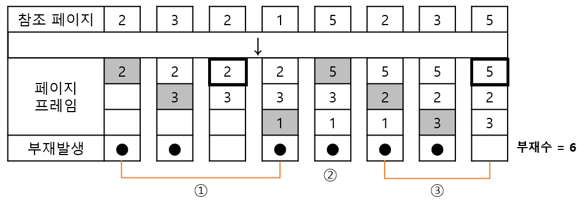
① 참조 페이지를 각 페이지 프레임에 차례로 적재시키되 이미 적재된 페이지는 해당 위치의 페이지 프레임을 사용 
② 사용할 페이지 프레임이 없을 경우 가장 먼저 들어와서 오래 있었던 페이지 2를 제거한 후 5를 적재 
③ 적재된 페이지 3을 제거한 후 2를 적재하며, 같은 방법으로 나머지 참조 페이지 수행

#### 3) LRU (Least Recently Used)
- 가장 최근에 가장 오랫동안 사용하지 않은 페이지를 교체하는 기법
- 각 페이지마다 계수기(Counter)나 스택(Stack)을 두어 현 시점에서 가장 오랫동안 사용하지 않은, 즉 가장 오래 전에 사용된 페이지 교체

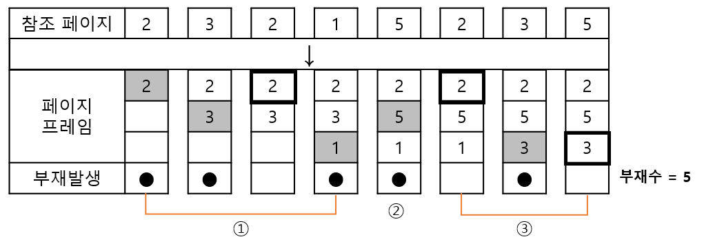
① 참조 페이지를 각 페이지 프레임에 차례로 적재시키ㅚ 이미 적재된 페이지는 해당 위치의 페이지 프레임 사용 
② 사용할 페이지 프레임이 없을 경우 현재 시점에서 가장 오랫동안 사용되지 않은 페이지 3을 제거 후 5를 적재 
③ 같은 방법으로 나머지 참조 페이지 수행

#### 4) LFU (Least Frequently Used)
- 사용 빈도가 가장 적은 페이지를 교체하는 기법
- 활발하게 사용되는 페이지는 사용 횟수가 많아 교체되지 않고 사용됨

#### 5) NUR (Not Used Recently)
- LRU와 비슷한 알고리즘
- 최근에 사용하지 않은 페이지를 교체하는 기법
- 최근에 사용되지 않은 페이지는 향후에도 사용되지 않을 가능성이 높다는 것을 전체로 LRU에서 나타나는 시간적인 오버헤트를 줄임
- 최근의 사용 여부를 확인하기 위해 각 페이지마다 참조비트(Reference Bit)와 변형비트(Modified Bit, Dirty Bit)가 사용됨

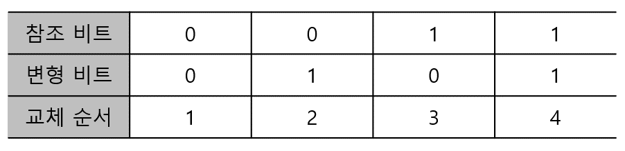

#### 6) SCR (Second Change Replacement, 2차 기회 교체)
- 가장 오랫동안 주기억장치에 있던 페이지 중 자주 사용되는 페이지의 교체를 방지하기 위한 것
- FIFO 기법의 단점 보완

## 155. ⭐ 가상기억장치 기타 관리 사항
### ⭐ 페이지 크기
#### 1) 페이지 크기가 작을 경우
- 페이지 단편화 감소
- 한 개의 페이지를 주기억장치로 이동하는 시간이 줄어듦
- 불필요한 내용이 주기억장치에 적재될 확률이 적으므로 효율적인 워킹 셋을 유지
- Locality에 더 일치할 수 있기 때문에 기억장치 효율이 높아짐
- 페이지 정보를 갖는 페이지 맵 테이블의 크기가 커지고, 매핑 속도가 늦어짐
- 디스크 접근 횟수가 많아져서 전체적인 입 · 출력 시간이 늘어남

#### 2) 페이지 크기가 클 경우
- 페이지 정보를 갖는 페이지 맵 테이블의 크기가 작아지고, 매핑 속도가 빨라짐
- 디스크 접근 횟수가 줄어들고 전체적인 입 · 출력 효율성이 증가
- 페이지 단편화 증가
- 한 개의 페이지를 주기억장치로 이동하는 시간이 늘어남
- 프로세스(프로그램) 수행에 불필요한 내용까지도 주기억장치에 적재될 수 있음

### ⭐ Locality (국부성, 지역성, 구역성, 국소성)
- 프로세스가 실행되는 동안 주기억장치를 참조할 때 일부 페이지만 집중적으로 참조하는 성질이 있다는 이론
- 스래싱을 방지하기 위한 워킹 셋 이론의 기반
- 프로세스가 집중적으로 사용하는 페이지를 알아내는 방법 중 하나 → 가상기억장치 관리의 이론적인 근거
- 데닝(Denning)교수에 의해 구역성의 개념이 증명되었으며 캐시 메모리 시스템의 이론적 근거
#### 1) 시간 구역성(Temporal Locality)
- 프로세스가 실행되면서 하나의 페이지를 일정 시간 동안 집중적으로 액세스 하는 현상
- 한 번 참조한 페이지는 가까운 시간 내에 계속 참조할 가능성이 높음을 의미
- 시간 구역성이 이루어지는 기억 장소 : Loop(반복, 순환), 스택(Stack), 부 프로그램(Sub Program), Counting(1씩 증감), 집계(Totaling)에 사용되는 변수(기억장소)

#### 2) 공간 구역성(Spatial Locallity)
- 프로세스 실행 시 일정 위치의 페이지를 집중적으로 액세스 하는 현상
- 어느 하나의 페이지를 참조하면 그 근처의 페이지를 계속 참조할 가능성이 높음을 의미
- 공간 구역성이 이루어지는 기억장소 : 배열 순회(Array Traversal, 배열순례), 순차적 코드 실행, 프로그래머들이 관련된 변수(데이터를 저장할 기억자소)들을 서로 근처에 선언하여 할당되는 기억장소, 같은 영역에 있는 병수를 참조할 때 사용

### ⭐ 워킹 셋(Working Set)
- 프로세스가 일정 시간동안 자주 참조하는 페이지들의 집합
- 데닝(Denning)이 제안한 프로그램의 움직임에 대한 모델
- 프로그램의 Locality 특징을 이용
- 자주 참조되는 워킹 셋을 주기억장치에 상주시킴으로써 페이지 부재 및 페이지 교체 현상이 줄어들어 프로세스의 기억장치의 사용이 안정됨
- 시간이 지남에 따라 자주 참조하는 페이지들의 집합이 변화하기 때문에 워킹 셋은 시간에 따랑 변경됨

### 페이지 부재 빈도 방식
- 프로세스 실행 시 참조할 페이지가 주기억장치에 없는 현상
- 페이지 부재 빈도(PFF; Page Fault Frequency) : 페이지 부재가 일어나는 횟수
- 페이지 부재율(Page Fault Rate)에 따라 주기억장치에 있는 페이지 프레임의 수를 늘리거나 줄여 페이지 부재율을 적정 수준으로 유지하는 방식
- 운영체제는 프로세스 실행 초기에 임의의 페이지 프레임을 할당하고, 페이지 부재율을 지속적으로 감시하다가 주재율이 상한선을 넘어가면 좀 더 많은 페이지 프레임을 할당하고, 부재율이 하한선을 넘어가면 페이지 프레엠을 회수하는 방식
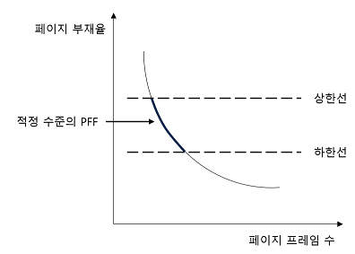

### 프리페이징 (Prepaging)
- 처음의 과도한 페이지 부재를 방지하기 위해 필요할 것 같은 모든 페이지를 한꺼번에 페이지 프레임에 적재하는 기법
- 기억장치에 들어온 페이지들 중에서 사용되지 않는 페이지가 많을 수도 있음

### ⭐ 스래싱 (Thrashing)
- 프로세스의 처리 시간보다 페이지 교체에 소요되는 시간이 더 많아지는 현상
- 다중 프로그래밍 시스템이나 가상기억장치를 사용하는 시스템에서 하나의 프로세스 수행 과정 중 자주 페이지 부재가 발생함으로써 나타나는 현상
- 전체 시스템의 성능 저하
- 다중 프로그래밍의 정도가 높아짐에 따라 CPU의 이용률은 어느 특정 시점까지는 높아지지만, 다중 프로그래밍의 정도가 더욱 커지면 스래싱이 나타나고, CPU의 이용률을 급격히 감소
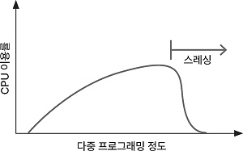

> 💡 스래싱 현상 방지 방법
> - 다중 프로그래밍의 정도를 적정 수준으로 유지
> - 페이지 부재 빈도(Page Fault Frequency)를 조절하여 사용
> - 워킹 셋을 유지
> - 부족한 자원을 증설, 일부 프로세스 중단
>- CPU 성능에 대한 자료의 지속적 관리 및 분석으로 임계치를 예상하여 운영

## 156. ⭐ 프로세스 (Process)의 개요
### 프로세스의 정의
- 프로세서(처리기, CPU)에 의해 처리되는 사용자 프로그램, 시스템 프로그램, 즉 실행중인 프로그램을 의미
- 작업(Job), 태스크(Task)라고 함
- PCB를 가진 프로그램
- 실기억장치에 저장된 프로그램
- 프로세서가 할당되는 실체로서, 디스패치가 가능한 단위
- 프로시저가 활동중인 것
- 비동기적 행위를 일으키는 주체
- 지정된 결과를 얻기 위한 일련의 계통적 동작
- 목적 또는 결과에 따라 발생되는 사건들의 과정
- 운영체제가 관리하는 실행단위

### ⭐ PCB (Process Control Block, 프로세스 제어 블록)
- 운영체제가 프로세스에 대한 중요한 정보를 저장해 놓는 곳
- Task Control Block, Job Control Block
- 각 프로세스가 생성될 때마다 고유의 PCB가 생성되고, 프로세스가 완료되면 PCB는 제거됨

> 💡 PCB 저장된 정보
> - 프로세스 현재 상태 : 준비, 대기, 실행 등 프로세스 상태
> - 포인터 : 프로세스가 위치한 메모리에 대한 포인터, 할당된 자원에 대한 포인터
> - 프로세스 고유 식별자
> - 스케줄링 및 프로세스의 우선순위
> - CPU 레지스터 정보 : Accumulator(누산기), 인덱스 레지스터, 범용 레지스터, 프로그램 카운터
> - 주기억장치 관리 정보 : 기준 레지스터, 페이지 테이블
> - 입 · 출력 상태 정보
> - 계정정보 : CPU 사용시간, 실제 사용시간, 한정된 시간

### ⭐ 프로세스 상태 전이
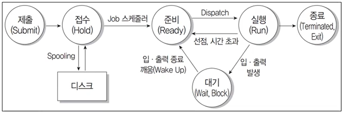
#### 제출(Submit)
- 작업을 처리하기 위해 사용자가 작업을 시스템에 제출한 상태
#### 접수(Hold)
- 제출된 작업이 스풀 공간인 디스크의 할당 위치에 저장된 상태
#### 준비(Ready)
- 프로세스가 프로세서를 항당받기 위해 기다리고 있는 상태
- 프로세스는 준비상태 큐에서 실행을 준비
- 접수 상태에서 준비 상태로의 전이는 Job 스케줄러에 의해 수행
#### 실행(Run)
- 준비상태 큐에 있는 프로세스가 프로세서를 할당받아 실행되는 상태
- 프로세스 수행이 완료되지 전에 프로세스에게 주어진 프로세서 할당 시간이 종료(Timer Run Out)되면 프로세스는 준비 상태로 전이
- 실행 중인 프로세스에 입 · 출력(I/O) 처리가 필요하면 실행 중인 프로세스는 대기 상태로 전이
- 준비 상태에서 실행 상태로의 전이는 CPU(프로세서) 스케줄러에 의해 수행
#### 대기(Wait), 보류, 블록(Block)
- 프로세스에 입 · 출력 처리가 필요하면 현재 실행 중인 프로세스가 중단되고, 입 · 출력 처리가 완료될 때까지 대기하고 있는 상태
#### 종료(Terminated, Exit)
- 프로세스의 실행이 끝나고 프로세스 할당이 해제된 상태

#### Dispatch
- 준비 상태에서 대기하고 있는 프로세스 중 하나가 프로세서를 할당받아 실행 상태로 전이되는 과정
#### Wake Up
- 입 · 출력 작업이 완료되어 프로세스가 대기 상태에서 준비 상태로 전이되는 과정
#### Spooling
- 입 · 출력장치의 공유 및 상대적으로 느린 입 · 출력장치의 처리 속도를 보완
- 다중 프로그래밍 시스템의 성능을 향상시키기 위해 입 · 출력할 데이터를 집적 입 · 출력장치에 보내지 않고 나중에 한꺼번에 입 · 출력하기 위해 디스크에 저장하는 과정
#### 교통량 제어기(Traffic Controller)
- 프로세스의 상태에 대한 조사와 통보를 담당

### ⭐ 스레드 (Thread) = 경량 프로세스 (Light Weight)
- 프로세스 내에서의 작업 단위
- 시스템의 여러 자원을 할당받아 실행하는 프로그램의 단위
- 단일 스레드 : 하나의 프로세스에 하나의 스레드
- 다중 스래드 : 하나 이상의 스레드
- 스레드는 독립적인 스케줄링의 최소단위로서 프로세스의 역할을 담당
- 동일 프로세스 환경에서 서로 독립적인 다중 수행 가능
- 사용자 수준의 스레드
    - 사용자가 만든 라이브러리를 사용하여 스레드를 운용
    - 커널 모드로의 전환이 없어 오버헤드가 줄어듦
    - 속도는 빠르지만 구현이 어려움
- 커널 수준의 스레드
    - 운영체제의 커널에 의해 스레드를 운용
    - 한 프로세스가 운영체제를 호출할 때 전체 프로세스가 대기하지 않으므로 시스템의 성능 높일 수 있음
    - 여러 스레드가 커널에 동시에 접근
    - 스레드의 독립적인 스케줄링 가능
    - 구현이 쉽지만 속도가 느림
- 장점
    - 하나의 프로세스를 여러 개의 스레드로 생성하여 병행성 증진
    - 하드웨어, 운영체제의 성능과 응용 프로그램의 처리율 향상
    - 응용 프로그램의 응답 시간(Response Time)을 단축
    - 실행 환경을 공유해 기억장소의 낭비가 줄어듦
    - 프로세스들 간의 통신 향상
    - 공통적으로 접근 가능한 기억장치를 통해 효율적으로 통신

## 157. 스케줄링
- 프로세스가 생성되어 실행될 때 필요한 시스템의 여러 자원을 해당 프로세스에게 할당하는 작업
- 프로세스가 생성되어 완료될 때까지 프로세스는 여러 종류의 스케줄링 과정을 거침
#### 1) 장기 스케줄링 = 작업 스케줄링(Job Scheduling), 상위 스케줄링
- 어떤 프로세스가 시스템의 자원을 차지할 수 있도록 할 것인가 결정하여 준비상태 큐로 보내는 작업
- 작업 스케줄러에 의해 수행됨

#### 2) 중기 스케줄링
- 어떤 프로세스들이 CPU를 할당받을 것인지 결정하는 작업
- CPU를 할당받으려는 프로세스가 많을 경우 프로세스를 일시 보류시킨 후 활성화해서 일시적으로 부하 조절

#### 3) 단기 스케줄링 = 프로세서 스케줄링(Processor Scheduling), 하위 스케줄링
- 프로세스가 실행되기 위해 CPU를 할당받는 시기와 특정 프로세스를 지정하는 작업
- 프로세서 스케줄링 및 문맥 교환을 프로세서 스케줄러에 의해 수행

> 💡 문맥 교환
> - 하나의 프로세스에서 다른 프로세스로 CPU가 할당되는 과정에서 발생하는 것
> - 새로운 프로세스에 CPU를 할당하기 위해 현재 CPU가 할당된 프로세스의 상태 정보를 저장
> - 새로운 프로세스의 상태 정보를 설정한 후 CPU를 할당하여 실행되도록 하는 작업

### ⭐ 프로세스 스케줄링 기법
#### 1) 비선점(Non-Preemptive) 스케줄링
- 이미 할당된 CPU를 다른 프로세스가 강제로 빼앗아 사용할 수 없는 스케줄링 기법
- 프로세스가 CPU를 할당 받으면 해당 프로세스가 완료될 때까지 CPU를 사용
- 모든 프로세스에 대한 요구를 공정하게 처리
- 프로세스 응답 시간의 예측이 용이
- 일괄 처리 방식 적합
- 중요한 작업(짧은 작업)이 중요하지 않은 작업(긴 작업)을 기다리는 경우가 발생할 수 있음
- **FCFS, SJF, 우선순위, HRN, 기한부**

#### 2) 선점(Preemptive) 스케줄링
- 하나의 프로세스가 CPU를 할당받아 실행하고 있을 때 우선순위가 높은 다른 프로세스가 CPU를 강제로 빼앗아 사용할 수 있는 스케줄링 기법
- 우선순위가 높은 프로세스를 빠르게 처리
- 주로 빠른 응답 시간을 요구하는 대화식 시분할 시스템에 사용
- 많은 오버헤드(Overhead) 초래
- 선점이 가능하도록 일정 시간 배당에 대한 인터럽트용 타이머 클록이 필요
- **Round Robin, DRT, 선점 우선순위, 다단계 큐, 다단계 피드백 큐**

## 158. ⭐ 주요 스케줄링 알고리즘
### FCFS (First Come First Service, 선입 선출) = FICO (First In First Out)
- 준비상태 큐(대기 큐, 준비 완료 리스트, 작업준비 큐, 스케줄링 큐)에 도착한 순서에 따라 CPU를 할당
- 가장 간단한 알고리즘
- 공평성을 유지되지만 짧은 잡업이 긴 작업을, 중요한 작업이 중요하지 않은 작업을 기다림
- 대기 시간 : 프로세스가 대기한 시간, 바로 앞 프로세스까지의 진행시간으로 계산
- 반환 시간 : 프로세스의 대기 시간과 실행 시간의 합
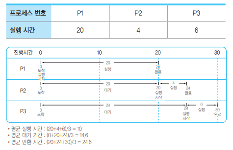

### SJF (Shortest Job First, 단기 작업 우선)
- 준비상태 큐에서 기다리고 있는 프로세스들 중에서 실행 시간이 가장 짧은 프로세스에게 먼저 CPU를 할당
- 가장 적은 평균 대기 시간을 제공하는 최적 알고리즘
- 실행시간이 긴 프로세스는 실행시간이 짧은 프로세스에게 할당 순위가 밀려 무한 연기 상태 발생할 수 있음
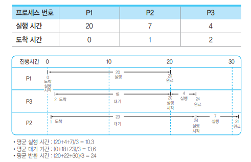

### HRN (Hightest Response-ratio Next)
- 실행시간이 긴 프로세스에 불리한 SJF 기법을 보완
- 대기 시간과 서비스(실행) 시간을 이용
- 우선순위 계산 공식을 이용해 서비스(실행) 시간이 짧은 프로세스나 대기 시간이 긴 프로세스에게 우선순위를 주어 CPU 할당
- 서비스 실행 시간이 짧거나 대기 시간이 긴 프로세스일 경우 우선순위가 높아짐
- 우선순위를 계산하여 그 숫자가 가장 높은 것부터 낮은 순으로 우선순위 부여

## 159. 환경변수 (Environment Variable)
- 시스템 소프트웨어의 동작에 영향을 미치는 동적인 값
- 변수명과 값으로 구성
- 시스템의 기본 정보 저장
- 자식 프로세스에 상속됨
- 시스템 전반에 걸ㄹ쳐 적용되는 시스템 환경변수와 사용자 계정 내에서만 적용되는 사용자 환경 변수로 구분

### Windows의 주요 환경 변수
- set으로 값 출력
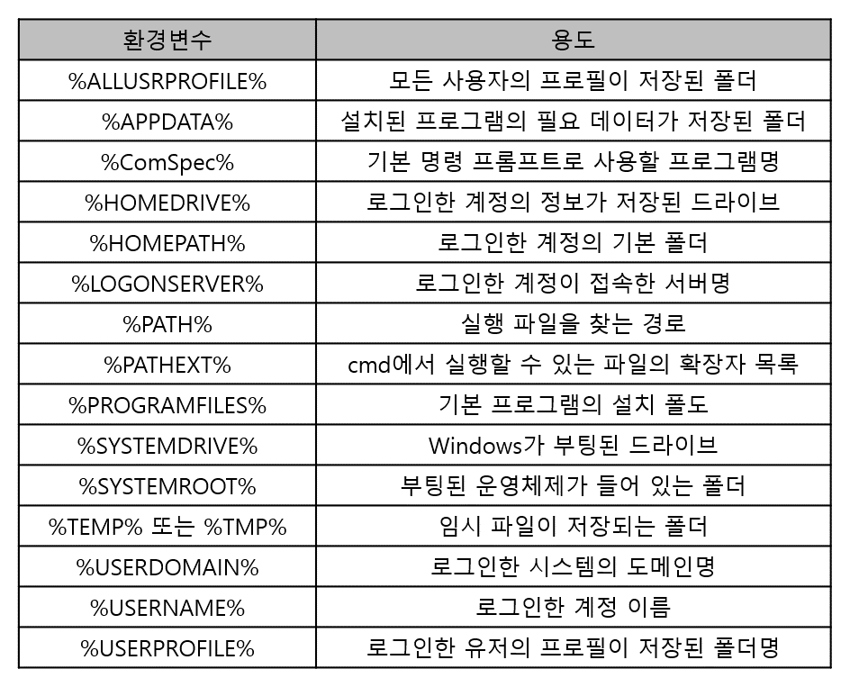

### UNIX / LINUX의 주요 환경변수
- set, env, printenv, setenv로 값 출력
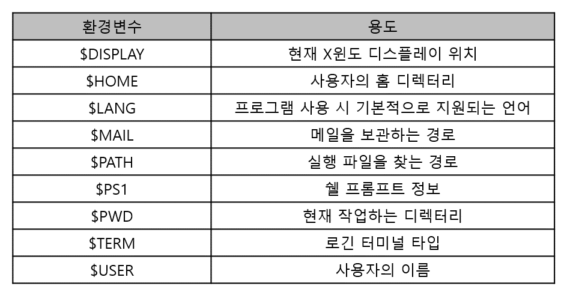

## 160. 운영체제 기본 명령어
- CLI(Command Line Interface) : 키보드로 명령어를 직접 입력하여 작업을 수행하는 사용자 인터페이스
- GUT(Graphic User Interface) : 마우스로 아이콘이나 메뉴를 선택하여 작업을 수행하는 그래픽 사용자 인터페이스

### Windosws 기본 명령어
- CLI : 명령 프롬ㅍ트창에 명령어 입력하여 작업 수행
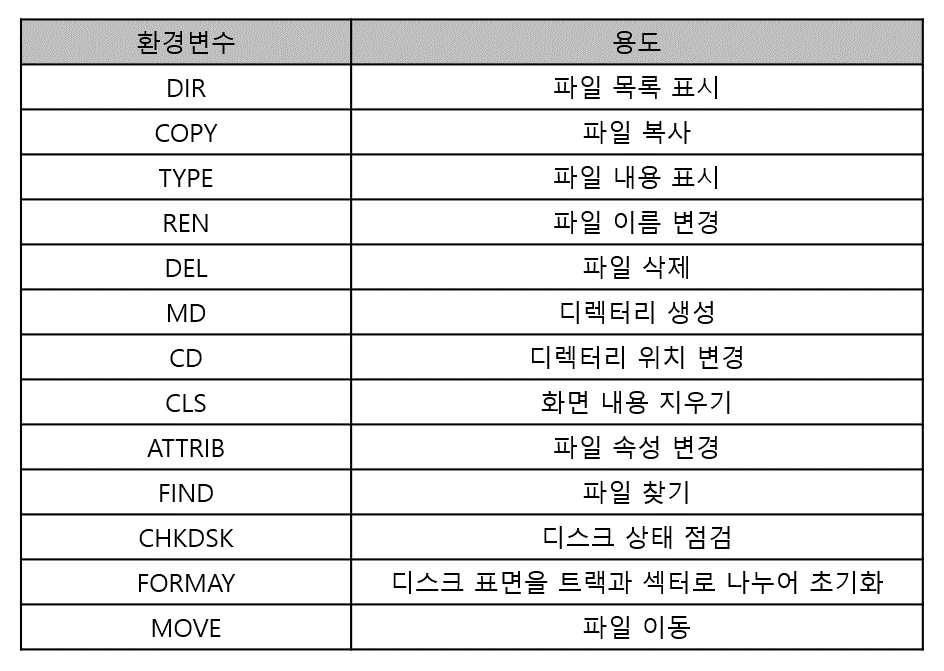

- GUI : 더블클릭하여 프로그램 실행, 파일 복사 및 이동, 제어판 기능 실행 등 모든 작업

### UNIX / LINUX 기본 명령어
- 쉘(Shell)에 명령어 입력
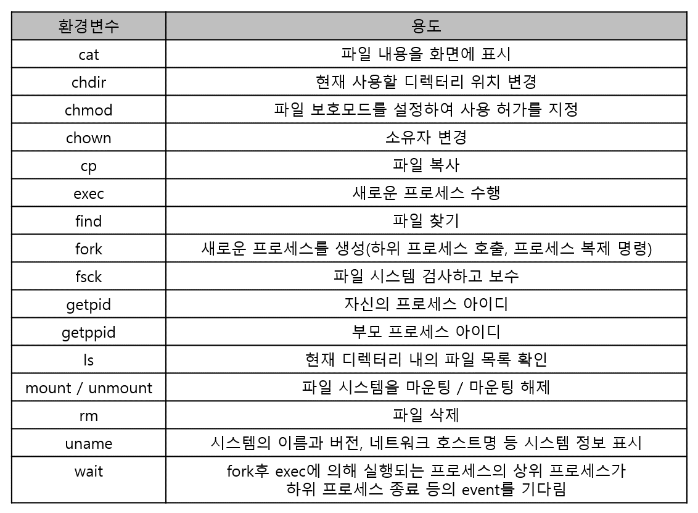

## 161. ⭐ 인터넷
- TCP/IP 프로토콜을 기반으로 하여 전 세계 컴퓨터와 네트워트들이 연결된 광범위한 컴퓨터 통신망
- 미 국방성 ARPANET에서 시작
- 유닉스 운형체제 기반
- 시간과 장소에 구애받지 않고 정보 교환
- 컴퓨터는 고유한 IP 주소를 갖음
- 네트워크를 서로 연결하기 위해 브리지, 라우터, 게이트웨이가 사용
- 백본(Backbone)
    - 다른 네트워크 또는 같은 네트워크를 연결하여 중추적 역할을 하는 네트워크
    - 보통 인터넷의 주가 되는 기간망

### ⭐ IP 주소 (Internet Protocol Address)
- 인터넷에 연결된 모든 컴퓨터 자원을 구분하기 위한 고유한 주소
- 숫자 8비트씩 4부분, 총 32비트로 구성
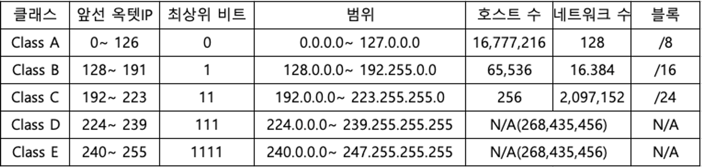
- Class A : 국가나 대형 통신망에 사용(0~127)
- Class B : 중대형 통신망에 사용(128~191)
- Class C : 소규모 통신망에 사용(192~223)
- Class D : 멀티캐스트용으로 사용(224~239)
- Class E : 실험적 주소이며 공용되지 않음

### ⭐ 서브네팅 (Subnetting)
- 할당된 네트워크 주소를 다시 여러 개의 작은 네트워크로 나누어 사용하는 것
- 서브넷 마스크(Subnet Mask) : 4바이트의 IP 주소 중 네트워크 주소와 호스트 주소를 구분하기 위한 비트
- 서브넷 마스크는 각 클래스마다 다르게 사용

### ⭐ IPv6 (Internet Protocol version 6)
- IPv4의 주소 부족 문제를 해결하기 위해 개발
- 128비트의 긴 주소를 사용
- IPv4에 비해 자료 전송 속도 빠름
- 인증성, 기밀성, 데이터 무경성의 지원으로 보안 문제 해결
- IPv4 호환성 뛰어남
- 주소의 확장성, 융통성, 연동성 뛰어남
- 실시간 흐름 제어로 향상된 멀티미디어 기능 지원
- Traffic Class, Flow Label을 이용해 등급별, 서비스별 패킷을 구분할 수 있어 품질 보장이 용이
    - Traffic Class : IPv6 패킷의 클래스나 우선순위를 나타내는 필드
    - Flow Label : 네트워크 상에서 패킷들의 흐름에 대한 특성을 나타내는 필드
- 패킷 크기를 확장할 수 있으므로 패킷 크기 제한 없음
- 기본 헤더 뒤에 확장 헤더를 더함으로써 더욱 다양한 정보 저장 가능 → 네트워크 기능 확장 용이
- 미리 예약된 알고리즘을 통해 고유성이 보장된 주소를 자동으로 구성 → 자동으로 네트워크 환경 구성 가능

### ⭐ IPv6 구성
- 16비트씩 8부분, 총 128비트로 구성
- 각 부분 16진수로 표현, 콜론으로 구분
- 주소체계
    - 유니캐스트(Unicast) : 단일 송신자와 단일 수신자 간의 통신(1 대 1 통신에 사용)
    - 멀티캐스트(Multicast) : 단일 송신자와 다중 수신자 간의 통신(1 대 다 통신에 사용)
    - 애니캐스트(Anycast) : 단일 송신자와 가장 가까이 있는 단일 수신자 간의 통신(1 대 1 통신에 사용)

### 도메인 네임(Domain Name)
- 숫자로된 IP 주소를 사람이 이해하기 쉬운 문자 형태로 표현한 것
    - www.naver.com
- 왼쪽에서 오른쪽으로 갈수록 상위 도메인을 의미
- DNS(Domain Name System) : 문자로 된 도메인 네임을 컴퓨터가 이해할 수 있는 IP주소로 변환하는 역할

## 162. ⭐ OSI 참조 모델
- 다른 시스템 간의 원활한 통신을 위해 ISO(국제표준화기구)에서 제안한 통신 규약(Protocol)
- 개방형 시스템(Open system) 간의 데이터 통신 시 필요한 장비 및 처리방법을 7단계로 표준화하여 규정
- 1 ~ 3 하위계층 : 물리 계층 → 데이터 링크 계층 → 네트워크 계층
- 4 ~ 7 상위계층 : 전송 계층 → 세션 계층 → 표현 계층 → 응용 계층

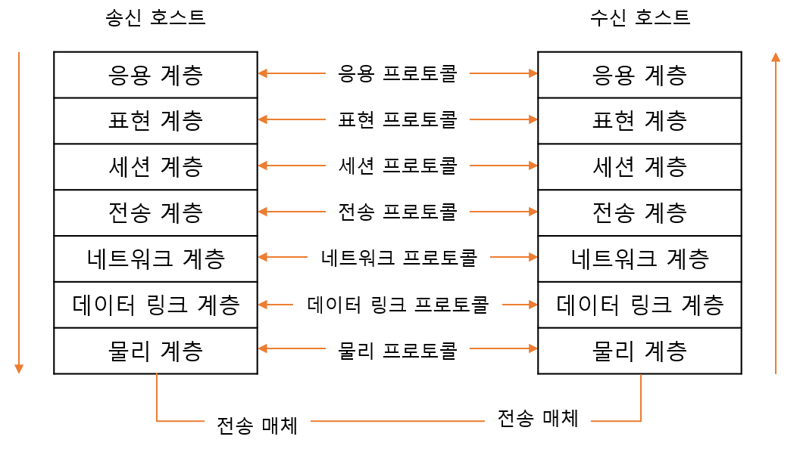

### ⭐ OSI 참조 모델의 목적
- 서로 다른 시스템 간을 상호 접속하기 위한 개념을 규정
- OSI 규격을 개발하기 위한 범위 정함
- 관련 규정의 적합성을 조절하기 위한 공통적 기반 제공

### OSI 참조 모델에서의 데이터 단위
#### 1) 프로토콜 데이터 단위 (PDU; Protocol Data Unit)
- 동일 계층 간에 교환되는 정보 단위
- 물리 계층 : 비트
- 데이터 링크 계층 : 프레임
- 네트워크 계층 : 패킷
- 전송 계층 : 세그먼트
- 세션, 표현, 응용 계층 : 메시지

#### 2) 서비스 데이터 단위 (SDU; Service Data Unit)
-  서비스 접근점(SAP)을 통해 상 · 하위 계층끼리 주고받는 정보 단위

### 물리 계층 (Physical Layer)
- 전송에 필요한 두 장치 간의 실제 접속과 절단 등 기계적, 전기적, 기능적, 절차적 특성에 대한 규칙 정의
- 물리적 전송 매체와 전송 신호 방식을 정의
    - RS-232C, X.21
- 관련 장비 : **리피터, 허브**

### 데이터 링크 계층 (Data Link Layer)
- 두 개의 인접한 개발 시스템들 간에 신뢰성 있고 효율적인 정보 전송을 할 수 있도록 시스템 간 연결 설정과 유지 및 종료 담당
- 송신 측과 수신 측의 속도 차이를 해결하기 위한 **흐름 제어 기능**
- 프레임의 시작과 끝을 구분하기 위한 **프레임 동기화 기능**
- 오류 검출과 회복을 위한 **오류 제어 기능**
- 프레임의 순서적 전송을 위한 **순서 제어 기능**
- HDLC, LAPB, LLC, MAC, LAPD, PPP
- 관련 장비 : **랜카드, 브리지, 스위치**

### 네트워크 계층 (Network Layer, 망 계층)
- 개방 시스템 간의 네트워크 연결을 관리하는 기능과 데이터의 교환 및 중계 기능
- 네트워크 연결을 설정, 유지, 해제하는 기능
- 발신지와 목적지의 논리 주소가 추가된 패킷을 최종 목적지까지 전달하는 책임
- 경로 설정(Rounting), 데이터 교환 및 중계, 트래픽 제어, 패킷 정보 전송을 수행
- X.25, IP
- 관련 장비 : **라우터**

### 전송 계층 (Transport Layer)
- 논리적 안정과 균일한 데이터 전송 서비스 제공
- 종단 시스템(End-to-End) 간에 투명한 데이터 전송 가능
- OSI 계층 중 하위 3계층과 상위 3계층의 인터페이스 담당
- 종단 시스템(End-to-End) 간의 전송 연결 설정, 데이터 전송, 연결 해제 기능
- 주소 설정, 다중화(분할 및 재조립), 오류 제어, 흐름 제어
- TCP, UDP
- 관련 장비 : 게이트웨이

### 세션 계층(Session Layer)
- 송 · 수신 측 간의 관련성을 유지하고 대화 제어 담당
- 대화(회화) 구성 및 동기 제어, 데이터 교환 관리 기능
- 송 · 수신 측 간의 데이터 전송, 연결 해제, 동기 처리 등의 대화를 관리하기 위해 토큰 사용
- 송 · 수신 측 간의 대화 동기를 위해 전송하는 정보의 일정한 부분에 체크점을 두어 정보의 수신 상태 체크 → 동기점(Synchronization Point)
- 동기점은 오류가 있는 데이터의 회복을 위해 사용
    - 소동기점 : 하나의 대화 단위 내에서 데이터의 전달을 제어하는 역할. 수신 측에서 확인 신호(ACK)를 받지 않음
    - 대동기점 : 전송하는 각 데이터의 처음과 끝에 사용하여 전송하는 단위를 대화 단위로 구성. 확인 신호(ACK) 받음

### 표현 계층 (Presentation Layer)
- 응용 계층으로부터 받은 데이터를 세션 계층에 보내기 전에 통신에 적당한 형태로 변환
- 세션 계층에서 받은 데이터는 응용 계층에 맞게 변환
- 서로 다른 데이터 표현 형태를 갖는 시스템 간의 상호 접속을 위해 필요한 계층
- 코드 변환, 데이터 암호화, 데이터 압축, 구문 검색, 정보 형식(포맷) 변환, 문맥 관리 기능

### 응용 계층 (Application Layer)
- 사용자(응용 프로그램)가 OSI 환경에 접근할 수 있도록 서비스 제공
- 응용 프로세스 간의 정보 교환, 전자 사서함, 파일 전송, 가상 터미널

## 163. ⭐ 네트워크 관련 장비
### 네트워크 인터페이스 카드(NIC; Network Interface Card)
- 컴퓨터와 컴퓨터 또는 컴퓨터와 네트워크를 연결하는 장치
- 정보 전송 시 정보가 케이블을 통해 전송될 수 있도록 정보 형태를 변경
- 이더넷 카드(LAN카드), 네트워크 어댑터라고 함

### 허브 (Hub) - 물리계층
- 사무실이나 가까운 거리의 컴퓨터들을 연결하는 장치
- 각 회선을 통합적으로 관리
- 신호 증폭 기능을 하는 리피터 역할
#### 1) 더미허브(Dummy hub)
- 네트워크에 흐르는 모든 데이터를 단순히 연결하는 기능만 제공
- LAN이 보유한 대역폭을 컴퓨터 수만큼 나누어 제공
    - ex) 100MB 대역폭을 5개의 컴퓨터에 제공한다면 각 컴퓨터는 20MB(100/5)의 대역폭을 사용
- 네트워크에 연결된 각 노드를 물리적인 성형 구조로 연결
#### 2) 스위칭 허브(Switching Hub)
- 네트워크상에 흐르는 데이터의 유무 및 흐름을 제어하여 각 노드가 허브의 최대 대역폭을 사용할 수 있는 지능형 허브
- 최근에 사용되는 허브는 대부분 스위칭 허브

### 리피터 (Repeater) - 물리계층
- 전송되는 신호가 전송 선로의 특성 및 외부 충격 등의 요인으로 인해 원래의 형태와 다르게 왜곡되거나 약해질 경우 원래의 신호 형태로 재생하여 다시 전송하는 역할
- 근접한 네트워크 사이에 신호를 전송하는 역할
- 전송 거리 연장 또는 배선의 자유도를 높이기 위한 용도로 사용

### 브리지 (Bridge) - 데이터 링크 계층
- LAN과 LAN을 연결
- LAN 안에서 컴퓨터 그룹(세그먼트)을 연결
- MAC(Media Access Contro) 계층에서 사용되므로 MAC 브리지라고도 함
- 네트워크 상의 많은 단말기들에 의해 발생되는 트래픽 병목 현상 줄임
- 네트워크를 분산적으로 구성할 수 있어 보안성 높음
- 서브넷(Subnet) 구성 시 전송 가능한 회선 수는 브리지가 n개일 때, n(n-1)/2개

### 스위치 (Switch) - 데이터 링크 계층
- 브리지와 같이 LAN과 LAN 연결해 더 큰 LAN을 만드는 장치
- 하드웨어 기반으로 전송속도 빠름
- 포드마다 각기 다른 전송 속도를 지원하도록 제어
- 수십에서 수백 개의 포트 제공

### 라우터 (Rounter) - 네트워크 계층
- 브리지와 같이 LAN과 LAN의 연결 기능에 데이터 전송의 최적 경로를 선택할 수 있는 기능 추가
- 서로 다른 LAN이나 LAN과 WAN의 연결도 수행
- 접속 가능한 경로에 대한 정보를 라우팅 제어표에 저장하여 보관
- 3계층(네트워크 계층)까지의 프로토콜 구조가 다른 네트워크 간의 연결을 위해 프로토콜 변환 기능 수행

> 💡 브라우터 (Brounter)
> - 브리지와 라우터 기능을 모두 수행
> - 브리지 기능 : 네트워크 분리
> - 라우터 기능 : 외부 네트워크에 연결

### 게이트웨이 (Gateway) - 전송 계층
- 전 계층(1~7계층)의 프로토콜 구조가 다른 네트워크의 연결 수행
- 세션 계층, 표현 계층, 응용 계층 간의 연결하여 데이터 형식 변환, 주소 변환, 프로토콜 변환 등 수행
- LAN에서 다른 네트워크에 데이터를 보내거나 다른 네트워크로부터 데이터를 받아들이는 출입구 역할

> 💡 전처리기(FEP; Front End Processor)
> - 통신 회선 및 단말장치 제어, 메시지의 조립과 분해, 전송 메시지 검사 등을 미리 수행하여 컴퓨터 부담을 줄여주는 역할
> - 호스트 컴퓨터와 단말장치 사이에 고속 통신 회선으로 설치됨

## 164. 프로토콜의 개념
- 서로 다른 기기들 간의 데이터 교환을 원활하게 수행할 수 있도록 표준화시켜 높은 통신 규약
- 통신을 제어하기 위한 표준 규칙과 절차의 집합으로 하드웨어와 소프트웨어, 문서를 모두 규정

### ⭐ 프로토콜 기본 요소
- 구문(Syntax) : 전송하고자 하는 데이터 형식, 부호화, 신호 레벨 등 규정
- 의미(Semantics) : 두 기기 간의 효율적이고 정확한 정보 전송을 위한 협조 사항과 오류 관리를 위한 제어 정보 규정
- 시간(Timing) : 두 기기 간의 통신 속도, 메시지 순서 제어 등 규정

### ⭐ 프로토콜 기능
- 단편화와 재결합(Fragmentation & Reassembly)
    - 단편화 : 송신 측에서 전송할 데이터를 전송에 알맞은 크기의 작은 블록으로 자르는 작업
    - 재결합 : 수신 측에서 단편화된 블록을 원래의 데이터로 모으는 것
    - 프로토콜 데이터 단위(PDU; Protocol Data Unit) : 단편화를 통해 세분화된 데이터 블록
    - 단편화 시 전송시간 빠르고, 통신 중의 오류를 효과적으로 제어 가능
    - 너무 작은 블록으로 단편화할 경우, 재결합 시 처리 시간이 길어지고, 실제 데이터 외의 부수적인 데이터가 많아지므로 비 효율적
- 캡슐화(Encapsulation) - 요약화
    - 단편화된 데이터에 송 · 수신지 주소, 오류 검출 코드, 프로토콜 기능을 구현하기 위한 프로토콜 제어 정보 등의 정보를 부가하는 것
    - 데이터 링크 제어 프로토콜의 HDLC 프레임
    - 정보 데이터를 오류 없이 정확하게 전송하기 위해 캡슐화 수행
- 흐름 제어(Flow Control)
    - 수신 측의 처리 능력에 따라 송신 측에서 손신하는 데이터 전송량이나 전송 속도를 조절하는 기능
    - 정지-대기(Stop-and-Wait), 슬라이딩 윈도우(Sliding Window) 방식 이용
- 오류 제어(Error Control)
    - 전송 중에 발생하는 오류를 검출, 정정하여 데이터나 제어 정보의 파손에 대비하는 기능
- 동기화(Synchronization)
    - 송 · 수신 측이 같은 상태를 유지하도록 타이밍(Timing)을 맞추는 기능
- 순서 제어(Sequencing)
    - 전송되는 데이터 블록(PDU)에 전송 순서를 부여하는 기능
    - 연결 위주의 데이터 전송 방식에만 사용 → 가상 회선 방식
    - 손신 데이터들이 순서적으로 전송되도록 함으로써 흐름 제어 및 오류 제어를 용이하게 하는 기능
- 주소 지정(Addressing)
    - 데이터가 목적지까지 정확하게 전송될 수 있도록 목적지 이름, 주소, 경로를 부여하는 기능
    - 목적지 이름 : 전송할 데이터가 가리키는 곳
    - 주소 : 목적지의 위치
    - 경로 : 목적지에 도착할 수 있는 방법
- 다중화(Multiplexing)
    - 한 개의 통신 회선을 여러 가입자들이 동시에 사용하도록 하는 기능
- 경로 제어(Rounting)
    - 송 · 수신 측 간의 송신 경로 중에서 최적의 패킷 교환 경로를 설정
- 전송 서비스
    - 전송하려는 데이터가 사용하도록 하는 별도의 부가 서비스
    - 우선순위 : 특정 메시지를 최대한 빠른 시간 안에 목적지로 전송하기 위해 메시지 단위에 우선순위를 부여하여 우선순위가 높은 메시지가 먼저 도착하도록 함
    - 서비스 등급 : 데이터의 요구에 따라 서비스 등급을 부여하여 서비스
    - 보안성 : 액세스 제한과 같은 보안체제를 구현

## 165. ⭐ TCP/IP (Transmission Control Protocol/Internet Protocol)
- 인터넷에 연결된 서로 다른 기종의 컴퓨터들이 데이터를 주고받을 수 있도록 하는 표준 프로토콜
- 1960년 말 ARPA에서 개발 → ARPANET(1972)에서 사용하기 시작
- UNIX의 기본 프로토콜로 사용
- 현재 인터넷 범용 프로토콜로 사용
- TCP 프로토콜과 IP 프로토콜 결합

#### ⭐ 1) TCP 프로토콜 - OSI 전송 계층
- 신뢰성 있는 연결형 서비스 제공
- 패킷의 다중화, 순서 제어, 오류 제어, 흐름 제어 기능 제공
- 스트림(Stream) 전송 기능 제공
- TCP 헤더에는 Source/Destination Port Number, Sequence Number, Acknowledgment Number, Checksum 포함

> 💡 연결형(접속 통신)
> - 송 · 수신 측 간을 논리적으로 연결한 후 데이터를 전송하는 방식
> - 가상 회선 방식
> - 데이터 전송의 안정성과 신뢰성이 보장되지만, 연결 설정 지연이 일어나며, 회선 이용률이 낮아질 수 있음

#### ⭐ 2) IP 프로토콜 - OSI 네트워크 계층
- 데이터그램을 기반으로 하는 비연결형 서비스 제공
- Best Effort 원칙에 따른 전송 기능 제공
- 패킷의 분해/조립, 주소 지정, 경로 선택 기능 제공
- 헤어 길이는 최소 20Byte, 최대 60Byte
- IP 헤더에는 Version, Header Length, Total Packet Length, Header Checksum, Source IP Address, Destination IP Address 포함

> 💡 비연결형(비접속) 통신
> - 송 · 수신 측 간에 논리적 연결 없이 데이터를 독립적으로 전송하는 방식
> - 데이터그램 방식

### ⭐ TCP/IP 구조

### ⭐ 응용 계층의 주요 프로토콜
- FTP(File Transfer Protocol)
    - 컴퓨터와 컴퓨터, 컴퓨터와 인터넷 사이에서 파일을 주고받을 수 있도록 하는 원격 파일 전송 프로토콜
- SMTP(Simple Mail Transfer Protocol)
    - 전자 우편을 전송하는 프로토콜
- TELNET
    - 멀리 떨어져 있는 컴퓨터에 접속하여 자신의 컴퓨터처럼 사용할 수 있도록 해주는 서비스
    - 프로그램을 실행하는 등 시스템 관리 작업을 할 수 있는 가상의 터미널 기능 수행
- SNMP(Simple Network Management Protocol)
    - TCP/IP의 네트워크 관리 프로토콜
    - 라우터나 허브 등 네트워크 기기의 네트워크 정보를 네트워크 관리 시스템에 보내는 데 사용되는 표준 통신 규약
- DNS(Domain Name System)
    - 도메인 네임을 IP 주소로 매핑하는 시스템
- HTTP(Hyper Text Transfer Protocol)
    - 월드 와이드 웹(WWW)에서 HTML 문서를 송수신하기 위한 표준 프로토콜
- MQTT(Message Queuing Telemetry Transport)
    - 발행-구독 기반의 메시징 프로토콜
    - IoT 환경에서 자주 사용

### ⭐ 전송 계층의 주요 프로토콜
- TCP(Transmission Control Protocol)
    - 양방향 연결(Full Duplex Connextion)형 서비스 제공
    - 가상 회선 연결(Virtual Circuit Connection) 현태의 서비스 제공
    - 스트림 위주의 전달(패킷 단위)
    - 신뢰성 있는 경로를 확립하고 메시지 전송을 감동
    - 순서 제어, 오류 제어, 흐름 제어 기능
    - 패킷 분실, 손상, 지연이나 순서가 틀린 것 등이 발생할 때 투명성이 보장되는 통신 제공
    - TCP 프로토콜의 헤더는 기본적을 20Byte ~ 60Byte까지 사용
    - 선택적으로 40Byte를 더 추가할 수 있으므로 최대 100Byte까지 크기 확장 가능
- UDP(User Datagram Protocol)
    - 데이터 전송 전에 연결을 설정하지 않는 비연결형 서비스 제공
    - TCP에 비해 상대적으로 단순한 헤더 구조
    - 오버헤드가 적음
    - 흐름 제어나 순서 제어가 없어 전송속도 빠름
    - 고속의 안정성 있는 전송 매체를 사용해 빠른 속도를 필요로 하는 경우
    - 동시에 여러 사용자에게 데이터를 전달할 경우
    - 정기적으로 반복해서 전송할 경우
    - 실시간 전송에 유리
    - 신뢰성보다는 속도가 중요시되는 네트워크에서 사용
    - UDP 헤더에는 Source Port Number, Destination Port Number, Length, Checksum 포함
- RTCP(Real-Time Control Protocol)
    - RTP(Real-Time Protocol) 패킷의 전송 품질을 제어하기 위한 제어 프로토콜
    - 세션에 참여한 각 참여자들에게 주기적으로 제어 정보 전송
    - 하위 프로토콜은 데이터 패킷과 제어 패킷의 다중화를 제공
    - 데이터 전송을 모니터링하고 최소한의 제어와 인증 기능만 제공
    - 항상 32비트의 경계로 끝남

### ⭐ 인터넷 계층의 주요 프로토콜
- IP(Internet Protocol)
    - 전송할 데이터에 주소를 지정하고, 경로를 설정하는 기능
    - 비연결형인 데이터그램 방식을 사용하는 것으로 신뢰성 보장 안됨
- ICMP(Internet Control Message Protocol, 인터넷 제어 메시지 프로토콜)
    - IP와 조합하여 통신 중에 발생하는 오류의 처리와 전송 경로 변경 등을 위한 제어 메시지를 관리하는 역할
    - 헤더는 8Byte로 구성
- IGMP(Internet Group Management Protocol, 인터넷 그룹 관리 프로토콜)
    - 멀티 캐스트를 지원하는 호스트나 라우터 사이에서 멀티 캐스트 그룹 유지를 위해 사용
- ARP(Address Resolution Protocol, 주소 분석 프로토콜)  
    - 호스트의 IP 주소를 호스트와 연결된 네트워크 접속 장치의 물리적 주소(MAX Address)로 바꿈
- RARP(Reverse Address Resoultion Protocol)
    - ARP와 반대로 물리적 주소를 IP주소로 변환하는 기능

### ⭐ 네트워크 액세스 계층의 주요 프로토콜
- Ethernet(IEEE 802.3)
    - CSMA/CD 방식의 LAN
- IEEE 802
    - LAN을 위한 표준 프로토콜
- HDLC
    - 비트 위주의 데이터 링크 제어 프로토콜
- X.25
    - 패킷 교환망을 통한 DTE와 DCE 간의 인터페이스를 제공하는 프로토콜
- RS-232C
    - 공중전화 교환망(PSTN)을 통한 DTE와 DCE 간의 인터페이스를 제공하는 프로토콜

 

# Reference
- 정보처리기사 필기 (시나공)
- https://m.blog.naver.com/syunjae21/222202539627
- https://catsbi.oopy.io/f565e8c1-34c6-4b61-be61-e1ab04fc51fb
