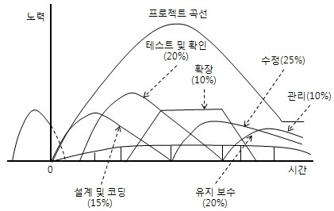
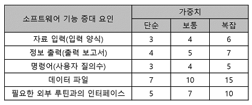
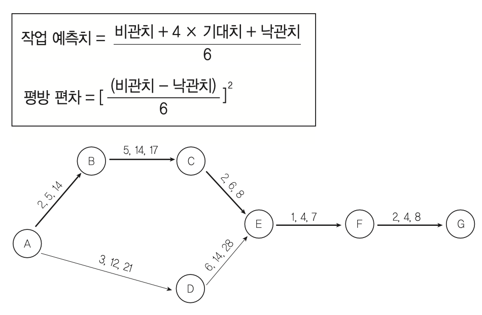
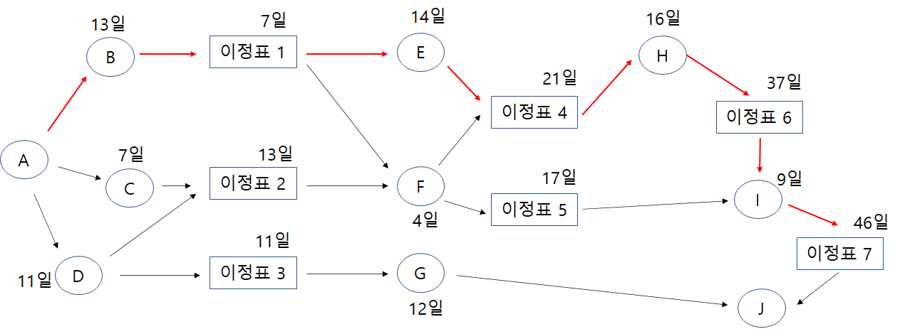
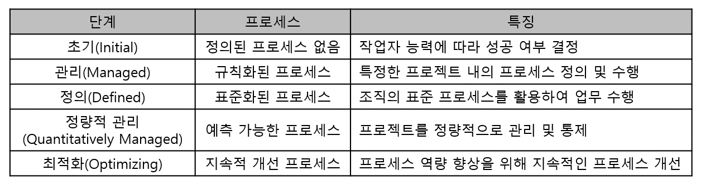
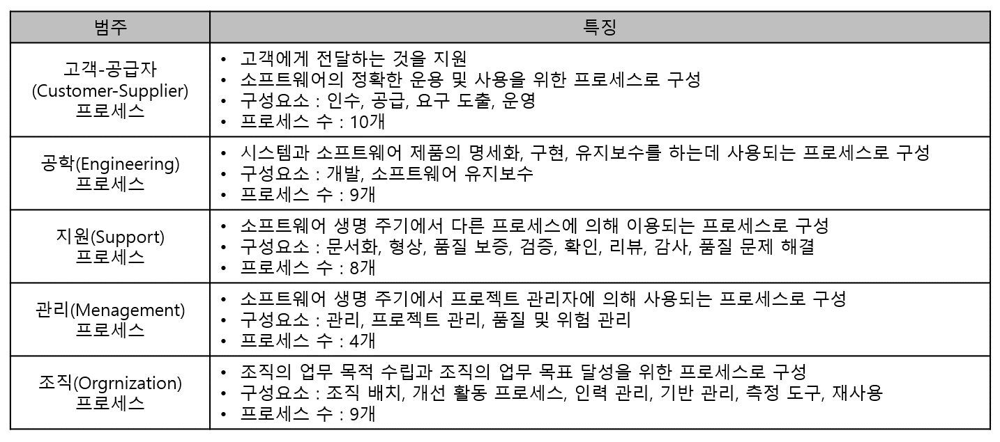
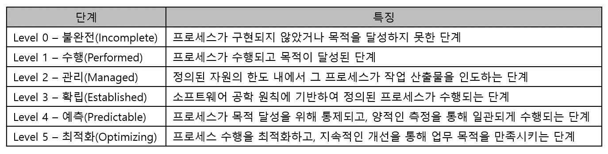

# 1. 소프트웨어 개발 방법론 활용
## 166. 소프트웨어 개발 방법론
- 소프트웨어 개발, 유지보수 들에 필요한 여러 가지 일들의 수행방법과 효율적으로 수행하려는 과정에서 필요한 각종 기법 및 도구를 체계적으로 정리하여 표준화 한 것
- 소프트웨어의 생산성과 품질 향상이 목적

### 구조적 방법론
- 정형화된 분석 절차에 따라 사용자 요구사항을 파악해 문서화하는 처리(Process) 중심의 방법론
- 1960년대 까지 가장 많이 적용되었던 소프트웨어 개발 방법론
- 쉬운 이해 및 검증이 가능한 프로그램 코드를 생성하는 것이 목적
- 복잡한 문제를 다루기 위해 분할과 정복(Divide and Conquer) 원리 적용
> 타당성 검토 단계 → 계획 단계 → 요구사항 단계 → 설계 단계 → 구현 단계 → 시험 단계 → 운용/유지보수 단계

### 정보공학 방법론
- 정보 시스템의 개발을 위해 계획, 분석, 설계, 구축에 정형화된 기법들을 상호 연관성 있게 통합 및 적용하는 자료(Data) 중심의 방법론
- 정보 시스템 개발 주기를 이용해 대규모 정보 시스템을 구축하는데 적합
- 개체 관계도(ERD)를 사용
> 정보 전략 계획 수립 단계 → 업무 영역 분석 단계 → 업무 시스템 설계 단계 → 업무 시스템 구축 단계

### 객체지향 방법론
- 현실 세계의 개체(Entity)를 기계의 부품처럼 하나의 객체(Object)로 만들어 소프트웨어를 개발할 때 기계의 부품을 조립하듯이 객체들을 조립해서 필요한 소프트웨어를 구현하는 방법론
- 구조적 기법의 문제점 해결책
- 설계 과정에서 패키지 다이어그램(Package Diagram), 배치 다이어그램(Deployment Diagram), 상태 전이도(State Transition Diagram) 주로 사용
> 요구 분석 단계 → 설계 단계 → 구현 단계 → 테스트 및 검증 단계 → 인도 단계

### 컴포넌트 기반 (CBD; Component Based Development) 방법론
- 기존의 시스템이나 소프트웨어를 구성하는 컴포넌트를 조합하여 하나의 새로운 애플리케이션을 만드는 방법론
- 컴포넌트의 재사용(Reusability)이 가능하여 시간과 노력을 절감
- 새로운 기능을 추가하는 것이 간단해 확장성 보장
- 유지보수 비용을 최소화하고 생산성 및 품질 향상
> 개발 준비 단계 → 분석 단계 → 설계 단계 → 구현 단계 → 테스트 단계 → 전개 단계 → 인도 단계

💡 분석 단계의 표준 산출물 → 사용자 요구사항 정의서

### 애자일 (Agile) 방법론
- '민첩한', '기민한'
- 고객의 요구사항 변화에 유연하게 대응할 수 있도록 일정한 주기를 반복하면서 개발과정을 진행하는 방법론
- 소규모 프로젝트, 고도로 숙달된 개발자, 급변하는 요구사항에 적합
- 익스트림 프로그래밍(XP; eXtreme Programming), 스크럼(Scrum), 칸반(Kanban), 크리스탈(Crytal)
> 사용자 스토리 → 계획 → 개발 → 승인 테스트 (계획, 개발, 승인 테스트 반복)

### 제품 계열 방법론
- 특정 제품에 적용하고 싶은 공통된 기능을 정의하여 개발하는 방법론
- 임베디드 소프트웨어
- 영역공학 : 영역 분석, 영역 설계, 핵심 자산 구현
- 응용공학 : 제품 요구 분석, 제품 설계, 제품 구현
- 영역공학과 응용공학의 연계를 위해 제품의 요구사항, 아키텍처, 조립 생산이 필요

❓ 그림 넣기

## 167. S/W 공학의 발전적 추세
### 소프트웨어 재사용 (Software Reuse)의 개요
- 이미 개발되어 인정받은 소프트웨어의 전체 혹은 일부분을 다른 소프트웨어 개발이나 유지에 사용하는 것
- 개발의 품질과 생산성을 높이기 위한 방법
- 기존에 개발된 소프트웨어와 경험, 지식 등을 새로운 소프트웨어에 적용
- 재사용의 이점
    - 개발 시간과 비용 단축
    - 품질 향상
    - 개발의 생산성 향상
    - 프로젝트 실패의 위험 감소
    - 시스템 구축 방법에 대한 지식을 공유
    - 시스템 명세, 설계, 코드 등 문서를 공유

### 소프트웨어 재사용 방법
#### 1) 합성 중심 (Composition-Based) = 블록 구성 방법
- 전자 칩과 같은 소프트웨어 부품, 즉 블록(모듈)을 만들어 끼워 맞추어 소프트웨어를 완성시키는 방법
#### 2) 생성 중심 (Generation-Based) = 패턴 구성 방법
- 추상화 형태로 쓰여진 명세를 수체화하여 프로그램을 만드는 방법

### 소프트웨어 재공학 (Software Reengineering)의 개요
- 새로운 요구에 맞도록 기존 시스템을 이용하여 보다 나은 시스템을 구축하고, 새로운 기능을 추가하여 소프트웨어 성능을 향상시키는 것
- 유지보수 비용이 소프트웨어 개발 비용의 대부분을 차지하는 문제를 염두에 두어 기존 소프트웨어의 데이터와 기능들의 개조 및 개성을 통해 유지보수성과 품질을 향상시키려는 기술
- 기존 소프트웨어 기능을 개조하거나 개선하므로 예방(Preventive) 유지보수 측면에서 소프트웨어 위기를 해결하는 방법
- 소프트웨어 수명이 연장
- 소프트웨어 기술 향상
- 소프트웨어 개발기간 단축
- 발생할 수 있는 오류 줄어듦
- 비용이 절감

💡 주요 활동
- 분석(Analysis)
    - 기존 소프트웨어의 명세서를 확인하여 소프트웨어의 동작을 이해하고, 재공학할 대상을 선정하는 활동
- 재구성(Restrructuring)
    - 기존 소프트웨어의 구조를 향상시키기 위해 코드를 재구성하는 활동
    - 소프트웨어의 기능과 외적인 동작은 바뀌지 않음
- 역공학(Reverse Engineering)
    - 기존 소프트웨어를 분석하여 소프트웨어 개발과정과 데이터 처리 과정을 설명하는 분석 및 설계 정보를 재발견하거나 다시 만들어내는 활동
    - 일반적인 개발 단계와는 반대 방향으로 기존 코드를 복구하거나, 기존 소프트웨어의 구성 요소, 관계를 파악하여 설계도를 추출
- 이식(Migration)
    - 기존 소프트웨어를 다른 운영체제나 하드웨어 환경에서 사용할 수 있도록 변환하는 활동

### CASE (Computer Aided Software Engineering)의 개요
- 요구분석, 설계, 구현, 검사 및 디버깅 과정 전체 또는 일부를 컴퓨터와 전용 소프트웨어 도구를 사용해 자동화하는 것
- 객체지향 시스템, 구조적 시스템 등 다양한 시스템에서 활용되는 자동화 도구
- 공통 모듈을 사용할 수 있어 재사용성을 향상시킴
- 유지보수가 간편해짐
- 소프트웨어 개발 도구와 방법론이 결합된 것
- 정형화된 구조 및 방법(매커니즘)을 소프트웨어 개발에 적용하여 생산성 및 품질 향상을 구현하는 공학기법
- 개발의 모든 단계에 걸쳐 일관된 방법론을 제공하는 자동화 도구들을 지원
- 개발자들은 개발의 표준화를 지향하며, 자동화의 이점을 얻을 수 있음
- 상위 CASE 도구 : 요구 분석, 설계 과정을 지원
- 하위 CASE 도구 : 구현, 테스트 과정을 지원
- CASE 주요기능
    - 소프트웨어 생명 주기 전 단계 연결
    - 다양한 소프트웨어 개발 모형 지원
    - 그래픽 지원
    - 모델들의 모순 검사 및 오류 검증
    - 자료 흐름도 작성
- CASE 원천 기술
    - 구조적 기법
    - 프로토타이핑
    - 자동 프로그래밍
    - 정보 저장소
    - 분산처리

## 168. 비용 산정 기법
### 소프트웨어 비용 산정의 개요
- 소프트웨어의 개발 규모를 소요되는 인원 ,자원, 기간 들으로 확인하여 실행 가능한 계획을 수립하기 위해 필요한 비용을 산정하는 것
- 높은 비용 선정 : 예산 낭비, 일의 효율성 저하
- 낮은 비용 선정 : 개발자 부담 가중, 품질 문제 발생

### 소프트웨어 비용 결정 요소
- 프로젝트 요소
    - 제품 복잡도
    - 시스템 크기
    - 요구되는 신뢰도
- 자원 요소
    - 인적 자원
    - 하드웨어 자원
    - 소프트웨어 자원
- 생산성 요소
    - 개발자 능력
    - 개발 기간

## 169. 비용 산정 기법 - 하향식
- 과거의 유사한 경험을 바탕으로 전문 지식이 많은 개발자들이 참여한 회의를 통해 비용을 산전하는 비과학적인 방법
- 프로젝트 전체 비용을 산정한 후, 각 작업별로 비용을 세분화

### 1) 전문가 감정 기법
- 조직 내에 있는 경험이 많은 두 명 이상의 정문가에게 비용 산정을 의뢰하는 기법
- 가장 편기하고 신속하게 비용 산정
- 의뢰자로부터 믿음을 얻을 수 있음
- 새로운 프로젝트에는 과거의 프로젝트와 다른 요소들이 있다는 것을 간과할 수 있음
- 새로운 프로젝트와 유사한 프로젝트에 대한 경험이 없을 수 있음
- 개인적이고 주관적

### 2) 델파이 기법
- 전문가 감정 기법의 주관적인 편경을 보완
- 많은 전문가의 의견을 종합하여 산정하는 기법
- 한 명의 조정자와 여러 전문가로 구성

## 170. 비용 상정 기법 - 상향식
- 프로젝트의 세부적인 작업 단위별로 비용을 산정한 후 집계하여 전체 비용을 산정하는 방법

### 1) LOC (원시 코드 라인수, source Line Of Code) 기법
- 원시 코드 라인 수의 비관치(가장 많이 측정된 코드 라인 수), 낙관치(가장 적게 측정된 코드 라인 수), 기대치(측정된 모든 코드 라인 수의 평균)를 측정하여 예측치를 구하고 비용을 산정하는 기법
- 측정이 용이하고 이해하기 쉬워 가장 많이 사용됨
- 예측치를 이용해 생산성, 노력, 개발 기간 등의 비용 산정

예측치 = (a + 4m + b) / 6 (a: 낙관치, b: 비관치, m: 기대치(중간치))

### 2) 개발 단계별 인월수 (Effort Per Task) 기법
- LOC 기법 보완
- 각 기능을 구현시키는 데 필요한 노력을 생명 주기의 각 단계별로 산정
- LOC 기법보다 더 정확

## 171. 수학적 산정 기법 = 경험적 추정 모형, 실험적 추정모형
- 상향식 비용 산정 기법임
- 개발 비용 산정의 자동화를 목표
- 과거 유사한 프로젝트를 기반으로 하여 경험적으로 유도된 것

### 1) COCOMO (COnstructive COst MOdel) 모형
- 보헴(Boehm) 제안
- 원시 프로그램의 규모인 LOC에 의한 비용 산정 기법
- 개발할 소프트웨어의 규모(LOC)를 예측한 후 소프트웨어 종류에 따라 다르게 책정되는 비용 산정 방정식에 대입하여 비용 산정
- 비교적 작은 규모의 프로젝트들을 통계 분석한 결과를 반영한 모델
- 중소 규모 소프트웨어 프로젝트 비용 추정에 적합
- 같은 규모의 프로그램이라도 성격에 따라 비용이 다르게 산정됨
- 비용 산정 결과는 프로젝트는 완성하는 데 필요한 노력(Man-Month)로 나타냄

💡 COCOMO의 소프트웨어 개발 유형
- 조직형(Organic Mode)
    - 기관 내부에서 개발된 중 · 소규모의 소프트웨어로 일괄 자료 처리나 과학 기술 계산용, 비즈니스 자료 처리용으로 5만(50KDSI) 라인 이하의 소프트웨어를 개발하는 유형
    - 사무 처리용, 업무용, 과학용 응용 소프트웨어 개발에 적합
- 반분리형(Semi-Detanched Mode)
    - 조직형과 내장형의 중간형
    - 트랜잭션 처리 시스템이나 운영체제, 데이터베이스 관리 시스템 등 30만(30KDSI) 라인 이하의 소프트웨어를 개발하는 유형
    - 컴파일러, 인터프리터와 같은 유틸리티 개발에 적합
- 내장형(Embedded Mode)
    - 초대형 규모의 트랜잭션 처리 시스템이나 운영체제 등 30만(30KDSI) 라인 이상의 소프트웨어를 개발하는 유형
    - 신호기 제어 시스템, 미사일 유도 시스템, 실시간 처리 시스템 등의 시스템 프로그램 개발에 적합

### 2) Putnam 모형 = 생명 주기 예측 모형
- 소프트웨어 생명 주기의 전 과정 동안 사용될 노력의 분포를 가정해 주는 모형
- 시간에 따른 함수로 표현되는 Rayleigh-Norden 곡선의 노력 분포도를 기초로 함
- 대형 프로젝트의 노력 분포 산정에 이용되는 기법
- 개발 기간이 늘어날수록 프로제긑 적용 인원의 노력이 감소

### 3) 기능 점수(FP; Function Point) 모형
- 알브레히트(Albrecht)가 제안
- 소프트웨어 기능을 증대시키는 요인별 가중치를 부여하고, 요인별 가중치를 합산하여 총 기능 점수를 산출하며 총 기능 점수와 영향도를 이용하여 기능 점수를 구한 후 비용산정
- 유용성과 간편성으로 최선의 평가를 받음
> 기능 점수(FP) = 총 기능 점수 * [0.65 + (0.1 * 총 영향도)]

💡 기능별 가중치

> 💡 자동화 추정 도구
> - SLIM : Rayleigh-Norden 곡선과 Putnam 예측 모델을 기초로 하여 개발된 자동화 추정 도구
> - ESTIMACS : 다양한 프로젝트와 개인별 요소를 수용하도록 FP모형을 기초로 하여 개발된 자동화 추정 도구

## 172. 프로젝트 일정 계획
- 프로젝트의 프로세스를 이루는 소작업을 파악하고 예측된 노력을 각 소작업에 분배하며, 소작업의 순서와 일정을 정하는 것
- 개발 기간의 지연을 방지
- 프로젝트가 계획대로 진행되도록 일정을 계획
- 계획된 일정은 프로젝트의 진행을 관리하는 데 기초 가료가 됨
- 계획된 일정과 프로젝트의 진행도를 비교하여 차질이 있을 경우 여러 조치를 통해 조정

### PERT (Program Evaluation and Review Trchnique, 프로그램 평가 및 검토 기술)
- 프로젝트에 필요한 전체 작업의 상호 관계를 표시하는 네트워크로 각 작업별로 낙관적인 경우, 가능성이 있는 경우, 비관적인 경우로 나누어 각 단계별 종료 시기를 결정하는 방법
- 과거에 경험이 없어서 소요 기간 예측이 어려운 소프트웨어에서 사용
- 노드와 간선으로 구성되며 원 노드에는 작업, 간선(화살표)에는 낙관치, 기대치, 비관치를 표시
- 결정 경로, 작업에 대한 결계 시간, 작업 간의 상호 관련성 등을 알 수 있음

### CPM (Critical Path Method, 임계 경로 기법)
- 프로젝트 완성에 필요한 작업을 나열하고 작업에 필요한 소요기간을 예측하는 기법
- 노드와 간선으로 구성된 네트워크로 노드는 작엄, 간선은 작업 사이의 전후 의존 관계를 나타냄
- 원형 노드 : 각 작업을 의미하며 각 작업 이름과 소요 기간을 표시
- 박스 노드 : 이정표를 의미하며 박스 노드 위에는 예상 완료 시간을 표시
- 간선을 나타내는 화살표의 흐름에 따라 각 작업이 진행되며, 전 작업이 완료된 후 다음 작업을 진행
- 각 작업의 순서와 의존 관계, 어느 작업이 동시에 수행될 수 있는지를 한눈에 볼 수 있음
- 경영층의 과학적인 의사 결정을 지원
- 효과적인 프로젝트의 통제를 가능하게 해줌
- 병행 작업이 가능하도록 계획할 수 있으며, 자원 할당도 가능
- 임계 경로는 최장 경로를 의미

### 간트 차트 (Cantt Chart) = 시간선 (Time-Line) 차트
- 프로젝트의 작업들이 언제 시작하고 언제 종료되는지에 대한 작업 일정을 막대 도표를 이요해 표시하는 프로젝트 일정표
- 중간 목표 미달성 시 이유와 기간을 예측 가능
- 사용자와의 문제점이나 예산의 초과 지출 등도 관리
- 자원 배치와 인원 계획에 유용하게 사용됨
- CPM 네트워크의 데이터를 바탕으로 간트 차트를 제작
- 작업 경로는 표시 불가
- 계획의 변화에 대한 적응성 약함
- 계획 수립 또는 수정 때 주관적 수치에 기울어지기 쉬움
- 이정표, 작업 일정, 작업 기간, 산출물로 구성
- 수평 막대의 길이는 각 작업(Task)의 기간을 나타냄
- WBS

## 173. 쇼프트웨어 개발 방법론 결정
- 프로젝트 관리와 재사용 현황을 소프트웨어 개발 방법론에 반영하고, 확정된 소프트웨어 생명 주기와 개발 방법론에 맞춰 소프트웨어 개발 단계, 활동, 작업, 정차 등을 정의하는 것

💡 프로젝트 관리
- 기간 내에 최소 비용으로 만족스러운 개발을 위한 활동
- 일정 관리 : 작업 순서, 작업 기간 산정, 일정 개발, 일정 통제
- 비용 관리 : 비용 산정, 비용 예산 편성, 비용 통제
- 인력 관리 : 프로젝트 팀 편성, 자원 산정, 프로젝트 조직 정의, 프로젝트 팀 개발, 자원 통제, 프로젝트 팀 관리
- 위험 관리 : 위험 식별, 위험 평가, 위험 대치, 위험 통제
- 품질 관리 : 품질 계획, 품질 보증 수행, 품질 통제 수행

### 소프트웨어 개발 방법론 결정 절차
1. 프로젝트 관리와 재사용 현황을 소프트웨어 개발 방법론에 반영
    - 프로젝트 관리와 재사용 현황을 반영하는 방법을 프로젝트 관련자들에게 설명
2. 개발 단계별 작업 및 절차를 소프트웨어 생명 주기에 맞춰 수립
    - 소프트웨어의 기본 생명 주기, 지원 생명 주기, 조직 생명 주기별로 주요 프로세스 확인
    - 소프트웨어 개발 프로세스, 개발 생명 주기, 프로세스 모형을 정리
3. 결정된 소프트웨어 개발 방법론의 개발 단계별 활동 목적, 작업 내용, 산출물에 대한 메뉴얼을 작성

## 174. 소프트웨어 개발 표준
### ISO/IEC 12207 (International Organization for Standardization)
- 소프트웨어 생명 주기 프로세스
- 소프트웨어의 개발, 운영, 유지보수 등을 체계적으로 관리하기 위한 소프트웨어 생명 주기 표준을 제공
- 기본 생명 주기 프로세스 : 획득, 공급, 개발, 운영, 유지보수 프로세스
- 지원 생명 주기 프로세스 : 품질 보증, 검증, 확인, 활동 검토, 감사, 문서화, 형상관리, 문제 해결 프로세스
- 조직 생명 주기 프로세스 : 관리, 기반 구조, 훈련, 개선 프로세스

### CMMI (Capability Maturity Model Integration, 능력 성숙도 통합 모델)
- 소프트웨어 개발 조직의 업무 능력 및 조직의 성숙도를 평가
- 미국 가네기멜론 대학교의 소프트웨어 공학연구소(SEI)에서 개발

### SPICE (Software Process Improvement and Capability dEtermination, 소프트웨어 처리 개선 및 능력 평가 기준) = ISO/IEC 155504
- 정보 시스템 분야에서 소프트웨어의 품질 및 생산성 향상을 위해 소프트웨어 프로세스를 편가 및 개선하는 국제 표준
- SPICE의 목적
    - 프로세스 개선을 위해 개발 기관이 스스로 평가하는 것
    - 기관에서 지정한 요구조건의 만족여부를 개발 조직이 스스로 평가하는 것
    - 계약 체결을 위해 수탁 기관의 프로세스를 평가하는 것
- 5개의 프로세스 범주와 40개의 세부 프로세스로 구성

- SPICE 프로세스 수행 능력 6단계

## 175. 소프트웨어 개발 방법론 테일러링
- 프로젝트 상황 및 특성에 맞도록 정의된 소프트웨어 개발 방법론의 정차, 사용기법 등을 수정 및 보완하는 작업
- 관리적 측면 : 최단기간에 안정적인 프로젝트 진행을 위해 사전 위험을 식별하고 제거하는 작업
- 기술적 측명 : 프로젝트에 최적화된 기술 요소를 도입하여 프로젝트 특성에 맞는 최적의 기법과 도구를 찾아가는 기법
> 프로젝트 특징 정의 → 표준 프로세스 선정 및 검증 → 상위 수준의 커스터마이징 → 세부 커스터마이징 → 테일러링 문서화

### 소프트웨어 개발 방법론 테일러링 고려사항
- 내부적 기준
    - 목표 환경 : 시스템의 개발환경과 유형이 서로 다른 경우 테일러링 필요
    - 요구사항 : 프로젝트의 생명주기 활동에서 개발, 운영, 유지보수 등 프로젝트에서 우선적으로 고려할 요구사항이 서로 다른 경우 테일러링 필요
    - 프로젝트 규모 : 비용, 인력, 기간 등 프로젝트 규모가 서로 다른 경우 테일러링 필요
    - 보유 기술 : 프로세스, 개발 방법론, 산출물, 구성원의 능력 등이 서로 다른 경우 테일러링 필요
- 외부적 기준
    - 법적 제약사항 : 프로젝트별로 적용될 IT Compliance가 서로 다른 경우 테일러링 필요
    - 표준 품질 기준 : 금융, 제도 등 분야별 표준 품질 기준이 서로 다른 경우 테일러링 필요

### 소프트웨어 개발 방법론 테일러링 기법
- 프로젝트 규모와 복작도에 따른 테일러링 기법
    - 가장 일반적인 기법
    - 프로젝트 규모를 프로젝트 기간, 작업 범위, 참여인원 등에 따라 대 · 중 · 소로 구분
    - 프로젝트 업무의 난이도에 따라 복잡도를 상 · 중 · 하로 구분
- 프로젝트 구성원에 따른 테일러링 기법
    - 프로젝트 구성원들의 기술적 숙련도와 방법론의 이해 정도를 확인하여 테일러링 수준을 결정하는 기법
- 팀내 방법론 지원에 따른 테일러링 기법
    - 프로젝트 수행 시 각 팀별로 방법론 담당 인력을 배정하여 팀의 방법론 교육과 프로젝트 전체의 방법론 운영을 위한 의사소통을 담당하도록 인력을 구성하는 기법
- 자동화에 따른 테일러링 기법
    - 프로젝트 수행 시 작업 부하를 줄이기 위해 중간 단계에서의 산출물을 자동화 도구를 사용하여 산출할 수 있도록 기원하는 기법

## 176. 소프트웨어 개발 프레임워크
- 개발에 공통적으로 사용되는 구성 요소와 아키텍처를 일반화하여 손쉽게 구현할 수 있도록 여러 가지 기능들을 제공해주는 반제품 현태의 소프트웨어 시스템
- 선행 사업자의 기술에 의존하지 않은 표준화된 개발 기반으로 인해 사업자 종속성이 해소됨
- 개발해야 할 애플리케이션의 일부분이 이미 내장된 클래스 라이브러리로 구현되어 있어 개발자는 이미 존재하는 부분을 확장 및 이용하는 것으로 개발
- 프레임워크의 주요 기능
    - 예외처리
    - 트랜잭션 처리
    - 메모리 공유
    - 데이터 소스 관리
    - 서비스 관리
    - 쿼리 서비스
    - 로깅 서비스
    - 사용자 인증 서비스

💡 프레임워크의 특성
- 모듈화(Modularity)
    - 캡슐화를 통해 모듈화를 강화하고 설계 및 구현의 변경에 따른 영향을 최소화함으로써 소프트웨어의 품질을 향상
    - 개발 표준에 의한 모듈화로 인해 유지보수가 f
- 재사용성(Reusability)
    - 재사용 가능한 모듈들을 제공함
    - 예산 절감, 생산성 향상, 품질 보증이 가능
- 확장성(Extensibility)
    - 다형성(Polymorphism)을 통한 인터페이스 확장이 가능하여 다양한 형태와 기능을 가진 애플리케이션 개발이 가능
- 제어의 역흐름(Inversion of Control)
    - 개발자가 관리하고 통제해야 하는 객체들의 제어를 프레임워크에 넘김으로써 생산성 향상

### 스프링 프레임워크 (Spring Framework)
- 자바 플랫폼을 위함 오픈 소스 결량형 애플리케이션 프레임워크
- 동적인 웹 사이트의 개발을 위해 다양한 서비스 제공
- 전자정부 표준 프레임워크의 기반 기술로 사용

### 전자정부 프레임워크
- 한국 공공부문 정보화 사업 시 효율적인 정보 시스템의 구축을 지원하기 위해 필요한 기능 및 아키텍처를 제공하는 프레임워크
- 개발 프레임워크의 표준 정립으로 응용 소프트웨어의 표준화, 품질 및 재사용성의 향상을 목적
- 오픈 소스 기잔의 범용화가 되고 공개된 기술을 활용함으로써 특정 업체의 종속성을 배제하고 사업별 공통 컴포넌트의 중복 개발을 방지

### 닷넷 프레임워크(.NET Framework)
- Windows 프로그램의 개발 및 실행환경을 제공하는 프레임워크
- Microsoft 사에서 통합 인터넷 전략을 위해 개발
- 코드 실행을 관리하는 CLR(Common Langguage Runtime, 공용 언어 런타임) 이라는 가상머신 상에서 작동
- 메모리 관리, 유형 및 메모리 안전성, 보안, 네트워크 작업 등 여러가지 서비스 제공

 

# Reference
- 정보처리기사 필기 (시나공)