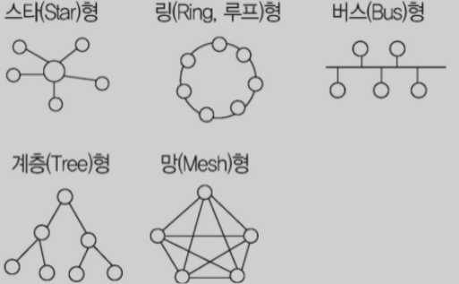
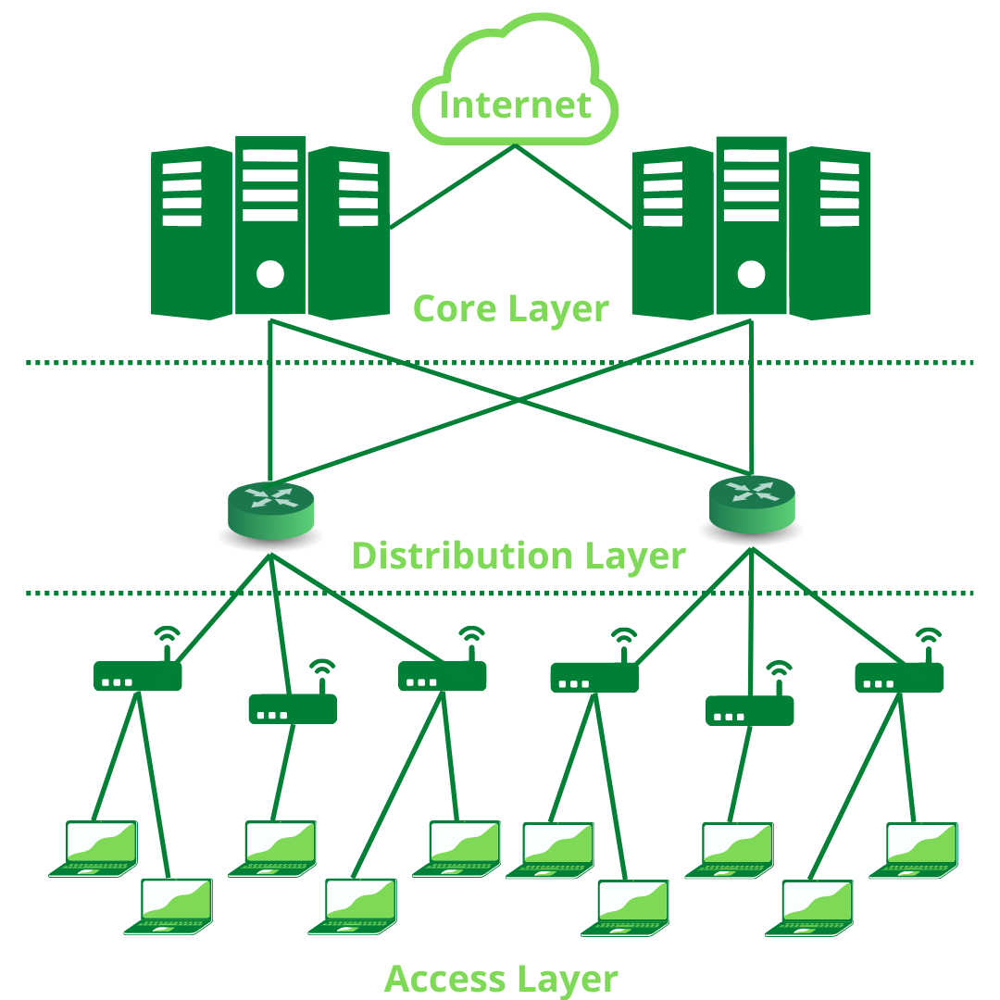

# 2. IT프로젝트 정보 시스템 구축 관리
## 177. 네트워크 관련 신기술
### 지능형 초연결망
- 스마트 시티, 스마트 스테이션 등 4차 산업혁명 시대를 맞아 급격하게 증가하는 데이터 드래픽을 효과적으로 수용하기 위해 시행되는 정부 주관 사업
- 국가 전체 망에 소프트웨어 정의 기술(SDE)을 적용하는 방법
- 네트워크의 데이터 트래픽 증가를 불러오는 사물 인터넷(IoT), 클라우드, 빅데이터, 5G 등을 효율적으로 수용할 수 있도록 함
- 기존의 초고속정보통신망, 광대역통합망(BcN), 광대역융합망(UBcN)을 잇는 중장기 네트워크 발전 전략

### 소프트웨어 정의 기술 (SDE, SDx; Software-Defined Everything)
- 네트워크, 데이터 센터 등에서 소유한 자원을 가상화하여 개별 사용자에게 제공하고, 중앙에서는 통합적으로 제어가 가능한 기술
- 소프트웨어 정의 네트워킹(SDN; Software Defined Networking)
    - 네트워크를 컴퓨터처럼 모델링하여 여러 사용자가 각 소프트웨어들로 네트워킹을 가상화하여 제어하고 관리하는 네트워크
    - 하드웨어에 의존하는 네트워크 체계에 비해 보다 효율적으로 네트워크를 제어, 관리
    - 기존 네트워크에는 영향을 주지 않으면서 특정 서비스의 전송 경로 수정을 통하여 인터넷상에서 발생하는 문제를 처리
- 소프트웨어 정의 데이터 센터(SDDC; Software Defined Data Center)
    - 데이터 센터의 모든 자원을 가상화하여 인력의 개입없이 소프트웨어 조작만으로 관리 및 제어되는 데이터 센터
- 소프트웨어 정의 스토리지(SDS; Software-Defined Storage)
    - 물리적 데이터 스토리지를 가상화하여 여러 스토리지를 하나처럼 관리하거나, 하나의 스토리지를 여러 스토리지로 나눠 사용할 수 있는 기술

### IoT (Internet of Things; 사물인터넷)
- 정보 통신 기술을 기반으로 실세계와 가상 세계의 다양한 사물들을 인터넷으로 서로 연결하여 진보된 서비스를 제공하기 위한 서비스 기반 기술
- 주요기술
    - 스마트 센싱 기술
    - 유무선 통신 및 네트워크 인프라 기술
    - 사물 인터넷 인터페이스 기술
    - 사물 인터넷을 통한 서비스 기술
- 개방형 아키텍처를 필요로 하기에 정보 공유에 대한 부작용을 최소화하기 위한 정보 보안 기술의 적용이 중요

### IoT 관련용어
- M2M(Machine to Machine, 사물통신)
    - 무선 통신을 이용한 기계와 기계 사이의 통신
    - 변압기 원격 감시, 전기, 가스 등의 원격 검침, 무선 신용카드 조회기, 무선 보안 단말기, 버스 운행 시스템, 위치 추적 시스템, 시설물 관리 등을 무선으로 통합하여 상호작용
- 메시 네트워크(Mesh Network)
    - 차세대 이동통신, 홈네트워킹, 공공 안정 등 특수목적을 위한 네트워크
    - 수십~수천 개의 디바이스를 그물망(Mesh)과 같이 유기적으로 연결해 모든 구간을 동일한 무선망처럼 구성하여 안정적인 네트워크를 사용할 수 있게 함
- 와이선(Wi-SUN)
    - 스마트 그리드와 같은 장거리 무선 통신을 필요로 하는 IoT 서비스를 위한 저전력 장거리(LPWA;Low-Power Wide Area) 통신 기술
    - 낮은 지연 속도, 메시 네트워크 기반 확장성, 펌웨어 업그레이드 용이성 등으로 짧은 시간 동안 데이터 전송이 빈번한 검침 분야에 유용
- UWB(Ultra WideBand, 초광대역)
    - 짧은 거리에서 많은 양의 디지털 데이터를 낮은 전력으로 전송하기 위한 무선 기술
    - 무선 디지털 펄스
    - 블루투스와 비교되는 기술
    - 땅 속이나 벽면 뒤로도 전송이 가능하여 지진 등 재해가 일어났을 때 전파 탐지기 기능으로 인명 구조를 할 수 있는 등 응용 범위가 광범위
- 피코넷(PICONET)
    - 여러 개의 독립된 통신장치가 블루투스 기술이나 UWB 통신 기술을 사용해 통신망을 형성하는 무선 네트워크 기술
    - 주로 수십 미터 이내의 좁은 공간에서 네트워크를 형성
    - 정지 또는 이동 중에 있는 장치 모두를 포함
- USN(Ubiquitous Sensor Network)
    - 각종 센서로 다양한 정보를 무선으로 수집할 수 있도록 구성한 네트워크
    - 필요한 모든 것(곳)에 RFID 태그를 부착하여 사물의 인식 정보, 주변의 환경 정보를 탐지한 모든 데이터를 관리
- SON(Self Orgrnizing Network)
    - 주변 상황에 맞추어 스스로 망을 구성하는 네트워크
    - 갑작스러운 사용자의 증가나 감소 시에는 자동으로 수변 셀과의 협력을 통해 셀 용량을 변화시키며, 장애가 발생했을 때 자체적인 치유도 가능
- 저전력 블루투스 기술(BLE; Bluetooth Low Energy)
    - 일반 블루투스와 동일한 2.4GHz 주파수 대역을 사용
    - 연결되지 않은 대기 상태에서는 절전모드를 유지
    - 주로 낮은 전력으로 저용량 데이터를 처리하는 시계, 장난감, 비콘, 착용 컴퓨터 등의 극소형 사물 인터넷에 매우 적합
- NFC(Near Field Communication; 근거리 무선 통신)
    - 고주파(HF)를 이용한 근거리 무선 통신 기술
    - 아주 가까운 거리에서 양방향 통신을 지원하는 RFID 기술의 일종
    - 13.56MHz 주파수를 이용해 10cm 내에서 최고 424Kbps의 속도로 데이터 전송 지원
    - 모바일 기기를 통한 결제뿐만 아니라 여행 정보 전송, 교통, 출입 통제, 잠금장치 등 광범위하게 활용

### 클라우드 컴퓨팅 (Cloud Computing)
- 각종 컴퓨팅 자원을 중앙 컴퓨터에 두고 인터넷 기능을 갖는 단말기
- 언제 어디서나 인터넷을 통해 컴퓨터 작업을 수행할 수 있는 환경
- 중앙컴퓨터
    - 복수의 데이터 센터를 가상화 기술로 통합한 대형 데이터 센터
    - 각종 소프트웨어, 데이터, 보안 솔루션 기능 등 컴퓨팅 자원을 보유
- 중앙의 대형 데이터 센터의 컴퓨팅 자원을 필요한 이들에게 필요한 순간에 빌려주는 방식
- 그리드 컴퓨팅(Grid Computing)
    - 수많은 컴퓨터를 하나의 컴퓨터처럼 묶어 분산 처리하는 방식
    - 기상 예측이나 우주 문제 등 대규모 연산에 사용
- 모바일 클라우드 컴퓨팅(MCC; Mobile Cloud Computing)
    - 클라우드 서비스를 이용하여 소비자와 소비자의 파트너가 모바일 기기로 클라우드 컴퓨팅 인프라를 구성해 여러 가지 정보와 자원을 공유하는 기술
- 인터클라우드 컴퓨팅(Inter-Cloud Computing)
    - 다른 클라우드 서비스를 연동하거나 컴퓨팅 자원의 동적 할당이 가능하도록 여러 클라우드 서비스 제공자들이 제공하는 클라우드 서비스나 자원을 연결하는 기술
    - 대등 접속 : 클라우드 서비스 제공자 간 직접 연계하는 형태
    - 연합 : 자원 공유를 기본으로 사용 요구량에 따른 동적 자원 할당을 지원함으로써 논리적으로 하나의 서비스를 제공하는 형태
    - 중개 : 서비스 제공자 간의 직 · 간접적인 자원 연계 또는 단일 서비스 제공자를 통한 중개 서비스를 제공하는 형태
- 클라우드 기반 HSM(Cloud-based Hardware Security Module)
    - 클라우드 기반으로 암호화 키의 생성, 저장, 처리 등의 작업을 수행하는 보안기기를 가리키는 용어
    - 클라우드에 인증서를 저장하므로 스마트폰과 같은 개별 기기에 인증서를 저장할 필요 없음
    - 암호화 키 생성이 하드웨어적으로 구현되기 때문에 소프트웨어적으로 구현된 암호 기술이 가지는 보안 취약점을 무시
- 파스-타(PaaS-TA)
    - 소프트웨어 개발 환경을 제공하기 위해 개발한 개방형 클라우드 컴퓨팅 플랫폼

### 기타 용어
- 징(Zing)
    - 10cm 이내 거리에서 3.5Gbps 속도의 데이터 전송이 가능한 초고속 근접무선통신(NFC)
    - 스마트 기기, 노트북, 쇼핑몽, 거리, 광고, 키오스크 접목
- NDN(Named Data Networking)
    - 콘텐츠 자체의 정보와 라우터 기능만으로 데이터 전송을 수행하는 기술
    - 해시 테이블에 기반을 두는 P2P 시스템과 같이 콘텐츠에 담겨 있는 정보와 라우터 기능만으로 목적지를 확정
- NGN(Next Grneration Network; 차세대 통신망)
    - ITU-T에서 개발
    - 유선망 기반의 차세대 통신망
    - 완전한 이동성과 하나의 망으로 모든 정보와 서비스를 패킷으로 압축하여 전송하는 것을 목표
- 올-IP
    - 유선 정화망, 무선 망, 패킷 데이터 망 등 기존의 통신망을 모두 IP 기반의 망으로 통합한 차세대 네트워크
- WBAN(Wireless Body Area Network)
    - 웨어러블 현태의 센서나 기기를 무선으로 연결하는 개인 영역 네트워킹 기술
- GIS(Geographic Information System, 지리 정보 시스템)
    - 지리적인 자료를 수집, 저장, 분석, 출력할 수 있는 컴퓨터 응용 시스템
    - 위성을 이용해 모든 사물의 위치 정보를 제공해 주는 것
- 애드 혹 네트워크(Ad-hoc Network)
    - 재난 및 군사 현장과 같이 별도의 고정된 유선망을 구축할 수 없는 장소에서 모바일 호스트만을 이용해 구성한 네트워크
    - 망을 구성한 후 단기간 사용되는 경우나 유선망을 구성하기 어려운 경우 적합
- 네트워크 슬라이싱(Network Slicing)
    - 5G의 핵심기술
    - 하나의 물리적인 네트워크를 다수의 가상 네트워크로 분리해 각각의 네트워크를 통해 다양한 고객 맞춤형 서비스를 제공하는 것을 목적
- 파장 분할 다중화(WDM; Wavelength Division Multiplexing)
    - 광섬유를 이용한 통신 기술
    - 파장이 서로 다른 복수의 신호를 보냄으로써 여러 대의 단말기가 동시에 통신회선을 사용할 수 있도록 하는 기술
- 개방형 링크드 데이터(LOD; Linked Open Data)
    - 누구나 사용할 수 있도록 웹상에 공개된 연계 데이터
    - 웹상에 존재하는 데이터는 개발 URI로 식별
    - 각 URI에 링크 정보를 부여함으로써 상호 연결된 웹을 지향하는 모형
    - Linked Data와 Open Data를 결합한 용어
- SSO(Single Sign On)
    - 한 번의 로그인으로 개인이 가입한 모든 사이트를 이용할 수 있게 해주는 시스템
- 스마트 그리드(Smart Grid)
    - 정보 기술을 전력에 접목해 효율성을 높인 시스템
    - 전력 IT
    - 전력선을 기반으로 모든 통신, 정보, 관련 애플리케이션 인프라를 하나의 시스템으로 통합하여 관리합으로써 효율적인 에너지 관리 가능

## 178. 네트워크 구축
### 네트워크 설치 구조
- 통신망(Communication Network) : 정보를 정달하기 위해 통신 규약에 의해 연결한 통신 설비의 집합
- 네트워크 설치 구조 : 통신망을 구성하는 요소들을 공간적으로 배치하는 방법

### 성형(Star, 중앙 집중형)
- 중앙에 중앙 컴퓨터 존재
- 단말장치들이 중앙 컴퓨터를 중심으로 연결되는 중앙 집중식의 네트워크 구성 형태
- 포인트 투 포인트 방식
- 중앙 컴퓨터를 통해 데이터를 교환
- 단말장치의 추가와 제거가 쉬움
- 하나의 단말장치가 고장나더라도 다른 단말장치에는 영향을 주지 않음
- 중앙 컴퓨터가 고장나면 전체 통신망의 기능 정지
- 교환 노드의 수가 가장적음

### 링형(Ring, 루프형)
- 컴퓨터와 단말장치들을 서로 이웃하는 것끼리 포인트 투 포인트 방식으로 연결시킨 형태
- 분산 및 집중 제어 모두 가능
- 단말장치의 추가, 제어, 기밀 보호가 어려움
- 중계기의 수가 많아짐
- 데이터는 단방향 또는 양방향으로 전송
- 단방향 경우 컴퓨터, 단말장치, 통신 회선 중 어느 하나라도 고장나면 전체 통신망에 영향

### 버스형(Bus)
- 한 개의 통신 회선에 여러 대의 단말장치가 연결되어 있는 형태
- 물리적 구조가 간단하고, 단말장치의 추가, 제거가 용이
- 단말장치가 고장나더라도 통신망 전체에 영향을 주기 않기에 신뢰성을 높일 수 있음
- 기밀 보장 어려움, 통신 회선의 길이에 제한 존재

### 계층형(Tree, 분산형)
- 중앙 컴퓨터와 일정 지역의 단말장치까지는 하나의 통신 회선으로 연결
- 이웃하는 단말장치는 일정 지역 내에 설치된 중간 단말장치로부터 다시 연결
- 분산 처리 시스템을 구성하는 방식

### 망형(Mesh)
- 모든 지점의 컴퓨터와 단말장치를 서로 연결한 형태
- 노드의 연결성 높음
- 많은 단말장치로부터 많은 양의 통신을 필요로 하는 경우 유리
- 공중 데이터 통신망에서 사용되며, 통신 회선의 총 경로가 가장 김
- 통신 회선 장애 시 다른 경로를 통하여 데이터 전송
- 모든 노드를 망형으로 연결하려면 노드의 수가 n개일 때, n(n-1)/2개의 회선이 필요하고 노드당 n-1포트가 필요

### 네트워크 분류
- 네트워크는 각 사이트들이 분포되어 있는 지리적 범위에 따라 LAN과 WAN으로 분류
- 근거리 통신망(LAN; Local Area Network)
    - 회사, 학교, 연구소 등 비교적 가까운 거리에 있는 컴퓨터, 프린터, 테이프 등과 같은 자원을 연결하여 구성
    - 자원 공유 목적
    - 데이터의 전송 속도가 빠르고, 에러 발생률이 낮음
    - 버스형, 링형
- 광대역 통신망(WAN; Wide Area Network)
    - 국가와 국가, 대륙과 대륙 등과 같이 멀리 떨어진 사이트들을 연결하여 구성
    - 통신 속도가 느리고, 에러 발생률 높음
    - 일정한 지역에 있는 사이트들을 근거리 통신망으로 연결한 후, 각 근거리 통신망을 연결하는 방식으로 사용

### LAN 표준안
|표준 규격|내용|
|---|---|
|802.1|전체의 구성, OSI 참조 모델과의 관계, 통신망 관리 등에 관한 규약|
|802.2|논리 링크 제어(LLC)계층에 관한 규약|
|802.3|CSMA/CD 방식의 매체 접근 제어 계층에 관한 규약|
|802.4|토큰 버스 방식의 매체 접근 제어 계층에 관한 규약|
|802.5|토큰 링 방식의 매체 접근 제어 계층에 관한 규약|
|802.6|도시형 통신망(MAN)에 관한 규약|
|802.9|종합 음석/데이터 네트워크에 관한 규약|
|802.11|무선 LAN에 관한 규약|

### 802.11 버전
|||
|---|---|
|802.11(초기버전)|2.4GHz 대역 전파와 CSMA/CA 기술을 사용해 최고 2Mbps까지 전송 속도 지원|
|802.11a|5GHz 대역의 전파를 사용하며, OFDM 기술을 사용해 최고 Mbps까지 전송 속도 지원|
|802.11b|802.11 초기 버전의 개선안으로 등장하여, 11Mbps의 전송 속도로 기존에 비해 5배 이상 빠르게 개선|
|802.11e|802.11 부가 기능 표준으로, QoS 기능이 지원되도록 하기 위해 매체 접근 제어(MAC) 계층에 해당하는 부분을 수정|
|802.11g|2.4GHz 대역 전파를 사용하지만 5GHz 대역 전파를 사용하는 802.11a와 동일한 최고 54Mbps까지의 전송 속도를 지원|
|802.11i|802.11의 보안 기능 표준으로, 인증방식에 WPA/WPA2를 사용|
|802.11n|2.4GHz 대역과 5GHz 대역을 사용하는 규격으로, 최고 600Mbps 까지의 전송 속도 지원|

> CSMA/CA(Carrier Sense Multiple Access/Collision Avoidance)
> - 무선 랜에서 데이터 전송 시 매체가 비어있음을 확인한 뒤 충돌을 피하기 위해 일정한 시간을 기다린 후 데이터를 전송하는 방법
> - 회선을 사용하지 않는 경우에도 확인 신호를 전송하여 동시 전송에 의한 충돌을 예방

## 179. 스위치 (Switch)
### 스위치 분류
브리지와 같이 LAN과 LAN을 연결하여 훨씬 더 큰 LAN을 만드는 장치
- L2 스위치
    - OSI의 2계층(데이터 링크)
    - 일반적으로 부르는 스위치
    - MAC 주소를 기반으로 프레임을 전송
    - 동일 네트워크 간의 연결만 가능
- L3 스위치
    - OSI의 3계층(네트워크)
    - L2 스위치에 라우터 기능이 추가
    - IP 주소를 기반으로 패킷을 전송
    - 서로 다른 네트워크 간의 연결 가능
- L4 스위치
    - OSI의 4계층(전송 계층)
    - 로드밸런서가 달린 L3 스위치
    - IP 주소 및 TCP/UDP를 기반으로 사용자들의 요구를 서버의 부하가 적은 곳에 배분하는 로드밸런싱 기능을 제공
- L7 스위치
    - OSI의 7계층(응용계층)
    - IP 주소, TCP/UDP 포트 정보에 패킷 내용까지 참조하여 세밀하게 로드밸런싱

### 스위칭 방식
프레임을 전달하는 방식에 따라 구분됨
1\) Store and Forwarding
    - 데이터를 모두 받은 후 스위칭하는 방식

2\) Cut-through
    - 데이터의 목적지 주소만을 확인한 후 바로 스위칭하는 방식

3\) Fragment Free
    - Store and Forewarding과 Cut-through 방식의 장점을 결합한 방식

### 백본 스위치(Backvorn Switch)
- 백본 : 여러 네트워크를 연결할 때 중추적 역할을 하는 네트워크
- 모든 패킷이 지나가는 네트워크 중심에 배치
- 대규모 트래픽을 처리하려면 고성능의 백본 스위치 사용
- 주로 L3 스위치가 백본 스위치 역할을 함

### Hierarchical 3 Layer 모델
1\) 액세스 계층(Access Layer)
    - 사용자가 네트워크에 접속할 때 최초로 연결되는 지점
    - 사용자들로부터 오는 통신을 집약해서 디스트리뷰션 계층으로 전송
    - 액세스 계층에 배치되는 장비는 성능은 낮아도 되지만, 포트수는 사용자수만큼 있어야 함
    - L2 스위치 사용

2\) 디스트리뷰션 계층(Distribution Layer)
    - 액세스 계층의 장치들이 연결되는 지점
    - 액세스 계층에서 오는 통신을 집약해서 코어 계층으로 전송
    - LAN간에 라우팅 기능을 수행
    - 라우터, L3 스위치 사용

3\) 코어 계층(Core Layer) = 백본계층
    - 디스트리뷰션 계층에서 오는 통신을 집약해 인터넷에 연결하는 계층
    - 전자우편, 인터넷 전솝, 화상 회의 등의 기능 수행
    - 백본 스위치 사용

## 180. 경로 제어 / 트래픽 제어
### 경로 제어(Routing) 개요
- 송 · 수신 간의 전송 경로 중에서 최적 패킷 교환 경로를 결정하는 기능
- 최적 패킷 교환 : 어느 한 경로에 데이터 양이 집중하는 것을 피하면서, 최저 피용으로 최단 시간에 송신할 수 있는 경로
- 경로 제어표를 참조해서 이루어지며, 라우터에 의해 수행됨

### 경로 제어 프로토콜(Routing Protocol)
1\) IGP(Interior Gateway Protocol, 내부 게이트웨이 프로토콜)
- 하나의 자율 시스템(AS) 내의 라우팅에 사용되는 프로토콜
- RIP(Routing Infomation Protocol)
    - 현재 가장 널리 사용되는 라우팅 프로토콜
    - 거리 벡터 라우팅 프로토콜
    - 최단 경로 탐색에 Bellman-Ford 알고리즘 사용
    - 소규모 동종의 네트워크 내에서 효율적인 방법
    - 최대 홉(Hop) 수를 15로 제한하므로 15를 초과하는 경우, 도달할 수 없는 네트워크를 의미 => 대규모 네트워크에서는 사용할 수 없음
    - 라우팅 정보를 30초마다 네트워크 내의 모든 라우터에 알리며, 180초 이내에 새로운 라우팅 정보가 수신되지 않으면 해당 경로를 이상상태로 간주
- OSFP(Open Shortest Path First protocol)
    - RIP 단점을 해결해 새로운 기능을 지원하는 인터넷 프로토콜
    - 대규모 네트워크에서 많이 사용
    - 인터넷 망에서 이용자가 퇴단 경로를 선정할 수 있도록 라우팅 정보에 노드 간의 거리정보, 링크상태 정보를 실시간으로 반영해 최단 경로로 라우팅 지원
    - 최단 경로 탐색에 다익스트라(Dijkstra) 알고리즘 사용
    - 라우팅 정보에 변화가 생길 경우 변화된 정보만 네트워크 내의 모든 라우터에게 알림
    - 하나의 자율 시스템에서 동작하면서 내부 라우팅 프로토콜의 그룹에 도달

2\) EFP(Exterior Gateway Protocol, 외부 게이트웨이 프로토콜)
    - 자율 시스템(AS) 간 라우팅 즉, 게이트웨이 간의 라우팅에 사용되는 프로토콜
- BGP(Border Gateway Protocol)
    - 자율 시스템(AS) 간의 라우팅 프로토콜
    - EGP의 단점 보완
    - 초기에 BGP 라우터들이 연결될 때에는 전체 경로 제어표를 교환하고, 이후에는 변화된 정보만을 교환

### 트래픽 제어(Traffic Control) 개요
- 네트워크 보호, 성능 유지, 네트워크 자원의 효율적인 이용을 위해 전송되는 패킷의 흐름 또는 그 양을 조절하는 기능
- 흐름 제어, 폭주(혼합) 제어, 교착상태 방지 기법

### 흐름 제어(Flow Control)
- 네트워크 내의 원활한 흐름을 위해 송 · 수신 측 사이에 전송되는 패킷의 양이나 속도를 규제하는 기능
- 송신 측과 수신 측 간의 처리 속도 또는 버퍼 크기의 차이에 의해 생길 수 있는 수신 측 버퍼의 오버플로(Overflow) 방지하기 위한 기능
- 정지-대기(Stop-and-Wait)
    - 수신 측의 확인 신호(ACK)를 받은 후 다음 패킷을 전송하는 방식
    - 한 번에 하나의 패킷만 전송
- 슬라이딩 윈도우(Sliding Window)
    - 확인 신호 즉 수신 통지를 이용해 송신 데이터의 양을 조절하는 방식
    - 수신 측의 환인 신호를 받지 않더라도 미리 정해진 패킷의 수만큼 연속적으로 전송하는 방식
    - 한 번에 여러 개의 패킷을 전송할 수 있어 전송 효율이 좋음
    - 송신 측은 수신 측으로부터 확인 신호(ACK)없이도 보낼 수 있는 패킷의 최대치를 미리 약속받는데, 이 패킷의 최대치가 윈도우 크기(Wondow Size)를 의미
    - 윈도우 크기를 상황에 따라 변함
    - 수신 측으로부터 이전에 송신한 패킷에 대한 긍정수신응답(ACK)이 전달된 경우 윈도우 크기는 증가
    - 수신 측으로부터 이전에 송신한 패킷에 대한 부정수신응답(NAK)이 전달된 경우 윈도우 크기는 감소

### 폭주(혼잡) 제어(Congestion Control)
- 네트워크 내의 패킷 수를 조절하여 네트워크의 오버플로(Overflow)를 방지하는 기능
- 느린 시작(Slow Start)
    - 윈도우 크기를 1, 2, 4, 8...과 같이 2배씩 지수적으로 증가시켜 초기에는 느리지만 갈수록 빨라짐
    - 전송 데이터의 크기가 임계 값에 도달하면 혼잡 회피 단계로 넘어감
- 혼잡 회피(Congestion Avoidance)
    - 느린 시작의 지수적 증가가 임계 값에 도달되면 혼잡으로 간주하고 회피를 위해 윈도우의 크기를 1씩 선형적으로 증가시켜 혼잡을 예방하는 방식

### 교착상태(Dead Lock) 방지
- 교착상태 : 교환기 내에 패킷들을 축적하는 기억공간이 꽉 차있을 때 다음 패킷들이 기억 공간에 들어가기 위해 무한정 기다리는 현상
- 패킷이 같은 목적지를 갖지 않도록 할당하고, 교착상태 발생 시에는 교착상태에 있는 한 단말장치를 선택하여 패킷 버퍼를 폐기

## 181. SW 관련 신기술
- 인공지능(AI; Artificial Intelligence)
    - 인간의 두뇌와 같이 컴퓨터 스스로 추론, 학습, 판단 등 인간지능적인 작업을 수행하는 시스템
    - 신경망, 퍼지, 패턴 인식, 전문가 시스템, 자연어 인식, 이미지 처리, 컴퓨터 시각, 로봇 공학
- 뉴럴링크(Neuralink)
    - 일론 머스크가 사람의 뇌와 컴퓨터를 결합하는 기술을 개발하기 위해 설립한 회사
    - 작은 전극을 뇌에 이식함으로써 생각을 업로드하고 다운로드 하는 것을 목표
- 딥 러닝(Deep Learning)
    - 인간의 두뇌를 모델로 만들어진 인공 신경망(ANN; Artificial Neural Network)을 기반으로 하는 기계 학습 기술
    - 마치 사람처럼 스스로 학습할 수 있어 많은 데이터를 정형화하지 않고도 스스로 필요한 데이터를 수집, 분석하여 고속으로 처리
- 전문가 시스템(Expert System)
    - 특정 분야의 전문가가 수행하는 고도의 업무를 지원하기 위한 컴퓨터 응용 프로그램
    - 데이터베이스와 지식 베이스에 기초해 추론을 실행하는 추론 기구를 활용하여 결정을 내기러나 문제를 해결
- 가상현실(VR; Virtual Reality)
    - 컴퓨터 등을 사용해 실제와 유사하지만 실제가 아닌 환경이나 상황을 구현하는 기술
- 증강현식(AR; Augmented Reality)
    - 실제 촬영한 화면에 가상의 정보를 부가하여 보여주는 기술
- 혼합현실(MR; Mixed Reality)
    - 가상현실과 현실세계를 합쳐, 현실의 물리적인 객체와 가상의 객체가 상호작용할 수 있는 환경을 구현하는 기술
- 그레이웨어(Grayware)
    - 소프트웨어를 제공하는 입장에서는 악의적이지 않은 유용한 소프트웨어라고 주장
    - 사용자 입장에서는 유용할 수도 있고 악의적일 수도 있음
    - 애드웨어, 트랙웨어, 기타 악성코드나 악성 공유웨어
- 매시업(Mash Up)
    - 웹에서 제공하는 정보 및 서비스를 이용하여 새로운 소프트웨어나 서비스, 데이터베이스 등을 만드는 기술
- 리치 인터넷 애플리케이션(RIA; Rich Internet Application)  
    - 플래이 애니메이션 기술과 웹 서버 애플리케이션 기술을 통합하여 기존 HTML보다 역동적이고 인터랙티브한 웹페이지를 제공하는 신개념의 플래시 웹페이지 제작 기술
- 시멘틱 웹(Semantic Web)
    - 컴퓨터가 사람을 대신해 정보를 읽고 이해하고 가공하여 새로운 정보를 만들어 낼 수 있도록 이해하기 쉬운 의미를 가진 차세대 지능형 웹
    - 웹 자원을 서술하기 위한 자원 서술 기술, 온톨로지(Ontology)를 통한 지식 서술 기술, 통합적으로 운영하기 위한 에이전트(Agent) 기술
- 증발폼(Vaporware)
    - 판매 계획 또는 배포 계획은 발표되었으나 실제로 고객에게 판매되거나 배포되지 않고 있는 소프트웨어
- 오픈 그리드 서비스 아키텍쳐(Open Grid Service Architecture)
    - 애플리케이션 공유를 위한 웹 서비스를 그리드 상에서 제공하기 위해 만든 개방형 표준
    - 웹 서비스 표준을 적극적으로 따르고 기존의 웹 개발 툴들을 그대로 사용할 수 있다는 장점
- 서비스 지향 아키텍쳐(SOA; Service Oriented Architecture)
    - 기업의 소프트웨어 인프라인 정보시스템을 공유와 재사용이 가능한 서비스 단위나 컴포넌트 중심으로 구축하는 정보기술 아키텍쳐
    - 기업의 IT 시스템을 비즈니스에 맞춰 유연하게 사용할 수 있다는 것이 장점
    - 표현 계층, 업무프로세스 계층, 서비스 중간 계층, 애플리케이션 계층, 데이터 저장 계층
- 서비스형 소프트웨어(SaaS; Service as a Service)
    - 소프트웨어의 여러 기능 중에서 사용자가 필요로 하는 서비스만 이용할 수 있도록 한 소프트웨어
    - 공급업체가 하나의 플랫폼을 이용해 다수의 고객에게 소프트웨어 서비스를 제공하고, 사용자는 이용한 만큼 돈을 지급하는 방식
- 복잡한 이벤트 처리(CEP; Complex Event Processing)
    - 실시간으로 발생하는 많은 사건들 중 의미가 있는 것만을 추출할 수 있도록 사건 발생 조건을 정의하는 데이터 처리 방법
    - 금융, 통신, 전력, 물류, 국방 등에서 대용량 데이터 스트림에 대한 요구에 실시간으로 대응하기 위하여 개발된 기술
- 디지털 트윈(Digital Twin)
    - 현실 속 사물을 소프트웨어로 가상화한 모델
    - 실제 자산의 특성에 대한 정확한 정보를 얻을 수 있고, 최적화, 돌발사고 최소화, 생산성 증가 등 설계부터 제조, 서비스에 이르는 모든 과정의 효율성을 향상
    - 주로 현실 속의 사물을 대신해 다양한 상황을 모의 실험하기 위한 용도로 사용
- 텐서플로(TensorFlow)
    - 구글 브레인 팀이 만듦
    - 다양한 작업에 대해 데이터 흐름 프로그래밍을 위한 오픈소스 소프트웨어 라이브러리
    - C++로 제작
    - 구글 검색, 음성 인식, 번역 등 구글 서비스 전반에서 다양하게 사용
- 도커(Docker)
    - 컨테이너 기술을 자동화하여 쉽게 사용할 수 있게 하는 오픈소스 프로젝트
    - 소프트웨어 컨테이너 안에 응용 프로그램들을 배치시키는 일을 자동화해주는 역할을 수행
- 스크래피(Scrapy)
    - Python 기반 웹 크롤링 프레임워크
    - 코드 재사용성을 높이는 데 도움이 되며, 대규모의 크롤링 프로젝트에 적합

## 182. 보안 관련 신기술
- 블록체인(Blockchain)
    - P2P 네트워크를 이용해 온라인 금융 거래 정보를 온라인 네트워크 참여자(Peer)의 디지털 장비에 분산 저장하는 기술
- 분산 원장 기술(DLT; Distributed Ledger Technology)
    - 중앙관리자나 중앙데이터 저장소가 존재하지 않고 P2P 망내의 참여자들에게 모든 거래 목록이 분산 저장되어 거래가 발생할 때마다 지속적으로 갱신되는 디지털 원장
    - 대표적으로 블록체인
- 양자 암호키 분배(QKD; Quantum Key Distribution)
    - 양자 통신을 위해 비밀키를 분배하여 관리하는 기술
    - 두 시스템이 암호 알고리즘 동작을 위한 비밀키를 안전하게 공유하기 위해 양자 암호키 분배 시스템을 설치하여 운용하는 방식으로 활용
- 프라이버시 강화기술(PET; Privacy Enhancing Technology)
    - 개인정보 위험 관리 기술
    - 암호화, 익명화 등 개인정보를 보호하는 기술에서 사용자가 직접 개인정보를 통제하기 위한 기술까지 아양한 사용자 프라이버시 보호 기술을 통칭
- 공통 평가 기준(CC; Common Criteria)
    - ISO 15408 표준으로 채택된 정보 보호 제품의 평가 기준
    - 시스템의 평가 원칙과 평가 모델, 시스템 보안 기능 요구사항(11개), 시스템의 7등급 평가를 위한 보증 요구사항(8개)으로 구성
- 개인정보 영향 평가 제도(PIA; Privacy Impact Assessment)
    - 개인정보를 활용하는 새로운 정보시스템의 도입 및 기존 정보시스템의 중요한 변경 시 시스템의 구축, 운영이 기업의 고객은 물론 국민의 사생활에 미칠 영향에 대해 미리 조가, 분석, 평가하는 제도
- 소프트웨어 에스크로(임치)(Software Escrow)
    - 소프트웨어 개발자의 지식재산권을 보호하고 사용자는 저렴한 비용으로 스프트웨어를 안정적으로 사용 및 유지보수 받을 수 있도록 소스 프로그램과 기술 정보 등을 제 3의 기관에 보관하는 것
- 서비스형 블록체인(BaaS; Blockchain as a Service)
    - 블록체인 앱의 개발 환경을 클라우드 기반으로 제공하는 서비스
    - 블록체인 네트워크에 노드의 추가 및 제거가 용이
    - 블록체인 플랫폼마다 다른 블록체인 기술을 보다 편리하게 사용
- OWASP(the Open Web Application Security Project, 오픈 웹 애플리케이션 보안 프로젝트)
    - 웹 정보 노출이나 악성 코드, 스크립트, 보안이 취약한 부분을 연구하는 비영리 단체
    - 보안 취약점 중 보안에 미치는 영향이 큰 것을 기준으로 선정한 10대 웹 애플리케이션 취약점을 3~4년에 한 번씩 발표하고 있음
- TCP 래퍼(TCP Wrapper)
    - 외부 컴퓨터의 접속 인가 여부를 점검하여 접속을 허용 및 거부하는 보안용 도구
    - 네트워크에 접속하면 로그인한 다른 컴퓨터 사용자의 ID 및 로그를 조회하여 악용이 가능한데, 이를 방지하기 위한 방화벽 역할 수행
- 허니팟(Honeypot)
    - 비정상적인 접근을 탐지하기 위해 설치해 둔 시스템
    - 침입자를 속여 실제 공격을 당하는 것처럼 보여줌으로써 추적 및 공격기법에 대한 정보를 수집
- DPI(Deep Packet Inspection)
    - OSI 7 Layer 전 계층의 프로토콜과 패킷 내부의 콘텐츠를 파악하여 침입 시도, 패킹 등을 탐지하고, 트래픽을 저장하기 위한 패킷 분석 기술

## 183. 소프트웨어 개발 보안 관련 기관과 직무별 보안 활동
### 소프트웨어 개발 보안의 개요
- SW 개발 과정에서 발생할 수 있는 보안 취약점을 최소화하여 보안 위협으로부터 안전한 SW를 개발하기 위한 활동

### 소프트웨어 개발 보안 관련 기관
- 행정안전부
- 한국인터넷진흥원(KISA)
- 발주기관
- 사업자
- 감리법인

### 소프트웨어 개발 직무별 보안 활동
- 프로젝트 관리자(Project Manager)
- 요구사항 분석가(Requiement Specifier)
- 아키텍트(Architect)
- 설계자(Deginer)
- 구현 개발자(Implementer)
- 테스트 분석가(Test Analyst)
- 보안 감사자(Security Auditor)

## 184. 소프트웨어 개발 보안 활동 관련 법령 및 규정
### 개인정보 보호 관련 법령
- 개인정보 보호법
- 정보통신망 이용촉진 및 정보보호 등에 관한 법률
- 신용정보의 이용 및 보호에 관한 법률
- 위치정보의 보호 및 이용 등에 관한 법률
- 표준 개인정보 보호 지침
- 개인정보의 안전성 확보 조치 기준
- 개인정보 영향평가에 관한 고시

### IT 기술 관련 규정
- RFID 프라이버시 보호 가이드라인
- 위치정보 보호 및 이용 등에 관한 법률
- 위치정보의 관리적, 기술적 보호조치 권고 해설서
- 바이오정보 보호 가이드라인
- 뉴미디어 서비스 개인정보 보호 가이드라인

## 185. HW 관련 신기술
### 고가용성 솔루션(HACMP; High Availability Clustering Multi Processing)
- 긴 시간동안 안정적인 서비스 운영을 위해 장애 발생 시 즉시 다른 시스템으로 대체 가능한 환경을 구축하는 매커니즘
- 각 시스템 간 공유 디스크를 중심으로 클러스터링으로 엮어 다수의 시스템을 동시에 연결
- 2개의 서버를 연결하는 이중화를 통해 서버 안정성 높일 수 있음

### 3D Printing
- 대상을 평면에 출력하는 것이 아니라 손으로 만질 수 있는 실제 물체로 만들어내는 것
- 얆은 두께로 한층한층 적층시켜 하나의 형태를 만들어내는 기술을 이용
- 건축가, 항공우주, 전자, 공구 제조, 자동차, 디자인, 의료분야

### 4D Printing
- 특정 시간이나 환경 조건이 갖추어지면 스스로 형태를 변화시키거나 제조되는 자가조립(Self-Assembly) 기술이 적용된 제품을 3D Printing 하는 기술
- 미국 MIT 자가조립 연구소의 스카일러 티빗츠 교수에 의해 처음 공개되었음
- 인간의 개입없이 열, 진동, 습도, 중력 등 다양한 환경이나 에너지원에 자극 받아 변화하는 스마트 소재가 필요하며, 형상기억합금이나 나노기술을 통해 전기회로를 내장하는 방법 등으로 제조됨

### RAID(Redundant Array of Inexpensive Disk, Redundant Array of Independent Disk)
- 여러 개의 하드디스크로 디스크 배열을 구성하여 파일을 구성하고 있는 데이터 블록들을 서로 다른 디스크들에 분산 저장하여, 그 불록들을 여러 디스크에서 동시에 읽거나 쓸 수 있게 함으로써 디스크 속도가 매우 향상되는 기술
- 어느 한 디스크에만 결함이 발생해도 전체 데이터에 파일이 손상되는 문제 발생
- 디스크 배열에 오류 검출 및 복구를 위한 여분의 디스크들을 추가하여 오류가 발생해도 원래의 데이터를 복구할 수 있게 함

### 4K 해상도
- 차세대 고화질 모니터

### 앤 스크린(N-Screen)
- N개의 서로 다른 단말기에서 동일한 콘텐츠를 자유롭게 이용할 수 있는 서비스
- PC, TV, 휴대폰에서 동일한 콘텐츠를 끊김없이 이용할 수 있는 것

### 캠패니언 스크린(Companion Screen)
- 앤 스크린의 종류
- TV 방송 시청 시 방송 내용을 공유하며 추가적인 기능을 수행할 수 있는 스마트폰, 태블링 PC등을 의미
- 세컨트 스크린이라고도 불림

### 신 클라이언트 PC(Thin Client PC)
- 하드디스크나 주변 장치없이 기본적인 메모리만 갖추고 서버와 네트워크로 운용되는 개인용 컴퓨터
- 서버 기반 컴퓨팅과 관계가 깊음
- 프로그램이 필요할 때마다 서버에 접속하여 소프트웨어를 내려받기만 하면 됨
- 기억장치가 없으므로 데이터는 서비 측에서 한꺼번에 관리
- 기억장치가 없기에 PC를 분실하더라도 정보가 유출될 우려가 없음
- 유지보수 등에 발생하는 비용 절감을 위해 고안된 것

### 패블릿(Phablet)
- 폰(Phone)과 태블릿(Tablet)의 합성어
- 태블릿 기능을 포함안 5인치 이상의 대화면 스마트폰

### C형 유에스비(Universal Serial Bus Type-C, USB Type-C, USB-C)
- 범용 인터페이스 규격인 유에스비의 표준 중 하나
- 기존 A형에 비하여 크기가 작고, 24핀으로 위아래 구분없이 어느 방향으로든 연결 가능
- 전송 속도는 초당 10Gbps, 전력은 최대 100W

### 멤스(MEMS; Micro-Electro MEchanical Systems)
- 초정밀 반도체 제조 기술을 바탕으로 센서, 액추에이터 등 기계 구조를 다양한 기술로 미세 가공하여 전기기계적 동작을 할 수 있도록 한 초미세 장치
- 작은 실리콘 칩 위에 마이크로 단위의 작은 부품과 이들을 입체적으로 연결하는 마이크로 회로들로 구성됨
- 정보기기의 센서나 프린터 헤드, HDD 자기헤드, 기타 환경, 의료 및 군사 용도로 이용
- 초소형이면서 고도의 복잡한 동작을 하는 마이크로 시스템

### 트러스트존 기술(TrustZone Technology)
- 칩 설계회사인 ARM(Advanced RISC Machine)에서 개발
- 하나의 프로세서 내에 일반 애플리케이션을 처리하는 일반 구역과 보안이 필요한 애플리케이션을 처리하는 보안구역으로 분할하여 관리하는 하드웨어 기반의 보안 기술
- 결제, 인증서, 기밀문서 등과 같이 보안이 필요한 데이터들을 취급하는 애플리케이션을 외부 공격에 노출하지 않고 운영체제 수준에서 안전하게 보호하는 것이 가능

### 엠디스크(M-DISC, Millennial DISC)
- 한 번의 기록만으로 자료를 영구 보관할 수 있는 광 저장 장치
- 디스크 표면의 무기물층에 레이저를 이용해 자룔를 조각해서 기록
- 기존의 염료층에 표시하는 방식과 달리 물리적으로 조각하는 방식 덕문에 시간이 가도 변하지 않는 금속 활자처럼 빛, 열, 습기 등의 외부 요인에 영향을 받지 않음
- 미국 밀레니어터사에서 개발
- 디지털 비디오 디스크(DVD), 블루레이 디스크에 적용

### 멤리스터(Memristor)
- 메모리(Memory)와 레지스터(Resister) 합성어
- 전류의 방향과 양 등 기존의 경험을 모두 기억하는 특별한 소자
- 레지스터(Resister), 커패시터(Capacitor), 인덕터(Inductor)에 이어 네 번째 전자회로 구성 요소라 불림
- 전원 공급이 끊어졌을 때도 직전에 통과한 전류의 방향과 양을 기억하기에 다시 전원이 공급되면 기존의 상태가 그대로 복원됨

## 186. Secure OS
### Secure OS의 개요
- 기존의 운영체제에 내재된 보안 취약점을 해소하기 위해 보안 기능을 갖춘 커널을 이식하여 외부의 침입으로부터 시스템 자원을 보호하는 운영체제
- 보호방법
    - 암호적 분리(Cryptographic Separation) : 내부 정보를 암호화하는 방법
    - 논리적 분리(Logical Separation) : 프로세스의 논리적 구역을 지정하여 구역을 벗어나는 행위를 제한하는 방법
    - 시간적 분리(Temporal Separation) : 동일 시간에 하나의 프로세스만 수행되도록 하여 동시 실행으로 발생하는 보안 취약점을 제거하는 방법
    - 물리적 분리(Physical Separation) : 사용자별로 특정 장비만 사용하도록 제한하는 방법

### Secure OS의 보안기능
1\) 식별 및 인증
    - 각 접근 주체에 대한 안전하고 고유한 식별 및 인증 기능

1\) 임의적 접근통제
    - 소속 그룹 또는 개인에 따라 부여된 권한에 따라 접근을 통제하는 기능
    - DAC(Discretionary Access Control) 또는 신분 기반 정책이라고도 함

2\) 강제적 접근통제
    - 접속 단말 및 접속 방법, 권한, 요청 객체의 특성 등 여러 보안 속성이 고려된 규칙에 따라 강제적으로 접근을 통제하는 기능
    - MAC(Mandatory Access Control) 또는 규칙 기반 정책이라고도 함

3\) 객체 재사용 보호
    - 메모리에 기존 데이터가 남아있지 않도록 초기화하는 기능

4\) 완전한 조정
    - 우회할 수 없도록 모든 접근 경로를 완전하게 통제하는 기능

5\) 신뢰 경로
    - 비밀번호 변경 및 권한 설정 등과 같은 보안 작업을 위한 안전한 경로를 제공하는 기능

6\) 감사 및 감사기록 축소
    - 모든 보안 관련 사건 및 작업을 기록한 후 보호하는 기능
    - 막대한 양의 기록들을 분석하고 축소하는 기능

## 187. DB 관련 신기술
### 빅데이터(Big Data)
- 기존 관리방법이나 분석 체계로는 처리하기 어려운 막대한 양의 정형 또는 비정형 데이터 집합
- 빅데이터를 효과적으로 분석함으로써 미래를 예측해 최적의 대응 방안을 찾고, 이를 수익으로 연결하여 새로운 가치를 창출

### 브로드 데이터(Broad Data)
- 다양한 채널에서 소비자와 상호작용을 통해 생성된 기업 마케팅에 있어 효율적이고 다양한 데이터
- 이전에 사용하지 않거나 알지 못했던 새로운 데이터나, 기존 데이터에 새로운 가치가 더해진 데이터
- 빅데이터와 달리 다양한 정보를 뜻함
- 소비자의 SNS활동이나 위치정보

### 메타 데이터(Meta Data)
- 일련의 데이터를 정의하고 설명해주는 데이터
- 주로 빠르게 검색하거나 내용을 간략하고 체계적으로 하기 위해 많이 사용

### 디지털 아카이빙(Digital Archiving)
- 디지털 정보 자원을 장기적으로 보존하기 위한 작업
- 아날로그 콘텐츠는 디지털로 변환한 후 압축해서 저장
- 디지털 콘텐츠도 체계적으로 분류하고 메타 데이터를 만들어 DB화 하는 작업
- 늘어나는 정보 자원의 효율적인 관리와 이용을 위해 필요한 작업

### 하둡(Hadoop)
- 오픈소스 기반 분산 컴퓨팅 플랫폼
- 일반 PC급 컴퓨터들로 가상화된 대형 스토리지를 형성하고 그 안에 보관된 거대한 데이터 세트를 병렬로 처리할 수 있도록 개발된 자바 소프트웨어 프레임워크
- 구글, 야후 등 적용
- 관계형 데이터베이스(RDB) 간 대용량 데이터를 전송할 때 스쿱(Sqoop) 도구 사용

### 맵리듀스(MapReduce)
- 대용량 데이터를 분산 처리하기 위한 목적으로 개발된 프로그래밍 모델
- 흩어져 있는 데이터를 연관성 있는 데이터 분류를 묶는 Map 작업
- 중복 데이터를 제거하고 원하는 데이터를 추출하는 Reduce 작업
- Google에 의해 고안됨
- 대표적인 대용량 데이터 처리를 위한 병렬 처리 기법으로 많이 사용

### 타조(Tajo)
- 하둡 기반의 분산 데이터 웨어하우스
- 하둡의 빅데이터를 분석할 때 맵리듀스를 사용하지 않고 구조화 질의 언어(SQL)를 사용하요 하둡 분산 파일 시스템 파일을 바로 읽어냄
- 대규모 데이터 처리와 실시간 상호 분석에 모두 사용

### 데이터 다이어트(Data Diet)
- 데이터를 삭제하는 것이 아니라 압축하고, 중복을 배제하고, 새로운 기준에 따라 나누어 저장하는 작업
- 방대한 정보를 효율적으로 관리하기 위해 대두된 방안
- 같은 단어가 포함된 데이터들을 한 곳으로 모아 두되 필요할 때 제대로 찾아내는 체계를 갖추는 것이 중요

### 데이터 마이닝(Data Mining)
- 데이터 웨어하우스에 저장된 데이터 집합에서 사용자의 요구에 따라 유용하고 가능성 있는 정보를 발견하기 위한 기법
- 대량의 데이터를 분석하여 데이터 속에 내재되어 있는 변수 사이의 상호관계를 규명하여 패턴화함으로써 효율적인 데이터 추출 가능

### OLAP(Online Analytical Processing)
- 다차원으로 이루어진 데이터로부터 통계적인 요약 정보를 분석하여 의사결정에 활용하는 방식
- 데이터 웨어하우스, 데이터 마트와 같은 시스템과 상호 연관되는 정보 시스템
- OLAP 연산
    - Roll-up
    - Drill-down
    - Drill-through
    - Drill-across
    - Pivoting
    - Slicing
    - Dicing

## 188. 회복 / 병행제어
### 회복 (Recovery)
트랜잭션을 수행하는 도중 장애가 발생하여 데이터베이스가 손상되었을 때 손상되기 이전의 정상 상태로 복구하는 작업

#### 장애의 유형
1\) 트랜잭션 장애
    - 입력 데이터 오류, 불명확한 데이터, 시스템 자원 요구의 과다 등 트랜잭션 내부의 비정상적인 상황으로 인해 프로그램 실행이 중지되는 현상

2\) 시스템 장애
    - 데이터베이스에 손상을 입히지는 않으나 하드웨어 오동작, 소프트웨어 손상, 교착상태 등에 의해 모든 트랜잭션의 연속적인 수행에 장애를 주는 현상

3\) 미디어 장애
    - 저장장치인 디스크 블록의 손상이나 디스크 헤드의 충돌 등에 의해 데이터베이스의 일부 또는 전부가 물리적으로 손상된 상태

#### 회복 관리기 (Recovery Management)
- DBMS 의 구성요소
- 트랜잭션 실행이 성공적으로 완료되지 못하면 트랜잭션이 데이터베이스에 생성했던 모든 변화를 취소(Undo)시키고, 트랜잭션 수행 이전의 원래 상태로 복구하는 역할 담당
- 메모리 덤프, 로그를 이용하여 회복 ㅅ후행

### 회복 기법
1\) 연기 갱신 기법(Deferred Update)
    - 트랜잭션이 성공적으로 완료될 때까지 데이터베이스에 대한 실질적인 갱신을 연기하는 방법
    - 트랜잭션이 수행되는 동안 갱신된 내용은 일단 Log에 보관
    - 트랜잭션 부분 완료(성공적인 완료 직전)시점에 Log에 보관한 갱신 내용을 실제 데이터베이스에 기록
    - 트랜잭션이 부분 완료되지 전에 장애가 발생하여 트랜잭션이 Rollback되면 트랜잭션이 실제 데이터베이스에 영향을 미치지 않기에 어떠한 갱신 내용도 취소(Undo)시킬 필요 없이 무시하면 됨
    - Redo 작업만 가능

2\) 즉각 갱신 기법(Immediate Update)
    - 트랜잭션이 데이터를 갱신하면 트랜잭션이 부분 완료되기 전이라도 즉시 실제 데이터베이스에 반영하는 방법
    - 장애가 발생하여 회복 작업할 경우를 대비해 갱신된 내용들은 Log에 보관
    - Redo와 Undo 모두 사용 가능

3\) 그림자 페이지 대체 기법(Shadow Paging)
    - 갱신 이전의 데이터베이스를 일정 크기의 페이지 단위로 구성하여 각 페이지마다 복사본인 그림자 페이지로 별도 보관
    - 실제 페이지를 대상으로 트랜잭션에 의한 갱신 작업을 하다가 장애가 발생하여 트랜잭션 작업을 Rollback시킬 때, 갱신된 이후의 실제 페이지 부분에 그림자 페이지를 대체하여 회복시키는 방법
    - 로그, Undo 및 Redo 알고리즘 필요 X

4\) 검사점 기법(Check Point)
    - 트랜잭션 실행 중 특정 단계에서 재실행할 수 있도록 갱신 내용이나 시스템에 대한 상황 등에 관한 정보와 함께 검사점을 로그에 보관
    - 장애 발생 시 트랜잭션 전체를 철회하지 않고 검사점부터 회복 작업을 하여 회복시간을 절약하는 방법

### 병행제어 (Concurrency Control)
- 다중 프로그램의 이점을 활용해 동시에 여러 개의 트랜잭션을 병행 수행할 때, 동시에 실행되는 트랜잭션들이 데이터베이스의 일관성을 파괴하지 않도록 트랜잭션 간의 상호작용을 제어하는 것
- 병행제어의 목적
    - 데이터베이스의 공유를 최대화
    - 시스템 활용도를 최대화
    - 데이터베이스의 일관성 유지
    - 사용자에 대한 응답시간 최소화

### 병행제어 기법의 종류
1\) 로킹(Locking)
    - 주요 데이터의 액세스를 상호 배타적으로 하는 것
    - 트랜잭션들이 어떤 로킹 단위를 액세스하기 전에 Lock을 요청해서 Lock이 허락되어야만 그 로킹 단위를 액세스 할 수 있도록 하는 기법

2\) 타임 스탬프 순서(Time Stamp Ordering)
    - 직렬성 순서를 결정하기 위해 트랜잭션 간의 처리 순서를 미리 선책하는 기법들 중 가장 보편적인 방법
    - 트랜잭션과 트랜잭션이 읽거나 갱신한 데이터에 대해 트랜잭션이 실행을 시작하기 전에 시간표를 부여하여 부여된 시간에 따라 트랜잭션 작업을 수행하는 기법
    - 교착상태가 발생하지 않음

3\) 최적 병행수행(검증기법, 확인 기법, 낙관적 기법)
    - 병행수행하고자 하는 대부분의 트랜잭션이 판독 전용(Read Only) 트랜잭션일 경우, 트랜잭션 간의 충돌률이 매우 낮아서 병행제어 기법을 사용하지 않고 실행되어도 이 중의 많은 트랜잭션은 시스템의 상태를 일관성있게 유지한다는 점을 이용한 기법

4\) 다중 버전 기법
    - 타임 스탬프의 개념을 이용한 기법
    - 트랜잭션 및 데이터들이 이용될 때의 시간을 시간표로 관리하지만, 다중 버전 기법은 갱신될 때마다의 버전을 부여하여 관리

### 병행수행의 문제점
1\) 갱신 분실(Lost Update)
    - 두 개 이상의 트랜잭션이 같은 자료를 공유하여 갱신할 때 갱신 결과의 일부가 없어지는 현상

2\) 비완료 의존성(Uncommitted Dependency)
    - 하나의 트랜잭션 수행이 실패한 후 회복되기 전에 다른 트랜잭션이 실패한 갱신 겨로가를 참조하는 현상
    - 임시 갱신

3\) 모순성(Inconsistency)
    - 두 개의 트랜잭션이 병행수행될 때 원치 않는 자료를 이용함으로써 발생하는 문제
    - 불일치 분석(Inconsistent Analysis)

4\) 연쇄 복귀(Cascading Rollback)
    - 병행수행되던 트랜잭션들 중 어느 하나에 문제가 생겨 Rollback 하는 경우 다른 트랜잭션도 함께 Rollback되는 현상

## 189. 교착상태 (Dead Lock)
### 교착상태 개요
- 상호 배제에 의해 나타나는 문제점
- 둘 이상의 프로세스들이 자원을 점유한 상태에서 서로 다른 프로세스가 점유하고 있는 자원을 요구하며 무한정 기다기는 현상

### 교착상태 방생의 필요 충분 조건
하나라도 충족되지 않으면 교착상태가 발생하지 않음

1\) 상호 배제(Mutual Exclusion)
    - 한 번에 한 개의 프로세스만이 공유 자원을 사용할 수 있어야 함

2\) 점유와 대기(Hold and Wait)
    - 최소한 하나의 자원을 점유하고 있으면서 다른 프로세스에 할당되어 사용되고 있는 자원을 추가로 점유하기 위해 대기하는 프로세스가 있어야 함

3\) 비선점(Non-preemption)
    -  다른 프로세스에 할당된 자원을 사용이 끝날 때까지 강제로 빼앗을 수 없어야 함

4\) 환형 대기(Circular Wait)
    - 공유 자원과 공유 자원을 사용하기 위해 대기하는 프로세스들이 원형으로 구성되어 있어 자신에게 할당됨 자원을 점유하면서 앞이나 뒤에 있는 프로세스의 자원을 요구해야 함

### 교착상태의 해결방법
1\) 예방 기법(Prevention)
    - 교착상태가 발생하지 않도록 사전에 시스템을 제어하는 방법
    - 교착상태 발생의 4가지 조건 중에서 어느 하나를 제거(부정)함으로써 수행됨
    - 가원의 낭비가 가장 심한 기법

2\) 회피 기법(Avoidance)
    - 교착상태가 발생할 가능성을 배제하지 않고 교착상태가 발생하면 적절히 피해나가는 방법
    - 은행원 알고리즘
        - E. J. Dijkstra가 제안
        - 은행에서 모든 고객의 요구가 충족되도록 현금을 할당하는데서 유래한 기법

3\) 발견 기법(Detection)
    - 시스템에 교착상태가 발생했는지 점검하여 교착상태에 있는 프로세스와 자원을 발견하는 것
    - 교착상태 발견 알고리즘과 자원 할당 그래프 등을 사용 가능

4\) 회복 기법(Recovery)
    - 교착상태를 일으킨 프로세스를 종료하거나 교착상태의 프로세스에 할당된 자원을 선점하여 프로세스나 자원을 회족하는 것을 의미

## 190. 데이터 표준화
### 데이터 표준화 정의
- 시스템을 구성하는 데이터 요소의 명칭, 정의, 형식, 규칙에 대한 원칙을 수립하고 적용하는 것을 의미
- 사용자가 데이터를 정확히 이해하고 활용할 수 있도록 데이터 용어 및 항목 이름이 중복되지 않고 직관적이며 공통된 의미로 전달되도록 표준 항목명을 부여
- 엔티티, 속성, 테이블, 컬럼 등 데이터 요소에서 사용되는 단어에 대해 일정한 규칙이 적용되도록 해야 함
- 데이터 표준, 데이터 관리 조직, 데이터 표준화 절차

### 데이터 표준
- 데이터 모델이나 DB에서 정의할 수 있는 모든 오브젝트를 대상으로 데이터 표준화 수행
- 데이터 표준 종류 : 표준 단어, 표준 도메인, 표준 코드, 표준 용어

### 데이터 관리 조직
- 데이터 표준 원칙이나 데이터 표준의 준수 여부 등을 관리하는 사람
- 데이터 관리자
    - 조직 내의 데이터에 대한 정의, 체계화, 감독 등의 업무를 담당

|구분|데이터 관리자(DA)|데이터베이스 관리자(DBA)|
|---|---|---|
|관리 대상|데이터 모델, 각종 표준|데이터베이스|
|주요 업무|추가, 수정 등 사용자의 요구사항을 데이터에 반영 / 메타 데이터 정의|데이터베이스 관리|
|품질 관리|데이터 표준 관리 및 적용|데이터의 정합성 관리|

### 데이터 표준화 절차
- 데이터 표준화 요구사항 수집
    - 데이터 표준화와 관련된 요구사항 수집
    - 시스템별 데이터 표준 수집
    - 표준화 현황 진당
- 데이터 표준 정의
    - 표준화 원칙 정의
    - 표준용어, 표준단어, 표준도메인, 표준코드 등 데이터 표준 저의
- 데이터 표준 확정
    - 데이터 표준 검토, 확정, 공표
- 데이터 표준 관리
    - 데이터 표준 적용, 변경, 준수 검사 등 데이터 표준 관리 절차 수입
    - 데이터 표준 이행

### 데이터 표준화의 대상
- 데이터 명칭 : 유일성, 충분석, 업무적 보평성을 갖는 이름으로 정의
- 데이터 정의 : 제 3자의 입장에서도 쉽게 이해할 수 있도록 해당 데이터가 의마하는 범위 및 자격 요건 등을 규정
- 데이터 형식 : 일관되게 데이터 형식을 정의함으로써 데이터 입력 오류, 통제 위험 등을 최소화
- 데이터 규칙 : 기본 값, 허용 값, 허용 범위 등과 같이 발생할 수 있는 데이터 값을 사전에 지정함으로써 데이터의 정합성 및 완전성 향상

### 데이터 표준화 기대효과
- 명확한 의사소통 가능
- 의미나 위치 등을 쉽게 파악
- 입력 오류를 방지
- 의가 결정의 오류를 줄여 데이터 품질 향상
- 시스템 간 데이터 공유 시 데이터 변환이나 정제 작업 수행하지 않아도 됨
- 향후 데이터 유지보수 및 운영의 효율성, 관리 비용 절감

 

# Reference
- 정보처리기사 필기 (시나공)
- Hierarchical 3 Layer 모델
    - https://www.geeksforgeeks.org/three-layer-hierarchical-model-in-cisco/