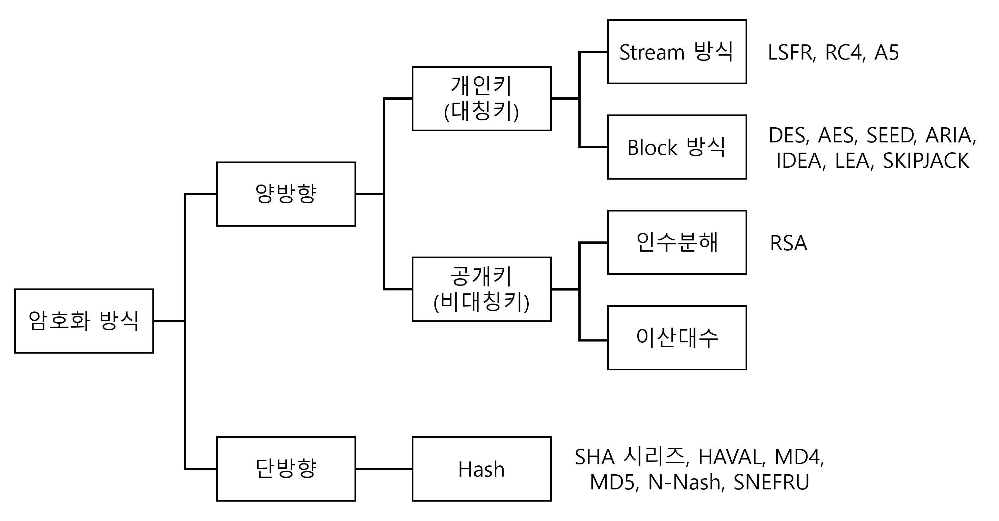

# 3. 소프트웨어 개발 보안 구축
## 191. Secure SDLC
- 보안상 안전한 소프트웨어를 개발하기 위해 SDLC(Software Development Life Cycle)에 보안 강화를 위한 프로세스를 포함한 것
- 유지보수 단계에서 보안 이슈를 해결하기 위해 소모되는 많은 비용을 최소화
- 요구사항 분석, 설계, 구현, 테스트, 유지보수 등 SDLC 전체 단계에 걸쳐 수행되어야 할 보안활동

#### Secure SDLC 방법론
- CLASP
    - Secure Software사에서 개발
    - SDLC 초기 단계에서 보안을 강화하기 위해 개발
    - 활동 중심, 역할 기반의 프로세스로 구성
    - 현재 운용 중인 시스템에 적용하기에 적합
- SDL
    - 마이크로소프트사에서 개발
    - 전통적인 나선형 모델을 기반
- Seven Touchpoints
    - 소프트웨어 보안의 모범사례를 SDLC에 통합한 방법론
    - 설계 및 개발 과정의 모든 산출물에 대해 위험 분석 및 테스트 수행
    - 각 단계에 관련된 7개의 보안 강화 활동 수행

### 요구사항 분석 단계에서의 보안활동
- 보안 항목에 해당하는 요구사항을 식별하는 작업 수행
- 전산화되는 정보가 가지고 있는 보안 수준을 보안 요소별로 등급을 구분하여 분류

### 💡 보안 요소
- 기밀성
    - 시스템 내의 정보와 자원은 인가된 사용자에게만 접근 허용
    - 정보가 전송 중에 노출되더라도 데이터를 읽을 수 없음
- 무결성
    - 시스템 내의 정보는 오직 인가된 사용자만 수정할 수 있음
- 가용성
    - 인가받은 사용자는 언제라도 사용할 수 있음
- 인증
    - 시스템 내의 정보와 자원을 사용하려는 사용자가 합법적인 사용자인지 확인하는 모든 행위
    - 패스워드, 인증용 카드, 지문 검사
- 부인방지
    - 데이터를 송 · 수신한 자가 송 · 수신 사실을 부인할 수 없도록 송 · 수신 증거를 제공

### 설계 단계에서의 보안활동
- 식별된 보안 요구사항들을 소프트웨어 설계서에 반영하고, 보안 설계서 작성
- 소프트웨어에서 발생할 수 있는 위협을 식별하여 보안대책, 소요예산, 사고발생 시 영향 범위와 대응책 등을 수립
- 네트워크 : 외부의 사이버 공격으로부터 개발 환경을 보호하기 위해 네트워크를 분리하거나 방화벽 설치
- 서버 : 보안이 뛰어난 운영체제를 사용하오 보안 업데이트, 외부접속에 대한 접근통제 등을 실시
- 물리적 보안 : 출입통제, 개발 공간 제한, 폐쇄회로 등 감시설비 설치
- 개발 프로그램 : 허가되지 않은 프로그램을 통제하고 지속적인 데이터 무결성 검사를 실시

### 구현 단계에서의 보안활동
- 표준 코딩 정의서 및 소프트웨어 개발 보안 가이드를 준수하며, 설계서에 따라 보안 요구사항을 구현
- 개발과정 중에 지속적인 단위 테스트를 통해 소프트웨어에 발생할 수 있는 보안 취약점을 최소화
- 코드 점검 및 소스 코드 진단 작업을 통해 소스 코드의 안정성 확보

### 💡 시큐어 코딩(Secure Coding)
- 구현 단계에서 발생할 수 있는 보안 취약점들을 최소화하기 위해 보안 요소를 고려하여 코딩

### 테스트 단계에서의 보안활동
- 설계 단계에서 작성한 보안 설계서를 바탕으로 보안 사항들이 정확히 반영되고 동작되는지 점검
- 동적 분석 도구, 모의 침투테스트를 통해 설계 단계에서 식별된 위협들의 해결여부를 검증
- 구현 단계에서 추가로 제시된 위협들과 취약점들을 점검할 수 있도록 테스트 계획 수립하고 시행
- 테스트 단계에서 수행한 모든 결과는 문서화하여 보존하고, 개발자에게 피드백 되어야 함

### 유지보수 단계에서의 보안활동
- 이전 과정을 모두 수행하였음에도 발생할 수 있는 보안사고들을 식별
- 사고 발생 시 이를 해결하고 보안 패치를 실시

## 192. 세션 통제
- 세션은 서버와 클라이언트의 연결을 의미
- 세션 통제는 세션의 견결과 연결로 인해 발생하는 정보를 관리하는 것
- 요구사항 분석 및 설계 단계에서 진단해야하는 보안 점검 내용
- 보안 약점 : 불충분한 세션관리, 잘못된 세션에 의한 정보 노출

### 불충분한 세션관리
- 일정한 규칙이 존재하는 세션ID가 발급되거나 타임아웃이 너무 길게 설정되어 있는 경우 발생할 수 있는 보안약점
- 침입자는 세션 하이재킹과 같은 공격을 통해 획득한 세션ID로 인가되지 않은 시스템의 기능을 이용하거나 중요한 정보에 접근

#### 💡 세션 하이재킹
- 서버에 접속하고 있는 클라이언트들의 세션 정보를 가로채는 공격 기법
- 정상적인 연결을 RST(Reset)패킷을 통해 종료시킨 후 재연결 시 희생자가 아닌 공격자에게 연결하는 방식
- 공격자는 서버와 상호 간의 동기화된 시퀀스 번호를 이용해 인가되지 않은 시스템의 기능을 이용하거나 중요한 정보에 접근
- 탐지 방법 : 비동기화 상태 탐시, ACK Storm 탐지, 패킷의 유실 탐지, 예상치 못한 접속의 리셋 탐지
- ACK Storm : 세션 하이재킹 과정 중에 패킷량이 비정상적으로 늘어나는 현상

### 잘못된 세션에 의한 정보 노출
- 다중 스레드 환경에서 멤버 변수에 정보를 저장할 때 발생하는 보안 약점
- 싱글톤 패턴에서 발생하는 레이스컨디션으로 인해 동기화 오류가 발생하거나, 멤버 변수의 정보가 노출될 수 있음
- 멤버 변수보다 지역 변수를 활용하여 변수의 범위를 제한함으로써 방지

### 세션 설계시 고려 사항
- 시스템 모든 페이지에서 로그아웃이 가능하도록 UI를 구성
- 로그아웃 요청 시 할당된 세션이 완전히 제거
- 세션 타임아웃은 중요도가 높으면 2~5분, 낮으면 15~30분
- 이전 세션이 종료되지 않으면 새 세션이 생성되지 못하도록 설계
- 중복 로그인 허용하지 않은 경우 클라이언트의 중복 접근에 대한 세션 관리 정책 수립
- 패스워드 변경 시 활성화된 세션을 삭제하고 재할당

### 세션ID 관리 방법
- 안전한 서버에서 최소 128비트의 길이로 생성
- 예측이 불가능하도록 안전한 난수 알고리즘 적용
- 노출되지 않도록 URL Rewrite 기능을 사용하지 않는 방향으로 설계
    - URL Rewrite : 쿠키를 사용할 수 없는 환경에서 세션ID 전달을 위해 URL에 세션ID를 포함시키는 것
- 로그인 시 로그인 전의 세션ID를 삭제하고 재할당
- 장기간 접속하고 있는 세션ID는 주기적으로 재할당되도록 설계

## 193. 입력 데이터 검증 및 표현
- 입력 데이터로 인해 발생하는 문제들을 예방하기 위해 구현 단계에서 검증해야 하는 보안 점검 항목
- 구현 단계에서 유효성 검증 체계를 갖춤
- 검증되지 않은 데이터가 입력되는 경우, 이를 처리할 수 있도록 구현
- 지정된 자료형이 올바른지 확인하고, 일관된 언어셋을 사용하도록 코딩

### 입력 데이터 검증 및 표현의 보안 약점
1\) SQL 삽입(SQL Injection)
- 웹 응용 프로그램에 SQL을 삽입하여 내부 DB 서버의 데이터를 유출 및 변소하고, 관리자 인증을 우회하는 보안 약점
- 동적 쿼리에 사용되는 입력 데이터에 예약어 및 특수문자가 입력되지 않게 필터링 되도록 설정하여 방지

2\) 경로 조작 및 자원 삽입
- 데이터 입출력 경로를 조작하여 서버 자원을 수정, 삭제할 수 있는 보안 약점
- 사용자 입력값을 식별자로 사용하는 경우, 경로 순회 공격을 막는 필터를 사용해 방지할 수 있음

3\) 크로스사이트 스크립팅(XSS; Cross Site Scripting)
- 웹페이지에 악의적인 스크립트를 삽입하여 방문자들의 정보를 탈취하거나, 비정상적인 기능 수행을 유발하는 보안 약점
- HTML 태그의 사용을 제한하거나 스트립트에 합입되지 않도록 '<', '>', '&' 등의 문자를 다른 문자로 치환함으로써 방지

4\) 운영체제 명령어 삽입
- 외부 입력값을 통해 시스템 명령어의 실행을 유도함으로써 권한을 탈취하거나 시스템 장애를 유발하는 보안 약점
- 웹 인터페이스를 통해 시스템 명령어가 전달되지 않도록 하고, 외부 입력값을 검증없이 내부 명령어로 사용하지 않음으로써 방지

5\) 위험한 형식 파일 업로드
- 악의적인 명령어가 포함된 스크립트 파일을 업로드함으로써 시스템에 손상을 주거나, 시스템을 제어할 수 있는 보안 약점
- 업로드 되는 파일의 확장자 제한, 파일명의 암호화, 웹사이트와 파일 서버의 경로 분리, 실행 속성을 제거하는 등의 방법으로 방지

6\) 신뢰되지 않는 URL 주소로 자동접속 연결
- 입력 값으로 사이트 주소를 받는 경우 이를 조작하여 방문자를 피싱 사이트로 유도하는 보안 약점
- 연결되는 외부 사이트의 주소를 화이트 리스트로 관리함으로써 방지

7\) 메모리 버퍼 오버플로
- 연속된 메모리 공간을 사용하는 프로그램에서 할당된 메모리의 범위를 넘어선 위치에서 자료를 읽거나 쓰려고 할 때 발생하는 보안 약점
- 프로그램의 오동작을 유발시키거나, 악의적인 코드를 실행시켜 공격자가 프로그램을 통제할 수 있는 권한을 획득하게 함
- 적절한 버퍼의 크기를 설정하고, 설정된 범위의 메모리 내에서 올바르게 읽거나 쓸 수 있도록 함으로써 방지

## 194. 보안 기능
- 구현 단계에서 코딩하는 기능인 인증, 접근제어, 기밀성, 암호화 등을 올바르게 구현하기 위한 보안 점검 항목
- 서비스 환경이나 취급 데이터에 맞게 처리될 수 있도록 구현해야 함
- 사용자별로 중요도를 구분하고, 차별화된 인증 방안을 적용
- 데이터에 개별적으로 접근 권한을 부여해 인가되지 않은 기능과 데이터로의 접근을 차단
- 개인정보나 인증정보와 같은 중요한 정보의 변조, 삭제, 오남용 등을 방지하기 위해 안전한 암호화 기술을 적용

### 보안 기능의 보안 약점
1\) 적절한 인증없이 중요기능 허용
- 보안검사를 우회하여 인증과정 없이 중요한 정보 또는 기능에 접근 및 변경이 가능
- 중요정보나 기능을 수행하는 페이지에서는 재인증 기능을 수행하도록하여 방지

2\) 부적절한 인가
- 접근제어 기능이 없는 실행경로를 통해 정보 또는 권한을 탈취할 수 있음
- 모든 실행경로에 대해 접근제어 검사를 수행하고, 사용자에게는 반드시 필요한 접근 권한만 부여하여 방지

3\) 중요한 자원에 대한 잘못된 권한 설정
- 권한 설정이 잘못된 자원에 접근하여 해당 자원을 임의로 사용
- 소프트웨어 관리자만 자원을 읽고 쓸 수 있도록 설정하고, 인가되지 않은 사용자의 중요 자원에 대한 접근 여부를 검사함으로써 방지

4\) 취약한 암호화 알고리즘 사용
- 암호화된 환경설정 파일을 해독하여 비밀번호 등의 중요정보를 탈취
- 안전한 암호화 알고리즘 이용하고, 안정성을 확인한 암호모듈을 이용함으로써 방지

5\) 중요정보 평문 저장 및 전송
- 암호화되지 않은 평문 데이터를 탕취하여 중요한 정보를 획득
- 중요한 정보를 저장하거나 전송할 때 반드시 암호화 과정을 거치도록 하고, HTTPS 또는 SSL과 같은 보안 채널을 이용함으로써 방지

6\) 하드코드된 비밀번호
- 소스코드 유출 시 내부에 하드코드된 패스워드를 이용해 관리자 권한을 탈취
- 패스워드를 암호화하여 별도의 파일에 저장하고, 디폴트 패스워드나 디폴드 키의 사용을 피함으로써 방지

## 195. 시간 및 상태
- 동시 수행을 지원하는 병렬 처리 시스템이나 다수의 프로세스가 동작하는 환경에서 시스템이 원활하게 동작되도록 하기 위한 보안 검증 항목
- 보안약점 : TOCTOU조건, 종료되지 않는 반복문, 재귀함수
- 시간 및 상태 점검 미비로 발생하는 각종 오류들은 공격자에 의해 악용될 수 있음

### TOCTOU 경쟁조건
- 검사시점(Time Of Check)과 사용시점(Time Of Use)을 고려하지 않고 코딩하는 경우 발생하는 보안약점
- 검사시점(TOC)에 사용이 가능했던 자원이 사용시점(TOC)에는 사용할 수 없게 된 경우 발생
- 프로세스가 가진 자원정보와 실제 자원 상태가 일치하지 않는 동기화 오류, 쿄착상태 등이 발생
- 코드 내에 동기화 구문을 사용하여 해당 자원에는 한 번에 하나의 프로세스만 접근 가능하도록 구성함으로써 방지
- 동기화 구문은 성능 감소를 동반하기 때문에 반드시 필요한 부분에 한정하여 사용

### 종료되지 않는 반복문 또는 재귀함수
- 종료 조건을 정의하지 않았거나 논리 구조상 종료될 수 없는 경우 발생하는 보안약점
- 시스템 자원이 끊임없이 사용되어 자원고갈로 인한 서비스 장애 또는 시스템 장애가 발생
- 수행 횟수를 제한하는 설정을 추가하거나, 종료 조건을 점검하여 반복 또는 호출의 종료 여부를 확인함으로써 방지

## 196. 에러처리
- 소프트웨어 실행 중 발생할 수 있는 오류(Error)들을 사전에 정의하여 오류로 인해 발생할 수 있는 문제들을 예방하기 위한 보안 점검 항목
- 예외처리 구문을 통해 오류에 대한 사항을 정의
- 예외처리 구문으로 처리하지 못한 오류들은 중요정보를 노출시키거나, 소프트웨어의 실행이 중단되는 등 예기치 못한 문제를 발생시킬 수 있음
- 보안약점 : 오류를 통한 정보 노출, 오류 상황 대응 부재, 부적절한 예외처리

### 오류 메시지를 통한 정보노출
- 실행활경, 사용자 정보, 디버깅 정보 등의 중요 정보를 소프트웨어가 메시지로 외부에 노출하는 보안약점
- 오류 메시지로 노출되는 경로 및 디버깅 정보는 해커의 악의적인 행위를 도움
- 가능한 한 내부에서만 처리되도록 하거나 메시지를 출력할 경우 최소한의 정보 또는 사전에 준비된 메시지만 출력되도록 함으로써 방지

### 오류 상황 대응 부재
- 소프트웨어 개발 중 예외처리를 하지 않았거나 미비로 인해 발생하는 보안 약점
- 소프트웨어의 실행이 중단되거나 의도를 벗어난 동작이 유도될 수 있음
- 예외처리 구분을 작성하고, 제어문을 활용하여 오류가 악용되지 않도록 코딩함으로써 방지

### 부적절한 예외처리
- 함수의 반환값 또는 오류들을 세분화하여 처리하지 않고 광범위하게 묶어 한 번에 처리하거나, 누락된 예외가 존재할 때 발생하는 보안 약점
- 모든 오류들을 광범위한 예외처리 구문으로 정의해버리면 예기치 않은 문제가 발생할 수 있음
- 함수 등이 예상했던 결과와 다른 값을 반환하여 예외로 처리되지 않은 경우 잘못된 값으로 인해 다양한 문제가 발생
- 모든 함수의 반환값이 의도대로 출력되는지 확인하고, 세분화된 예외처리를 수행함으로써 방지

## 197. 코드 오류
- 구현 단계에서 개발자들이 코딩 중 실수하기 쉬운 형변환, 자원 반환 등의 오류를 예방하기 위한 보안 점검 항목
- 보안약점 : 널 포인터 역참조, 부적절한 자원 해제, 해제된 자원 사용, 초기화되지 않은 변수 사용

### 널 포인터(Null Pointer) 역참조
- 널 포인터가 가리키는 메모리에 어떠한 값을 저장할 때 발생하는 보안 약점
- 많은 라이브러리 함수들이 오류가 발생할 경우 널 값을 반환하는데, 이 반환값을 포인터로 참조하는 경우 발생
- 널 포인터는 메모리의 첫 주소를 가리키며, 해당 주소를 참조할 경우 소프트웨어가 비정상적으로 종료될 수 있음
- 공격자가 널 포인터 역참조로 발생하는 예외 상황을 악용할 수 있음
- 널이 될 수 있는 포인터를 이용하기 전에 널 값을 갖고 있는지 검사함으로써 방지

#### 💡 스택 가드(Stack Guard)
- 널 포인터 역참조와 같이 주소가 저장되는 스택에서 발생하는 보안 약점을 막는 기술 중 하나
- 메모리상에서 프로그램의 복귀 주소와 변수 사이에 특정 값을 저장한 후 그 값이 변경되었을 경우, 오버플로우 상태로 판단하여 프로그램 실행을 중단함으로써 잘못된 복귀 주소의 호축을 막는 기술

### 부적절한 자원 해제
- 자원을 반환하는 코드를 누락하거나 프로그램 오류로 할당된 자원을 반환하지 못했을 때 발생하는 보안 약점
- 힙 메모리, 소켓 등의 유한한 시스템 자원이 계속 점유하고 있으면 자원 부족으로 인해 새로운 입력을 처리하지 못 할 수 있음
- 프로그램 내에 자원 반환 코드가 누락되었는지 확인하고, 오류로 인해 함수가 중간에 종료되었을 때 예외처리에 관계없이 자원이 반환되도록 코딩함으로써 방지

### 해제된 자원 사용
- 이미 사용이 종료되어 반환된 메모리를 참조하는 경우 발생하는 보안 약점
- 예상하지 못한 값 또는 코드를 수행하게 되어 의도하지 않은 결과가 발생
- 반환된 메모리에 접근할 수 없도록 주소를 저장하고 있는 포인터를 초기화함으로써 방지

### 초기화되지 않은 변수 사용
- 변수 선언 후 값이 부여되지 않은 변수를 사용할 때 발생하는 보안 약점
- 변수가 선언되어 메모리가 할당되면 해당 메모리에 이전에 사용하던 내용이 계속 남아있어 변수가 외부에 노출되는 경우 중요정보가 악용될 수 있음
- 변수 선언 시 할당된 메모리를 초기화함으로써 방지

## 198. 캡슐화
- 정보 은닉이 필요한 중요한 데이터와 기능을 불충분하게 캡슈화하거나 잘못 사용함으로써 발생할 수 있는 문제를 예방하기 위한 보안 점검 항목
- 보안약점 : 잘못된 세션에 의한 정보 노출, 제거되지 않고 남은 디버그 코드, 시스템 데이터 정보 노출

### 잘못된 세션에 의한 정보 노출
- 다중 스레드 환경에서 멤버변수에 정보를 저장할 때 발생하는 보안약점
- 싱글톤 패턴에서 발생하는 레이스컨디션으로 인해 동기화 오류가 발생하거나, 멤버 변수의 정보가 노출될 수 있음
- 멤버 변수보다 지역 변수를 활용하여 변수의 범위를 제한함으로써 방지

### 제거되지 않고 남은 디버그 코드
- 개발 중에 버그 수정이나 결과값 확인을 위해 남겨둔 코드들로 인해 발생하는 보안약점
- 소프트웨어 제어에 사용되는 중요한 정보가 디버그 코드로 인해 노출될 수 있음
- 디버그 코드에 인증 및 식별 절차를 생략하거나 우회하는 코드가 포함되어 있는 경우 공격자가 이를 악용할 수 있음
- 소프트웨어 배포 전에 코드 검사를 통해 남아있는 디버그 코드를 삭제함으로써 방지

### 시스템 데이터 정보 노출
- 시스템의 내부 정보를 시스템 메시지 등을 통해 외부로 출력하도록 코딩했을 때 발생하는 보안약점
- 최소한의 정보만을 제공함으로써 방지

### Public 메소드로부터 반환된 Private 배역
- 선언된 클래스 내에서만 접근이 가능한 Private 배열을 모든 클래스에서 접근이 가능한 Public 메소드에서 반환할 때 발생하는 보안약점
- 배열의 주소가 외부로 공개되어 외부에서 접근할 수 있음
- Private 배열을 별도의 메소드를 통해 조작하거나, 동일한 형태의 복제본으로 반환받은 후 값을 전달하는 방식으로 방지

### Private 배열에 Public 데이터 할당
- Private 배열에 Public 으로 선언된 데이터 또는 메소드의 파라미터를 저장할 때 발생하는 보안약점
- Private 배열을 외부에서 접근할 수 있게 됨
- Public으로 선언된 데이터를 Private 배열에 저장할 때, 레퍼런스가 아닌 값을 직접 저장함으로써 방지

## 199. API 오용
- 구현 단계에서 API를 잘못 사용하거나 보안에 취약한 API를 사용하지 않도록 하기 위한 보안 검증 항목
- 보안약점 : DNS lookup에 의존한 보안 결정, 취약한 API 사용

### DNS lookup에 의존한 보안 결정
- 도메인명에 의존하여 인증이나 접근 통제 등의 보안 결정을 내리는 경우 발생하는 보안약점
- DNS 엔트리를 속여 동일한 도메인에 속한 서버인 것처럼 위장하거나, 사용자와 서버 간의 네트워크 트래픽을 유도하여 악성 사이트를 경우하도록 조작할 수 있음
- 공격자는 DNS lookup을 악용해 인증이나 접근 통제를 우회하는 수법으로 권한을 탈취
- DNS 검색을 통해 도메인 이름을 비교하지 않고 IP 주소를 직접 입력하여 접근함으로써 방지

### 취약한 API 사용
- 보안 문제로 사용이 금지된 API를 사용하거나, 잘못된 방식으로 API를 사용했을 때 발생하는 보안약점
- C언어의 문자열함수 strcat(), strcpy(), sprintf() 등이 있음
- 보안상 안전한 API라고 하더라도 자원에 대한 직접 연결이나, 네트워크 소켓을 통한 직접 호출과 같이 보안에 위협을 줄 수 있는 인터페이스를 사용하는 경우 보안약점이 노출됨
- 안전한 함수로 대체하고, API 매뉴얼을 참고하여 보안이 보장되는 인터페이스를 사용함으로써 방지

## 200. 암호 알고리즘
- 패스워드, 주민번호, 은행계좌와 같은 중요정보를 보호하기 위해 평문을 암호화된 문장으로 만드는 절차 또는 방법
- 해시(Hash)를 사용하는 단방향 암호화 방식, 개인키 및 공개키로 분류되는 양방향 암호화 방식

### 개인키 암호화(Private Key Encryption) 기법
- 동일한 키로 데이터를 암복호화
- 대칭 암호 기법, 비밀키 암호화 기법
- 암호화 대상이 n개일 때, 사용되는 키의 개수는 n(n-1)/2
- 블록 암호화 방식
    - 한 번에 하나의 데이터 블록을 암호화
    - DES, AES, SEED, ARIA, IDEA, LEA, SKIPJACK
- 스트림 암호화 방식
    - 평문과 동일한 길이의 스트림을 생성하여 비트/바이트/워드 단위로 암호화
    - LSFR, RC4, A5
- 장점
    - 암복호화 속도가 빠름
    - 알고리즘 단순
    - 공개키 암호 기법보다 파일의 크기가 작음
- 단점
    - 사용자의 증가에 따라 관리해야할 키의 수가 상대적으로 많아짐

### 공개키 암호화(Public Key Enctyprtion) 기법
- 암호화할 때, 사용하는 공개키(Public Key)는 데이터베이트 사용자에게 공개
- 복호화할 때, 비밀키(Secret Key)는 관리자가 비밀리에 관리
- 비대칭 암호 기법
- 암호화 대상이 n개일 때, 사용되는 키의 개수는 2n
- 자신만이 보관하는 비밀키를 이용하여 인증, 전자서명 등에 적용 가능
- 장점
    - 키의 분배 용이
    - 관리해야 할 키의 개수 적음
- 단점
    - 암복호화 속도가 느림
    - 알고리즘 복잡
    - 개인키 암호화 기법보다 파일의 크기가 큼

### 💡 양방향 알고리즘 종류
1\) SEED
    - 1999년 한국인터넷진흥원(KISA)에서 개발한 블록 암호화 알고리즘
    - 128비트 블록, 128비트키, 16라운드, Feistel 구조(한국)

2\) ARIA(Academy, Research Institute, Agency)
    - 2004년 국가정보원과 산학연협회가 개발한 블록 암호화 알고리즘
    - 128비트 블록, 128/192/256비트키, 12/14/16라운드, SPN 구조(한국)

3\) DES(Data Encryption Stadard)
    - 1975년 미국 NBS에서 발표한 개인키 암호화 알고리즘
    - 3번 적용해 보안을 더욱 강화한 3DES도 있음
    - 64비트 블록, 56비트키, 16라운드, Feistel 구조

4\) AES(Advanced Encryption Standard)
    - 2001년 미국 표준 기술 연구소(NIST)에서 발표한 개인키 암호화 알고리즘
    - DES 보완
    - 128비트 블록, 128/192/256비트키, 10/12/14 라운드, SPN 구조

5\) RSA(Rivest Shamir Adleman)
    - 1978년 MIT의 라이베이트, 샤미르, 애들먼에 의해 제안된 공개키 암호화 알고리즘
    - 큰 숫자를 소인수분해하기 어렵다는 것에 기반하여 만들어짐
    - 공개키와 비밀키를 사용하는데 여기서 키란 메시지를 열고 잠그는 상수(Constant)를 의미

### 해시(Hash)
- 임의의 길이의 입력 데이터나 메시지를 고정된 길이의 값이나 키로 변환하는 것
- 무결성 검증을 위해 사용될 뿐만 아니라 정보보호의 다양한 분야에서 활용
- 복호화가 거의 불가능한 일방향 함수
- SHA 시리즈, HAVAL, MD4, MD5, N-Nash, SNEFRU

1\) SHA 시리즈
    - 1993년 미국 국가안보국이 설계, 미국 국립 표준 기술 연구소에 의해 발표

2\) MD5 (Message Digest algorithm 5)
    - 1991년 R.Rivest가 MD4를 대체하기 위해 고안한 암호화 해시 함수
    - 블록 크기 : 512 비트
    - 키 길이 : 128 비트

3\) N-NASH
    - 1989년 일본의 전신전화주식회사에서 발표한 암호화 해시 함수
    - 블록 크기 & 키 길이 : 128 비트

4\) SNEFRU
    - 1990년 R.C.Merkle가 발표한 해시 함수
    - 32비트 프로세서에서 구현을 용이하게 할 목적으로 개발
    - 128비트 및 256비트의 출력을 지원
    - 이집트 파라오의 이름을 따 명명됨

### 💡 솔트(Salt)
- 동일한 패스워드를 동일한 암호화 알고리즘을 적용하게 되면 결과가 동일하게 나오는 현상을 방지하기 위해 암호화를 수행하기에 앞서 원문에 무작위의 값을 덧붙이는 과정
- 무작위 값을 솔트
- 같은 패스워드에 대해 암호화를 수행하더라도 서로 다른 결과가 나타나게 되어 더 안전하게 암호화된 데이터를 관리

 

# Reference
- 정보처리기사 필기 (시나공)