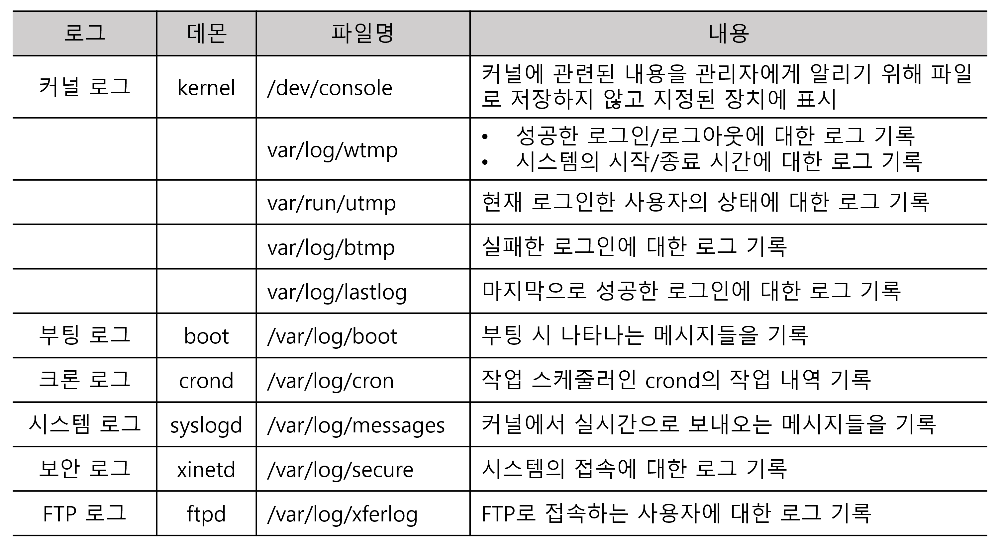
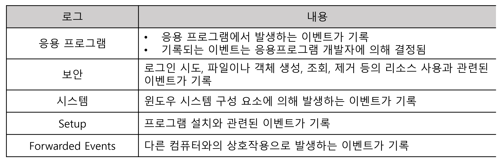

# 4. 시스템 보안 구축
## 201.
## 202.
## 203.
## 204. 로그 분석
- 시스템 사용에 대한 모든 내역을 기록해 놓은 것
- 시스템 침해 사고 발생 시 해킹 흔적이나 공격 기법을 파악할 수 있음
- 시스템에 대한 침입 흔적이나 취약점을 확인할 수 있음

### 리눅스 로그
- 시스템의 모든 로그를 var/log 디렉터리에 기록하고 관리
- 로그 파일을 관리하는 Syslogd 데몬은 etc/syslog.conf 파일을 읽어 로그 관련 파일들의 위치를 파악한 후 로그 작업을 시작
- syslog.conf 파일을 수정해 로그관련 파일들의 저장 위치와 파일명 변경 가능

### 리눅스의 주요 로그 파일

### 윈도우 로그
- 이벤트 로그 형식으로 시스템의 로그를 관리
- 윈도우의 이벤트 뷰어로 이벤트 로그 확인
- 제어판 → 관리도구 → 이벤트 뷰어

### 윈도우 이벤트 뷰어 로그

## 205.
## 206.