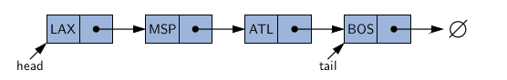
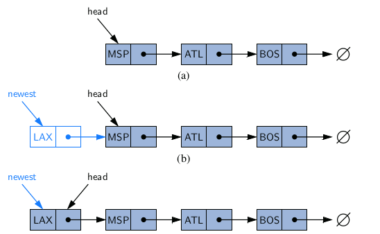
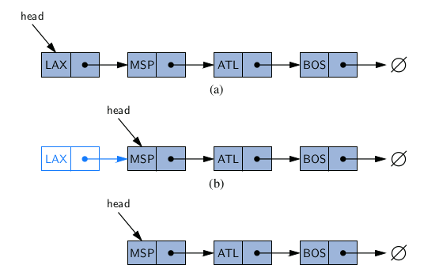
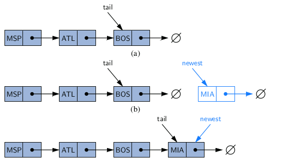

- Linked List와 Array는 Leanear order structure 데이터 간에 전후 순서가 있는 elements를 저장하는 자료구조

### Array
- 장점
    - 임의의 인덱스에 빠르게 접근 가능
- 단점
    - 제한된 메모리 크기를 미리 할당해서 사용
    - Array의 사이즈를 늘리거나 줄이려고 하면 오버헤드 발생
    - 기존의 데이터를 copy 하는 연산이 들어가기 때문
### Linked List
- 장점
    - 사이즈를 동적으로 수정 가능
- 단점
    - 임의의 노드에 접근하기 위해서는 앞에서부터 차례대로 따라가야 함

---

## Singly Linked List
- node들의 나열로 이루어진 리스트
- 더이상 데이터가 없으면 pointer는 null을 가리킴
- head : 처음 node
- tail : 마지막 node (null은 아님)
- node를 추가하거나 제거를 해도 List의 큰 틀은 바뀌지 않음
    - 맨 앞은 head, 맨 뒤는 tail

### node 데이터 타입
- element : 우리가 저장하고 싶은 객체 (int, string, char, object...)
- next | pointer (link) : 다음 노드의 주소를 가리킴



```c
#include <iostream>
#include <string>
using namespace std;

typedef string Elem;

class StringNode {
    private:
        Elem elem;
        StringNode* next;

        friend class StringLinkedList;
};

class StringLinkedList {
    private:
        // 외부에서 접근해서 사용되면 자료구조가 망가지기에 private로 선언 (정보은닉)
        StringNode* head; // 첫번째 노드
        StringNode* tail; // 마지막 노드
    public:
        StringLinkedList(); // 기본 생성자
        ~StringLinkedList(); // 기본 소멸자
        bool empty() const; // linkedlist가 비어있는지 확인하는 함수
        Elem front() const; // 가장 앞에 있는 element를 반환 (head의 element 반환)
        void addFront(const Elem& e); // head에 node를 삽입
        void removeFront(); // head에 node 삭제
        void addBack(const Elem& e); // tail에 node 삽입
        void removeBack(); // tail에 node 삭제
}
```

### head에서 삽입 연산
- 추가할 node를 생성
- element를 노드에 추가
- 추가 node의 next가 기존 head를 가리키도록 연결
- 기존 head의 주소를 추가 node의 주소로 업데이트



``` c
void StringLinkedList::addFront(const Elem& e) {
    StringNode* v = new StringNode; // 추가할 node 메모리 할당
    if (empty()) { // linkedlist가 비어 있으면
        tail = v; // tail에 새로운 노드 v
    }

    v -> elem = e;
    v -> next = head;
    head = v;
}
```
### head에서 삭제 연산
- 임시 point 타입 변수를 만들어 head의 주소를 복사
- head가 임시변수의 next를 가리키도록 설정
- 임시 변수를 삭제
- 주의할 점
    - LinkedList의 element가 있는지 확인해야 함
    - element가 없는 경우 삭제하려 할떄 예외처리 필수



``` c
void StringLinekdList::removeFront() {
    // 예외처리
    if (empty()) { // linkedlist가 비어 있으면
        return; // 삭제할 것이 없기에 그냥 반환
    }

    StringNode* old = head; // point 타입 변수에 기존 head의 주소값 저잘
    head = old -> next; // 기존 head의 주소값을 다음 주소값으로 업데이트 (두번째 element를 가리킴)
    delete old; // 기존 head 삭제
    if (empty()) { // 삭제 후, // linkedlist가 비어 있으면
        tail = NULL; // tail을 NULL로 업데이트
    }
}
```

### tail에서 삽입 연산
- 추가할 node를 생성
- element를 노드에 추가
- next는 NULL (마지막에 추가해주는 것이기 때문에)
- 기존의 tail의 next를 추가할 node의 주소를 가키기도록 업데이트
- 추가할 node가 tail이 되도록 추가할 node의 주소값으로 업데이트



``` c
void StringLinkedList::addBack(const Elem& e) {
    StringNode* v = new StringNode; // 추가할 node 메모리 할당
    // 추가할 node의 element값과 next를 지정
    v -> elem = e;
    v -> next = NULL;
    
    if (empty()) { // linkedlist가 비어 있으면
        head = tail = v;
    }
    else { // // linkedlist가 비어있지 않았다면
        tail -> next = v;
        tail = v;
    }
}
```

### tail에서 삭제 연산
- O(n) 시간
- 임시 point 타입 변수를 만들어 head에서부터 확인을 해야함
- 임시 변수의 주소값을 head로 지정
- head에서부터 임시변수의 next가 tail일때까지 next를 타고감
- tail을 삭제
- 임시변수의 next를 NULL로 초기화
- tail의 주소를 임시변수의 주소로 업데이트

``` c
void StringLinkedList::removeBack() {
    // 예외처리
    if (empty()) return; // linkedlist가 비어 있으면 삭제할 것이 없기에 그냥 반환

    StringNode* current = head; // 임시변수를 head를 가리키게 함
    if (current == tail) { // 데이터가 1개밖에 없는 경우
        head = tail = NULL;
        delete current;
    }
    else {
        while (current -> next != tail) { // 임시변수가 tail 앞까지 갈때까지 next를 타고감
            current = current -> next;
        }
        tail = current; // tail을 임시변수 주소를 가리키도록 함
        delete tail -> next; // tail의 next를 삭제
        tail -> next = NULL; // tail의 next를 NULL로 초기화
    }
}
```


### Reference
- https://sbme-tutorials.github.io/2020/data-structure-FALL/notes/week03b.html
- https://walkingtechie.blogspot.com/2018/12/inserting-node-in-singly-linked-list.html
- https://www.geeksforgeeks.org/python-linked-list/