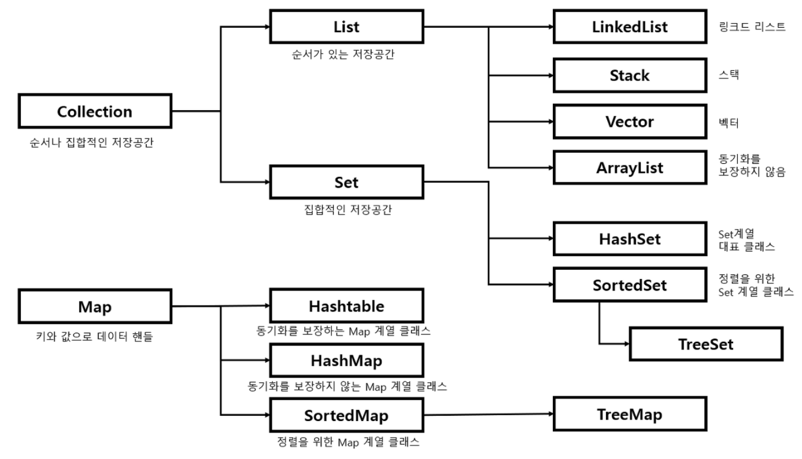

### JAVA Collection Framework

- Collection Framwork를 사용하는 이유
    - 크기 고정, Insert & Delete 시간 등의 문제로 기존 데이터 처리방법을 Array를 보완 (List, Map, Set)

### List

- 순서 존재, 중복 허용
- 인덱스로 원소 접근 가능
- 크기 가변적

### List 종류와 특징

- LinkedList
    - 양방향 포인터 구조로 데이터 Insert, Delete가 빠름
    - ArrayList 보다 검색이 느리다.
- ArrayList
    - 단방향 포인터 구조로 데이터 순차적 접근에 강점
    - 배열 기반 데이터 저장
    - 데이터 Insert, Delete 느리다
    - 데이터 검색 빠르다.

### Map

- Key & Value의 한쌍으로 이루어지는 데이터의 집합
- Key에 대한 중복이 없으며 순서 보장 X
- 검색 속도가 빠르다.
- 인덱스가 따로 존재하지 않기에 iterator를 사용

### Map 종류와 특징

- HashMap
    - Key에 대한 중복이 없으며 순서 보장 X
    - Key와 Value 값으로 NULL 허용
    - 동기화 보장 X
    - 검색 속도가 빠르다
- HashTable
    - 동기화가 보장 ⇒ 병렬 프로그래밍 가능
    - HashMap보다 처리속도 느리다.
    - Key와 Value 값으로 NULL 허용 X
- LinkedHashMap
    - 입력된 순서 보장
- TreeMap
    - 이진 탐색 트리 (Red-Black Tree)를 기반으로 Key와 Value 값 저장
    - Key값을 기준으로 오름차순 정렬
    - 빠른 검색
    - 저장 시 정렬하기 떄문에 시간이 다소 오래걸린다.

### Set

- 순서가 없다.
- 중복된 데이터를 허용 X
- 중복되지 않은 데이터를 구할 때 유용
- 빠른 검색속도
- 인덱스가 따로 존재하지 않기에 iterator를 사용

### Set 종류와 특징

- HashSet
    - 인스턴스의 해시값을 기준으로 저장 ⇒ 순서 보장 X
    - NULL 허용
    - TreeSet보다 Insert, Delete 빠르다
- LinkedHashSet
    - 입력된 순서 보장
- TreeSet
    - 이진 탐색 트리 (Red-Black Tree)를 기반
    - 데이터 오름차순 정렬
    - 데이터 Insert, Delete 시간이 걸리지만 Search, OrderBy는 빠르다

---

### 요약

- List는 기본적으로 데이터들이 순서대로 저장되며 중복 허용
- Map은 순서가 보장되지 않고 Key 값의 중복은 허용하지 않지만 Value 값의 중복을 허용
- Set은 순서가 보장되지 않고 데이터들의 중복을 허용하지 않는다.

### 💡 Reference

- https://cocoon1787.tistory.com/527
- https://wooktae.tistory.com/38