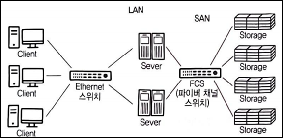

78/100
# 1. 소프트웨어 설계
### 1. 하향식 설계 방법 VS 상향식 설계 방법
#### 하향식 통합 테스트 (Top Down Integration Test)
- 상위 모듈에서 하위 모듈 방향으로 통합하면서 테스트
- 깊이 우선 통합법, 넓이 우선 통합법
- 테스트 초기부터 사용자에게 시스템 구조를 보여줌
- 상위 모듈에서는 테스트 케이스 사용 어려움
- 통합 검사 시 인터페이스가 이미 정의되어 있어 통합이 간단
- 레벨이 낮은 데이터 구조의 세부 사항은 설계 초기 단계에서 필요
- 하향식 통합 방법 순서
    - 주요 제어 모듈은 작성된 프로그램을 사용하며, 주요 제어 모듈의 종속 모듈들은 스텁(Stub)으로 대체
    - 깊이 우선 또는 넓이 우선 등 통합 방식에 따라 하위 모듈인 스텁들이 한 번에 하나씩 실제 모듈로 교체됨
    - 모듈이 통합될 때마다 테스트 실시
    - 새로운 오류가 발생하지 않음을 보증하기 위해 회귀 테스트 실행


#### 상향식 통합 테스트 (Bottom Up Integration Test)
- 하위 모듈에서 상위 모듈 방향으로 통합하면서 테스트
- 가장 하위 단계 모듈부터 통합 및 테스트가 수행되므로 스텁(Stub)은 필요하지 않지만, 하나의 주요 제어 모듈과 관련된 종속 모듈의 그룹인 클러스터(Cluster)가 필요
- 최하위 수준에서 각 모듈들을 설계하고 모듈이 완성되면 결합하여 검사
- 인터페이스가 이미 성립되어 있지 않더라도 기능 추가 어려움
- 상향식 통합 방법 순서
    - 하위 모듈들을 클러스터(Cluster)로 결합
    - 상위 모듈에서 데이터의 입 · 출력을 확인하기 위해 더미 모듈인 드라이버(Driver)를 작성
    - 통합된 클러스터 단위로 테스트
    - 테스트가 완료되면 클러스터는 프로그램 구조의 상위로 이동하여 결합하고 드라이버는 실제 모듈로 대체됨

> 💡 테스트 드라이버와 테스트 스텁 차이점
> 
> 

#### 혼합식 통합 테스트 = 샌드위치식 통합 테스트
- 하위수준에서는 상향식 통합, 상위 수준에서는 하향식 통합

### 2. 클래스 설계 원칙 (SOLID)
#### 객체지향 설계 원칙 (SOLID)
1. 단일 책임 원칙 (SRP; Single Responsibility Principle)
- 객체는 단 하나의 책임만 가져야 한다는 원칙
- 응집도는 높고, 결합도는 낮게 설계
2. 개방-폐쇄 원칙 (OCP; Open-Closed Principle)
- 기존 코드를 변경하지 않고 기능을 추가할 수 있도록 설계
- 공통 인터페이스를 하나의 인터페이스로 묶어 캡슐화하는 방법
- 클래스는 확장에 대해 열려 있어야 하며 변경에 대해 닫혀 있어야 함
3. 리스코프 치원 원칙 (LSP; Liskov Substitution Principle)
- 자식 클래스는 최소한 자신의 부모 클래스에서 가능한 행위는 수행할 수 있어야 한다는 설계
- 자식 클래스는 재정의하지 않고 확장만 수행
4. 인터페이스 분리 원칙 (ISP; Interface Segregation Principle)
- 사용하지 않는 인터페이스와 의존관계를 맺거나 영향을 받지 않아야 한다는 원칙
- 인터페이스가 갖는 하나의 책임
5. 의존 역전 원식 (DIP; Dependency Inversion Principle)
- 각 객체들 간의 의존관계가 성립될 때, 추상성이 낮은 클래스보다 추상성이 높은 클래스와 의존관계를 맺어야 한다는 원칙
- 일반적으로 인터페이스를 활용하면 이 원칙은 준수 됨

### 3. 아키텍처 설계과정
> 설계 목표 설정 → 시스템 타입 결정 → 아키텍처 패턴 적용 → 서브시스템 구체화 → 검토

### 4. ⭐ 디자인 패턴
- 모듈의 세분화된 역할이나 모듈 간의 인터페이스와 같은 코드를 작성하는 수준의 세부적인 구현 방안을 설계할 때 참조할 수 있는 **전형적인 해결방법** 또는 예제
- 문제 및 배경, 실제 적용된 사례, 재사용이 가능한 샘플코드 등으로 구성
- 개발 과정 중에 문제가 발생하면 새로 해결책을 구상하는 것보다 문제에 해당하는 디자인 패턴을 참고해 적용하는 것이 더 효율적
- 한 패턴을 변형하거나 특정 요구사항을 반영하면 유사한 형태의 다른 패턴으로 변화되는 특징 존재
- GoF(Gang of Four) : 생성패턴 5개, 구조패턴 7개, 행위패턴 11개

> 💡 아키텍처 패턴 VS 디자인 패턴
> - 아키텍처 패턴은 디자인 패턴보다 상위 수준 설계
> - 아키텍처 패턴 : 전체 시스템 구조를 설계
> - 다자인 패턴 : 서브 시스템에 속하는 컴포넌트들과 관계를 설계
> - 디자인 패턴은 아키텍처 패턴을 구현하는데 유용

#### 디자인 패턴 장 · 단점
- 구조파악 용이
- 객체지향 설계 및 구현 생산성 높이는데 적합
- 재사용을 통해 개발 시간과 비용 절약
- 초기 투자 비용 부담
- 개발자 간 원활한 의사소통 가능
- 설계 변경 요청에 대한 유연한 대처 가능
- 객체지향을 기반으로 한 설계와 구현을 다루므로 다른 기반의 애플리케이션 개발에 적합하지 않음 (ex. 절차형 언어)

#### 생성 패턴 (Creational Pattern)
객체의 생성과 참조과정을 캠슐화하여 객체가 생성되거나 변경되어도 프로그램 구조에 영향을 크게 받지 않도록 하여 프로그램에 유연성을 더해줌

1. 추상 팩토리 (Abstract Factory)
2. 빌더 (Builder)
3. 팩토리 메소드 (Factory Method) = 가상 생성자 패턴 (Virtual Constructor Pattern)
4. 프로토타입 (Prototype)
5. 싱글톤 (Singleton)

#### 구조 패턴 (Structural Pattern)
클래스나 객체들을 조합해 더 큰 구조로 만들 수 있게 해주는 패턴으로 
구조가 복잡한 시스템을 개발하기 쉽게 도와줌

1. 어댑터 (Adapter)
2. 브리지 (Bridge)
3. 컴포지트 (Composite)
4. 데코레이터 (Decorator)
5. 퍼싸드 (Facade)
6. 플라이웨이트 (Flyweight)
7. 프록시 (Proxy)

#### 행위 패턴 (Behavioral Pattern)
클래스나 객체들이 서로 상호작용하는 방법이나 책임 분배 방법을 정의하는 패턴으로 하나의 객체로 수행할 수 없는 작업을 여러 객체로 분배하면서 결합도를 최소화 할 수 있도록 도와줌

1. 책임 연쇄 (Chain of Responsibility)
2. 커맨드 (Command)
3. 인터프리터 (Interpreter)
4. 반복자 (Iterator)
5. 중재자 (Mediator)
6. 메멘토 (Memento)
7. 옵서버 (Observer)
8. 상태 (State)
9. 전략 (Strategy)
10. 탬플릿 메소드 (Template Method)
11. 방문자 (Visitor)

### 5. FEP
- 입력되는 데이터를 컴퓨터의 프로세서가 처리하기 전에 미리 처리하여 프로세서가 처리하는 시간을 줄여주는 프로그램

# 2. 소프트웨어 개발
### 6. 소프트웨어 패키징
- 모듈별로 생성한 실행 파일들을 묶어 배포용 설치 파일을 만드는 것
- 개발자가 아닌 사용자 중심으로 진행
- 모듈화하여 패키징
- 다양한 환경에서 손쉽게 사용할 수 있도록 일반적인 배포 형태로 패키징
- 신규 및 변경 개발소스를 식별하고, 이를 모듈화하여 사용제품으로 패키징

### 7. N-S차트 (Nassi-Schneiderman Chart)
- 연속, 선택, 다중 선택, 반복 등 제어 논리 구조 표현
- GOTO나 화살표 사용 X
- 조건이 복합되어 있는 곳의 처리를 시각적으로 명확히 식별하는데 적합
- 선택과 반복 구조를 시각적으로 표현
- 이해하기 쉽고, 코드 변환 용이
- 읽기는 쉽지만 작성하기 어려우며, 임의로 제어를 전이하는 것이 불가능
- 총체적인 구조표현과 인터페이스를 나타내기 어려움
- 단일 입구와 단일 출구로 표현
- 논리의 기술에 중점을 두고 도형을 이용한 표현 방법

### 8. ISO/IEC 25000
- 소프트웨어 품질 평가를 위한 소프트웨어 품질평가 통합 모델 표준
- System and Software Quality Requirements and Evaluation으로 줄여서 SQuaRE
- 기존 소프트웨어 품질 평가 모델과 소프트웨어 평가 정차 모델인 ISO/IEC 9126과 ISO/IEC14598을 통합

### 9. 코드 인스펙션
- 프로그램을 실행하지 않고 명세서나 소스 코드를 대상으로 분석하는 테스트
- 개발 초기에 결함을 발견할 수 있어 개발 비용을 낮춤
- 코드 품질 향상 기법
- 결함과 함께 코딩 표준 준수 여부, 효율성 등의 다른 품질 이슈를 검사
- 정적 테스트

# 3. 데이터베이스 구축
### 10. 물리 데이터베이스 설계
- 논리적 구조로 표현된 논리적 데이터베이스를 디스크 등의 물리적 저장장치에 저장할 수 있는 물리적 구조의 데이터로 변환하는 과정
- 기본 데이터 단위는 저장 레코드(Stored Record)
- 저장 레코드의 양식 설계, 레코드 집중(Record Clustering)의 분석 및 설계, 접근 경로 설계
- 단순한 파일과 다름
- 데이터베이스 시스템의 성능에 중대한 영향을 미침
- 물리적 설계 시 고려사항
    - 인덱스 구조
    - 레코드 크기
    - 파일에 존재하는 레코드 개수
    - 파일에 대한 트랜잭션의 갱신과 참조 성향
    - 성능 향상을 위한 개념 스키마의 변경 여부 컴토
    - 빈번한 질의와 **트랜잭션들의 수행속도**를 높이기 위한 고려
    - 시스템 운용 시 파일 크기의 변화 가능성 → 저장 공간의 효율화
    - 응답 시간
- 물리적 설계 전에 기존 시스템을 분석하여 데이터 명명 규칙, 시스템 자원, 데이터베이스 관리 요소 등을 파악해야 함
> **💡 물리적 설계 옵션**
> - 특정 DBMS에서 제공되는 것으로, 데이터베이스 파일에 대한 저장 구조와 접근 경로에 대한 다양한 옵션
> - 반응시간(Response Time) : 트랜잭션 수행을 요구한 시점부터 처리 결과를 얻을 때까지의 경과시간
> - 공간 활용도(Space Utilization) : 데이터베이스 파일과 액세스 경로 구조에 의해 사용되는 저장 공간의 양
> - 트랜잭션 처리량(Transaxtion Throughput) : 단위시간 동안 데이터베이스 시스템에 의해 처리될 수 있는 트랜잭션의 평균 개수

### 11. 정규화
> ⭐ 정규화 과정 정리 ⭐</br>
> **도**메인이 원자값</br>
> **부**분적 함수 종속 제거</br>
> **이**행적 함수 종속 제거</br>
> **결**정자이면서 후보키가 아닌 것 제거</br>
> **다**치 종속 제거</br>
> **조**인 종속성 이용

### 12. BETWEEN
- 값을 다 포함
- ex) BETWEEN 90 AND 95 → 90 이상 95 이하

# 4. 프로그래밍 언어 활용
### 13. 주소값
- EX

``` C
int arr[2][3] = {1,2,3,4,5,6};
int (*p)[3] = NULL;
p = arr;
printf("%d, ", *(p[0]+1) + *(p[1]+2));
printf("%d, ", *(*(p+1)+0) + *(*(p+1)+1));
return 0;
```

||P[N]+0|P[N]+1|P[N]+2|
|---|---|---|---|
|P[0]|1|2|3|
|P[1]|4|5|6|

- P[0] = [1, 2, 3]
- P[0] + 1 = 2
- P[1] = [4, 5, 6]
- P[1] + 2 = 6
- p+1 = 1
- (p+1) + 0 = 4
- (p+1) + 1 = 5
- (*p)[3] = NULL → 3 다음 주소값을 4라는 것을 알려주기 위함

### 14. IPv6
- 표시방법은 16비트씩, 8부분 128비트, 16진수로 구성
- 2<sup>128</sup>개의 주소로 표현
- 등급별, 서비스별로 패킷을 구분할 수 있어 품질보장이 용이
- 확장기능을 통해 보안기능 제공

### 15. Java 예외(Exception)
- 프로그램의 정상적인 실행을 방해하는 조건이나 상태
- 예외가 발생했을 때 프로그래머가 해당 문제에 대비해 작성해 놓은 처리 루틴을 수행하도록 하는 것
- 프로그램을 종료시키거나 로그를 남기도록 하는 것
- C++, Ada, JAVA, JS는 예외처리 기능이 내장되어 있으며, 그 외의 언어에서는 필요한 경우 조건문을 이용해 예외처리 루팅을 작성
- 예외 원인은 컴퓨터 하드웨어 문제, 운영체제의 설정 실수, 라이브러리 손상, 사용자의 입력 실수, 받아들일 수 없는 연산, 할당하지 못하는 기억장치 접근

#### JAVA 예외처리
- 잘못된 동작이나 결과에 영향을 줄 수 있는 예외를 객체로 취급
- java.lang 패키지에서 제공
- try ~ catch문 이용
- catch 블록에서 선언한 변수는 해당 catch 블록에서만 유효
- try ~ catch 안에 또 다른 try ~ catch 문 포함 가능

#### JAVA 주요 예외 객체
|예외 객체|발생 원인|
|---|---|
|ClassNotFoundException|클래스를 찾지 못한 경우|
|NoSuchMethodException|메소드를 찾지 못한 경우|
|FileNotFoundException|파일을 찾지 못한 경우|
|InterruptedIOException|입 · 출력 처리가 중단된 경우|
|ArithmeticException|0으로 나누는 등의 산술 연산에 대한 예외가 발생한 경우|
|IllegalArgumentException|잘못된 인자를 전달한 경우|
|NumberFormatException|숫자 형식으로 변환할 수 없는 문자열을 숫자형식으로 변환한 경우|
|ArrayIndexOutOfBoundsException|배열의 범위를 벗어난 접근을 시도한 경우|
|NegativeArraySizeException|0보다 작은 값으로 배열의 크기를 지정한 경우|
|NullPointerException|존재하지 않는 객체를 참조한 경우|

### 16. TCP/IP
- ICMP(Internet Control Message Protocol) : 전송 오류가 발생하는 경우에 대비해 오류 정보를 전송하는 목적으로 사용되는 프로토콜

### 17. 상호배제 기법
- Semaphore : 임계 구역의 접근을 제어

### 18. Python Print
- 파이썬에서 print는 줄바꿈이 포함되어 있음

# 5. 정보시스템 구축관리
### 19. 정보시스템
- 고가용성 솔루션(HACMP)
    - 각 시스템 간에 공유 디스크를 중심으로 클러스터링으로 엮여 다수의 시스템을 동시에 연결
    - 조직, 기업의 기간 업무 서버 등의 안정성을 높이기 위해 사용
    - 여러 가지 방식으로 구현되며 2개의 서버를 연결하는 것으로 2개의 시스템이 각각 업무를 수행하도록 구현하는 방식

### 20. ⭐ 스토리지
- 단일 디스크로 처리할 수 없는 대용량의 데이터를 저장하기 위해 서버와 저장장치를 연결하는 기술

#### ⭐ DAS (Direct Attached Storage)
- 하드디스크와 같은 데이터 저장장치를 호스트 버스 어댑터에 직접 연결하는 방식
- 저장장치와 호스트 기기 사이에 네트워크 디바이스 없이 직접 연결하는 방식으로 구성
- 서버와 저장장치를 전용 케이블로 직접 연결하는 방식
- 일반 가정에서 컴퓨터에 외장하드를 연결하는 것
- 서버에서 저장장치를 관리
- 저장장치를 직접 연결하므로 속도가 빠르고 설치 및 운영 쉬움
- 초기 구축 비용 및 유지보수 비용 저렴
- 직접 연결 방식이므로 다른 서버에서 접근불가
- 파일 공유 불가
- 확장성 및 유연성이 떨어짐
- 저장데이터가 적고 공유가 필요 없는 환경에 적합


>💡 서버에 스토리지가 직접 연결되어 있어 속도는 빠르나 다른 서버에서 스토리지에 접근하여 사용 불가

#### ⭐ NAS (Network Attached Storage)
- 서버와 저장장치를 네트워크를 통해 연결하는 방식
- 별도의 파일 관리 기능이 있는 NAS Storage가 내장된 저장장치를 직접 관리
- Ethernet 스위치를 통해 다른 서버에서도 스포리지에 접근할 수 있어 파일 고유가 가능
- 장소에 구애받지 않고 저장장치에 쉽게 접근
- DAS에 비해 확장성 및 유연성 우수
- 접속 증가 시 성능이 저하


> 💡 파일 관리 기능이 있는 NAS Storage가 네트워크 상에 독립적으로 연결되어 있으므로 서버들이 자유롭게 스토리지에 접근하여 파일 공유 가능

#### ⭐ SAN (Storage Area Network)
- DAS의 빠른 처리와 NAS의 파일 공유 장점을 혼합한 방식
- 서버와 저장장치를 연결하는 전용 네트워크를 별도로 구성하는 방식
- 광 채널(FC) 스위치를 이용하여 네트워크 구성
    - 컴퓨터 장치 간 데이터의 전송 속도를 기가바이트로 높이기 위한 네트워크 기술
- 광 채널 스위치는 서버나 저장장치를 광케이블로 연결하므로 처리 속도가 빠름
- 저장장치를 공유함으로써 여러 개의 저장장치나 백업 장비를 단일화
- 확작성, 유연성, 가용성 뛰어남
- 높은 트랜잭션 처리에 효과적이나 기존 시스템의 경우 장비의 업그레이드 필요
- 초기 설치 시 별도의 네트워크를 구축해야하므로 비용이 많이 듬


> 💡 서버와 스토리지가 광 채널 스위치로 연결된 별도의 전용 스토리지 네트워크를 구성하는 방식으로, 서버들이 저장장치 및 파일을 자유롭게 공유

### 21. umask
- 리눅스에서 '-'의 수
- 디렉토리 전체 권한 777
- 파일 전체 권한 666
- ex) 파일 권한 644일 경우 umask → 022