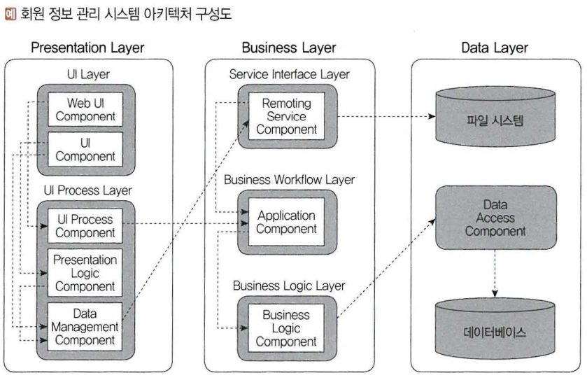
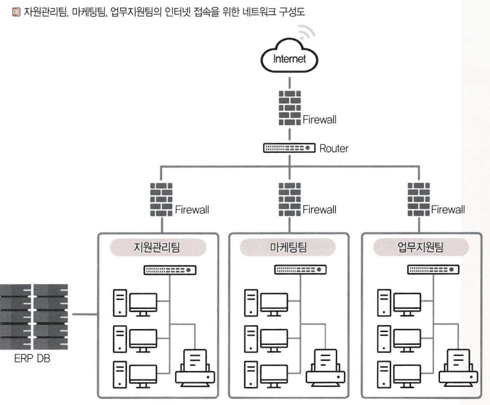
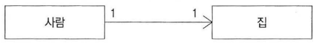
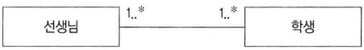
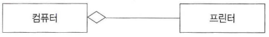

# 1. 요구사항 확인
## 001. 소프트웨어 생명 주기
### 소프트웨어 생명 주기 (Software Life Cycle)
소프트웨어를 개발하기 위해 정의하고 운용, 유지보수 등의 과정을 각 단계별로 나눈 것

> 💡 소프트웨어 공학  
> &emsp;&nbsp;소프트웨어의 품질과 생산성을 향상시키는 것이 목적  
> &emsp;&nbsp;- IEEE의 소프트웨어 공학 표준 용어사전 : 소프트웨어의 개발, 운용, 유지보수, 폐기 처분에 대한 체계적인 접근 방안  
> &emsp;&nbsp;- Fairley : 지정된 비용관 기간 내에 소프트웨어를 체계적으로 생산, 유지보수 하는데 관련된 기술, 관리적인 원리  
> &emsp;&nbsp;- **Boehm** : 과학적인 지식을 소프트웨어 설계와 제작에 응용하는 것. 개발, 운용, 유지보수하는 데 필요한 문서 작성 과정  
>
> 💡 소프트웨어 공학 기본 원칙  
> &emsp;&nbsp;- 현대적인 프로그래밍 기술을 계속적으로 적용  
> &emsp;&nbsp;- 개발된 소프트웨어의 품질이 유지되도록 지속적으로 검증  
> &emsp;&nbsp;- 개발 관련 사항 및 결과에 대한 명확한 기록  

### ⭐ 폭포수 모형 (Waterfall Model, 선형순차적 모형 / 고전적)
- 소프트웨어 개발은 한 단계가 완전히 끝나야만 다음 단계로 넘어가는 개발 방법론
- 소프트웨어 공학에서 가장 오래되고 가장 폭넓게 사용된 전통적인 소프트웨어 생명 주기 모형 → 고전적 생명 주기 모형
- 성공 사례 多 / 메뉴얼 작성
- 각 단계가 끝난 후에는 다음 단계를 수행하기 위한 결과물이 명확하게 산출되어야 함
- 두 개 이상의 과정이 병행하여 수행되지 않음
> 타당성 검토 → 계획 → 요구 분석 → 설계 → 구현(코딩) → 시험(검사) → 유지보수

### 프로토타입 모형 (Prototype Model, 원형 모형)
- 요구사항을 정확히 파악하기 위해 실제 개발된 소프트웨어의 견본(시제)품(Prototype)을 만들어 최종 결과물을 예측하는 모형
- 사용자와 시스템 사이의 인터페이스에 중점을 두어 개발
- 추후 구현 단계에서 골격코드가 됨
- 개발 완료된 시점에서 오류가 발견되는 폭포수 모형의 단점 보완
> 요구 수집 → 빠른 설계 → 프로토타입 구축 → 고객 평가 → 프로토타입 조정 → 구현

### 나선형 모형 (Spiral Model, 점진적 모형 / Boehm)
- 폭포수 모형과 프로토타입 모형의 장점에 위험 분석 기능을 추가한 모형
- 여러 번의 개발과정을 거쳐 점진적으로 완벽한 최종 소프트웨어를 개발하는 것
- 개발 중 발생할 수 있는 위험을 관리하고 최소화 하는 것을 목적
- 누락되거나 추가된 요구사항을 첨가 가능, 유지보수 과정 필요 X
> 계획 → 분석 → 개발 → 평가

### ⭐ 애자일 모형 (Agile Model) ↔ 폭포수 모형
- 고객의 요구사항 변화에 유연하게 대응 할 수 있도록 일정한 주기를 반복하면서 개발 진행
- 고객과의 소통에 초점을 맟춘 방법론
- 기업 활동 전반에 걸쳐 사용
- 스프린트(Sprint) / 이터레이션(Iteration) 짧은 개발 주기를 반복 → 주기마다 만들어지는 결과물에 대한 고객의 평가와 요구를 적극 수용
- 각 개발 주기에서 요구사항 우선순위를 부여해 개발 진행
- 스크럼(Scrum), XP(eXtreme Programming), 칸반(Kanban), Lean, 크리스탈(Crystal), ASD(Adaptive Software Development), 기능 중심 개발(FDD; Feature Driven Development), DSDM(Dynamic System Development Method), DAD(Disciplined Agile Delivery)
> 💡 Agile 핵심가치  
> 1. 개인과 상호작용
> 2. 실행되는 SW
> 3. 고객과 협업
> 4. 변화에 반응하는 것

### 💡 폭포수 모형 & 애자일 모형
|구분|폭포수 모형|애자일 모형|
|---|---|---|
|새로운 요구사항 반영|어려움|지속적으로 반영|
|고객과의 의사소통|적음|지속적인|
|테스트|마지막에 모든 기능 테스트|반복되는 일정 주기가 끝날 때마다 테스트|
|개발 중심|계획, 문석(매뉴얼)|고객|

 

## 002. 스크럼 (Scrum) 기법
### 스크럼 개요
- 팀 중심으로 개발 효율성 높인다.
- 팀원 스스로가 팀을 구성(self-organizing)해야하며, 개발 작업에 모든 것을 스스로 해결(cross-functional)할 수 있어야 한다.

#### 제품 책임자 (PO; Product Owner)
- 개발될 제품에 대한 이해도가 높고, 요구사항을 책임지고 의사결정할 사람 (개발 의뢰자, 사용자)
- 요구사항을 작성하는 주체
- 백로그(Backlog)를 작성하고 백로그에 우선순위 지정
    - 팀원들은 백로그에 추가할 수 있지만 우선순위를 지정 불가
- 제품 테스트 수행하면서 주기적으로 요구사항의 우선순위를 갱신

#### 스크럼 마스터 (SM; Scrum Master)
- 팀이 스크럼을 잘 수행할수 있도록 객관적인 시각에서 조언을 해주는 가이드 역할
    - 팀원 통제 목적X
- 일일 스크럼 회의를 주관해 진행사항 점검, 개발과정에서 발생된 장애 요소를 공론화하여 처리

#### 개발팀 (DT; Development Team)
- PO, SM 제외 개발을 위해 참여하는 모든 사람 (개발자, 디자이너, 테스터 등)
- 보통 최대 인원 7-8명 적당

### ⭐ 스크럼 개발 프로세스
> 제품 백로그 → 스프린트 계획 회의 → 스프린트 → 일일 스크럼 회의 → 스프린트 검토 회의 → 스프린트 회고

#### 1) 제품 백로그 (Product Backlog)
- 개발에 필요한 모든 요구사항(Use Story)을 **우선순위에 따라 나열한 목록**
- 개발과정에서 새롭게 도출되는 요구사항으로 **지속적으로 업데이트**
- 사용자 스토리를 기반으로 전체 일정 계획인 **릴리즈 계획(Release Plan)을 수립**

#### 2) 스프린트 계획 회의 (Sprint Planning Meeting)
- 이번 스프린트에서 수행할 작업을 대상으로 단기 일정 수립
- 요구사항을 Task단위로 분할 후, 개발자별 수행할 작업 목록(= 스프린트 백로그)를 작성

#### 3) 스프린트 (Sprint)
- 실제 개발 작업 진행하는 과정 (2-4주)
- Task를 대상으로 속도(Velocity)를 추정 후 개발 담당자에게 할당
- To Do, In Process, Done의 상태

#### 4) 일일 스크럼 회의 (Daily Scrum Meeting)
- 지정된 시간에 짧은 시간동안 진행 사황을 점검
- 남은 작업 시간은 소멸차트(Born-down Chart)에 표시
- SM은 발견된 장애 요소를 해결할 수 있도록 도와준다.

#### 5) 스프린트 검토 회의 (Spring Review)
- 부분 or 전체 완성 제품이 요구사항에 잘 부합되는지 사용자와 함께 테스팅 수행
- 한 주당 한 시간 내에서 진행
- PO는 개선할 사항에 대한 피드백 정리 후, 다음 스프린트에 반영할 수 있도록 제품 백로그에 업데이트

#### 6) 스프린트 회고 (Sprint Retrospective)
- 스프린트 주기를 되돌아보며 정해놓은 규칙을 잘 준수했는지, 개선할 점은 없는지 등을 확인하고 기록
- 해당 스프린트가 끝난 시점에서 수행하거나 일정 주기로 수행

 

## 003. XP (eXtreme Programming) 기법
### XP (eXtreme Programming)
- 수시로 발생하는 고객의 요구사항에 유연하게 대응하기 위해 고객의 참여와 개발 과정의 반복을 극대화하여 개발 생산성을 향상시키는 방법
- 요구사항이 적용된 일부 기능이 완성될 때마다 이를 고객에게 보여주고 이에 대한 반응을 확인하는 과정을 최종 제품이 완성될 때까지 지속적으로 반복
- 짧고 반복적인 개발 주기, 단순한 설계, 고객의 적극적인 참여를 통해 빠르게 개발하는 것에 목적
- 릴리즈 기간을 짧게 반복, 요구사항 반영에 대한 가시성 높인다.
- 소규모 인원의 개발 프로젝트에 효과적
> **💡 XP의 핵심가치**
> 1. 의사소통 (Communication)
> 2. 단순성 (Simplicity)
> 3. 용기 (Courage)
> 4. 존중 (Respct)
> 5. 피드백 (Reedback)

### ⭐ XP 개발 프로세스

#### 사용자 스토리 (Use Story)
- 고객의 요구사항을 간단한 시나리오로 표현
- 기능 단위로 구성

#### 릴리즈 계획 수립 (Release Planning)
- 몇 개의 스토리가 적용되어 부분적으로 기능이 완료된 제품을 제공하는 것
- 부분 혹은 전체 개발 완료 시점에 대한 일정 수립

#### 스파이크 (Spike)
- 요구사항 신뢰성 높이고 기술 문제에 대한 위험 감소시키기 위해 별도로 만든 간단한 프로그램
- 처리할 문제 외의 다른 조건은 모두 무시하고 작성

#### 이터레이션 (Iteration)
- 하나의 릴리즈를 더 세분화 한 단위
- 일반적으로 1-3주 기간으로 진행
- 새로운 스토리 작성될 수 있으며, 진행 중인 이터레이션 혹은 다음 이터레이션에 포함될 수 있다.

#### 승인 검사 (Acceptance Test, 인수 테스트)
- 하나의 이터레이션 안에서 계획된 릴리즈 단위의 부분 완료 제품 수행 테스트
- 고객이 직접 수행
- 테스트 과정에서 발견한 오류 사항은 다음 이터레이션에 포함
- 테스트 이후 새로운 요구사항이 작성되거나 우선순위 변경될 수 있다.
- 테스트 완료되면 다음 이터레이션 진행

#### 소규모 릴리스 (Small Release)
- 고객의 반응을 기능별로 확인할 수 있어 고객의 요구사항에 좀 더 유연하게 대응
- 최종 테스트 완료 후 릴리즈(최종 결과물)를 고객에게 전달
- 릴리즈가 최종 완제품이 아닌 경우 다음 릴리즈 일정에 맞게 개발을 계속 진행

 

> **💡 XP 주요 실천 방법 (한글 & 영문)**
>
> |실천방법|내용|
> |---|---|
> |Pair Programming  (짝 프로그래밍)|개발에 대한 책임을 공동으로 나눠 같는 환경 조성|
> |Collective Ownership  (공동 코드 소유)|개발 코드에 대한 권한과 책임을 공동으로 소유|
> |Test-Driven Development  (테스트 주도 개발)|- 실제코드 작성 전, 테스트 케이스를 먼저 작성해 무엇을 할지 정확히 파악  - 자동화된 테스팅 도구(프레임워크 등)를 사용해 지속적으로 진행될 수 있도록 한다.|
> |Whole Team  (전체 팀)|참여하는 모든 구성원(고객 포함)들은 자신의 역할에 대하 책임을 가져야 한다.|
> |Continuos Integration  (계속적인 통합)|모듈 단위로 개발된 코드를 하나의 작업이 마무리될 때마다 지속적으로 통합|
> |Design Improvement / Refactoring  (디자인 개선 / 리팩토링)|프로그램의 기능 변경 없이 단순화, 유연성 강화 등을 통해 시스템을 재구성|
> |Small Releases  (소규모 릴리즈)|릴리즈 기간을 짧게 반복함으로써 고객의 요구 변화에 신속히 대응|

 

## 004. 현행 시스템 파악
### 현행 시스템 파악 절차
> (1단계) 시스템 구성 파악 → 시스템 기능 파악 → 시스템 인터페이스 파악 → (2단계) 아키텍쳐 구성 파악 → 소프트웨어 구성 파악 → (3단계) 하드웨어 구성 파악 → 네트워크 구성 파악

### 시스템 구성 파악
- 기간업무 : 조직의 주요 업무를 담담
- 지원업무 : 기간업무를 지원
- 각 업무에 속하는 단위 엄무 정보 시스템들의 명칭, 주요 기능을 명시

### 시스템 기능 파악
- 현재 제공하는 기능들을 주요 기능, 하부 기능, 세부 기능으로 구분하여 계층형으로 표시

### 시스템 인터페이스 파악
- 단위 업무 시스템 간 주고받는 데이터 종류, 형식, 프로토콜, 연계 유형, 주기 등을 명시
- 데이터를 어떤 형식으로 주고 받는지 (xml, 고정포맷, 가변포맷 등), 통신규약을 무엇을 사용하는지 (TCP/IP, X25 등), 연계 유형은 무엇인지 (EAI, FEP 등) 반드시 고려

### 아키텍쳐 구성 파악
- 어떠한 기술 요소들이 사용되는지 최상위 수준에서 계층별로 표현한 아키텍쳐 구성도로 작성
- 단위 업무 시스템별로 다른 경우, 가장 핵심이 되는 기간 업무 처리 시스템을 기준으로 표현

### 소프트웨어 구성 파악
- 단위 업무 시스템별 설치되어 있는 소프트웨어 제품명, 용도, 라이선스 적용 방식, 라이선수 수 등을 명시
- 상용 소프트웨어의 경우 라이선스 적용 방식의 기준과 보유한 라이선수의 파악이 중요
- Apach Tomcat, MySQL, UNIX, Sage, Oracle, Windows 10 등

### 하드웨어 구성 파악
- 단위 업무 시스템들이 운용되는 서버의 주요 사양과 수량, 이중화 적용 여부 명시
- 이중화는 기간 업무의 서비스 기간, 장애 대응 정책에 따라 필요여부가 결정
- 현행 시스템에 이중화가 적용된 경우 새로 구성될 시스템에도 이중화 필요
    - 비용증가, 시스템 구축 난이도 높아질 가능성 고려

### 네트워크 구성 파악
- 서버 위치, 서버 간 네트워크 연결 방식을 네트워크 구성도로 작성
- 물리적인 위치 관계를 바악할 수 있고 보안 취약성을 분석해 적절한 대응 가능
- 네트워크 장애 발생 시, 발생 원인을 찾아 복구하기 위한 용도로 활용 가능

 

## 005. 개발 기술 환경 파악
### 운영체제 (OS; Operating System)
- 컴퓨터 시스템 자원들을 효율적으로 관리하며, 사용자가 컴퓨터를 편리하고 효율적으로 사용할 수 있도록 환경을 제공하는 소프트웨어
- Windows, UNIX, Linux, Max OS, iOS, Android

### 운영체제 관련 요구사항 식별 시 고려사항
#### 가용성
- 시스템의 장시간 운영으로 인해 발생할 수 있는 운영체제 고유의 장애 발생 가능성
- 메모리 누수로 인한 성능 저하 및 재가동
- 지속적인 패치 설치로 인한 재가동
#### 성능
- 대규모 동시 사용자 요청에 대한 처리
- 대규모 및 대용량 파일 작업에 대한 처리
- 지원 가능한 메모리 크기 (32bit, 64bit)
#### 기술지원
- 제작업체의 안정적인 기술 지원
- 여러 사용자들 간의 정보 공유
- 오픈소스 여부 (Linux)
#### 주변기기
- 설치 가능하 하드웨어
- 여러 주변기기 지원 여부
#### 구축비용
- 지원가능한 하드웨어 비용
- 설치할 응용 프로그램의 라이선스 정책 및 비용
- 유지관리 비용
- 총 소유 비용 (TCO)

### 데이터베이스 관리 시스템 (DBMS; DataBase Management System)
- 데이터베이스를 관리해 주는 소프트웨어
- 데이터의 종속성과 중복성 문제를 해결하기 위해 제안된 시스템
- 데이터베이스 구성, 접근 방법, 유지관리에 대한 모든 책임을 진다.
- Oracle, IBM DB2, Microsoft SQL Server, MySQL, SQLite, MongoDB, Redis 등

### DBMS 관련 요구사항 식별 시 고려사항
#### 가용성
- 시스템의 장시간 운영으로 인해 발생할 수 있는 운영체제 고유의 장애 발생 가능성
- DBMS 결함 등으로 인한 패치 설치를 위한 재가동
- 백업이나 복구의 편의성
- DBMS 이중화 및 복제 지원
#### 성능
- 대규모 데이터 처리 성능 (분할 테이블 지원 여부)
- 대용량 드랜잭션 처리 성능
- 튜닝 옵션의 다양한 지원
- 최소화된 설정과 비용 기반 질의 최적화 지원
#### 기술지원
- 제작업체의 안정적인 기술 지원
- 여러 사용자들 간의 정보 공유
- 오픈소스 여부
#### 상호 호환성
- 설치 가능한 운영체제 종류
- JDBC, ODBC와의 호환 여부
#### 구축비용
- 라이선스 정책 및 비용
- 유지관리 비용
- 총 소유 비용 (TCO)

### 웹 어플리케이션 서버 (WAS; Web Application Server)
- 사용자의 요구에 따라 변하는 동적인 콘텐츠를 처리하기 위해 사용되는 미들웨어
    - 웹 서버 : 정적인 콘텐츠 처리
- 데이터 접근, 세션 관리, 트랜잭션 관리 등을 위한 라이브러리 제공
- 데이터베이스 서버와 연동해서 사용
- Tomcat, ClassFish, JBoss, Jetty, JEUS, Resin, WebLogic, WevSphere 등

### 웹 어플리케이션 서버 관련 요구사항 식별 시 고려사항
#### 가용성
- 시스템의 장시간 운영으로 인해 발생할 수 있는 고유의 장애 발생 가능성
- WAS 결함 등으로 인한 패치 설치를 위한 재가동
- 안정적인 트랜잭션 처리
- WAS 이중화 지원
#### 성능
- 대규모 트랜잭션 처리 성능
- 다양한 설정 옵션 지원
- 가비지 컬렉션 (GC; Garbage Collection)의 다양한 옵션
#### 기술지원
- 제작업체의 안정적인 기술 지원
- 여러 사용자들 간의 정보 공유
- 오픈소스 여부
#### 구축비용
- 라이선스 정책 및 비용
- 유지관리 비용
- 총 소유 비용 (TCO)

### 오픈 소스(Open Source) 사용에 따른 고려사항
- 누구나 제한 없이 사용할 수 있도록 소스 코드를 공개한 것
- 라이선수 종류, 사용자 수, 기술의 지속 가능성 등을 고려

 

## 006. 요구사항 정의
### 요구사항의 개념 및 특징
- 서비스에 대한 설명과 정상적으로 운영되는데 필요한 제약조건
- 개발 및 유지보수 과정에서 필요한 기준과 근거 제공
- 서비스에 전반적인 내용을 확인할 수 있어, 개발자와 사용자 들 간의 의사소통을 원활.

### 요구사항의 유형
- 기술내용
    - 기능 요구사항 (Functional requirements)
    - 비기능 요구사항 (Non-functional requirements)
- 기술관점과 대상
    - 시스템 요구사항 (System requirements)
    - 사용자 요구사항 (User requirements)

#### 기능 요구사항 (Functional requirements)
- 시스템이 무엇을 하는지, 어떤 기능을 하는지
- 시스템의 입·출력 정보 / 데이터 정보
#### 비기능 요구사항 (Non-functional requirements)
- 시스템 장비 구성 요구사항
- 성능 요구사항
- 인터페이스 요구사항
- 데이터 요구사항
- 테스트 요구사항
- 보안 요구사항
- 품질 요구사항
- 제약사항
- 프로젝트 관리 요구사항
- 프로젝트 지원 요구사항
#### 사용자 요구사항 (User requirements)
- 사용자 관점에서 본 시스템이 제공해야할 요구사항
- 친숙한 표현으로 이해하기 쉽게 작성
#### 시스템 요구사항 (System requirements) = 소프트웨어 요구사항
- 개발자 관점에서 본 시스템 전체가 사용자와 다른 시스템에 제공해야 할 요구사항
- 전문적이고 기술적인 용어로 표현

### ⭐ 요구사항 개발 프로세스
> 도출(Elicitation) → 분석(Analysis) → 명세(Specification) → 확인(Validation)

#### 요구사항 도출 (Requirement Elicitation, 요구사항 수집) = 청취, 인터뷰 등 질문
- 효율적인 의사소통 중요
- 소프트웨어 개발 생명 주기 동안 지속적으로 반복
- 청취, 인터뷰, 설문, 브레인스토밍, 워크샵, 프로토타이핑, 유스케이스 등

#### 요구사항 분석 (Requirement Analysis) - 분석 및 중재
- 요구사항 중 명확하지 않거나 모호하여 이해되지 않는 부분을 발견하고 걸러내기 위한 과정
- 타당성을 조사하고 비용과 일정에 대한 제약 설정
- 중복되거나 하나로 통합되어야 하는 등 서로 상충되는 요구사항 중재
- 자료 흐름도(DFD), 자료사전(DD) 등 도구가 사용

#### 요구사항 명세 (Requirement Specification) = 관찰 및 모델 작성
- 분석된 요구사항을 바탕으로 모델을 작성하고 문서화 하는 것
- 기능 요구사항은 빠짐없이 완전하고 명확하게 기술
- 비기능 요구사항은 필요한 것만 명확하게 기술
- 사용자가 이해하기 쉬우며, 개발자가 효과적으로 설계할 수 있도록 작성
- 구체적 명세를 위해 소단위 명세서가 사용될 수 있다.

> **💡 요구사항 명세 기법**
> |구분|폭포수 모형|애자일 모형|
> |---|---|---|
> |기법|수학적 원기 기반, 모델 기반|상태 / 기능 / 객체 중심|
> |작성방법|수학적 기호, 정형화된 표기법|일반 명사, 동사 등의 자연어를 기반으로 서술 또는 다이어그램으로 작성|
> |특징|- 정확하고 간결하게 표현  - 일관성 있으므로 완전성 검증이 가능함  - 표기법이 어려워 사용자가 이해하기 어려움|- 자연어 사용으로 일관성이 떨어지고 해석이 달라질 수 있음  - 내용의 이해가 쉬어 의사소통 용이|
> |종류|VDM, Z, Petri-net, CSP 등|FSM, Decision Table, ER모델링, State Chart(SADT) 등|

#### 요구사항 확인 (Requirement Validation, 요구사항 검증)
- 요구사항 명세서가 정확하고 완전하게 작성되었는지 검토
- 실제 요구를 반영하는지, 서로 상충되는 요구사항은 없는지 등 점검
- 내용이 이해하기 쉬운지, 일관성 있는지, 회사 기준에 맞는지, 누락된 기능은 없는지 검증

 

## 007. 요구사항 분석
### ⭐ 요구사항 분석 개요
- 사용자 요구사항을 이해하고 문서화(명세화)하는 것
- 타당성을 조사하고 비용과 일정에 대한 제약 설정
- 정확하고 일관성 있게 분석해 문서화
- UML(Unified Modeling Language), 자료 흐름도(DFD), 자료 사전(DD), 소단위 명세서(Mini-Spec.), 객체 관계도(ERD), 상태전이도(STD), 제어 명세서 등 도구 이용

### 구조적 분석 기법
- 자료 흐름과 처리를 중심으로 요구사항 분석
- 도형 중심 분석
- 분석가와 사용자 간의 대화 용이
- 하양식 방법 사용해 시스템 세분화, 분석 중복 배제
- 시스템 분석의 질이 향상

### ⭐ 자료 흐름도(DFD; Data Flow Diagram) = 버블 차트
- 자료의 흐름 및 변환 과정과 기능을 도형 중심으로 기술하는 방법
- 프로세스와 자료 저장소 사이에 자료 흐름을 나타냄
#### 프로세스 (Process) = 원
- 자료를 변환시키는 시스템. 처리, 기능, 변환, 버블
#### 자료 흐름 (Data Flow) = 화살표
- 자료의 이동이나 연관관계
#### 자료 저장소 (Data Store) = 도형
- 시스템에서의 자료 저장소(파일, 데이터베이스)
#### 단말 (Terminator) = 사각형
- 시스템과 교신하는 외부 개체, 입력데이터가 만들어지고 출력데이터를 받는다.
    - 정보의 생산자와 소비자

### 자료 사전 (DD; Data Dictionary) = 메타데이터 (Meta Data)
- 자료 흐름도에 있는 자료를 더 자세히 정의하고 기록
- 체계적이고 조직적으로 모아 개발자나 사용자가 편리하게 사용

> |기호|의미|
> |---|---|
> |=|자료의 정의 : ~로 구성되어 있다. (is composed of)|
> |+|자료의 연결 : and|
> |( )|자료의 생략 : 생략 가능한 자료 (Optional)|
> |[ \| ]|자료의 선택 : or|
> |{ }|자료의 반복 : Iteration of  { }n : n번이상 반복 / { }n : 최대 n번 반복 / { }nm : m이상 n이하로 반복|
> |* *|자료의 성명 : 주석 (Comment)|

 

## 008. 요구사항 분석 CASE와 HIPO
### 요구사항 분석을 위한 CASE (자동화 도구)
- 요구사항을 자동으로 분석, 요구사항 명세서를 기술하도록 개발된 도구
- 도구사용 이점
    - 문서화 품질 개선
    - 분석자들 간의 적절한 조절
    - 보고서의 결함, 생략, 불일치 등의 발견 용이성
    - 추적의 용이성
    - 유지보수 비용의 축소

 

**💡 요구사항 분석 도구 종류**
1. SADT (Structure Analysis and Design Technique)
    - SoftTech 사에서 개발
    - 시스템 정의, 소프트웨어 요구사항 분석, 시스템/소프트웨어 설계
    - 블록 다이어그램
2. SREM (Software Requirements Engineering Methodology) = RSL / REVS
    - TRW 사에서 개발
    - 실시간 처리 소프트웨어 시스템
    - RSL (Requirement Statement Language) : 요소, 속성, 관계, 구조들을 기술
    - REVS (Requirement Engineering and Validation System) : RSL로 기술된 요구사항을 자동으로 분석해 요구사항 분석 명세서 출력
3. PSL / PDA
    - 미시간 대학에서 개발
    - PSL (Problem Statement Language) : 요구사항 기술 언어
    - PSA (Problem Statement Analyzer) : PSL로 기술한 요구사항을 자동으로 분석해 다양한 보고서를 출력
4. TAGS (Technology for Automated Generation of System)
    - 개발 주기의 전 과정에 이용할 수 있는 통합 자동화 도구

### ⭐ HIPO (Hierarchy Input Process Output)
- 시스템 분석 및 설계나 문서화할 때 사용되는 기법
- 입력, 처리, 출력
- 하향식 소프트웨어
- 체계적 문서관리 가능
- 기호, 도표 등 사용으로 보기 쉽고 이해하기 쉽다.
- 기능과 자료의 의존 관계를 동시에 표현 가능
- 변경, 유지보수 용이
- 시스템 기능을 여러 고유 모듈로 분할해 이들 간의 인터페이스를 계층 구조로 표현한 것 → HIPO Chart

> 💡 HIPO Chart 종류  
> - 가시적 도표 (Visual Table of Contents) : 전체적인 기능과 흐름을 보여주는 계층(Tree) 구조도  
> - 총체적 도표 (Overvicew Diagram) : 프로그램을 구성하는 기능을 기술한 것. 입력, 처리, 출력에 대한 전반적인 정보 제공
> - 세부적 도표 (Detail Diagram) : 총체적 도표에 표시된 기능을 상세히 기술

## 009. UML (Unufued Modeling Langusge)
### UML (Unufued Modeling Langusge) 개요
- 개발자와 고객, 개발자와 개발자 상호 간의 의사소통이 원활하게 해주는 객체지향 모델링 언어
- 구성요소 : 사물(Things), 관계(Relationships), 다이어그램(Diagram)

### 사물 (Things)
- 모델을 구성하는 기본요소

> |사물|내용|
> |---|---|
> |구조 사물 (Sructual Things)|- 개념적, 물리적 요소를 표현  - 클래스(Class), 유스케이스(Use Case), 컴포넌트(Component), 노드(Node) 등|
> |행동 사물 (Behavioral Things)|- 시간과 공간에 따른 요소들의 행위를 표현  - 상호작용(Interaction), 상태 머신(State Machine) 등|
> |그룹 사물 (Grouping Things)|- 요소들을 그룹으로 묶어서 표현  - 패키지(Package)|
> |주해 사물 (Annotation Things)|- 부가적인 설명, 제약조건 등을 표현  - 노트(Note)|

### ⭐ 관계(Relationships)
- 사물과 사물 사이의 연관성 표현

#### 1) 연관(Association) 관계
- 2개 이상의 사물이 서로 관련되어 있음을 표현
- 실선, 화살표
- 양방향 관계는 화살표 생략, 실선으로만 연결
- 다중도(Multiplicity)를 선 위에 표기
> |다중도|의미|
> |---|---|
> |1|1개의 객체가 연관되어 있다.|
> |n|n개의 객체가 연관되어 있다.|
> |0..1|연관된 객체가 없거나 1개만 존재한다.|
> |0..* 또는 *|연관된 객체가 없거나 다수일 수 있다.|
> |1..*|연관된 객체가 적어도 1개 이상이다.|
> |n..*|연관된 객체가 적어도 n개 이상이다.|
> |n..m|연관된 객체가 최소 n개에서 최대 m개이다.|

 

**💡 예제** 

- 사람이 집을 소유하는 관계
- 사람은 자기가 소유하고 있는 집에 대해 알고 있지만 집은 누구에 의해 자신이 소유되고 있는지 모른다. 

- 학생은 한 명 이상의 선생님으로부터 가르침을 받는다.
- 선생님은 한 명 이상의 학생을 가르친다.

#### 2) 집합(Aggregation) 관계
- 하나의 사물이 다른 사물에 포함되어 있는 관계를 표현
- 포함하는 쪽, 포함되는 쪽 서로 독립적
- 포함되는 쪽에서 포함하는 쪽으로 속이 빈 마름모 연결

 

**💡 예제** 

- 프린터는 컴퓨터에 연결해서 사용할 수 있으며, 다른 컴퓨터에 연결해서 사용할 수도 있다.

#### 3) 포함(Composition) 관계
- 포함하는 사물의 변화가 포함되는 사물에게 영향을 미치는 관계를 표현
- 포함하는 쪽, 포함되는 쪽 서로 독립적이지 않고 생명주기를 함께한다.
- 포함되는 족에서 포함하는 쪽으로 속이 채워진 마름모 연결

 

**💡 예제** 

- 문을 열 수 있는 키는 하나이며, 해당 키로 다른 문을 열 수 없다.
- 문이 없어지면 키도 더 이상 필요하지 않다.

#### 4) 일반화(Generalization) 관계
- 하나의 사물이 다른 사물에 비해 더 일반적인지 구체적인지 표현
- 구체적(하위)사물에서 일반적(상위) 사물쪽으로 속이 빈 화살표 연결

 

**💡 예제** 

- 아메리카노와 에스프레소는 커피이다.
- 커피에는 아메리카노와 에스프레소가 있다.

#### 5) 의존(Dependency) 관계
- 연관 관계와 같이 사물 사이에 서로 연관
- 필요에 의해 서로에게 영향을 주는 짧은 시간 동안만 연관을 유지하는 관계를 표현
- 한 클래스가 다른 클래스를 오퍼레이션(함수)의 매개 변수로 사용하는 경우 쓰임

 

**💡 예제** 

- 등급이 높으면 할인율 적용 / 등급이 낮으면 할인율 적용 X

#### 6) 실체화(Realization) 관계
- 사물이 할 수 있거나 해야 하는 기능(오퍼레이션, 인터페이스)으로 서로를 그룹화 할 수 있는 관계를 표현
- 사물에서 기능 쪽으로 속이 빈 점선 화살표 연결

 

**💡 예제** 

- 비행기는 날 수 있고 새도 날 수 있다.
- 비행기와 새는 날 수 있다는 행위로 그룹화할 수 있다.

### ⭐ 다이어그램(Diagram)
- 사물과 관계를 도형으로 표현한 것
- 가시화한 뷰를 제공함으로써 의사소통에 도움
- 정적 모델링 : 구조적 다이어그램
- 동적 모델링 : 행위 다이어그램

> 💡 구조적(Structure) 다이어그램 종류 
> |종류|내용|
> |---|---|
> |클래스 다이어그램  (Class Diagram)|- 클래스와 클래스가 가지는 속성, 클래스 사이의 관계 표현  - 시스템의 구조 파악하고 구조상의 문제점 도출|
> |객체 다이어그램  (Object Diagram)|- 클래스에 속한 사물(객체)들, 즉 인스턴트(Instance)를 특정 시점의 객체와 객체 사이의 관계로 표현  - 럼바우(Rumbaugh) 객체지향 분석 기법에서 **객체 모델링**에 활용|
> |컴포넌트 다이어그램  (Component Diagram)|- 실제 구형 모듈인 컴포넌트 간의 관계나 인터페이스를 표현  - 구현 단계에서 사용|
> |배치 다이어그램  (Deployment Diagram)|- 결과물, 프로세스, 컴포넌트 등 물리적 요소들의 위치를 표현  - 노드와 의사소통(통신)경로로 표현  - 구현 단계에서 사용|
> |복합체 구조 다이어그램  (Composite Structure Diagram)|- 클래스나 컴포넌트가 복합구조를 갖는 경우, 그 내부 구조를 표현|
> |패키지 다이어그램  (Package Diagram)|- 유스케이스나 클래스 등의 모델 요소들을 그룹화한 패시키들의 관계를 표현|

 

> 💡 행위(Behavioral) 다이어그램 종류 
> |종류|내용|
> |---|---|
> |유스케이스 다이어그램  (Use Case Diagram)|- 사용자 요구를 분석하는 것으로 기능 모델링 작업에 사용  - 사용자와 사용사례로 구성  - 사용사례 간에는 여러 형태 관계로 이루어진다.|
> |순차 다이어그램  (Sequence Diagram)|- 상호작용하는 시스템이나 객체들이 주고받는 메시지를 표현|
> |커뮤니케이션 다이어그램  (Communication Diagram)|- 순차와 같이 동작에 참여하는 객체들이 주고받는 메시지 표현  - 메시지뿐만 아니라 객체들 간의 연관까지 표현|
> |상태 다이어그램  (State Diagram)|- 하나의 객체가 자신이 속한 클래스의 상태 변화 혹은 다른 객체와의 상호작용에 따라 상태가 어떻게 변화하는지 표현  - 럼바우(Rumbaugh) 객체지향 분석 기법에서 **동적 모델링**에 활용|
> |활동 다이어그램  (Activity Diagram)|- 시스템이 어떤 기능을 수행하는지 객체의 처리 로직이나 조건에 따른 처리의 흐름을 순서에 따라 표현|
> |상호작용 개요 다이어그램  (Interaction Overview Diagram)|- 상호작용 다이어그램 간의 제어 흐름을 표현|
> |타이밍 다이어그램  (Timing Diagram)|- 객체 상태 변화와 시간 제약을 명시적으로 표현|

 

💡 스테레오 타입 (Stereotype)
- UML에서 표현하는 기본 기능 외 추가적인 기능은 표현하기 위해 사용
- << >> (겹화살괄호) 사용.

## 010. ⭐ 주요 UML 다이어그램
### 유스케이스 (Use Case) 다이어그램
- 외부요소와 시스템 간의 상호작용을 확인
- 사용자 요구사항을 분석하기 위한 도구로 사용
- 시스템 범위 파악
 
> **💡 유스케이스 다이어그램의 구성요소**
> |구성요소|내용|
> |---|---|
> |시스템 / 시스템 범위  (System / System Scope)|- 시스템 내부에서 수행되는 기능들을 외부 시스템과 구분하기 위해 시스템 내부의 유스케이스들을 사각형으로 묶어 시스템 범위를 표현|
> |액터  (Actor)|- 시스템과 상호작용하는 모든 외부요소 (사람 등)  - 주액터 : 시스템을 사용함으로써 이득을 얻는 대상   - 부액터 : 주액터의 목적 달성을 위해 시스템에 서비스를 제공하는 외부 시스템 (조직, 기관 등)|
> |유스케이스  (Use Case)|- 사용자 관점에서 시스템이 액터에게 제공하는 서비스 또는 기능을 표현한 것|
> |관계  (Relationship)|- 액터 & 유스케이스, 유스케이스 & 유스케이스 사이에서 연관관계, 포함관계, 확장관계, 일반화관계를 표현|

### 클래스 (Class) 다이어그램
- 시스템을 구성하는 클래스, 클래스의 특성인 속성과 오퍼레이션, 속성과 오퍼레이션에 대한 제약조건, 클래스 사이의 관계를 표현
- 시스템 구성요소를 문서화 하는데 사용된다.
 
> **💡 클래스 다이어그램의 구성요소**
> |구성요소|내용|
> |---|---|
> 클래스  (Class)|- 각 객체들이 갖는 속성과 오퍼레이션(동작)을 표현  - 3개 구획(Compartment)로 나눠 클래스명, 속성, 오퍼레이션으로 표기  - 속성(Attribute) : 클래스의 상태나 정보를 표현  - 오퍼레이션(Operation) : 클래스가 수행할 수 있는 동작 = 함수(MEthod)|
> |제약조건|- 속성에 입력될 값에 대한 제약조건이나 오퍼레이션 수행 전후에 지정해야할 조건|
> |관계  (Relationship)|- 클래스와 클래스 사이의 연관성을 표현  - 연관관계, 집합관계, 포함관계, 일반화관계, 의존관계|
 
💡 접근제어자 표현법 
- public : + 
- private : - 
- protected : # 
- package : ~ 

### 순차(Sequence) 다이어그램
- 시스템이나 객체들이 메시지를 주고받으며 시간의 흐름에 따라 상호작용하는 과정을 액터, 객체, 메시지 등의 요소를 사용해 그림으로 표현한 것.
 
> **💡 순차 다이어그램의 구성요소**
> |구성요소|내용|
> |---|---|
> |액터 (Actor)|- 시스템으로부터 서비스를 요청하는 외부요소 = 사람|
> |객체 (Object)|- 메시지를 주고받는 주체|
> |생명선 (Lifeline)|- 객체가 메모리에 존재하는 기간, 객체 아래쪽에 점선을 그어 표현|
> |실행상자 (Active Box)|- 객체가 메시지를 주고받으며 구동되고 있음을 표현|
> |메시지 (Message)|- 객체가 상호작용을 위해 주고받는 메시지|

 

# Reference
- 정보처리기사 필기 (시나공)
- https://notedailyit.co.kr/%EC%A0%95%EB%B3%B4%EC%B2%98%EB%A6%AC%EA%B8%B0%EC%82%AC-1%EA%B3%BC%EB%AA%A9-2-%EC%8A%A4%ED%81%AC%EB%9F%BC-%EA%B8%B0%EB%B2%95-xp/