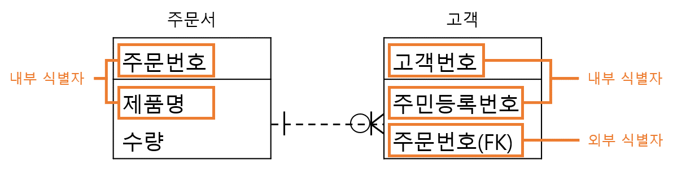
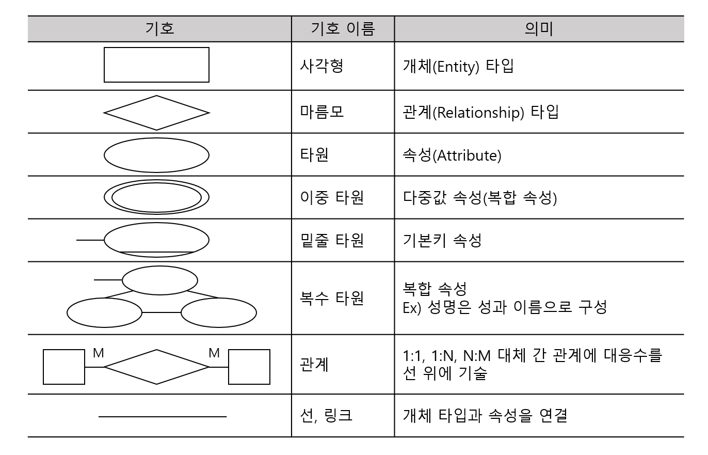

# 1. 논리 데이터베이스 설계
## 076. ⭐ 데이터베이스 설계
사용자 요구를 분석해 컴퓨터에 저장할 수 있는 데이터베이스 구조에 맞게 변형한 후 특정 DBMS로 구현하여 사용자들이 사용하게 하는 것

### 데이터베이스 설계 시 고려사항
- 무결성 : 삽입, 삭제, 갱신 등 연산 후에도 저장된 데이터가 정해진 제약조건을 항상 만족
- 일관성 : 저자왼 데이터들 사이나, 특정 질의에 대한 응답이 처음부터 끝까지 변함없이 일정
- 회복 : 시스템 장애 발생 시, 장애 발생 직전의 상태로 복구
- 보안 : 불법적인 데이터의 노출 또는 변경이나 솔실로부터 보호
- 효율성 : 응답시간 단축, 시스템 생산성, 저장 공간의 최적화
- 데이터베이스 확장 : 데이터베이스 운영에 영향을 주지 않으면서 지속적으로 데이터를 추가

### 데이터베이스 설계 순서
#### 1) 요구 조건 분석 : 요구 조건 명세서 작성
- 사용자에 따른 수행업무와 필요하 데이터 종류, 용도, 처리 현태, 흐름, 제약조건 등 수집
- 수집된 정보를 바탕으로 명세서 작성

#### 2) 개념적 설계(정보 모델링, 개념화) : 개념 스키마, 트랜잭션 모델링, E-R모델
- 현실세계의 무한성과 계속성을 이해
- 현실세계에 대한 인식을 추상적 개념으로 표현하는 과정
- 개념 스키마 모델링, 트랜잭션 모델링을 병행 수행
- 요구 조건 명세를 DBMS에 독립적인 E-R다이어그램으로 작성
- DBMS에 독립적인 개념 스키마를 설계

#### 3) 논리적 설계(데이터 모델링) : 논리 스키마 설계, 트랜잭션 인터페이스 설계
- 현실세계에서 발생한 자료를 컴퓨터가 이해하고 처리할 수 있는 물리적 저장장치에 저장할 수 있도록 변환하기 위해 특정 DBMS가 지원하는 논리적 자료 구조로 변환(mapping)하는 과정
- 데이터 타입 간의 관계로 표현되는 논리적 구조의 데이터로 모델화
- 개념 스키마를 평가 및 정제하고 DBMS에 따라 서로 다른 논리적 스키마를 설계하는 단계
- 트랜잭션의 인터페이스 설계
- 관계형 데이터베이스라면 테이블을 설계하는 단계

#### 4) 물리적 설계(데이터 구조화) : 물리적 구조의 데이터로 변환
- 논리적 설계 단계에서 논리적 구조로 표현된 데이터를 디스크 등 물리적 저장장치에 저장할 수 있는 물리적 구조의 데이터로 변환하는 과정
- 데이터베이스 파일의 저장 구조 및 액세스 경로를 결정
- 저장 레코드 양식, 순서, 접근 경로, 조회가 집중되는 레코드와 같은 정보를 사용해 데이터가 컴퓨터에 저장되는 방법을 묘사
- 고려할 사항
    - 트랜잭션 처리량
    - 응답 시간
    - 디스크 용량
    - 저장공간의 효율화

#### 5) 구현 : 목표 DBMS의 DDL로 데이터베이스 생성, 트랜잭션 작성
- 논리적 설계 단계와 물리적 설계 단계에서 도출된 데이터베이스 스키마를 파일로 생성하는 과정
- DDL을 이용해 데이터베이스 스키마를 기술한 후 컴파일하여 빈 데이터베이스 파일을 생성
- 생성된 빈 데이터베이스 파일에 데이터를 입력
- 응용 프로그램을 위한 트랜잭션 작성
- 데이터베이스 접근을 위한 응용 프로그램 작성

## 077. 데이터 모델의 개념
- 현실세계의 정보들을 컴퓨터에 표현하기 위해 단순화, 추상화하여 체계적으로 표현한 개념적 모형
- 데이터, 데이터의 관계, 데이터의 의미 및 일관성, 제약 조건 등을 기술하기 위한 개념적 도구들의 모임
- 데이터의 구조(Schema)를 논리적으로 표현하기 위해 사용되는 지능적 도구

### 데이터 모델 구성요소
#### 1) 개체 (Entity)
- 데이터베이스에 표현하려는 것
- 사람이 생각하는 개념이라 정보 단위 같은 현실 세계의 대상체

#### 2) 속성 (Attribute)
- 데이터의 가장 작은 논리적 단위
- 파일 구조상의 데이터 항목 또는 데이터 필드에 해당

#### 3) 관계 (Relationship)
- 개체 간의 관계, 속선 간의 논리적인 연결을 의미

### 데이터 모델 종류
#### 1) 개념적 데이터 모델
- 인간의 이해를 돕기 위해 현실세계에 대한 인식을 추상적 개념으로 표현하는 과정
- 속성들로 기술된 개체 타입과 개체 타입 간의 관계를 이용해 현실세계를 표현
- E-R모델

#### 2) 논리적 데이터 모델
- 개념적 모델링 과정에서 얻은 개념적 구조를 컴퓨터가 이해하고 처리할 수 있는 컴퓨터 세계의 환경에 맞도록 변환하는 과정
- 데이터 타입 간의 관계를 이용해 현실세계를 표현
- 단순 데이터 모델
- 특정 DBMS는 특정 논리적 데이터 모델 하나만 선정하여 사용
- 관계 모델, 계층 모델, 네트워크 모델

#### 3) 물리적 데이터 모델
- 실제 컴퓨터에 데이터가 저장되는 방법을 정의하는 물리 데이터베이스 설계 과정

### 논리적 데이터 모델의 품질 검증
완성된 논리 데이터 모델이 기업에 적합한지 확인하기 위한 품질 검증

#### 1) 개체 품질 검증 항목
- 단수 명사 여부, 개체의 주 식별자, 개체 간 상호 배타성, 개체의 정규화 여부, 개체 상세 정의, 개체 관리 업무 기능, 개체의 총 길이 등

#### 2) 속성 품질 검증 항목
- 단수 명사 여부, 속성의 값 존재 여부 및 개수, 도메인 정의, 반복되는 속성, 그룹화 가능 속성, 식별자에 의존하는 속성, 다치 종속 속성 등

#### 3) 관계 품질 검증 항목
- 관계의 명칭, 2개 이상의 노드와 관계 존재 여부, 노드의 기수성과 선택성, 필수적 관계, 유효한 관계, 중복된 관계, 외부식별자 존재 여부, 참조 무결성 여부 등

#### 4) 식별자 품질 검증 항목
- 식별자의 명칭, 정의, 구성, 정합성, 크기, 순서 등

#### 5) 전반적인 품질 검증 항목
- 주제 영역 구성의 적절성, 데이터 모델 상에 정규화 여부, 다대다 관계 해소 여부, 이력 관리 대상 선정 확인, 이력관리 방법의 적절성 확인

### ⭐ 데이터 모델에 표시할 요소
#### 1) 구조 (Structure)
- 논리적으로 표현된 객체 타입들 간의 관계로서 데이터 구조 및 정적 성질을 표현

#### 2) 연산 (Operation)
- 데이터베이스에 저장된 실제 데이터를 처리하는 작업에 대한 명세로서 데이터베이스를 조작하는 기본 도구

#### 3) 제약 조건 (Constraint)
- 데이터베이스에 저장될 수 있는 실제 데이터의 논리적인 제약 조건

## 078. 데이터 모델의 구성 요소 - 개체 (Entity)
- 실세계에 독립적으로 존재하는 유형, 무형의 정보 → 서로 연관된 몇 개의 속성으로 구성
- 파일 시스템의 레코드에 대응하는 것 → 정보를 제공하는 역할 수행
- 영속적(Persistence)으로 존재하는 개체의 집합
- 독립적으로 존재하거나 그 자체로서도 구별 가능
- 유일한 식별자(Unique Identifier)에 의해 식별 가능
- 업무 프로세스에 의해 이용
- 다른 개체와 하나 이상의 관계(Relationship) 존재

### 개체 선정 방법
- 구체적으로 설명한 업무 기술서 이용
- 실제 업무를 담당하고 있는 담당자와 인터뷰
- 업무 기술서와 인터뷰에서 확인하지 못한 정보가 있는지 실제 업무를 직접 견학하여 확인
- 실제 업무에 사용되고 있는 장부와 전표를 이용
- 이미 구축된 시스템이 있는 경우 해당 시스템의 산출물을 검토
- 자료 흐름도(DFD)를 통해 업무분석을 수행했을 경우 자료 흐름도의 자료 저장소(Data Store)를 이용
- BPR(업무 프로세서 재설계)에 의해 업무를 재정의한 경우 관련 개체 찾기

### 개체명 지정 방법
- 업무에서 사용하는 용어로 지정
- 약어 X
- 단수 명사
- 모든 개체명은 유일
- 개체가 생성되는 의미에 따라 이름 부여

## 079. 데이터 모델의 구성 요소 - 속성 (Attribute)
- 데이터베이스를 구성하는 가장 작은 논리적 단위
- 파일 구조상의 데이터 항목 또는 데이터 필드에 해당
- 개체를 구성하는 항목
- 개체의 특성을 기술
- 속성의 수를 디그이(Dgree) 또는 차수

### 속성의 종류
#### 1) 속성의 특성에 따른 분류
- 기본속성(Basic Attribute)
    - 업무 분석을 통해 정의한 속성
    - 속성 중 가장 많고 일반적
    - 업무상 코드로 정의한 속성은 기본 속성에서 제외
- 설계 속성(Designed Attribute)
    - 업무상 존재하지 않고 설계 과정에서 도출해내는 속성
    - 데이터 모델링을 위해 업무를 규칙화하려고 속성을 새로 만들거나 변형하여 정의하는 속성
- 파생 속성(Derived Attribute)
    - 다른 속성으로부터 계산이나 변형 등의 영향을 받아 발생하는 속성
    - 되도록 적은 수로 정의할 것

#### 2) 개체 구성 방식에 따른 분류
- 기본키 속성(Primary Key Attribute)
    - 개체를 식별할 수 있는 속성
- 외래키 속성(Foreign Key Attribute)
    - 다른 개체와의 관계에서 포함된 속성
- 일반 속성
    - 개체에 포함되어 있고 기본키, 외래키에 포함되지 않은 속성

### 속성 후보 선정 원칙
- 최대한 많이 선택
- 원시(Source)속성으로 판단되는 속성 후보는 버리지 않음
- 소그룹별로 속성 후보군을 만들고 가장 근접한 개체에 할당

### 속성명 지정 원칙
- 웹, 클라이어트/서버 등 어떠한 환경에서든 사용자 인터페이스에 나타나기 때문에 정확하고 혼란이 없도록 지정
- 해당 업무에서 사용하는 용어
- 서술형 X
- 약어 사용 X
- 개체명은 속성명으로 X
- 개체에서 유일하게 식별 가능하도록 지정

## 080. 데이터 모델의 구성 요소 - 관계 (Relationship)
개체와 개체 사이의 논리적인 연결

### 관계의 형태
- **일 대 일(1:1)**
    - 개체 집합 A의 각 원소가 개체 집합 B 원소 한개와 대응
- **일 대 다(1:N)**
    - 개체 집합 A의 각 원소는 개체 집합 B의 원소 여러 개와 대응
    - 개체 집합 B의 각 원소는 개체 집합 A의 원소 한 개와 대응
- **다 대 다(N:M)**
    - 개체 집합 A의 각 원소는 개체 집합 B의 원소 여러 개와 대응
    - 개체 집합 B의 각 원소도 개체 집합 A읜 원소 여러 개와 대응

### 관계의 종류
- **종속 관계(Dependent Relationship)**
    - 두 개체 사이의 주 · 종 관계를 표현한 것
    - 식별관계, 비식별관계
- **중복 관계(Redundant Relationship)**
    - 두 개체 사이에 2번 이상 종속 관계가 발생하는 관계
- **재귀 관계(Recursive Relationship) = 순환 관계**
    - 개체가 자기 자신과 관계를 맺는 것
- **배타 관계(Exclusive Relationship)**
    - 개체의 속성이나 구분자를 기준으로 개체의 특성을 분할하는 관계
    - 배타 AND 관계와 배타 OR 관계로 구분
    - 배타 AND 관계 : 하위 개체들 중 속성이나 구분자 조건에 따라 하나의 개체만 선택
    - 배타 OR 관계 : 하나 이상의 개체를 선택

### 관계의 표현

> 💡 식별 관계 / 비식별 관계
> - 식별 관계(Identifying Relationship) - 실선
>   - A개체의 기본키가 B개체의 외래키이면서 동시에 기본키가 되는 관계
>   - B개체의 존재 여부가 A개체의 존재 여부에 의존적인 경우
> - 비식별 관계(Non-Identifying Relationship) - 점선
>   - A개체의 기본키가 B개체의 비기본키 영역에서 외래키가되는 관계
>   - B개체 존재 여부는 A개체의 존재 여부와 관계없이 존재
>   - 일반적으로 비식별 관계가 많음

## 081. 식별자 (Identifier)
- 하나의 개체 내에서 각각늬 인스턴스를 유일(Unique)하게 구분할 수 있는 구분자
- 모든 개체는 한 개 이상의 식별자를 반드시 가짐

|분류|식별자|
|---|---|
|대표성 여부|주 식별자(Primary Identifier), 보조 식별자(Alternate Identifier)|
|스스로 생성 여부|내부 식별자(Internal Identifier), 외부 식별자(Foreign Identifier)|
|단일 속성 여부|단일 식별자(Single Identifier), 복합 식별자(Composit Identifier)|
|대체 여부|원조(본질) 식별자(Original Identifier), 대리(인조) 식별자(Surrogate Identifier)|

### 주 식별자 (Primary Identifier) / 보조 식별자 (Alternate Identifier)
- 주 식별자는 개체를 대표하는 유일한 식별자
- 보조 식별자는 주 식별자를 대신해 개체를 식별할 수 있는 속성
- 두 식별자 모두 개체를 유일하게 식별
- 주 식별자는 한 개만 존재, 보조 식별자는 한 개 이상 존재
- 유일하게 식별할 수 있는 속성이 두 개 이상인 경우 업무에 가장 적합한 속성을 주 식별자로 지정하고, 나머지는 보조 식별자로 지정
- 물리적 테이블에서 주 식별자는 기본키(Primary Key), 보조 식별자는 유니크 인덱스(Unique Index)로 지정

> 💡 주 식별자 4가지 특징
> |특징|설명|
> |---|---|
> |유일성|주 식별자에 의해 개체 내에 모든 인스턴스들이 유일하게 구분|
> |최소성|주 식별자를 구성하는 속성의 수는 유일성을 만족하는 최소 수|
> |불변성|주 식별자가 한 번 특정 개체에 지정되면 그 식별자는 변하지 않음|
> |존재성|주 식별자가 지정되면 식별자 속성에 반드시 데이터 값 존재|

### 내부 식별자 (Internal Identifier) / 외부 식별자 (Foreign Identifier)
- 내부 식별자는 개체 내에서 스스로 만들어지는 식별자
- 외부 식별자는 다른 개체와의 관계에 의해 외부 개체의 식별자를 가져와 사용하는 식별자
- 외부 식별자는 가신의 개체에서 다른 개체를 찾아가는 연결자 역할

### 단일 식별자 (Single Identifier) / 복합 식별자 (Composit Identifier)
- 단일 식별자는 주 식별자가 한 가지 속성으로만 구성된 식별자
- 복합 식별자는 주 식별자가 두 개 이상의 속성으로 구성된 식별자

### 원조(본질) 식별자 (Original Identifier) / 대리(인조) 식별자 (Surrogate Identifier)
- 원조(본질) 식별자는 업무에 의해 만들어지는 가공되지 않은 원래의 식별자
- 대리 식별자는 주 식별자의 속성이 두 개 이상인 경우 속성들을 하나의 속성으로 묶어 사용하는 식별자

### 대리 식별자의 조건
- 최대한 범용적인 값을 사용
- 유일한 값을 만들기 위한 대리 식별자 사용
- 하나의 대리 식별자 속성으로 대체할 수 없는 경우 주의
- 편의성, 단순성, 의미 체계화를 위한 대리 식별자를 사용
- 시스템적인 필요성에 의해 내부적으로만 사용하는 대리 식별자 사용

### 후보 식별자
- 각 인스턴스를 유일하게 식별할 수 있는 속성 또는 속성 집합
- 하나의 개체에 한 개 이상의 후보 식별자 존재
- 개체의 대표성을 나타내는 식별자를 주 식별자, 나머지는 보조 식별자
- 후보 식별자 조건
    - 각 인스턴스를 유일하게 식별
    - 속성들을 직접 식별
    - 널 값 X
    - 속성 집합은 후보 식별자로 지정한 경우 개념적으로 유일
    - 자주 변경 X

## 082. ⭐ E-R(개체-관계) 모델
- 데이터 모델의 가장 대표적
- 1976년 피터 첸(Peter Chen)
- 현실세계의 무질서한 데이터를 개념적인 논리 데이터로 표현하기 위한 방법
- 개체(Entity), 관계(Relationship), 속성(Attribute)
- 특정 DBMS 고려한 것 아님
- E-R 다이어그램으로 표현
- 1:1, 1:M, N:M 제한 없이 나타냄

### E-R 다이어그램(Entity-Relationship Diagram)

## 083. 관계형 데이터 모델
- 가장 널리 사용되는 데이터 모델
- 2차원적인 표(Table)를 이용해 데이터 상효 관계를 정의하는 DB 구조
- 파일 구조처럼 테이블을 하나의 DB로 묶어 테이블 내에 있는 속성들 간의 관계를 설정하거나 테이블 간의 관계를 설정
- 기본키와 외래키로 데이터 간의 관계 표현
- 계층 모뎅과 망 모델의 복잡한 구조를 단순화시킨 모델
- 대표적이 언어는 SQL
- 1:1, 1:N, N:M 자유롭게 표현

## 084. ⭐ 관계형 데이터베이스의 구조
- 1970년 IBM 코드(E.F. Codd)에 의해 처음 제안
- 개체, 관계를 모두 릴레이션(Relation)이라는 표(Table)로 표현
- 장점
    - 간결함, 편리함, 다른 데이터베이스와 변환 용이
- 단점
    - 성능이 다소 떨어짐

### 관계형 데이터베이스의 Relation 구조

- **튜플**
    - 릴레이션을 구성하는 각 행
    - 속성의 모임으로 구성
    - 파일구조에서 레토드와 같은 의미
    - 튜플의 수를 카디널리티(Cardinality), 기수, 대응수 라고 함

- **속성(Attribute)**
    - 데이터베이스를 구성하는 가장 작은 논리적 단위
    - 파일 구조상의 데이터 항목 또는 데이터 필드에 해당
    - 개체의 특성을 기술
    - 속성의 수를 디그리(Dgree), 차수 라고 함

- **도메인(Domain)**
    - 하나의 속성이 취할 수 있는 같은 타입의 원자(Atomic)값들의 집합
    - 실제 속성 값이 나타날 때 그 값의 합법 여부를 시스템이 검사하는데 사용

### 릴레이션의 특징
- 한 릴레이션에 똑같은 튜플이 포함될 수 없음
    - 릴레이션에 포함된 튜플들은 모두 상이
- 한 릴레이션에 포함된 튜플 사이에는 순서가 없음
- 튜플들의 삽입, 삭제 등의 작업으로 인해 릴레이션은 시간에 따라 변함
- 릴레이션 스키마를 구성하는 속성들 간의 순서는 중요하지 않음
- 속성의 유일한 식별을 위해 속성의 명칭은 유일해야 하지만, 속성을 구성하는 값은 동일한 값이 있을 수 있음
    - 학년은 유일하지만 동일한 값이 올 수 있음
- 튜플을 유일하게 식별하기 위해 속성들의 부분집합을 키(Key)로 설정
- 속성의 값은 논리적으로 더 이상 쪼갤 수 없는 원자값만 지정

## 085. ⭐ 관계형 데이터베이스의 제약조건 - 키 (Key)
데이터베이스에 저장되는 데이터의 정확성을 보장하기 위해 키(Key)를 이용해 데이터에 제한을 주는 것

### 키 (Key)의 개념 및 종류
- 데이터베이스에서 조건에 만족하는 튜플을 찾거나 순서대로 정렬할 때 튜플들을 서로 구분할 수 있는 기준이 되는 속성
- 후보키, 기본키, 대체키, 슈퍼키, 외래키

### 후보키 (Candidate Key)
- 튜플을 유일하게 식별하기 위해 사용하는 속성들의 부분집합, 즉 기본키로 사용할 수 있는 속성들
- 중복된 튜플은 없으므로 모든 릴레이션에는 반드시 하나 이상의 후보키가 존재
- 모든 튜플에 대해서 유일성과 최소성을 만족시켜야 함
    - 유일성(Unique) : 하나의 키 값으로 하나의 튜플만을 유일하게 식별
    - 최소성(Minimally) : 모든 레코드들을 유일하게 식별하는데 꼭 필요한 속성으로만 구성

### 기본키 (Primary Key)
- 후보키 중에서 특별히 선정된 주키(Main Key)
- 중복된 값 X
- 특정 튜플을 유일하게 구별할 수 있는 속성
- 후보키의 성질을 갖음 → 유일성, 최소성
- NULL 값 X

### 대체키 (Alternate Key) = 보조키
- 후보키가 둘 이상일 때 기본키를 제외한 나머지 후보키

### 슈퍼키 (Super Key)
- 속성들의 집합으로 구성된 키
- 릴레이션을 구성하는 모든 튜플 중 슈퍼키로 구성된 속성의 집합과 동일한 값을 나타내지 않음
- 유일성은 만족시키지만, 최소성은 만족시키지 못함

### 외래키 (Foreign Key)
- 다른 릴레이션의 기본키를 참조하는 속성 또는 속성들의 집합
- 참조되는 릴레이션의 기본키와 대응되어 릴레이션 간에 참조 관계를 표현하는데 중요한 도구
- 속성 A와 참조 릴레이션의 기본키인 B가 동일한 도메인 상에서 정의 되었을 때의 속성 A를 외래키라고 함
- 외래키로 지정되면 참조 릴레이션의 기본키에 없는 값은 입력 불가

## 086. ⭐ 관계형 데이터베이스의 제약조건 - 무결성
데이터베이스에 저장된 데이터 값과 현실세계의 실제 값이 일치하는 정확성

### 개체 무결정 (Entity Integrity, 실체 무결성)
- 기본 테이블의 기본키를 구성하는 어떤 속성도 NULL 값이나 중복값을 가질 수 없다는 규정

### 도메인 무결성 (Domain Integrity, 영역 무결성)
- 주어진 속성 값이 정의된 도메인에 속한 값이어야 한다는 규정

### 참조 무결성 (Referential Integrity)
- 외래키 값은 NULL이거나 참조 릴레이션의 기본키 값과 동일해야 함
- 릴레이션은 참조할 수 없는 외래키 값을 가질 수 없다는 규정
- 외래키와 참조하려는 테이블의 기본키는 도메인과 속성 개수가 같아야 함

### 사용자 정의 무결성 (User-Defined Integrity)
- 속성 값들이 사용자가 정의한 제약 조건에 만족해야 한다는 규정

### 데이터 무결성 강화
- 프로그램이 완성되고 데이터가 저장된 상태에서 무결성을 정의할 경우 많은 비용이 발생하므로 데이터베이스 구축과정에서 정의

#### 1) 애플리케이션
- 데이터 생성, 수정, 삭제 시 무결성 조건을 검증하는 코드를 데이터를 조작하는 프로그램 내 추가
- 장점
    - 사용자 정의 같은 복잡한 무결성 조건의 구현 가능
- 단점
    - 소스코드에 분산되어 있어 관리 힘듦
    - 개별적인 시행으로 인해 적정성 검토 어려움

#### 2) 데이터베이스 트리거
- 트리거 이벤트에 무결성 조건을 실행하는 절차형 SQL을 추가
- 장점
    - 통합 관리 가능
    - 복잡한 요구 조건의 구현 가능
- 단점
    - 운영 중 변경 어려움
    - 사용상 주의 필요

#### 3) 제약 조건
- 데이터베이스에 제약 조건을 설정하여 무결성 유지
- 장점
    - 통합 관리 가능
    - 간단한 선언으로 구현 가능
    - 변경 용이
    - 오류 데이터 발생 방지
- 단점
    - 복잡한 제약 조건의 구현과 예외적인 처리 불가

## 087. ⭐ 관계대수 및 관계해석
### 관계대수의 개요
- 관계형 데이터베이스에서 원하는 정보과 검색하기 위해서 어떻게 유도하는가를 기술하는 절차적인 언어
- 릴레이션을 처리하기 위해 연산자와 연산규칙을 제공하는 언어
    - 피연산자가 릴레이션, 결과도 릴레이션
- 질의에 대한 해를 구하기 위해 수행해야 할 연산의 순서 명시
- 순수 관계 연산자 : Select, Project, Join, Division
- 일반 집합 연산자 : UNION(합집합), INTERSECTION(교집합), DIFFERENCE(차집합), CARTESIAN PRODUCT(교차곱)

### Select (수평 연산 = δ)
- 릴레이션에 존재하는 튜플 중에 선택 조건을 만족하는 튜플의 부분집합을 구하여 새로운 릴레이션을 만드는 연삭
- 표기 형식 : δ<조건>(R)
    - δAvg≥90(성적) : (성적) 릴레이션에서 평균이 90점 이상인 튜플 추출

### Project (수직 연산 = π)
- 속성 리스트에 제시된 속성 값만을 추출하여 새로운 릴레이션을 만드는 연산
- 연산 결과에 중복이 발생하면 중복 제거됨
- 표기 형식 : π<속성리스트>(R)
    - πName, Avg(성적) : (성적) 릴레이션에서 Name과 Avg 속성 출출

### Join (▷◁)
- 공통 속성을 중심으로 두 개의 릴레이션을 하나로 합쳐서 새로운 릴레이션을 만드는 연산
- Join 결과로 만들어진 릴레이션 차수는 조인된 두 릴레이션의 차수 합
- Join 결과는 Caresian Product를 수행 후 Select를 수행한 것과 동일
- 표기 형식 : R ▷◁ 키속성r=키속성s S
    - 키속성 r은 릴레이션 R의 속성이고, 키속성 s는 릴레이션 S의 속성
    - 성적 ▷◁  No=No  학적부 : (성적) 릴레이션과 (학적부)릴레이션을 No 속성을 기준으로 합치기
    - 성적 ▷◁  No  학적부 : 중복제거 되어서 합치기

### Division (÷)
- X ⊃ Y인 두 개의 릴레이션 R(X)와 S(Y)
- R의 속성이 S의 속성 값을 모두 가진 튜플에서 S가 가진 속성을 제외한 속성만을 구하는 연산
- 표기 형식 : R [속성r ÷ 속성s] S
    - 속성 r은 릴레이션 R속성, 속성 s는 릴레이션 S속성
    - 속성 r과 속성 s는 동일 속성값을 가지는 속성이어야 함

- ex) 구입자[구입품코드 ÷ 생산품코드]생산품1 : 구입자 릴레이션에서 '구입품코드' 속성을 제외하고 '번호', '이름' 추출 → 생산품1 릴레이션의 모든 튜플과 연관되어 있는 튜플만 추출
- ex) 구입자[이름, 구입품코드 ÷ 이름, 생산품코드]생산품2 : 구입자 릴레이션에서 '이름', '구입품코드' 속성을 제외하고 '번호'만 추출 → 생산품2 릴레이션의 모듄 튜플과 연관되어 있는 튜플만 추출

### 일반 집합 연산자
- 수학적 집합 이론에서 사용하는 연산자
- UNION(∪), INTERSECTION(∩), DIFFERENCE(-)는 합병조건을 만족해야함
    - 두 릴레이션 간에 속성의 수가 같고, 대응되는 속성별로 도메인이 같아야 함

### 관계해석 (Relational Calculus)
- 데이터 모델의 제안자인 코드(E.F Codd)가 수학의 Predicate Calculus(술어 해석)에 기반을 두고 제안
- 관계 데이터의 연산을 표현하는 방법
- 원하는 정보를 정의할 때는 계산 수식을 사용
- 원하는 정보가 무엇이라는 것만 정의하는 비절차적 특성을 지님
- 관계해석과 관계대수는 관계 데이터베이스를 처리하는 기능과 능력면에서 동등하며, 관계대수로 표현한 식은 관계혜석으로 표현할 수 있음
- 질의어로 표현
> 💡 주요 논리 기호
> |기호|구성요소|설명|
> |---|---|---|
> |∀|전칭 정량자|가능한 모든 튜플에 대하여(For All)|
> |∃|존재 전량자|하나라도 일치하는 튜플이 있음(There Exists)|

## 088. 정규화(Normalization)
- 함수적 종속성 등의 종속성 이론을 이용해 잘못 설계된 관계형 스키마를 더 작은 속성의 세트로 쪼개어 바람직한 스키마로 만들어 가는 과정
- 하나의 종속성이 하나의 릴레이션에 표현될 수 있도록 분해해가는 과정
- 제1정규형, 제2정규형, 제3정규형, BCNF형, 제4정규형, 제5정규형
- 차수가 높아질수록 만족시켜야 할 제약 조건이 늘어남
- 논리적 설계 단계에서 수행
- 논리적 처리 및 품질에 큰 영향
- 일관성, 정확성, 단순성, 비중복성, 안정성 등을 보장
- 정규화 수준이 높을수록 유연한 데이터 구축 가능, 데이터의 정확성 높아짐
    -  물리적 접근이 복잡하고 너무 많은 조인으로 인해 조회 성능 저하

### 정규화의 목적
- 데이터 구조의 안정성 및 무결성 유지
- 효과적인 검색 알고리즘 생성
- 데이터 중복 배제하여 이상(Anomaly)의 발생 방지
- 자료 저장 공간 최소화
- 데이터 삽입 시 릴레이션을 재구성할 필요성을 줄임
- 단순화 가능
- 속성의 배열 상태 검증 가능
- 개체와 속성의 누락 여부 확인 가능
- 자료 검색과 추출의 효율성 추구

### 이상(Anomaly)의 개념 및 종류
- 데이터들이 불필요하게 중복되어 릴레이션 조작 시 얘기치 못한 현상이 발생하는 것
- 삽입 이상(Insertion Anomaly)
    - 데이터 삽일 시 의도와는 상관없이 원하지 않은 값들도 함께 삽입되는 형식
- 삭제 이상(Deletion Anomaly)
    - 한 튜플을 삭제할 때 의도와는 상관없는 값들도 함께 삭제되는 연쇄가 일어나는 현상
- 갱신 이상(Update Anomaly)
    - 튜플에 있는 속성값을 갱신할 때 일부 튜플의 정보만 갱신되어 정보에 모순이 생기는 현상

### 정규화의 원칙
- 정보의 무손실 : 하나의 스키마를 다른 스키마로 변환할 때 정보의 손실이 있으면 안됨
- 분리의 원칙 : 하나의 독립된 관계성은 하나의 독립된 릴레이션으로 분시시켜 표현
- 데이터의 중복성이 감소되어야 함

### ⭐ 정규화 과정
#### 1) 1NF(제1정규화)
- 모든 도메인이 원자값(Atomic Value)만으로 되어 있는 정규형
- 모든 속성 값이 원자 값으로만 되어 있는 정규형
- 릴레이션의 모든 속성이 단순 영역에서 정의

#### 2) 2NF(제2정규화)
- 1NF에서 기본키가 아닌 모든 속성이 기본키에 대하여 완전 함수적 종속을 만족하는 정규형
- 함수적 종속(Functional Dependency)
    - 데이터들이 어떤 기준값에 의해 종속되는 것
    > ex)  
    > - 수강 릴레이션이 (학번, 이름, 과목명)으로 되어 있을 때, 학번이 결정되면 과목명에 상관없이 학번에는 항상 같은 이름이 대응됨 
    > - 학번에 따라 이름이 결정될 때 이름은 학번에 함수 종속적 
    > - 학번 → 이름
- 완전 함수적 종속
    - 속성 A가 다른 속성 집합 B 전체에 대해 함수적 종속이지만 속성 집합 B의 어떠한 진부분집합 C(즉, C ⊂ B)에는 함수적 종속이 아닐 때, 속성 A는 속성 집합 B에 완전 함수적 종속
- 부분 함수적 종속
    - 속성 A가 다른 속성 집합 B 전체에 대해 함수적 종속이면서 속성 집합 B의 어떠한 진부분 집합에도 함수적 종속일 때, 속성 A는 속성 집합 B에 부분 함수적 종속

#### 3) 3NF(제3정규화)
- 2NF에서 기본키가 아닌 모든 속성이 기본키에 대해 이행적 종속을 만족하지 않은 정규형
    - 이행적 종속 : A → B, B → C 일때, A → C
- 무손실 조인 또는 종속성 보존을 저해하지 않고도 항상 3NF 설계를 얻을 수 있음

#### 4) BCNF (Boyce-Codd 정규형) = 강한 제3정규형
- 결정자가 모두 후보키인 정규형
    - 결정자 : 속성 간의 종속성을 규명할 때 기준이 되는 값
    - 종속자 : 결정자의 값에 의해 정해지는 값
- 3NF에서 후보키가 여러 개 존재하고 서로 중첩되는 경우 적용
- 모든 BCNF가 종속성을 보존하는 것은 아님
- BCNF의 제약 조건
    - 키가 아닌 모든 속성은 각 키에 대하여 완전 종속해야 함
    - 키가 아닌 모든 속성은 부분적으로 들어가 있지 않은 모든 키에 대하여 완전 종속해야 함
    - 어떤 속성도 키가 아닌 속성에 대해서는 완전 종속할 수 없음

#### 5) 4NF(제4정규형)
- 다치종속 A ->> B가 성립하는 경우 모든 속성이 A에 함수적 종속 관계를 만족하는 정규형
    - 다치종속(Multi Valued Dependency) : A, B, C 3개의 속성을 가진 릴레이션 R에서 어떤 복합 속성(A, C)에 대응하는 B값의 집합이 A값에만 종속되고 C값에는 무관하면, B는 A에 다치 종속이라 함

#### 6) 5NF(제5정규형)
- 모든 조인 종속이 후보키를 통해서만 성립되는 정규형

> ⭐ 정규화 과정 정리 ⭐ 
> **도**메인이 원자값 
> **부**분적 함수 종속 제거 
> **이**행적 함수 종속 제거 
> **결**정자이면서 후보키가 아닌 것 제거 
> **다**치 종속 제거 
> **조**인 종속성 이용

## 089. 반정규화(Denormalization)
- 시스템의 성능 향상, 개발 및 운영의 편의성 등을 위해 정규화된 데이터 모델을 통합, 중복, 분리하는 과정
- 의도적으로 정규화 원칙을 위배하는 해우이
- 시스템 성능이 향상되고 관리 효율성은 증가하지만 데이터의 일관성 및 정합성이 저하
- 과도한 반정규화는 오히려 성능을 저하
- 사전에 데이터의 일관성과 무결성을 우선으로 할지, 데이터베이스의 성능과 단순화를 우선으로 할지 결정해야 함
- 테이블 통합, 테이블 분할, 중복 테이블 추가, 중복 속성 추가

### 테이블 통합
- 두 개의 테이블이 조인되는 경우가 많아 하나의 테이블로 합쳐 사용하는 것이 성능향상에 도움이 될 경우 수행
- 1:1관계 테이블 통합, 1:N관계 테이블 통합, 슈퍼타입/서브타입 테이블 통합
- 테이블 통합 시 고려 사항
    - 데이터 검색은 간편하지만 레코드 증가로 인해 처리량 증가
    - 입력, 수정, 삭제 규칙이 복잡해질 수 있음
    - Not Null, Default, Check 등 제약조건을 설계하기 어려움
        - Not Null : 속성 값이 Null이 될 수 없음
        - Default : 속성 값이 생략되면 기본값 설정
        - Check : 속성 값의 범위나 조건을 설정해 설정한 값만 허용
    
### 테이블 분할
- 수평 분할(Horizontal Partitioning)
    - 레코드를 기준으로 테이블을 분할
    - 레코드별로 사용 빈도의 차이가 큰 경우 사용 빈도에 따라 테이블을 분할
- 수직 분할(Vertical Partitioning)
    - 하나의 테이블에 속성이 너무 많을 경우 속성을 기준으로 데이블을 분할
    - 갱신 위주의 속성 분할 : 데이터 갱신 시 레코드 잠금으로 인해 다른 작업을 수행할 수 없으므로 갱신이 자주 일어나는 속성들을 수직 분할
    - 자주 조회되는 속성 분할 : 테이블에서 자주 조회되는 속성이 극히 일부일 경우 자주 사용되는 속성들을 수직 분할
    - 크기가 큰 속성 분할 : 이미지나 2GB 이상 저장될 수 있는 텍스트 형식 등으로 된 속성들을 수직 분할
    - 보안을 적용해야 하는 속성 분할 : 테이블 내의 특정 속성에 대해 보안을 적용할 수 없으므로 보안을 적용해야 하는 속성들을 수직 분할
- 테이블 분할 시 고려사항
    - 기본키의 유일성 관리가 어려움
    - 데이터 양이 적거나 사용 빈도가 낮은 경우 테이블 분할이 필요한지 고려해야 함
    - 수행속도가 느려질 수 있음
    - 데이터 검색에 중점을 두터 테이블 분할 여부를 결정

### 중복 테이블 추가
- 여러 테이블에서 데이터를 추출해서 사용해야 하거나 다른 서버에 저장된 테이블을 이용해야 하는 경우 중복 테이블을 추가하여 작업의 효율성 향상
- 중복 테이블 추가하는 경우
    - 정규화로 인해 수행 속도가 느려지는 경우
    - 많은 범위의 데이터를 자주 처리해야 하는 경우
    - 특정 범위의 데이터만 자주 처리해야 하는 경우
    - 처리 범위를 줄이지 않고는 수행 속도를 개선할 수 없는 경우
- 집계 테이블의 추가
    - 집계 데이터를 위한 테이블을 생성하고, 각 원본 테이블에 트리거를 설정하여 사용하는 것
    - 트리거의 오버헤드에 유의
- 진행 테이블의 추가
    - 이력관리 등 목적으로 추가하는 테이블
    - 적절한 데이터 양의 유지와 활용도를 높이기 위해 기본키를 적절히 설정
- 특정 부분만 포함하는 테이블 추가
    - 데이터가 많은 테이블의 특정 부분만을 사용하는 경우 해당 부분만으로 새로운 테이블 생성

### 중복 속성 추가
- 조인해서 데이터를 처리할 때 데이터를 조회하는 경로를 단축하기 위해 자주 사용하는 속성을 하나 더 추가하는 것
- 무결성 확보 어렵고, 디스크 공간이 추가로 필요함
- 중복 속성을 추가하는 경우
    - 조인이 자주 발생하는 속성인 경우
    - 접근 경로가 복잡한 속성인 경우
    - 엑세스의 조건으로 자주 사용되는 속성인 경우
    - 기본키의 형태가 적절하지 않거나 여러 개의 속성으로 구성된 경우
- 중복 속성 추가 시 고려 사항
    - 테이블 중복과 속성의 중복을 고려
    - 데이터 일관성 및 무결성에 유의
    - SQL 그룹 함수를 이용해 처리할 수 있어야 함
    - 제장 공간의 지나친 낭비를 고려

## 090. 시스템 카탈로그 (System Catalog)
- 시스템 그 자체에 관련이 있는 다양한 객체에 관한 정보를 포함하는 시스템 데이터페이스
- 시스템 카탈로그 내 각 테이블은 사용자를 포함해 DBMS에서 지원하는 모든 데이터 객체에 대한 정의, 명세에 관한 정보를 유지 관리하는 시스템 테이블
- 카탈로그들이 생성되면 데이터 사전(Data Dictionary)에 저장되기 때문에 좁은 의미로 카탈로그를 데이터 사전이라고도 함

### 시스템 카탈로그 저장 정보
- 카탈로그에 저장된 데이터 = Meta-Data
- 데이터베이스 객체 정보, 사용자 정보, 테이블의 무결성 제약 조건 정보

### 카탈로그의 특징
- 일반 이용자도 SQL을 이용해 내용 검색 가능
- INSERT, DELETE, UPDATE문으로 카탈로그를 갱신하는 것은 허용 금지
- 데이터베이스 시스템에 따라 상이한 구조
- DBMS가 스스로 생성하고 유지
- 카탈로그의 갱신 : 사용자가 SQL문을 실행시켜 기본 테이블, 뷰, 인덱스 등에 변화를 주면 시스템이 자동으로 갱신
- 분산 시스템에서의 카탈로그 : 보통의 릴레이션, 인덱스, 사용자 등의 정보를 포함뿐 아니라 위치 투명성 및 중복 투명성을 제공하기 위해 필요한 모든 제어 정보를 가져야 함

### 카탈로그/데이터 사전을 참조하기 위한 DBMS 내의 모듈 시스템
- 데이터 정의어 변역기(DDL Compiler)
    - DDL을 메타 데이터를 갑는 테이블(카탈로그)로 변환하여 데이터 사전에 저장
- 데이터 조작어 변역기(DML Compiler)
    - DML문을 주 언어로 표현한 프로시저 호출로 변환하여 질의 처리기와 상호 통신
- Data Directory
    - 데이터 사전에 수록된 데이터를 실제로 접근하는 데 필요한 정보를 관리 유지하는 시스템
    - 시스템 카탈로그는 사용자와 시스템 모두 접근할 수 있지만 데이터 디렉터리는 시스템만 접근
- 질의 최정화기
    - 사용자의 요구를 효율적인 형태로 변환하고 질의를 처리하는 좋은 전략을 모색
- 트랜잭션 처리기
    - 복수 사용자 환경에서 평행으로 동시에 일어나는 트랜잭션 문제를 해결하여, 각 사용자가 데이터 베이스 자원을 베타적으로 이용할 수 있도록 함

 

# Reference
- 정보처리기사 필기 (시나공)
- https://hyeonukdev.github.io/2020/05/14/Engineer_Information_Processing/ch12_%EB%85%BC%EB%A6%AC%EB%8D%B0%EC%9D%B4%ED%84%B0%EB%B2%A0%EC%9D%B4%EC%8A%A4%EC%84%A4%EA%B3%84/%EB%8D%B0%EC%9D%B4%ED%84%B0%EB%AA%A8%EB%8D%B8%EB%A7%81%EB%B0%8F%EC%84%A4%EA%B3%84/%EA%B0%9C%EC%B2%B4%EA%B4%80%EA%B3%84%EB%AA%A8%EB%8D%B8/
- https://1coding.tistory.com/44
- https://computer-science-student.tistory.com/194
- https://velog.io/@alpaka206/69.-%EC%8B%9C%EC%8A%A4%ED%85%9C-%EC%B9%B4%ED%83%88%EB%A1%9C%EA%B7%B8