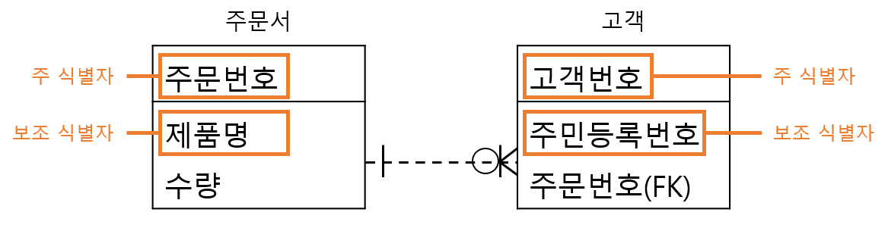

# 1. 논리 데이터베이스 설계
## 076. ⭐ 데이터베이스 설계
사용자 요구를 분석해 컴퓨터에 저장할 수 있는 데이터베이스 구조에 맞게 변형한 후 특정 DBMS로 구현하여 사용자들이 사용하게 하는 것

### 데이터베이스 설계 시 고려사항
- 무결성 : 삽입, 삭제, 갱신 등 연산 후에도 저장된 데이터가 정해진 제약조건을 항상 만족
- 일관성 : 저자왼 데이터들 사이나, 특정 질의에 대한 응답이 처음부터 끝까지 변함없이 일정
- 회복 : 시스템 장애 발생 시, 장애 발생 직전의 상태로 복구
- 보안 : 불법적인 데이터의 노출 또는 변경이나 솔실로부터 보호
- 효율성 : 응답시간 단축, 시스템 생산성, 저장 공간의 최적화
- 데이터베이스 확장 : 데이터베이스 운영에 영향을 주지 않으면서 지속적으로 데이터를 추가

### 데이터베이스 설계 순서
#### 1) 요구 조건 분석 : 요구 조건 명세서 작성
- 사용자에 따른 수행업무와 필요하 데이터 종류, 용도, 처리 현태, 흐름, 제약조건 등 수집
- 수집된 정보를 바탕으로 명세서 작성

#### 2) 개념적 설계(정보 모델링, 개념화) : 개념 스키마, 트랜잭션 모델링, E-R모델
- 현실세계의 무한성과 계속성을 이해
- 현실세계에 대한 인식을 추상적 개념으로 표현하는 과정
- 개념 스키마 모델링, 트랜잭션 모델링을 병행 수행
- 요구 조건 명세를 DBMS에 독립적인 E-R다이어그램으로 작성
- DBMS에 독립적인 개념 스키마를 설계

#### 3) 논리적 설계(데이터 모델링) : 논리 스키마 설계, 트랜잭션 인터페이스 설계
- 현실세계에서 발생한 자료를 컴퓨터가 이해하고 처리할 수 있는 물리적 저장장치에 저장할 수 있도록 변환하기 위해 특정 DBMS가 지원하는 논리적 자료 구조로 변환(mapping)하는 과정
- 데이터 타입 간의 관계로 표현되는 논리적 구조의 데이터로 모델화
- 개념 스키마를 평가 및 정제하고 DBMS에 따라 서로 다른 논리적 스키마를 설계하는 단계
- 트랜잭션의 인터페이스 설계
- 관계형 데이터베이스라면 테이블을 설계하는 단계

#### 4) 물리적 설계(데이터 구조화) : 물리적 구조의 데이터로 변환
- 논리적 설계 단계에서 논리적 구조로 표현된 데이터를 디스크 등 물리적 저장장치에 저장할 수 있는 물리적 구조의 데이터로 변환하는 과정
- 데이터베이스 파일의 저장 구조 및 액세스 경로를 결정
- 저장 레코드 양식, 순서, 접근 경로, 조회가 집중되는 레코드와 같은 정보를 사용해 데이터가 컴퓨터에 저장되는 방법을 묘사
- 고려할 사항
    - 트랜잭션 처리량
    - 응답 시간
    - 디스크 용량
    - 저장공간의 효율화

#### 5) 구현 : 목표 DBMS의 DDL로 데이터베이스 생성, 트랜잭션 작성
- 논리적 설계 단계와 물리적 설계 단계에서 도출된 데이터베이스 스키마를 파일로 생성하는 과정
- DDL을 이용해 데이터베이스 스키마를 기술한 후 컴파일하여 빈 데이터베이스 파일을 생성
- 생성된 빈 데이터베이스 파일에 데이터를 입력
- 응용 프로그램을 위한 트랜잭션 작성
- 데이터베이스 접근을 위한 응용 프로그램 작성

## 077. 데이터 모델의 개념
- 현실세계의 정보들을 컴퓨터에 표현하기 위해 단순화, 추상화하여 체계적으로 표현한 개념적 모형
- 데이터, 데이터의 관계, 데이터의 의미 및 일관성, 제약 조건 등을 기술하기 위한 개념적 도구들의 모임
- 데이터의 구조(Schema)를 논리적으로 표현하기 위해 사용되는 지능적 도구

### 데이터 모델 구성요소
#### 1) 개체 (Entity)
- 데이터베이스에 표현하려는 것
- 사람이 생각하는 개념이라 정보 단위 같은 현실 세계의 대상체

#### 2) 속성 (Attribute)
- 데이터의 가장 작은 논리적 단위
- 파일 구조상의 데이터 항목 또는 데이터 필드에 해당

#### 3) 관계 (Relationship)
- 개체 간의 관계, 속선 간의 논리적인 연결을 의미

### 데이터 모델 종류
#### 1) 개념적 데이터 모델
- 인간의 이해를 돕기 위해 현실세계에 대한 인식을 추상적 개념으로 표현하는 과정
- 속성들로 기술된 개체 타입과 개체 타입 간의 관계를 이용해 현실세계를 표현
- E-R모델

#### 2) 논리적 데이터 모델
- 개념적 모델링 과정에서 얻은 개념적 구조를 컴퓨터가 이해하고 처리할 수 있는 컴퓨터 세계의 환경에 맞도록 변환하는 과정
- 데이터 타입 간의 관계를 이용해 현실세계를 표현
- 단순 데이터 모델
- 특정 DBMS는 특정 논리적 데이터 모델 하나만 선정하여 사용
- 관계 모델, 계층 모델, 네트워크 모델

#### 3) 물리적 데이터 모델
- 실제 컴퓨터에 데이터가 저장되는 방법을 정의하는 물리 데이터베이스 설계 과정

### 논리적 데이터 모델의 품질 검증
완성된 논리 데이터 모델이 기업에 적합한지 확인하기 위한 품질 검증

#### 1) 개체 품질 검증 항목
- 단수 명사 여부, 개체의 주 식별자, 개체 간 상호 배타성, 개체의 정규화 여부, 개체 상세 정의, 개체 관리 업무 기능, 개체의 총 길이 등

#### 2) 속성 품질 검증 항목
- 단수 명사 여부, 속성의 값 존재 여부 및 개수, 도메인 정의, 반복되는 속성, 그룹화 가능 속성, 식별자에 의존하는 속성, 다치 종속 속성 등

#### 3) 관계 품질 검증 항목
- 관계의 명칭, 2개 이상의 노드와 관계 존재 여부, 노드의 기수성과 선택성, 필수적 관계, 유효한 관계, 중복된 관계, 외부식별자 존재 여부, 참조 무결성 여부 등

#### 4) 식별자 품질 검증 항목
- 식별자의 명칭, 정의, 구성, 정합성, 크기, 순서 등

#### 5) 전반적인 품질 검증 항목
- 주제 영역 구성의 적절성, 데이터 모델 상에 정규화 여부, 다대다 관계 해소 여부, 이력 관리 대상 선정 확인, 이력관리 방법의 적절성 확인

### ⭐ 데이터 모델에 표시할 요소
#### 1) 구조 (Structure)
- 논리적으로 표현된 객체 타입들 간의 관계로서 데이터 구조 및 정적 성질을 표현

#### 2) 연산 (Operation)
- 데이터베이스에 저장된 실제 데이터를 처리하는 작업에 대한 명세로서 데이터베이스를 조작하는 기본 도구

#### 3) 제약 조건 (Constraint)
- 데이터베이스에 저장될 수 있는 실제 데이터의 논리적인 제약 조건

## 078. 데이터 모델의 구성 요소 - 개체 (Entity)
- 실세계에 독립적으로 존재하는 유형, 무형의 정보 → 서로 연관된 몇 개의 속성으로 구성
- 파일 시스템의 레코드에 대응하는 것 → 정보를 제공하는 역할 수행
- 영속적(Persistence)으로 존재하는 개체의 집합
- 독립적으로 존재하거나 그 자체로서도 구별 가능
- 유일한 식별자(Unique Identifier)에 의해 식별 가능
- 업무 프로세스에 의해 이용
- 다른 개체와 하나 이상의 관계(Relationship) 존재

### 개체 선정 방법
- 구체적으로 설명한 업무 기술서 이용
- 실제 업무를 담당하고 있는 담당자와 인터뷰
- 업무 기술서와 인터뷰에서 확인하지 못한 정보가 있는지 실제 업무를 직접 견학하여 확인
- 실제 업무에 사용되고 있는 장부와 전표를 이용
- 이미 구축된 시스템이 있는 경우 해당 시스템의 산출물을 검토
- 자료 흐름도(DFD)를 통해 업무분석을 수행했을 경우 자료 흐름도의 자료 저장소(Data Store)를 이용
- BPR(업무 프로세서 재설계)에 의해 업무를 재정의한 경우 관련 개체 찾기

### 개체명 지정 방법
- 업무에서 사용하는 용어로 지정
- 약어 X
- 단수 명사
- 모든 개체명은 유일
- 개체가 생성되는 의미에 따라 이름 부여

## 079. 데이터 모델의 구성 요소 - 속성 (Attribute)
- 데이터베이스를 구성하는 가장 작은 논리적 단위
- 파일 구조상의 데이터 항목 또는 데이터 필드에 해당
- 개체를 구성하는 항목
- 개체의 특성을 기술
- 속성의 수를 디그이(Dgree) 또는 차수

### 속성의 종류
#### 1) 속성의 특성에 따른 분류
- 기본속성(Basic Attribute)
    - 업무 분석을 통해 정의한 속성
    - 속성 중 가장 많고 일반적
    - 업무상 코드로 정의한 속성은 기본 속성에서 제외
- 설계 속성(Designed Attribute)
    - 업무상 존재하지 않고 설계 과정에서 도출해내는 속성
    - 데이터 모델링을 위해 업무를 규칙화하려고 속성을 새로 만들거나 변형하여 정의하는 속성
- 파생 속성(Derived Attribute)
    - 다른 속성으로부터 계산이나 변형 등의 영향을 받아 발생하는 속성
    - 되도록 적은 수로 정의할 것

#### 2) 개체 구성 방식에 따른 분류
- 기본키 속성(Primary Key Attribute)
    - 개체를 식별할 수 있는 속성
- 외래키 속성(Foreign Key Attribute)
    - 다른 개체와의 관계에서 포함된 속성
- 일반 속성
    - 개체에 포함되어 있고 기본키, 외래키에 포함되지 않은 속성

### 속성 후보 선정 원칙
- 최대한 많이 선택
- 원시(Source)속성으로 판단되는 속성 후보는 버리지 않음
- 소그룹별로 속성 후보군을 만들고 가장 근접한 개체에 할당

### 속성명 지정 원칙
- 웹, 클라이어트/서버 등 어떠한 환경에서든 사용자 인터페이스에 나타나기 때문에 정확하고 혼란이 없도록 지정
- 해당 업무에서 사용하는 용어
- 서술형 X
- 약어 사용 X
- 개체명은 속성명으로 X
- 개체에서 유일하게 식별 가능하도록 지정

## 080. 데이터 모델의 구성 요소 - 관계 (Relationship)
개체와 개체 사이의 논리적인 연결

### 관계의 형태
- **일 대 일(1:1)**
    - 개체 집합 A의 각 원소가 개체 집합 B 원소 한개와 대응
- **일 대 다(1:N)**
    - 개체 집합 A의 각 원소는 개체 집합 B의 원소 여러 개와 대응
    - 개체 집합 B의 각 원소는 개체 집합 A의 원소 한 개와 대응
- **다 대 다(N:M)**
    - 개체 집합 A의 각 원소는 개체 집합 B의 원소 여러 개와 대응
    - 개체 집합 B의 각 원소도 개체 집합 A읜 원소 여러 개와 대응

### 관계의 종류
- **종속 관계(Dependent Relationship)**
    - 두 개체 사이의 주 · 종 관계를 표현한 것
    - 식별관계, 비식별관계
- **중복 관계(Redundant Relationship)**
    - 두 개체 사이에 2번 이상 종속 관계가 발생하는 관계
- **재귀 관계(Recursive Relationship) = 순환 관계**
    - 개체가 자기 자신과 관계를 맺는 것
- **배타 관계(Exclusive Relationship)**
    - 개체의 속성이나 구분자를 기준으로 개체의 특성을 분할하는 관계
    - 배타 AND 관계와 배타 OR 관계로 구분
    - 배타 AND 관계 : 하위 개체들 중 속성이나 구분자 조건에 따라 하나의 개체만 선택
    - 배타 OR 관계 : 하나 이상의 개체를 선택

### 관계의 표현

> 💡 식별 관계 / 비식별 관계
> - 식별 관계(Identifying Relationship) - 실선
>   - A개체의 기본키가 B개체의 외래키이면서 동시에 기본키가 되는 관계
>   - B개체의 존재 여부가 A개체의 존재 여부에 의존적인 경우
> - 비식별 관계(Non-Identifying Relationship) - 점선
>   - A개체의 기본키가 B개체의 비기본키 영역에서 외래키가되는 관계
>   - B개체 존재 여부는 A개체의 존재 여부와 관계없이 존재
>   - 일반적으로 비식별 관계가 많음

## 081. 식별자 (Identifier)
- 하나의 개체 내에서 각각늬 인스턴스를 유일(Unique)하게 구분할 수 있는 구분자
- 모든 개체는 한 개 이상의 식별자를 반드시 가짐

|분류|식별자|
|---|---|
|대표성 여부|주 식별자(Primary Identifier), 보조 식별자(Alternate Identifier)|
|스스로 생성 여부|내부 식별자(Internal Identifier), 외부 식별자(Foreign Identifier)|
|단일 속성 여부|단일 식별자(Single Identifier), 복합 식별자(Composit Identifier)|
|대체 여부|원조(본질) 식별자(Original Identifier), 대리(인조) 식별자(Surrogate Identifier)|

### 주 식별자 (Primary Identifier) / 보조 식별자 (Alternate Identifier)
- 주 식별자는 개체를 대표하는 유일한 식별자
- 보조 식별자는 주 식별자를 대신해 개체를 식별할 수 있는 속성
- 두 식별자 모두 개체를 유일하게 식별
- 주 식별자는 한 개만 존재, 보조 식별자는 한 개 이상 존재
- 유일하게 식별할 수 있는 속성이 두 개 이상인 경우 업무에 가장 적합한 속성을 주 식별자로 지정하고, 나머지는 보조 식별자로 지정
- 물리적 테이블에서 주 식별자는 기본키(Primary Key), 보조 식별자는 유니크 인덱스(Unique Index)로 지정

> 💡 주 식별자 4가지 특징
> |특징|설명|
> |---|---|
> |유일성|주 식별자에 의해 개체 내에 모든 인스턴스들이 유일하게 구분|
> |최소성|주 식별자를 구성하는 속성의 수는 유일성을 만족하는 최소 수|
> |불변성|주 식별자가 한 번 특정 개체에 지정되면 그 식별자는 변하지 않음|
> |존재성|주 식별자가 지정되면 식별자 속성에 반드시 데이터 값 존재|

### 내부 식별자 (Internal Identifier) / 외부 식별자 (Foreign Identifier)
- 내부 식별자는 개체 내에서 스스로 만들어지는 식별자
- 외부 식별자는 다른 개체와의 관계에 의해 외부 개체의 식별자를 가져와 사용하는 식별자
- 외부 식별자는 가신의 개체에서 다른 개체를 찾아가는 연결자 역할

### 단일 식별자 (Single Identifier) / 복합 식별자 (Composit Identifier)
- 단일 식별자는 주 식별자가 한 가지 속성으로만 구성된 식별자
- 복합 식별자는 주 식별자가 두 개 이상의 속성으로 구성된 식별자

### 원조(본질) 식별자 (Original Identifier) / 대리(인조) 식별자 (Surrogate Identifier)
- 원조(본질) 식별자는 업무에 의해 만들어지는 가공되지 않은 원래의 식별자
- 대리 식별자는 주 식별자의 속성이 두 개 이상인 경우 속성들을 하나의 속성으로 묶어 사용하는 식별자

### 대리 식별자의 조건
- 최대한 범용적인 값을 사용
- 유일한 값을 만들기 위한 대리 식별자 사용
- 하나의 대리 식별자 속성으로 대체할 수 없는 경우 주의
- 편의성, 단순성, 의미 체계화를 위한 대리 식별자를 사용
- 시스템적인 필요성에 의해 내부적으로만 사용하는 대리 식별자 사용

### 후보 식별자
- 각 인스턴스를 유일하게 식별할 수 있는 속성 또는 속성 집합
- 하나의 개체에 한 개 이상의 후보 식별자 존재
- 개체의 대표성을 나타내는 식별자를 주 식별자, 나머지는 보조 식별자
- 후보 식별자 조건
    - 각 인스턴스를 유일하게 식별
    - 속성들을 직접 식별
    - 널 값 X
    - 속성 집합은 후보 식별자로 지정한 경우 개념적으로 유일
    - 자주 변경 X

- https://hyeonukdev.github.io/2020/05/14/Engineer_Information_Processing/ch12_%EB%85%BC%EB%A6%AC%EB%8D%B0%EC%9D%B4%ED%84%B0%EB%B2%A0%EC%9D%B4%EC%8A%A4%EC%84%A4%EA%B3%84/%EB%8D%B0%EC%9D%B4%ED%84%B0%EB%AA%A8%EB%8D%B8%EB%A7%81%EB%B0%8F%EC%84%A4%EA%B3%84/%EA%B0%9C%EC%B2%B4%EA%B4%80%EA%B3%84%EB%AA%A8%EB%8D%B8/
- https://1coding.tistory.com/44