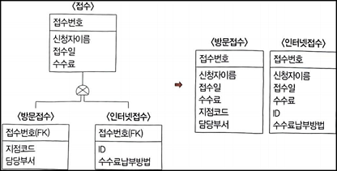

# 2. 물리 데이터베이스 설계
## 091. 사전 조사 분석
### 물리 데이터베이스 설계
- 논리적 구조로 표현된 논리적 데이터베이스를 디스크 등의 물리적 저장장치에 저장할 수 있는 물리적 구조의 데이터로 변환하는 과정
- 기본 데이터 단위는 저장 레코드(Stored Record)
- 저장 레코드의 양식 설계, 레코드 집중(Record Clustering)의 분석 및 설계, 접근 경로 설계
- 단순한 파일과 다름
- 데이터베이스 시스템의 성능에 중대한 영향을 미침
- 물리적 설계 시 고려사항
    - 인덱스 구조
    - 레코드 크기
    - 파일에 존재하는 레코드 개수
    - 파일에 대한 트랜잭션의 갱신과 참조 성향
    - 성능 향상을 위한 개념 스키마의 변경 여부 컴토
    - 빈번한 질의와 트랜잭션들의 수행속도를 높이기 위한 고려
    - 시스템 운용 시 파일 크기의 변화 가능성
- 물리적 설계 전에 기존 시스템을 분석하여 데이터 명명 규칙, 시스템 자원, 데이터베이스 관리 요소 등을 파악해야 함
> 💡 물리적 설계 옵션
> - 특정 DBMS에서 제공되는 것으로, 데이터베이스 파일에 대한 저장 구조와 접근 경로에 대한 다양한 옵션
> - 반응시간(Response Time) : 트랜잭션 수행을 요구한 시점부터 처리 결과를 얻을 때까지의 경과시간
> - 공간 활용도(Space Utilization) : 데이터베이스 파일과 액세스 경로 구조에 의해 사용되는 저장 공간의 양
> - 트랜잭션 처리량(Transaxtion Throughput) : 단위시간 동안 데이터베이스 시스템에 의해 처리될 수 있는 트랜잭션의 평균 개수

### 데이터 명명 규칙 파악
- 물리 데이터 모델에 적용해야하는 규칙
- 물리 데이터 모델의 설계 전 파악
- 데이터 표준화 및 논리 데이터베이스 설계의 결과물 등을 통해 파악
- 물리 데이터베이스 설계와 논리 데이터베이스 설계에 적용되는 명명 규칙은 서로 일관성 유지
- 논리적 데이터 요소를 물리적 데이터 요소로 전환할 때 동일 명칭 부여의 근거로 사용
- 중복 구축 방지
- 도메인과 데이터 사전에 대한 지식 필요
    - 도메인 : 객체(Entity)에 포함된 속성들의 데이터 타입, 크리 등을 표준화 규칙에 따라 일관성 있게 정의한 것
    - 데이터 사전 : 일관성 있는 데이터 이름, 인터페이스를 제공하기 위해 데이터 속성의 논리명, 물리명, 용어 정의를 기술해 놓은것

### 시스템 자원 파악
- 데이터베이스 설치에 영향을 미칠 수 있는 물리적인 요소들
- 사전에 미리 파악
#### 1) 하드웨어 자원
|||
|---|---|
|중앙처리장치(CPU)|CPU의 성능과 집중적인 부하 발생시간 등 파악|
|메모리|시스템의 전체 메모리 규모, 사용 중인 메모리 영역, 사용 가능한 메모리 영역 등 확보된 자원이나 실질적인 시스템 활용 정도 등 파악|
|디스크|전체 디스크의 크기, 확보된 디스크 자원, 디스크 분할 형태, 현재 디스크 활용률, 사용 가능한 디스크 공간 등 파악|
|I/O Controller|연행 시스템의 입 · 출력 컨트롤러의 성능, 운용의 적절성 등 파악|
|네트워크|네트워크 처리량, 처리 속도, 집중적인 부하 발생 시간, 동시 접속 가능 정도 등 파악|

#### 2) 운영체제 및 DBMS 버전
- 데이터베이스 운영에 영향을 미칠 수 있으므로 관련 요소 등 파악하고 적절하게 관리

#### 3) DBMS 파라미터 정보
- 데이터베이스 관리 시스템별로 차이가 많고 관리 방법도 제각각이므로 시스템별 DBMS 파라미터의 종류 및 관리 대상 등을 파악
- DBMS의 저장 공간, 메모리 등에 대한 파라미터, 쿼리에서 활용하는 옵티마이저의 사용 방법 등 파악

### 데이터베이스 관리 요소 파악
- 데이터베이스 운영과 관련된 관리 요소
- 데이터베ㅔ이스 시스템의 환경에 따라 달라질 수 있으므로 미리 파악
- 데이터베이스 시스템 조사 분석서를 작성

|||
|---|---|
|데이터베이스 구조|데이터베이스 구조에 따라 문제 발생 시 대응 방법이 다르므로 서버와 데이터베이스의 구조 등 파악|
|이중화 구성|문제 발생에 대비하여 동일한 데이터베이스를 복제하여 관리하는 이중화 구성 파악|
|분산 데이터베이스|물리적 재해 및 파손 등 데이터 유실을 최소화할 수 있고, 장애로 인한 데이터 유식 복구에 효과적이므로 데이터베이스의 분산 구조를 파악|
|접근 제어 / 접근 통제|접근 가능한 사용자의 권한 남용으로 인한 정보 유출 및 변조가 가장 빈번하게 발생하므로 접근 제어 방법 등 파악|
|DB 암호화|데이터 암호화, 암호 키에 대한 인증 등을 통해 데이터 유출 시 데이터의 복호화를 어렵게 하므로 DB암호화의 특성 파악|

## 092. 데이터베이스 저장 공간 설계
### 테이블 (Table)
- 가장 기본적인 객체
- 로우(Row, 행)와 컬럼(Column, 열)로 구성
- 모든 데이터는 테이블에 저장됨
- 논리 설계 단계의 개체(Entity)에 대응하는 객체
- DBMS 종류에 따라 테이블의 명칭과 기능 등은 약간씩 차이 존재

### 일반 테이블
- 현재 사용되는 대부분의 DBMS에서 표준 테이블로 사용되는 테이블 형태
- 테이블에 저장되는 데이터의 로우 위치는 속성 값에 상관없이 데이터가 저장되는(입력되는) 순서에 따라 결정됨

### 클러스터드 인덱스 테이블 (Clustered Index Table)
- 기본키(Primary Key)나 인덱스 키의 순서에 따라 데이터가 저장되는 테이블
- 일반적인 인덱스를 사용하는 테이블에 비해 접근 경로가 단축됨

### 파티셔닝 테이블 (Partitioning Table)
- 대용량의 테이블을 작은 논리적 단위인 파티션(Partition)으로 나눈 테이블
- 대용량의 데이터를 효과적으로 관리할 수 있지만 파티션 키를 잘못 구성하면 성능 저하 등의 역효과 초래
- 범위 분할(Range Partitioning), 해시 분할(Hash Partitioning), 조합 분할(Composite Partitioning)으로 나뉨

### 외부 테이블 (External Table)
- 데이터베이스에서 일반 테이블처럼 이용할 수 있는 외부파일
- 데이터베이스 내에 객체로 존재
- 데이터 웨어하우스(Data Warehouse)에서 ETL(Extraction, Transformation, Loading)등의 작업에 유용하게 사용됨
    - 데이터 웨어하우스 : 조직이나 기업체의 중심의 되는 주요 업무 시스템에서 추출되어 새로이 생성된 데이터베이스
    - ETL : 데이터 웨어하우스를 사용해 추출, 변환, 적재하는 일련의 모든 과정

### 임시 테이블 (Temporary Table)
- 트랜잭션이나 세션별로 데이터를 저장하고 처리할 수 있는 테이블
- 트랜잭션이 종료되면 삭제됨
- 절차적인 처리를 위해 임시로 사용하는 테이블

### 컬럼 (Column)
- 테이블의 열을 구성하는 요소
- 데이터 타입(Data Type), 길이(Length) 등으로 정의
- 데이터의 일관성 유지를 위해 사용되는 가장 기본적인 것
    - 도메인을 정의한 경우 도메인에 따라 데이터의 타입과 길이가 정의됨
- 두 컬럼을 비교하는 연산에서 두 컬럼의 데이터 타입이나 길이가 다르면 DBMS 내부적으로 데이터 타입을 변환한 후 비교 연산 수행
- 참조 관계인 컬럼들은 데이터 타입과 길이가 일치해야함
- 데이터 타입과 길이 지정 시 고려사항
    - 가변 길이 데이터 타입 : 예상되는 최대 길이로 정의
    - 고정 길이 데이터 타입 : 최소 길이로 지정
    - 소수점 이하 자릿수 : 소수점 이하 자릿수는 반올림 되어 저장
- 데이터 타입에 따른 컬럼의 물리적인 순서
    - 고정 길이 컬럼이고 Not Null인 컬럼 : 앞쪽
    - 가변 길이 컬럼 : 뒤쪽
    - Null 값이 많을 것으로 예상되는 컬럼 : 뒤쪽

### 테이블스페이스 (Tablespace)
- 테이블이 저장되는 논리적인 영역
- 하나의 테이블스페이스에 하나 또는 그 이상의 테이블을 저장할 수 있음
- 테이블을 저장하면 논리적으로는 테이블스페이스에 저장되고, 물리적으로는 해당 테이블스페이스와 연관된 데이터 파일에 저장됨
- 테이블, 테이블스페이스, 데이터 파일로 나눠 관리하면 논리적 구성이 물리적 구성에 종속되지 않아 투명성 보장됨
- 데이터베이스에 저장되는 내용에 따라 테이블, 인덱스, 임시 등의 용도로 구분하여 설계
- 테이블스페이스 설계 시 고려사항
    - 업무별로 구분하여 지정
    - 대용량 테이블은 하나의 테이블스테이스에 독립적으로 저장
    - 테이블과 인덱스는 분리하여 저장
    - LOB(Large Object) 타입의 데이터는 독립적인 공간으로 지정 

## 093. ⭐ 트랜잭션 분석 / CRUD 분석
### 트랜잭션 정의
- 데이터베이스의 상태를 변환시키는 하나의 논리적 기능을 수행하기 위한 작업의 단위 또는 한꺼번에 모두 수행되어야 할 일련의 연산들
- 병행 제어 및 회복 작업 시 처리되는 작업의 논리적 단위로 사용됨
- 사용자가 시스템에 대한 서비스 요구 시 시스템이 응답하기 위한 상태 변환 과정의 작업 단위로 사용됨

### ⭐ 트랜잭션의 상태

|||
|---|---|
|활동(Active)|트랜잭션이 실행 중인 상태|
|실패(Failed)|트램잭션 실행에 오류가 발생하여 중단된 상태|
|철회(Aborted)|트램잭션이 비정상적으로 종료되어 Rollback연산을 수행한 상태|
|부분 완료(Partially Committed)|트랜잭션을 모두 성공적으로 실행한 후 Commit 연산이 실행되기 직전인 상태|
|완료(Committed)|트랜잭션을 모두 성공적으로 실행한 후 Commit 연산을 실행한 후의 상태|

### ⭐ 트랜잭션의 특성
데이터 무결성(Integrity)를 보장하기 위해 트랜잭셩이 가져야할 특성
- Aromicity(원자성)
    - 데이터베이스에 모두 반영되도록 완료(Commit)되든지 아니면 전혀 반영되지 않도록 복구(Rollback)되어야 함
    - 트랜잭션 내의 모든 명령은 반드시 완벽히 수행되어야 함
    - 모두 완벽히 수행되지 않고 어느 하나라도 오류가 발생하면 트랜잭션 전부가 취소되어야 함
- Consistency(일관성)
    - 트랜잭션이 그 실행을 성공적으로 완료하면 언제나 일관성 있는 데이터베이스 상태로 변환
    - 트랜잭션 수행 전과 수행 완료 유의 상태가 동일해야 함
- Isolation(독립성, 격리성, 순차성)
    - 하나의 트랜잭션 실행 중에 다른 트랜잭션의 연산이 끼어들 수 없음
    - 수행 중인 트랜잭션은 완전히 완료될 때까지 다른 트랜잭션에서 수행결과 참조 불가
- Durability(영속성, 지속성)
    - 성공적으로 완료된 트랜잭션의 결과는 시스템이 고장나더라도 영구적으로 반영

### ⭐ CURD 분석
- Create, Read, Update, Delete
- 테이블에 발생되는 트랜잭션의 주기별 발생 횟수를 파악하고 연관된 테이블들을 분석하면 테이블에 저장되는 데이터 양을 유추
- 트랜잭션이 몰리는 테이블을 파악할 수 있어 디스크 구성 시 유용한 자료로 활용
- 외부 프로세스 트랜잭션의 부하가 집중되는 데이터베이스 채널을 파악하고 분산시킨으로 연결 지연이나 타임아웃 오류 방지

### CRUD 매트릭스
- 2차원 형태의 표
- 행에는 프로세스, 열에는 테이블
- 행과 열이 만나는 위치에는 프로세스가 테이블에 발생시키는 변화를 표시하는 **업무 프로세스와 데이터 간 상관 분석표**
- 프로세스의 트랜잭셩이 테이블에 수행하는 작업을 검증
- 복수의 변화를 줄때 'C > D > U > R'
- CRUD 중 어느 것도 적히지 않은 행이나 열, C나 R이 없는 열을 확인하여 불필요하거나 누락된 테이블 또는 프로세스 찾기
- ex)
    |프로세스\테이블|회원|상품|주문|주문목록|제조사|
    |---|---|---|---|---|---|
    |신규 회원 등록|C|||||
    |회원정보 변경|R,U|||||
    |주문 요청|R|R|C|C||
    |주문 변경|||R|R,U||
    |주문 취소|||R,D|R,D||
    |상품 등록||C|||C,R|
    |상품정보 변경||R,U|||R,U|

### 트랜잭션 분석
- CRUD 매트릭스를 기반으로 트랜잭션 양을 분석하여 테이블에 저장되는 데이터의 양을 유추하고 DB용량을 산정해 DB구조를 최적화하는 것
- 업무 개발 담당자가 수행
- 프로세스가 과도하게 접근하는 테이블을 확인하여 여러 디스크에 배치함으로써 디스크 입 · 출력 분산을 통항 성능 향상

### 트랜잭션 분석서
- 단일 프로세스와 CRUD 매트릭스를 이용해 작성
- 단위 프로세스 : 업무를 발생시키는 가장 작은 단위의 프로세스
- CRUD 연산 : 프로세스의 트랜잭션이 데이터베이스 테이블에 영향을 주는 연산
- 테이블명, 컬럼명 : 프로세스가 접근하는 데이터베이스 테이블명, 컬럼명 (테이블명.컬럼명)
- 테이블 참조 횟수 : 프로세스가 테이블을 참조하는 횟수
- 트랜잭션 수 : 주기별로 수행되는 트랜잭션 횟수
- 발생 주기 : 연, 분기, 월, 일, 시간 등 트랜잭션 횟수를 측정하기 위한 발생 주기

## 094. ⭐ 인덱스 (Index) 설계
### 인덱스 개념
- 데이터 레코드를 빠르게 접근하기 위해 <키 값, 포인터> 쌍으로 구성되는 데이터 구조

- 데이터가 저장된 물리적 구조와 밀접한 관계 존재
- 레코드가 저장된 물리적 구조에 접근하는 방법을 제공
- 파일의 레코드에 대한 액세스를 빠르게 수행
- 레코드 삽입, 삭제가 수시로 일어나는 경우, 인덱스의 개수를 최소로 하는 것이 효율적
- DDL 이용하여 사용자가 생성, 변경, 제거
- 인덱스가 없으면 특정한 값을 찾기 위해 모든 데이터 페이지를 확인하는 TABLE SCAN이 발생
- 기본 인덱스 : 기본키를 위한 인덱스
- 보조 인덱스 : 기본 인덱스가 아닌 인덱스
- 대부분 관계형 데이터베이스 관리 시스템에서는 모든 기본키에 대해 자동적으로 기본 인덱스 생성
- 클러스터드(Clustered)인데스 : 레코드의 물리적 순서가 인덱스의 엔트리 순서와 일치하게 유지되도록 구성되는 인덱스
- 인덱스를 구성하는 구조나 특징에 따라 트리 기반 인덱스, 비트맵 인덱스, 함수 기반 인덱스, 비트맵 조인 인덱스, 도메인 인덱스 로 분류

> 💡 클러스터드 인덱스 / 넌클러스터드 인덱스
> - 클러스터드 인덱스(Clustered Index)
>   - 인덱스 키의 순서에 따라 데이터가 정렬되어 저장되는 방식
>   - 실제 데이터가 순서대로 저장되어 있어 인덱스를 검색하지 않아도 원하는 데이터를 빠르게 찾음
>   - 데이터 삽입, 삭제 발생 시 순서를 유지하기 위해 데이터 재정렬
>   - 한 개의 릴레이션에 하나의 인덱스만 생성
> - 넌클러스터드 인덱스(Non-Clustered Index)
>   - 인덱스의 키 값만 정렬되어 있을 뿐 실제 데이터는 정렬되지 않는 방식
>   - 데이터를 검색하기 위해 먼저 인덱스를 검색하여 실제 데이터의 위치를 확인해야 하므로 클러스터드 인덱스에 비해 검색 속도 저하
>   - 한 개의 릴레이션에 여러 개의 인덱스 생성 가능

### 트리 기반 인덱스
- 인덱스를 저장하는 블록들이 트리 구조를 이루고 있는 것
- 상용 DBMS에서는 트리 구조 기반의 B+ 트리 인덱스를 주로 활용
- B 트리 인덱스
    - 일반적으로 사용되는 인덱스 방식
    - 루트 노드에서 하위 노드로 키 값의 크기를 비교해 나가면서 단말 노드에서 찾고자 하는 데이터를 검색
    - 키 값과 레코드를 가리키는 포인터들이 트리 노드에 오름차순으로 저장됨
    - 모든 리프 노드는 같은 레벨
    - 브랜치 블록(Branch Block) : 분기를 위한 목적으로 사용, 다음 단계를 가리키는 포인터를 가지고 있음
    - 리프 블록(Leaf Block) : 인덱스를 구성하는 컬럼 데이터와 해당 데이터의 행 위치를 가리키는 레코드 식별자로 구성
- B+ 트리 인덱스
    - B 트리의 변형
    - 단말 노드가 아닌 노드로 구성된 인덱스 세트(Index Set)와 달말 노드로만 구성된 순차 세트(Swquence Set)로 구분
    - 인덱스 세트에 있는 노드들은 단말 노드에 있는 키 값을 찾아갈 수 있는 경로로만 제공
    - 순차 세트에 있는 단말노트가 해당 데이터 레코드의 주소를 가리킴
    - 인덱스 세트에 있는 모든 키 값이 단말 노드에 다시 나타나므로 단말 노드만을 이용한 순차 처리가 가능

### 비트맵 인덱스
- 인덱스 컬럼의 데이터를 Bit 값인 0, 1로 변환하여 인덱스 키로 사용하는 방법
- 키 값을 포함하는 로우(Row)의 주소를 제공하는 것
- 비트맵 인덱스는 분포도가 좋은 컬럼에 적합 → 성능 향상 효과
- 데이터가 Bit로 구성되어 있기에 효율적인 논리 연산이 가능하고 저장공간이 작음
- 다중 조건을 만족하는 튜플의 개수 계산에 적합
- 동일한 값이 반복되는 경우가 많아 압축 효율이 좋음

### 함수 기반 인덱스
- 컬럼의 값 대신 컬럼에 특정 함수(Function)나 수식(Expression)을 적용해 산출된 값을 사용하는 것
- B+ 트리 인덱스 또는 비트맵 인덱스를 생성하여 사용
- 데이터를 입력하거나 수정할 때 함수를 적용해야 하므로 부하 발생
- 사용된 함수가 사용자 정의 함수일 경우 시스템 함수보다 부하가 더 큼
- 대소문자, 띄어쓰기 등에 상관없이 조회할 때 유용하게 사용
- 적용 가능 함수 : 산술식(Arithmetic Expression), 새용자 정의 함수, PL/SQL Function, SQL Function, Package, C callout

### 비트맵 조인 인덱스
- 다수의 조인된 객체로 구성된 인덱스
- 단일 객체로 구성된 일반적인 인덱스와 액세스 방법이 다름
- 비트맵 인덱스와 물리적 구조가 동일

### 도메인 인덱스 = 확장형 인덱스(Extensible Index)
- 개발자가 필요한 인덱스를 직접 만들어 사용하는 것
- 프로그램에서 제공하는 인덱스처럼 사용 가능

### 인덱스 설계
- 분명하게 드러난 컬럼에 대해 기본적인 인덱스를 먼저 지정 후, 개발 단계에서 필요한 인덱스의 설계를 반복적으로 징행
- 인덱스 설계 순서
    - 인덱스의 대상 테이블이나 컬럼 등을 선정
    - 인덱스의 효율성을 검토하여 인덱스 최적화를 수행
    - 인덱스 정의서를 작성

### 인덱스 대상 테이블 선정 기준
- MULTI BLOCK READ 수에 따라 판단
    - 테이블 엑세스 시 메모리에 한 번에 읽어 들일 수 있는 블록의 수
    - ex) MULTI BLOCK READ가 16이면 테이블 크기가 16 블록 이상일 경우 인덱스 필요
- 랜덤 엑세스가 빈번한 테이블
- 특정 범위나 특정 순서로 데이터 조회가 필요한 테이블
- 다른 테이블과 순차적 조인이 발생되는 테이블

### 인덱스 대상 컬럼 선정 기준
- 인덱스 컬럼의 분포도가 10 ~ 15% 이내일 컬럼
    - 분포도 = (컬럼 값의 평균 Row수 / 테이블의 총 Row 수) * 100
- 분포도가 10 ~ 15% 이상이어도 부분 처리를 목적으로 하는 컬럼
- 입 · 출력 장표 등에서 조회 및 출력 조건으로 사용되는 컬럼
- 인덱스가 자동 생성되는 기본키와 Unique키 제약 조건을 사용한 컬럼
- 수정이 빈번하지 않은 컬럼
- ORDER BY, GROUP BY, UNION이 빈번한 컬럼
- 분포도가 좁은 컬럼은 단독 인덱스로 생성
- 인덱스들이 자조 조합되어 사용되는 경우 하나의 결합 인덱스(Concatenage Index)로 생성
    - 한 릴레이션 내에 존재하는 여러 컬럼들을 묶어 하나의 인덱스로 만드는 것
    - 컬럼 순서에 따라 엑세스하는 범위가 달라질 수 있으므로 유의
    - ① 항상 사용되는 컬럼, ② '=' 연산이 되는 컬럼, ③ 분포도가 좋은 컬럼, ④ 정렬이 자주 발생하는 컬럼

### 인덱스 설계 시 고려사항
- 새로 추가되는 인덱스는 기존 엑세스 경로에 영향을 미칠 수 있음
- 인덱스를 지나치게 많이 만들면 오버헤드 발생
- 넓은 범위를 인덱스로 처리하면 많은 오버헤드 발생
- 인덱스를 만들면 추가적인 저장공간 필요
- 인덱스와 테이블 데이터의 저장 공간이 분리되도록 설계

## 095. ⭐ 뷰 (View) 설계
### 뷰의 개요
- 사용자에게 접근이 허용된 자료만을 제한적으로 보여주기 위한 가상 테이블
- 저장장치 내에 물리적으로 미존재하지만, 사용자에게는 있는 것처럼 간주됨
- 데이터 보정 작업, 처리 과정 시험 등 임시적인 작업을 위한 용도로 활용
- 조인문의 사용 최소화로 사용상의 편의성을 최대화
- 뷰 정의가 시스템 내에 저장되었다가 생성된 뷰 이름을 질의어에서 사용할 경우 질의어가 실행될 때 뷰에 정의된 기본 테이블로 대체되어 기본 테이블에 대해 실행

### ⭐ 뷰의 특징
- 기본 테이블과 같은 형태의 구조를 사용하며, 조작도 기본 테이블과 거의 동일
- 가상 테이블이기 때문에 물리적으로 구현되어 있지 않음
- 데이터의 논리적 독립성을 제공
- 필요한 데이터만 뷰로 정의해서 처리할 수 있기에 관리가 용이하고 명령문이 간단해짐
- 뷰에 나타나지 않는 데이터를 안정하게 보호하는 효율적인 기법으로 사용 가능
- 기본 테이블의 기본키를 포함한 속성 직합으로 뷰를 구성해야만 삽입, 삭제, 갱신 연산이 가능
- 정의된 뷰는 다른 뷰의 정의에 기초가 될 수 있음
- 뷰가 정의된 기본 테이블이나 뷰를 삭제하면 그 테이블이안 뷰를 기초로 정의된 다른 뷰도 자동으로 삭제됨

### ⭐ 뷰의 장 · 단점
- 장점
    - 논리적 데이터 독립성을 제공
    - 동일 데이터에 대해 동시에 여러 사용자의 상이한 응용이나 요구를 지원
    - 사용자의 데이터 관리를 간단하게 해줌
    - 접근 제어를 통한 자동 보안 제공
- 단점
    - 독립적인 인덱스를 가질 수 없음
    - 뷰의 정의 변경 불가
    - 뷰로 구성된 내용에 대한 삽입, 삭제, 갱신 연산에 제약이 있음

### 뷰 설계 순서
① 대상 테이블 성정
- 외부 시스템과 인터페이스에 관여하는 테이블
- CRUD 매트릭스를 통해 여러 테이블이 동시에 자주 조인되어 접근되는 테이블
- SQL문 작성 시 거의 모든 문장에서 인라인 뷰방식으로 접근되는 테이블

② 대상 컬럼을 선정
- 보안을 유지해야 하는 컬럼은 주의하여 선별

③ 정의서를 작성

### 뷰 설계 시 고려사항
- 테이블 구조가 단순화 될 수 있도록 반복적으로 조인을 설정하여 사용하거나 동일한 조건절을 사용하는 테이블을 뷰로 생성
- 동일한 테이블이라도 업무에 따라 테이블을 이용하는 부분이 달라질 수 있으므로 사용할 데이터를 다양한 관점에서 제시
- 데이터의 보안 유지를 고려하여 설계

## 096. 클러스터 (Cluster) 설계
### 클러스터 개요
- 데이터 저장 시 데이터 액세스 효율을 향상시키기 위해 동일한 성격의 데이터를 동일한 데이터 블록에 저장하는 물리적 저장방법
- 클러스터링키로 지정된 컬럼 값의 순서대로 저장되고, 여러 개의 테이블이 하나의 클러스터에 저장됨

### 클러스터 특징
- 데이터 조회 속도 향상
- 데이터 입력, 수적, 삭제에 대한 성능 저하
- 데이터 분포도가 넓을수록 유리 → 저장공간 절약
- 클러스터링키 열을 공유하므로 저장공간이 줄어듬
- 대용량을 저리하는 트랜잭션은 전체 테이블을 스캔하는 일이 자주 발생하므로 클러스터링하지 않는 것이 좋음
- 단일 테이블 클러스터링 : 처리 범위가 넓은 경우
- 다중 테이블 클러스터링 : 조인이 많이 발생하는 경우
- 파티셔닝된 테이블에는 클러스터링 할 수 없음
- 비슷한 데이터가 동일한 데이터 블록에 저장되기에 디스크 I/O가 줄어듬
- 클러스터링된 테이블에 클러스터드 인덱스를 생성하면 접근 성능 향상

### 클러스터 대상 테이블
- 분포도가 넓은 테이블
- 대량의 범위를 자주 조회하는 테이블
- 입력, 수정, 삭제가 자주 발생하지 않는 테이블
- 자주 조인되어 사용되는 테이블
- ORDER BY, GROUP BY, UNION이 빈번한 테이블

## 097. ⭐ 파티션 (Partition) 설계
### 파티션의 개요
- 대용량의 테이블이나 인덱스를 작은 논리적 단위인 파티션으로 나누는 것
- 대용량 DB의 경우 중요한 몇 개의 테이블에만 집중되어 데이터가 증가되므로, 작은 단위로 나눠 분산시키면 성능 저하를 방지할 뿐만 아니라 데이터 관리도 용이
ㅔ- 테이블이나 인덱스를 파티셔닝하면 파티션키 또는 인덱스키에 따라 물리적으로 별도의 공간에 데이터가 저장됨
- 데이터 처리는 테이블 단위, 데이터 저장은 파티션별로 수행

### 파티션 장 · 단점
- 장점
    - 데이터 접근 시 액세스 범위를 줄여 쿼리 성능 향상
    - 파티션별로 데이터가 분산되어 저장되므로 디스크의 성능 향상
    - 파티션별로 백업 및 복구를 수행하므로 속도가 빠름
    - 시스템 장애 시 데이터 손상 정도를 최소화
    - 데이터 가용성 향상
    - 파티션 단위로 입 · 출력을 분산
- 단점
    - 하나의 테이블을 세분화하여 관리하므로 세심한 관리가 요구됨
    - 테이블간 조인에 대한 비용 증가
    - 용량이 작은 테이블에 파티셔닝을 수행하면 오히려 성능이 저하됨

### ⭐ 파이션의 종류
#### 1) 범위 분할 (Range Partitioning)
- 지정한 열의 값을 기준으로 범위를 지정하여 분할
- ex) 일별, 월별, 분기별

#### 2) 해시 분할 (Hash Partitioning)
- 해시 함수를 적용한 결과 값에 따라 데이터 분할
- 특정 파티션에 데이터가 집중되는 범위 분할의 단점을 보완
- 데이터를 고르게 분산할 때 유용
- 특정 데이터가 어디에 있는지 판단 불가
- 고객번호, 주민번호 등과 같은 데이터가 고른 컬럼에 효과적

#### 3) 조합 분할 (Composite Partitioning)
- 범위 분할로 분할한 다음 해시 함수를 적용하여 다시 분할하는 방식
- 범위 분할한 파티션이 너무 커서 관리가 어려울 때 유용

#### 4) 목록 분할 (List Partitioning)
- 지정한 열 값에 대한 목록을 만들어 이를 기준으로 분할
- ex) '국가'라는 열에 '한국', '미국', '일본'이 있는 경우 '미국'을 제외할 목적으로 '아시아'라는 목록을 만들어 분할함

#### 5) 라운드 로빈 분할 (Round Robin Partitioning)
- 레코드를 균일하게 분배하는 방식
- 각 레코드가 순차적으로 분배되며, 기본키가 불필요

- 범위 분할: '판매일자' 필드를 기준으로 연도별로 파티션을 나눔
- 해시분할: 해시 함수(FX)에 판매일자 필드를 인수로 입력하여 그 결과값에 따라 파티션을 나눔
- 조합 분할: '판매일자' 필드를 기준으로 연도별로 파티션을 나눈 다음 하나의 파티션 안에서 다시 해시 함수를 적용하여 다시 파티션을 나눔.

### 파티션키 선정 시 고려사항
- 테이블 접근 유형에 따라 파티셔닝이 이뤄지도록 선정
- 데이터 관리의 용이성을 위해 이력성 데이터는 파티션 생성주기와 소멸주기를 일치시켜야 함
    - 이력성 데이터 : 수명이 다되어 데이터베이스에서는 삭제되었지만, 데이터 관리 및 업무 규칙에 따라 별도의 저장장치에 보관하는 데이터
- 매일 생성되는 날짜 컬럼, 백업의 기준이 되는 날짜 컬럼, 파티션 간 이동이 없는 컬럼, I/O 병목을 줄일 수 있는 데이터 분포가 양호한 컬럼 등을 파티션키로 선정

### 인덱스 파티션
- 파티션된 테이블의 데이터를 관리하기 위해 인덱스를 나눈 것

#### 1) 파티션된 테이블의 종속 여부
- Local Partitioned Index : 테이블 파티션과 인덱스 파티션이 1:1대응되도록 파티셔닝
- Global Paririoned Index : 테이블 파티션과 인덱스 파티션이 독립적으로 구성되도록 파티셔닝
- LPI보다 GPI에 비해 데이터 관리가 쉽다

- Local Partitioned index: 파티션과 인덱스를 모두 '판매일자' 필드를 기준으로 수행
- Global Partitioned index: 파티션은 '판매일자' 필드를 기준으로 수행하고, 인덱스는 '지점' 필드를 기준으로 수행

#### 2) 인덱스 파티션키 컬럼의 위치
- Prefixed Partitioned Index : 인덱스 파티션키와 인덱스 첫 번째 컬림이 같음
- Non-Prefixed Partitioned Index : 인덱스 파티션키와 인덱스 첫 번째 컬럼이 다름

|파티션 인덱스 유형|인덱스 파티션키|인덱스키 컬럼|
|---|---|---|
|PPI|판매일자|판매일자(+품목코드)|
|NPPI|판매일자|품목코드(+거래일자)|

- Local과 Global, Prefixed와 Nonprefixed를 조합하여 Local Prefixed Partitioned Index, Local Non-Prefixed Partitioned Index, Global Prefixed Partitioned Index등으로 구성하여 사용

## 098. 데이터베이스 용량 설계
- 데이터가 저장될 공간을 정의하는 것
- 테이블에 저장할 데이터양과 인덱스, 클러스터 등 차지하는 공간 등을 예측하여 반영

### 데이터베이스 용량 설계 목적
- 디스크의 저장 공간을 효과적으로 사용하고 확장성 및 가용성을 높임
- 디스크의 입 · 출력 부하를 분산시키고 채널의 병목 현상을 최소화 함
- 데이터 접근성 향상
    - 테이블의 테이블스페이스와 인덱스의 테이블스페이스를 분리하여 구성
    - 테입블스페이스와 임시 테이블스페이스를 분리하여 구성
    - 테이블을 마스터 테이블과 트랜잭션 테이블로 분류
- 오브젝트 익스텐트 발생을 최소화하여 성능 향상
    - 익스텐트(Extent) : 기본적인 용량이 모두 찼을 경우 추가적으로 할당되는 공간
- 테이블과 인덱스에 적합한 저장 옵션을 지정

### 데이터베이스 용량 분석 절차
① 데이터 예상 건수, 로우 길이, 보존 기간, 증가율 등 기초 자료를 수집하여 용량 분석

② 분석된 자료를 바탕으로 DBMS에 이용될 테이블, 인덱스 등 오브젝트별 용량 산정

③ 테이블과 인덱스의 테이블스페이스 용량 산정
- 테이블스페이스 용량은 테이블스페이스에 생성되는 테이블 용량을 모두 더한 값에 약 40% 정도를 추가하여 산정

④ 데이터베이스에 저장될 모든 데이터 용량과 데이터베이스 설치 및 관리를 위한 시스템 용량을 합해 디스크 용량 산정

## 099. ⭐ 분산 데이터베이스 설계
- 논리적으로는 하나의 시스템에 속하지만 물리적으로는 네트워크를 통해 연결된 여러 개의 컴퓨터 사이트에 분산되어 있는 데이터베이스
- 데이터의 처리나 이용이 많은 지역에 데이터베이스를 위치시킴으로써 데이터의 처리가 가능한 해당 지역에서 해결될 수 있도록 함

### ⭐ 분산 데이터베이스의 구성 요소
#### 1) 분산 처리기
- 자체적으로 처리 능력을 가짐
- 지리적으로 분산되어 있는 컴퓨터 시스템

#### 2) 분산 데이터베이스
- 지리적으로 분산되어 있는 데이터베이스로서 해당 지역의 특성에 맞게 데이터베이스가 구성됨

#### 3) 통신 네트워크
- 분산 처리기들을 통신망으로 연결하여 논리적으로 하나의 시스템처럼 작동할 수 있도록 하는 통신 네트워크

### 분산 데이터베이스 설계 시 고려 사항
- 작업부하(Work Load)의 노드별 분산 정책
- 지역의 자치성 보장 정책
- 데이터의 일관성 정책
- 사이트나 회선의 고장으로부터의 회복 기능
- 통신 네트워크를 통함 원격 접근 가능

### ⭐ 분산 데이터베이스의 목표
#### 1) 위치 투명성 (Location Transparency)
- 액세스하려는 데이터베이스의 실제 위치를 알 필요없이 단지 데이터베이스의 논리적인 명칭만으로 액세스 할 수 있음

#### 2) 중복 투명성 (Replication Transparency)
- 동일 데이터가 여러 곳에 중복되어 있더라도 사용자는 마치 하나의 데이터만 존재하는 것처럼 사용
- 시스템은 자동으로 여러 자료에 대한 작업을 수행

#### 3) 병행 투명성 (Concurrency Transparency)
- 분산 데이터베이스와 관련된 다수의 트랜잭션들이 동시에 실현되더라도 그 트랜잭션의 결과는 영향을 받지 않음

#### 4) 장애 투명성 (Failure Transparency)
- 트랜잭션, DBMS, 네트워크, 컴퓨터 장애에도 불구하고 트랜잭션을 정확하게 처리

### ⭐ 분산 데이터베이스 장 · 단점
- 장점
    - 지역 자치성이 높음
    - 자료의 공유성 향상
    - 분산 제어가 가능
    - 시스템 성능이 향상
    - 중앙 컴퓨터의 장애가 전체 시스템에 영향을 끼치지 않음
    - 효용성과 융통성이 높음
    - 신뢰성 및 가용성이 높음
    - 점진적 시스템 용량 확장이 용이
- 단점
    - DBMS가 수행할 기능이 복잡
    - 데이터베이스 설계가 어려움
    - 소프트웨어 개발 비용 증가
    - 처리비용 증가
    - 잠재적 오류 증가

### 분산 데이터베이스 설계
- 애플리케이션이나 사용자가 분산되어 저장된 데이터에 접근하게 하는 것
- 잘못 설계된 분산 데이터베이스는 복잡성 증가, 응답 속도 저하, 비용 증가 등의 문제가 발생
- 전역 관계망을 논리적 측면에서 소규모 단위로 분할한 후, 불할된 결과를 복수의 노드에 할당하는 과정으로 진행
- 노드에 할당된 소규모 단위를 분할(Fragment)이라 함

### 분산 설계 방법
#### 1) 테이블 위치 분산
- 데이터베이스의 테이블을 각기 다른 서버에 분산시켜 배치하는 방법
- 테이블 구조를 변경하지 않음
- 다른 데이터베이스의 테이블과 중복되지 않게 배치
- 테이블을 각각 다른 위치에 배치하려면 해당 테이블들이 놓일 서버들을 미리 설정

#### 2) 분할(Fragment)
- 데이터를 분할하여 분산시키는 것
- 분할 규칙
    - 완전성(Completeness) : 전체 데이터를 대상으로 분할
    - 재구성(Reconstruction) : 분할된 데이터는 관계 연산을 활용하여 본래의 데이터로 재구성할 수 있어야 함
    - 상호 중첩 배제(Dis-jointness) : 분할된 데이터는 서로 다른 분할의 항목에 속하지 않아야 함
        - ex) 수평분할일 경우 : 각 분할에 포함된 튜플들이 상호 중복되지 않아야 함
        - ex) 수직분할일 경우 : 각 분할에 포함된 속성들이 중복되지 않아야 함
- 주요 분할 방법
    - 수평 분할 : 특정 속성의 값을 기준으로 행 단위로 분할
    - 주식 분할 : 데이터 컬럼 단윌 분할

### 할당(Allocation)
- 동일한 분할을 여러 개의 서버에 생성하는 분산 방법
- 비중복 할당 방식
    - 최적의 노드를 선택해 분산 데이터베이스의 단일 노드에서만 분할이 존재하도록 하는 방식
    - 일반적으로 애플리케이션에를 릴레이션을 배타적 분할로 분리하기 힘든 요구가 포함되므로 분할된 테이블 간의 의존성은 무시되고 비용증가, 성능 저하 등의 문제 발생
- 중복 할당 방식
    - 동일한 테이블을 다른 서버에 복제하는 방식
    - 일부만 복제하는 부분복제와 전체를 복제하는 완전 복제

## 100. 데이터베이스 이중화 / 서버 클러스터링
### 데이터베이스 이중화(Database Replication)
- 시스템 오류로 인한 데이터베이스 서비스 중단이나 물리적 손상 발생시 복구하기 위해 동일한 데이터베이스를 복제하여 관리하는 것
- 데이터베이스가 항상 같은 상태를 유지하므로 데이터베이스에 문제 발생시, 복제된 데이터베이스를 이용하여 즉시 문제 해결
- 사용자가 수행하는 작업이 데이터베이스 이중화 시스템에 연결된 다른 데이터베이스에도 동일하게 적용됨
- 데이터베이스 부하 감소
- 손쉽게 백업 서버를 운영

### 데이터베이스 이중화의 분류
- Eager 기법
    - 트랜잭션 수행 중 데이터 변경이 발생하면 이중화된 모든 데이터베이스에 즉시 전달하여 변경 내용이 즉시 적용되도록 하는 기법
- Lazy 기법
    - 트랜잭션의 수행이 종료되면 변경 사실을 새로운 트랜잭셩에 작성하여 각 데이터베이스에 전달되는 기법
    - 데이터베이스마다 새로운 트랜잭션이 수행되는 것으로 간주

### 데이터베이스 이중화 구성 방법
- 활동-대기(Active-Standby)방법
    - 한 DB가 활성상태로 서비스하고 있으면 다른 DB는 대기하고 있다가 활성 DB에 장애가 발생하여 대기 상태에 있던 DB가 자동으로 모든 서비스를 대신 수행
    - 구성방법과 관리가 쉬워 많은 기업에서 이용
- 활동-활동(Active-Active)방법
    - 두 개의 DB가 서로 다른 서비스를 제공하다가 둘 중 한쪽 DB에 문제가 발생하면 나머지 다른 DB가 서비스를 제공
    - 두 DB가 모두 처리를 하기 때문에 처리율이 높지만 구성 방법 및 설정이 복잡

### 클러스터링 (Clustering)
- 두 대 이상의 서버를 하나의 서버처럼 운영하는 기술
- 서버 이중화 및 공유 스포리지를 사용해 서버의 고가용성을 제공
- 고가용성 클러스터링
    - 하나의 서버에 장애가 발생하면 다른 노드(서버)가 받아 처리하여 서비스 중단을 방지
    - 일반적을 언급되는 클러스터링이 고가용성 클러스터링
- 병렬 처리 클러스터링
    - 전체 처리율을 높이기 위해 하나의 작업을 여러 개의 서버에서 분산하여 처리하는 방식

## 101. ⭐ 데이터베이스 보완 / 암호화
### 데이터베이스 보안
- 데이터베이스의 일부분 또는 전체에 대해 권한이 없는 사용자가 액세스하는 것을 금지하기 위해 하용되는 기술
- 데이터 단위는 테이블 전체로부터 특정 테이블의 특정한 행과 열 위치에 있는 특정한 데이터 값에 이르기까지 다양
- 사용자들은 일반적으로 서로 다른 객체에 대하여 다른 접근 권리 또는 권한을 갖음

### ⭐ 암호화(Encryption)
- 데이터를 보낼 때 송신자가 지정한 수신자 이외에는 내용을 알 수 없도록 평문을 암호문으로 변환하는 것
- 암호화(Encryption) 과정 : 암호화되지 않은 평균을 정보 보호를 위해 암호문으로 바꾸는 과정
- 복호화(Decyption) 과정 : 암호문을 원래 평문으로 바꾸는 과정

### 암호화 기법
#### 1) 개인키 암호 방식 (Private Key Encryprion) = 비밀키 암호 방식
- 동일한 키로 데이터를 암 · 복호화
- 대칭 암호 방식 또는 단일키 암호화 기법이라고도 함
- 제 3자에게는 노출시키지 않고 데이터베이스 사용 권한이 있는 사용자만 나누어 가짐
- 종류 : 전위 기법, 대체 기법, 대수 기법, 합성 기법(DEX, LUCIFER)

#### 2) 공개키 암호 방식 (Public Key Encryption)
- 서로 다른 키로 데이터를 암 · 복호화
- 데이터를 암호화할 때 사용하는 키(공개키)는 데이터베이스 사용자에게 공개
- 복호화할 때의 키(비밀키)는 관리자가 비밀리에 관리하는 방법
- 비대칭 암호 방식
- RSQ(Rivest Shamir Adleman)

## 102. ⭐ 데이터베이스 보안 - 접근 통제
- 데이터가 저장된 객체와 이를 사용하려는 주체 사이의 정보 흐름을 제한하는 것
- 자원의 불법적인 접근 및 파괴를 예방을 위한 통제 방법
    - 비인가된 사용자의 접근 감시
    - 접근 요구자의 사용자 식별
    - 접근 요구의 정당성 확인 및 기록
    - 보안 정책에 근거한 접근 승인 및 거부

### ⭐ 접근 통제 기술
#### 1) 임의 접근 통제 (DAC; Discretionary Access Control)
- 데이터에 접근하는 사용자의 신원에 따라 접근 권한을 부여하는 방식
- 데이터 소유자가 접근통제 권한을 지정하고 제어함
- 객체를 생성한 사용자가 생성된 객체에 대한 모든 권한을 부여받고, 부여된 권한을 다른 사용자에게 허가할 수 있음
- GRANT, REVOKE

#### 2) 강제 접근 통제 (MAC; Mandatory Access Control)
- 주체와 객체의 등급을 비교하여 접근 권한을 부여하는 방식
- 시스템이 접근통제 권한 지정
- 데이터베이스 객체별로 보안 등급을 부여할 수 있고, 사용자별로 인가 등급을 부여할 수 있음
- 주체는 자신보다 보안 등급이 높은 객체에 대해 읽기, 수정, 등록이 모두 불가능
- 보안 등급이 같은 객체에 대해서는 읽기, 수정, 등록이 가능
- 보안 등급이 낮은 객체는 읽기가 가능

#### 3) 역할기반 접근 통제 (RBAC; Role Based Access Control)
- 사용자의 역할에 따라 접근 권한을 부여하는 방식
- 중앙관리자가 접근 통제 권한 지정
- 입의 접근 통제와 강제 접근 통제의 단점을 보완
- 다중 프로그래밍 환경에 최적화된 방식
- 중앙관리자가 역할마다 권할을 부여하면, 책임과 자질에 따라 역할을 할당받은 사용자들은 역할에 해당하는 권한 사용 가능

### ⭐ 강제 접근 통제(MAC)의 보안 모델
#### 1) 벨 라파듈라 모델 (Bell-Lapadula Model)
- 군대의 보안 레벨처럼 정보의 기밀성에 따라 상하 관계가 구분된 정보를 보호하기 위해 사용
- 보안 취급자의 등급을 기준으로 읽기 권한과 쓰기 권한이 제한
- 자신의 보안 레벨 이상의 문서를 작성할 수 있고, 자신의 보안 레벨 이하의 문서를 읽을 수 있음
- ex) 보안 레벨이 2급인 보안 취급자
    - 2 · 3급 비밀 문서 조회
    - 1 · 2급 비밀 문서 작성

#### 2) 비바 무결성 모델 (Biba Integrity Model)
- 벨 라파듈라 모델을 보완한 수학적 모델
- 무결성을 보장하는 최초의 모델
- 비인가자에 의한 데이터 변형을 방지

#### 3) 클릭-윌슨 무결성 모델 (Clark-Wilson Integrity Model)
- 무결성 중심의 상업용 모델
- 사용자가 직접 객체에 접근할 수 없고 프로그램에 의해 접근이 가능한 보안 모델

#### 4) 만리장성 모델 (Chinese Wall Model)
- 서로 이해 충돌 관계에 있는 객체 간의 정보 접근을 통제하는 모델

### 접근 통제 정책
- 어떤 주체가(Who) 언제(When), 어디서(Where), 어떤 객체(What)에게 어떤 행위(How)에 대한 허용 여부를 정의하는 것
- 신분 기반 정책
    - 주체나 그룹의 신분에 근거하여 객체의 접근을 제한하는 방법
    - IBP(Individual-Based Policy) : 최소 권한 정책, 단일 주체에게 하나의 객체에 대한 허가를 부여
    - GBP(Group-Based Policy) : 복수 주체에 하나의 객체에 대한 허가를 부여
- 규칙 기반 정책
    - 주체가 갖는 권한에 근거하여 객체의 접근을 제한하는 방법
    - MLP(Multi-Level Policy) : 사용자 및 객체별로 지정된 기밀 분류에 따른 정책
    - CBP(Compartment-Based Policy) : 집단별로 지정된 기밀 허가에 따른 정책
- 역할 기반 정책
    - GBP의 변형된 정책
    - 주체의 신분이 아니라 주체가 맡은 역할에 근거하여 객체의 접근을 제한하는 방법
    - 인사 담당자, DBA 등

### 접근 통제 매커니즘
- 정의된 접근 통제 정책을 구현하는 기술적인 방법
- 접근통제 목록 : 객체를 기준으로 특정 객체에 대해 어떤 주체가 어떤 행위를 할 수 있는지 기록한 목록
- 능력 리스트 : 주체를 기준으로 주체에게 허가된 자원 및 권한을 기록한 목록
- 보안 등급 : 주체나 객체 등에 부여된 보안 속성의 집합, 등급을 기반으로 접근 승인 여부 결정
- 패스워드 : 주체가 자신임을 증명할 때 사용하는 인증 방법
- 암호화 : 데이터를 보낼 때 지정된 수신자 이외에는 애용을 알 수 없도록 평문을 암호분으로 변환하는 것. 무단 도용 방지를 위해 사용

### 접근 통제 보안 모델
보안 정책을 구현하기 위한 정형화된 모델

#### 1) 기밀성 (Confidentiality) 모델
- 군사적 목적으로 개발된 최초의 수학적 모델
- 시스템 내의 정보와 자원은 인가된 사용자에게만 접근이 허용됨
- 정보가 전송 중에 노출되더라도 데이터를 읽을 수 없음
- 기밀성 보장이 최우선
- 군대 시스템 등 특수 환경에서 주로 사용
- 제약 조건

#### 2) 무결성 (Integrity) 모델
- 기밀성 모델에서 발생하는 불법적인 정보 변경을 방지하기 위해 개발된 모델
- 시스템 내의 정보는 인가된 사용자만 수정할 수 있는 것
- 정보의 내용이 전송 중에 수정되지 않고 전달되는 것을 보장
- 데이터의 일관성 유지에 중점
- 주체 및 객체의 보안등급을 기반
- 제약 조건

#### 3) 접근 통제 모델
- 접근 통제 매커니즘을 보안모델로 발전시킨 것
- 접근 통제 행렬(Access Control Matrix)
    - 임의적인 접근 통제를 관리하기 위한 보안 모델
    - 행은 주체, 열은 객체 → 행과 열로 주첵와 객체의 권한 유형을 나타냄
    - 행 : 주체로서 객체에 접근을 시도하는 사용자
    - 열 : 객체로서 접근 통제가 이뤄지는 데이블, 컬럼, 뷰 등과 괕은 데이터베이스 객체
    - 규칙 : 주체가 객체에 대하여 수행하는 입력, 수정, 삭제 등의 데이터베이스에 대한 조작

### 접근 통제 조건
- 접근 통제 매커니즘의 취약점을 보완하기 위해 접근 통제 정책에 부가하여 적용할 수 있는 조건
- 값 종속 통제(Value-Dependent Control)
    - 일반적으로 객체에 저장된 값에 상관없이 접근 통제를 동일하게 허용하지만 객체에 저장된 값에 따라 다르게 접근통제를 허용해야 하는 경우 사용
    - ex) 납입한 금액에 따라 보안 등급이 성정되고, 보안 등급에 따라 접근 여부가 결정되는 경우
- 다중 사용자 통제(Multi-User Control)
    - 지정된 객체에 다수의 사용자가 동시에 접근을 요구하는 경우
    - ex) 여러 명으로 구성된 한 팀에서 다수결에 따라 접근 여부가 결정되는 경우
- 컨텍스트 기반 통제(Context-Based Control)
    - 특정 시간, 네트워크 주소, 접근 경로, 인증 수준 등에 근거하여 접근을 제어하는 방법
    - 다른 보안 정책과 결합하여 보안 시스템의 취약점을 보완할 때 사용
    - ex) 근무시간에만 접근 가능

### 감사 추적
- 사용자나 애플리케이션이 데이터베이스에 접근하여 수행한 모든 활동을 기록하는 기능
- 오류가 발생한 데이터베이스를 복구하거나 부적절한 데이터 조작을 파악하기 위해 사용
- 실행한 프로그램, 사용자, 날짜 및 시간, 접근한 데이터의 이전 값 및 이후 값 등이 저장됨

## 103. 데이터베이스 백업
- 전산 장비의 장애에 대비하여 데이터베이스에 저장된 데이터를 보호하고 복구하기 위한 작업
- 치명적인 데이터 손실을 막기 위해서 데이터베이스를 정기적으로 백업해야 함
- DBMS는 데이터베이스 파괴 및 실행 중단이 발생하면 복구할 수 있는 기능 제공

### 데이터베이스 장애 유형
- 사용자 실수 : 사용자 실수로 인해 테이블이 삭제되거나 잘못된 트랜잭션이 처리된 경우
- 미디어 장애 : CPU, 메로리, 디스크 등 하드웨어 장애나 데이터가 파손된 경우
- 구문 장애 : 프로그램 오류나 사용 공간의 부족으로 인해 발생하는 장애
- 사용자 프로세스 장애 : 프로그램이 비정상적으로 종료되거나 네트워크 이상으로 세션이 종료되어 발생하는 오류
- 인스턴스 장애 : 하드웨어 장애, 정전, 시스템 파일 파손 등 비정상적인 요인으로 인해 메모리가 데이터베이스 서버의 프로세스가 중단된 경우

### 로그 파일
- 데이터베이스의 처리내용이나 이용 상황 등 상태 변화를 시간의 흐름에 따라 모두 기록한 파일
- 데이터베이스 복구를 위해 필요한 가장 기본적인 자료
- 로그파일은 기반으로 데이터베이스를 과거 상태로 복귀(UNDO)시키거나 현재상태로 재생(REDO)시켜 데이터베이서 상태를 일관성 있게 유지
- 트랜잭션 시작 시점, Rollback 시전, 데이터 입력, 수정, 삭제 시점 등에서 기록됨
- 로그파일 내용
    - 트랜잭션이 작업한 모든 내용, 트랜잭션 식별, 트랜잭션 레코드, 데이터 식별자, 갱신 이전 값, 갱신 이후 값 등

### 데이터베이스 복구 알고리즘
- 동기석/비동기적 갱신에 따라 분류됨
- NO-UNDO / REDO
    - 데이터베이스 버퍼의 내용을 비동기적으로 갱신한 경우의 복구 알고리즘
    - NO-UNDO : 트랜잭션 완료 전에 변경 내용이 데이터베이스에 기록되지 않으므로 취소할 필요 없음
    - REDO : 트랜잭션 완료 후 데이터베이스 버퍼에는 기록되어 있고, 저장매체에는 기록되지 않았으므로 트랜잭션 내용을 다시 실행해야 함
- UNDO / NO-REDO
    - 데이터베이스 버퍼의 내용을 동기적으로 갱신한 경우의 복구 알고리즘
    - UNDO : 트랜잭셩 완료 전에 시스템이 파손되었다면 변경된 내용을 취소
    - NO-REDO : 트랜잭션 완료 전에 데이터베이스 버퍼 내용을 이미 저장 매체에 기록했으므로 트랜잭션 내용을 다시 실행할 필요 없음
- UNDO / REDO
    - 데이터페이브 버퍼의 내용을 동기/비동기적으로 갱신한 경우의 복구 알고리즘
    - 데이터베이스 기록 전에 트랜잭션이 완료될 수 있으므로 완료된 트랜잭션이 데이터베이스에 기록되지 못했다면 다시 실행
- NO-UNDO / NO-REDO
    - 데이터베이스 버퍼의 내용을 동기적으로 저장 매체에 기록하지만 데이터베이스와는 다른 영역에 기록한 경우의 복구 알고리즘
    - NO-UNDO : 변경 내용은 데이터베이스와 다른 영역에 기록되어 있으므로 취소할 필요 없음
    - NO-REDO : 다른 영역에 이미 기록되어 있으므로 트랜잭션을 다시 실행할 필요 없음

### 백업 종류
- 복구 수준에 따라서 분류됨
- 물리 백업
    - 데이터베이스 파일을 백업하는 방법
    - 백업 속도가 빠르고 작업이 단순하지만 문제 발생 시 원인 파악 및 문제 해결이 어려움
- 논리 백업
    - DB 내의 논리적 객체들을 백업하는 방법
    - 복원 시 데이터 손상을 막고 문제 발생 시 원인 파악 및 해결이 수월하지만 백업/복원 시 시간이 많이 소요됨

## 104. ⭐ 스토리지
- 단일 디스크로 처리할 수 없는 대용량의 데이터를 저장하기 위해 서버와 저장장치를 연결하는 기술

### ⭐ DAS (Direct Attached Storage)
- 서버와 저장장치를 전용 케이블로 직접 연결하는 방식
- 일반 가정에서 컴퓨터에 외장하드를 연결하는 것
- 서버에서 저장장치를 관리
- 저장장치를 직접 연결하므로 속도가 빠르고 설치 및 운영 쉬움
- 초기 구축 비용 및 유지보수 비용 저렴
- 직접 연결 방식이므로 다른 서버에서 접근불가
- 파일 공유 불가
- 확장성 및 유연성이 떨어짐
- 저장데이터가 적고 공유가 필요 없는 환경에 적합

>💡 서버에 스토리지가 직접 연결되어 있어 속도는 빠르나 다른 서버에서 스토리지에 접근하여 사용 불가

### ⭐ NAS (Network Attached Storage)
- 서버와 저장장치를 네트워크를 통해 연결하는 방식
- 별도의 파일 관리 기능이 있는 NAS Storage가 내장된 저장장치를 직접 관리
- Ethernet 스위치를 통해 다른 서버에서도 스포리지에 접근할 수 있어 파일 고유가 가능
- 장소에 구애받지 않고 저장장치에 쉽게 접근
- DAS에 비해 확장성 및 유연성 우수
- 접속 증가 시 성능이 저하

> 💡 파일 관리 기능이 있는 NAS Storage가 네트워크 상에 독립적으로 연결되어 있으므로 서버들이 자유롭게 스토리지에 접근하여 파일 공유 가능

### ⭐ SAN (Storage Area Network)
- DAS의 빠른 처리와 NAS의 파일 공유 장점을 혼합한 방식
- 서버와 저장장치를 연결하는 전용 네트워크를 별도로 구성하는 방식
- 광 채널(FC) 스위치를 이용하여 네트워크 구성
    - 컴퓨터 장치 간 데이터의 전송 속도를 기가바이트로 높이기 위한 네트워크 기술
- 광 채널 스위치는 서버나 저장장치를 광케이블로 연결하므로 처리 속도가 빠름
- 저장장치를 공유함으로써 여러 개의 저장장치나 백업 장비를 단일화
- 확작성, 유연성, 가용성 뛰어남
- 높은 트랜잭션 처리에 효과적이나 기존 시스템의 경우 장비의 업그레이드 필요
- 초기 설치 시 별도의 네트워크를 구축해야하므로 비용이 많이 듬

> 💡 서버와 스토리지가 광 채널 스위치로 연결된 별도의 전용 스토리지 네트워크를 구성하는 방식으로, 서버들이 저장장치 및 파일을 자유롭게 공유

## 105. 논리 데이터 모델의 물리 데이터 모델 변환
### 테이블(Table)
- 데이터를 저장하는 데이터베이스의 가장 기본적인 오브젝트
- 로우(Row)
    - 튜플, 인스턴스, 어커런스
- 컬럼(Column)
    - 각 속성 항목에 대한 값을 저장
- 기본키(Primary Key)
    - 후보키 중에서 선택한 주키
    - 한 릴레이션에서 특정 튜플을 유일하게 구별할 수 있는 속성
- 외래키(Foreign Key)
    - 다른 릴레이션의 기본키를 참조하는 속성 또는 속성들의 집합
    - 한 릴레이션에 속한 속성 A와 참조 릴레이션의 기본키인 B가 동일한 도메인 상에서 정의되었을 때의 속성 A를 외래키라고 함

### 엔티티 (Entity)를 테이블로 변환
- 논리 데이터 모델에서 정의된 엔티티를 물리 데이터 모델의 테이블로 변환하는 것
- 엔티티 테이블로 변환 후 테이블 목록 정의서 작성
- 변환 시 고려사항
    - 일반적으로 테이블과 엔티티 명칭을 동일하게 하는 것을 권고
    - 엔티티는 주로 한글명을 사용하지만 테이블은 소스 코드의 가독성을 위해 영문명을 사용
    - 메타 데이터 관리 시스템에 표준화된 용어가 있을 때는 메타에 등록된 단어를 사용하여 명명

### 슈퍼타입 / 서브타입을 테이블로 변환
- 논리 데이터 모델에서 이용되는 형태
- 물리 데이터 모델을 설계할 때 슈퍼타입/서브타입을 테이블로 변환해야 함

#### 1) 슈퍼타입 기준 테이블 변환
- 서브타입을 슈퍼타입에 통합하여 하나의 테이블로 만드는 것
- 서브타입에 속성이나 관계가 적을 경우에 적용하는 방법
- 하나로 통합된 테이블에는 서브타입의 모든 속성이 포함되어야 함

> 💡 서브타입의 <방문접수> 개체에 있는 '지점코드', '담당부서'와 <인터넷접수> 개체에 있는 'ID', '수수료납부방법'이 슈퍼타입인 <접수>개체에 통합되어 <접수> 테이블로 변환

- 장점
    - 데이터의 액세스가 상대적으로 용이
    - 뷰를 이용하여 각 서브타입만을 액세서하거나 수정
    - 서브타입 구분이 없는 임의 집합에 대한 처리가 용이
    - 여러 테이블을 조인하지 않아도되므로 수행속도가 빨라짐
    - SQL문장 구성이 단순해짐
- 단점
    - 테이블의 컬럼이 증가하므로 디스크 저장 공간이 증가
    - 처리마다 서브타입에 대한 구분(TYPE)이 필요한 경우가 많이 발생
    - 인덱스 크기의 증가로 인덱스의 효율이 떨어짐

#### 2) 서브타입 기준 테이블 변환
- 슈퍼타입 속성들을 각 서브타입에 추가하여 서브타입들을 개별적인 테이블로 만드는 것
- 서브타입에 속성이나 관계가 많이 포함된 경우 적용

> 💡 슈퍼타입인 <접수> 개체에 있는 '신청자이름', '접수일', '수수로'가 서브타입인 <방문접수>개체와 <인터넷접수> 개체에 각각 추가되어 <방문접수>와 <인터넷접수>테이블로 변환

- 장점
    - 각 서브타입 속성들의 선택 사양이 명확한 경우 유리
    - 처리할 때마다 서브타입 유형을 구분할 필요 없음
    - 여러 개의 테이블로 통합하므로 테이블당 크기가 감소하여 전체 테이블 스캔 시 유리
- 단점
    - 수행속도 감소
    - 복잡한 처리를 하는 SQL의 통합이 어려움
    - 부분 범위에 대한 처리가 곤란
    - 여러 테이블을 통합한 뷰는 조회만 가능
    - UID의 유지 관리 어려움

#### 3) 개별타입 기준 테이블 변화
- 슈퍼타입과 서브타입들을 각각의 개별적인 테이블로 변환하는 것
- 슈퍼타입과 서브타입 테이블들 사이에는 각 1:1 관계가 형성
- 개별 타입 기준 테이블로 변환을 적용하는 경우
    - 전체 데이터에 대한 처리가 빈번한 경우
    - 서브타입의 처리가 대부분 독립적으로 발생하는 경우
    - 통합하는 테이블의 컬럼 수가 많은 경우
    - 서브 타입의 컬럼 수가 많은 경우
    - 트랜잭션이 주로 슈퍼타입에서 발생하는 경우
    - 슈퍼타입의 처리 범위가 넓고 빈번하게 발생하여 단일 테이블 클러스터링이 필요한 경우

> 💡 슈퍼타입의 <접수> 개체와 서브타입의 <방문접수>, <인터넷접수> 개체가 각각 <접수>, <방문접수>, <인터넷접수> 테이블로 변환

- 장점
    - 저장공간이 상대적으로 작음
    - 슈퍼타입 또는 서브타입 각각의 테이블에 속한 정보만 조회하는 경우 문장 작성이 용이
- 단점
    - 슈퍼타입 또는 서브타입의 정보를 같이 처리하면 항상 조인이 발생하여 성능이 저하됨

### 속성을 컬럼으로 변환
논리 데이터 모델에서 정의한 속성을 물리 데이터 모델의 컬럼으로 변환
- 일반 속성 변환
    - 속성과 컬럼은 명칭이 반드시 일치할 필요는 없으나 개발자와 사용자 간 의사소통을 위하여 가능한 표준화된 약어를 사용하여 일치시키는 것이 좋음
    - 컬럼명은 SQL의 예약어 사용 금지
    - 컬럼명은 SQL의 가독성을 높이기 위해 가능한 짧게 지정
    - 복합 단어를 컬럼명으로 사용할 때는 미리 정의된 표준을 따름
    - 테이블의 컬럼을 정의한 후 한 로우에 해당하는 샘플 데이터를 작성하여 컬럼의 정합성을 검증

> 💡 <사원>엔티티의 '부서번호', '이름', '주소', '전화번호', '이메일' 속성이 <사원> 테이블의 각각의 컬럼으로 변환

- Primary UID를 기본키로 변환
    - 논리 데이터 모델 Primary UID는 물리데이터 모델의 기본키
- Primary UID(관계의 UID Bar)를 기본키로 변환
    - 다른 엔티티와는 관계로 인해 생성된 Primary UID는 물리데이터 모델의 기본키
- Secondary(Alternate) UID를 유니크키로 변환
    - 논리 모델링에서 정의된 Secondary UID 및 Alternate Key는 물리 모델에서 유니크 키

### 관계를 외대키로 변환
- 논리 데이터 모델에서 정의된 관계는 기본키와 이를 참조하는 외래키로 변환
- 1:1 관계
    - 객체 A의 기본키를 개체 B의 외래키로 추가하거나 개체 B의 기본키를 개체 A의 외래키로 추가하여 표현
    
- 1:M 관계
    - 개체 A의 기본키를 개체 B의 외래키로 추가하여 표현하거나 별토듸 테이블로 표현
    
- N:M관계
    - 릴레이션 A와 B의 기본키를 모두 포함한 별도의 릴레이션으로 표현
    - 생성된 별로의 릴레이션을 교차 릴레이션 또는 교차 엔티티라고 함
    
- 1:M 순환 관계
    - 개체 A에 개체 A의 기본키를 참조하는 외래키 컬럼을 추가하여 표현
    - 데이터의 계층 구조를 표현하기 위해 주로 사용
    

### 관리 목적의 테이블 / 컬럼 추가
- 논리 데이터 모델에는 존재하지 않으나 테이블이나 컬럼을 데이터베이스의 관리 혹은 데이터베이스를 이용하는 프로그래밍의 수행 속도를 향상시키기 위해 물리 데이터 모델에 추가

### 데이터 타입 선택
- 논이 데이터 모델에서 정의된 논리적인 데이터 타입을 물리적인 DBMS의 물리적 특성과 성능을 고려하여 최적의 데이터 타입과 데이터 최대 길이를 선택

## 106. 물리 데이터 모델 품질 검토
- 물리 데이터 모델을 설계하고 데이터베이스 객체를 생성한 후 개발 단계로 넘어가기 전에 모델러와 이해관계자들이 모여 수행
- 시스템 성능에 직접적인 영향을 미치므로 향후 발생할 문제에 대해 면밀치 검토
- 데이터베이스의 성능 향상과 오류 예방
- 모든 이햏관계자가 동의하는 검토 기준이 필요

### 물리 데이터 모델 품질 기준
- 정확성
    - 요구사항이나 엄무 규칙, 표기법에 따라 정확하게 표현
- 완전성
    - 데이터 모델의 구성 요소를 누락없이 정의하고 요구사항이나 업무 영역을 누락없이 반영
- 준거성
    - 데이터 표준, 표준화 규칙, 법적 요건등을 정확하게 준수
- 최신성
    - 최근의 이슈나 현행 시스템을 반영
- 일관성
    - 표현상의 일관성을 유지
- 활용성
    - 작성된 모데로가 설명을 사용자가 충분히 이해할 수 있고, 업무 변화에 따른 데이터 구조의 변경이 최소화될 수 있도록 설계

### 물리 데이터 모델 품질 검토 항목
- 물리 데이터 모델의 특성을 반영한 품질 기준을 작성한 후 이를 기반으로 작성
- 정의된 테이블, 컬럼, 무결성 제약 조건 등 물리 데이터 모델의 주요 구성 요소와 반정규화, 인덱스, 스토리지 등 물리 데이터 모델의 전반적인 것을 검토 항목으로 작성

### 물리 데이터 모델의 품질 검토 순서
① 데이터 품질 정책 및 기준 확인

② 물리 데이터 품질의 특성에 따라 품질 기준 작성

③ 데이터 품질 기준에 따라 체크리스트 작성

④ 논리 데이터 모델과 물리 데이터 모델을 비교

⑤ 각 모델링 단계의 모델러와 이해관계자가 품질 검토를 수행

⑥ 모델러와 이해관계자가 작성한 체크리스트 내용을 종합하여 물리 데이터베이스 모델의 품질 검토 보고서를 작성

 

# Reference
- 정보처리기사 필기 (시나공)
- https://mystyle1057.tistory.com/
- https://velog.io/@alpaka206/posts