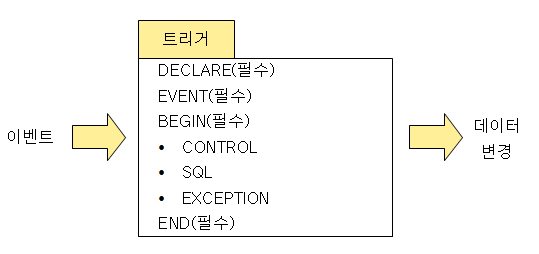
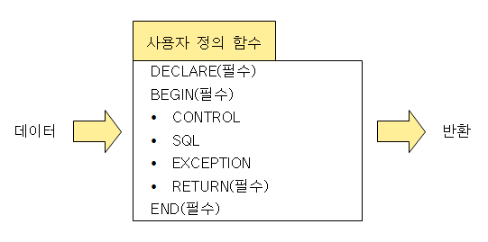

# 4. SQL 활용
## 114. 프로시저 (Procdure)
- 절차형 SQL을 활용해 특정 기능을 수행하는 일종의 트랜잭션 언어
- 호출을 통해 실행되어 미리 저장해 놓은 SQL 작업을 수행
- 여러 프로그램에서 호출하여 사용 가능
- 데이터베이스에 저장되어 수행되기 때문에 스토어드(Stored) 프로시저라고도 불림
- 시스템의 일일 마감 작업, 일괄(Batch) 작업 등 주로 사용

### 프로시저 구성

- DECLARE : 프로시저의 명칭, 변수, 인수, 데이터 타입을 정의하는 선언부
- DEGIN / END : 프로시저의 시작과 종료를 의미
- CONTROL : 조건문 또는 반복문이 삽입되어 순차적으로 처리
- SQL : DML, DCL이 삽입되어 데이터 관리를 위한 조회, 추가, 수정, 삭제 작업을 수행
- EXCEPTION : BEGIN ~ END 안의 구문 실행 시 예외가 발생하면 이를 처리하는 방법 정의
- TRANSACTION : 수행된 데이터 작업들을 DB에 적용할지 취소할지를 결정하는 처리부

### 프로시저 생성
> CREATE [OR REPLACE] PROCEDURE 프로시저명(파라미터)  
> [지역변수 선언]  
> BEGIN  
> &emsp;&nbsp;프로시저 BODY;  
> END;  
    
- CREATE PROCEDURE 명령어 사용
- 파라미터
    - IN : 호출 프로그램이 프로시저에게 값을 전달할 때 지정
    - OUT : 프로시저가 호출 프로그램에게 값을 전달할 때 지정
    - INOUT : 호출 프로그램이 프로시저에게 값을 전달, 프로시저 실행 후 호출 프로그램에 값을 반환할 때 지절
    - 매개변수명 : 호출 프로그램으로부터 전달받은 값을 저장할 변수의 이름 지정
    - 자료형 : 변수의 자료형 지정
- 프로시저 BODY
    - 프로시저 본문 코드를 기록하는 부분
    - BEGIN과 END 사이에 적어도 하나의 SQL 문이 있어야 함

### 프로시저 실행
- EXECUTE 프로시저명;
- EXEC 프로시저명;
- CALL 프로시저명;

### 프로시저 제거
- DROP PROCEDURE 프로시저명;

## 115. 트리거 (Trigger)
- 데이터베이스 시스템에서 데이터의 삽입, 갱신, 삭제 등의 이벤트가 발생할 때마다 관련 작업이 자동으로 수행되는 절차형 SQL
- 데이터베이스에 저장되며, 데이터 변경 및 무결성 뮤지, 로그 메시지 출력 등을 목적으로 사용됨
- DCL 사용불가
    - DCL이 포함된 프로시저나 함수를 호출하는 경우에도 오류 발생
- 오류가 있을 경우 트리거가 처리하는 데이터에도 영향을 미치므로 트리거 생성시 세심한 주의 필요

### 트리거 구성

- DECLARE : 트리거 명칭, 변수 및 상수, 데이터 타입을 정의하는 선언부
- EVENT : 트리거가 실행되는 조건 명시
- BEGIN / END : 트리거의 시작과 종료
- CONTROL : 조건문 또는 반복문이 삽입되어 순차적으로 처리됨
- SQL : DML문이 삽입되어 데이터 관리를 위한 조회, 추가, 수정, 삭제 작업을 수행
- EXCEPTION : BEGIN ~ END 안의 구문 실행 시 예외가 발생하면 이를 처리하는 방법 정의

### 트리거 생성
> CREATE [OR REPLACE] TRIGGER 트리거명 동작시기 동작 ON 테이블명  
> [REFERENCING NEW | OLD AS 테이블명]  
> [FOR EACH ROW [WHEN 조건식]]  
> BEGIN  
> &emsp;&nbsp;트리거 BODY;  
> END;  

- CREATE TRIGGER 명령어 사용
- 동작시기 : 트리거가 실행될 때 지정
    - AFTER : 테이블이 변경된 후에 트리거 실행
    - BEFORE : 테이블이 변경되지 건에 트리거 실행
- 동작 : 트리거가 실행되게 할 작업의 종류 지적
    - INSERT : 테이블에 새로운 튜플을 삽입할 때 트리거 실행
    - DELETE : 테이블의 튜플을 삭제할 때 트리거 실행
    - UPDATE : 테이블의 튜플을 수정할 때 트리거 실행
- NEW / OLD : 트리거가 적용될 테이블의 별칭 지정
    - NEW : 추가되거나 수정에 참여할 튜플들의 집합(테이블)을 의미
    - OLD : 수정되거나 삭제 전 대상이 되는 튜플들의 집합(테이블)을 의미
- WHEN 조건식 : Optional / 트리거를 적용할 튜플의 조건 지정
- 트리거 BODY
    - 트리거 본문 코드를 기록하는 부분
    - BEGIN과 END 사이에 적어도 하나의 SQL 문이 있어야 함

### 트리거 제거
- DROP TRIGGER 트리거명;

## 116. 사용자 정의 함수
- 프로시저와 유사하게 SQL을 사용하여 일련의 작업을 연속적으로 처리
- 종료 시 처리 결과를 단일값으로 반환하는 절차형 SQL
- 데이터베이스에 저장되며, SELECT, INSERT, DELETE, UPDATE등 DML 호출에 의해 실행됨
- 예약어 RETURN을 통해 값을 반환하기 때문에 출력 파라미터가 없음
- INSERT, DELETE, UPDATE를 통한 테이블 조작 불가
- SELECT를 통한 조회만 가능
- 프로시저를 호출하여 사용 불가
- SUM(), AVG() 등의 내장함수처럼 DML문에서 반환값을 활용하기 위한 용도로 사용

> 💡 프로시저 vs 사용자 정의 함수
> |구분|프로시저|사용자 정의 함수|
> |---|---|---|
> |반환값|업거나 1개 이상 가능|1개|
> |파라미터|입 · 출력 가능|입력만 가능|
> |사용 가능 명력문|DML, DCL|SELECT|
> |호출|프로시저, 사용자 정의 함수|사용자 정의 함수|
> |사용 방법|실행뭉|DML에 포함|

### 사용자 정의 함수 구성

- 프로시저 구성과 비슷
- 프로시저 구성에서 RETURN만 추가
- RETURN : 호출 프로그램에 반환할 값이나 변수를 정의

### 사용자 정의 함수 생성
> CREATE [OR REPLACE] FUNCTION 사용자 정의 함수명(파라미터)  
> [지역변수 선언]  
> BEGIN  
> &emsp;&nbsp;사용자 정의 함수 BODY;  
> &emsp;&nbsp;RETURN 반환값;  
> END;

### 사용자 정의 함수 실행
- SELECT 사용자 정의 함수명 FROM 테이블명;
- INSERT INTO 테이블명(속성명) VALUES (사용자 정의 함수명);
- DELETE FROM 테이블명 WHERE 속성명 = 사용자 정의 함수명;
- UPDATE 테이블명 SET 속성명 = 사용자 정의 함수명;

### 사용자 정의 함수 제거
- DROP FUNCTION 사용자 정의 함수명;

## 117. DBMS 접속 기술
