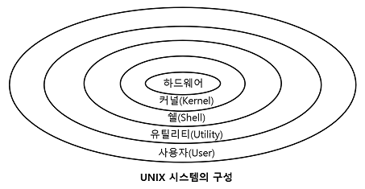

# 3. 응용 SW 기초 기술 활용
## 149. 운영체제 (OS; Operating System)의 개념
### 운영체제의 정의
- 컴퓨터 시스템의 자원(CPU, 주기억장치, 보조기억장치, 프린터, 파일 및 정보 등)들을 효율적으로 관리
- 사용자가 컴퓨터를 편리하고 효과적으로 사용할 수 있도록 환경을 제공하는 여러 프로그램의 모임
- 사용자와 컨퓨터 하드웨어 간의 인터페이스로서 동작하는 시스템 소프트웨어의 일정
- 다른 응용 프로그램이 유용한 작업을 할 수 있도록 환경 제공

### 운영체제 목적
|||
|---|---|
|처리 능력(throughput)|일정 시간 내에 시스템이 처리하는 일의 양|
|반환 시간(Turn Around Time)|시스템에 작업을 의뢰한 시간부터 처리가 완료될 때까지 걸린 시간|
|사용 가능도(Acailability)|시스템을 사용할 필요가 있을 때 즉시 사용 가능한 정도|
|신뢰도(Reliability)|시스템이 주어진 문제를 정확하게 해결하는 정도|

### 운영체제 구성
#### 1) 제어 프로그램 (Control Program)
- 감시 프로그램(Supervisor Program)
    - 제어프로그램 중 가장 핵심적인 역할
    - 자원의 할당 및 시스템 전체의 작동 상태를 감시하는 프로그램
- 작업 관리 프로그램(Job Management Program)
    - 작업이 정상적으로 처리될 수 있도록 작업의 순서와 방법을 관리하는 프로그램
- 데이터 관리 프로그램(Data Management Program)
    - 작업에 사용되는 데이터와 파일의 표준적인 처리 및 전송을 관리하는 프로그램

#### 2) 처리 프로그램 (Processing Program)
- 언어 번역 프로그램
    - 사용자가 고급언어로 작성한 원시 프로그램을 기계어 형태의 목적 프로그램으로 변환시키는 것
    - 컴파일러, 어셈블러, 인터프리터
- 서비스 프로그램
    - 사용자가 컴퓨터를 더욱 효율적으로 사용할 수 있도록 제작된 프로그램
    - 분류/병합(Sort/Merge), 유틸리티 프로그램

### 운영체제 기능
- 프로세서(처리기, Processor), 기억장치(주기억장치, 보조기억장치), 입 · 출력장치, 파일 및 정보 등의 자원을 관리
- 자원을 효율적으로 관리하기 위해 자원의 스케줄링 기능 제공
- 사용자와 시스템 간의 편리한 인터페이스 제공
- 시스템의 각종 하드웨어와 네트워크를 관리 · 제어
- 데이터를 관리, 데이터 및 자원의 공유 기능을 제공
- 시스템의 오류를 검사하고 복구
- 자원 보호 기능 제공
- 입 · 출력에 대한 보조 기능을 제공
- 가상 계산기 기능 제공

## 150. Windows
- 1990년대 마이크로소프트사가 개발한 운영체제

### Windows 주요 특징
- 그래픽 사용자 인터페이스(GUI; Graphic User Interface)
    - 키보드로 명령어를 직업 입력하지 않고, 마우스로 아이콘이나 메뉴를 선택하여 모든 작업을 수행하는 방식
    - 초보자도 쉽게 사용
- 선점형 멀티태스킹(Preemptive Multi-Tasking)
    - 멀티태스킹을 하면서 운영체제가 각 작업의 CPU 이용 시간을 제어하여 응용 프로그램 실행 중 문제가 발생하면 해당 프로그램을 강제 종료시키고 모든 시스템 자원을 반환하는 방식
    - 하나의 응용 프로그램이 CPU를 독점하는 것을 방지할 수 있어 시스템 다운 현상없이 더욱 안정적인 작업 가능
- PnP(Plug and Play, 자동 감지 기능)
    - 컴퓨터 시스템에 프린터나 사운드 카드 등의 하드웨어를 설치했을 때, 해당 하드웨어를 사용하는 데 필요한 시스템 환경을 운영체제가 자동으로 구성해 주는 기능
    - 운영체제가 하드웨어의 규격을 자동으로 인식하여 동작하게 해주므로 PC 주변 장치를 연결할 때 사용자가 직접 환경을 설정하지 않아도 됨
    - 하드웨어와 소프트웨어 모두 PnP를 지원하여야 함
- OLE(Object Linking and Embedding)
    - 다른 여러 응용 프로그램에서 작성된 문자나 그림 등의 개체(Object)를 현재 작성 중인 문서에 자유롭게 연결(Linking)하거나 삽입(Embedding)하여 편집할 수 있게 하는 기능
- 255자의 긴 파일명
- Single-User 시스템

## 151. UNIX / LINUX / MacOS
### UNIX의 개요 및 특징
- 1960년대 AT&T 벨(Bell)연구소, MIT, General Eletric이 공동 개발
- 시분할 시스템(Time Sharing System)을 위해 설계된 대화식 운영체제
- 소스가 공개된 개방형 시스템(Open System)
- 대부분 C언어로 작성되어 있어 이식성이 높으며 장치, 프로세스 간의 호환성이 높음
- 크기가 작고 이해하기 쉬움
- 다중 사용자(Multi-User), 다중 작업(Multi-Tasking) 지원
    - 여러 사용자가 동시에 시스템을 사용하고, 여러개의 작업이나 프로그램을 동시에 수행하는 것
    - 하나 이상의 작업을 백그라운드에서 수행하므로 여러 작업을 동시에 처리할 수 있음
- 통신망(Network) 관리용 운영체제로 적합
- 트리 구조의 파일 시스템을 갖음
- 전문적인 프로그램 개발에 용이
- 다양한 유틸리티 프로그램이 존재

#### 1) 커널(Kernel)
- UNIX의 가장 핵심적인 부분
- 컴퓨터가 부팅될 때 주기억장치에 적재된 후 상주하면서 실행됨
- 하드웨어를 보호하고, 프로그램과 하드웨어 간의 인터페이스 역할 담당
- 프로세스(CPU 스케줄링)관리, 기억장치 관리, 파일 관리, 입 · 출력 관리, 프로세스 간 통신, 데이터 전송 및 변환 등 기능 수행

#### 2) 쉘(Shell)
- 사용자의 명령어를 인식하여 프로그램을 호출하고 명령을 수행하는 명령어 해석기
- 시스템과 사용자 간의 인터페이스 담당
- DOS의 COMMAND.COM과 같은 기능 수행
- 주기억장치에 상주하지 않고, 명령어가 포함된 파이 형태로 존재하며 보조 기억장치에서 교체 처리가 가능
- 파이프라인 기능을 지원하고 입 · 출력 재지정을 통해 출력과 입력의 방향을 변경할 수 있음
- 공용 Shell(Courne Shell, C Shell, Korn Shell)이나 사용자 자신이 만든 Shell을 사용할 수 있음

#### 3) Utility Program
- 일반 사용자가 작성한 응용 프로그램을 처리하는데 사용
- DOS에서의 외부 명령어에 해당
- 에디터, 컴파일러, 인터프리터, 디버거

> 💡 UNIX에서 프로세스 간 통신
> - 각 프로세스는 시스템 호출을 통해 커널의 기능을 사용
> - 시그널(Signal) : 간단한 메시지를 이용해 통신하는 것. 초기 UNIX 시스템에서 사용됨
> - 파이프(Pipe) : 한 프로세스의 출력이 다른 프로세스의 입력으로 사용되는 단방향 통신 방법
> - 소켓(Socket) : 프로세스 사이의 대화를 가능하게 하는 쌍방향 통신 방법

### LINUX의 개요 및 특징
- 1991년 리누스 토발즈(Linus Torvalds)가 UNIX를 기반으로 개발
- 무료 공개되어 있기에 프로그래머가 원하는 기능을 추가 가능
- 다양한 플랫폼에 설치하여 사용 가능
- 재배포가 가능
- UNIX와 완벽하게 호환
- 대부분의 특징이 UNIX와 동일

### MacOS의 개요 및 특징
- 1980년대 애플 사가 UNIX를 기반으로 개발
- 아이맥과 맥북 등 애플 사에서 생산하는 제품에서만 사용 가능
- 드라이버 설치 및 install과 uninstall 과정이 단순

> 💡 파일 디스크립터(File Descriptor, 파일 서술자)
> - 파일을 관리하기 위한 시스템이 필요로 하는 파일에 대한 정보를 가진 제어 블록
> - 파일 제어 블록(FCB; File Control Block)
> - 파일마다 독립적으로 존재
> - 시스템에 따라 다른 구조
> - 보조기억장치 내에 저장되어 있다가 해당 파일이 Open될 때 주기억장치로 옮겨짐
> - 파일 시스템이 관리하므로 사용자가 직접 참조 불가

## 152. 기억장치 관리의 개요

- 계층 구조에서 상위의 기억장치일수록 접근 속도와 접근 시간이 빠르지만, 기억 용량이 적고 고가
- 주기억장치는 각기 자신의 주소를 갖는 워드 또는 바이트들로 구성되어 있으며, 주소를 이용해 액세스 함
- 레지스터, 캐시 기억장치, 주기억장치의 프로그램과 데이터는 CPU가 직접 액세스 가능하나, 보조기억장치에 있는 프로그램이나 데이터는 직접 엑세스 불가
- 보조기억장치에 있는 데이터는 주기억장치에 적재된 후 CPU에 의해 액세스 됨

### 기억장치 관리 전략의 개요
#### 1) 반입 (Fetch) 전략
- 보조기억장치에 보관중인 프로그램이나 데이터를 언제 주기억장치로 적재할 것인지 결정하는 전략
- 요구 반입(Demand Fetch) : 실행 중인 프로그램이 특정 프로그램이나 데이터 등의 참조를 요구할 때 적재
- 예상 반입(Anticipatory Fetch) : 실행 중인 프로그램에 의해 참조될 프로그램이나 데이터를 미리 예상하여 적재

#### 2) 배치 (Placement) 전략
- 새로 반입되는 프로그램이나 데이터를 주기억장치의 어디에 위치시킬 것인지 결정하는 전략
- 최초 적합(First Fit) : 빈 영역 중에서 첫 번째 분할 영역에 배치시키는 방법
- 최적 적합(Best Fit) : 빈 영역 중에서 단편화를 가장 작게 남기는 분할 영역에 배치시키는 방법
- 최악 적합(Worst Fit) : 빈 영역 중에서 단편화를 가장 많이 남기는 분할 영역에 배치시키는 방법

#### 3) 교체 (Replacement) 전략
- 주기억장치의 모든 영역이 이미 사용중인 상태에서 새로운 프로그램이나 데이터를 주기억장치에 배치하려고 할 때, 이미 사용되고 있는 영역 중에서 어느 영역을 교체하여 사용할 것인지 결정하는 전략
- FIFO, OPT, LRU, LFU, NUR, SCR 등

## 153. 주기억장치 할당 기법
- 프로그램이나 데이터를 실행시키기 위해 주기억장치에 어떻게 할당할 것인지
- 연속 할당 기법
    - 프로그램을 주기억장치에 연속으로 할당하는 기법
    - 단일 분할 할당 기법 : 오버레이, 스와핑
    - 다중 분할 할당 기법 : 고정 분할 할당 기법, 동적 분할 할당 기법
- 분산 할당 기법
    - 프로그램을 특정 단위의 조각으로 나누어 주기억장치 내에 분산하여 할당하는 기법
    - 페이징 기법, 세그멘테이션 기법

### 단일 분할 할당 기법
- 주기억장치를 운영체제 영역과 사용자 영역으로 나누어 한 순간에는 오직 한 명의 사용자만이 주기억장치의 사용자 영역을 사용하는 기법
- 가장 단순한 기법
- 초기 운영체제에서 많이 사용하던 기법
- 운영체제를 보호하고, 프로그램이 사용자 영역만을 사용하기 위해 운영체제 영역과 사용자 영역을 구분하는 경계 레지스터(Boundary Register)가 사용
- 프로그램의 크기가 작은 경우 사용자 영역이 낭비
- 초기에는 주기억장치보다 큰 사용자 프로그램은 실행할 수 없었으나 오버레이 기법을 사용하면서 문제 해결됨
#### 1) 오버레이 (Overlay) 기법
- 주기억장치보다 큰 사용자 프로그램을 실행하기 위한 기법
- 보조기억장치에 저장된 하나의 프로그램을 여러 개의 조각으로 분할한 후 필요한 조각을 차례로 주기억장치에 적재하여 프로그램을 실행
- 프로그램이 실행되면서 주기억장치의 공간이 부족하면 주기억장치에 적재된 프로그램의 조각 중 불필요한 조각이 위치한 장소에 새로운 프로그램의 조각을 중첩(Overlay)하여 적재
- 프로그램을 여러 조각으로 분할하는 작업은 프로그래머가 수행해야 하므로 시스템 구조나 프로그램 구조를 알아야 함

#### 2) 스와핑 (Sqapping) 기법
- 하나의 프로그램 전체를 주기억장치에 할당하여 사용하다 필요에 따라 다른 프로그램과 교체하는 기법
- 주기억장치 → 보조기억장치 : Swap Out
- 보고기억장치 → 주기억장치 : Swap In
- 하나의 사용자 프로그램이 완료될 때까지 교체 과정을 여러번 수행할 수 있음
- 가상기억장치의 페이징 기법으로 발전됨

### 다중 분할 할당 기법
#### 1) 고정 분할 할당 (Multiple contiguous Fixed parTition allocation, MFT) 기법 = 정적 할당 (Static Allocation) 기법
- 프로그램을 할당하기 전에 운영체제가 주기억장치의 사용자 영역을 여러 개의 고정된 크기로 분할하고 준비상태 큐에서 준비중인 프로그램을 각 영역에 할당하여 수행하는 기법
- 프로그램을 실행하려면 프로그램 전체가 주기억장치에 위치해야함
- 프로그램이 분할된 영역보다 커서 영역 안에 들어갈 수 없는 경우가 발생할 수 있음
- 일정한 크기의 분할 영역에 다양한 크리의 프로그램이 하당되므로 내부 단편화 및 외부 단편화가 발생하여 주기억장치의 낭비가 많음
    - 내부 단편화 : 분할된 영역이 할당될 프로그램 크기보다 커서 할당된 후 사용되지 않고 남아 있는 빈 공간
    - 외부 단편화 : 분할됭 영역이 할당될 프로그램 크기보다 작아서 할당된 수 없어 사용되지 않고 빈 공간으로 남아있는 분할된 전체 영역
- 실행할 프로그램의 크기를 미리 알고 있어야 함
- 다중 프로그래밍을 위해 사용되었으나 현재는 사용하지 않음

#### 2) 가변 분할 할당 (Multiple contifuous Variable parTition allocation, MVT) 기법 = 동적 할당 (Dynamic Allocation) 기법
- 단편화를 줄이기 위한것
- 미리 주기억장치를 분할해 높는 것이 아니라 프로그램을 주기억장치에 적재하면서 필요한 만큼의 크기로 영역을 분할하는 기법
- 주기억장치를 효율적으로 사용 가능
- 다중 프로그래밍의 정도를 높일 수 있음
- 고정 분할 할당 기법에 비해 실행될 프로세스 크기에 대한 제약이 적음
- 단편화를 상당 부분 해결할 수 있으나 영역과 영역 사이에 단편화가 발생될 수 있음

## 154. 가상기억장치 구현 기법 / 페이지 교체 알고리즘
### 가상기억장치의 개요
- 보조기억장치(하드디스크)의 일부를 주기억장치처럼 사용하는 것
- 용량이 작은 주기억장치를 마치 큰 용량을 가진 것처럼 사용하는 기법
- 프로그램을 여러 개의 작은 블록 단위로 나누어서 가상기억장치에 보관해 놓고, 프로그램 실행 시 요구되는 블록만 